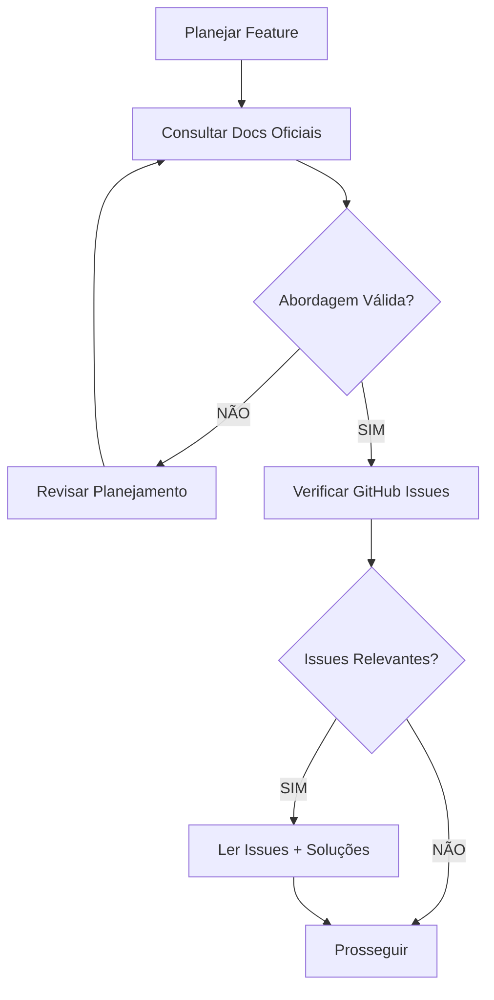
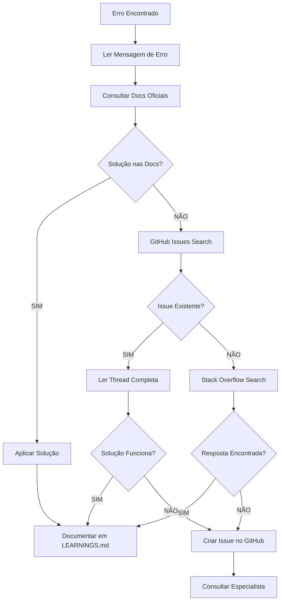

# 📚 Protocolo de Consulta de Documentações Oficiais

## 🎯 Objetivo

**TODO agente DEVE consultar documentações oficiais e repositórios GitHub** das bibliotecas/frameworks antes, durante e depois do desenvolvimento.

---

## ⚠️ REGRA CRÍTICA

**NUNCA assuma que conhece a biblioteca perfeitamente.**

Mesmo que você tenha conhecimento prévio, **SEMPRE**:
1. Consulte a documentação oficial
2. Verifique o GitHub da biblioteca
3. Leia changelogs e migration guides
4. Verifique issues abertas e fechadas

**"Documentação oficial > Memória do agente"**

---

## 📋 QUANDO CONSULTAR (5 Momentos Críticos)

### 1️⃣ ANTES DE INICIAR DESENVOLVIMENTO

**OBRIGATÓRIO**: Consultar documentação oficial

```markdown
## Checklist Pré-Desenvolvimento

- [ ] Li a documentação oficial da biblioteca?
- [ ] Verifiquei a versão instalada no projeto?
- [ ] Li o README.md do GitHub?
- [ ] Verifiquei breaking changes na versão atual?
- [ ] Li exemplos oficiais de uso?
- [ ] Entendi as best practices recomendadas?
```

**Exemplo**:

```bash
# Vou implementar autenticação com Better Auth
# ANTES de codificar:

# 1. Consultar docs oficiais
https://www.better-auth.com/docs

# 2. Verificar versão instalada
bun pm ls | grep better-auth

# 3. Ir ao GitHub
https://github.com/better-auth/better-auth

# 4. Ler exemplos
https://github.com/better-auth/better-auth/tree/main/examples

# 5. Verificar issues relacionadas
https://github.com/better-auth/better-auth/issues
```

---

### 2️⃣ DURANTE PLANEJAMENTO

**OBRIGATÓRIO**: Validar abordagem com documentação

```markdown
## Checklist de Planejamento

- [ ] A abordagem planejada está na documentação oficial?
- [ ] Há exemplos similares no GitHub?
- [ ] Existem padrões recomendados pela biblioteca?
- [ ] Há warnings ou deprecations a evitar?
- [ ] Performance considerations documentadas?
```

**Workflow**:



---

### 3️⃣ DURANTE DESENVOLVIMENTO

**OBRIGATÓRIO**: Consultar docs para cada método/função

```markdown
## Checklist Durante Dev

- [ ] Consultei docs para cada método usado?
- [ ] Verifiquei assinatura correta dos métodos?
- [ ] Li sobre parâmetros opcionais?
- [ ] Entendi o retorno esperado?
- [ ] Verifiquei possíveis exceções?
- [ ] Li exemplos de uso?
```

**Exemplo**:

```typescript
// ❌ ERRADO: Codificar sem consultar docs
const user = await db.users.findMany();

// ✅ CORRETO: Consultar docs antes
// 1. Ir para: https://orm.drizzle.team/docs/rqb#findmany
// 2. Ler sobre filtros, ordenação, paginação
// 3. Ver exemplos
// 4. Implementar corretamente

const users = await db.query.users.findMany({
  where: eq(users.active, true),
  orderBy: [desc(users.createdAt)],
  limit: 10,
  offset: 0,
  with: {
    posts: true // Relação documentada
  }
});
```

---

### 4️⃣ QUANDO ENCONTRAR PROBLEMAS

**OBRIGATÓRIO**: Consultar docs + GitHub issues

```markdown
## Checklist de Troubleshooting

- [ ] Consultei docs para entender o erro?
- [ ] Procurei no GitHub Issues por erro similar?
- [ ] Li discussões relacionadas?
- [ ] Verifiquei stack overflow (últimos 6 meses)?
- [ ] Testei soluções sugeridas na doc?
- [ ] Abri issue se bug não documentado?
```

**Workflow de Troubleshooting**:



**Exemplo**:

```bash
# Erro: "TypeError: elysia.get is not a function"

# 1. Consultar docs Elysia
https://elysiajs.com/essential/route.html

# 2. Buscar no GitHub Issues
https://github.com/elysiajs/elysia/issues?q=get+is+not+a+function

# 3. Se não encontrar, perguntar no Discord oficial
https://discord.gg/elysia

# 4. Documentar solução em LEARNINGS.md
```

---

### 5️⃣ APÓS IMPLEMENTAÇÃO (Code Review)

**OBRIGATÓRIO**: Validar contra best practices

```markdown
## Checklist Pós-Implementação

- [ ] Código segue best practices da documentação?
- [ ] Usei métodos recomendados (não deprecated)?
- [ ] Tratei erros conforme documentado?
- [ ] Performance considerations aplicadas?
- [ ] Security guidelines seguidas?
- [ ] Acessibilidade considerada (se UI)?
```

---

## 📖 DOCUMENTAÇÕES OFICIAIS DO PROJETO

### Stack Principal

| Tecnologia | Documentação | GitHub | Discord/Community |
|------------|--------------|--------|-------------------|
| **Bun** | https://bun.sh/docs | https://github.com/oven-sh/bun | https://bun.sh/discord |
| **Elysia.js** | https://elysiajs.com | https://github.com/elysiajs/elysia | https://discord.gg/elysia |
| **Drizzle ORM** | https://orm.drizzle.team | https://github.com/drizzle-team/drizzle-orm | https://discord.gg/drizzle |
| **Better Auth** | https://www.better-auth.com | https://github.com/better-auth/better-auth | GitHub Discussions |
| **PostgreSQL** | https://www.postgresql.org/docs | https://github.com/postgres/postgres | Mailing Lists |
| **Redis** | https://redis.io/docs | https://github.com/redis/redis | https://discord.gg/redis |
| **TimescaleDB** | https://docs.timescale.com | https://github.com/timescale/timescaledb | Slack Community |
| **TypeScript** | https://www.typescriptlang.org/docs | https://github.com/microsoft/TypeScript | GitHub Discussions |
| **Zod** | https://zod.dev | https://github.com/colinhacks/zod | GitHub Discussions |

### Frontend (Planejado)

| Tecnologia | Documentação | GitHub |
|------------|--------------|--------|
| **Astro** | https://docs.astro.build | https://github.com/withastro/astro |
| **React** | https://react.dev | https://github.com/facebook/react |
| **Tailwind CSS** | https://tailwindcss.com/docs | https://github.com/tailwindlabs/tailwindcss |
| **shadcn/ui** | https://ui.shadcn.com | https://github.com/shadcn/ui |
| **Material Tailwind** | https://material-tailwind.com | https://github.com/creativetimofficial/material-tailwind |
| **Vite** | https://vitejs.dev | https://github.com/vitejs/vite |

### Trading & AI

| Tecnologia | Documentação | GitHub |
|------------|--------------|--------|
| **CCXT** | https://docs.ccxt.com | https://github.com/ccxt/ccxt |
| **Mastra.ai** | https://mastra.ai/docs | https://github.com/mastra-ai/mastra |
| **TradingView Lightweight Charts** | https://tradingview.github.io/lightweight-charts/ | https://github.com/tradingview/lightweight-charts |
| **ECharts** | https://echarts.apache.org/en/option.html | https://github.com/apache/echarts |

---

## 🔍 COMO PESQUISAR EFETIVAMENTE

### GitHub Issues Search

**Syntax avançada**:

```
# Buscar erro específico
is:issue "error message here"

# Buscar issues abertas recentemente
is:issue is:open created:>2024-01-01

# Buscar soluções (issues fechadas)
is:issue is:closed "your problem"

# Buscar por label
is:issue label:bug label:documentation

# Buscar discussões
is:discussion "how to implement feature"
```

**Exemplo**:

```bash
# Procurar erro no Drizzle
https://github.com/drizzle-team/drizzle-orm/issues?q=is%3Aissue+connection+timeout

# Procurar feature no Elysia
https://github.com/elysiajs/elysia/discussions?discussions_q=websocket
```

---

### Stack Overflow Search

**Filtros úteis**:

```
# Resultados recentes (últimos 6 meses)
[library-name] created:6m..

# Respostas aceitas
[library-name] hasaccepted:yes

# Ordenar por votos
[library-name] your-problem sort:votes
```

**Exemplo**:

```
elysia cors configuration hasaccepted:yes
drizzle postgresql migration created:6m..
```

---

### Documentação Local (AI-Assisted)

```bash
# Usar Claude Code para buscar nas docs
/research "how to implement rate limiting in Elysia.js"

# Usar WebFetch para docs online
# (Claude Code fará automaticamente se precisar)
```

---

## 🛠️ FERRAMENTAS DE CONSULTA

### 1. Claude Code Commands

```bash
# Pesquisa deep nas docs oficiais
/research "Drizzle ORM many-to-many relationships"

# Troubleshooting com consulta de docs
/troubleshoot "CCXT InsufficientFunds error"

# Análise de biblioteca
/analyze "Better Auth session management"
```

### 2. GitHub CLI

```bash
# Instalar gh
brew install gh

# Buscar issues
gh issue list --repo owner/repo --search "error message"

# Ver detalhes de issue
gh issue view 123 --repo owner/repo

# Criar issue se necessário
gh issue create --repo owner/repo --title "Bug: ..." --body "..."
```

### 3. API Documentation Browsers

```bash
# DevDocs (offline docs)
https://devdocs.io/

# Dash (macOS)
https://kapeli.com/dash

# Zeal (Linux/Windows)
https://zealdocs.org/
```

---

## 📝 DOCUMENTANDO DESCOBERTAS

**SEMPRE documente em LEARNINGS.md**:

```markdown
## [2025-10-12] Drizzle ORM - Connection Pooling

### Problema
Connection timeout após 10 conexões simultâneas.

### Solução
Configurar max connections no pool:

\```typescript
const db = drizzle(client, {
  schema,
  pool: {
    max: 20, // Documentado em: https://orm.drizzle.team/docs/connection-pooling
    idleTimeoutMillis: 30000
  }
});
\```

### Referências
- Docs: https://orm.drizzle.team/docs/connection-pooling
- GitHub Issue: https://github.com/drizzle-team/drizzle-orm/issues/123
- PostgreSQL Docs: https://www.postgresql.org/docs/current/runtime-config-connection.html

### Lições Aprendidas
- Sempre configurar pool explicitamente
- Default é 10, inadequado para produção
- Monitorar métricas de conexão
```

---

## ✅ CHECKLIST FINAL

**Antes de considerar tarefa completa**:

- [ ] Consultei docs oficiais de TODAS as bibliotecas usadas?
- [ ] Verifiquei GitHub de bibliotecas críticas?
- [ ] Li exemplos oficiais?
- [ ] Pesquisei issues relacionadas?
- [ ] Testei conforme documentado?
- [ ] Documentei descobertas em LEARNINGS.md?
- [ ] Código segue best practices documentadas?

**Se QUALQUER checkbox = NÃO**: 🚫 Retorne e consulte

---

## 🎯 CULTURA DE APRENDIZADO

### Princípios

1. **Humildade**: Admitir que não sabe tudo
2. **Curiosidade**: Explorar docs mesmo quando "sabe"
3. **Diligência**: Ler docs completas, não apenas skim
4. **Compartilhamento**: Documentar para ajudar outros
5. **Atualização**: Docs mudam, revisar regularmente

### Anti-Patterns a Evitar

❌ **"Eu já sei como isso funciona"**
✅ Verificar docs mesmo assim

❌ **"Vou tentar e ver o que acontece"**
✅ Ler docs primeiro, experimentar depois

❌ **"Copiar código do Stack Overflow sem entender"**
✅ Ler docs oficiais, entender, adaptar

❌ **"Documentação é chata, prefiro tutorial no YouTube"**
✅ Docs oficiais > Tutoriais de terceiros

❌ **"Isso está funcionando, não preciso saber por quê"**
✅ Entender o "por quê" consultando docs

---

## 🚨 CONSEQUÊNCIAS DE NÃO CONSULTAR DOCS

### Exemplos Reais de Problemas

1. **Uso de API deprecated**:
   - Problema: Código quebrou em update
   - Causa: Não leu changelog
   - Impacto: 2 horas de troubleshooting

2. **Security vulnerability**:
   - Problema: Autenticação bypassada
   - Causa: Não leu security guidelines
   - Impacto: Vulnerabilidade crítica

3. **Performance degradation**:
   - Problema: Queries lentas
   - Causa: Não leu performance best practices
   - Impacto: User experience ruim

4. **Breaking change em produção**:
   - Problema: Feature quebrou após deploy
   - Causa: Não verificou breaking changes na versão
   - Impacto: Rollback emergencial

---

## 🎓 CERTIFICAÇÃO DE BIBLIOTECA

**Antes de usar biblioteca em produção**:

```markdown
## Certificação: [Nome da Biblioteca]

**Agente**: [Seu nome]
**Data**: [Data]
**Biblioteca**: [Nome] @ [Versão]

### Conhecimento Adquirido

- [ ] Li documentação completa?
- [ ] Entendi conceitos principais?
- [ ] Testei exemplos oficiais?
- [ ] Li security guidelines?
- [ ] Entendi limitações?
- [ ] Sei onde buscar ajuda?

### Recursos Consultados

- [ ] Documentação oficial: [URL]
- [ ] GitHub README: [URL]
- [ ] Exemplos: [URLs]
- [ ] Issues relevantes: [URLs]
- [ ] Community forum: [URL]

### Nível de Confiança

- [ ] Básico: Posso usar features simples
- [ ] Intermediário: Posso implementar features médias
- [ ] Avançado: Posso resolver problemas complexos
- [ ] Expert: Posso contribuir com a biblioteca

**Status**: ✅ Certificado | 🟡 Em Progresso | ❌ Precisa Estudo

**Assinado**: [Seu nome]
```

---

**Gerado por**: Agente-CTO
**Data**: 2025-10-12
**Versão**: 1.0.0
**Protocolo**: AGENTS.md v1.1.0

**⚠️ Consulta de documentação oficial é OBRIGATÓRIA, não opcional**

**"A documentação oficial é a fonte única de verdade sobre uma biblioteca."**
