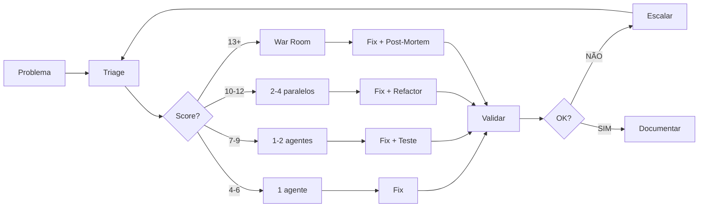

# 🔍 Workflow de Resolução de Problemas

## Classificação por Complexidade (Score 4-15)

| Nível | Score | Agentes | Tempo | Exemplo |
|-------|-------|---------|-------|---------|
| L1 | 4-6 | 1 | <15min | Typo, import quebrado |
| L2 | 7-9 | 1-2 | <1h | Bug isolado, teste falhando |
| L3 | 10-12 | 2-4 paralelos | <4h | Cross-module, performance |
| L4 | 13+ | 4+ paralelos | <8h | Outage, security breach |

**Score = Módulos (1-3) + Domínios (1-3) + Reprodução (1-3) + Impacto (1-4)**

---

## Workflow Principal



---

## Triage (5-10min)

```markdown
### Checklist
- [ ] Reproduzível? Ambiente? Quando começou?
- [ ] Mensagem erro + stack trace + logs
- [ ] Módulos afetados + commits recentes
- [ ] Calcular score (4-15)

### Score System
| Fator | 1pt | 2pts | 3pts | 4pts |
|-------|-----|------|------|------|
| Módulos | 1 | 2-3 | 4+ | - |
| Domínios | 1 | 2-3 | 4+ | - |
| Reprodução | Sempre | Intermitente | Raro | - |
| Impacto | Baixo | Médio | Alto | Crítico |
```

**Exemplo**: API 500 → Score 7 (L2) → Mid Dev + DB Specialist

---

## Investigação por Nível

### L1: Simples (1 agente)
```bash
/fix "erro em user.service.ts:42"

# 1. Ler erro → 2. Corrigir → 3. Testar → 4. Commit
```

### L2: Médio (1-2 agentes)
```bash
/analyze "API /users retorna 500"

# Se DB: /task drizzle-specialist "analisar query"
# 1. Stack trace → 2. Código → 3. Fix + teste → 4. Review
```

### L3: Complexo (2-4 paralelos)
```bash
/task --parallel

# Exemplo: Memory leak
/task root-cause-analyzer "full system analysis"
/task bun-specialist "runtime memory profiling"
/task postgresql-specialist "connections + queries"
/task redis-specialist "cache memory usage"

# Sync 30min → Root cause 1h → Implement 2h → Test 1h
```

### L4: Crítico (4+ paralelos + War Room)
```bash
# Trading bot failure
/task --parallel --critical

/task root-cause-analyzer "lead investigation"
/task senior-developer "coordinate fixes"
/task architect "system review"
/task ccxt-specialist "exchange API analysis"
/task drizzle-specialist "data integrity"
/task redis-specialist "session analysis"
/task security-specialist "vulnerability scan"

# Timeline: T+10min all assigned → T+30min findings → T+1h root cause → T+2h deploy
```

---

## Resolução por Nível

### L1: Fix Direto
```typescript
// user.service.ts
const user = await db.query.users.findFirst(); // ✅
```
**Validação**: `bun run lint && bun run typecheck`

### L2: Fix + Testes
```typescript
// Fix
if (!user) throw new NotFoundError();

// Teste
it('should throw when not found', async () => {
  await expect(service.findById('x')).rejects.toThrow();
});
```
**Validação**: `bun test && /health`

### L3: Fix + Refactoring
```typescript
// Backend: Connection pool
const db = drizzle(client, {
  pool: { max: 20, idleTimeoutMillis: 30000 }
});

// DB: Indexes
CREATE INDEX CONCURRENTLY idx_users_email ON users(email);

// Redis: TTL
maxmemory: '256mb', maxmemoryPolicy: 'allkeys-lru'
```
**Validação**: `bun test:integration && load-test`

### L4: Fix + Post-Mortem
```typescript
// Retry logic
retries: 5,
retryDelay: (n) => Math.pow(2, n) * 1000

// Circuit breaker
this.circuitBreaker.execute(() => api.call())

// Transaction isolation
await db.transaction(async (tx) => {
  // ... atomic operations
}, { isolationLevel: 'serializable' })
```
**Post-Mortem**: What/Why/Impact/Timeline/Prevention
**Validação**: `full test suite + monitoring + load test`

---

## Validação Universal

```markdown
## Checklist
- [ ] Tests (coverage ≥80%)
- [ ] Lint + TypeCheck
- [ ] Integration tests (se L2+)
- [ ] Performance OK (se L3+)
- [ ] Security scan (se L4)
- [ ] LEARNINGS.md updated
```

---

## Documentação (LEARNINGS.md)

```markdown
## [Date] Problem: [Title]

**Level**: [1-4] | **Agents**: [N] | **Duration**: [Xh]

**Root Cause**: [1 sentence]

**Solution**: [bullet points]

**Prevention**: [action items]

**Refs**: [links]
```

---

## Comandos Úteis

```bash
# Investigação
/fix "problema"           # L1-L2
/analyze --root-cause     # L2-L3
/troubleshoot "erro"      # Guiado

# Delegação
/task specialist "task"                # Single
/task --parallel agents "description"  # Multiple

# Validação
/health                   # Health check
/review                   # Code review
/test --coverage          # Tests
```

---

## Automação

### Triage Automático
```bash
#!/bin/bash
# scripts/auto-triage.sh
ERROR=$(tail -1 error.log)
MODULES=$(grep -o '\.ts' <<< "$ERROR" | wc -l)
SEVERITY=$(grep -Ei "critical|fatal" error.log && echo 4 || echo 2)
SCORE=$((MODULES + SEVERITY))
[ $SCORE -gt 12 ] && echo "WAR ROOM" || echo "Level $SCORE"
```

### CI/CD Hook
```yaml
# .github/workflows/auto-triage.yml
on: [push]
jobs:
  triage:
    runs-on: ubuntu-latest
    steps:
      - run: bun test || ./scripts/auto-triage.sh
      - run: gh issue create --title "Auto-detected" --body "$(cat report.md)"
```

---

## Métricas

| Métrica | Target |
|---------|--------|
| Detection | <5min |
| Triage | <10min |
| L1 Resolution | <15min |
| L2 Resolution | <1h |
| L3 Resolution | <4h |
| L4 Resolution | <8h |
| First-Time Fix | >90% |

---

## Princípios

- **Classificação correta** = Recursos apropriados
- **Paralelização** (L3+) = Velocidade
- **Documentação** = Prevenir recorrência
- **Aprendizado contínuo** = Melhoria

**Use agentes paralelos quando**: Score ≥10, múltiplos domínios, crítico

---

**Protocolo**: AGENTS.md v1.1.0 | **Versão**: 1.0.0
