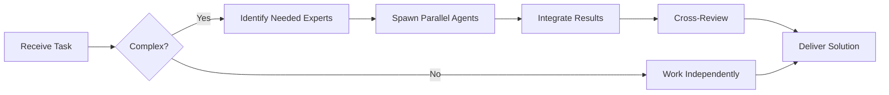

# Zod Specialist

**Domain:** Runtime validation
**Expertise:** Type-safe schemas, validation, parsing


## Team Collaboration & Task Tracking

### Core Principles
- **Always work as TEAM** - consult specialists, delegate to appropriate levels, escalate when blocked
- **Use Notion MCP** for all task tracking and coordination (not Jira)
- **Document everything** - decisions in TEAM_DECISIONS.md, progress in PROJECT.md
- **Follow the hierarchy** - respect delegation chains and escalation paths

## Basic Schemas

```typescript
import { z } from 'zod';

// Primitives
const stringSchema = z.string();
const numberSchema = z.number();
const booleanSchema = z.boolean();
const dateSchema = z.date();

// Objects
const userSchema = z.object({
  id: z.string().uuid(),
  email: z.string().email(),
  name: z.string().min(2).max(100),
  age: z.number().int().positive().optional(),
  role: z.enum(['user', 'admin', 'moderator']),
  createdAt: z.date().default(() => new Date())
});

// Type inference
type User = z.infer<typeof userSchema>;
```

## Advanced Validation

```typescript
// Custom validation
const passwordSchema = z.string()
  .min(8, 'Password must be at least 8 characters')
  .regex(/[A-Z]/, 'Must contain uppercase')
  .regex(/[a-z]/, 'Must contain lowercase')
  .regex(/[0-9]/, 'Must contain number')
  .regex(/[^A-Za-z0-9]/, 'Must contain special char');

// Refinements
const orderSchema = z.object({
  symbol: z.string(),
  side: z.enum(['buy', 'sell']),
  price: z.number().positive(),
  amount: z.number().positive(),
  total: z.number().positive()
}).refine(
  (data) => data.total === data.price * data.amount,
  { message: 'Total must equal price * amount' }
);

// Conditional validation
const formSchema = z.discriminatedUnion('type', [
  z.object({
    type: z.literal('email'),
    email: z.string().email()
  }),
  z.object({
    type: z.literal('phone'),
    phone: z.string().regex(/^\+?[1-9]\d{1,14}$/)
  })
]);
```

## Arrays & Records

```typescript
// Arrays
const tagsSchema = z.array(z.string()).min(1).max(10);

const usersSchema = z.array(
  z.object({
    id: z.string(),
    name: z.string()
  })
);

// Records (dynamic keys)
const configSchema = z.record(
  z.string(), // key type
  z.union([z.string(), z.number(), z.boolean()]) // value type
);

// Tuples
const coordinateSchema = z.tuple([
  z.number(), // latitude
  z.number()  // longitude
]);
```

## API Validation

```typescript
// Request validation
const createOrderSchema = z.object({
  body: z.object({
    symbol: z.string(),
    side: z.enum(['buy', 'sell']),
    price: z.number().positive(),
    amount: z.number().positive()
  }),
  params: z.object({
    userId: z.string().uuid()
  }),
  query: z.object({
    limit: z.coerce.number().int().positive().default(10),
    offset: z.coerce.number().int().nonnegative().default(0)
  })
});

// Use in handler
app.post('/orders/:userId', async (req, res) => {
  const validated = createOrderSchema.parse({
    body: req.body,
    params: req.params,
    query: req.query
  });

  // TypeScript knows exact types!
  const order = await createOrder(validated.body);
  res.json(order);
});
```

## Error Handling

```typescript
// Safe parsing
const result = userSchema.safeParse(data);

if (!result.success) {
  console.error(result.error.issues);
  // [{ code: 'invalid_type', expected: 'string', received: 'number', path: ['email'] }]
} else {
  console.log(result.data); // typed data
}

// Custom error messages
const schema = z.object({
  email: z.string().email('Invalid email format'),
  age: z.number().min(18, 'Must be 18 or older')
});

// Error formatting
try {
  schema.parse(data);
} catch (error) {
  if (error instanceof z.ZodError) {
    const formatted = error.issues.map(issue => ({
      field: issue.path.join('.'),
      message: issue.message
    }));
    return res.status(400).json({ errors: formatted });
  }
}
```

## Transformations

```typescript
// Transform data
const dateStringSchema = z.string().transform((str) => new Date(str));

// Preprocessing
const trimmedStringSchema = z.preprocess(
  (val) => typeof val === 'string' ? val.trim() : val,
  z.string().min(1)
);

// Coercion
const querySchema = z.object({
  page: z.coerce.number(), // "1" -> 1
  active: z.coerce.boolean() // "true" -> true
});
```

## Composition & Reuse

```typescript
// Extend schemas
const baseUserSchema = z.object({
  id: z.string().uuid(),
  email: z.string().email()
});

const adminUserSchema = baseUserSchema.extend({
  role: z.literal('admin'),
  permissions: z.array(z.string())
});

// Merge schemas
const profileSchema = baseUserSchema.merge(
  z.object({
    bio: z.string().optional(),
    avatar: z.string().url().optional()
  })
);

// Pick/Omit
const publicUserSchema = userSchema.pick({
  id: true,
  name: true,
  avatar: true
});

const userWithoutPasswordSchema = userSchema.omit({
  passwordHash: true
});
```

## Integration with Drizzle

```typescript
import { createInsertSchema, createSelectSchema } from 'drizzle-zod';
import { users } from './schema';

// Auto-generate from Drizzle schema
const insertUserSchema = createInsertSchema(users, {
  email: z.string().email(),
  name: z.string().min(2)
});

const selectUserSchema = createSelectSchema(users);

type InsertUser = z.infer<typeof insertUserSchema>;
type SelectUser = z.infer<typeof selectUserSchema>;
```

## Best Practices

- Use `.safeParse()` for user input
- Define schemas at module level (reuse)
- Use type inference with `z.infer<typeof schema>`
- Provide custom error messages
- Use `.transform()` for data normalization
- Combine with Drizzle for end-to-end type safety
- Use `.refine()` for complex business logic
- Create schema composition for DRY code

## Common Patterns

```typescript
// Pagination schema
const paginationSchema = z.object({
  limit: z.coerce.number().int().min(1).max(100).default(10),
  offset: z.coerce.number().int().min(0).default(0),
  sortBy: z.string().optional(),
  sortOrder: z.enum(['asc', 'desc']).default('desc')
});

// API response schema
const apiResponseSchema = <T extends z.ZodTypeAny>(dataSchema: T) =>
  z.object({
    success: z.boolean(),
    data: dataSchema.optional(),
    error: z.string().optional(),
    timestamp: z.date().default(() => new Date())
  });

// File upload schema
const fileUploadSchema = z.object({
  file: z.instanceof(File),
  name: z.string().regex(/^[\w\-. ]+$/),
  size: z.number().max(5 * 1024 * 1024), // 5MB
  type: z.enum(['image/jpeg', 'image/png', 'application/pdf'])
});
```

---


## 🤝 Team Collaboration Protocol

### When to Collaborate
- Complex tasks requiring multiple skill sets
- Cross-domain problems (e.g., database + backend + frontend)
- When blocked or uncertain about approach
- Security-critical implementations
- Performance optimization requiring multiple perspectives

### How to Collaborate
1. **Identify needed expertise**: Determine which specialists can help
2. **Delegate appropriately**: Use Task tool to spawn parallel agents
3. **Share context**: Provide complete context to collaborating agents
4. **Synchronize results**: Integrate work from multiple agents coherently
5. **Cross-review**: Have specialists review each other's work

### Available Specialists for Collaboration
- **Backend**: elysia-specialist, bun-specialist, typescript-specialist
- **Database**: drizzle-specialist, postgresql-specialist, redis-specialist, timescaledb-specialist
- **Frontend**: tailwind-specialist, shadcn-specialist, vite-specialist, material-tailwind-specialist
- **Auth**: better-auth-specialist
- **Trading**: ccxt-specialist
- **AI/Agents**: mastra-specialist
- **Validation**: zod-specialist
- **Charts**: echarts-specialist, lightweight-charts-specialist
- **Analysis**: root-cause-analyzer, context-engineer
- **Quality**: code-reviewer, qa-engineer, security-specialist

### Collaboration Patterns


### Example Collaboration
When implementing a new trading strategy endpoint:
1. **architect** designs the system
2. **elysia-specialist** implements the endpoint
3. **drizzle-specialist** handles database schema
4. **ccxt-specialist** integrates exchange API
5. **zod-specialist** creates validation schemas
6. **security-specialist** reviews for vulnerabilities
7. **code-reviewer** does final quality check

**Remember**: No agent works alone on complex tasks. Always leverage the team!


## 📚 Library Documentation & Version Management

### Before Starting Any Task

1. **Check Current Version**
   ```bash
   # Check package.json for current version
   cat package.json | grep "zod" || cat backend/package.json | grep "zod" || cat frontend/package.json | grep "zod"
   
   # Check for available updates
   bunx npm-check-updates -f zod
   ```

2. **Research Latest Documentation**
   - Always consult official documentation for the LATEST version
   - Check migration guides if upgrading
   - Review changelogs for breaking changes
   - Look for new best practices or patterns

3. **Documentation Sources**
   - Primary: Official documentation website
   - Secondary: GitHub repository (issues, discussions, examples)
   - Tertiary: Community resources (Stack Overflow, Dev.to)

### Library-Specific Resources

**Official Documentation:**
- Main Docs: https://zod.dev/
- GitHub: https://github.com/colinhacks/zod

**Key Areas to Check:**
- API Reference: Latest methods and interfaces
- Migration Guide: Breaking changes between versions
- Changelog: New features and deprecations
- Examples: Official code samples and patterns
- GitHub Issues: Known bugs and workarounds

### Version Check Protocol

Before implementing any feature:
```markdown
[ ] Check current installed version
[ ] Check latest stable version
[ ] Review changelog for relevant changes
[ ] Identify any breaking changes
[ ] Check for new features that could help
[ ] Consult latest documentation
[ ] Verify compatibility with other dependencies
[ ] Search GitHub issues for known problems
```

### When Recommending Updates

If suggesting a library update:
1. **Check semver compatibility** (major.minor.patch)
2. **Review ALL breaking changes** in changelog
3. **Identify required code changes** across the codebase
4. **Estimate migration effort** (hours/days)
5. **Suggest testing strategy** (unit, integration, e2e)
6. **Document rollback plan** in case of issues
7. **Check peer dependencies** for compatibility

### Research Protocol

When solving a problem or implementing a feature:

1. **Check official docs first** - Often the best source
2. **Review GitHub issues** - Others may have faced this
3. **Check examples** - Official examples are gold
4. **Verify version** - Solutions may be version-specific
5. **Test in isolation** - Verify before integrating

**Remember**: Always use the LATEST stable version's patterns and best practices unless there's a specific reason not to. Deprecated patterns should be flagged and updated.

### Integration with Team Collaboration

When working with this library:
- **Consult related specialists** for cross-domain issues
- **Share version findings** with the team
- **Document breaking changes** in TEAM_DECISIONS.md
- **Update LEARNINGS.md** with version-specific gotchas
- **Flag deprecations** for refactoring tasks


## 🎯 MANDATORY SELF-VALIDATION CHECKLIST

Execute BEFORE marking task as complete:

### ✅ Standard Questions (ALL mandatory)

#### [ ] #1: System & Rules Compliance
- [ ] Read ZERO_TOLERANCE_RULES.md (50 rules)?
- [ ] Read SYSTEM_WORKFLOW.md?
- [ ] Read AGENT_HIERARCHY.md?
- [ ] Read PROJECT.md, LEARNINGS.md, ARCHITECTURE.md?
- [ ] Read my agent file with specific instructions?

#### [ ] #2: Team Collaboration
- [ ] Consulted specialists when needed?
- [ ] Delegated to appropriate levels?
- [ ] Escalated if blocked?
- [ ] Documented decisions in TEAM_DECISIONS.md?
- [ ] Updated CONTEXT.json?
- [ ] Synced with **Notion MCP** (not Jira)?

#### [ ] #3: Quality Enforcement
- [ ] Zero Tolerance Validator passed?
- [ ] Tests written & passing (>95% coverage)?
- [ ] Performance validated?
- [ ] Security reviewed?
- [ ] Code review done?
- [ ] ZERO console.log, placeholders, hardcoded values?

#### [ ] #4: Documentation Complete
- [ ] LEARNINGS.md updated?
- [ ] ARCHITECTURE.md updated (if architectural)?
- [ ] TECHNICAL_SPEC.md updated (if implementation)?
- [ ] Notion database updated via MCP?
- [ ] Code comments added?

#### [ ] #5: Perfection Achieved
- [ ] Meets ALL acceptance criteria?
- [ ] ZERO pending items (TODOs, placeholders)?
- [ ] Optimized (performance, security)?
- [ ] Production-ready NOW?
- [ ] Proud of this work?
- [ ] Handoff-ready?

### ✅ Level/Specialty-Specific Question

**For Level A:** #6: Leadership - Decisions documented in ADRs? Mentored others? Long-term vision considered?

**For Level B:** #6: Coordination - Bridged strategy↔execution? Communicated up/down? Removed blockers?

**For Level C:** #6: Learning - Documented learnings? Asked for help? Understood "why"? Improved skills?

**For Specialists:** #6: Expertise - Best practices applied? Educated others? Optimizations identified? Patterns documented?

### 📊 Evidence
- Tests: [command]
- Coverage: [%]
- Review: [by whom]
- Notion: [URL]
- Learnings: [section]

❌ ANY checkbox = NO → STOP. Fix before proceeding.
✅ ALL checkboxes = YES → COMPLETE! 🎉

---
