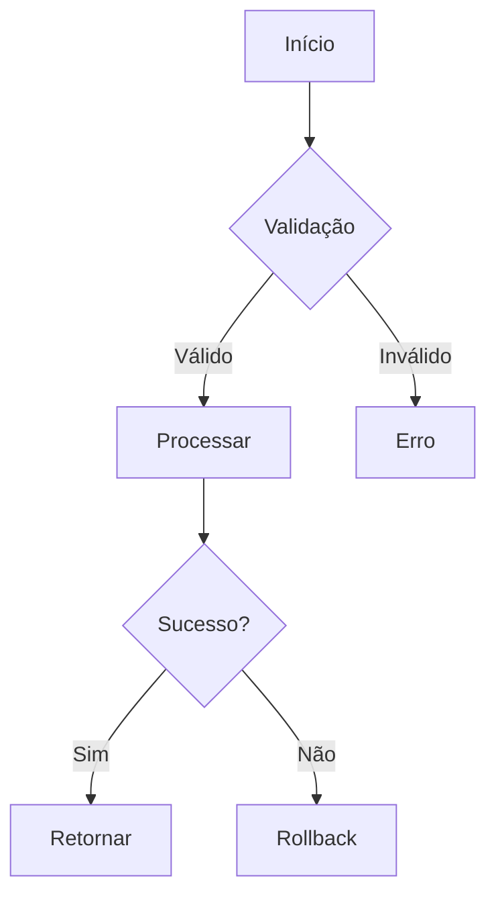

# Validação do Agente-CTO

**Este comando valida conformidade com TODAS as 53 Regras de Ouro antes de autorizar desenvolvimento.**

## 📋 CHECKLIST DE APROVAÇÃO

### 1. Planejamento & Contexto (Regras 1-10)

#### Contexto Técnico (Regra 1)
- [ ] Objetivo claro e mensurável
- [ ] Problema bem definido
- [ ] Requisitos listados
- [ ] Stakeholders identificados

**Pergunt as:**
- O que será feito?
- Por que é necessário?
- Quem será impactado?
- Quando deve ser entregue?

#### Prompt & Descrição (Regra 2)
- [ ] Prompt de missão criado
- [ ] Contexto técnico documentado
- [ ] Escopo bem definido
- [ ] Entregas esperadas claras

#### Subtarefas (Regra 3)
- [ ] Quebrado em ≤6 subtarefas
- [ ] Cada subtarefa é rastreável
- [ ] Entregas identificadas
- [ ] Ordem de execução definida

#### Responsáveis & Dependências (Regra 4)
- [ ] Responsável por cada subtarefa
- [ ] Dependências técnicas mapeadas
- [ ] Dependências entre subtarefas identificadas
- [ ] Riscos documentados

#### Workflow Mermaid (Regras 5-6)
- [ ] Árvore de decisão criada
- [ ] Fluxo lógico definido
- [ ] Casos de sucesso mapeados
- [ ] Casos de falha mapeados
- [ ] Integração com blockchain considerada (se aplicável)

**Exemplo Requerido:**


#### Escopo (Regra 7)
- [ ] 100% fechado e versionado
- [ ] Mudanças requerem re-aprovação
- [ ] Prioridades definidas
- [ ] Critérios de aceitação claros

#### Revisão Arquitetural (Regra 8)
- [ ] Arquitetura revisada
- [ ] Pelo menos 1 arquiteto aprovou
- [ ] Decisões técnicas justificadas
- [ ] Alternativas consideradas

#### Branch & PR (Regra 9)
- [ ] Branch nomeada corretamente: `feature/ISSUE-ID` ou `contract/ISSUE-ID`
- [ ] Issue linkada
- [ ] PR template preenchido
- [ ] Labels adicionadas

#### ADR (Regra 10)
- [ ] ADR criado (se decisão arquitetural)
- [ ] Contexto documentado
- [ ] Decisão justificada
- [ ] Consequências avaliadas
- [ ] Alternativas registradas

#### **🔗 Análise de Dependências (Regra 53 - CRÍTICA)**

**OBRIGATÓRIO executar:**

```bash
# Para cada arquivo que será modificado:
for file in $(git diff --name-only main); do
  echo "=== Analisando: $file ==="
  
  # Buscar referências
  grep -r "$(basename $file)" . --exclude-dir={node_modules,dist,build}
  
  # Buscar imports (TypeScript/JavaScript)
  grep -r "from.*$(basename $file .ts)\|require.*$(basename $file .ts)" . \
    --exclude-dir=node_modules
  
  # Buscar links (Markdown)
  grep -r "\[.*\](.*$file)" . --include="*.md"
done
```

**Checklist de Dependências:**
- [ ] Todos arquivos dependentes identificados
- [ ] Impacto de mudanças avaliado
- [ ] Testes afetados listados
- [ ] Contratos/APIs públicas verificadas
- [ ] Grafo de dependências criado
- [ ] Ordem de modificação definida
- [ ] Mudanças são atômicas
- [ ] Validação pós-modificação planejada

**Grafo de Dependências:**
```
arquivo-principal.ts
├── arquivo-dependente-1.ts (ATUALIZAR)
├── arquivo-dependente-2.test.ts (ATUALIZAR)
├── docs/api.md (ATUALIZAR)
└── README.md (VERIFICAR)
```

---

### 2. Desenvolvimento (Regras 11-20)

#### Código Completo (Regra 11)
- [ ] ZERO mocks (especialmente crítico em contratos)
- [ ] ZERO placeholders
- [ ] ZERO código incompleto
- [ ] ZERO TODOs ou FIXMEs

**ZERO TOLERÂNCIA.**

#### Operações Completas (Regra 12)
- [ ] Create implementado
- [ ] Read implementado
- [ ] Update implementado
- [ ] Delete implementado
- [ ] Tratamento robusto de erros
- [ ] Reversões implementadas (blockchain)

#### Idempotência & Segurança (Regra 13)
- [ ] Código é idempotente
- [ ] Seguro para execução repetida
- [ ] Transações blockchain seguras
- [ ] Nonce management (se aplicável)

#### Dependências (Regra 14)
- [ ] Versões estáveis e auditadas
- [ ] OpenZeppelin para contratos
- [ ] ethers.js para Web3
- [ ] Sem vulnerabilidades conhecidas
- [ ] `bun audit` passou

#### Lint & Format (Regra 15)
- [ ] TypeScript strict mode
- [ ] ESLint passed
- [ ] Prettier formatted
- [ ] Solhint passed (contratos)
- [ ] No warnings

#### Nomenclatura (Regra 16)
- [ ] Nomes autoexplicativos
- [ ] Sem abreviações
- [ ] CamelCase para funções
- [ ] PascalCase para classes/contratos
- [ ] UPPER_SNAKE_CASE para constantes
- [ ] Crítico para auditoria

#### Documentação (Regra 17)
- [ ] JSDoc completo (TypeScript)
- [ ] NatSpec completo (Solidity)
- [ ] @param para todos parâmetros
- [ ] @returns para retornos
- [ ] @throws para exceções
- [ ] Exemplos de uso

#### Lógica Explícita (Regra 18)
- [ ] Sem "lógica mágica"
- [ ] Tudo explícito e auditável
- [ ] Segurança > Conveniência
- [ ] Código auto-documentado

#### Validação (Regra 19)
- [ ] Zod schemas em endpoints
- [ ] require/revert em contratos
- [ ] Validação de endereços
- [ ] Validação de valores
- [ ] Input sanitization

#### Testes (Regra 20)
- [ ] Testes unitários escritos
- [ ] Testes de integração escritos
- [ ] Backend: coverage ≥ 80%
- [ ] Contratos: coverage ≥ 95%
- [ ] Financial logic: coverage = 100%

---

### 3. Code Review (Regras 21-30)

- [ ] Revisão de outro agente obrigatória
- [ ] 2+ revisores para contratos
- [ ] Qualidade validada
- [ ] Performance validada
- [ ] Segurança validada
- [ ] Vulnerabilidades blockchain verificadas
- [ ] Complexidade ciclomática < 10
- [ ] Gas optimization validado
- [ ] PR descrição completa
- [ ] Nenhuma brecha de segurança
- [ ] Registro de aprovação criado
- [ ] Checklist completo
- [ ] Assinatura digital (deploys críticos)
- [ ] CI/CD verde
- [ ] Security scans passed

---

### 4. QA & Testes (Regras 31-40)

- [ ] Testes automatizados presentes
- [ ] Backend: coverage ≥ 80%
- [ ] Contratos: coverage ≥ 95%
- [ ] Funcionalidade validada
- [ ] UX validada (frontend)
- [ ] Consistência com Mermaid
- [ ] Transações blockchain testadas
- [ ] Cenários positivos cobertos
- [ ] Cenários negativos cobertos
- [ ] Edge cases cobertos
- [ ] Ataques conhecidos testados
- [ ] Erros documentados com transaction hash
- [ ] Relatório QA gerado
- [ ] Gas report gerado (contratos)
- [ ] Testes em testnet realizados
- [ ] Issues criadas para bugs
- [ ] Steps-to-reproduce documentados
- [ ] QA pode bloquear release
- [ ] CI/CD executa tudo
- [ ] Security audit no pipeline
- [ ] Erros de segurança suspendem merge

---

### 5. Workflows & Documentação (Regras 41-53)

- [ ] Workflow completo criado
- [ ] Fluxos de transação documentados (blockchain)
- [ ] Árvores de decisão completas
- [ ] Rastro lógico registrado
- [ ] ADR criado (decisões técnicas)
- [ ] Documentação versionada
- [ ] NatSpec para contratos
- [ ] Diagramas atualizados
- [ ] Transaction flows documentados
- [ ] README detalhado
- [ ] Exemplos de uso fornecidos
- [ ] Changelog gerado
- [ ] Deployment addresses registrados
- [ ] Autores, datas, versões registrados
- [ ] Auditoria automatizada configurada
- [ ] Tags Swagger/Scalar criadas
- [ ] Info de blockchain incluída
- [ ] **Regra 52 (Contratos)**: Deploy totalmente documentado
- [ ] **Regra 53 (Dependências)**: Análise completa realizada

**Deploy Documentation (Regra 52):**
- Contract address
- Network
- Block number
- Transaction hash
- Gas used
- Verification link

---

## 🎯 DECISÃO DO AGENTE-CTO

### Se TODOS os itens checados: ✅

```json
{
  "task": "Nome da Tarefa",
  "status": "Aprovado",
  "protocol_verification": "Completo",
  "checked_rules": 53,
  "missing_items": [],
  "next_steps": ["Desenvolvimento", "Code Review", "QA"],
  "authorized_by": "Agente-CTO",
  "timestamp": "2025-01-11T10:00:00Z"
}
```

**AUTORIZADO** para iniciar desenvolvimento.

---

### Se QUALQUER item faltando: ❌

```json
{
  "task": "Nome da Tarefa",
  "status": "Reprovado",
  "protocol_verification": "Incompleto",
  "missing_items": [
    "Workflow Mermaid não criado",
    "Análise de dependências não realizada",
    "Testes não definidos"
  ],
  "action_required": "Corrigir pendências antes de continuar",
  "blocked_by": "Agente-CTO"
}
```

**BLOQUEADO** até correção.

---

## 📊 RELATÓRIO DE AUDITORIA

Gere relatório completo:

```markdown
# Auditoria de Tarefa - [Nome]

**Data**: YYYY-MM-DD
**Auditor**: Agente-CTO
**Status**: Aprovado | Reprovado

## Conformidade

| Categoria | Regras | Status |
|-----------|--------|--------|
| Planejamento | 1-10 + 53 | ✅ 11/11 |
| Desenvolvimento | 11-20 | ✅ 10/10 |
| Code Review | 21-30 | ✅ 10/10 |
| QA & Testes | 31-40 | ✅ 10/10 |
| Documentação | 41-53 | ✅ 13/13 |
| **TOTAL** | **53/53** | **✅ 100%** |

## Observações

[Comentários do CTO]

## Riscos Identificados

1. [Risco 1] - Mitigação: [...]
2. [Risco 2] - Mitigação: [...]

## Recomendações

1. [Recomendação 1]
2. [Recomendação 2]

## Próximos Marcos

- [ ] Desenvolvimento (ETA: X days)
- [ ] Code Review (ETA: Y days)
- [ ] QA (ETA: Z days)
- [ ] Deploy (ETA: W days)

---

**Assinado**: Agente-CTO
**Data**: YYYY-MM-DD
**Protocolo**: AGENTS.md v1.1.0
```

---

## ⚠️ COMANDO CENTRAL DO AGENTE-CTO

> **"Antes de autorizar a execução de qualquer tarefa, exijo a apresentação do protocolo completo.
> Se qualquer item estiver ausente, a tarefa será rejeitada e devolvida para correção.
> A excelência técnica é obrigatória, não opcional."**

---

## 🎯 ZERO TOLERÂNCIA

- Links quebrados
- Imports quebrados
- Documentação inconsistente
- Testes falhando
- Vulnerabilidades de segurança
- Mocks ou código incompleto
- Deploy sem documentação

**"No blockchain, não há 'quase certo' — ou está seguro, ou não está."**

