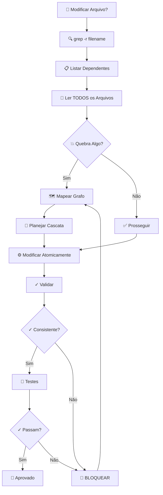

# Análise de Dependências

**Siga a Regra 53 do AGENTS.md: Análise obrigatória antes de modificar qualquer arquivo**

## 🎯 Ferramentas Disponíveis

### Script Automatizado (RECOMENDADO)
```bash
./scripts/analyze-deps.sh <arquivo>
```

### Workflow Visual



## Uso

Forneça o arquivo que deseja modificar e este comando analisará todas as dependências.

## Processo

### 1. Identificar Arquivo Alvo

Qual arquivo você pretende modificar?
- Nome do arquivo: ________________

### 2. Buscar Referências

```bash
# Buscar referências diretas
grep -r "FILENAME" . --exclude-dir={node_modules,dist,build,.git}

# Buscar imports/requires (TypeScript/JavaScript)
grep -r "from.*FILENAME\|require.*FILENAME\|import.*FILENAME" . \
  --include="*.ts" --include="*.js" --exclude-dir=node_modules

# Buscar links em markdown
grep -r "\[.*\](.*FILENAME)" . --include="*.md"

# Buscar em tipos específicos
rg "FILENAME" -t ts -t js -t md
```

### 3. Analisar Impacto

Para cada arquivo encontrado, responda:

**Arquivo**: _________________

- [ ] Li o arquivo completamente?
- [ ] Entendi como usa o arquivo alvo?
- [ ] A modificação quebrará essa dependência?
- [ ] Precisa ser atualizado também?
- [ ] Há testes afetados?
- [ ] Há documentação afetada?

### 4. Criar Grafo de Dependências

```
arquivo-alvo.ts
├── arquivo-dependente-1.ts
│   ├── Tipo de dependência: import
│   ├── Impacto: ALTO
│   └── Ação: ATUALIZAR
├── arquivo-dependente-2.test.ts
│   ├── Tipo de dependência: import
│   ├── Impacto: MÉDIO
│   └── Ação: ATUALIZAR TESTES
├── docs/api.md
│   ├── Tipo de dependência: link
│   ├── Impacto: BAIXO
│   └── Ação: VERIFICAR
└── README.md
    ├── Tipo de dependência: referência
    ├── Impacto: BAIXO
    └── Ação: VERIFICAR
```

### 5. Planejar Atualizações em Cascata

**Ordem de Execução:**

1. [ ] Modificar arquivo alvo
2. [ ] Atualizar arquivo-dependente-1.ts
3. [ ] Atualizar arquivo-dependente-2.test.ts
4. [ ] Atualizar docs/api.md
5. [ ] Verificar README.md

**Garantir Atomicidade:**
- Todas as mudanças no mesmo commit
- Testes passam antes do commit
- Rollback fácil se necessário

### 6. Validar Pós-Modificação

```bash
# Re-executar análise
grep -r "FILENAME" . --exclude-dir={node_modules,dist,build}

# Validar imports
bun run typecheck

# Validar testes
bun test

# Validar lint
bun run lint

# Validar links
grep -r "\[.*\](.*FILENAME)" . --include="*.md"
```

**Checklist Final:**
- [ ] Zero referências quebradas
- [ ] Zero imports quebrados
- [ ] Zero links inválidos
- [ ] Testes passando
- [ ] Build funcionando

---

## Exemplo Prático

### Modificar: `src/services/exchange.service.ts`

#### Passo 1: Buscar Referências
```bash
$ grep -r "exchange.service" . --exclude-dir=node_modules

./src/modules/bot/bot.service.ts:import { exchangeService } from '../services/exchange.service';
./src/modules/trade/trade.service.ts:import { exchangeService } from '../services/exchange.service';
./src/index.ts:import { exchangeService } from './services/exchange.service';
./src/services/exchange.service.test.ts:import { exchangeService } from './exchange.service';
./docs/API.md:[Exchange Service](../src/services/exchange.service.ts)
```

#### Passo 2: Arquivos Identificados
- `bot.service.ts` - ATUALIZAR
- `trade.service.ts` - ATUALIZAR
- `index.ts` - VERIFICAR
- `exchange.service.test.ts` - ATUALIZAR TESTES
- `docs/API.md` - VERIFICAR LINK

#### Passo 3: Ler Todos os Arquivos
```bash
# Ler cada arquivo identificado
bat src/modules/bot/bot.service.ts
bat src/modules/trade/trade.service.ts
# ... etc
```

#### Passo 4: Avaliar Impacto
- `bot.service.ts` usa `exchangeService.createOrder()`
- `trade.service.ts` usa `exchangeService.fetchBalance()`
- Se mudar assinatura de `createOrder()`, precisa atualizar `bot.service.ts`

#### Passo 5: Executar Mudanças Atomicamente
1. Modificar `exchange.service.ts`
2. Atualizar `bot.service.ts`
3. Atualizar `trade.service.ts`
4. Atualizar `exchange.service.test.ts`
5. Validar `docs/API.md`
6. Commit tudo junto

#### Passo 6: Validar
```bash
$ bun run typecheck  # ✅
$ bun test           # ✅
$ bun run lint       # ✅
```

---

## ⚠️ Consequências de NÃO Seguir

- ❌ Builds quebrados
- ❌ Imports quebrados
- ❌ Testes falhando
- ❌ Links inválidos
- ❌ Documentação desatualizada
- ❌ Rollback difícil
- ❌ Code review complicado

---

## Automação (Futuro)

```bash
#!/bin/bash
# scripts/check-dependencies.sh

FILE=$1
echo "🔍 Analisando dependências de: $FILE"
grep -r "$(basename $FILE)" . --exclude-dir={node_modules,dist}
```

**Uso:**
```bash
./scripts/check-dependencies.sh src/services/exchange.service.ts
```

