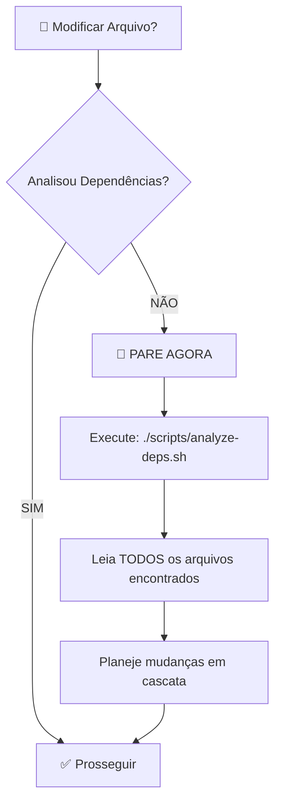

# Hook: Lembrete de Análise de Dependências

> **Tipo**: Lembrete manual (documentação de processo)
> **Regra**: AGENTS.md - Regra 53

## Objetivo

Este documento serve como lembrete do processo obrigatório de análise de dependências antes de modificar qualquer arquivo no projeto.

## ⚠️ LEMBRETE CRÍTICO

**ANTES de modificar QUALQUER arquivo, você DEVE:**

### 1️⃣ Executar Análise de Dependências

```bash
# Opção 1: Script automatizado
./scripts/analyze-deps.sh <arquivo>

# Opção 2: Comando Claude Code
/dev-analyze-dependencies

# Opção 3: Manual com grep
grep -r "nome-do-arquivo" . --exclude-dir=node_modules
```

### 2️⃣ Seguir o Workflow Visual



### 3️⃣ Checklist Obrigatório

Antes de fazer QUALQUER modificação:

- [ ] Executei análise de dependências?
- [ ] Li TODOS os arquivos dependentes?
- [ ] Entendi o impacto das mudanças?
- [ ] Planejei atualizações em cascata?
- [ ] Garanti atomicidade das mudanças?

### 4️⃣ Após Modificação

- [ ] Re-executei análise de dependências?
- [ ] Validei que não há referências quebradas?
- [ ] Executei: `bun run typecheck`?
- [ ] Executei: `bun test`?
- [ ] Executei: `bun run lint`?

## 🎯 Ferramentas Disponíveis

### Script Automatizado
```bash
./scripts/analyze-deps.sh src/services/exchange.service.ts
```

Fornece relatório completo de:
- ✓ Referências diretas
- ✓ Imports/requires
- ✓ Links em documentação
- ✓ Análise de impacto
- ✓ Próximos passos

### Comando Slash
```bash
/dev-analyze-dependencies
```

Processo guiado interativo seguindo a Regra 53.

### Manual (grep)
```bash
# Buscar referências
grep -r "arquivo" . --exclude-dir=node_modules

# Buscar imports
grep -r "from.*arquivo" . --include="*.ts"

# Buscar links
grep -r "\[.*\](.*arquivo)" . --include="*.md"
```

## ❌ Consequências de NÃO Seguir

- ❌ Builds quebrados
- ❌ Imports inválidos
- ❌ Testes falhando
- ❌ Links quebrados em documentação
- ❌ Referências inconsistentes
- ❌ Code review bloqueado
- ❌ Deploy impossível

## 📚 Documentação

- **AGENTS.md**: Regra 53 (linhas 893-968, 1030)
- **Comando**: [.claude/commands/dev-analyze-dependencies.md](./.claude/commands/dev-analyze-dependencies.md)
- **Script**: [scripts/analyze-deps.sh](./scripts/analyze-deps.sh)

---

**⚠️ ZERO TOLERÂNCIA para violações da Regra 53**

**No blockchain/trading, não há "quase certo" — ou está correto, ou não está.**
