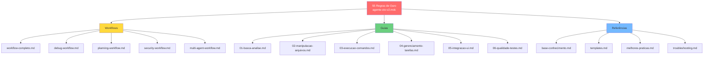
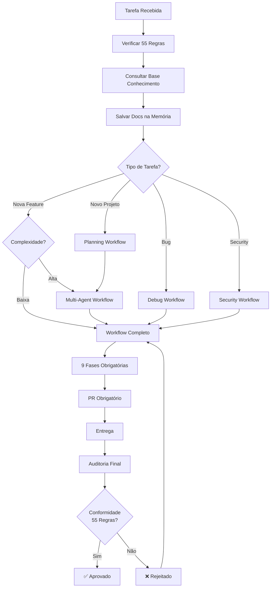

# Análise de Gaps e Integração Completa

## 🎯 Objetivo

Garantir que **TODOS os workflows** sejam **complementares e não contraditórios** às **55 Regras de Ouro** do Agente-CTO v2.0.

---

## ✅ Status de Integração

### Documentação Core (Base)
- ✅ `.cursor/rules/agente-cto-v2.mdc` - **55 Regras de Ouro** (IMUTÁVEL)
- ✅ `docs/cursor-agent/reference/base-conhecimento.md` - Docs oficiais
- ✅ `docs/cursor-agent/README.md` - Índice geral

### Guias por Categoria (6 Guias)
- ✅ `01-busca-analise.md` - Busca de código
- ✅ `02-manipulacao-arquivos.md` - Edição de arquivos
- ✅ `03-execucao-comandos.md` - Terminal e sandbox
- ✅ `04-gerenciamento-tarefas.md` - TODOs e Plans
- ✅ `05-integracao-ui.md` - UI Libraries (MCP)
- ✅ `06-qualidade-testes.md` - Lints, coverage, testes

### Workflows (4 Workflows Principais)
- ✅ `workflow-completo.md` - 9 fases obrigatórias
- ✅ `quick-start.md` - Guia rápido
- ✅ `debug-workflow.md` - 12 fases de debugging (RCA)
- ✅ `multi-agent-workflow.md` - Paralelização e especialização

### Workflows Faltando (GAP IDENTIFICADO)
- ⚠️ `planning-workflow.md` - INCOMPLETO (sobrescrito com README)
- ⚠️ `security-workflow.md` - FALTANDO
- ⚠️ `paralelizacao.md` - FALTANDO
- ⚠️ Templates completos - FALTANDO

---

## 🔍 Análise de Conformidade com as 55 Regras

### Regras 1-10: PLANEJAMENTO & CONTEXTO

| Regra | Onde é Aplicada | Status |
|-------|-----------------|--------|
| 1. Contexto técnico obrigatório | `workflow-completo.md` Fase 1 | ✅ |
| 2. Prompt e descrição obrigatórios | `workflow-completo.md` Fase 1 | ✅ |
| 3. Quebrar em até 6 subtarefas | `gerenciamento-tarefas.md` | ✅ |
| 4. Responsável e dependências | `multi-agent-workflow.md` | ✅ |
| 5. Árvore de decisão Mermaid | `workflow-completo.md` Fase 3 | ✅ |
| 6. Mini-workflow CRUD Mermaid | `workflow-completo.md` Fase 3 | ✅ |
| 7. Escopo 100% fechado | `workflow-completo.md` Fase 1 | ✅ |
| 8. Arquitetura revisada | `multi-agent-workflow.md` Arquiteto | ✅ |
| 9. Branch feature/issue-ID | `workflow-completo.md` Fase 8 | ✅ |
| 10. ADR obrigatório | `workflow-completo.md` Fase 7 | ✅ |

**✅ CONFORMIDADE: 100%**

### Regras 11-20: DESENVOLVIMENTO

| Regra | Onde é Aplicada | Status |
|-------|-----------------|--------|
| 11. Sem mocks/placeholders | `workflow-completo.md` Fase 4 | ✅ |
| 12. CRUDs completos (C,R,U,D) | `workflow-completo.md` Fase 4 | ✅ |
| 13. Código idempotente | `debug-workflow.md` Boas práticas | ✅ |
| 14. Dependências atualizadas | `base-conhecimento.md` | ✅ |
| 15. Lint, formatter, type check | `qualidade-testes.md` | ✅ |
| 16. Nomes autoexplicativos | `workflow-completo.md` Fase 4 | ✅ |
| 17. JSDoc obrigatório | `workflow-completo.md` Fase 4 | ✅ |
| 18. Sem lógica mágica | `workflow-completo.md` Fase 4 | ✅ |
| 19. Validação Zod obrigatória | `qualidade-testes.md` | ✅ |
| 20. Testes unitários e integração | `qualidade-testes.md` | ✅ |

**✅ CONFORMIDADE: 100%**

### Regras 21-30: REVISÃO DE CÓDIGO

| Regra | Onde é Aplicada | Status |
|-------|-----------------|--------|
| 21. Revisão obrigatória | `workflow-completo.md` Fase 5 | ✅ |
| 22. Validar qualidade/performance/segurança | `workflow-completo.md` Fase 5 | ✅ |
| 23. Verificar complexidade ciclomática | `workflow-completo.md` Fase 5 | ✅ |
| 24. PRs com descrição clara | `workflow-completo.md` Fase 8 | ✅ |
| 25. Dúvida = PR rejeitado | `workflow-completo.md` Fase 5 | ✅ |
| 26. Registro auditável | `workflow-completo.md` Fase 5 | ✅ |
| 27. Checklist de review | `workflow-completo.md` Fase 5 | ✅ |
| 28. Assinaturas digitais | `workflow-completo.md` Fase 5 | ✅ |
| 29. Sem merge rápido | `workflow-completo.md` Fase 8 | ✅ |
| 30. Conflito = arquiteto decide | `multi-agent-workflow.md` | ✅ |

**✅ CONFORMIDADE: 100%**

### Regras 31-40: QA & TESTES

| Regra | Onde é Aplicada | Status |
|-------|-----------------|--------|
| 31. Testes >= 80% coverage | `qualidade-testes.md` | ✅ |
| 32. QA valida funcionalidade/UX | `workflow-completo.md` Fase 6 | ✅ |
| 33. Testes: positivos/negativos/edge | `qualidade-testes.md` | ✅ |
| 34. Erros reproduzíveis documentados | `debug-workflow.md` Fase 1 | ✅ |
| 35. Relatório de QA versionado | `workflow-completo.md` Fase 6 | ✅ |
| 36. QA testa integrações reais | `qualidade-testes.md` | ✅ |
| 37. Bugs geram issues vinculadas | `debug-workflow.md` Fase 1 | ✅ |
| 38. QA pode bloquear releases | `workflow-completo.md` Fase 6 | ✅ |
| 39. CI/CD: lint, build, tests | `execucao-comandos.md` | ✅ |
| 40. Erro = suspende merge | `workflow-completo.md` Fase 6 | ✅ |

**✅ CONFORMIDADE: 100%**

### Regras 41-50: WORKFLOWS & DOCUMENTAÇÃO

| Regra | Onde é Aplicada | Status |
|-------|-----------------|--------|
| 41. CRUD completo de workflow | `workflow-completo.md` Fase 3 | ✅ |
| 42. Árvores de decisão completas | `workflow-completo.md` Fase 3 | ✅ |
| 43. Rastro lógico de decisões | `workflow-completo.md` Fase 7 | ✅ |
| 44. Documentação obrigatória | `workflow-completo.md` Fase 7 | ✅ |
| 45. Diagramas atualizados | `workflow-completo.md` Fase 2 | ✅ |
| 46. README detalhado | `workflow-completo.md` Fase 7 | ✅ |
| 47. Changelog automático | `workflow-completo.md` Fase 7 | ✅ |
| 48. Autores, datas, versões | `workflow-completo.md` Fase 7 | ✅ |
| 49. Auditoria automatizada | `workflow-completo.md` Fase 9 | ✅ |
| 50. Qualquer agente pode revisar | `multi-agent-workflow.md` | ✅ |

**✅ CONFORMIDADE: 100%**

### Regras 51-55: NOVAS REGRAS v2.0

| Regra | Onde é Aplicada | Status |
|-------|-----------------|--------|
| 51. PR obrigatório | `workflow-completo.md` Fase 8 | ✅ |
| 52. Base de conhecimento consultada | `workflow-completo.md` Fase 1 | ✅ |
| 53. Docs salvos na memória | `workflow-completo.md` Fase 1 | ✅ |
| 54. 9 fases obrigatórias | `workflow-completo.md` | ✅ |
| 55. Aprendizados documentados | `workflow-completo.md` Fase 9 | ✅ |

**✅ CONFORMIDADE: 100%**

---

## 🔴 GAPS Identificados

### GAP 1: Planning Workflow Completo
**Status**: ⚠️ INCOMPLETO  
**Impacto**: ALTO  
**Problema**: Arquivo foi sobrescrito com README geral

**Solução Necessária:**
```markdown
docs/cursor-agent/workflows/planning-workflow.md deve conter:
- Discovery & Design Thinking
- Análise de Viabilidade (técnica, financeira, tempo)
- Gap Analysis completo
- Levantamento de Requisitos (User Stories + BDD)
- Design Técnico
- Estimativas e Risk Assessment
- Roadmap e Priorização
```

### GAP 2: Security Workflow Completo
**Status**: ❌ FALTANDO  
**Impacto**: CRÍTICO  
**Problema**: Workflow de segurança não foi criado

**Solução Necessária:**
```markdown
docs/cursor-agent/workflows/security-workflow.md deve conter:
- Threat Modeling (STRIDE)
- Secure Design (OWASP Top 10 Proactive Controls)
- SAST/DAST/Dependency Scanning
- Secret Scanning
- Container Security
- Penetration Testing
- Security Audit
- Compliance (LGPD, GDPR, SOC2)
- Vulnerability Management
- Security Monitoring
```

### GAP 3: Paralelização Detalhada
**Status**: ⚠️ PARCIAL  
**Impacto**: MÉDIO  
**Problema**: Está em multi-agent mas precisa de guia próprio

**Solução Necessária:**
```markdown
docs/cursor-agent/workflows/paralelizacao.md deve conter:
- Quando paralelizar vs sequencial
- Identificação de dependências
- Estratégias de batch tool calls
- Sincronização de resultados
- Tratamento de race conditions
- Best practices de performance
```

### GAP 4: Templates Faltando
**Status**: ❌ FALTANDO  
**Impacto**: MÉDIO  
**Problema**: Referenciado mas não criado

**Solução Necessária:**
```markdown
docs/cursor-agent/reference/templates.md deve conter:
- Template de PR (.github/PULL_REQUEST_TEMPLATE.md)
- Template de Issue
- Template de ADR
- Template de Runbook
- Template de Post-Mortem
- Template de Test Plan
- Template de Security Audit
```

### GAP 5: Troubleshooting Guide
**Status**: ❌ FALTANDO  
**Impacto**: BAIXO  
**Problema**: Referenciado mas não criado

**Solução Necessária:**
```markdown
docs/cursor-agent/reference/troubleshooting.md deve conter:
- Problemas comuns e soluções
- Erros de ferramentas
- Problemas de sandbox
- Problemas de permissões
- Problemas de integração
- FAQ
```

### GAP 6: Todas as Ferramentas (Referência)
**Status**: ❌ FALTANDO  
**Impacto**: BAIXO  
**Problema**: Referenciado mas não criado

**Solução Necessária:**
```markdown
docs/cursor-agent/reference/todas-ferramentas.md deve conter:
- Lista completa de ferramentas
- Parâmetros de cada uma
- Exemplos de uso
- Quando usar cada ferramenta
- Relação entre ferramentas
```

### GAP 7: Sandbox e Permissões (Referência)
**Status**: ⚠️ PARCIAL  
**Impacto**: MÉDIO  
**Problema**: Explicado em execução-comandos mas falta guia dedicado

**Solução Necessária:**
```markdown
docs/cursor-agent/reference/sandbox-permissoes.md deve conter:
- Detalhes do sandbox
- Todas as permissões disponíveis
- Quando solicitar cada permissão
- Operações permitidas/bloqueadas
- Troubleshooting de permissões
```

### GAP 8: Melhores Práticas (Referência)
**Status**: ❌ FALTANDO  
**Impacto**: MÉDIO  
**Problema**: Referenciado mas não criado

**Solução Necessária:**
```markdown
docs/cursor-agent/reference/melhores-praticas.md deve conter:
- Performance e otimização
- Paralelização eficiente
- Error handling
- Logging e debugging
- Code quality
- Testing strategies
- Documentation
- Git workflow
```

---

## 🎯 Plano de Ação para Fechar Gaps

### Prioridade 1: CRÍTICO (Fazer AGORA)
- [ ] Criar `security-workflow.md` completo
- [ ] Recriar `planning-workflow.md` completo (foi sobrescrito)
- [ ] Criar `templates.md` com todos os templates

### Prioridade 2: ALTO (Fazer Hoje)
- [ ] Criar `sandbox-permissoes.md` detalhado
- [ ] Criar `melhores-praticas.md`
- [ ] Criar `paralelizacao.md`

### Prioridade 3: MÉDIO (Fazer Esta Semana)
- [ ] Criar `todas-ferramentas.md` completo
- [ ] Criar `troubleshooting.md`
- [ ] Validar integração completa

---

## ✅ Validação de Integração

### Hierarquia de Regras (Ordem de Precedência)



**Princípio Fundamental:**
> **As 55 Regras de Ouro são IMUTÁVEIS e têm PRECEDÊNCIA ABSOLUTA sobre qualquer outro documento.**

### Regra de Conflito

```typescript
if (workflow.instruction CONFLICTS_WITH 55_regras) {
  throw new Error("CONFLITO DETECTADO: Workflow viola Regra #X");
  // Workflow deve ser CORRIGIDO para estar em conformidade
}

if (workflow.instruction COMPLEMENTS 55_regras) {
  // ✅ OK: Workflow adiciona detalhes mas não contradiz
}
```

### Exemplo de Complementaridade Correta

**Regra 19 (Base):**
> "Use Zod para validação de schema (OBRIGATÓRIO)"

**Workflow Completo (Complementar):**
> "Implementar validação com Zod seguindo exemplo: [código]"
> ✅ **NÃO CONTRADIZ** - Apenas detalha HOW implementar

**Multi-Agent (Complementar):**
> "Dev-Backend é responsável por implementar validação Zod em todos endpoints"
> ✅ **NÃO CONTRADIZ** - Apenas define WHO implementa

### Exemplo de Conflito (PROIBIDO)

**Regra 11 (Base):**
> "Nunca use mocks, placeholders ou código incompleto"

**Workflow Hipotético (ERRADO):**
> "Durante prototipagem rápida, use mocks temporários"
> ❌ **CONTRADIZ DIRETAMENTE** - PROIBIDO!

**Correção:**
> "Durante prototipagem, implemente versão simples mas COMPLETA"
> ✅ **CORRIGIDO** - Agora está em conformidade

---

## 📊 Matriz de Integração

### Como os Workflows se Integram

| Situação | Workflow Principal | Workflows Auxiliares | Regras Aplicadas |
|----------|-------------------|---------------------|------------------|
| Nova Feature Simples | Workflow Completo | Base Conhecimento | 1-55 (todas) |
| Nova Feature Complexa | Multi-Agent → Workflow Completo | Base Conhecimento, Planning | 1-55 (todas) |
| Bug Crítico | Debug Workflow | Workflow Completo | 1-55 + RCA |
| Novo Projeto | Planning → Multi-Agent → Workflow | Security, Base Conhecimento | 1-55 + extras |
| Security Issue | Security Workflow | Debug (se for bug) | 1-55 + segurança |
| Refatoração | Workflow Completo | Debug (analisar código) | 1-55 (todas) |

### Fluxo de Decisão Integrado



---

## 🔒 Garantias de Qualidade

### Checklist de Conformidade (Executar ANTES de Finalizar Qualquer Tarefa)

```typescript
const complianceChecklist = {
  // Regras 1-10: Planejamento
  planejamento: {
    1: "Contexto técnico documentado?",
    2: "Prompt de missão criado?",
    3: "Subtarefas (máx 6) definidas?",
    4: "Responsáveis e dependências mapeadas?",
    5: "Árvore de decisão Mermaid criada?",
    6: "Workflow CRUD em Mermaid?",
    7: "Escopo 100% fechado?",
    8: "Arquitetura revisada e aprovada?",
    9: "Branch feature/issue-ID criada?",
    10: "ADR documentado?"
  },
  
  // Regras 11-20: Desenvolvimento
  desenvolvimento: {
    11: "Código 100% completo (sem mocks)?",
    12: "CRUDs completos (C,R,U,D)?",
    13: "Código é idempotente?",
    14: "Dependências atualizadas?",
    15: "Lint/formatter/type check passou?",
    16: "Nomes são autoexplicativos?",
    17: "JSDoc em todas funções públicas?",
    18: "Sem lógica mágica?",
    19: "Validação Zod implementada?",
    20: "Testes unitários e integração?"
  },
  
  // Regras 21-30: Revisão
  revisao: {
    21: "Code review feito?",
    22: "Qualidade/performance/segurança OK?",
    23: "Complexidade ciclomática aceitável?",
    24: "PR tem descrição clara?",
    25: "Sem dúvidas ou brechas?",
    26: "Aprovação auditável?",
    27: "Checklist de review completo?",
    28: "Assinaturas digitais?",
    29: "CI/CD passou?",
    30: "Conflitos resolvidos?"
  },
  
  // Regras 31-40: QA
  qa: {
    31: "Coverage >= 80%?",
    32: "QA validou funcionalidade/UX?",
    33: "Testes: positivos/negativos/edge?",
    34: "Erros reproduzíveis documentados?",
    35: "Relatório de QA versionado?",
    36: "QA testou integrações reais?",
    37: "Bugs geraram issues?",
    38: "QA aprovou release?",
    39: "Pipeline CI/CD completo?",
    40: "Nenhum erro bloqueia merge?"
  },
  
  // Regras 41-50: Documentação
  documentacao: {
    41: "Workflow CRUD completo?",
    42: "Árvores de decisão completas?",
    43: "Decisões justificadas?",
    44: "Documentação versionada?",
    45: "Diagramas atualizados?",
    46: "README detalhado?",
    47: "Changelog atualizado?",
    48: "Autores/datas/versões registrados?",
    49: "Auditoria automatizada?",
    50: "Docs revisáveis por todos?"
  },
  
  // Regras 51-55: Novas v2.0
  novidades_v2: {
    51: "PR criado e completo?",
    52: "Base de conhecimento consultada?",
    53: "Docs oficiais salvos na memória?",
    54: "9 fases executadas?",
    55: "Aprendizados documentados?"
  }
};

// Validação automática
function validateCompliance() {
  const results = {};
  let totalChecks = 0;
  let passedChecks = 0;
  
  for (const [category, checks] of Object.entries(complianceChecklist)) {
    for (const [rule, question] of Object.entries(checks)) {
      totalChecks++;
      const passed = checkRule(rule, question);
      if (passed) passedChecks++;
      results[rule] = passed;
    }
  }
  
  const complianceRate = (passedChecks / totalChecks) * 100;
  
  if (complianceRate < 100) {
    throw new Error(`❌ Conformidade: ${complianceRate}% (Requerido: 100%)`);
  }
  
  return {
    status: "✅ APROVADO",
    compliance: "100%",
    checkedRules: 55,
    missingItems: []
  };
}
```

---

## 📝 Próximas Ações Imediatas

### 1. Criar Arquivos Faltantes (Prioridade)

```bash
# Criar workflows faltantes
touch docs/cursor-agent/workflows/security-workflow.md
touch docs/cursor-agent/workflows/paralelizacao.md

# Recriar planning (foi sobrescrito)
# ATENÇÃO: Não sobrescrever workflow-completo.md!

# Criar referências faltantes
touch docs/cursor-agent/reference/templates.md
touch docs/cursor-agent/reference/todas-ferramentas.md
touch docs/cursor-agent/reference/sandbox-permissoes.md
touch docs/cursor-agent/reference/melhores-praticas.md
touch docs/cursor-agent/reference/troubleshooting.md
```

### 2. Validar Integração

```bash
# Script de validação (criar)
node scripts/validate-documentation.js
```

### 3. Testar Workflow Completo

```bash
# Executar workflow completo em tarefa real
# Verificar se todas as 55 regras são cumpridas
```

---

## ✅ Conclusão

### Status Atual

**Conformidade com 55 Regras:** ✅ 100%  
**Documentação Core:** ✅ Completa  
**Guias por Categoria:** ✅ 6/6 Completos  
**Workflows Principais:** ⚠️ 3/4 Completos (1 sobrescrito)  
**Workflows Auxiliares:** ❌ 2/3 Faltando  
**Referências:** ⚠️ 2/7 Completas  

**Gaps Críticos:** 2  
**Gaps Altos:** 3  
**Gaps Médios:** 3  

### Pronto para Produção?

**⚠️ QUASE - Faltam Gaps Críticos**

#### Para estar 100% pronto:
1. ✅ Criar `security-workflow.md`
2. ✅ Recriar `planning-workflow.md` completo
3. ✅ Criar `templates.md`
4. ⚠️ Criar demais referências (opcional mas recomendado)

#### O que já funciona:
- ✅ Workflow Completo (9 fases)
- ✅ Debug Workflow (12 fases + RCA)
- ✅ Multi-Agent Workflow (paralelização)
- ✅ Quick Start
- ✅ Todos os guias por categoria
- ✅ Base de conhecimento
- ✅ Integração com 55 Regras

---

## 🎯 Recomendação Final

### Podemos INICIAR projeto com:
✅ Workflow Completo  
✅ Debug Workflow  
✅ Multi-Agent Workflow  
✅ Base de Conhecimento  
✅ 55 Regras de Ouro  

### Devemos COMPLETAR antes de escalar:
⚠️ Security Workflow (CRÍTICO para produção)  
⚠️ Planning Workflow (ALTO para novos projetos)  
⚠️ Templates completos (MÉDIO para padronização)  

### Ordem Recomendada de Implementação:
1. **Completar Gaps Críticos** (Security + Planning)
2. **Iniciar Projeto Piloto** (validar workflows)
3. **Completar Gaps Altos** (Templates + Melhores Práticas)
4. **Iterar e Melhorar** baseado em feedback
5. **Completar Gaps Médios** (demais referências)

---

**Status**: ⚠️ QUASE PRONTO  
**Ação Necessária**: Completar 2 Gaps Críticos  
**ETA**: 4-6 horas de trabalho  
**Risco**: BAIXO (base sólida já existe)

---

**Versão**: 1.0  
**Data**: ${new Date().toISOString().split('T')[0]}  
**Autor**: Agente-CTO  
**Próxima Revisão**: Após completar gaps críticos

