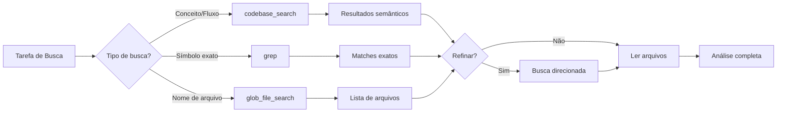

# Busca e Análise de Código

## Visão Geral

O Cursor Agent oferece três ferramentas principais para busca e análise de código, cada uma otimizada para casos de uso específicos.

---

## 1. codebase_search

### Descrição
Busca **semântica** que encontra código por significado, não por texto exato. Ideal para explorar codebases desconhecidas.

### Quando Usar
- ✅ Explorar funcionalidades ("Como funciona X?")
- ✅ Entender fluxos ("Onde é processado Y?")
- ✅ Descobrir implementações ("Quem usa a interface Z?")
- ✅ Perguntas em linguagem natural

### Quando NÃO Usar
- ❌ Busca de texto exato (use `grep`)
- ❌ Busca de símbolos conhecidos (use `grep`)
- ❌ Busca de nomes de arquivo (use `glob_file_search`)

### Parâmetros

```typescript
{
  query: string,              // Pergunta completa em linguagem natural
  target_directories: string[], // Um diretório ou [] para tudo
  explanation: string         // Por que está usando esta ferramenta
}
```

### Exemplos

#### Exemplo 1: Busca Ampla

```typescript
// Query bem formulada como pergunta completa
{
  query: "Como funciona a autenticação de usuários?",
  target_directories: [],
  explanation: "Entender o fluxo de autenticação no sistema"
}
```

**Bom**: Pergunta completa com contexto claro.

#### Exemplo 2: Busca Direcionada

```typescript
// Primeiro: busca ampla
{
  query: "Onde são armazenadas as configurações do usuário?",
  target_directories: [],
  explanation: "Localizar módulo de configurações"
}

// Depois: refinar com base nos resultados
{
  query: "Como são validadas as configurações antes de salvar?",
  target_directories: ["backend/config/"],
  explanation: "Focar na validação após identificar o diretório"
}
```

**Bom**: Estratégia iterativa - amplo → específico.

#### Exemplo 3: Perguntas Ruins ❌

```typescript
// RUIM: Muito vago
{
  query: "MyInterface frontend",
  // Melhor: "Onde é usada a interface MyInterface no frontend?"
}

// RUIM: Palavra única
{
  query: "AuthService",
  // Use grep para isso!
}

// RUIM: Múltiplas perguntas
{
  query: "O que é AuthService? Como funciona AuthService?",
  // Melhor: Duas buscas separadas em paralelo
}
```

### Estratégia de Busca

```mermaid
graph TD
    A[Início] --> B{Conhece o local?}
    B -->|Não| C[Busca ampla: target_directories: []]
    B -->|Sim| D[Busca direcionada: target_directories: ['path']]
    C --> E[Analisar resultados]
    E --> F{Encontrou área relevante?}
    F -->|Sim| G[Refinar busca naquele diretório]
    F -->|Não| H[Reformular query]
    G --> I[Ler arquivos específicos]
    D --> I
    H --> C
```

### Dicas de Performance

1. **Comece amplo**: Primeiro [] (todo o repositório)
2. **Refine depois**: Use diretórios específicos em buscas subsequentes
3. **Uma pergunta por vez**: Não combine múltiplas queries
4. **Seja específico**: "Onde X é validado?" > "X validação"

### Target Directories

```typescript
// ✅ Correto
target_directories: []                      // Busca em tudo
target_directories: ["backend/api/"]        // Um diretório
target_directories: ["src/components/Button.tsx"] // Um arquivo

// ❌ Incorreto
target_directories: ["frontend/", "backend/"] // Múltiplos paths
target_directories: ["src/**/utils/**"]       // Globs
target_directories: ["*.ts"]                  // Wildcards
```

### Quando os Resultados São Grandes

Se um arquivo tem >1000 linhas:
- Use `codebase_search` no arquivo específico
- Ou use `grep` se souber os símbolos exatos
- Ou use `read_file` com offset + limit

---

## 2. grep

### Descrição
Busca por **regex/string exata** baseada em ripgrep. Extremamente rápida e precisa.

### Quando Usar
- ✅ Buscar símbolos específicos (`function myFunction`)
- ✅ Refatorações (renomear variáveis)
- ✅ Encontrar imports específicos
- ✅ Regex patterns complexos

### Parâmetros

```typescript
{
  pattern: string,        // Regex pattern (ripgrep syntax)
  path?: string,          // Arquivo ou diretório
  type?: string,          // Tipo de arquivo (js, py, ts, etc)
  glob?: string,          // Glob pattern (*.js, *.{ts,tsx})
  output_mode?: string,   // "content" | "files_with_matches" | "count"
  multiline?: boolean,    // Busca cross-line (padrão: false)
  "-i"?: boolean,         // Case insensitive
  "-A"?: number,          // Linhas após o match
  "-B"?: number,          // Linhas antes do match
  "-C"?: number,          // Linhas antes e depois
  head_limit?: number     // Limitar output
}
```

### Exemplos

#### Exemplo 1: Busca Simples

```typescript
{
  pattern: "function authenticate",
  output_mode: "content"
}
```

#### Exemplo 2: Com Contexto

```typescript
{
  pattern: "interface User",
  "-C": 5,  // 5 linhas antes e depois
  type: "ts"
}
```

#### Exemplo 3: Contar Ocorrências

```typescript
{
  pattern: "console\\.log\\(",
  output_mode: "count",
  type: "js"
}
```

#### Exemplo 4: Busca Multiline

```typescript
{
  pattern: "class User \\{[\\s\\S]*?constructor",
  multiline: true,
  type: "ts"
}
```

#### Exemplo 5: Case Insensitive

```typescript
{
  pattern: "todo|fixme",
  "-i": true,  // Case insensitive
  output_mode: "content"
}
```

### Output Modes

| Mode | Retorna | Uso |
|------|---------|-----|
| `content` | Linhas que fazem match | Análise detalhada |
| `files_with_matches` | Apenas nomes de arquivo | Listar arquivos afetados |
| `count` | Contagem de matches | Métricas, overview |

### Formato de Output

```bash
# content mode
path/to/file.ts:12:const authenticate = () => {
path/to/file.ts-13-  // context line
path/to/file.ts:15:  return authenticate(token);

# Legenda:
# ':' = linha com match
# '-' = linha de contexto
```

### Padrões Regex Comuns

```typescript
// Funções
"function\\s+\\w+"

// Classes
"class\\s+\\w+"

// Imports
"import.*from ['\"]react['\"]"

// Exports
"export (const|function|class)"

// Chamadas de função
"functionName\\("

// Interface (Go/TypeScript)
"interface\\s*\\{"  // Escape braces!
```

⚠️ **Importante**: Em Go e outras linguagens, `{}` são literais. Use `\\{` e `\\}`.

### Dicas de Performance

1. **Use type quando possível**: Mais rápido que glob
2. **Limite o scope**: Especifique path quando souber
3. **head_limit**: Para outputs grandes
4. **output_mode**: Use o mais adequado

---

## 3. glob_file_search

### Descrição
Busca arquivos por padrão glob. Resultados ordenados por data de modificação.

### Quando Usar
- ✅ Encontrar arquivos por nome
- ✅ Encontrar por extensão
- ✅ Padrões de nomenclatura
- ✅ Arquivos recentemente modificados

### Parâmetros

```typescript
{
  glob_pattern: string,    // Padrão glob (auto-prefixado com **/)
  target_directory?: string // Diretório base (opcional)
}
```

### Exemplos

#### Exemplo 1: Por Extensão

```typescript
{
  glob_pattern: "*.tsx",
  target_directory: "src/components"
}
// Encontra todos os .tsx em src/components
```

#### Exemplo 2: Por Nome

```typescript
{
  glob_pattern: "**/test_*.py"
}
// Encontra todos os arquivos test_*.py
```

#### Exemplo 3: Múltiplas Extensões

```typescript
{
  glob_pattern: "**/*.{ts,tsx,js,jsx}"
}
// Encontra todos os arquivos TypeScript e JavaScript
```

#### Exemplo 4: Node Modules

```typescript
{
  glob_pattern: "**/node_modules/**"
}
// Encontra todos os diretórios node_modules
```

### Auto-prefixo

Padrões sem `**/` são automaticamente prefixados:

```typescript
"*.js"        → "**/**.js"
"test_*.py"   → "**/test_*.py"
```

Se você quer um padrão específico, inclua `**/`:

```typescript
"**/src/test/**/test_*.ts"  // Caminho completo
```

---

## Estratégia de Busca Combinada

### Workflow Recomendado



### Exemplo Real: Refatoração

**Tarefa**: Renomear `getUserData` para `fetchUserProfile`

```typescript
// 1. Encontrar todas as ocorrências
await grep({
  pattern: "getUserData",
  output_mode: "files_with_matches"
});
// Retorna: ["api/user.ts", "services/auth.ts", "components/Profile.tsx"]

// 2. Ver contexto em cada arquivo
await grep({
  pattern: "getUserData",
  "-C": 3,
  output_mode: "content"
});

// 3. Fazer substituição em cada arquivo
await search_replace({
  file_path: "api/user.ts",
  old_string: "getUserData",
  new_string: "fetchUserProfile",
  replace_all: true
});

// Repetir para outros arquivos...

// 4. Verificar se não ficou nada
await grep({
  pattern: "getUserData",
  output_mode: "count"
});
// Deve retornar 0
```

---

## Troubleshooting

### codebase_search não encontra nada

**Possíveis causas:**
1. Query muito vaga ou genérica
2. Diretório target muito específico
3. Código está em arquivo ignorado

**Soluções:**
- Reformule a query como pergunta completa
- Use `target_directories: []` primeiro
- Verifique .gitignore/.cursorignore

### grep muito lento

**Possíveis causas:**
1. Padrão muito amplo
2. Buscando em diretórios grandes (node_modules)
3. Multiline mode desnecessário

**Soluções:**
- Use `type` ou `glob` para filtrar
- Especifique `path` quando possível
- Desabilite multiline se não precisar

### glob retorna arquivos ignorados

**Não deveria acontecer**: glob respeita .gitignore.

Se acontecer:
- Verifique o conteúdo de .gitignore
- Confirme que o arquivo existe no repo
- Use grep com `--glob` alternativo

---

## Checklist de Boas Práticas

### Antes de Buscar

- [ ] Defini claramente o que estou procurando?
- [ ] Escolhi a ferramenta certa (semântica vs exata vs arquivo)?
- [ ] Sei em qual diretório focar (ou devo buscar em tudo)?

### Durante a Busca

- [ ] Query está como pergunta completa? (codebase_search)
- [ ] Pattern tem escaping correto? (grep)
- [ ] Glob pattern tem o formato certo? (glob_file_search)

### Após a Busca

- [ ] Resultados fazem sentido?
- [ ] Preciso refinar a busca?
- [ ] Devo ler os arquivos agora?
- [ ] Posso executar buscas relacionadas em paralelo?

---

## Próximos Passos

- [Manipulação de Arquivos →](./02-manipulacao-arquivos.md)
- [Workflows de Busca →](../workflows/workflow-completo.md)
- [Referência Completa →](../reference/todas-ferramentas.md)

