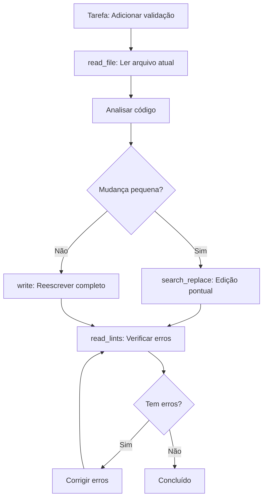

# Manipulação de Arquivos

## Visão Geral

O Cursor Agent oferece ferramentas especializadas para leitura, escrita, edição e remoção de arquivos, sempre priorizando segurança e precisão.

---

## 1. read_file

### Descrição
Lê conteúdo de arquivos de texto ou imagens. Suporta leitura parcial para arquivos grandes.

### Quando Usar
- ✅ Analisar código antes de editar
- ✅ Revisar conteúdo existente
- ✅ Ler imagens (screenshots, diagramas)
- ✅ Inspecionar arquivos de configuração

### Parâmetros

```typescript
{
  target_file: string,   // Caminho relativo ou absoluto
  offset?: number,       // Linha inicial (opcional)
  limit?: number         // Quantidade de linhas (opcional)
}
```

### Exemplos

#### Exemplo 1: Leitura Completa

```typescript
{
  target_file: "src/utils/auth.ts"
}
```

**Output:**
```
     1|import { hash } from 'crypto';
     2|
     3|export function authenticate(token: string) {
     4|  return hash(token);
     5|}
```

**Formato**: `LINE_NUMBER|LINE_CONTENT` (número right-aligned, 6 caracteres)

#### Exemplo 2: Leitura Parcial

```typescript
{
  target_file: "src/app.ts",
  offset: 50,    // Começa na linha 50
  limit: 20      // Lê 20 linhas
}
```

**Quando usar**: Arquivos com >500 linhas.

#### Exemplo 3: Ler Imagem

```typescript
{
  target_file: "docs/diagrams/architecture.png"
}
```

**Suporta**: JPEG, PNG, GIF, WebP

#### Exemplo 4: Múltiplos Arquivos em Paralelo

```typescript
// ✅ Eficiente: lê 3 arquivos simultaneamente
await Promise.all([
  read_file({ target_file: "api/user.ts" }),
  read_file({ target_file: "api/auth.ts" }),
  read_file({ target_file: "api/types.ts" })
]);
```

### Inline Line Numbers

⚠️ **Importante**: Os números de linha `LINE_NUMBER|` são METADATA. Não os inclua ao copiar código.

```typescript
// ✅ Correto: ignorar números ao copiar
     1|export function test() {
     2|  return true;
     3|}

// Copie apenas:
export function test() {
  return true;
}
```

### Dicas de Performance

1. **Leia apenas o necessário**: Use offset + limit para arquivos grandes
2. **Paralelização**: Leia múltiplos arquivos de uma vez
3. **Cache mental**: Uma vez lido, o agente mantém no contexto
4. **Expansão de contexto**: Para chunks, leia do início para ver imports

---

## 2. write

### Descrição
Cria novos arquivos ou sobrescreve arquivos existentes completamente.

### Quando Usar
- ✅ Criar novos arquivos
- ✅ Reescrever arquivo completamente (após ler)
- ✅ Gerar arquivos de configuração
- ✅ Criar documentação

### Quando NÃO Usar
- ❌ Editar parte de arquivo existente (use `search_replace`)
- ❌ Pequenas mudanças (use `search_replace`)

### Parâmetros

```typescript
{
  file_path: string,    // Caminho relativo ou absoluto
  contents: string      // Conteúdo completo do arquivo
}
```

### Regras Importantes

⚠️ **OBRIGATÓRIO**: Se o arquivo já existe, você DEVE lê-lo primeiro com `read_file`.

```typescript
// ✅ Correto
const current = await read_file({ target_file: "config.json" });
// ... analisar ...
await write({
  file_path: "config.json",
  contents: newContents
});

// ❌ Incorreto: sobrescrever sem ler
await write({
  file_path: "config.json",
  contents: newContents
});
```

### Exemplos

#### Exemplo 1: Novo Arquivo

```typescript
{
  file_path: "src/services/payment.ts",
  contents: `import { Stripe } from 'stripe';

export class PaymentService {
  private stripe: Stripe;

  constructor(apiKey: string) {
    this.stripe = new Stripe(apiKey);
  }

  async processPayment(amount: number): Promise<boolean> {
    try {
      const charge = await this.stripe.charges.create({
        amount,
        currency: 'usd'
      });
      return charge.status === 'succeeded';
    } catch (error) {
      console.error('Payment failed:', error);
      return false;
    }
  }
}
`
}
```

#### Exemplo 2: Arquivo de Configuração

```typescript
{
  file_path: ".eslintrc.json",
  contents: JSON.stringify({
    extends: ["eslint:recommended", "plugin:@typescript-eslint/recommended"],
    parser: "@typescript-eslint/parser",
    plugins: ["@typescript-eslint"],
    rules: {
      "no-console": "warn",
      "@typescript-eslint/no-unused-vars": "error"
    }
  }, null, 2)
}
```

#### Exemplo 3: README

```typescript
{
  file_path: "README.md",
  contents: `# Payment Service

Sistema de processamento de pagamentos integrado com Stripe.

## Instalação

\`\`\`bash
npm install stripe
\`\`\`

## Uso

\`\`\`typescript
const payment = new PaymentService(process.env.STRIPE_KEY);
const success = await payment.processPayment(1000);
\`\`\`

## Testes

\`\`\`bash
npm test
\`\`\`
`
}
```

### Boas Práticas

1. **Leia antes de escrever**: Sempre para arquivos existentes
2. **Conteúdo completo**: Sem placeholders ou "// TODO"
3. **Formatação**: Use indentação consistente
4. **Imports no topo**: Organize importações
5. **Tipos explícitos**: Sempre que possível (TypeScript)

---

## 3. search_replace

### Descrição
Substitui strings exatas em arquivos. A ferramenta mais usada para edições.

### Quando Usar
- ✅ Editar parte específica de arquivo
- ✅ Refatorações (renomear símbolos)
- ✅ Corrigir bugs pontuais
- ✅ Atualizar valores

### Parâmetros

```typescript
{
  file_path: string,      // Caminho do arquivo
  old_string: string,     // String a substituir (deve ser única!)
  new_string: string,     // Nova string (deve ser diferente)
  replace_all?: boolean   // Substituir todas as ocorrências
}
```

### Regras Críticas

⚠️ **old_string DEVE ser ÚNICO no arquivo** (a menos que use replace_all)

⚠️ **Preserve indentação EXATA** (tabs/spaces)

⚠️ **new_string DEVE ser diferente** de old_string

### Exemplos

#### Exemplo 1: Edição Simples

```typescript
// Arquivo: src/config.ts
const API_URL = "http://localhost:3000";

// Substituição
{
  file_path: "src/config.ts",
  old_string: 'const API_URL = "http://localhost:3000";',
  new_string: 'const API_URL = process.env.API_URL || "http://localhost:3000";'
}
```

#### Exemplo 2: Com Contexto Suficiente

```typescript
// Arquivo: src/user.ts
export class User {
  name: string;
  
  constructor(name: string) {
    this.name = name;
  }
}

// ✅ Correto: contexto suficiente para unicidade
{
  file_path: "src/user.ts",
  old_string: `export class User {
  name: string;
  
  constructor(name: string) {
    this.name = name;
  }
}`,
  new_string: `export class User {
  name: string;
  email: string;
  
  constructor(name: string, email: string) {
    this.name = name;
    this.email = email;
  }
}`
}
```

#### Exemplo 3: replace_all (Renomeação)

```typescript
// Renomear variável em todo o arquivo
{
  file_path: "src/api.ts",
  old_string: "getUserData",
  new_string: "fetchUserProfile",
  replace_all: true
}
```

#### Exemplo 4: Preservar Indentação ✅

```typescript
// Arquivo usa 2 espaços
{
  file_path: "src/component.tsx",
  old_string: `  return (
    <div>Hello</div>
  );`,
  new_string: `  return (
    <div>
      <h1>Hello World</h1>
    </div>
  );`
}
```

### Estratégia de Contexto

Para garantir unicidade, inclua contexto suficiente:

```typescript
// ❌ Pode não ser único
old_string: "return true;"

// ✅ Único: 3-5 linhas de contexto antes e depois
old_string: `  if (user.isValid()) {
    console.log('User is valid');
    return true;
  }
  return false;`
```

**Regra prática**: 
- **Mínimo**: 3 linhas de contexto antes + 3 depois
- **Ideal**: 5 linhas de contexto antes + 5 depois

### Edições Múltiplas

Para múltiplas edições no mesmo arquivo:

```typescript
// ✅ Correto: edições sequenciais com contexto único
await search_replace({
  file_path: "src/api.ts",
  old_string: "// Contexto único da primeira mudança",
  new_string: "// Nova implementação"
});

await search_replace({
  file_path: "src/api.ts",
  old_string: "// Contexto único da segunda mudança",
  new_string: "// Nova implementação"
});

// ❌ Incorreto: edições paralelas no mesmo arquivo
// Pode causar conflitos
```

### Troubleshooting

**Erro: "old_string não é único"**

Solução: Adicione mais contexto ao redor.

```typescript
// Era:
old_string: "const x = 1;"

// Deve ser:
old_string: `function calculate() {
  const x = 1;
  return x * 2;
}`
```

**Erro: "Indentação incorreta"**

Solução: Copie exatamente como está no arquivo.

```typescript
// Se o arquivo usa tabs, use tabs
old_string: "\tconst x = 1;"  // Tab

// Se usa espaços, use espaços
old_string: "  const x = 1;"  // 2 espaços
```

---

## 4. delete_file

### Descrição
Remove arquivo do filesystem de forma segura.

### Quando Usar
- ✅ Limpar arquivos temporários
- ✅ Remover código legado
- ✅ Refatorações (remover arquivos obsoletos)
- ✅ Cleanup após testes

### Parâmetros

```typescript
{
  target_file: string,     // Caminho do arquivo
  explanation: string      // Por que está removendo
}
```

### Exemplos

#### Exemplo 1: Remover Temporário

```typescript
{
  target_file: "temp/debug.log",
  explanation: "Remover arquivo de debug temporário"
}
```

#### Exemplo 2: Refatoração

```typescript
{
  target_file: "src/old-api.ts",
  explanation: "Removendo API legada após migração para nova versão"
}
```

#### Exemplo 3: Cleanup

```typescript
{
  target_file: "test/fixtures/temp-data.json",
  explanation: "Limpando dados de teste após execução"
}
```

### Segurança

A operação falha graciosamente se:
- Arquivo não existe (não é erro)
- Operação rejeitada por segurança
- Arquivo não pode ser deletado (permissões)

### Boas Práticas

1. **Documente o motivo**: Sempre forneça explanation clara
2. **Verifique dependências**: Busque referências antes de remover
3. **Git tracking**: Arquivos no git precisarão de commit
4. **Backup mental**: Certifique-se que pode recuperar se necessário

---

## 5. list_dir

### Descrição
Lista arquivos e diretórios em um caminho, com suporte a filtros.

### Quando Usar
- ✅ Explorar estrutura de diretórios
- ✅ Verificar existência de arquivos
- ✅ Encontrar arquivos em diretório específico
- ✅ Filtrar por padrões

### Parâmetros

```typescript
{
  target_directory: string,    // Caminho relativo ou absoluto
  ignore_globs?: string[]      // Padrões para ignorar (opcional)
}
```

### Exemplos

#### Exemplo 1: Listar Diretório

```typescript
{
  target_directory: "src"
}
```

**Output:**
```
src/
  - components/
    - Button.tsx
    - Input.tsx
  - utils/
    - auth.ts
    - validation.ts
  - app.ts
```

#### Exemplo 2: Com Filtros

```typescript
{
  target_directory: "src",
  ignore_globs: ["*.test.ts", "*.spec.ts"]
}
```

**Ignora**: Todos os arquivos de teste.

#### Exemplo 3: Ignorar node_modules

```typescript
{
  target_directory: ".",
  ignore_globs: ["**/node_modules/**", "**/.git/**"]
}
```

### Ignore Globs

Padrões são auto-prefixados com `**/`:

```typescript
"*.js"           → "**/**.js"
"node_modules/**" → "**/node_modules/**"
```

Exemplos de padrões:
- `"*.js"`: Ignora todos .js
- `"**/test/**"`: Ignora diretórios test
- `"**/temp_*.ts"`: Ignora temp_*.ts em qualquer lugar

### Detalhes

⚠️ **Não mostra arquivos/diretórios ocultos** (começando com `.`)

Para ver `.env`, `.gitignore`, etc, use `read_file` diretamente.

---

## Workflow Completo de Edição

### Cenário: Adicionar Feature em Arquivo Existente



### Exemplo Prático

```typescript
// 1. Ler arquivo existente
const content = await read_file({ 
  target_file: "src/api/user.ts" 
});

// 2. Analisar e planejar mudança
// Decisão: Adicionar validação de email

// 3. Fazer edição com search_replace
await search_replace({
  file_path: "src/api/user.ts",
  old_string: `export async function createUser(name: string) {
  return db.users.create({ name });
}`,
  new_string: `export async function createUser(name: string, email: string) {
  // Validação de email
  if (!email.includes('@')) {
    throw new Error('Email inválido');
  }
  
  return db.users.create({ name, email });
}`
});

// 4. Verificar lints
const lints = await read_lints({ 
  paths: ["src/api/user.ts"] 
});

// 5. Se houver erros, corrigir
if (lints.hasErrors) {
  // Corrigir...
}
```

---

## Notebooks Jupyter

### edit_notebook

Ferramenta especializada para edição de notebooks `.ipynb`.

#### Parâmetros

```typescript
{
  target_notebook: string,    // Caminho do notebook
  cell_idx: number,           // Índice da célula (0-based)
  is_new_cell: boolean,       // true = criar, false = editar
  cell_language: string,      // 'python' | 'markdown' | 'javascript' | etc
  old_string: string,         // Conteúdo atual (vazio se is_new_cell=true)
  new_string: string          // Novo conteúdo
}
```

#### Exemplo: Editar Célula

```typescript
{
  target_notebook: "analysis.ipynb",
  cell_idx: 2,
  is_new_cell: false,
  cell_language: "python",
  old_string: `import pandas as pd
df = pd.read_csv('data.csv')`,
  new_string: `import pandas as pd
import numpy as np

df = pd.read_csv('data.csv')
df = df.dropna()  # Remove valores nulos`
}
```

#### Exemplo: Nova Célula

```typescript
{
  target_notebook: "analysis.ipynb",
  cell_idx: 3,
  is_new_cell: true,
  cell_language: "markdown",
  old_string: "",
  new_string: "## Análise Exploratória\n\nVamos visualizar os dados..."
}
```

#### Linguagens Suportadas

- `python`
- `markdown`
- `javascript`
- `typescript`
- `r`
- `sql`
- `shell`
- `raw`
- `other`

---

## Checklist de Boas Práticas

### Antes de Editar

- [ ] Li o arquivo completamente?
- [ ] Entendi a estrutura e dependências?
- [ ] Verifiquei se a edição é necessária?
- [ ] Escolhi a ferramenta certa (search_replace vs write)?

### Durante a Edição

- [ ] old_string tem contexto suficiente (único)?
- [ ] Indentação está EXATA?
- [ ] new_string está completo (sem placeholders)?
- [ ] Múltiplas edições são sequenciais, não paralelas?

### Após Editar

- [ ] Verifiquei lints?
- [ ] Código compila/executa?
- [ ] Testes ainda passam?
- [ ] Documentação precisa de atualização?

---

## Próximos Passos

- [Execução de Comandos →](./03-execucao-comandos.md)
- [Workflows Completos →](../workflows/workflow-completo.md)
- [Referência Completa →](../reference/todas-ferramentas.md)

