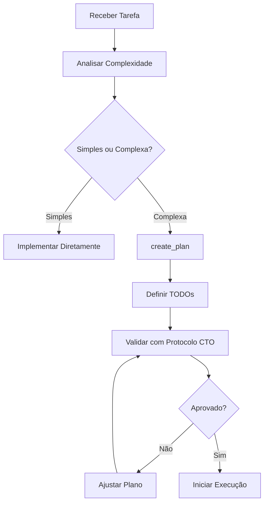

# Gerenciamento de Tarefas

## Visão Geral

O Cursor Agent oferece sistema robusto de gerenciamento de tarefas através de TODOs e Plans, essencial para projetos complexos e conformidade com o Protocolo Agente-CTO.

---

## 1. todo_write

### Descrição
Sistema de gerenciamento de tarefas com estados rastreáveis e merge incremental.

### Quando Usar

✅ **Use para:**
- Tarefas complexas com 3+ etapas
- Projetos que requerem planejamento
- Trabalho com dependências entre tarefas
- Demonstração de thoroughness
- Conformidade com protocolo CTO

❌ **NÃO use para:**
- Tarefas simples (1-2 passos)
- Tarefas triviais
- Operações de suporte (linting, testing)
- Requests puramente informacionais

### Parâmetros

```typescript
{
  merge: boolean,        // true = merge, false = substituir tudo
  todos: Array<{
    id: string,          // ID único
    content: string,     // Descrição da tarefa
    status: 'pending' | 'in_progress' | 'completed' | 'cancelled'
  }>
}
```

### Estados de TODO

| Estado | Significado | Quando Usar |
|--------|-------------|-------------|
| `pending` | Não iniciado | Tarefa planejada mas não começou |
| `in_progress` | Em andamento | Trabalhando ativamente nesta tarefa |
| `completed` | Finalizado | Tarefa completada com sucesso |
| `cancelled` | Cancelado | Não será mais executada |

---

## Exemplos

### Exemplo 1: Criar TODOs Iniciais

```typescript
{
  merge: false,  // Criar nova lista
  todos: [
    {
      id: "1-setup",
      content: "Configurar ambiente e dependências",
      status: "pending"
    },
    {
      id: "2-schema",
      content: "Criar schema de banco de dados",
      status: "pending"
    },
    {
      id: "3-api",
      content: "Implementar endpoints REST",
      status: "pending"
    },
    {
      id: "4-tests",
      content: "Adicionar testes (80%+ coverage)",
      status: "pending"
    },
    {
      id: "5-docs",
      content: "Documentar API e fluxos",
      status: "pending"
    }
  ]
}
```

### Exemplo 2: Iniciar Primeira Tarefa

```typescript
{
  merge: true,  // Mesclar com existente
  todos: [
    {
      id: "1-setup",
      status: "in_progress"  // Apenas mudando status
    }
  ]
}
```

### Exemplo 3: Completar e Iniciar Próxima

```typescript
{
  merge: true,
  todos: [
    {
      id: "1-setup",
      status: "completed"
    },
    {
      id: "2-schema",
      status: "in_progress"
    }
  ]
}
```

### Exemplo 4: Adicionar Novo TODO

```typescript
{
  merge: true,
  todos: [
    {
      id: "6-security",
      content: "Implementar rate limiting e validação",
      status: "pending"
    }
  ]
}
```

### Exemplo 5: Cancelar TODO

```typescript
{
  merge: true,
  todos: [
    {
      id: "3-api",
      status: "cancelled"
      // Decidimos usar outra abordagem
    }
  ]
}
```

---

## Regras de Gerenciamento

### Regra 1: Máximo 1 in_progress

```typescript
// ✅ Correto: apenas 1 in_progress
[
  { id: "1", status: "completed" },
  { id: "2", status: "in_progress" },
  { id: "3", status: "pending" }
]

// ❌ Incorreto: múltiplos in_progress
[
  { id: "1", status: "in_progress" },
  { id: "2", status: "in_progress" }
]
```

### Regra 2: Marcar completed IMEDIATAMENTE

```typescript
// Assim que terminar uma tarefa:
{
  merge: true,
  todos: [
    { id: "task-1", status: "completed" }
  ]
}
// Não deixe para depois!
```

### Regra 3: Completar Antes de Iniciar Nova

```typescript
// ✅ Correto: sequencial
// 1. Completar atual
{ merge: true, todos: [{ id: "1", status: "completed" }] }

// 2. Iniciar próxima
{ merge: true, todos: [{ id: "2", status: "in_progress" }] }

// ✅ Ou em uma operação:
{
  merge: true,
  todos: [
    { id: "1", status: "completed" },
    { id: "2", status: "in_progress" }
  ]
}
```

### Regra 4: IDs Únicos e Descritivos

```typescript
// ✅ Bom
"1-database-schema"
"2-api-endpoints"
"3-authentication"

// ❌ Ruim
"task1"
"todo"
"fix"
```

### Regra 5: Content Específico

```typescript
// ✅ Bom: específico e acionável
"Implementar endpoint POST /users com validação Zod"

// ❌ Ruim: vago
"Fazer API"
```

---

## Paralelização com TODOs

### Criar TODOs e Iniciar Trabalho Simultaneamente

```typescript
// ✅ Eficiente: criar TODOs e já começar
{
  merge: false,
  todos: [
    { id: "1", content: "Setup", status: "in_progress" },
    { id: "2", content: "Schema", status: "pending" },
    { id: "3", content: "API", status: "pending" }
  ]
}

// Na mesma batch de tool calls:
// - read_file para entender contexto
// - search_replace para fazer mudanças
// - etc
```

### Batch Updates

```typescript
// ✅ Atualizar múltiplos TODOs de uma vez
{
  merge: true,
  todos: [
    { id: "1", status: "completed" },
    { id: "2", status: "in_progress" },
    { id: "4", content: "Nova tarefa identificada", status: "pending" }
  ]
}
```

---

## 2. create_plan

### Descrição
Cria planos estruturados com overview, detalhes e TODOs integrados.

### Quando Usar

- Início de projetos complexos
- Antes de implementações grandes
- Para comunicar estratégia ao usuário
- Conformidade com Protocolo CTO

### Parâmetros

```typescript
{
  name: string,        // Nome do plano
  overview: string,    // Resumo executivo
  plan: string,        // Detalhes completos (markdown)
  todos?: Array<{     // TODOs integrados (opcional)
    id: string,
    content: string,
    status: string
  }>
}
```

### Exemplo Completo

```typescript
{
  name: "Implementação do Sistema de Autenticação",
  overview: "Sistema completo de autenticação com JWT, incluindo registro, login, refresh tokens e gerenciamento de sessões.",
  plan: `# Sistema de Autenticação

## Arquitetura

### Componentes
1. **Auth Service**: Lógica de autenticação
2. **Token Service**: Geração e validação JWT
3. **User Repository**: Persistência de usuários
4. **Middleware**: Proteção de rotas

### Fluxo de Autenticação

\`\`\`mermaid
sequenceDiagram
    Cliente->>API: POST /auth/login
    API->>DB: Verificar credenciais
    DB-->>API: Usuário válido
    API->>TokenService: Gerar JWT
    TokenService-->>API: Access + Refresh tokens
    API-->>Cliente: Tokens + User data
\`\`\`

## Implementação

### 1. Schema de Usuário

\`\`\`typescript
interface User {
  id: string;
  email: string;
  passwordHash: string;
  createdAt: Date;
  lastLogin?: Date;
}
\`\`\`

### 2. Endpoints

- POST /auth/register
- POST /auth/login
- POST /auth/refresh
- POST /auth/logout
- GET /auth/me

### 3. Segurança

- Bcrypt para hashing (rounds: 12)
- JWT com expiração (access: 15min, refresh: 7d)
- Rate limiting (5 tentativas/min)
- Validação com Zod

## Testes

- Unitários: AuthService, TokenService
- Integração: Endpoints completos
- E2E: Fluxo completo de auth
- Coverage mínimo: 85%

## Checklist de Qualidade

- [ ] Código sem placeholders
- [ ] Validação Zod em todos endpoints
- [ ] Testes com 85%+ coverage
- [ ] Documentação inline (JSDoc)
- [ ] ADR para decisões técnicas
- [ ] Diagrama Mermaid atualizado
`,
  todos: [
    {
      id: "1-user-schema",
      content: "Criar schema User com validação Zod",
      status: "pending"
    },
    {
      id: "2-auth-service",
      content: "Implementar AuthService com bcrypt",
      status: "pending"
    },
    {
      id: "3-token-service",
      content: "Implementar TokenService com JWT",
      status: "pending"
    },
    {
      id: "4-endpoints",
      content: "Criar endpoints REST com validação",
      status: "pending"
    },
    {
      id: "5-middleware",
      content: "Implementar middleware de proteção",
      status: "pending"
    },
    {
      id: "6-tests",
      content: "Testes completos (85%+ coverage)",
      status: "pending"
    }
  ]
}
```

---

## Workflow Completo

### Fase 1: Planejamento



### Fase 2: Execução

```typescript
// 1. Marcar primeiro TODO como in_progress
{
  merge: true,
  todos: [{ id: "1-user-schema", status: "in_progress" }]
}

// 2. Implementar (usando outras ferramentas)
// - read_file para contexto
// - write ou search_replace para código
// - run_terminal_cmd para testes

// 3. Verificar qualidade
// - read_lints
// - coverage report

// 4. Marcar como completed
{
  merge: true,
  todos: [
    { id: "1-user-schema", status: "completed" },
    { id: "2-auth-service", status: "in_progress" }
  ]
}

// 5. Repetir até todos completed
```

### Fase 3: Finalização

```typescript
// Todos os TODOs completed
{
  merge: true,
  todos: [
    { id: "1-user-schema", status: "completed" },
    { id: "2-auth-service", status: "completed" },
    { id: "3-token-service", status: "completed" },
    { id: "4-endpoints", status: "completed" },
    { id: "5-middleware", status: "completed" },
    { id: "6-tests", status: "completed" }
  ]
}

// Verificações finais:
// - Coverage >= 85%?
// - Documentação completa?
// - Diagramas atualizados?
// - ADR criado?
```

---

## Integração com Protocolo CTO

### Checklist Automático via TODOs

```typescript
{
  merge: false,
  todos: [
    { id: "cto-1", content: "Contexto e escopo definidos", status: "pending" },
    { id: "cto-2", content: "Workflow Mermaid criado", status: "pending" },
    { id: "cto-3", content: "Subtarefas definidas (máx 6)", status: "pending" },
    { id: "cto-4", content: "Padrões validados", status: "pending" },
    { id: "cto-5", content: "Código completo (sem mocks)", status: "pending" },
    { id: "cto-6", content: "Testes 80%+ coverage", status: "pending" },
    { id: "cto-7", content: "Documentação versionada", status: "pending" }
  ]
}
```

### Aprovação de Tarefa

```typescript
// Antes de iniciar desenvolvimento:
const ctoApproval = {
  task: "Implementar módulo de autenticação",
  status: "Aprovado",
  protocol_verification: "Completo",
  checked_rules: 50,
  missing_items: [],
  next_steps: ["Desenvolvimento", "Code Review", "QA"],
  authorized_by: "Agente-CTO"
};

// Se houver pendências:
const ctoRejection = {
  task: "Implementar módulo de autenticação",
  status: "Reprovado",
  protocol_verification: "Incompleto",
  missing_items: [
    "Workflow Mermaid",
    "Checklist QA",
    "ADR técnico"
  ],
  action_required: "Corrigir pendências antes de continuar"
};
```

---

## Casos de Uso Avançados

### Caso 1: Refatoração Grande

```typescript
{
  name: "Refatoração: getUserData → fetchUserProfile",
  overview: "Renomear função em 15 arquivos com validação completa",
  todos: [
    { id: "1", content: "Mapear todas ocorrências (grep)", status: "pending" },
    { id: "2", content: "Atualizar definição (api/user.ts)", status: "pending" },
    { id: "3", content: "Atualizar chamadas (8 arquivos)", status: "pending" },
    { id: "4", content: "Atualizar testes (5 arquivos)", status: "pending" },
    { id: "5", content: "Validar: 0 ocorrências antigas", status: "pending" },
    { id: "6", content: "Executar testes completos", status: "pending" }
  ]
}
```

### Caso 2: Feature com Múltiplos Componentes

```typescript
{
  name: "Feature: Dashboard de Usuário",
  overview: "Dashboard interativo com gráficos, tabelas e filtros",
  todos: [
    { id: "backend-1", content: "Endpoint GET /dashboard/stats", status: "pending" },
    { id: "backend-2", content: "Endpoint GET /dashboard/activity", status: "pending" },
    { id: "frontend-1", content: "Componente DashboardLayout", status: "pending" },
    { id: "frontend-2", content: "Componente StatsCards", status: "pending" },
    { id: "frontend-3", content: "Componente ActivityChart", status: "pending" },
    { id: "integration", content: "Integração frontend ↔ backend", status: "pending" }
  ]
}
```

### Caso 3: Bug Fix Complexo

```typescript
{
  name: "Bug Fix: Memory Leak em WebSocket",
  overview: "Identificar e corrigir vazamento de memória no handler de WebSocket",
  todos: [
    { id: "1", content: "Reproduzir bug localmente", status: "in_progress" },
    { id: "2", content: "Analisar heap dump", status: "pending" },
    { id: "3", content: "Identificar causa raiz", status: "pending" },
    { id: "4", content: "Implementar correção", status: "pending" },
    { id: "5", content: "Validar com profiling", status: "pending" },
    { id: "6", content: "Adicionar teste de regressão", status: "pending" }
  ]
}
```

---

## TODOs vs Comentários no Código

### ❌ NÃO use comentários TODO no código

```typescript
// ❌ Evite
function authenticate() {
  // TODO: Add validation
  // TODO: Add error handling
  return true;
}
```

### ✅ Use sistema de TODOs do agente

```typescript
{
  merge: true,
  todos: [
    {
      id: "auth-validation",
      content: "Adicionar validação Zod em authenticate()",
      status: "pending"
    },
    {
      id: "auth-errors",
      content: "Implementar error handling completo",
      status: "pending"
    }
  ]
}
```

---

## Troubleshooting

### TODOs Não Aparecem

**Causa**: Pode ter sido criado com `merge: false` por engano.

**Solução**: 
```typescript
// Recriar com merge: false
{ merge: false, todos: [...] }
```

### Múltiplos in_progress

**Causa**: Esqueceu de marcar anterior como completed.

**Solução**:
```typescript
{
  merge: true,
  todos: [
    { id: "task-1", status: "completed" },  // Completar
    { id: "task-2", status: "in_progress" }
  ]
}
```

### TODOs Muito Vagos

**Causa**: Content não específico o suficiente.

**Solução**: Seja mais detalhado.

```typescript
// ❌ Vago
"Fazer testes"

// ✅ Específico
"Adicionar testes unitários para AuthService (login, register, refresh) com 85%+ coverage"
```

---

## Checklist de Boas Práticas

### Ao Criar TODOs

- [ ] Tarefa tem 3+ etapas? (senão, não precisa de TODO)
- [ ] IDs são únicos e descritivos?
- [ ] Content é específico e acionável?
- [ ] Máximo 6 TODOs principais?
- [ ] Dependências estão claras?

### Durante Execução

- [ ] Apenas 1 TODO in_progress?
- [ ] Marcando completed imediatamente?
- [ ] Atualizando status regularmente?
- [ ] Adicionando novos TODOs se necessário?

### Ao Finalizar

- [ ] Todos os TODOs completed ou cancelled?
- [ ] Nenhum TODO pending restante?
- [ ] Validações de qualidade executadas?
- [ ] Protocolo CTO cumprido?

---

## Métricas de Sucesso

### Bom Gerenciamento de TODOs

- ✅ Progresso visível e rastreável
- ✅ 1 TODO in_progress por vez
- ✅ Updates frequentes de status
- ✅ TODOs específicos e acionáveis
- ✅ Todos concluídos ao fim da tarefa

### Gerenciamento Ruim

- ❌ TODOs vagos ou genéricos
- ❌ Múltiplos in_progress
- ❌ Status desatualizado
- ❌ TODOs pending órfãos
- ❌ Nenhum TODO para tarefa complexa

---

## Próximos Passos

- [Integração com UI Libraries →](./05-integracao-ui.md)
- [Workflows Completos →](../workflows/workflow-completo.md)
- [Protocolo CTO →](../workflows/protocolo-cto.md)

