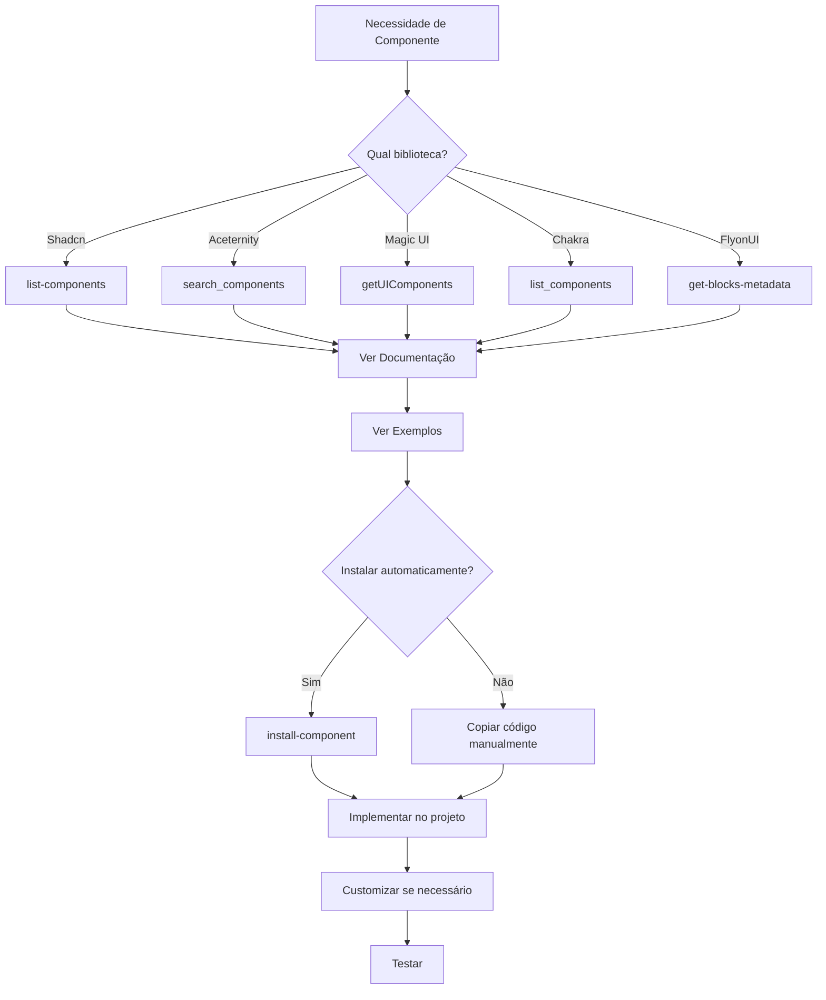

# Integração com UI Libraries

## Visão Geral

O Cursor Agent possui integrações MCP (Model Context Protocol) com as principais bibliotecas de componentes UI, permitindo instalação automatizada, acesso a documentação e exemplos de código.

---

## Bibliotecas Disponíveis

### 1. Shadcn UI
### 2. Aceternity UI
### 3. Magic UI
### 4. Chakra UI v3
### 5. FlyonUI

---

## 1. Shadcn UI

### Descrição
Coleção de componentes reutilizáveis construídos com Radix UI e Tailwind CSS.

### Ferramentas Disponíveis

#### list-components
Lista todos os componentes disponíveis.

```typescript
mcp_shadcn-ui-server_list-components()
```

#### get-component-docs
Obtém documentação de um componente específico.

```typescript
mcp_shadcn-ui-server_get-component-docs({
  component: "button"
})
```

#### install-component
Instala um componente no projeto.

```typescript
mcp_shadcn-ui-server_install-component({
  component: "button",
  runtime: "npm"  // ou "pnpm", "yarn", "bun"
})
```

#### Blocks (Templates Prontos)

```typescript
// Listar blocks
mcp_shadcn-ui-server_list-blocks()

// Documentação de block
mcp_shadcn-ui-server_get-block-docs({
  block: "sidebar-01"
})

// Instalar block
mcp_shadcn-ui-server_install-blocks({
  block: "sidebar-01",
  runtime: "npm"
})
```

### Exemplo Completo

```typescript
// 1. Listar componentes disponíveis
const components = await mcp_shadcn-ui-server_list-components();

// 2. Ver documentação do Button
const docs = await mcp_shadcn-ui-server_get-component-docs({
  component: "button"
});

// 3. Instalar Button
await mcp_shadcn-ui-server_install-component({
  component: "button",
  runtime: "npm"
});

// 4. Usar no código
await write({
  file_path: "src/components/MyButton.tsx",
  contents: `import { Button } from "@/components/ui/button";

export function MyButton() {
  return <Button variant="default">Click me</Button>;
}
`
});
```

---

## 2. Aceternity UI

### Descrição
Componentes modernos e animados para React/Next.js.

### Ferramentas Disponíveis

#### search_components
Busca componentes por query.

```typescript
mcp_aceternityui_search_components({
  query: "card animation",
  category: "cards"  // opcional
})
```

#### get_component_info
Informações detalhadas de um componente.

```typescript
mcp_aceternityui_get_component_info({
  componentName: "animated-card"
})
```

#### get_installation_info
Instruções de instalação.

```typescript
mcp_aceternityui_get_installation_info({
  componentName: "animated-card"
})
```

#### list_categories
Lista todas as categorias disponíveis.

```typescript
mcp_aceternityui_list_categories()
```

#### get_all_components
Lista todos os componentes.

```typescript
mcp_aceternityui_get_all_components({
  includeProOnly: false  // true para incluir componentes pro
})
```

### Exemplo Completo

```typescript
// 1. Buscar componente de card
const results = await mcp_aceternityui_search_components({
  query: "card hover effect",
  category: "cards"
});

// 2. Ver informações
const info = await mcp_aceternityui_get_component_info({
  componentName: "3d-card-effect"
});

// 3. Ver instalação
const installation = await mcp_aceternityui_get_installation_info({
  componentName: "3d-card-effect"
});

// 4. Implementar seguindo as instruções
```

---

## 3. Magic UI

### Descrição
Biblioteca de componentes com efeitos especiais e animações.

### Categorias Disponíveis

#### Components (Gerais)
```typescript
mcp_MagicUI_Design_getComponents()
// Retorna: marquee, terminal, hero-video-dialog, bento-grid,
//          animated-list, dock, globe, tweet-card, etc.
```

#### Device Mocks
```typescript
mcp_MagicUI_Design_getDeviceMocks()
// Retorna: safari, iphone-15-pro, android
```

#### Special Effects
```typescript
mcp_MagicUI_Design_getSpecialEffects()
// Retorna: animated-beam, border-beam, shine-border, magic-card,
//          meteors, neon-gradient-card, confetti, particles, etc.
```

#### Animations
```typescript
mcp_MagicUI_Design_getAnimations()
// Retorna: blur-fade
```

#### Text Animations
```typescript
mcp_MagicUI_Design_getTextAnimations()
// Retorna: text-animate, line-shadow-text, aurora-text,
//          number-ticker, animated-shiny-text, etc.
```

#### Buttons
```typescript
mcp_MagicUI_Design_getButtons()
// Retorna: rainbow-button, shimmer-button, shiny-button,
//          interactive-hover-button, etc.
```

#### Backgrounds
```typescript
mcp_MagicUI_Design_getBackgrounds()
// Retorna: warp-background, flickering-grid, animated-grid-pattern,
//          retro-grid, ripple, dot-pattern, etc.
```

#### UI Components (Lista Completa)
```typescript
mcp_MagicUI_Design_getUIComponents()
// Retorna: lista completa de todos os componentes
```

### Exemplo Completo

```typescript
// 1. Ver todos os componentes disponíveis
const allComponents = await mcp_MagicUI_Design_getUIComponents();

// 2. Ver detalhes de botões animados
const buttons = await mcp_MagicUI_Design_getButtons();

// 3. Implementar shimmer button
await write({
  file_path: "src/components/ShimmerButton.tsx",
  contents: `// Código do componente conforme documentação
import { ShimmerButton } from "@/components/magicui/shimmer-button";

export function MyShimmerButton() {
  return (
    <ShimmerButton className="shadow-2xl">
      <span className="text-white">Click me</span>
    </ShimmerButton>
  );
}
`
});
```

---

## 4. Chakra UI v3

### Descrição
Sistema de componentes modular para React com tema customizável.

### Ferramentas Disponíveis

#### get_theme
Obtém especificação completa do tema.

```typescript
mcp_chakra-ui_get_theme()
// Retorna: colors, fonts, textStyles, etc.
```

#### v2_to_v3_code_review
Guia de migração v2 → v3.

```typescript
mcp_chakra-ui_v2_to_v3_code_review({
  scenario: "button_icon_to_children"
})
```

**Scenarios disponíveis:**
- `package_json_updates`
- `chakra_provider_configuration`
- `color_mode_changes`
- `button_icon_to_children`
- `modal_to_dialog`
- `colorScheme_to_colorPalette`
- E muitos outros...

#### installation
Instruções de instalação por framework.

```typescript
mcp_chakra-ui_installation({
  framework: "next-app"  // "next-app", "next-pages", "vite", "general"
})
```

#### list_components
Lista todos os componentes disponíveis.

```typescript
mcp_chakra-ui_list_components()
```

#### get_component_props
Props de um componente específico.

```typescript
mcp_chakra-ui_get_component_props({
  component: "button"
})
```

#### get_component_example
Exemplos de uso de um componente.

```typescript
mcp_chakra-ui_get_component_example({
  component: "button"
})
```

#### customize_theme
Customizar tema.

```typescript
mcp_chakra-ui_customize_theme({
  category: "colors"  // "colors", "fonts", "spacing", etc.
})
```

### Exemplo Completo

```typescript
// 1. Ver instalação para Next.js App Router
const installation = await mcp_chakra-ui_installation({
  framework: "next-app"
});

// 2. Listar componentes
const components = await mcp_chakra-ui_list_components();

// 3. Ver props do Button
const props = await mcp_chakra-ui_get_component_props({
  component: "button"
});

// 4. Ver exemplos
const examples = await mcp_chakra-ui_get_component_example({
  component: "button"
});

// 5. Customizar tema
const themeColors = await mcp_chakra-ui_customize_theme({
  category: "colors"
});

// 6. Implementar
await write({
  file_path: "src/components/MyButton.tsx",
  contents: `import { Button } from "@chakra-ui/react";

export function MyButton() {
  return (
    <Button colorPalette="blue" size="lg">
      Click me
    </Button>
  );
}
`
});
```

### Migração v2 → v3

```typescript
// Ver guia de migração para botões
const guide = await mcp_chakra-ui_v2_to_v3_code_review({
  scenario: "button_icon_to_children"
});

// Aplicar mudanças baseado no guia
await search_replace({
  file_path: "src/components/Button.tsx",
  old_string: '<Button leftIcon={<Icon />}>Click</Button>',
  new_string: '<Button><Icon /> Click</Button>'
});
```

---

## 5. FlyonUI

### Descrição
Biblioteca de blocos e componentes para criação rápida de UIs.

### Ferramentas Disponíveis

#### get-create-instructions
Instruções para criar blocos.

```typescript
mcp_flyonui-mcp_get-create-instructions()
```

Usar quando: Usuário menciona `/create-flyonui` ou `/cui`.

#### get-inspire-instructions
Instruções para se inspirar em blocos existentes.

```typescript
mcp_flyonui-mcp_get-inspire-instructions()
```

Usar quando: Usuário menciona `/inspire-flyonui` ou `/iui`.

#### get-refine-instructions
Instruções para refinar blocos.

```typescript
mcp_flyonui-mcp_get-refine-instructions()
```

Usar quando: Usuário menciona `/refine-flyonui` ou `/rui`.

#### get-blocks-metadata
Metadados de todos os blocos.

```typescript
mcp_flyonui-mcp_get-blocks-metadata()
```

#### get-block-meta-content
Conteúdo de metadado específico.

```typescript
mcp_flyonui-mcp_get-block-meta-content({
  endpoint: "/api/blocks/hero-section"
})
```

#### get-block-content
Conteúdo de um bloco.

```typescript
mcp_flyonui-mcp_get-block-content({
  endpoint: "/api/blocks/hero-section",
  type: "jsx"  // ou "html", "vue", etc.
})
```

### Exemplo Completo

```typescript
// 1. Ver metadados de blocos
const metadata = await mcp_flyonui-mcp_get-blocks-metadata();

// 2. Escolher um bloco (ex: hero-section)
const blockMeta = await mcp_flyonui-mcp_get-block-meta-content({
  endpoint: "/api/blocks/hero-section"
});

// 3. Obter conteúdo do bloco
const blockContent = await mcp_flyonui-mcp_get-block-content({
  endpoint: "/api/blocks/hero-section",
  type: "jsx"
});

// 4. Implementar
await write({
  file_path: "src/components/Hero.tsx",
  contents: blockContent
});

// 5. Refinar se necessário
const refineInstructions = await mcp_flyonui-mcp_get-refine-instructions();
```

---

## Workflow de Integração UI

### Cenário: Adicionar Componente ao Projeto



### Exemplo Prático: Dashboard com Múltiplas Libraries

```typescript
// Projeto: Dashboard administrativo

// 1. Layout básico - Shadcn
await mcp_shadcn-ui-server_install-component({
  component: "sidebar",
  runtime: "npm"
});

// 2. Cartões animados - Aceternity
const cardInfo = await mcp_aceternityui_get_component_info({
  componentName: "3d-card-effect"
});

// 3. Gráficos especiais - Chakra UI
const chartExample = await mcp_chakra-ui_get_component_example({
  component: "area-chart"
});

// 4. Botões animados - Magic UI
const buttons = await mcp_MagicUI_Design_getButtons();

// 5. Seção hero - FlyonUI
const heroBlock = await mcp_flyonui-mcp_get-block-content({
  endpoint: "/api/blocks/dashboard-hero",
  type: "jsx"
});

// 6. Implementar tudo
// ... criar componentes usando os códigos obtidos ...
```

---

## Boas Práticas

### 1. Escolha da Biblioteca

```typescript
// Use a biblioteca adequada para o caso:

// Shadcn: Componentes básicos e profissionais
// - Formulários, tabelas, dialogs
// - Foco em acessibilidade

// Aceternity: Efeitos modernos e animações
// - Landing pages
// - Seções hero com impacto

// Magic UI: Efeitos especiais visuais
// - Backgrounds animados
// - Texto com efeitos
// - Partículas e confetti

// Chakra: Sistema completo e customizável
// - Dashboards complexos
// - Aplicações enterprise

// FlyonUI: Blocos prontos para prototipagem rápida
// - MVP rápido
// - Templates completos
```

### 2. Consistência

```typescript
// ✅ Boa prática: escolher 1-2 bibliotecas principais
// Shadcn para base + Magic UI para efeitos especiais

// ❌ Evite: misturar muitas bibliotecas sem critério
// Pode causar conflitos de estilo e aumentar bundle size
```

### 3. Customização

```typescript
// Sempre customize após instalar
await mcp_shadcn-ui-server_install-component({
  component: "button",
  runtime: "npm"
});

// Depois, customize:
await search_replace({
  file_path: "src/components/ui/button.tsx",
  old_string: 'className="..."',
  new_string: 'className="... custom-class"'
});
```

### 4. Documentação

```typescript
// Sempre documente qual biblioteca está usando
await write({
  file_path: "src/components/AnimatedCard.tsx",
  contents: `/**
 * Componente de Card Animado
 * Baseado em: Aceternity UI - 3D Card Effect
 * Documentação: https://ui.aceternity.com/components/3d-card-effect
 */
import { CardContainer } from "@/components/ui/3d-card";

export function AnimatedCard() {
  // ...
}
`
});
```

---

## TestSprite - QA Automatizado

### Descrição
Ferramenta integrada para geração e execução automatizada de testes.

### Ferramentas Disponíveis

#### testsprite_bootstrap_tests
Inicializar ambiente de testes.

```typescript
mcp_TestSprite_testsprite_bootstrap_tests({
  localPort: 3000,
  type: "frontend",  // ou "backend"
  projectPath: "/absolute/path/to/project",
  testScope: "codebase"  // ou "diff"
})
```

#### generate_code_summary
Analisa e resume o codebase.

```typescript
mcp_TestSprite_testsprite_generate_code_summary({
  projectRootPath: "/absolute/path/to/project"
})
```

#### generate_standardized_prd
Gera PRD estruturado.

```typescript
mcp_TestSprite_testsprite_generate_standardized_prd({
  projectPath: "/absolute/path/to/project"
})
```

#### generate_frontend_test_plan
Plano de testes para frontend.

```typescript
mcp_TestSprite_testsprite_generate_frontend_test_plan({
  projectPath: "/absolute/path/to/project",
  needLogin: true
})
```

#### generate_backend_test_plan
Plano de testes para backend.

```typescript
mcp_TestSprite_testsprite_generate_backend_test_plan({
  projectPath: "/absolute/path/to/project"
})
```

#### generate_code_and_execute
Gera e executa testes.

```typescript
mcp_TestSprite_testsprite_generate_code_and_execute({
  projectName: "my-project",
  projectPath: "/absolute/path/to/project",
  testIds: [],  // vazio = todos os testes
  additionalInstruction: ""
})
```

### Workflow Completo de QA

```typescript
// 1. Analisar codebase
const summary = await mcp_TestSprite_testsprite_generate_code_summary({
  projectRootPath: "/Users/dev/myproject"
});

// 2. Gerar PRD
const prd = await mcp_TestSprite_testsprite_generate_standardized_prd({
  projectPath: "/Users/dev/myproject"
});

// 3. Bootstrap testes
await mcp_TestSprite_testsprite_bootstrap_tests({
  localPort: 3000,
  type: "frontend",
  projectPath: "/Users/dev/myproject",
  testScope: "codebase"
});

// 4. Gerar plano de testes
const testPlan = await mcp_TestSprite_testsprite_generate_frontend_test_plan({
  projectPath: "/Users/dev/myproject",
  needLogin: true
});

// 5. Executar testes
const results = await mcp_TestSprite_testsprite_generate_code_and_execute({
  projectName: "myproject",
  projectPath: "/Users/dev/myproject",
  testIds: [],
  additionalInstruction: "Focar em componentes críticos"
});

// 6. Analisar resultados e gerar relatório
```

---

## Checklist de Integração

### Antes de Integrar

- [ ] Escolhi a biblioteca adequada para o caso de uso?
- [ ] Verifiquei compatibilidade com stack atual?
- [ ] Li a documentação do componente?
- [ ] Entendi as dependências necessárias?

### Durante Integração

- [ ] Instalei automaticamente ou copiei código corretamente?
- [ ] Customizei para o design system do projeto?
- [ ] Documentei a origem do componente?
- [ ] Testei o componente isoladamente?

### Após Integração

- [ ] Componente funciona conforme esperado?
- [ ] Estilo está consistente com o resto da aplicação?
- [ ] Performance está adequada?
- [ ] Acessibilidade foi mantida?

---

## Próximos Passos

- [Qualidade e Testes →](./06-qualidade-testes.md)
- [Workflows Completos →](../workflows/workflow-completo.md)
- [Referência Completa →](../reference/todas-ferramentas.md)

