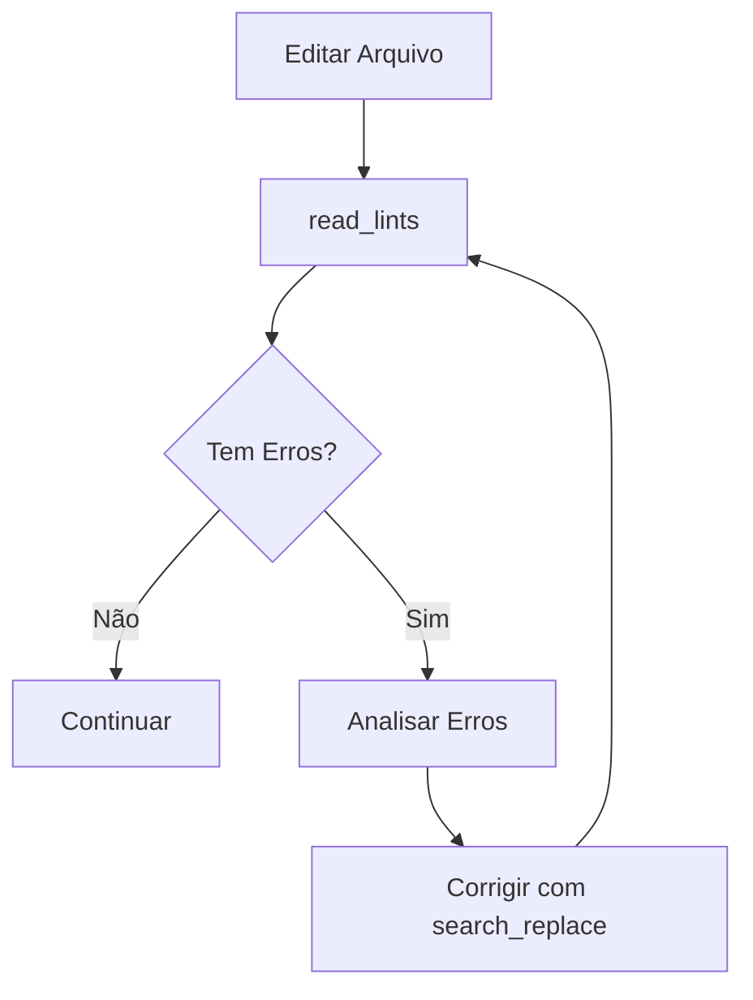

# Qualidade e Testes

## Visão Geral

O Cursor Agent possui ferramentas integradas para garantir qualidade de código e conformidade com os padrões do Protocolo Agente-CTO.

---

## Ferramentas de Qualidade

### 1. read_lints

#### Descrição
Lê erros e avisos do linter no workspace atual.

#### Parâmetros

```typescript
{
  paths?: string[]  // Opcional: arquivos/diretórios específicos
}
```

#### Quando Usar

✅ **Use quando:**
- Após fazer edições em arquivos
- Antes de finalizar uma tarefa
- Para validar qualidade do código
- Após merge de branches

❌ **Não use:**
- Em arquivos que você não editou
- Com escopo muito amplo (ex: todo o projeto se não editou tudo)

#### Exemplos

##### Exemplo 1: Verificar Arquivo Específico

```typescript
// Após editar src/api/user.ts
const lints = await read_lints({
  paths: ["src/api/user.ts"]
});
```

##### Exemplo 2: Verificar Diretório

```typescript
// Após editar múltiplos arquivos em src/components/
const lints = await read_lints({
  paths: ["src/components/"]
});
```

##### Exemplo 3: Verificar Múltiplos Arquivos

```typescript
const lints = await read_lints({
  paths: [
    "src/api/user.ts",
    "src/api/auth.ts",
    "src/types/user.ts"
  ]
});
```

##### Exemplo 4: Todo o Workspace

```typescript
// Use com cautela - apenas se editou muitos arquivos
const lints = await read_lints();
```

#### Output

```typescript
// Exemplo de output
{
  files: [
    {
      path: "src/api/user.ts",
      errors: [
        {
          line: 15,
          column: 10,
          severity: "error",
          message: "Type 'string' is not assignable to type 'number'",
          rule: "@typescript-eslint/no-type-error"
        }
      ],
      warnings: [
        {
          line: 20,
          column: 5,
          severity: "warning",
          message: "Unused variable 'temp'",
          rule: "@typescript-eslint/no-unused-vars"
        }
      ]
    }
  ],
  summary: {
    errorCount: 1,
    warningCount: 1,
    fileCount: 1
  }
}
```

#### Workflow de Correção



#### Exemplo Completo

```typescript
// 1. Fazer edição
await search_replace({
  file_path: "src/api/user.ts",
  old_string: "return user.name;",
  new_string: "return user.email;"
});

// 2. Verificar lints
const lints = await read_lints({
  paths: ["src/api/user.ts"]
});

// 3. Se houver erros, corrigir
if (lints.summary.errorCount > 0) {
  // Analisar primeiro erro
  const firstError = lints.files[0].errors[0];
  
  if (firstError.rule === "@typescript-eslint/no-type-error") {
    // Corrigir tipo
    await search_replace({
      file_path: "src/api/user.ts",
      old_string: "const id: number = user.id;",
      new_string: "const id: string = user.id;"
    });
    
    // Verificar novamente
    const newLints = await read_lints({
      paths: ["src/api/user.ts"]
    });
  }
}
```

---

## Estratégias de Teste

### Coverage Mínimo: 80%

De acordo com o Protocolo CTO (Regra 31), todo módulo deve ter **80%+ de coverage**.

### Tipos de Teste

#### 1. Testes Unitários

**Objetivo**: Testar funções/classes isoladamente.

```typescript
// Exemplo: src/utils/auth.ts
export function hashPassword(password: string): string {
  return bcrypt.hashSync(password, 12);
}

// Teste: src/utils/auth.test.ts
import { hashPassword } from './auth';

describe('hashPassword', () => {
  it('should hash password correctly', () => {
    const password = 'myPassword123';
    const hashed = hashPassword(password);
    
    expect(hashed).toBeDefined();
    expect(hashed).not.toBe(password);
    expect(hashed.length).toBeGreaterThan(0);
  });
  
  it('should generate different hashes for same password', () => {
    const password = 'myPassword123';
    const hash1 = hashPassword(password);
    const hash2 = hashPassword(password);
    
    expect(hash1).not.toBe(hash2);
  });
});
```

#### 2. Testes de Integração

**Objetivo**: Testar interações entre módulos.

```typescript
// Exemplo: Teste de API completo
import request from 'supertest';
import app from '../app';
import db from '../db';

describe('POST /auth/login', () => {
  beforeAll(async () => {
    await db.connect();
  });
  
  afterAll(async () => {
    await db.disconnect();
  });
  
  it('should login with valid credentials', async () => {
    const response = await request(app)
      .post('/auth/login')
      .send({
        email: 'test@example.com',
        password: 'password123'
      });
    
    expect(response.status).toBe(200);
    expect(response.body).toHaveProperty('token');
    expect(response.body).toHaveProperty('user');
  });
  
  it('should reject invalid credentials', async () => {
    const response = await request(app)
      .post('/auth/login')
      .send({
        email: 'test@example.com',
        password: 'wrongpassword'
      });
    
    expect(response.status).toBe(401);
    expect(response.body).toHaveProperty('error');
  });
});
```

#### 3. Testes E2E (End-to-End)

**Objetivo**: Testar fluxos completos do usuário.

```typescript
// Exemplo: Playwright/Cypress
import { test, expect } from '@playwright/test';

test('user can complete registration flow', async ({ page }) => {
  // 1. Navegar para página de registro
  await page.goto('/register');
  
  // 2. Preencher formulário
  await page.fill('[name="name"]', 'John Doe');
  await page.fill('[name="email"]', 'john@example.com');
  await page.fill('[name="password"]', 'password123');
  
  // 3. Submeter
  await page.click('[type="submit"]');
  
  // 4. Verificar redirecionamento
  await expect(page).toHaveURL('/dashboard');
  
  // 5. Verificar mensagem de sucesso
  await expect(page.locator('.success-message')).toBeVisible();
});
```

---

## Cobertura de Teste (Coverage)

### Verificar Coverage

```typescript
{
  command: "npm test -- --coverage",
  is_background: false,
  explanation: "Executar testes com relatório de coverage"
}
```

### Output Exemplo

```
--------------------|---------|----------|---------|---------|-------------------
File                | % Stmts | % Branch | % Funcs | % Lines | Uncovered Line #s 
--------------------|---------|----------|---------|---------|-------------------
All files           |   85.5  |   80.2   |   88.9  |   85.5  |                   
 api/               |   90.0  |   85.0   |   100   |   90.0  |                   
  user.ts           |   90.0  |   85.0   |   100   |   90.0  | 45-48             
 utils/             |   75.0  |   70.0   |   75.0  |   75.0  |                   
  auth.ts           |   75.0  |   70.0   |   75.0  |   75.0  | 12-15,30          
--------------------|---------|----------|---------|---------|-------------------
```

### Atingir 80%+

```typescript
// Identificar linhas não cobertas
// No exemplo acima: auth.ts linhas 12-15,30

// 1. Ler arquivo
const content = await read_file({
  target_file: "src/utils/auth.ts",
  offset: 10,
  limit: 25
});

// 2. Analisar linhas não cobertas
// Linhas 12-15: Error handling não testado
// Linha 30: Edge case não testado

// 3. Adicionar testes
await write({
  file_path: "src/utils/auth.test.ts",
  contents: `// ... testes existentes ...

describe('Error handling', () => {
  it('should throw on invalid password', () => {
    expect(() => hashPassword('')).toThrow();
  });
  
  it('should throw on null password', () => {
    expect(() => hashPassword(null)).toThrow();
  });
});

describe('Edge cases', () => {
  it('should handle very long passwords', () => {
    const longPassword = 'a'.repeat(1000);
    const hashed = hashPassword(longPassword);
    expect(hashed).toBeDefined();
  });
});
`
});

// 4. Executar testes novamente
{
  command: "npm test -- --coverage",
  is_background: false
}

// 5. Verificar se atingiu 80%+
```

---

## Validação de Schema (Regra 19)

### Zod (Recomendado)

```typescript
// Instalar Zod
{
  command: "npm install zod",
  is_background: false,
  required_permissions: ["network"]
}

// Implementar validação
await write({
  file_path: "src/schemas/user.ts",
  contents: `import { z } from 'zod';

export const userSchema = z.object({
  name: z.string().min(2).max(100),
  email: z.string().email(),
  password: z.string().min(8).regex(/[A-Z]/).regex(/[0-9]/),
  age: z.number().int().positive().optional()
});

export type User = z.infer<typeof userSchema>;

export const loginSchema = z.object({
  email: z.string().email(),
  password: z.string().min(1)
});

export type LoginData = z.infer<typeof loginSchema>;
`
});

// Usar em endpoint
await write({
  file_path: "src/api/auth.ts",
  contents: `import { loginSchema } from '../schemas/user';

export async function login(req, res) {
  try {
    // Validar entrada
    const data = loginSchema.parse(req.body);
    
    // Processar login
    const result = await authService.login(data.email, data.password);
    
    res.json(result);
  } catch (error) {
    if (error instanceof z.ZodError) {
      res.status(400).json({ 
        error: 'Validation failed',
        details: error.errors 
      });
      return;
    }
    
    res.status(500).json({ error: 'Internal error' });
  }
}
`
});
```

---

## Checklist de Qualidade (Protocolo CTO)

### Antes de Finalizar Qualquer Tarefa

```typescript
const qualityChecklist = {
  code: [
    { id: 1, check: "Código completo (sem mocks/placeholders)", status: "pending" },
    { id: 2, check: "CRUDs completos (C,R,U,D com error handling)", status: "pending" },
    { id: 3, check: "Validação de schema (Zod) em todos endpoints", status: "pending" },
    { id: 4, check: "Nomes autoexplicativos (sem abreviações)", status: "pending" },
    { id: 5, check: "Documentação inline (JSDoc)", status: "pending" }
  ],
  tests: [
    { id: 6, check: "Testes unitários implementados", status: "pending" },
    { id: 7, check: "Testes de integração implementados", status: "pending" },
    { id: 8, check: "Coverage >= 80%", status: "pending" },
    { id: 9, check: "Cenários positivos testados", status: "pending" },
    { id: 10, check: "Cenários negativos testados", status: "pending" },
    { id: 11, check: "Edge cases testados", status: "pending" }
  ],
  quality: [
    { id: 12, check: "Lint passou sem erros", status: "pending" },
    { id: 13, check: "Type checking passou", status: "pending" },
    { id: 14, check: "Build executado com sucesso", status: "pending" },
    { id: 15, check: "Sem console.log deixados", status: "pending" }
  ],
  docs: [
    { id: 16, check: "README atualizado", status: "pending" },
    { id: 17, check: "Workflow Mermaid criado/atualizado", status: "pending" },
    { id: 18, check: "ADR criado para decisões técnicas", status: "pending" },
    { id: 19, check: "Changelog atualizado", status: "pending" }
  ]
};
```

### Validação Automatizada

```typescript
// Executar todas as validações
async function validateQuality(files: string[]) {
  // 1. Lint
  const lints = await read_lints({ paths: files });
  
  if (lints.summary.errorCount > 0) {
    console.error('❌ Lint errors found');
    return false;
  }
  
  // 2. Type Check
  const typeCheck = await run_terminal_cmd({
    command: "npm run type-check",
    is_background: false
  });
  
  if (typeCheck.exitCode !== 0) {
    console.error('❌ Type errors found');
    return false;
  }
  
  // 3. Tests
  const tests = await run_terminal_cmd({
    command: "npm test",
    is_background: false
  });
  
  if (tests.exitCode !== 0) {
    console.error('❌ Tests failed');
    return false;
  }
  
  // 4. Coverage
  const coverage = await run_terminal_cmd({
    command: "npm test -- --coverage --silent",
    is_background: false
  });
  
  // Parsear output para verificar >= 80%
  const coverageMatch = coverage.stdout.match(/All files.*?(\d+\.?\d*)/);
  const coveragePercent = parseFloat(coverageMatch?.[1] || '0');
  
  if (coveragePercent < 80) {
    console.error(`❌ Coverage ${coveragePercent}% < 80%`);
    return false;
  }
  
  // 5. Build
  const build = await run_terminal_cmd({
    command: "npm run build",
    is_background: false
  });
  
  if (build.exitCode !== 0) {
    console.error('❌ Build failed');
    return false;
  }
  
  console.log('✅ All quality checks passed');
  return true;
}
```

---

## Integração com CI/CD

### Pipeline Local

```typescript
// Simular pipeline CI/CD antes de commit
{
  command: "npm run lint && npm run type-check && npm test && npm run build",
  is_background: false,
  explanation: "Executar pipeline completo de validação"
}
```

### Pre-commit Hook

```bash
#!/bin/sh
# .husky/pre-commit

echo "🔍 Running quality checks..."

# Lint
npm run lint || exit 1

# Type check
npm run type-check || exit 1

# Tests
npm test || exit 1

echo "✅ Quality checks passed!"
```

---

## TestSprite - QA Automatizado

### Workflow Completo

```typescript
// 1. Bootstrap
await mcp_TestSprite_testsprite_bootstrap_tests({
  localPort: 3000,
  type: "frontend",
  projectPath: "/absolute/path/to/project",
  testScope: "codebase"
});

// 2. Analisar codebase
const summary = await mcp_TestSprite_testsprite_generate_code_summary({
  projectRootPath: "/absolute/path/to/project"
});

// 3. Gerar PRD
const prd = await mcp_TestSprite_testsprite_generate_standardized_prd({
  projectPath: "/absolute/path/to/project"
});

// 4. Gerar plano de testes
const testPlan = await mcp_TestSprite_testsprite_generate_frontend_test_plan({
  projectPath: "/absolute/path/to/project",
  needLogin: true
});

// 5. Executar testes
const results = await mcp_TestSprite_testsprite_generate_code_and_execute({
  projectName: "myproject",
  projectPath: "/absolute/path/to/project",
  testIds: [],  // todos os testes
  additionalInstruction: ""
});

// 6. Analisar resultados
// TestSprite gera relatório markdown automaticamente
```

---

## Melhores Práticas

### 1. TDD (Test-Driven Development)

```typescript
// 1. Escrever teste primeiro
await write({
  file_path: "src/utils/math.test.ts",
  contents: `import { add } from './math';

test('add should sum two numbers', () => {
  expect(add(2, 3)).toBe(5);
});
`
});

// 2. Implementar função
await write({
  file_path: "src/utils/math.ts",
  contents: `export function add(a: number, b: number): number {
  return a + b;
}
`
});

// 3. Executar teste
{
  command: "npm test math.test.ts",
  is_background: false
}
```

### 2. Arrange-Act-Assert (AAA)

```typescript
test('user registration should create new user', async () => {
  // Arrange (preparar)
  const userData = {
    name: 'John Doe',
    email: 'john@example.com',
    password: 'password123'
  };
  
  // Act (agir)
  const result = await authService.register(userData);
  
  // Assert (verificar)
  expect(result).toBeDefined();
  expect(result.id).toBeDefined();
  expect(result.email).toBe(userData.email);
  expect(result.password).not.toBe(userData.password); // deve estar hasheado
});
```

### 3. Testes Isolados

```typescript
// ✅ Bom: cada teste é independente
describe('UserService', () => {
  beforeEach(() => {
    // Limpar estado antes de cada teste
    db.reset();
  });
  
  test('should create user', async () => {
    const user = await userService.create({ name: 'John' });
    expect(user).toBeDefined();
  });
  
  test('should find user', async () => {
    await userService.create({ name: 'John' });
    const found = await userService.findByName('John');
    expect(found).toBeDefined();
  });
});

// ❌ Ruim: testes dependentes
test('should create user', async () => {
  globalUser = await userService.create({ name: 'John' });
  expect(globalUser).toBeDefined();
});

test('should find user', async () => {
  // Depende do teste anterior
  const found = await userService.findById(globalUser.id);
  expect(found).toBeDefined();
});
```

---

## Troubleshooting

### Testes Falhando

1. **Verificar se é problema de código ou de teste**
   ```typescript
   // Execute teste individualmente
   { command: "npm test -- user.test.ts" }
   ```

2. **Verificar mock/stubs**
   ```typescript
   // Mocks podem estar desatualizados
   ```

3. **Verificar ambiente**
   ```typescript
   // Variáveis de ambiente, DB, etc
   ```

### Coverage Baixo

1. **Identificar arquivos não cobertos**
   ```typescript
   { command: "npm test -- --coverage --verbose" }
   ```

2. **Adicionar testes para cenários faltantes**
   - Error handling
   - Edge cases
   - Cenários negativos

### Lint Errors Persistentes

1. **Verificar configuração**
   ```typescript
   await read_file({ target_file: ".eslintrc.json" });
   ```

2. **Verificar se arquivo está no scope**
   ```typescript
   // Arquivo pode estar em .eslintignore
   ```

3. **Executar fix automático**
   ```typescript
   { command: "npm run lint -- --fix" }
   ```

---

## Próximos Passos

- [Workflows Completos →](../workflows/workflow-completo.md)
- [Protocolo CTO →](../workflows/protocolo-cto.md)
- [Referência Completa →](../reference/todas-ferramentas.md)

