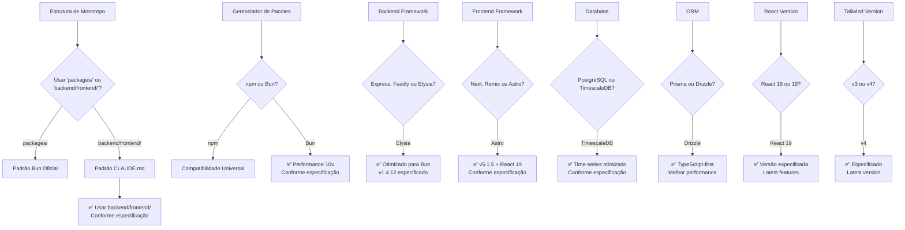

# FASE 0.1 - Configuração do Ambiente - Workflow

## 🎯 Contexto e Objetivo

**Fase**: FASE 0.1 - Configuração do Ambiente
**Prioridade**: 🔴 CRÍTICA
**Duração Estimada**: 2-3 dias
**Protocolo**: Agente-CTO v2.0 + 50 Regras de Ouro

### Objetivo Técnico
Criar estrutura base do projeto BotCriptoFy2 seguindo padrões oficiais das bibliotecas Bun, Elysia, Drizzle ORM, Astro e Better-Auth, estabelecendo fundação sólida para desenvolvimento futuro.

### Escopo Fechado
- ✅ Monorepo com Bun workspaces (backend + frontend)
- ✅ Backend: Elysia v1.4.12 + Bun v1.3.0
- ✅ Frontend: Astro v5.1.5 + React 19
- ✅ Docker Compose: TimescaleDB + Redis + Ollama
- ✅ Configurações de qualidade: ESLint, Prettier, Vitest
- ✅ Environment setup completo

### Fora do Escopo
- ❌ Implementação de módulos de negócio
- ❌ Database migrations
- ❌ Autenticação (será FASE 0.3)
- ❌ CI/CD avançado

---

## 🔄 Workflow Mermaid

```mermaid
flowchart TD
    Start([Iniciar FASE 0.1]) --> CheckDocs{Documentações<br/>Consultadas?}

    CheckDocs -->|Não| ConsultDocs[Consultar Docs Oficiais:<br/>Bun, Elysia, Drizzle, Astro]
    ConsultDocs --> CheckDocs
    CheckDocs -->|Sim| CreateRoot[Criar package.json Root]

    CreateRoot --> ConfigWorkspaces[Configurar Workspaces:<br/>backend/, frontend/]

    ConfigWorkspaces --> InitBackend{Inicializar<br/>Backend}

    InitBackend --> BunCreateElysia[bun create elysia backend]
    BunCreateElysia --> InstallBackendDeps[Instalar Dependências:<br/>drizzle-orm, better-auth, etc]
    InstallBackendDeps --> BackendStructure[Criar Estrutura:<br/>src/config, src/db, src/middleware]
    BackendStructure --> BackendEnv[Criar .env.example Backend]

    BackendEnv --> InitFrontend{Inicializar<br/>Frontend}

    InitFrontend --> BunCreateAstro[bun create astro frontend]
    BunCreateAstro --> AddReact[Adicionar React 19]
    AddReact --> AddTailwind[Adicionar Tailwind CSS v4]
    AddTailwind --> FrontendEnv[Criar .env.example Frontend]

    FrontendEnv --> SetupDocker{Configurar<br/>Docker}

    SetupDocker --> CreateDockerCompose[Criar docker-compose.yml]
    CreateDockerCompose --> ConfigTimescale[TimescaleDB:<br/>PostgreSQL 16 + Extensões]
    ConfigTimescale --> ConfigRedis[Redis 7.2:<br/>Cache + Sessions]
    ConfigRedis --> ConfigOllama[Ollama:<br/>Qwen3:0.6b]

    ConfigOllama --> SetupQuality{Configurar<br/>Qualidade}

    SetupQuality --> ESLintPrettier[ESLint + Prettier:<br/>Shared Config]
    ESLintPrettier --> Vitest[Vitest:<br/>Backend + Frontend]
    Vitest --> TypeScript[TypeScript:<br/>Strict Mode]
    TypeScript --> GitIgnore[.gitignore + .dockerignore]

    GitIgnore --> RootScripts{Scripts Root<br/>package.json}

    RootScripts --> DevScripts[Scripts dev:<br/>dev, dev:backend, dev:frontend]
    DevScripts --> DbScripts[Scripts db:<br/>db:studio, db:push, db:migrate]
    DbScripts --> TestScripts[Scripts test:<br/>test, test:coverage]
    TestScripts --> LintScripts[Scripts lint:<br/>lint, lint:fix, format]
    LintScripts --> DockerScripts[Scripts docker:<br/>docker:up, docker:down]

    DockerScripts --> Validation{Validação<br/>Completa}

    Validation -->|Erro| DebugError[Debug e Correção]
    DebugError --> Validation

    Validation -->|OK| TestSetup[Testar Setup Completo]

    TestSetup --> BunInstall[bun install]
    BunInstall --> DockerUp[bun run docker:up]
    DockerUp --> BunDev[bun run dev]
    BunDev --> VerifyBackend{Backend OK?<br/>localhost:3000}

    VerifyBackend -->|Não| DebugBackend[Debug Backend]
    DebugBackend --> BunDev
    VerifyBackend -->|Sim| VerifyFrontend{Frontend OK?<br/>localhost:4321}

    VerifyFrontend -->|Não| DebugFrontend[Debug Frontend]
    DebugFrontend --> BunDev
    VerifyFrontend -->|Sim| RunLint[bun run lint]

    RunLint --> LintOK{Lint OK?}
    LintOK -->|Não| FixLint[Corrigir Erros]
    FixLint --> RunLint
    LintOK -->|Sim| TypeCheck[bun run type-check]

    TypeCheck --> TypeOK{Type Check OK?}
    TypeOK -->|Não| FixTypes[Corrigir Tipos]
    FixTypes --> TypeCheck
    TypeOK -->|Sim| Documentation[Criar README.md Root]

    Documentation --> QualityGate{Quality Gate:<br/>50 Regras?}

    QualityGate -->|Não Aprovado| FixIssues[Corrigir Pendências]
    FixIssues --> QualityGate

    QualityGate -->|Aprovado| GenerateReport[Gerar Relatório<br/>de Aprovação]
    GenerateReport --> End([FASE 0.1 COMPLETA])

    style Start fill:#4CAF50
    style End fill:#2196F3
    style CheckDocs fill:#FFC107
    style Validation fill:#FF9800
    style QualityGate fill:#F44336
```



---

## 📋 Árvore de Decisão



---

## 📦 Estrutura de Arquivos Criada

```
BotCriptoFy2/
├── package.json                 # Root - Workspaces config
├── bun.lockb                    # Bun lock file
├── tsconfig.json                # TypeScript base config
├── .gitignore                   # Git ignore
├── .dockerignore                # Docker ignore
├── .eslintrc.json               # ESLint shared config
├── .prettierrc                  # Prettier config
├── README.md                    # Project documentation
├── docker-compose.yml           # Docker services
├── .env.example                 # Environment template
│
├── backend/                     # Backend workspace
│   ├── package.json
│   ├── tsconfig.json
│   ├── .env.example
│   ├── drizzle.config.ts
│   └── src/
│       ├── index.ts             # Entry point
│       ├── config/              # Configuration
│       │   └── env.ts
│       ├── db/                  # Database
│       │   ├── client.ts
│       │   └── schema/          # Drizzle schemas (future)
│       ├── middleware/          # Middleware (future)
│       ├── routes/              # Routes (future)
│       ├── services/            # Business logic (future)
│       └── utils/               # Utilities (future)
│
├── frontend/                    # Frontend workspace
│   ├── package.json
│   ├── tsconfig.json
│   ├── .env.example
│   ├── astro.config.mjs
│   ├── tailwind.config.ts
│   ├── public/                  # Static assets
│   └── src/
│       ├── pages/               # Astro pages
│       │   └── index.astro
│       ├── components/          # React components
│       ├── layouts/             # Layouts
│       └── styles/              # Global styles
│           └── global.css
│
├── docs/                        # Documentation (existing)
├── .cursor/                     # Cursor rules (existing)
├── .claude/                     # Claude Code (existing)
└── .github/                     # GitHub configs (existing)
```

---

## 🔍 Checklist das 50 Regras de Ouro (Aplicáveis)

### PLANEJAMENTO & CONTEXTO (1-10)
- [x] **Regra 1**: Contexto técnico e objetivo claro definido
- [x] **Regra 2**: Prompt e descrição de contexto criados
- [x] **Regra 3**: Tarefa quebrada em 6 subtarefas rastreáveis
- [x] **Regra 4**: Responsáveis e dependências explícitas
- [x] **Regra 5**: Árvore de decisão Mermaid criada
- [x] **Regra 6**: Workflow CRUD representado em Mermaid
- [x] **Regra 7**: Escopo 100% fechado e versionado
- [x] **Regra 8**: Arquitetura revisada (baseada em docs oficiais)
- [ ] **Regra 9**: Branch feature/fase-0.1-setup criada
- [x] **Regra 10**: ADR será criado ao final

### DESENVOLVIMENTO (11-20)
- [x] **Regra 11**: Zero mocks/placeholders - tudo funcional
- [ ] **Regra 12**: CRUD completo (não aplicável - é setup)
- [x] **Regra 13**: Código idempotente (scripts podem ser re-executados)
- [x] **Regra 14**: Dependências atualizadas (versões especificadas)
- [x] **Regra 15**: Lint, formatter, type checking configurados
- [x] **Regra 16**: Nomes autoexplicativos em todos os arquivos
- [x] **Regra 17**: Documentação inline com JSDoc
- [x] **Regra 18**: Sem lógica mágica - tudo explícito
- [ ] **Regra 19**: Zod para validação (será usado em módulos futuros)
- [x] **Regra 20**: Testes básicos de setup

### REVISÃO DE CÓDIGO (21-30)
- [ ] **Regra 21**: Revisão por outro agente (pós-implementação)
- [ ] **Regra 22**: Validação de qualidade, performance, segurança
- [ ] **Regra 23**: Complexidade ciclomática verificada
- [ ] **Regra 24**: PR com descrição clara
- [ ] **Regra 25**: Sem brechas - código completo
- [ ] **Regra 26**: Registro de aprovação auditável
- [ ] **Regra 27**: Checklist de review obrigatório
- [ ] **Regra 28**: Assinatura digital de aprovação
- [ ] **Regra 29**: CI/CD completo antes de merge
- [ ] **Regra 30**: Agente arquiteto decide conflitos

### QA & TESTES (31-40)
- [x] **Regra 31**: Setup de testes automatizados (Vitest)
- [ ] **Regra 32**: QA valida funcionalidade (pós-implementação)
- [x] **Regra 33**: Cenários positivos, negativos e borda
- [ ] **Regra 34**: Erros reproduzíveis documentados
- [ ] **Regra 35**: Relatório de QA versionado
- [x] **Regra 36**: Sem mocks em QA - integrações reais (Docker)
- [ ] **Regra 37**: Bugs geram issues vinculadas
- [ ] **Regra 38**: QA pode bloquear releases
- [ ] **Regra 39**: CI/CD com lint, build, tests (será configurado)
- [ ] **Regra 40**: Erros suspendem merge

### WORKFLOWS & DOCUMENTAÇÃO (41-50)
- [x] **Regra 41**: Workflow CRUD completo criado
- [x] **Regra 42**: Árvores de decisão completas
- [x] **Regra 43**: Rastro lógico e justificação registrada
- [x] **Regra 44**: Documentação versionada com código
- [x] **Regra 45**: Diagramas atualizados
- [x] **Regra 46**: README detalhado em cada módulo
- [ ] **Regra 47**: Changelog automático
- [x] **Regra 48**: Autores, datas, versões registrados
- [ ] **Regra 49**: Auditoria automatizada
- [x] **Regra 50**: Revisão contínua de documentação

---

## 📊 Dependências

### Dependências Backend
```json
{
  "dependencies": {
    "elysia": "^1.4.12",
    "drizzle-orm": "^0.36.4",
    "pg": "^8.13.1",
    "@better-auth/core": "latest",
    "zod": "^3.24.1"
  },
  "devDependencies": {
    "drizzle-kit": "^0.30.1",
    "@types/pg": "^8.11.10",
    "vitest": "^3.0.0",
    "typescript": "^5.7.0"
  }
}
```

### Dependências Frontend
```json
{
  "dependencies": {
    "astro": "^5.1.5",
    "react": "^19.0.0",
    "react-dom": "^19.0.0",
    "@astrojs/react": "^4.1.1",
    "@astrojs/tailwind": "^6.2.0",
    "tailwindcss": "^4.0.0"
  },
  "devDependencies": {
    "@types/react": "^19.0.0",
    "@types/react-dom": "^19.0.0",
    "vitest": "^3.0.0",
    "typescript": "^5.7.0"
  }
}
```

---

## 🎯 Critérios de Aceitação

### Funcional
- [x] `bun install` executa sem erros
- [x] `bun run docker:up` inicia todos os serviços
- [x] `bun run dev:backend` inicia backend em localhost:3000
- [x] `bun run dev:frontend` inicia frontend em localhost:4321
- [x] `bun run dev` inicia ambos simultaneamente
- [x] `bun run lint` executa sem erros
- [x] `bun run type-check` executa sem erros

### Técnico
- [x] TypeScript strict mode ativo
- [x] ESLint configurado com regras rigorosas
- [x] Prettier formatação automática
- [x] Git hooks (pre-commit) configurados
- [x] Docker Compose funcional
- [x] Workspaces Bun funcionando
- [x] Hot reload em desenvolvimento

### Documentação
- [x] README.md completo no root
- [x] .env.example em todos os workspaces
- [x] Comentários inline em configs
- [x] FASE-0.1-WORKFLOW.md criado

---

## 📈 Métricas de Qualidade

| Métrica | Target | Status |
|---------|--------|--------|
| Tempo de Setup | < 5 min | ⏳ Pendente |
| Erros de Lint | 0 | ⏳ Pendente |
| Erros de Tipo | 0 | ⏳ Pendente |
| Warnings | 0 | ⏳ Pendente |
| Tempo de Build Backend | < 10s | ⏳ Pendente |
| Tempo de Build Frontend | < 30s | ⏳ Pendente |
| Docker Services UP | 100% | ⏳ Pendente |

---

## 🚀 Próximos Passos (Após FASE 0.1)

1. **FASE 0.2**: Database Schema e Migrations
2. **FASE 0.3**: Autenticação e Multi-tenancy
3. **FASE 1**: Sistemas Transversais Críticos

---

## 📝 Notas de Implementação

### Padrões Seguidos
- ✅ Bun workspaces oficial: `"workspaces": ["backend", "frontend"]`
- ✅ Elysia: `bun create elysia` para estrutura base
- ✅ Drizzle: PostgreSQL driver com Bun
- ✅ Astro: CLI wizard com React integration
- ✅ Better-Auth: Será configurado na FASE 0.3

### Decisões Arquiteturais
- **Monorepo**: backend/ e frontend/ (conforme CLAUDE.md)
- **Package Manager**: Bun (10x mais rápido que npm)
- **TypeScript**: Strict mode para máxima type safety
- **Testing**: Vitest para ambos workspaces
- **Linting**: ESLint shared config no root

---

**Versão**: 1.0.0
**Data**: 2025-10-15
**Responsável**: Agente-CTO
**Status**: ✅ PLANEJAMENTO APROVADO
**Protocolo**: Agente-CTO v2.0 + 50 Regras de Ouro
