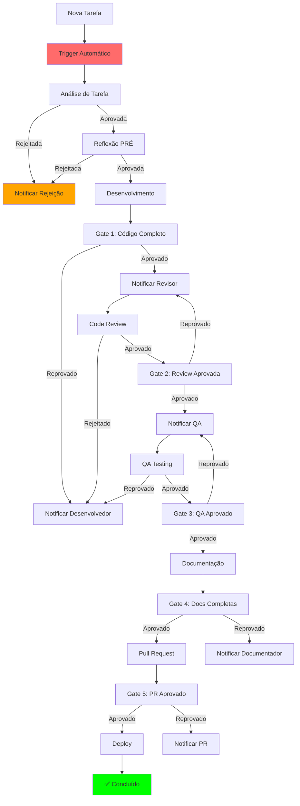

# Sistema de Integração Automatizada

## Visão Geral

Sistema **obrigatório** que automatiza a integração entre todas as fases do desenvolvimento, garantindo fluxo contínuo e notificações em tempo real entre agentes.

---

## 🎯 Objetivo

Garantir que **TODAS as fases** sejam integradas automaticamente, evitando:
- ❌ Fases esquecidas ou puladas
- ❌ Comunicação manual entre agentes
- ❌ Bloqueios não detectados
- ❌ Status desatualizado
- ❌ Retrabalho por falta de coordenação

---

## 🔄 Fluxo de Integração Automatizada

### **Arquitetura do Sistema**



---

## 🔧 Implementação do Sistema

### **Sistema de Triggers Automáticos**

```typescript
/**
 * Sistema de Triggers Automáticos
 * 
 * Dispara automaticamente a próxima fase quando a atual é concluída
 */
class AutomatedIntegrationSystem {
  private triggers: Map<string, TriggerHandler> = new Map();
  private notifications: NotificationService;
  private dashboard: DashboardService;
  
  constructor() {
    this.notifications = new NotificationService();
    this.dashboard = new DashboardService();
    this.setupTriggers();
  }
  
  /**
   * Configurar todos os triggers do sistema
   */
  private setupTriggers(): void {
    // Trigger: Análise de Tarefa → Reflexão PRÉ
    this.triggers.set('task-analysis-approved', async (taskId: string) => {
      console.log(`🔄 Trigger: Análise aprovada para ${taskId}`);
      
      // Notificar desenvolvedor
      await this.notifications.notify({
        to: await this.getDeveloper(taskId),
        type: 'TASK_ANALYSIS_APPROVED',
        message: 'Análise de tarefa aprovada. Iniciar reflexão PRÉ.',
        taskId,
        nextAction: 'EXECUTE_PRE_REFLECTION'
      });
      
      // Atualizar dashboard
      await this.dashboard.updateTaskStatus(taskId, 'ANALYSIS_APPROVED');
      
      // Criar TODO de reflexão PRÉ
      await this.createTodo(taskId, 'pre-reflection', 'Executar reflexão PRÉ obrigatória');
    });
    
    // Trigger: Reflexão PRÉ → Desenvolvimento
    this.triggers.set('pre-reflection-approved', async (taskId: string) => {
      console.log(`🔄 Trigger: Reflexão PRÉ aprovada para ${taskId}`);
      
      // Notificar desenvolvedor
      await this.notifications.notify({
        to: await this.getDeveloper(taskId),
        type: 'PRE_REFLECTION_APPROVED',
        message: 'Reflexão PRÉ aprovada. Iniciar desenvolvimento.',
        taskId,
        nextAction: 'START_DEVELOPMENT'
      });
      
      // Atualizar dashboard
      await this.dashboard.updateTaskStatus(taskId, 'DEVELOPMENT_READY');
      
      // Criar TODO de desenvolvimento
      await this.createTodo(taskId, 'development', 'Iniciar desenvolvimento');
    });
    
    // Trigger: Gate 1 → Code Review
    this.triggers.set('gate1-approved', async (taskId: string) => {
      console.log(`🔄 Trigger: Gate 1 aprovado para ${taskId}`);
      
      // Notificar revisor
      const reviewer = await this.getReviewer(taskId);
      await this.notifications.notify({
        to: reviewer,
        type: 'GATE1_APPROVED',
        message: 'Gate 1 aprovado. Código pronto para revisão.',
        taskId,
        nextAction: 'START_CODE_REVIEW'
      });
      
      // Atualizar dashboard
      await this.dashboard.updateTaskStatus(taskId, 'READY_FOR_REVIEW');
      
      // Criar TODO de revisão
      await this.createTodo(taskId, 'code-review', 'Executar revisão de código');
    });
    
    // Trigger: Code Review → Gate 2
    this.triggers.set('code-review-completed', async (taskId: string) => {
      console.log(`🔄 Trigger: Code review completada para ${taskId}`);
      
      const review = await this.getCodeReview(taskId);
      
      if (review.approved) {
        // Notificar QA
        const qa = await this.getQA(taskId);
        await this.notifications.notify({
          to: qa,
          type: 'CODE_REVIEW_APPROVED',
          message: 'Code review aprovada. Código pronto para QA.',
          taskId,
          nextAction: 'START_QA'
        });
        
        // Atualizar dashboard
        await this.dashboard.updateTaskStatus(taskId, 'READY_FOR_QA');
        
        // Criar TODO de QA
        await this.createTodo(taskId, 'qa', 'Executar QA');
      } else {
        // Notificar desenvolvedor
        await this.notifications.notify({
          to: await this.getDeveloper(taskId),
          type: 'CODE_REVIEW_REJECTED',
          message: 'Code review rejeitada. Corrigir issues identificados.',
          taskId,
          nextAction: 'FIX_REVIEW_ISSUES',
          details: review.feedback
        });
        
        // Atualizar dashboard
        await this.dashboard.updateTaskStatus(taskId, 'REVIEW_REJECTED');
      }
    });
    
    // Trigger: QA → Gate 3
    this.triggers.set('qa-completed', async (taskId: string) => {
      console.log(`🔄 Trigger: QA completado para ${taskId}`);
      
      const qa = await this.getQA(taskId);
      
      if (qa.approved) {
        // Notificar documentador
        const documenter = await this.getDocumenter(taskId);
        await this.notifications.notify({
          to: documenter,
          type: 'QA_APPROVED',
          message: 'QA aprovado. Código pronto para documentação.',
          taskId,
          nextAction: 'START_DOCUMENTATION'
        });
        
        // Atualizar dashboard
        await this.dashboard.updateTaskStatus(taskId, 'READY_FOR_DOCS');
        
        // Criar TODO de documentação
        await this.createTodo(taskId, 'documentation', 'Executar documentação');
      } else {
        // Notificar desenvolvedor
        await this.notifications.notify({
          to: await this.getDeveloper(taskId),
          type: 'QA_REJECTED',
          message: 'QA rejeitado. Corrigir bugs identificados.',
          taskId,
          nextAction: 'FIX_QA_BUGS',
          details: qa.bugs
        });
        
        // Atualizar dashboard
        await this.dashboard.updateTaskStatus(taskId, 'QA_REJECTED');
      }
    });
    
    // Trigger: Documentação → Gate 4
    this.triggers.set('documentation-completed', async (taskId: string) => {
      console.log(`🔄 Trigger: Documentação completada para ${taskId}`);
      
      // Notificar responsável por PR
      const prManager = await this.getPRManager(taskId);
      await this.notifications.notify({
        to: prManager,
        type: 'DOCUMENTATION_COMPLETED',
        message: 'Documentação completada. Código pronto para PR.',
        taskId,
        nextAction: 'CREATE_PULL_REQUEST'
      });
      
      // Atualizar dashboard
      await this.dashboard.updateTaskStatus(taskId, 'READY_FOR_PR');
      
      // Criar TODO de PR
      await this.createTodo(taskId, 'pull-request', 'Criar Pull Request');
    });
    
    // Trigger: PR → Gate 5
    this.triggers.set('pull-request-created', async (taskId: string) => {
      console.log(`🔄 Trigger: PR criado para ${taskId}`);
      
      // Notificar revisor de PR
      const prReviewer = await this.getPRReviewer(taskId);
      await this.notifications.notify({
        to: prReviewer,
        type: 'PULL_REQUEST_CREATED',
        message: 'Pull Request criado. Revisar e aprovar.',
        taskId,
        nextAction: 'REVIEW_PULL_REQUEST',
        prUrl: await this.getPRUrl(taskId)
      });
      
      // Atualizar dashboard
      await this.dashboard.updateTaskStatus(taskId, 'PR_CREATED');
    });
    
    // Trigger: PR Aprovado → Deploy
    this.triggers.set('pull-request-approved', async (taskId: string) => {
      console.log(`🔄 Trigger: PR aprovado para ${taskId}`);
      
      // Notificar responsável por deploy
      const deployer = await this.getDeployer(taskId);
      await this.notifications.notify({
        to: deployer,
        type: 'PULL_REQUEST_APPROVED',
        message: 'Pull Request aprovado. Executar deploy.',
        taskId,
        nextAction: 'EXECUTE_DEPLOY'
      });
      
      // Atualizar dashboard
      await this.dashboard.updateTaskStatus(taskId, 'READY_FOR_DEPLOY');
      
      // Criar TODO de deploy
      await this.createTodo(taskId, 'deploy', 'Executar deploy');
    });
    
    // Trigger: Deploy → Concluído
    this.triggers.set('deploy-completed', async (taskId: string) => {
      console.log(`🔄 Trigger: Deploy completado para ${taskId}`);
      
      // Notificar todos os envolvidos
      const stakeholders = await this.getStakeholders(taskId);
      await this.notifications.notify({
        to: stakeholders,
        type: 'TASK_COMPLETED',
        message: 'Tarefa concluída com sucesso!',
        taskId,
        nextAction: 'TASK_COMPLETED'
      });
      
      // Atualizar dashboard
      await this.dashboard.updateTaskStatus(taskId, 'COMPLETED');
      
      // Gerar relatório final
      await this.generateFinalReport(taskId);
    });
  }
  
  /**
   * Executar trigger específico
   */
  async executeTrigger(triggerName: string, taskId: string): Promise<void> {
    const handler = this.triggers.get(triggerName);
    if (handler) {
      await handler(taskId);
    } else {
      console.error(`❌ Trigger não encontrado: ${triggerName}`);
    }
  }
  
  /**
   * Executar todos os triggers pendentes
   */
  async executePendingTriggers(): Promise<void> {
    const pendingTriggers = await this.getPendingTriggers();
    
    for (const trigger of pendingTriggers) {
      await this.executeTrigger(trigger.name, trigger.taskId);
    }
  }
}
```

### **Sistema de Notificações**

```typescript
/**
 * Sistema de Notificações em Tempo Real
 */
class NotificationService {
  private channels: Map<string, NotificationChannel> = new Map();
  
  constructor() {
    this.setupChannels();
  }
  
  private setupChannels(): void {
    // Canal de notificações internas
    this.channels.set('internal', new InternalNotificationChannel());
    
    // Canal de email
    this.channels.set('email', new EmailNotificationChannel());
    
    // Canal de Slack/Discord
    this.channels.set('slack', new SlackNotificationChannel());
    
    // Canal de dashboard
    this.channels.set('dashboard', new DashboardNotificationChannel());
  }
  
  /**
   * Enviar notificação
   */
  async notify(notification: Notification): Promise<void> {
    console.log(`📢 Enviando notificação: ${notification.type} para ${notification.to}`);
    
    // Enviar para todos os canais
    for (const [channelName, channel] of this.channels) {
      try {
        await channel.send(notification);
        console.log(`✅ Notificação enviada via ${channelName}`);
      } catch (error) {
        console.error(`❌ Erro ao enviar notificação via ${channelName}:`, error);
      }
    }
    
    // Salvar notificação no histórico
    await this.saveNotification(notification);
  }
  
  /**
   * Enviar notificação de bloqueio
   */
  async notifyBlocked(taskId: string, phase: string, reason: string): Promise<void> {
    const notification: Notification = {
      to: await this.getTaskOwner(taskId),
      type: 'TASK_BLOCKED',
      message: `Tarefa bloqueada em ${phase}: ${reason}`,
      taskId,
      phase,
      reason,
      nextAction: 'RESOLVE_BLOCKING_ISSUE',
      priority: 'HIGH'
    };
    
    await this.notify(notification);
  }
  
  /**
   * Enviar notificação de progresso
   */
  async notifyProgress(taskId: string, phase: string, progress: number): Promise<void> {
    const notification: Notification = {
      to: await this.getTaskOwner(taskId),
      type: 'TASK_PROGRESS',
      message: `Progresso em ${phase}: ${progress}%`,
      taskId,
      phase,
      progress,
      nextAction: 'CONTINUE_TASK'
    };
    
    await this.notify(notification);
  }
}
```

### **Sistema de Dashboard**

```typescript
/**
 * Dashboard de Status em Tempo Real
 */
class DashboardService {
  private dashboard: Dashboard;
  
  constructor() {
    this.dashboard = new Dashboard();
  }
  
  /**
   * Atualizar status da tarefa
   */
  async updateTaskStatus(taskId: string, status: TaskStatus): Promise<void> {
    console.log(`📊 Atualizando status: ${taskId} → ${status}`);
    
    await this.dashboard.updateTask({
      id: taskId,
      status,
      lastUpdate: new Date().toISOString(),
      phase: this.getPhaseFromStatus(status)
    });
    
    // Notificar mudança de status
    await this.notifyStatusChange(taskId, status);
  }
  
  /**
   * Obter status de todas as tarefas
   */
  async getAllTaskStatuses(): Promise<TaskStatusSummary> {
    const tasks = await this.dashboard.getAllTasks();
    
    return {
      total: tasks.length,
      completed: tasks.filter(t => t.status === 'COMPLETED').length,
      inProgress: tasks.filter(t => t.status === 'IN_PROGRESS').length,
      blocked: tasks.filter(t => t.status === 'BLOCKED').length,
      pending: tasks.filter(t => t.status === 'PENDING').length,
      tasks: tasks.map(t => ({
        id: t.id,
        status: t.status,
        phase: t.phase,
        lastUpdate: t.lastUpdate,
        owner: t.owner
      }))
    };
  }
  
  /**
   * Obter métricas de performance
   */
  async getPerformanceMetrics(): Promise<PerformanceMetrics> {
    const tasks = await this.dashboard.getAllTasks();
    const completedTasks = tasks.filter(t => t.status === 'COMPLETED');
    
    return {
      averageCompletionTime: this.calculateAverageCompletionTime(completedTasks),
      successRate: this.calculateSuccessRate(tasks),
      blockedRate: this.calculateBlockedRate(tasks),
      phaseDistribution: this.calculatePhaseDistribution(tasks)
    };
  }
}
```

---

## 🔄 Integração com Protocolos Existentes

### **Integração com Análise de Tarefas**

```typescript
/**
 * Integração com Protocolo de Análise de Tarefas
 */
async function integrateWithTaskAnalysis(taskId: string): Promise<void> {
  const analysis = await getTaskAnalysis(taskId);
  
  if (analysis.approved) {
    // Disparar trigger para próxima fase
    await integrationSystem.executeTrigger('task-analysis-approved', taskId);
  } else {
    // Notificar rejeição
    await notificationService.notify({
      to: await getTaskOwner(taskId),
      type: 'TASK_ANALYSIS_REJECTED',
      message: 'Análise de tarefa rejeitada',
      taskId,
      reason: analysis.reason,
      nextAction: 'REVISE_TASK_ANALYSIS'
    });
  }
}
```

### **Integração com Gates**

```typescript
/**
 * Integração com Sistema de Gates
 */
async function integrateWithGates(taskId: string, gateNumber: number): Promise<void> {
  const gateResult = await validateGate(taskId, gateNumber);
  
  if (gateResult.approved) {
    // Disparar trigger para próxima fase
    const triggerName = `gate${gateNumber}-approved`;
    await integrationSystem.executeTrigger(triggerName, taskId);
  } else {
    // Notificar bloqueio
    await notificationService.notifyBlocked(
      taskId,
      `Gate ${gateNumber}`,
      gateResult.blockedReason
    );
  }
}
```

### **Integração com Reflexão**

```typescript
/**
 * Integração com Sistema de Reflexão
 */
async function integrateWithReflection(taskId: string, reflectionType: string): Promise<void> {
  const reflection = await getReflection(taskId, reflectionType);
  
  if (reflection.approved) {
    // Disparar trigger para próxima fase
    const triggerName = `${reflectionType}-approved`;
    await integrationSystem.executeTrigger(triggerName, taskId);
  } else {
    // Notificar bloqueio
    await notificationService.notifyBlocked(
      taskId,
      `Reflexão ${reflectionType}`,
      reflection.reason
    );
  }
}
```

---

## 📊 Monitoramento e Alertas

### **Sistema de Alertas**

```typescript
/**
 * Sistema de Alertas Automáticos
 */
class AlertSystem {
  private alerts: Map<string, AlertRule> = new Map();
  
  constructor() {
    this.setupAlerts();
  }
  
  private setupAlerts(): void {
    // Alerta: Tarefa bloqueada há mais de 2 horas
    this.alerts.set('task-blocked-too-long', {
      condition: (task) => task.status === 'BLOCKED' && 
        this.getHoursSinceLastUpdate(task) > 2,
      action: async (task) => {
        await notificationService.notify({
          to: await getTaskOwner(task.id),
          type: 'TASK_BLOCKED_TOO_LONG',
          message: 'Tarefa bloqueada há mais de 2 horas',
          taskId: task.id,
          nextAction: 'RESOLVE_BLOCKING_ISSUE'
        });
      }
    });
    
    // Alerta: Gate falhando repetidamente
    this.alerts.set('gate-failing-repeatedly', {
      condition: (task) => task.gateFailures > 3,
      action: async (task) => {
        await notificationService.notify({
          to: await getCTO(),
          type: 'GATE_FAILING_REPEATEDLY',
          message: 'Gate falhando repetidamente',
          taskId: task.id,
          nextAction: 'ESCALATE_TO_CTO'
        });
      }
    });
    
    // Alerta: Performance degradada
    this.alerts.set('performance-degraded', {
      condition: (task) => task.performanceScore < 6,
      action: async (task) => {
        await notificationService.notify({
          to: await getTaskOwner(task.id),
          type: 'PERFORMANCE_DEGRADED',
          message: 'Performance degradada detectada',
          taskId: task.id,
          nextAction: 'OPTIMIZE_PERFORMANCE'
        });
      }
    });
  }
  
  /**
   * Verificar alertas para uma tarefa
   */
  async checkAlerts(taskId: string): Promise<void> {
    const task = await getTask(taskId);
    
    for (const [alertName, alert] of this.alerts) {
      if (alert.condition(task)) {
        console.log(`🚨 Alerta disparado: ${alertName} para ${taskId}`);
        await alert.action(task);
      }
    }
  }
}
```

### **Métricas de Integração**

```typescript
/**
 * Métricas de Integração
 */
interface IntegrationMetrics {
  // Triggers
  triggersExecuted: number;
  triggersFailed: number;
  averageTriggerTime: number;
  
  // Notificações
  notificationsSent: number;
  notificationsDelivered: number;
  notificationDeliveryRate: number;
  
  // Dashboard
  dashboardUpdates: number;
  dashboardResponseTime: number;
  
  // Alertas
  alertsTriggered: number;
  alertsResolved: number;
  alertResolutionTime: number;
}
```

---

## 🚫 Enforcement

### **Bloqueio Automático**

```typescript
/**
 * Sistema de Bloqueio Automático
 */
class AutomatedBlockingSystem {
  /**
   * Verificar se tarefa deve ser bloqueada
   */
  async checkBlockingConditions(taskId: string): Promise<BlockingResult> {
    const task = await getTask(taskId);
    
    // Verificar se há dependências não resolvidas
    const dependencies = await getDependencies(taskId);
    const unresolvedDeps = dependencies.filter(d => !d.resolved);
    
    if (unresolvedDeps.length > 0) {
      return {
        blocked: true,
        reason: 'Dependências não resolvidas',
        details: unresolvedDeps,
        nextAction: 'RESOLVE_DEPENDENCIES'
      };
    }
    
    // Verificar se há gates falhando
    const failedGates = await getFailedGates(taskId);
    if (failedGates.length > 0) {
      return {
        blocked: true,
        reason: 'Gates falhando',
        details: failedGates,
        nextAction: 'FIX_GATE_ISSUES'
      };
    }
    
    // Verificar se há bugs críticos
    const criticalBugs = await getCriticalBugs(taskId);
    if (criticalBugs.length > 0) {
      return {
        blocked: true,
        reason: 'Bugs críticos encontrados',
        details: criticalBugs,
        nextAction: 'FIX_CRITICAL_BUGS'
      };
    }
    
    return {
      blocked: false,
      reason: 'Nenhuma condição de bloqueio encontrada'
    };
  }
}
```

---

## 📁 Artifacts Gerados

### **Logs de Integração**
```
logs/integration/
├── {date}-triggers.log           # Log de triggers executados
├── {date}-notifications.log      # Log de notificações enviadas
├── {date}-dashboard.log          # Log de atualizações do dashboard
└── {date}-alerts.log             # Log de alertas disparados
```

### **Relatórios de Integração**
```
docs/integration/
├── {taskId}-integration-report.md  # Relatório de integração
├── {date}-metrics-report.md        # Relatório de métricas
└── {date}-performance-report.md    # Relatório de performance
```

---

## 📈 Métricas de Integração

### **KPIs de Integração**
- **Taxa de execução de triggers**: >= 99%
- **Tempo médio de execução de trigger**: <= 5 segundos
- **Taxa de entrega de notificações**: >= 95%
- **Tempo de resposta do dashboard**: <= 1 segundo
- **Taxa de resolução de alertas**: >= 90%

### **Métricas de Impacto**
- **Redução de tarefas esquecidas**: >= 95%
- **Melhoria na comunicação**: >= 80%
- **Redução de bloqueios não detectados**: >= 90%
- **Melhoria na visibilidade**: >= 85%
- **Redução de retrabalho**: >= 60%

---

**Versão**: 1.0  
**Data**: Dezembro 2024  
**Autor**: Agente-CTO  
**Status**: **OBRIGATÓRIO** para todas as integrações  
**Integração**: Todos os protocolos e workflows