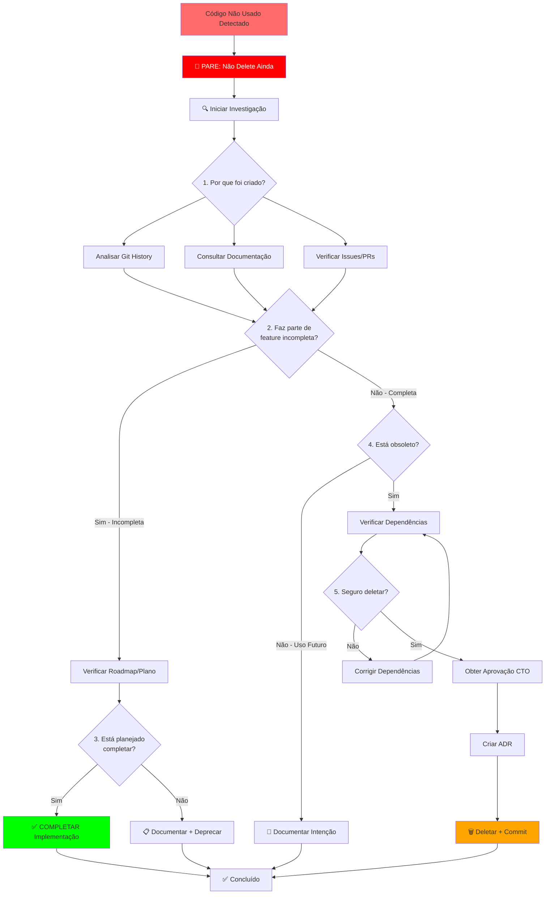

# Protocolo de Investigação de Código (Code Investigation Protocol)

## Visão Geral

Protocolo **obrigatório** que impede agentes de **deletar código não utilizado** sem antes investigar **contexto, histórico e intenção original**.

---

## Problema Identificado

### ❌ COMPORTAMENTO INCORRETO (Antes)

```typescript
// Agente encontra código "não usado"
import { unusedFunction } from './utils';

// ❌ AÇÃO ERRADA: Deletar imediatamente
// "Esta função não está sendo usada, vou remover"
```

**Problemas:**
1. Pode ser parte de feature **incompleta**
2. Pode ter sido implementado para **uso futuro planejado**
3. Pode ter **contexto histórico** importante
4. Deletar causa **retrabalho** se precisar reimplementar
5. Perde **conhecimento** sobre por que foi criado

---

### ✅ COMPORTAMENTO CORRETO (Depois)

```typescript
// Agente encontra código "não usado"
import { unusedFunction } from './utils';

// ✅ AÇÃO CORRETA: Investigar antes de qualquer ação
// 1. Por que foi implementado?
// 2. Faz parte de feature incompleta?
// 3. Está na documentação/roadmap?
// 4. Há TODOs relacionados?
// 5. Qual a intenção original?

// Depois da investigação:
// - Se incompleto: COMPLETAR
// - Se obsoleto: Documentar + Deprecar + Deletar
// - Se futuro: Documentar + Manter
```

---

## Regra 84: Investigar Antes de Deletar

```typescript
/**
 * Regra 84: Investigação Obrigatória Antes de Deletar Código
 * 
 * NENHUM agente pode deletar código (funções, classes, arquivos) sem:
 * 1. Investigar POR QUÊ foi implementado originalmente
 * 2. Verificar se faz parte de feature INCOMPLETA
 * 3. Consultar documentação, roadmap, TODOs, issues, commits
 * 4. Completar implementação SE incompleta
 * 5. Documentar decisão de deleção SE realmente obsoleto
 * 
 * Enforcement: BLOCKING
 * Penalty: Reversão + Retrabalho + Auditoria do CTO
 */
const RULE_84 = {
  name: "Investigar Antes de Deletar",
  enforcement: "blocking",
  applies_to: [
    "Funções não utilizadas",
    "Classes não instanciadas",
    "Arquivos não importados",
    "Variáveis não referenciadas",
    "Endpoints não chamados",
    "Components não renderizados"
  ],
  required_steps: [
    "1. Executar investigação completa",
    "2. Documentar findings",
    "3. Decidir: Completar vs Deprecar vs Deletar",
    "4. Obter aprovação do CTO se deletar",
    "5. Criar ADR se decisão significativa"
  ],
  documentation: "docs/cursor-agent/workflows/code-investigation-protocol.md"
};
```

---

## Workflow de Investigação



---

## Protocolo Passo-a-Passo

### Passo 1: Detecção de Código Não Usado

```typescript
/**
 * Detectar código não utilizado
 */
async function detectUnusedCode(): Promise<UnusedCode[]> {
  console.log("🔍 Detectando código não utilizado...\n");
  
  const unused: UnusedCode[] = [];
  
  // 1. Detectar funções não usadas
  const unusedFunctions = await grep({
    pattern: "export (function|const) \\w+",
    path: "src/",
    output_mode: "content"
  });
  
  // Para cada função, verificar se é referenciada
  for (const func of unusedFunctions) {
    const funcName = extractFunctionName(func);
    const references = await grep({
      pattern: funcName,
      path: "src/",
      output_mode: "count"
    });
    
    if (references.totalMatches === 1) { // Apenas a definição
      unused.push({
        type: "function",
        name: funcName,
        file: func.file,
        line: func.line
      });
    }
  }
  
  // 2. Detectar arquivos não importados
  const allFiles = await glob_file_search({
    glob_pattern: "**/*.ts",
    target_directory: "src/"
  });
  
  for (const file of allFiles) {
    const fileName = path.basename(file, '.ts');
    const imports = await grep({
      pattern: `from ['"]\\..*${fileName}['"]`,
      path: "src/",
      output_mode: "count"
    });
    
    if (imports.totalMatches === 0) {
      unused.push({
        type: "file",
        name: fileName,
        file: file
      });
    }
  }
  
  console.log(`\n📊 Detectado: ${unused.length} itens não utilizados\n`);
  
  return unused;
}
```

### Passo 2: Investigação Obrigatória

```typescript
/**
 * Investigar código não usado ANTES de qualquer ação
 */
async function investigateUnusedCode(
  item: UnusedCode
): Promise<InvestigationResult> {
  console.log("\n🔍 ========================================");
  console.log("🔍  INVESTIGAÇÃO DE CÓDIGO NÃO USADO");
  console.log("🔍 ========================================\n");
  console.log(`Tipo: ${item.type}`);
  console.log(`Nome: ${item.name}`);
  console.log(`Arquivo: ${item.file}\n`);
  
  const findings: Finding[] = [];
  
  // ==========================================
  // 1. ANALISAR HISTÓRICO GIT
  // ==========================================
  console.log("📍 [1/7] Analisando histórico Git...\n");
  
  // Buscar commit que criou o código
  const gitLog = await run_terminal_cmd({
    command: `git log --all --follow --format='%H|%an|%ae|%ai|%s' -- ${item.file}`,
    is_background: false,
    explanation: "Buscar histórico de commits do arquivo"
  });
  
  const commits = parseGitLog(gitLog.stdout);
  const creationCommit = commits[commits.length - 1]; // Primeiro commit
  
  if (creationCommit) {
    findings.push({
      category: "Git History",
      question: "Quando foi criado?",
      answer: `${creationCommit.date} por ${creationCommit.author}`,
      details: `Commit: ${creationCommit.hash}\nMensagem: ${creationCommit.message}`
    });
    
    console.log(`✅ Criado em: ${creationCommit.date}`);
    console.log(`✅ Autor: ${creationCommit.author}`);
    console.log(`✅ Mensagem: ${creationCommit.message}\n`);
  }
  
  // ==========================================
  // 2. VERIFICAR ISSUES RELACIONADAS
  // ==========================================
  console.log("📍 [2/7] Verificando issues relacionadas...\n");
  
  // Extrair número de issue da mensagem do commit
  const issueMatch = creationCommit?.message.match(/#(\d+)/);
  
  if (issueMatch) {
    const issueNumber = issueMatch[1];
    
    // Buscar issue no GitHub
    const issue = await run_terminal_cmd({
      command: `gh issue view ${issueNumber} --json title,body,state,labels`,
      is_background: false,
      explanation: "Buscar detalhes da issue"
    });
    
    if (issue.exitCode === 0) {
      const issueData = JSON.parse(issue.stdout);
      
      findings.push({
        category: "Issue",
        question: "Qual a issue relacionada?",
        answer: `#${issueNumber}: ${issueData.title}`,
        details: `Estado: ${issueData.state}\nLabels: ${issueData.labels.map(l => l.name).join(', ')}\n\n${issueData.body}`
      });
      
      console.log(`✅ Issue #${issueNumber}: ${issueData.title}`);
      console.log(`✅ Estado: ${issueData.state}\n`);
    }
  } else {
    console.log("⚠️ Nenhuma issue vinculada ao commit\n");
  }
  
  // ==========================================
  // 3. CONSULTAR DOCUMENTAÇÃO
  // ==========================================
  console.log("📍 [3/7] Consultando documentação...\n");
  
  // Buscar menções em READMEs
  const readmeResults = await grep({
    pattern: item.name,
    path: "docs/",
    output_mode: "content"
  });
  
  if (readmeResults.matches && readmeResults.matches.length > 0) {
    findings.push({
      category: "Documentação",
      question: "Está documentado?",
      answer: "Sim, encontrado em documentação",
      details: readmeResults.matches.map(m => `${m.file}:${m.lineNumber}`).join('\n')
    });
    
    console.log(`✅ Documentado em:`);
    readmeResults.matches.forEach(m => {
      console.log(`   - ${m.file}:${m.lineNumber}`);
    });
    console.log();
  } else {
    console.log("⚠️ Não encontrado em documentação\n");
  }
  
  // ==========================================
  // 4. VERIFICAR ROADMAP/PLANEJAMENTO
  // ==========================================
  console.log("📍 [4/7] Verificando roadmap...\n");
  
  const roadmapResults = await grep({
    pattern: item.name,
    path: "plan/",
    output_mode: "content"
  });
  
  if (roadmapResults.matches && roadmapResults.matches.length > 0) {
    findings.push({
      category: "Roadmap",
      question: "Faz parte do roadmap?",
      answer: "Sim, encontrado no planejamento",
      details: roadmapResults.matches.map(m => `${m.file}:${m.lineNumber}`).join('\n')
    });
    
    console.log(`✅ Mencionado em roadmap:`);
    roadmapResults.matches.forEach(m => {
      console.log(`   - ${m.file}:${m.lineNumber}`);
    });
    console.log();
  } else {
    console.log("⚠️ Não encontrado em roadmap\n");
  }
  
  // ==========================================
  // 5. BUSCAR TODOs RELACIONADOS
  // ==========================================
  console.log("📍 [5/7] Buscando TODOs relacionados...\n");
  
  const todoResults = await grep({
    pattern: `TODO.*${item.name}|${item.name}.*TODO`,
    path: "src/",
    output_mode: "content"
  });
  
  if (todoResults.matches && todoResults.matches.length > 0) {
    findings.push({
      category: "TODOs",
      question: "Há TODOs relacionados?",
      answer: "Sim, implementação pode estar incompleta",
      details: todoResults.matches.map(m => `${m.file}:${m.lineNumber}\n${m.content}`).join('\n\n')
    });
    
    console.log(`⚠️ TODOs encontrados (implementação incompleta?):`);
    todoResults.matches.forEach(m => {
      console.log(`   - ${m.file}:${m.lineNumber}: ${m.content}`);
    });
    console.log();
  } else {
    console.log("✅ Nenhum TODO relacionado\n");
  }
  
  // ==========================================
  // 6. ANALISAR TESTES
  // ==========================================
  console.log("📍 [6/7] Analisando testes...\n");
  
  const testFile = item.file.replace(/\.ts$/, '.test.ts');
  const testExists = await checkFileExists(testFile);
  
  if (testExists) {
    // Verificar se há testes para esta função
    const testResults = await grep({
      pattern: item.name,
      path: testFile,
      output_mode: "content"
    });
    
    if (testResults.matches && testResults.matches.length > 0) {
      findings.push({
        category: "Testes",
        question: "Há testes implementados?",
        answer: "Sim, função foi testada",
        details: `Testes em: ${testFile}\nTotal de referências: ${testResults.matches.length}`
      });
      
      console.log(`✅ Testes encontrados em: ${testFile}`);
      console.log(`✅ Total de referências: ${testResults.matches.length}\n`);
    }
  } else {
    console.log("⚠️ Nenhum arquivo de teste encontrado\n");
  }
  
  // ==========================================
  // 7. VERIFICAR DEPENDÊNCIAS
  // ==========================================
  console.log("📍 [7/7] Verificando dependências...\n");
  
  // Ler o arquivo e buscar imports/exports
  const fileContent = await read_file({
    target_file: item.file
  });
  
  const imports = extractImports(fileContent);
  const exports = extractExports(fileContent);
  
  findings.push({
    category: "Dependências",
    question: "Quais dependências este código tem?",
    answer: `${imports.length} imports, ${exports.length} exports`,
    details: `Imports:\n${imports.join('\n')}\n\nExports:\n${exports.join('\n')}`
  });
  
  console.log(`✅ Imports: ${imports.length}`);
  console.log(`✅ Exports: ${exports.length}\n`);
  
  // ==========================================
  // ANÁLISE E RECOMENDAÇÃO
  // ==========================================
  console.log("📍 Analisando findings...\n");
  
  let recommendation: Recommendation;
  let confidence: "high" | "medium" | "low";
  
  // Lógica de decisão baseada nos findings
  const hasTodos = findings.some(f => f.category === "TODOs");
  const hasTests = findings.some(f => f.category === "Testes");
  const inRoadmap = findings.some(f => f.category === "Roadmap");
  const inDocs = findings.some(f => f.category === "Documentação");
  const hasIssue = findings.some(f => f.category === "Issue");
  
  if (hasTodos) {
    // Há TODOs = implementação incompleta
    recommendation = {
      action: "COMPLETE",
      reason: "Implementação está incompleta (TODOs encontrados)",
      nextSteps: [
        "1. Revisar TODOs relacionados",
        "2. Completar implementação",
        "3. Adicionar testes",
        "4. Documentar uso"
      ]
    };
    confidence = "high";
  } else if (inRoadmap) {
    // Está no roadmap = uso futuro planejado
    recommendation = {
      action: "KEEP",
      reason: "Faz parte do roadmap (uso futuro planejado)",
      nextSteps: [
        "1. Documentar que é para uso futuro",
        "2. Adicionar comentário explicativo",
        "3. Vincular à issue do roadmap"
      ]
    };
    confidence = "high";
  } else if (hasTests && inDocs) {
    // Tem testes E documentação = pode ser API pública não usada internamente
    recommendation = {
      action: "KEEP",
      reason: "Código testado e documentado (possível API pública)",
      nextSteps: [
        "1. Verificar se é API pública",
        "2. Se não for, considerar deprecação",
        "3. Documentar uso esperado"
      ]
    };
    confidence = "medium";
  } else if (!hasIssue && !inDocs && !inRoadmap) {
    // Sem contexto algum = possível código obsoleto
    recommendation = {
      action: "INVESTIGATE_FURTHER",
      reason: "Sem contexto claro (sem issue, docs ou roadmap)",
      nextSteps: [
        "1. Consultar time/autor original",
        "2. Verificar uso em outras branches",
        "3. Se confirmado obsoleto, deprecar primeiro",
        "4. Obter aprovação CTO antes de deletar"
      ]
    };
    confidence = "low";
  } else {
    // Caso padrão
    recommendation = {
      action: "INVESTIGATE_FURTHER",
      reason: "Contexto insuficiente para decisão",
      nextSteps: [
        "1. Buscar mais informações",
        "2. Consultar stakeholders",
        "3. Não deletar sem aprovação"
      ]
    };
    confidence = "low";
  }
  
  console.log("✅ ========================================");
  console.log("✅  INVESTIGAÇÃO COMPLETA");
  console.log("✅ ========================================\n");
  
  console.log(`📊 Findings: ${findings.length}`);
  console.log(`🎯 Recomendação: ${recommendation.action}`);
  console.log(`📈 Confiança: ${confidence}\n`);
  console.log(`💡 Razão: ${recommendation.reason}\n`);
  
  console.log("📝 Próximos Passos:");
  recommendation.nextSteps.forEach((step, i) => {
    console.log(`   ${step}`);
  });
  console.log();
  
  // Salvar relatório de investigação
  await write({
    file_path: `docs/investigations/${item.type}-${item.name}-investigation.md`,
    contents: generateInvestigationReport({
      item,
      findings,
      recommendation,
      confidence,
      date: new Date()
    })
  });
  
  return {
    item,
    findings,
    recommendation,
    confidence,
    reportPath: `docs/investigations/${item.type}-${item.name}-investigation.md`
  };
}
```

### Passo 3: Ações Baseadas na Investigação

```typescript
/**
 * Executar ação recomendada após investigação
 */
async function executeRecommendedAction(
  investigation: InvestigationResult
): Promise<ActionResult> {
  const { item, recommendation, confidence } = investigation;
  
  console.log(`\n🎯 Executando ação: ${recommendation.action}\n`);
  
  switch (recommendation.action) {
    case "COMPLETE":
      // ==========================================
      // COMPLETAR IMPLEMENTAÇÃO
      // ==========================================
      console.log("📍 Ação: COMPLETAR implementação incompleta\n");
      
      // 1. Criar TODO de completar
      await todo_write({
        merge: true,
        todos: [
          {
            id: `complete-${item.name}`,
            status: "pending",
            content: `Completar implementação de ${item.name} (encontrado incompleto)`
          }
        ]
      });
      
      // 2. Adicionar comentário explicativo
      const fileContent = await read_file({
        target_file: item.file
      });
      
      const updatedContent = addExplanatoryComment(fileContent, item, {
        status: "INCOMPLETE",
        reason: recommendation.reason,
        todo: `See TODO: complete-${item.name}`
      });
      
      await write({
        file_path: item.file,
        contents: updatedContent
      });
      
      console.log(`✅ TODO criado: complete-${item.name}`);
      console.log(`✅ Comentário adicionado em ${item.file}\n`);
      
      return {
        action: "COMPLETE",
        status: "TODO_CREATED",
        message: `Implementação será completada via TODO: complete-${item.name}`
      };
      
    case "KEEP":
      // ==========================================
      // MANTER (com documentação)
      // ==========================================
      console.log("📍 Ação: MANTER código (documentar intenção)\n");
      
      // 1. Adicionar comentário explicativo
      const keepFileContent = await read_file({
        target_file: item.file
      });
      
      const keepUpdatedContent = addExplanatoryComment(keepFileContent, item, {
        status: "INTENTIONAL",
        reason: recommendation.reason,
        usage: "Reserved for future use or public API"
      });
      
      await write({
        file_path: item.file,
        contents: keepUpdatedContent
      });
      
      // 2. Documentar em README
      await updateReadme(item, {
        section: "Public API" ou "Future Features",
        description: recommendation.reason
      });
      
      console.log(`✅ Comentário explicativo adicionado`);
      console.log(`✅ README atualizado\n`);
      
      return {
        action: "KEEP",
        status: "DOCUMENTED",
        message: "Código mantido e documentado"
      };
      
    case "INVESTIGATE_FURTHER":
      // ==========================================
      // INVESTIGAR MAIS (não deletar ainda)
      // ==========================================
      console.log("📍 Ação: INVESTIGAR MAIS (bloqueado)\n");
      
      if (confidence === "low") {
        console.log("⚠️ Confiança baixa - não deletar sem aprovação\n");
        
        // Criar issue para discussão
        await run_terminal_cmd({
          command: `gh issue create --title "Investigate unused code: ${item.name}" --body "$(cat docs/investigations/${item.type}-${item.name}-investigation.md)"`,
          is_background: false,
          explanation: "Criar issue para discussão sobre código não usado"
        });
        
        console.log(`✅ Issue criada para discussão\n`);
      }
      
      return {
        action: "INVESTIGATE_FURTHER",
        status: "BLOCKED",
        message: "Mais informações necessárias antes de deletar"
      };
      
    case "DELETE":
      // ==========================================
      // DELETAR (com aprovação)
      // ==========================================
      console.log("📍 Ação: DELETAR (requer aprovação CTO)\n");
      
      // 1. Verificar aprovação do CTO
      console.log("⏳ Solicitando aprovação do CTO...\n");
      
      const ctoApproval = await requestCTOApproval({
        item,
        investigation,
        reason: recommendation.reason
      });
      
      if (!ctoApproval.approved) {
        console.log("❌ CTO não aprovou deleção\n");
        console.log(`Razão: ${ctoApproval.reason}\n`);
        
        return {
          action: "DELETE",
          status: "REJECTED",
          message: `CTO rejeitou: ${ctoApproval.reason}`
        };
      }
      
      console.log("✅ CTO aprovou deleção\n");
      
      // 2. Criar ADR para decisão de deleção
      await write({
        file_path: `docs/adr/DELETE-${Date.now()}-${item.name}.md`,
        contents: generateDeletionADR({
          item,
          investigation,
          ctoApproval
        })
      });
      
      // 3. Deletar código
      await deleteCode(item);
      
      // 4. Commit com mensagem descritiva
      await run_terminal_cmd({
        command: `git add . && git commit -m "chore: remove unused ${item.type} ${item.name}

After investigation, determined this code is obsolete and safe to delete.

Reason: ${recommendation.reason}
CTO Approval: ${ctoApproval.approvedBy}
ADR: docs/adr/DELETE-${Date.now()}-${item.name}.md
Investigation: docs/investigations/${item.type}-${item.name}-investigation.md

Fixes #${ctoApproval.issueNumber}"`,
        is_background: false,
        required_permissions: ["git_write"]
      });
      
      console.log(`✅ Código deletado com aprovação\n`);
      
      return {
        action: "DELETE",
        status: "DELETED",
        message: "Código deletado após investigação e aprovação"
      };
      
    default:
      throw new Error(`Unknown action: ${recommendation.action}`);
  }
}
```

---

## Template de Relatório de Investigação

```markdown
# Relatório de Investigação: {item.name}

## Informações Gerais

| Campo | Valor |
|-------|-------|
| **Tipo** | {item.type} |
| **Nome** | {item.name} |
| **Arquivo** | {item.file} |
| **Data Investigação** | {date} |
| **Investigador** | {agent} |

## Status: CÓDIGO NÃO UTILIZADO ⚠️

## Findings da Investigação

{findings.map(f => `
### ${f.category}: ${f.question}

**Resposta**: ${f.answer}

**Detalhes**:
\`\`\`
${f.details}
\`\`\`
`).join('\n')}

## Análise

**Confiança**: {confidence}

**Recomendação**: {recommendation.action}

**Razão**: {recommendation.reason}

## Próximos Passos

{recommendation.nextSteps.map((step, i) => `${i + 1}. ${step}`).join('\n')}

## Decisão Final

⏳ **AGUARDANDO AÇÃO**

Opções:
- [ ] COMPLETAR implementação (se incompleto)
- [ ] MANTER código (se uso futuro)
- [ ] INVESTIGAR MAIS (se contexto insuficiente)
- [ ] DELETAR (apenas com aprovação CTO)

## Aprovações

- [ ] Investigação revisada
- [ ] CTO aprovou (se deletar)
- [ ] ADR criado (se deletar)

---

**IMPORTANTE**: Este código **NÃO PODE SER DELETADO** sem seguir o protocolo completo.
```

---

## Checklist de Enforcement

Antes de deletar QUALQUER código:

- [ ] ✅ Investigação completa executada
- [ ] ✅ Relatório de investigação gerado
- [ ] ✅ Git history analisado
- [ ] ✅ Issues/PRs verificadas
- [ ] ✅ Documentação consultada
- [ ] ✅ Roadmap verificado
- [ ] ✅ TODOs buscados
- [ ] ✅ Testes analisados
- [ ] ✅ Dependências verificadas
- [ ] ✅ Recomendação gerada
- [ ] ✅ Ação apropriada tomada:
  - Se INCOMPLETO: TODO criado para completar
  - Se USO FUTURO: Documentado e mantido
  - Se OBSOLETO: ADR + Aprovação CTO + Deletado
- [ ] ✅ Commit com contexto completo

---

## Integração com Workflow

### Atualizar Fase 4: Execução

Adicionar validação ao final:

```typescript
// Ao final da execução, antes de marcar como completed

console.log("\n🔍 Verificando código não utilizado...\n");

const unusedCode = await detectUnusedCode();

if (unusedCode.length > 0) {
  console.log(`⚠️ Encontrado ${unusedCode.length} itens não utilizados\n`);
  console.log("🛑 REGRA 84: Investigação obrigatória antes de deletar\n");
  
  for (const item of unusedCode) {
    // Investigar cada item
    const investigation = await investigateUnusedCode(item);
    
    // Executar ação recomendada
    const actionResult = await executeRecommendedAction(investigation);
    
    console.log(`✅ ${item.name}: ${actionResult.status}\n`);
  }
}
```

---

## Métricas de Sucesso

| Métrica | Target |
|---------|--------|
| **Código deletado sem investigação** | 0% |
| **Investigações documentadas** | 100% |
| **Features incompletas identificadas** | >= 80% |
| **Retrabalho por deleção prematura** | 0% |
| **Aprovação CTO para deleções** | 100% |

---

## Exemplo Real

### Cenário: Função `calculateRisk` não utilizada

```typescript
// src/trading/risk.ts
export function calculateRisk(
  position: Position,
  market: MarketData
): number {
  // Implementação...
  return risk;
}
```

**Agente detecta**: Nenhuma importação desta função.

#### ❌ AÇÃO ERRADA (Deletar imediatamente)
```typescript
// "Não está sendo usada, vou deletar"
await deleteFile("src/trading/risk.ts");
```

#### ✅ AÇÃO CORRETA (Investigar primeiro)

```bash
🔍 Iniciando investigação...

📍 [1/7] Git History:
✅ Criado em: 2025-09-15 por @joao
✅ Commit: "feat: add risk calculation for margin trading"
✅ Mensagem vinculada: #245

📍 [2/7] Issue #245:
✅ Título: "Implement margin trading with risk management"
✅ Estado: OPEN (em progresso!)

📍 [3/7] Roadmap:
✅ Encontrado em: plan/phases/FASE-10-MARGIN-TRADING.md
✅ Status: Planejado para Q4

📍 [4/7] TODOs:
⚠️ Encontrado: src/trading/margin.ts:45
    "// TODO: integrate calculateRisk from risk.ts"

📊 CONCLUSÃO:
🎯 Recomendação: COMPLETE
💡 Razão: Implementação INCOMPLETA (parte de feature em progresso)
📈 Confiança: HIGH

📝 Próximos Passos:
1. Revisar Issue #245
2. Completar integração em margin.ts
3. Adicionar testes
4. Documentar uso

✅ TODO criado: complete-calculateRisk
✅ Comentário explicativo adicionado
```

**Resultado**: Código **mantido** e **completado**, evitando retrabalho!

---

**Versão**: 1.0  
**Data**: Outubro 2025  
**Autor**: Agente-CTO  
**Status**: **OBRIGATÓRIO** - Regra 84  
**Enforcement**: BLOCKING

