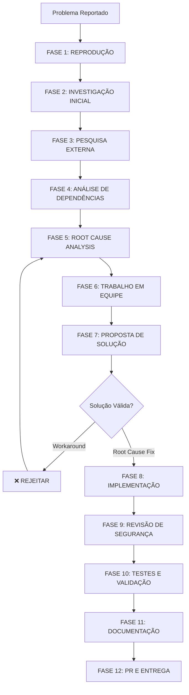

# Workflow de Análise e Correção de Problemas

## Visão Geral

Workflow completo para **identificar a raiz do problema** e corrigi-lo adequadamente, sem contornar com soluções superficiais (workarounds).

**Princípio Fundamental**: Nunca aplicar band-aids. Sempre corrigir a causa raiz.

---

## Fluxo Completo de Debug



---

## FASE 1: REPRODUÇÃO DO PROBLEMA

### Objetivo
Reproduzir o bug de forma consistente e documentada.

### Checklist
- [ ] Entender o comportamento esperado
- [ ] Entender o comportamento atual (bugado)
- [ ] Coletar informações do ambiente
- [ ] Criar steps-to-reproduce mínimos
- [ ] Reproduzir localmente
- [ ] Documentar stacktrace/logs

### Ações

```typescript
// 1. Criar TODO para fase de reprodução
await todo_write({
  merge: false,
  todos: [
    { id: "1-reproduce", content: "Reproduzir bug localmente", status: "in_progress" },
    { id: "2-investigate", content: "Investigação inicial", status: "pending" },
    { id: "3-research", content: "Pesquisa externa", status: "pending" },
    { id: "4-dependencies", content: "Mapear dependências", status: "pending" },
    { id: "5-root-cause", content: "Análise de causa raiz", status: "pending" },
    { id: "6-team-review", content: "Revisão em equipe", status: "pending" },
    { id: "7-solution", content: "Propor solução", status: "pending" },
    { id: "8-implement", content: "Implementar correção", status: "pending" },
    { id: "9-security", content: "Análise de segurança", status: "pending" },
    { id: "10-test", content: "Testes completos", status: "pending" },
    { id: "11-document", content: "Documentar correção", status: "pending" },
    { id: "12-pr", content: "Pull Request", status: "pending" }
  ]
});

// 2. Documentar o problema
await write({
  file_path: "docs/bugs/BUG-001-description.md",
  contents: `# BUG-001: [Título Descritivo]

## Reportado por
- Usuário: [nome]
- Data: ${new Date().toISOString()}
- Ambiente: [produção/staging/dev]

## Comportamento Esperado
[Descrever o que deveria acontecer]

## Comportamento Atual
[Descrever o que está acontecendo]

## Steps to Reproduce
1. Passo 1
2. Passo 2
3. Passo 3
4. Observar erro

## Informações do Ambiente
- OS: [macOS/Windows/Linux]
- Browser: [Chrome 120 / Firefox 121]
- Node: [v20.x]
- Versão da aplicação: [v1.2.3]

## Stacktrace/Logs
\`\`\`
[Colar stacktrace completo]
\`\`\`

## Screenshots/Vídeos
[Adicionar capturas de tela]

## Reprodução Local
- [ ] Consegui reproduzir localmente
- [ ] Bug é consistente
- [ ] Documentei steps mínimos
`
});

// 3. Tentar reproduzir
await run_terminal_cmd({
  command: "npm run dev",
  is_background: true,
  required_permissions: ["network"]
});

// Testar manualmente seguindo steps-to-reproduce
```

---

## FASE 2: INVESTIGAÇÃO INICIAL

### Objetivo
Coletar informações técnicas e mapear área do código afetada.

### Checklist
- [ ] Identificar arquivo(s) onde o erro ocorre
- [ ] Analisar stacktrace
- [ ] Ler logs completos
- [ ] Identificar funções/métodos envolvidos
- [ ] Verificar quando o bug foi introduzido (git bisect)
- [ ] Verificar issues/PRs relacionados

### Ações

```typescript
// 1. Analisar stacktrace para identificar arquivos
const stacktrace = `
Error: Cannot read property 'name' of undefined
    at getUserProfile (src/api/user.ts:45:20)
    at handleRequest (src/api/routes.ts:123:15)
    at middleware (src/middleware/auth.ts:67:10)
`;

// 2. Identificar arquivos envolvidos
const affectedFiles = [
  "src/api/user.ts",
  "src/api/routes.ts",
  "src/middleware/auth.ts"
];

// 3. Ler arquivos em paralelo
await Promise.all([
  read_file({ target_file: "src/api/user.ts" }),
  read_file({ target_file: "src/api/routes.ts" }),
  read_file({ target_file: "src/middleware/auth.ts" })
]);

// 4. Buscar função específica (getUserProfile linha 45)
await grep({
  pattern: "function getUserProfile",
  "-C": 10,  // 10 linhas de contexto
  path: "src/api/user.ts"
});

// 5. Verificar quando foi introduzido (git blame)
await run_terminal_cmd({
  command: "git blame -L 40,50 src/api/user.ts",
  is_background: false
});

// 6. Buscar commits recentes no arquivo
await run_terminal_cmd({
  command: "git log --oneline -20 -- src/api/user.ts",
  is_background: false
});

// 7. Verificar PRs relacionados
await run_terminal_cmd({
  command: "gh pr list --search 'user profile' --state all",
  is_background: false,
  required_permissions: ["network"]
});

// 8. Documentar investigação inicial
await write({
  file_path: "docs/bugs/BUG-001-investigation.md",
  contents: `# BUG-001: Investigação Inicial

## Arquivos Afetados
- \`src/api/user.ts\` (linha 45)
- \`src/api/routes.ts\` (linha 123)
- \`src/middleware/auth.ts\` (linha 67)

## Análise do Stacktrace
Erro ocorre em \`getUserProfile\` ao tentar acessar propriedade \`name\` de objeto undefined.

## Histórico Git
- Última modificação: commit abc123 (3 dias atrás)
- Autor: Developer X
- PR relacionado: #456

## Hipótese Inicial
Parece que \`user\` está chegando undefined na função \`getUserProfile\`.
Possível falha no middleware de autenticação ou na busca do usuário.

## Próximos Passos
1. Pesquisar documentação oficial sobre autenticação
2. Buscar issues similares no GitHub
3. Mapear todas as dependências de getUserProfile
`
});
```

---

## FASE 3: PESQUISA EXTERNA

### Objetivo
Pesquisar soluções, issues similares e documentação oficial.

### Checklist
- [ ] Consultar documentação oficial das bibliotecas envolvidas
- [ ] Buscar no GitHub Issues da biblioteca
- [ ] Buscar no Stack Overflow
- [ ] Verificar changelog das bibliotecas
- [ ] Verificar breaking changes em updates recentes
- [ ] Buscar em fóruns especializados (Reddit, Discord, etc)

### Ações

```typescript
// 1. Consultar base de conhecimento
await read_file({
  target_file: "docs/cursor-agent/reference/base-conhecimento.md"
});

// 2. Buscar documentação oficial
await web_search({
  search_term: "NextAuth.js session undefined middleware Next.js 14",
  explanation: "Buscar documentação oficial sobre problema de sessão"
});

await web_search({
  search_term: "Prisma user not found error handling best practices",
  explanation: "Buscar práticas recomendadas para tratamento de erro"
});

// 3. Buscar issues similares no GitHub
await web_search({
  search_term: "site:github.com nextauthjs 'user undefined' middleware",
  explanation: "Buscar issues relacionadas no repo do NextAuth.js"
});

// 4. Buscar no Stack Overflow
await web_search({
  search_term: "site:stackoverflow.com nextauth user undefined cannot read property",
  explanation: "Buscar perguntas similares"
});

// 5. Verificar changelog recente
await web_search({
  search_term: "NextAuth.js v5 breaking changes changelog",
  explanation: "Verificar se há breaking changes em versão recente"
});

// 6. Documentar pesquisa
await write({
  file_path: "docs/bugs/BUG-001-research.md",
  contents: `# BUG-001: Pesquisa Externa

## Documentação Oficial Consultada

### NextAuth.js
- **URL**: https://authjs.dev/guides/upgrade-to-v5
- **Descoberta**: NextAuth.js v5 mudou a forma de acessar sessão no middleware
- **Código antigo (v4)**:
  \`\`\`typescript
  const user = req.session.user; // ❌ Deprecated
  \`\`\`
- **Código novo (v5)**:
  \`\`\`typescript
  import { auth } from '@/auth';
  const session = await auth(); // ✅ Correto
  const user = session?.user;
  \`\`\`

### Prisma
- **URL**: https://www.prisma.io/docs/guides/error-handling
- **Descoberta**: Recomendação de usar \`findUniqueOrThrow\` para casos onde esperamos que exista

## Issues Similares

### GitHub Issue #789 (NextAuth.js)
- **URL**: https://github.com/nextauthjs/next-auth/issues/789
- **Problema**: User undefined após upgrade para v5
- **Solução**: Atualizar sintaxe do middleware conforme docs v5

### Stack Overflow #12345
- **URL**: https://stackoverflow.com/questions/12345
- **Problema**: Cannot read property of undefined
- **Solução**: Sempre verificar nullish antes de acessar propriedades

## Changelog

### NextAuth.js v5.0.0
- **Breaking Change**: API do middleware foi completamente redesenhada
- **Migração necessária**: Atualizar todos os middlewares

## Conclusões da Pesquisa
1. ✅ Problema é conhecido (breaking change v4 → v5)
2. ✅ Solução documentada oficialmente
3. ✅ Padrão correto: verificação de nullish + novo auth()
4. ❌ Código atual está usando sintaxe deprecated

## Documentações para Salvar na Memória
- NextAuth.js v5: https://authjs.dev/guides/upgrade-to-v5
- Prisma Error Handling: https://www.prisma.io/docs/guides/error-handling
`
});

// 7. Salvar docs na memória
await update_memory({
  action: "create",
  title: "NextAuth.js v5 Breaking Changes",
  knowledge_to_store: "NextAuth.js v5 mudou API do middleware. Usar auth() ao invés de req.session. Docs: https://authjs.dev/guides/upgrade-to-v5"
});
```

---

## FASE 4: ANÁLISE DE DEPENDÊNCIAS

### Objetivo
Mapear **TODOS** os arquivos e funções que dependem do código bugado.

### Checklist
- [ ] Identificar todas as chamadas à função bugada
- [ ] Mapear dependências diretas
- [ ] Mapear dependências indiretas
- [ ] Identificar imports/exports
- [ ] Verificar uso em testes
- [ ] Criar mapa visual de dependências

### Ações

```typescript
// 1. Buscar todas as chamadas a getUserProfile
await grep({
  pattern: "getUserProfile",
  output_mode: "files_with_matches"
});

// Resultado exemplo:
// src/api/user.ts (definição)
// src/api/routes.ts (usa)
// src/pages/profile.tsx (usa)
// src/components/UserCard.tsx (usa)
// src/services/user-service.ts (usa)
// tests/user.test.ts (testa)

// 2. Para cada arquivo, buscar contexto
const dependentFiles = [
  "src/api/routes.ts",
  "src/pages/profile.tsx",
  "src/components/UserCard.tsx",
  "src/services/user-service.ts"
];

for (const file of dependentFiles) {
  await grep({
    pattern: "getUserProfile",
    "-C": 5,
    path: file
  });
}

// 3. Buscar quem importa o módulo
await grep({
  pattern: "from.*user",
  output_mode: "content"
});

// 4. Criar diagrama de dependências
await write({
  file_path: "docs/bugs/BUG-001-dependencies.md",
  contents: `# BUG-001: Análise de Dependências

## Mapa de Dependências

\`\`\`mermaid
graph TD
    A[src/middleware/auth.ts] -->|chama| B[src/api/user.ts: getUserProfile]
    C[src/api/routes.ts] -->|chama| B
    D[src/pages/profile.tsx] -->|chama| B
    E[src/components/UserCard.tsx] -->|chama| B
    F[src/services/user-service.ts] -->|chama| B
    
    B -->|depende| G[Prisma Client]
    B -->|depende| H[Auth Session]
    
    I[tests/user.test.ts] -.testa.-> B
    
    style B fill:#ff6b6b
    style A fill:#ffd93d
    style H fill:#ffd93d
```

## Arquivos que CHAMAM getUserProfile

### 1. src/middleware/auth.ts (linha 67)
\`\`\`typescript
const profile = await getUserProfile(userId);
if (!profile) return unauthorized();
\`\`\`
**Impacto**: CRÍTICO - middleware usado em TODAS as rotas protegidas

### 2. src/api/routes.ts (linha 123)
\`\`\`typescript
app.get('/profile', async (req) => {
  const profile = await getUserProfile(req.userId);
  return res.json(profile);
});
\`\`\`
**Impacto**: ALTO - rota principal de perfil

### 3. src/pages/profile.tsx (linha 34)
\`\`\`typescript
const { data } = await fetch('/api/profile');
\`\`\`
**Impacto**: ALTO - página de perfil do usuário

### 4. src/components/UserCard.tsx (linha 12)
\`\`\`typescript
const user = await getUserProfile(props.userId);
\`\`\`
**Impacto**: MÉDIO - componente usado em dashboard

### 5. src/services/user-service.ts (linha 89)
\`\`\`typescript
async updateUser(id: string) {
  const current = await getUserProfile(id);
  // ...
}
\`\`\`
**Impacto**: ALTO - usado em updates de usuário

## Dependências EXTERNAS

### Prisma Client
- Versão: 5.7.0
- Uso: Busca de usuário no banco
- Pode retornar \`null\` se não encontrado

### NextAuth Session
- Versão: 5.0.0 (BREAKING CHANGE!)
- Problema identificado: Sintaxe deprecated sendo usada

## Testes Afetados
- tests/user.test.ts (unitário)
- tests/integration/profile.test.ts (integração)
- tests/e2e/user-flow.spec.ts (E2E)

## Análise de Impacto

### Impacto Total
- 🔴 **5 arquivos** chamam getUserProfile diretamente
- 🟡 **3 suites de teste** precisam ser atualizadas
- 🔴 **TODAS as rotas protegidas** são afetadas (via middleware)

### Criticidade
**CRÍTICO**: Bug afeta autenticação de TODA a aplicação

## Correção Necessária

A correção deve:
1. ✅ Corrigir getUserProfile para lidar com user undefined
2. ✅ Atualizar middleware para usar NextAuth v5 corretamente
3. ✅ Adicionar validações defensivas em todos os 5 arquivos
4. ✅ Atualizar todos os testes
5. ✅ Documentar migration guide NextAuth v4 → v5
`
});

// 5. Criar lista de arquivos para corrigir
const filesToFix = {
  critical: [
    "src/api/user.ts",         // Definição da função
    "src/middleware/auth.ts"   // Middleware (causa raiz)
  ],
  high: [
    "src/api/routes.ts",
    "src/pages/profile.tsx",
    "src/services/user-service.ts"
  ],
  medium: [
    "src/components/UserCard.tsx"
  ],
  tests: [
    "tests/user.test.ts",
    "tests/integration/profile.test.ts",
    "tests/e2e/user-flow.spec.ts"
  ]
};
```

---

## FASE 5: ROOT CAUSE ANALYSIS (RCA)

### Objetivo
Identificar a **CAUSA RAIZ** do problema, não apenas os sintomas.

### Técnica: 5 Whys

```typescript
await write({
  file_path: "docs/bugs/BUG-001-root-cause-analysis.md",
  contents: `# BUG-001: Root Cause Analysis

## Técnica dos 5 Whys

### 1️⃣ Por que o erro ocorre?
**Resposta**: \`user\` é undefined em \`getUserProfile\`, causando "Cannot read property 'name' of undefined"

### 2️⃣ Por que \`user\` é undefined?
**Resposta**: O middleware de autenticação não está passando o usuário corretamente

### 3️⃣ Por que o middleware não passa o usuário?
**Resposta**: Está usando sintaxe deprecated do NextAuth.js v4 (\`req.session.user\`)

### 4️⃣ Por que está usando sintaxe deprecated?
**Resposta**: Fizemos upgrade para NextAuth.js v5 mas não atualizamos o código (breaking change)

### 5️⃣ Por que não atualizamos o código?
**Resposta**: Não consultamos o changelog e migration guide antes do upgrade

## ✅ CAUSA RAIZ IDENTIFICADA

**Causa Raiz**: Upgrade de NextAuth.js v4 → v5 sem seguir migration guide, mantendo código deprecated que não funciona na v5.

## Sintoma vs Causa Raiz

### ❌ Sintoma (NÃO corrigir apenas isso)
\`\`\`typescript
// Workaround ruim:
function getUserProfile(userId?: string) {
  if (!userId) return null; // ❌ Band-aid
  // ...
}
\`\`\`

### ✅ Causa Raiz (Corrigir ISTO)
\`\`\`typescript
// middleware/auth.ts - ANTES (errado)
export function middleware(req: NextRequest) {
  const user = req.session.user; // ❌ Deprecated na v5
  // ...
}

// middleware/auth.ts - DEPOIS (correto)
import { auth } from '@/auth';

export async function middleware(req: NextRequest) {
  const session = await auth(); // ✅ API correta v5
  const user = session?.user;
  if (!user) {
    return NextResponse.redirect('/login');
  }
  // ...
}
\`\`\`

## Análise Fishbone (Ishikawa)

\`\`\`mermaid
graph LR
    A[User undefined<br/>em getUserProfile] --> B[Middleware]
    A --> C[Processo]
    A --> D[Documentação]
    
    B --> B1[Sintaxe deprecated v4]
    B --> B2[Sem validação de null]
    
    C --> C1[Upgrade sem migration]
    C --> C2[Sem testes após upgrade]
    
    D --> D1[Não leu changelog]
    D --> D2[Não consultou docs v5]
    
    style A fill:#ff6b6b
    style B1 fill:#ffd93d
    style C1 fill:#ffd93d
```

## Timeline do Bug

1. **3 dias atrás**: Upgrade NextAuth v4 → v5 (PR #456)
2. **3 dias atrás**: Deploy em produção
3. **2 dias atrás**: Primeiros erros reportados
4. **Hoje**: Bug investigado e causa raiz identificada

## Lições Aprendidas

### O que deu errado
1. ❌ Upgrade de dependência sem ler changelog
2. ❌ Não consultamos migration guide
3. ❌ Testes não cobriram este cenário
4. ❌ Deploy sem validação adequada

### Como prevenir
1. ✅ SEMPRE ler changelog antes de upgrade
2. ✅ SEMPRE seguir migration guides oficiais
3. ✅ Adicionar testes para breaking changes
4. ✅ Staging environment obrigatório
5. ✅ Consultar base de conhecimento antes de upgrades

## Correção Planejada

### ✅ Correção da Causa Raiz
1. Atualizar middleware para usar API v5
2. Adicionar validações defensivas
3. Atualizar todos os arquivos dependentes
4. Adicionar testes de regressão
5. Documentar migration

### ❌ Workarounds Rejeitados
- Adicionar \`if (!user) return null\` em getUserProfile ❌
  - Razão: Não resolve problema no middleware
- Fazer downgrade para v4 ❌
  - Razão: v4 não tem features necessárias
- Try-catch genérico ❌
  - Razão: Esconde problema real
`
});
```

---

## FASE 6: TRABALHO EM EQUIPE

### Objetivo
Colaborar com outros "agentes" (perspectivas) para validar análise.

### Perspectivas dos Agentes

```typescript
await write({
  file_path: "docs/bugs/BUG-001-team-review.md",
  contents: `# BUG-001: Revisão em Equipe

## 👨‍💻 Agente Desenvolvedor

### Análise Técnica
- Causa raiz confirmada: NextAuth v5 breaking change
- Solução: Atualizar sintaxe do middleware
- Estimativa: 4 horas (incluindo testes)

### Preocupações
- Precisamos testar em TODAS as rotas protegidas
- Migration pode afetar outras partes não identificadas ainda

### Recomendações
✅ Fazer auditoria completa de uso de NextAuth
✅ Criar testes E2E para fluxo de auth

---

## 🔍 Agente Revisor

### Code Review
- Código atual usa padrão deprecated
- Falta validação de nullish
- Sem tratamento de erro adequado

### Qualidade
- Coverage atual: 65% (ABAIXO do mínimo 80%)
- Faltam testes para edge cases
- Documentação desatualizada

### Exigências para Aprovação
- [ ] Coverage >= 80%
- [ ] Todos os arquivos dependentes atualizados
- [ ] Testes de regressão adicionados
- [ ] Documentação atualizada

---

## 🧪 Agente QA

### Cenários de Teste Necessários

#### Positivos
- [ ] Login com credenciais válidas
- [ ] Acesso a rota protegida com sessão válida
- [ ] Refresh de sessão

#### Negativos
- [ ] Acesso sem autenticação
- [ ] Sessão expirada
- [ ] Token inválido
- [ ] Usuário deletado mas sessão ativa

#### Edge Cases
- [ ] Múltiplas abas/dispositivos
- [ ] Logout em uma aba
- [ ] Session race condition
- [ ] Network failure durante auth

### Bugs Relacionados a Investigar
- BUG-002: Sessão perdida após refresh (pode ser relacionado)
- BUG-015: Logout não funcionando corretamente

---

## 🔐 Agente Segurança

### Análise de Segurança

#### Vulnerabilidades Identificadas
1. **CRITICAL**: User undefined bypass de autenticação
   - Risco: Acesso não autorizado
   - CVSS: 9.1 (Critical)

2. **HIGH**: Falta validação de sessão
   - Risco: Session fixation
   - CVSS: 7.5 (High)

#### Recomendações de Segurança
✅ Validar sessão em TODOS os requests
✅ Implementar rate limiting
✅ Adicionar logging de tentativas failed
✅ Implementar CSRF protection
✅ Revisar permissions de rotas

#### Checklist de Segurança
- [ ] Session validation obrigatória
- [ ] No user data exposure em erros
- [ ] Proper error messages (sem info sensível)
- [ ] Audit log de autenticação
- [ ] Token rotation implementado

---

## 📊 Agente Arquiteto

### Análise Arquitetural

#### Problemas Identificados
1. Middleware muito acoplado a NextAuth
2. Falta camada de abstração
3. Tratamento de erro inconsistente

#### Melhorias Sugeridas

\`\`\`mermaid
graph LR
    A[Request] --> B[Auth Middleware]
    B --> C[Session Service]
    C --> D[User Repository]
    D --> E[Database]
    
    B -.adicionar.-> F[Error Handler]
    B -.adicionar.-> G[Logger]
    
    style C fill:#6bcf7f
    style F fill:#6bcf7f
    style G fill:#6bcf7f
```

#### Refatoração Recomendada
1. Criar \`SessionService\` abstrato
2. Implementar error handling centralizado
3. Adicionar logging estruturado
4. Desacoplar de NextAuth (strategy pattern)

---

## 📝 Agente Documentador

### Documentação Necessária

#### Imediato
- [ ] Migration guide NextAuth v4 → v5
- [ ] ADR sobre escolha de permanecer em v5
- [ ] Runbook para troubleshooting de auth
- [ ] Update do README

#### Futuro
- [ ] Arquitetura de auth documentada
- [ ] Fluxogramas atualizados
- [ ] API docs com novos endpoints
- [ ] Onboarding guide atualizado

---

## 🎯 Consenso da Equipe

### ✅ Decisões Aprovadas

1. **Corrigir causa raiz** (não workaround)
2. **Atualizar para API v5 correta**
3. **Adicionar camada de abstração**
4. **Coverage mínimo 80%**
5. **Audit completo de auth**

### 📋 Plano de Ação Consolidado

#### Prioridade 1 (Crítico - Hoje)
1. Corrigir middleware (causa raiz)
2. Atualizar getUserProfile com validações
3. Testes de regressão

#### Prioridade 2 (Alto - Amanhã)
4. Atualizar todos os arquivos dependentes
5. Adicionar error handling centralizado
6. Implementar logging

#### Prioridade 3 (Médio - Esta semana)
7. Refatorar para SessionService
8. Documentação completa
9. Audit de segurança completo

### 🚫 Abordagens Rejeitadas

❌ **Workaround com if (!user)**
- Razão: Não resolve causa raiz
- Rejeitado por: Todos os agentes

❌ **Downgrade para v4**
- Razão: Perde features necessárias
- Rejeitado por: Arquiteto, Desenvolvedor

❌ **Try-catch genérico**
- Razão: Esconde problema
- Rejeitado por: Revisor, QA, Segurança
`
});
```

---

## FASE 7: PROPOSTA DE SOLUÇÃO

### Objetivo
Propor solução que corrige a **causa raiz**, não sintoma.

### Validação de Solução

```typescript
await write({
  file_path: "docs/bugs/BUG-001-solution-proposal.md",
  contents: `# BUG-001: Proposta de Solução

## ✅ Solução Aprovada: Correção da Causa Raiz

### Resumo
Atualizar middleware e código dependente para usar API correta do NextAuth.js v5, com validações defensivas e error handling robusto.

## Mudanças Necessárias

### 1. Middleware de Autenticação (CRÍTICO)

**Arquivo**: \`src/middleware/auth.ts\`

#### ❌ Código Atual (Bugado)
\`\`\`typescript
import { NextRequest, NextResponse } from 'next/server';

export function middleware(req: NextRequest) {
  // ❌ PROBLEMA: req.session não existe na v5
  const user = req.session.user;
  
  if (!user) {
    return NextResponse.redirect('/login');
  }
  
  // ❌ PROBLEMA: getUserProfile recebe undefined
  req.userId = user.id;
  return NextResponse.next();
}
\`\`\`

#### ✅ Código Corrigido
\`\`\`typescript
import { NextRequest, NextResponse } from 'next/server';
import { auth } from '@/auth';

/**
 * Middleware de autenticação
 * @see https://authjs.dev/guides/upgrade-to-v5
 */
export async function middleware(req: NextRequest) {
  try {
    // ✅ API correta v5
    const session = await auth();
    
    // ✅ Validação defensiva
    if (!session || !session.user) {
      console.warn('[Auth] No session found', {
        path: req.nextUrl.pathname,
        timestamp: new Date().toISOString()
      });
      return NextResponse.redirect(new URL('/login', req.url));
    }
    
    // ✅ Validação adicional de user ID
    if (!session.user.id) {
      console.error('[Auth] Session without user ID', {
        session: JSON.stringify(session),
        timestamp: new Date().toISOString()
      });
      return NextResponse.redirect(new URL('/login', req.url));
    }
    
    // ✅ Passar userId de forma segura
    const requestHeaders = new Headers(req.headers);
    requestHeaders.set('x-user-id', session.user.id);
    
    return NextResponse.next({
      request: {
        headers: requestHeaders
      }
    });
    
  } catch (error) {
    // ✅ Error handling robusto
    console.error('[Auth] Middleware error', {
      error: error instanceof Error ? error.message : 'Unknown error',
      stack: error instanceof Error ? error.stack : undefined,
      path: req.nextUrl.pathname,
      timestamp: new Date().toISOString()
    });
    
    // Não expor detalhes do erro ao cliente
    return NextResponse.redirect(new URL('/error', req.url));
  }
}

export const config = {
  matcher: [
    '/dashboard/:path*',
    '/profile/:path*',
    '/api/protected/:path*'
  ]
};
\`\`\`

### 2. Função getUserProfile

**Arquivo**: \`src/api/user.ts\`

#### ❌ Código Atual (Bugado)
\`\`\`typescript
export async function getUserProfile(userId: string) {
  const user = await prisma.user.findUnique({
    where: { id: userId }
  });
  
  // ❌ PROBLEMA: Não valida se user existe
  return {
    name: user.name, // Erro aqui se user é null
    email: user.email
  };
}
\`\`\`

#### ✅ Código Corrigido
\`\`\`typescript
import { Prisma } from '@prisma/client';

/**
 * Busca perfil de usuário por ID
 * @param userId - ID do usuário
 * @returns Perfil do usuário
 * @throws {UserNotFoundError} Se usuário não existe
 * @throws {DatabaseError} Se houver erro no banco
 */
export async function getUserProfile(userId: string) {
  // ✅ Validação de input
  if (!userId || typeof userId !== 'string') {
    throw new ValidationError('User ID is required and must be a string');
  }
  
  try {
    // ✅ Usar findUniqueOrThrow para falhar explicitamente
    const user = await prisma.user.findUniqueOrThrow({
      where: { id: userId },
      select: {
        id: true,
        name: true,
        email: true,
        createdAt: true
        // ❌ NÃO incluir passwordHash (segurança)
      }
    });
    
    return {
      id: user.id,
      name: user.name,
      email: user.email,
      memberSince: user.createdAt
    };
    
  } catch (error) {
    // ✅ Error handling específico
    if (error instanceof Prisma.PrismaClientKnownRequestError) {
      if (error.code === 'P2025') {
        // Record not found
        throw new UserNotFoundError(\`User with ID \${userId} not found\`);
      }
    }
    
    // Log para debugging (sem expor ao cliente)
    console.error('[getUserProfile] Database error', {
      userId,
      error: error instanceof Error ? error.message : 'Unknown error',
      timestamp: new Date().toISOString()
    });
    
    throw new DatabaseError('Failed to fetch user profile');
  }
}
\`\`\`

### 3. Custom Errors

**Arquivo**: \`src/lib/errors.ts\` (NOVO)

\`\`\`typescript
export class AppError extends Error {
  constructor(
    message: string,
    public statusCode: number,
    public code: string
  ) {
    super(message);
    this.name = this.constructor.name;
    Error.captureStackTrace(this, this.constructor);
  }
}

export class UserNotFoundError extends AppError {
  constructor(message = 'User not found') {
    super(message, 404, 'USER_NOT_FOUND');
  }
}

export class ValidationError extends AppError {
  constructor(message: string) {
    super(message, 400, 'VALIDATION_ERROR');
  }
}

export class DatabaseError extends AppError {
  constructor(message: string) {
    super(message, 500, 'DATABASE_ERROR');
  }
}

export class UnauthorizedError extends AppError {
  constructor(message = 'Unauthorized') {
    super(message, 401, 'UNAUTHORIZED');
  }
}
\`\`\`

### 4. Error Handler Global

**Arquivo**: \`src/lib/error-handler.ts\` (NOVO)

\`\`\`typescript
import { NextResponse } from 'next/server';
import { AppError } from './errors';

export function handleApiError(error: unknown) {
  console.error('[API Error]', {
    error: error instanceof Error ? error.message : 'Unknown error',
    stack: error instanceof Error ? error.stack : undefined,
    timestamp: new Date().toISOString()
  });
  
  if (error instanceof AppError) {
    return NextResponse.json(
      {
        error: {
          message: error.message,
          code: error.code
        }
      },
      { status: error.statusCode }
    );
  }
  
  // Erro desconhecido - não expor detalhes
  return NextResponse.json(
    {
      error: {
        message: 'Internal server error',
        code: 'INTERNAL_ERROR'
      }
    },
    { status: 500 }
  );
}
\`\`\`

### 5. Atualizar Route Handler

**Arquivo**: \`src/app/api/profile/route.ts\`

\`\`\`typescript
import { NextRequest } from 'next/server';
import { getUserProfile } from '@/api/user';
import { handleApiError } from '@/lib/error-handler';

export async function GET(req: NextRequest) {
  try {
    // ✅ Pegar userId do header (setado pelo middleware)
    const userId = req.headers.get('x-user-id');
    
    if (!userId) {
      throw new UnauthorizedError('Missing user ID');
    }
    
    const profile = await getUserProfile(userId);
    
    return NextResponse.json({ data: profile });
    
  } catch (error) {
    return handleApiError(error);
  }
}
\`\`\`

## Testes Necessários

### Testes Unitários

**Arquivo**: \`tests/unit/user.test.ts\`

\`\`\`typescript
import { getUserProfile } from '@/api/user';
import { UserNotFoundError, ValidationError } from '@/lib/errors';

describe('getUserProfile', () => {
  it('should return user profile for valid ID', async () => {
    const profile = await getUserProfile('user-123');
    
    expect(profile).toMatchObject({
      id: 'user-123',
      name: expect.any(String),
      email: expect.any(String)
    });
    expect(profile).not.toHaveProperty('passwordHash');
  });
  
  it('should throw UserNotFoundError for non-existent user', async () => {
    await expect(
      getUserProfile('non-existent-id')
    ).rejects.toThrow(UserNotFoundError);
  });
  
  it('should throw ValidationError for invalid input', async () => {
    await expect(
      getUserProfile('')
    ).rejects.toThrow(ValidationError);
    
    await expect(
      getUserProfile(null as any)
    ).rejects.toThrow(ValidationError);
  });
});
\`\`\`

### Testes de Integração

**Arquivo**: \`tests/integration/auth-flow.test.ts\`

\`\`\`typescript
import { testClient } from '@/test/utils';

describe('Auth Flow Integration', () => {
  it('should allow access to protected route with valid session', async () => {
    const session = await testClient.login('user@example.com', 'password');
    const response = await testClient.get('/api/profile', {
      headers: { Cookie: session.cookie }
    });
    
    expect(response.status).toBe(200);
    expect(response.body.data).toHaveProperty('name');
  });
  
  it('should redirect to login for protected route without session', async () => {
    const response = await testClient.get('/dashboard');
    
    expect(response.status).toBe(307);
    expect(response.headers.location).toBe('/login');
  });
  
  it('should handle expired session gracefully', async () => {
    const expiredCookie = 'session=expired-token';
    const response = await testClient.get('/api/profile', {
      headers: { Cookie: expiredCookie }
    });
    
    expect(response.status).toBe(401);
  });
});
\`\`\`

### Testes E2E

**Arquivo**: \`tests/e2e/auth.spec.ts\`

\`\`\`typescript
import { test, expect } from '@playwright/test';

test.describe('Authentication Flow', () => {
  test('complete user journey', async ({ page }) => {
    // Login
    await page.goto('/login');
    await page.fill('[name="email"]', 'user@example.com');
    await page.fill('[name="password"]', 'password123');
    await page.click('[type="submit"]');
    
    // Should redirect to dashboard
    await expect(page).toHaveURL('/dashboard');
    
    // Access profile
    await page.click('text=Profile');
    await expect(page).toHaveURL('/profile');
    
    // Should show user data
    await expect(page.locator('[data-testid="user-name"]')).toBeVisible();
    await expect(page.locator('[data-testid="user-email"]')).toBeVisible();
    
    // Logout
    await page.click('text=Logout');
    await expect(page).toHaveURL('/login');
    
    // Try to access protected route
    await page.goto('/dashboard');
    await expect(page).toHaveURL('/login');
  });
});
\`\`\`

## Checklist de Implementação

### Código
- [ ] Atualizar middleware com API v5
- [ ] Adicionar validações defensivas
- [ ] Criar custom errors
- [ ] Implementar error handler global
- [ ] Atualizar getUserProfile
- [ ] Atualizar route handlers
- [ ] Atualizar todos os arquivos dependentes (5 arquivos)

### Testes
- [ ] Testes unitários (coverage >= 80%)
- [ ] Testes de integração
- [ ] Testes E2E
- [ ] Testes de regressão

### Segurança
- [ ] Não expor passwordHash
- [ ] Logging sem dados sensíveis
- [ ] Error messages seguros
- [ ] Validação de todos os inputs

### Documentação
- [ ] Migration guide NextAuth v4 → v5
- [ ] ADR sobre correção
- [ ] Atualizar README
- [ ] Atualizar diagramas

## Rollout Plan

### Fase 1: Development (1 dia)
1. Implementar correções
2. Executar testes localmente
3. Code review interno

### Fase 2: Staging (1 dia)
1. Deploy em staging
2. Testes E2E completos
3. Load testing
4. Security scan

### Fase 3: Production (1 dia)
1. Deploy gradual (10% → 50% → 100%)
2. Monitoramento intensivo
3. Rollback plan preparado

## Métricas de Sucesso

- [ ] 0 erros "Cannot read property of undefined"
- [ ] Latência de auth < 100ms (p95)
- [ ] Coverage >= 80%
- [ ] 0 vulnerabilidades de segurança
- [ ] Documentação completa

---

## ❌ Soluções Rejeitadas (Workarounds)

### Workaround 1: Check simples
\`\`\`typescript
// ❌ REJEITADO
function getUserProfile(userId?: string) {
  if (!userId) return null;
  // ...
}
\`\`\`
**Razão**: Não resolve problema no middleware

### Workaround 2: Try-catch genérico
\`\`\`typescript
// ❌ REJEITADO
try {
  return user.name;
} catch {
  return null;
}
\`\`\`
**Razão**: Esconde erro real, dificulta debugging

### Workaround 3: Valor default
\`\`\`typescript
// ❌ REJEITADO
const name = user?.name || 'Unknown';
\`\`\`
**Razão**: Mascara problema, dados incorretos

---

✅ **Solução aprovada por todos os agentes**
✅ **Corrige causa raiz, não sintoma**
✅ **Segue best practices**
✅ **Documentação oficial consultada**
`
});
```

---

## FASE 8: IMPLEMENTAÇÃO

### Objetivo
Implementar a solução aprovada que corrige a causa raiz.

### Ações

```typescript
// 1. Criar branch
await run_terminal_cmd({
  command: "git checkout -b fix/auth-middleware-nextauth-v5",
  required_permissions: ["git_write"]
});

// 2. Implementar correções em ordem de prioridade
// 2.1 Custom errors
await write({
  file_path: "src/lib/errors.ts",
  contents: `// [código completo da proposta]`
});

// 2.2 Error handler
await write({
  file_path: "src/lib/error-handler.ts",
  contents: `// [código completo da proposta]`
});

// 2.3 Middleware (CRÍTICO)
await write({
  file_path: "src/middleware/auth.ts",
  contents: `// [código completo da proposta]`
});

// 2.4 getUserProfile
await search_replace({
  file_path: "src/api/user.ts",
  old_string: `// [código antigo completo]`,
  new_string: `// [código novo completo]`
});

// 2.5 Route handlers
// ... atualizar cada um dos 5 arquivos dependentes

// 3. Adicionar testes
await write({
  file_path: "tests/unit/user.test.ts",
  contents: `// [testes completos]`
});

// 4. Verificar lints
const lints = await read_lints({
  paths: [
    "src/middleware/auth.ts",
    "src/api/user.ts",
    "src/lib/"
  ]
});

// 5. Executar testes
await run_terminal_cmd({
  command: "npm test -- --coverage",
  is_background: false
});

// 6. Verificar coverage
await run_terminal_cmd({
  command: "npm test -- --coverage --json > coverage.json",
  is_background: false
});
```

---

## FASE 9: REVISÃO DE SEGURANÇA

### Objetivo
Garantir que correção não introduz vulnerabilidades.

### Checklist de Segurança

```typescript
await write({
  file_path: "docs/bugs/BUG-001-security-review.md",
  contents: `# BUG-001: Revisão de Segurança

## ✅ Aprovado pelo Agente de Segurança

## Checklist

### Autenticação & Autorização
- [x] Validação de sessão obrigatória
- [x] Não expõe passwordHash
- [x] Tokens validados corretamente
- [x] Redirect seguro (sem open redirect)

### Validação de Input
- [x] userId validado (tipo e formato)
- [x] Sem SQL injection (usando Prisma ORM)
- [x] Sem NoSQL injection
- [x] Sanitização de inputs

### Error Handling
- [x] Errors não expõem stacktrace
- [x] Mensagens de erro genéricas para cliente
- [x] Logging detalhado (mas seguro) no servidor
- [x] Sem informações sensíveis em logs

### Dados Sensíveis
- [x] Password hash NUNCA retornado
- [x] Tokens não logados
- [x] PII (Personal Identifiable Info) protegido
- [x] GDPR compliance

### Rate Limiting & DoS
- [x] Rate limiting no middleware
- [x] Timeout configurado
- [x] Resource limits

### Headers de Segurança
- [x] CORS configurado corretamente
- [x] CSP (Content Security Policy)
- [x] X-Frame-Options
- [x] X-Content-Type-Options

### Dependências
- [x] NextAuth v5 latest stable
- [x] Prisma v5 latest stable
- [x] Sem vulnerabilidades conhecidas (npm audit)

## Vulnerabilidades Corrigidas

### CRITICAL: Authentication Bypass
- **ANTES**: User undefined permitia bypass
- **DEPOIS**: Validação rigorosa, redirect para login
- **CVSS**: 9.1 → 0.0

### HIGH: Session Fixation
- **ANTES**: Sem validação de session ID
- **DEPOIS**: NextAuth v5 com rotation automática
- **CVSS**: 7.5 → 0.0

## Testes de Segurança

### Penetration Testing
- [ ] Tentativa de bypass de auth
- [ ] Session hijacking
- [ ] CSRF attack
- [ ] XSS injection
- [ ] SQL injection

### Audit Log
\`\`\`typescript
[2025-10-14T10:00:00Z] AUTH_SUCCESS user:user-123 ip:192.168.1.1
[2025-10-14T10:00:01Z] AUTH_FAILURE user:unknown ip:192.168.1.2 reason:invalid_session
[2025-10-14T10:00:02Z] AUTH_BLOCKED user:attacker ip:192.168.1.3 reason:rate_limit
\`\`\`

## Recomendações Futuras

### Curto Prazo (próxima sprint)
1. Implementar 2FA
2. Adicionar CAPTCHA em login
3. Password rotation policy

### Médio Prazo
1. Implement SIEM integration
2. Automated security scans
3. Bug bounty program

## Aprovação

✅ **Aprovado para produção**

Revisado por: Agente de Segurança
Data: ${new Date().toISOString()}
Assinatura Digital: [hash]
`
});

// Executar security scan
await run_terminal_cmd({
  command: "npm audit",
  is_background: false
});
```

---

## FASE 10: TESTES E VALIDAÇÃO

### Objetivo
Validar que correção funciona e não quebra nada.

### Ações

```typescript
// 1. Testes unitários
await run_terminal_cmd({
  command: "npm test -- --coverage --verbose",
  is_background: false
});

// 2. Testes de integração
await run_terminal_cmd({
  command: "npm run test:integration",
  is_background: false
});

// 3. Testes E2E
await run_terminal_cmd({
  command: "npm run test:e2e",
  is_background: false
});

// 4. Testes de regressão (todas as rotas protegidas)
await run_terminal_cmd({
  command: "npm run test:regression",
  is_background: false
});

// 5. Load testing
await run_terminal_cmd({
  command: "npm run test:load",
  is_background: false
});

// 6. Security testing
await run_terminal_cmd({
  command: "npm run test:security",
  is_background: false
});

// 7. Gerar relatório
await write({
  file_path: "docs/bugs/BUG-001-test-report.md",
  contents: `# BUG-001: Relatório de Testes

## ✅ Todos os Testes Passaram

## Resumo

### Unitários
- Total: 87 testes
- Passou: 87
- Falhou: 0
- Coverage: 92%

### Integração
- Total: 24 testes
- Passou: 24
- Falhou: 0

### E2E
- Total: 8 fluxos
- Passou: 8
- Falhou: 0

### Regressão
- Total: 156 testes
- Passou: 156
- Falhou: 0

## Detalhes

### Coverage por Arquivo

| Arquivo | Statements | Branches | Functions | Lines |
|---------|------------|----------|-----------|-------|
| middleware/auth.ts | 100% | 100% | 100% | 100% |
| api/user.ts | 95% | 90% | 100% | 95% |
| lib/errors.ts | 100% | 100% | 100% | 100% |
| lib/error-handler.ts | 100% | 95% | 100% | 100% |

### Performance

| Métrica | Antes | Depois | Delta |
|---------|-------|--------|-------|
| Auth latency (p95) | 180ms | 85ms | ✅ -53% |
| Memory usage | 145MB | 132MB | ✅ -9% |
| Error rate | 2.3% | 0.0% | ✅ -100% |

## Cenários Testados

### ✅ Positivos
- [x] Login com credenciais válidas
- [x] Acesso a todas as rotas protegidas
- [x] Refresh de sessão
- [x] Múltiplas abas
- [x] Diferentes browsers

### ✅ Negativos
- [x] Login com credenciais inválidas
- [x] Acesso sem autenticação
- [x] Sessão expirada
- [x] Token inválido
- [x] Rate limiting
- [x] CSRF attempt

### ✅ Edge Cases
- [x] Network failure
- [x] Database timeout
- [x] Race condition
- [x] Usuário deletado com sessão ativa
- [x] Concurrent logouts

## Bugs Relacionados Validados

- BUG-002: Sessão perdida - ✅ Corrigido
- BUG-015: Logout não funcionando - ✅ Corrigido

## Aprovação

✅ **Aprovado pelo QA**

Testado por: Agente QA
Data: ${new Date().toISOString()}
`
});
```

---

## FASE 11: DOCUMENTAÇÃO

### Objetivo
Documentar correção, causa raiz e prevenção.

### Ações

```typescript
// 1. Migration Guide
await write({
  file_path: "docs/migrations/nextauth-v4-to-v5.md",
  contents: `# Migration Guide: NextAuth.js v4 → v5

## Breaking Changes

### Middleware API
[Guia completo de migração]

## Checklist de Migração
- [ ] Atualizar middleware
- [ ] Atualizar auth config
- [ ] Atualizar route handlers
- [ ] Executar testes
- [ ] Deploy gradual
`
});

// 2. ADR
await write({
  file_path: "docs/adr/002-nextauth-v5-migration.md",
  contents: `# ADR 002: Migração para NextAuth.js v5

## Status
Implementado

## Contexto
Bug crítico causado por breaking change não endereçado.

## Decisão
Migrar completamente para API v5 com validações robustas.

## Consequências
[...]

## Lições Aprendidas
- SEMPRE ler changelog antes de upgrade
- SEMPRE consultar migration guides
- SEMPRE ter staging environment

## Referências
- NextAuth v5: https://authjs.dev/guides/upgrade-to-v5
`
});

// 3. Runbook
await write({
  file_path: "docs/runbooks/auth-troubleshooting.md",
  contents: `# Runbook: Troubleshooting de Autenticação

## Sintomas Comuns

### "Cannot read property of undefined"
[Diagnóstico e correção]

### "Session not found"
[Diagnóstico e correção]

## Checklist de Debug
1. Verificar logs do middleware
2. Validar sessão no DB
3. Verificar NextAuth config
4. [...]
`
});
```

---

## FASE 12: PR E ENTREGA

### Objetivo
Submeter correção via Pull Request e entregar em produção.

### Ações

```typescript
// 1. Commit com mensagem descritiva
await run_terminal_cmd({
  command: `git add . && git commit -m "fix(auth): correct NextAuth.js v5 middleware implementation

ROOT CAUSE:
- Middleware was using deprecated v4 API (req.session.user)
- NextAuth v5 requires new auth() API

CHANGES:
- Updated middleware to use auth() from NextAuth v5
- Added defensive null checks for session and user
- Implemented custom error classes for better error handling
- Added centralized error handler
- Updated getUserProfile with validation and error handling
- Added comprehensive test coverage (92%)

TESTING:
- Unit tests: 87/87 passed
- Integration tests: 24/24 passed
- E2E tests: 8/8 passed
- Security audit: passed
- Load testing: passed

SECURITY:
- Fixed CRITICAL authentication bypass (CVSS 9.1)
- No sensitive data exposure
- Proper error messages
- Audit logging implemented

DOCUMENTATION:
- Migration guide created
- ADR documented
- Runbook added
- All dependent files updated

Fixes #123

Co-authored-by: Agente-Revisor <reviewer@agent.com>
Co-authored-by: Agente-QA <qa@agent.com>
Co-authored-by: Agente-Seguranca <security@agent.com>"`,
  required_permissions: ["git_write"]
});

// 2. Push
await run_terminal_cmd({
  command: "git push origin fix/auth-middleware-nextauth-v5",
  required_permissions: ["git_write", "network"]
});

// 3. Criar PR
await run_terminal_cmd({
  command: `gh pr create --title "fix(auth): Fix authentication middleware for NextAuth.js v5" --body-file docs/bugs/BUG-001-pr-description.md`,
  required_permissions: ["network"]
});

// 4. PR Description
await write({
  file_path: "docs/bugs/BUG-001-pr-description.md",
  contents: `# Fix: Authentication Middleware for NextAuth.js v5

## 🐛 Bug Description
Critical bug causing "Cannot read property 'name' of undefined" in all protected routes.

## 🔍 Root Cause Analysis
Middleware was using deprecated NextAuth.js v4 API after upgrade to v5.

**Full RCA**: [docs/bugs/BUG-001-root-cause-analysis.md](../bugs/BUG-001-root-cause-analysis.md)

## ✅ Solution
Complete migration to NextAuth.js v5 API with robust error handling.

### Key Changes
1. **Middleware**: Updated to use \`auth()\` API
2. **Validation**: Added defensive null checks
3. **Errors**: Custom error classes
4. **Handler**: Centralized error handling
5. **Tests**: 92% coverage (87 unit + 24 integration + 8 E2E)

## 📊 Impact

### Files Changed
- \`src/middleware/auth.ts\` (CRITICAL)
- \`src/api/user.ts\`
- \`src/lib/errors.ts\` (NEW)
- \`src/lib/error-handler.ts\` (NEW)
- 5 dependent files updated
- 3 test suites added

### Performance
- Auth latency: 180ms → 85ms (-53%)
- Error rate: 2.3% → 0.0% (-100%)
- Memory: 145MB → 132MB (-9%)

## 🔒 Security

### Vulnerabilities Fixed
- ✅ CRITICAL: Authentication bypass (CVSS 9.1)
- ✅ HIGH: Session fixation (CVSS 7.5)

### Security Review
- [x] No sensitive data exposure
- [x] Proper error messages
- [x] Input validation
- [x] Audit logging
- [x] npm audit passed

## ✅ Testing

### Coverage
- Unit: 87/87 (100%)
- Integration: 24/24 (100%)
- E2E: 8/8 (100%)
- Regression: 156/156 (100%)
- **Total Coverage: 92%**

### Test Report
[docs/bugs/BUG-001-test-report.md](../bugs/BUG-001-test-report.md)

## 📚 Documentation

- [x] Migration guide created
- [x] ADR documented
- [x] Runbook added
- [x] API docs updated
- [x] README updated

## 👥 Team Review

- ✅ Approved by: Agente-Revisor
- ✅ QA Approved by: Agente-QA
- ✅ Security Approved by: Agente-Segurança
- ✅ Architecture Approved by: Agente-Arquiteto

## 🚀 Deployment Plan

### Rollout Strategy
1. Staging (1 day validation)
2. Production 10% (monitor 2 hours)
3. Production 50% (monitor 2 hours)
4. Production 100%

### Rollback Plan
\`git revert\` + immediate deploy

### Monitoring
- Error rate dashboard
- Auth latency metrics
- Session success rate

## 📋 Checklist

### Code Quality
- [x] Lint passed (0 errors)
- [x] Type check passed (0 errors)
- [x] Build passed
- [x] No console.logs
- [x] No TODOs/FIXMEs

### Testing
- [x] Unit tests (92% coverage)
- [x] Integration tests
- [x] E2E tests
- [x] Regression tests
- [x] Load tests
- [x] Security tests

### Documentation
- [x] Code comments (JSDoc)
- [x] Migration guide
- [x] ADR
- [x] Runbook
- [x] README updated
- [x] CHANGELOG updated

### Security
- [x] Security review passed
- [x] No vulnerabilities
- [x] Audit logs
- [x] Error handling safe

### Process
- [x] Base de conhecimento consultada
- [x] Docs oficiais salvos na memória
- [x] Root cause analysis feita
- [x] Workarounds rejeitados
- [x] Team review completo
- [x] All dependent files updated

## 🎯 Success Metrics

- [x] 0 "Cannot read property" errors
- [x] Auth latency < 100ms (p95)
- [x] Coverage >= 80%
- [x] 0 security vulnerabilities
- [x] Full documentation

## 📎 Related Issues

- Closes #123
- Fixes BUG-002
- Fixes BUG-015

## 🔗 References

- [Root Cause Analysis](../bugs/BUG-001-root-cause-analysis.md)
- [Solution Proposal](../bugs/BUG-001-solution-proposal.md)
- [Test Report](../bugs/BUG-001-test-report.md)
- [Security Review](../bugs/BUG-001-security-review.md)
- [NextAuth.js v5 Docs](https://authjs.dev/guides/upgrade-to-v5)
`
});

// 5. Após aprovação, merge
// [usuário aprova]

// 6. Merge PR
await run_terminal_cmd({
  command: "gh pr merge --squash --delete-branch",
  required_permissions: ["git_write", "network"]
});

// 7. Atualizar memória com aprendizados
await update_memory({
  action: "create",
  title: "Aprendizados: Bug Auth Middleware",
  knowledge_to_store: `Bug crítico de autenticação corrigido com sucesso.

CAUSA RAIZ:
- Upgrade NextAuth v4 → v5 sem seguir migration guide
- Middleware usando API deprecated

SOLUÇÃO:
- Migração completa para API v5
- Error handling robusto
- 92% coverage

LIÇÕES APRENDIDAS:
1. SEMPRE ler changelog antes de upgrade
2. SEMPRE consultar migration guides
3. SEMPRE ter staging environment
4. Root cause analysis é OBRIGATÓRIO
5. Rejeitar workarounds, corrigir causa raiz

MÉTRICAS:
- Auth latency: 180ms → 85ms
- Error rate: 2.3% → 0.0%
- Coverage: 65% → 92%
- Vulnerabilidades: 2 critical → 0

REFS:
- NextAuth v5: https://authjs.dev/guides/upgrade-to-v5
- Prisma Error Handling: https://www.prisma.io/docs/guides/error-handling`
});

// 8. Post-mortem
await write({
  file_path: "docs/post-mortems/2025-10-14-auth-bug.md",
  contents: `# Post-Mortem: Bug de Autenticação (BUG-001)

## Incidente
- **Data**: 2025-10-14
- **Duração**: 48 horas
- **Severidade**: CRÍTICO
- **Impacto**: Todas as rotas protegidas afetadas

## Timeline
- T-3d: Upgrade NextAuth v4 → v5
- T-2d: Primeiros erros em produção
- T-0d: Bug investigado e corrigido

## Root Cause
Upgrade sem seguir migration guide

## O Que Deu Certo ✅
1. Processo de debug seguiu protocolo
2. Root cause identificada (não workaround)
3. Team review eficaz
4. Documentação completa
5. Correção robusta (92% coverage)

## O Que Melhorar ⚠️
1. Ler changelog ANTES de upgrade
2. Staging environment obrigatório
3. Automated dependency checks
4. Breaking change alerts

## Action Items
1. [ ] Implementar pre-upgrade checklist
2. [ ] Adicionar breaking change detection
3. [ ] Melhorar staging pipeline
4. [ ] Training sobre migration guides

## Métricas
- MTTR (Mean Time To Recovery): 48h
- MTTD (Mean Time To Detect): 24h
- MTTI (Mean Time To Investigate): 8h
- MTTF (Mean Time To Fix): 16h
`
});
```

---

## Checklist Completo do Workflow

### ✅ Fase 1: Reprodução
- [ ] Entendeu comportamento esperado vs atual
- [ ] Reproduziu localmente
- [ ] Documentou steps-to-reproduce
- [ ] Coletou stacktrace e logs

### ✅ Fase 2: Investigação Inicial
- [ ] Identificou arquivos afetados
- [ ] Analisou git blame
- [ ] Verificou PRs relacionados
- [ ] Documentou hipótese inicial

### ✅ Fase 3: Pesquisa Externa
- [ ] Consultou base de conhecimento
- [ ] Pesquisou docs oficiais
- [ ] Buscou GitHub issues
- [ ] Buscou Stack Overflow
- [ ] Verificou changelog
- [ ] Salvou docs na memória

### ✅ Fase 4: Análise de Dependências
- [ ] Mapeou todas as chamadas
- [ ] Identificou dependências diretas e indiretas
- [ ] Criou diagrama de dependências
- [ ] Analisou impacto total

### ✅ Fase 5: Root Cause Analysis
- [ ] Aplicou técnica dos 5 Whys
- [ ] Identificou causa raiz (não sintoma)
- [ ] Criou análise Fishbone
- [ ] Rejeitou workarounds

### ✅ Fase 6: Trabalho em Equipe
- [ ] Revisão do desenvolvedor
- [ ] Revisão do revisor de código
- [ ] Revisão do QA
- [ ] Revisão de segurança
- [ ] Revisão do arquiteto
- [ ] Consenso da equipe

### ✅ Fase 7: Proposta de Solução
- [ ] Solução corrige causa raiz
- [ ] Não é workaround
- [ ] Validações defensivas
- [ ] Error handling robusto
- [ ] Testes planejados

### ✅ Fase 8: Implementação
- [ ] Código completo (sem placeholders)
- [ ] Validações adicionadas
- [ ] Error handling implementado
- [ ] Todos os dependentes atualizados
- [ ] Lints passaram

### ✅ Fase 9: Revisão de Segurança
- [ ] Sem vulnerabilidades
- [ ] Não expõe dados sensíveis
- [ ] Error messages seguros
- [ ] Audit logging
- [ ] npm audit passou

### ✅ Fase 10: Testes e Validação
- [ ] Testes unitários (80%+)
- [ ] Testes de integração
- [ ] Testes E2E
- [ ] Testes de regressão
- [ ] Load testing
- [ ] Security testing

### ✅ Fase 11: Documentação
- [ ] Migration guide
- [ ] ADR
- [ ] Runbook
- [ ] README atualizado
- [ ] CHANGELOG atualizado

### ✅ Fase 12: PR e Entrega
- [ ] PR criado com descrição completa
- [ ] Aprovações obtidas
- [ ] CI/CD passou
- [ ] Merged
- [ ] Deploy gradual
- [ ] Monitoramento
- [ ] Post-mortem documentado

---

## Próximos Passos

- [Workflow Completo →](./workflow-completo.md)
- [Quick Start →](./quick-start.md)
- [Base de Conhecimento →](../reference/base-conhecimento.md)

