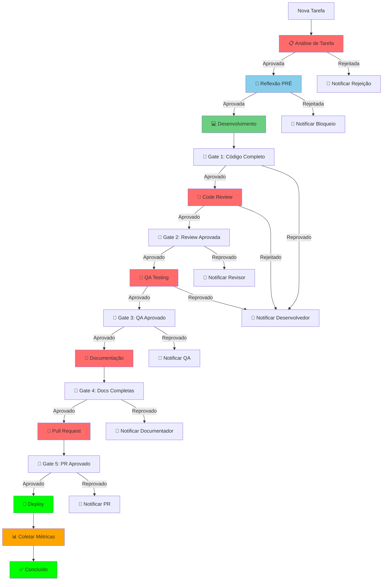

# Workflow Integrado Completo

## Visão Geral

Workflow **integrado** que combina todos os protocolos criados em um sistema unificado de desenvolvimento com excelência técnica garantida.

---

## 🎯 Objetivo

Garantir que **TODAS as tarefas** sigam o fluxo completo integrado:
- ✅ Análise de Tarefa (Protocolo 1)
- ✅ Reflexão Crítica (Sistema Existente)
- ✅ Desenvolvimento com Gates (Sistema Existente)
- ✅ Revisão Estruturada (Protocolo 2)
- ✅ QA Detalhado (Protocolo 3)
- ✅ Integração Automatizada (Protocolo 4)
- ✅ Métricas e Monitoramento (Protocolo 5)

---

## 🔄 Fluxo Integrado Completo

### **Arquitetura Integrada**



---

## 🔧 Implementação do Workflow Integrado

### **Sistema de Orquestração Principal**

```typescript
/**
 * Sistema de Orquestração Principal
 * 
 * Coordena todos os protocolos em um fluxo unificado
 */
class IntegratedWorkflowOrchestrator {
  private protocols: Map<string, Protocol> = new Map();
  private integration: AutomatedIntegrationSystem;
  private metrics: MetricsCollectionSystem;
  private notifications: NotificationService;
  
  constructor() {
    this.integration = new AutomatedIntegrationSystem();
    this.metrics = new MetricsCollectionSystem();
    this.notifications = new NotificationService();
    this.setupProtocols();
  }
  
  private setupProtocols(): void {
    // Protocolo 1: Análise de Tarefa
    this.protocols.set('task-analysis', new TaskAnalysisProtocol());
    
    // Protocolo 2: Revisão Estruturada
    this.protocols.set('code-review', new CodeReviewProtocol());
    
    // Protocolo 3: QA Detalhado
    this.protocols.set('qa', new QAProtocol());
    
    // Protocolo 4: Integração Automatizada
    this.protocols.set('integration', new AutomatedIntegrationProtocol());
    
    // Protocolo 5: Métricas e Monitoramento
    this.protocols.set('metrics', new MetricsMonitoringProtocol());
    
    // Sistemas existentes
    this.protocols.set('reflection', new SelfReflectionSystem());
    this.protocols.set('gates', new MandatoryGatesSystem());
  }
  
  /**
   * Executar workflow completo integrado
   */
  async executeIntegratedWorkflow(taskId: string, taskDescription: string): Promise<WorkflowResult> {
    console.log(`\n🚀 ========================================`);
    console.log(`🚀  WORKFLOW INTEGRADO - TAREFA: ${taskId}`);
    console.log(`🚀 ========================================\n`);
    
    const workflow: IntegratedWorkflow = {
      taskId,
      description: taskDescription,
      startTime: new Date().toISOString(),
      phases: {},
      metrics: {},
      status: 'IN_PROGRESS'
    };
    
    try {
      // ==========================================
      // FASE 1: ANÁLISE DE TAREFA
      // ==========================================
      console.log("📍 FASE 1: Análise de Tarefa\n");
      
      const analysisProtocol = this.protocols.get('task-analysis');
      const analysisResult = await analysisProtocol.execute(taskId, taskDescription);
      workflow.phases.analysis = analysisResult;
      
      if (!analysisResult.approved) {
        return await this.handleRejection(workflow, 'ANALYSIS', analysisResult.reason);
      }
      
      // Coletar métricas da análise
      await this.metrics.collectTaskMetrics(taskId, 'ANALYSIS', analysisResult);
      
      // ==========================================
      // FASE 2: REFLEXÃO PRÉ
      // ==========================================
      console.log("📍 FASE 2: Reflexão PRÉ\n");
      
      const reflectionProtocol = this.protocols.get('reflection');
      const reflectionResult = await reflectionProtocol.executePreReflection(taskId);
      workflow.phases.preReflection = reflectionResult;
      
      if (!reflectionResult.approved) {
        return await this.handleRejection(workflow, 'PRE_REFLECTION', reflectionResult.reason);
      }
      
      // ==========================================
      // FASE 3: DESENVOLVIMENTO
      // ==========================================
      console.log("📍 FASE 3: Desenvolvimento\n");
      
      const developmentResult = await this.executeDevelopmentPhase(taskId);
      workflow.phases.development = developmentResult;
      
      // ==========================================
      // FASE 4: GATE 1 - CÓDIGO COMPLETO
      // ==========================================
      console.log("📍 FASE 4: Gate 1 - Código Completo\n");
      
      const gatesProtocol = this.protocols.get('gates');
      const gate1Result = await gatesProtocol.validateGate1(taskId);
      workflow.phases.gate1 = gate1Result;
      
      if (!gate1Result.approved) {
        return await this.handleRejection(workflow, 'GATE_1', gate1Result.blockedReason);
      }
      
      // ==========================================
      // FASE 5: CODE REVIEW
      // ==========================================
      console.log("📍 FASE 5: Code Review\n");
      
      const reviewProtocol = this.protocols.get('code-review');
      const reviewResult = await reviewProtocol.execute(taskId, developmentResult.codeChanges);
      workflow.phases.codeReview = reviewResult;
      
      if (!reviewResult.approved) {
        return await this.handleRejection(workflow, 'CODE_REVIEW', reviewResult.reason);
      }
      
      // ==========================================
      // FASE 6: GATE 2 - REVIEW APROVADA
      // ==========================================
      console.log("📍 FASE 6: Gate 2 - Review Aprovada\n");
      
      const gate2Result = await gatesProtocol.validateGate2(taskId);
      workflow.phases.gate2 = gate2Result;
      
      if (!gate2Result.approved) {
        return await this.handleRejection(workflow, 'GATE_2', gate2Result.blockedReason);
      }
      
      // ==========================================
      // FASE 7: QA TESTING
      // ==========================================
      console.log("📍 FASE 7: QA Testing\n");
      
      const qaProtocol = this.protocols.get('qa');
      const qaResult = await qaProtocol.execute(taskId, developmentResult.codeChanges);
      workflow.phases.qa = qaResult;
      
      if (!qaResult.approved) {
        return await this.handleRejection(workflow, 'QA', qaResult.reason);
      }
      
      // ==========================================
      // FASE 8: GATE 3 - QA APROVADO
      // ==========================================
      console.log("📍 FASE 8: Gate 3 - QA Aprovado\n");
      
      const gate3Result = await gatesProtocol.validateGate3(taskId);
      workflow.phases.gate3 = gate3Result;
      
      if (!gate3Result.approved) {
        return await this.handleRejection(workflow, 'GATE_3', gate3Result.blockedReason);
      }
      
      // ==========================================
      // FASE 9: DOCUMENTAÇÃO
      // ==========================================
      console.log("📍 FASE 9: Documentação\n");
      
      const documentationResult = await this.executeDocumentationPhase(taskId);
      workflow.phases.documentation = documentationResult;
      
      // ==========================================
      // FASE 10: GATE 4 - DOCS COMPLETAS
      // ==========================================
      console.log("📍 FASE 10: Gate 4 - Docs Completas\n");
      
      const gate4Result = await gatesProtocol.validateGate4(taskId);
      workflow.phases.gate4 = gate4Result;
      
      if (!gate4Result.approved) {
        return await this.handleRejection(workflow, 'GATE_4', gate4Result.blockedReason);
      }
      
      // ==========================================
      // FASE 11: PULL REQUEST
      // ==========================================
      console.log("📍 FASE 11: Pull Request\n");
      
      const prResult = await this.executePullRequestPhase(taskId);
      workflow.phases.pullRequest = prResult;
      
      // ==========================================
      // FASE 12: GATE 5 - PR APROVADO
      // ==========================================
      console.log("📍 FASE 12: Gate 5 - PR Aprovado\n");
      
      const gate5Result = await gatesProtocol.validateGate5(taskId);
      workflow.phases.gate5 = gate5Result;
      
      if (!gate5Result.approved) {
        return await this.handleRejection(workflow, 'GATE_5', gate5Result.blockedReason);
      }
      
      // ==========================================
      // FASE 13: DEPLOY
      // ==========================================
      console.log("📍 FASE 13: Deploy\n");
      
      const deployResult = await this.executeDeployPhase(taskId);
      workflow.phases.deploy = deployResult;
      
      // ==========================================
      // FASE 14: COLETA DE MÉTRICAS
      // ==========================================
      console.log("📍 FASE 14: Coleta de Métricas\n");
      
      const metricsResult = await this.metrics.collectTaskMetrics(taskId);
      workflow.metrics = metricsResult;
      
      // ==========================================
      // WORKFLOW CONCLUÍDO
      // ==========================================
      workflow.status = 'COMPLETED';
      workflow.endTime = new Date().toISOString();
      
      console.log("\n🎉 ========================================");
      console.log("🎉  WORKFLOW INTEGRADO: CONCLUÍDO");
      console.log("🎉 ========================================\n");
      
      // Salvar workflow
      await this.saveWorkflow(workflow);
      
      // Gerar relatório final
      await this.generateFinalReport(workflow);
      
      return {
        success: true,
        workflow,
        message: 'Workflow integrado executado com sucesso'
      };
      
    } catch (error) {
      console.error(`❌ Erro no workflow integrado: ${error.message}`);
      
      workflow.status = 'FAILED';
      workflow.error = error.message;
      workflow.endTime = new Date().toISOString();
      
      // Salvar workflow com erro
      await this.saveWorkflow(workflow);
      
      // Notificar erro
      await this.notifications.notify({
        to: await this.getTaskOwner(taskId),
        type: 'WORKFLOW_FAILED',
        message: `Workflow falhou: ${error.message}`,
        taskId,
        nextAction: 'INVESTIGATE_ERROR'
      });
      
      return {
        success: false,
        workflow,
        error: error.message
      };
    }
  }
  
  /**
   * Executar fase de desenvolvimento
   */
  private async executeDevelopmentPhase(taskId: string): Promise<DevelopmentResult> {
    console.log("💻 Executando fase de desenvolvimento...\n");
    
    // Executar desenvolvimento com reflexões durante
    const development = await this.executeDevelopmentWithReflections(taskId);
    
    // Executar reflexão PÓS
    const reflectionProtocol = this.protocols.get('reflection');
    const postReflection = await reflectionProtocol.executePostReflection(taskId);
    
    if (!postReflection.approved) {
      throw new Error(`Reflexão PÓS rejeitada: ${postReflection.reason}`);
    }
    
    return {
      ...development,
      postReflection
    };
  }
  
  /**
   * Executar desenvolvimento com reflexões durante
   */
  private async executeDevelopmentWithReflections(taskId: string): Promise<DevelopmentResult> {
    const subtasks = await this.getSubtasks(taskId);
    const codeChanges: CodeChanges = {
      files: [],
      linesAdded: 0,
      linesRemoved: 0,
      functions: [],
      classes: []
    };
    
    let checkpoint = 0;
    for (const subtask of subtasks) {
      checkpoint++;
      
      // Executar subtarefa
      await this.executeSubtask(subtask);
      
      // Reflexão DURANTE
      const reflectionProtocol = this.protocols.get('reflection');
      const duringReflection = await reflectionProtocol.executeDuringReflection(taskId, checkpoint);
      
      if (!duringReflection.approved) {
        console.log("⚠️ Reflexão DURANTE detectou problemas. Pausando...");
        // Permitir ajustes antes de continuar
      }
    }
    
    return {
      subtasks: subtasks.length,
      codeChanges,
      checkpoints: checkpoint
    };
  }
  
  /**
   * Executar fase de documentação
   */
  private async executeDocumentationPhase(taskId: string): Promise<DocumentationResult> {
    console.log("📝 Executando fase de documentação...\n");
    
    // Executar documentação
    const documentation = await this.executeDocumentation(taskId);
    
    return {
      ...documentation
    };
  }
  
  /**
   * Executar fase de Pull Request
   */
  private async executePullRequestPhase(taskId: string): Promise<PullRequestResult> {
    console.log("🔀 Executando fase de Pull Request...\n");
    
    // Criar Pull Request
    const pr = await this.createPullRequest(taskId);
    
    return {
      ...pr
    };
  }
  
  /**
   * Executar fase de Deploy
   */
  private async executeDeployPhase(taskId: string): Promise<DeployResult> {
    console.log("🚀 Executando fase de Deploy...\n");
    
    // Executar Deploy
    const deploy = await this.executeDeploy(taskId);
    
    return {
      ...deploy
    };
  }
  
  /**
   * Tratar rejeição de fase
   */
  private async handleRejection(workflow: IntegratedWorkflow, phase: string, reason: string): Promise<WorkflowResult> {
    console.log(`❌ Fase rejeitada: ${phase} - ${reason}\n`);
    
    workflow.status = 'BLOCKED';
    workflow.blockedPhase = phase;
    workflow.blockedReason = reason;
    workflow.endTime = new Date().toISOString();
    
    // Notificar bloqueio
    await this.notifications.notify({
      to: await this.getTaskOwner(workflow.taskId),
      type: 'WORKFLOW_BLOCKED',
      message: `Workflow bloqueado em ${phase}: ${reason}`,
      taskId: workflow.taskId,
      nextAction: 'RESOLVE_BLOCKING_ISSUE'
    });
    
    // Salvar workflow bloqueado
    await this.saveWorkflow(workflow);
    
    return {
      success: false,
      workflow,
      reason: `Bloqueado em ${phase}: ${reason}`
    };
  }
}
```

---

## 🔄 Integração com Sistemas Existentes

### **Integração com Reflexão Crítica**

```typescript
/**
 * Integração com Sistema de Reflexão Crítica
 */
class ReflectionIntegration {
  /**
   * Executar reflexão PRÉ com insights da análise
   */
  async executePreReflectionWithAnalysis(taskId: string, analysis: TaskAnalysis): Promise<ReflectionResult> {
    const reflection = new SelfReflectionSystem();
    
    // Usar insights da análise para enriquecer reflexão
    const enhancedQuestions = this.enhanceQuestionsWithAnalysis(analysis);
    
    return await reflection.executePreReflection(taskId, enhancedQuestions);
  }
  
  /**
   * Executar reflexão DURANTE com checkpoints
   */
  async executeDuringReflectionWithCheckpoints(taskId: string, checkpoint: number): Promise<ReflectionResult> {
    const reflection = new SelfReflectionSystem();
    
    // Usar checkpoint para contextualizar reflexão
    const contextualQuestions = this.getContextualQuestions(checkpoint);
    
    return await reflection.executeDuringReflection(taskId, contextualQuestions);
  }
  
  /**
   * Executar reflexão PÓS com validações
   */
  async executePostReflectionWithValidations(taskId: string): Promise<ReflectionResult> {
    const reflection = new SelfReflectionSystem();
    
    // Usar validações para enriquecer reflexão
    const validationQuestions = this.getValidationQuestions(taskId);
    
    return await reflection.executePostReflection(taskId, validationQuestions);
  }
}
```

### **Integração com Gates Obrigatórios**

```typescript
/**
 * Integração com Sistema de Gates Obrigatórios
 */
class GatesIntegration {
  /**
   * Executar Gate 1 com validações integradas
   */
  async executeGate1WithIntegration(taskId: string): Promise<GateResult> {
    const gates = new MandatoryGatesSystem();
    
    // Executar Gate 1 padrão
    const gateResult = await gates.validateGate1(taskId);
    
    if (gateResult.approved) {
      // Coletar métricas do gate
      await this.metrics.collectGateMetrics(taskId, 'GATE_1', gateResult);
      
      // Disparar trigger de integração
      await this.integration.executeTrigger('gate1-approved', taskId);
      
      // Atualizar dashboard
      await this.dashboard.updateGateStatus(taskId, 'GATE_1', 'APPROVED');
    }
    
    return gateResult;
  }
  
  /**
   * Executar Gate 2 com validações de revisão
   */
  async executeGate2WithReview(taskId: string): Promise<GateResult> {
    const gates = new MandatoryGatesSystem();
    
    // Verificar se revisão foi aprovada
    const review = await this.getCodeReview(taskId);
    if (!review || !review.approved) {
      return {
        approved: false,
        blockedReason: 'Code review não aprovada',
        nextAction: 'Aguardar aprovação da revisão'
      };
    }
    
    // Executar Gate 2
    const gateResult = await gates.validateGate2(taskId);
    
    if (gateResult.approved) {
      // Coletar métricas
      await this.metrics.collectGateMetrics(taskId, 'GATE_2', gateResult);
      
      // Disparar trigger
      await this.integration.executeTrigger('gate2-approved', taskId);
      
      // Atualizar dashboard
      await this.dashboard.updateGateStatus(taskId, 'GATE_2', 'APPROVED');
    }
    
    return gateResult;
  }
}
```

---

## 📊 Métricas Integradas

### **Sistema de Métricas Integradas**

```typescript
/**
 * Sistema de Métricas Integradas
 */
class IntegratedMetricsSystem {
  /**
   * Coletar métricas de todo o workflow
   */
  async collectWorkflowMetrics(workflow: IntegratedWorkflow): Promise<WorkflowMetrics> {
    const metrics: WorkflowMetrics = {
      taskId: workflow.taskId,
      startTime: workflow.startTime,
      endTime: workflow.endTime,
      duration: this.calculateDuration(workflow.startTime, workflow.endTime),
      phases: {},
      quality: {},
      performance: {},
      productivity: {},
      compliance: {}
    };
    
    // Coletar métricas por fase
    for (const [phaseName, phaseResult] of Object.entries(workflow.phases)) {
      metrics.phases[phaseName] = await this.collectPhaseMetrics(phaseName, phaseResult);
    }
    
    // Calcular métricas agregadas
    metrics.quality = await this.calculateQualityMetrics(workflow);
    metrics.performance = await this.calculatePerformanceMetrics(workflow);
    metrics.productivity = await this.calculateProductivityMetrics(workflow);
    metrics.compliance = await this.calculateComplianceMetrics(workflow);
    
    return metrics;
  }
  
  /**
   * Gerar relatório integrado
   */
  async generateIntegratedReport(workflow: IntegratedWorkflow): Promise<IntegratedReport> {
    const metrics = await this.collectWorkflowMetrics(workflow);
    
    return {
      taskId: workflow.taskId,
      status: workflow.status,
      duration: metrics.duration,
      quality: {
        score: metrics.quality.overall,
        coverage: metrics.quality.coverage,
        bugs: metrics.quality.bugs,
        security: metrics.quality.security
      },
      performance: {
        score: metrics.performance.overall,
        efficiency: metrics.performance.efficiency,
        throughput: metrics.performance.throughput
      },
      productivity: {
        score: metrics.productivity.overall,
        collaboration: metrics.productivity.collaboration,
        learning: metrics.productivity.learning
      },
      compliance: {
        score: metrics.compliance.overall,
        standards: metrics.compliance.standards,
        regulations: metrics.compliance.regulations
      },
      recommendations: await this.generateRecommendations(metrics),
      nextSteps: await this.generateNextSteps(metrics)
    };
  }
}
```

---

## 🚫 Enforcement Integrado

### **Sistema de Enforcement Unificado**

```typescript
/**
 * Sistema de Enforcement Unificado
 */
class UnifiedEnforcementSystem {
  /**
   * Verificar conformidade com todos os protocolos
   */
  async checkCompliance(taskId: string): Promise<ComplianceResult> {
    const compliance: ComplianceResult = {
      taskId,
      overall: true,
      protocols: {},
      violations: [],
      recommendations: []
    };
    
    // Verificar conformidade com Análise de Tarefa
    const analysisCompliance = await this.checkAnalysisCompliance(taskId);
    compliance.protocols.analysis = analysisCompliance;
    
    // Verificar conformidade com Reflexão
    const reflectionCompliance = await this.checkReflectionCompliance(taskId);
    compliance.protocols.reflection = reflectionCompliance;
    
    // Verificar conformidade com Gates
    const gatesCompliance = await this.checkGatesCompliance(taskId);
    compliance.protocols.gates = gatesCompliance;
    
    // Verificar conformidade com Revisão
    const reviewCompliance = await this.checkReviewCompliance(taskId);
    compliance.protocols.review = reviewCompliance;
    
    // Verificar conformidade com QA
    const qaCompliance = await this.checkQACompliance(taskId);
    compliance.protocols.qa = qaCompliance;
    
    // Verificar conformidade com Integração
    const integrationCompliance = await this.checkIntegrationCompliance(taskId);
    compliance.protocols.integration = integrationCompliance;
    
    // Verificar conformidade com Métricas
    const metricsCompliance = await this.checkMetricsCompliance(taskId);
    compliance.protocols.metrics = metricsCompliance;
    
    // Calcular conformidade geral
    compliance.overall = Object.values(compliance.protocols).every(p => p.compliant);
    
    // Gerar recomendações
    compliance.recommendations = await this.generateComplianceRecommendations(compliance);
    
    return compliance;
  }
}
```

---

## 📁 Artifacts Integrados

### **Estrutura de Artifacts**

```
docs/integrated-workflow/
├── {taskId}/
│   ├── analysis/
│   │   ├── task-analysis.md
│   │   └── analysis-metrics.json
│   ├── reflection/
│   │   ├── pre-reflection.md
│   │   ├── during-reflections.md
│   │   └── post-reflection.md
│   ├── development/
│   │   ├── code-changes.md
│   │   └── development-metrics.json
│   ├── gates/
│   │   ├── gate1-result.md
│   │   ├── gate2-result.md
│   │   ├── gate3-result.md
│   │   ├── gate4-result.md
│   │   └── gate5-result.md
│   ├── review/
│   │   ├── code-review.md
│   │   └── review-metrics.json
│   ├── qa/
│   │   ├── qa-report.md
│   │   └── qa-metrics.json
│   ├── documentation/
│   │   ├── documentation.md
│   │   └── docs-metrics.json
│   ├── pull-request/
│   │   ├── pr-details.md
│   │   └── pr-metrics.json
│   ├── deploy/
│   │   ├── deploy-log.md
│   │   └── deploy-metrics.json
│   ├── metrics/
│   │   ├── workflow-metrics.json
│   │   └── integrated-report.md
│   └── final/
│       ├── workflow-summary.md
│       └── final-report.md
```

---

## 📈 Métricas de Sucesso Integradas

### **KPIs Integrados**

```typescript
interface IntegratedKPIs {
  workflow: {
    completionRate: number;        // >= 95%
    averageDuration: number;       // <= 24 horas
    successRate: number;           // >= 90%
    blockedRate: number;           // <= 5%
  };
  
  quality: {
    overallScore: number;          // >= 8.5
    testCoverage: number;          // >= 80%
    bugDensity: number;            // <= 3 bugs/1000 LOC
    securityScore: number;         // >= 9.0
  };
  
  performance: {
    efficiency: number;            // >= 85%
    throughput: number;            // >= 5 tarefas/semana
    firstTimeApproval: number;     // >= 75%
    gatePassRate: number;          // >= 85%
  };
  
  compliance: {
    overallCompliance: number;     // >= 95%
    protocolCompliance: number;    // >= 98%
    standardsCompliance: number;   // >= 90%
    auditReadiness: number;        // >= 95%
  };
}
```

---

## 🔄 Ciclo de Melhoria Contínua

### **Sistema de Melhoria Contínua**

```typescript
/**
 * Sistema de Melhoria Contínua
 */
class ContinuousImprovementSystem {
  /**
   * Analisar performance do workflow
   */
  async analyzeWorkflowPerformance(workflow: IntegratedWorkflow): Promise<ImprovementAnalysis> {
    const analysis: ImprovementAnalysis = {
      taskId: workflow.taskId,
      bottlenecks: [],
      inefficiencies: [],
      improvements: [],
      recommendations: []
    };
    
    // Identificar gargalos
    analysis.bottlenecks = await this.identifyBottlenecks(workflow);
    
    // Identificar ineficiências
    analysis.inefficiencies = await this.identifyInefficiencies(workflow);
    
    // Gerar melhorias
    analysis.improvements = await this.generateImprovements(analysis);
    
    // Gerar recomendações
    analysis.recommendations = await this.generateRecommendations(analysis);
    
    return analysis;
  }
  
  /**
   * Implementar melhorias
   */
  async implementImprovements(analysis: ImprovementAnalysis): Promise<void> {
    for (const improvement of analysis.improvements) {
      await this.implementImprovement(improvement);
    }
  }
}
```

---

**Versão**: 1.0  
**Data**: Dezembro 2024  
**Autor**: Agente-CTO  
**Status**: **OBRIGATÓRIO** para todas as tarefas  
**Integração**: Todos os protocolos e sistemas