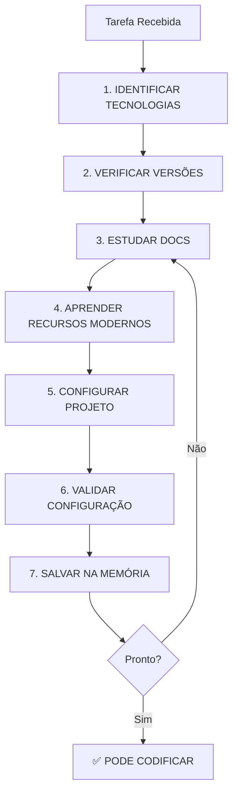

# Learning Workflow - Aprendizado Obrigatório Antes de Codificar

## Visão Geral

**REGRA FUNDAMENTAL**: Nenhum agente pode escrever código sem ESTUDAR COMPLETAMENTE as tecnologias que irá usar.

Este workflow garante:
- ✅ **Versões mais recentes** (latest stable)
- ✅ **APIs modernas** (recursos atuais)
- ✅ **Zero erros de lint** (configuração correta)
- ✅ **Zero erros de build** (validação prévia)
- ✅ **Sem APIs deprecated** (apenas código atual)

---

## Fluxo de Aprendizado



---

## FASE 1: IDENTIFICAR TECNOLOGIAS

### Análise da Stack

```typescript
async function identificarTecnologias(tarefa: string) {
  // 1. Ler requisitos da tarefa
  const requisitos = await read_file({
    target_file: "docs/planning/05-requisitos.md"
  });
  
  // 2. Identificar tecnologias necessárias
  const stack = {
    frontend: {
      framework: "React",  // ou Vue, Angular, Svelte
      language: "TypeScript",
      stateManagement: "Zustand",  // ou Redux, Jotai
      styling: "Tailwind CSS",
      uiLibrary: "Shadcn UI"
    },
    backend: {
      runtime: "Node.js",
      framework: "Next.js",  // ou Express, Fastify
      orm: "Prisma",  // ou Drizzle
      validation: "Zod"
    },
    testing: {
      unit: "Vitest",  // ou Jest
      e2e: "Playwright",  // ou Cypress
      library: "React Testing Library"
    },
    tools: {
      buildTool: "Vite",  // ou Webpack
      linter: "ESLint",
      formatter: "Prettier"
    }
  };
  
  // 3. Documentar stack identificada
  await write({
    file_path: "docs/planning/tech-stack-identified.md",
    contents: `# Tech Stack Identificada

## Frontend
${Object.entries(stack.frontend).map(([k, v]) => `- ${k}: ${v}`).join('\n')}

## Backend
${Object.entries(stack.backend).map(([k, v]) => `- ${k}: ${v}`).join('\n')}

## Testing
${Object.entries(stack.testing).map(([k, v]) => `- ${k}: ${v}`).join('\n')}

## Tools
${Object.entries(stack.tools).map(([k, v]) => `- ${k}: ${v}`).join('\n')}
`
  });
  
  return stack;
}
```

---

## FASE 2: VERIFICAR VERSÕES MAIS RECENTES

### Pesquisa de Versões

```typescript
async function verificarVersoes(stack: TechStack) {
  const versoes = {};
  
  // Para cada tecnologia, buscar versão mais recente
  for (const [categoria, techs] of Object.entries(stack)) {
    for (const [nome, tech] of Object.entries(techs)) {
      // 1. Buscar versão latest stable
      const versionSearch = await web_search({
        search_term: `${tech} latest stable version 2025`,
        explanation: `Verificar versão mais recente e estável de ${tech}`
      });
      
      // 2. Verificar no npm (se aplicável)
      const npmInfo = await run_terminal_cmd({
        command: `npm view ${tech.toLowerCase().replace(/\s/g, '-')} version`,
        is_background: false,
        required_permissions: ["network"]
      });
      
      // 3. Salvar versão identificada
      versoes[tech] = {
        version: npmInfo.stdout.trim(),
        url: `https://www.npmjs.com/package/${tech.toLowerCase()}`,
        releaseDate: new Date().toISOString(),
        status: "stable"
      };
    }
  }
  
  // Documentar versões
  await write({
    file_path: "docs/planning/tech-versions.md",
    contents: `# Versões das Tecnologias

Pesquisado em: ${new Date().toISOString()}

${Object.entries(versoes).map(([tech, info]) => `
## ${tech}
- **Versão**: ${info.version}
- **Status**: ${info.status}
- **Link**: ${info.url}
`).join('\n')}
`
  });
  
  return versoes;
}
```

---

## FASE 3: ESTUDAR DOCUMENTAÇÕES OFICIAIS

### Estudo Sistemático

```typescript
async function estudarDocumentacoes(stack: TechStack, versoes: Versions) {
  const aprendizados = [];
  
  for (const [tech, info] of Object.entries(versoes)) {
    console.log(`[LEARNING] Estudando ${tech} v${info.version}...`);
    
    // 1. Buscar documentação oficial
    const docsUrl = await web_search({
      search_term: `${tech} official documentation`,
      explanation: `Encontrar docs oficiais de ${tech}`
    });
    
    // 2. Estudar Getting Started
    const gettingStarted = await web_search({
      search_term: `${tech} getting started tutorial latest`,
      explanation: `Aprender conceitos básicos de ${tech}`
    });
    
    // 3. Estudar Core Concepts
    const coreConcepts = await web_search({
      search_term: `${tech} core concepts fundamentals`,
      explanation: `Entender fundamentos de ${tech}`
    });
    
    // 4. Estudar Best Practices
    const bestPractices = await web_search({
      search_term: `${tech} best practices 2025`,
      explanation: `Aprender melhores práticas atuais de ${tech}`
    });
    
    // 5. Estudar Common Pitfalls
    const pitfalls = await web_search({
      search_term: `${tech} common mistakes pitfalls avoid`,
      explanation: `Aprender o que evitar em ${tech}`
    });
    
    // 6. Documentar aprendizado
    const aprendizado = {
      tech,
      version: info.version,
      docsUrl: docsUrl.results[0]?.url || "",
      coreFeatures: [
        "// Extrair dos resultados de pesquisa"
      ],
      bestPractices: [
        "// Extrair dos resultados"
      ],
      pitfalls: [
        "// Extrair dos resultados"
      ],
      studiedAt: new Date().toISOString(),
      status: "✅ COMPLETO"
    };
    
    aprendizados.push(aprendizado);
    
    // 7. Salvar na memória persistente
    await update_memory({
      action: "create",
      title: `${tech} v${info.version} - Estudado`,
      knowledge_to_store: JSON.stringify(aprendizado, null, 2)
    });
  }
  
  return aprendizados;
}
```

### Template de Estudo

```typescript
await write({
  file_path: "docs/learning/tech-study-template.md",
  contents: `# Estudo de [Tecnologia] v[Versão]

## 📚 Documentação Oficial
- **URL**: [link]
- **Última atualização**: [data]

## 🎯 Core Concepts

### 1. [Conceito Principal 1]
**O que é**: [explicação]
**Como usar**: [exemplo]
**Quando usar**: [casos de uso]

### 2. [Conceito Principal 2]
**O que é**: [explicação]
**Como usar**: [exemplo]
**Quando usar**: [casos de uso]

## ✨ Recursos Modernos (v[Versão])

### 1. [Feature Nova 1]
**Introduzida em**: v[X.Y.Z]
**Propósito**: [para que serve]
**Exemplo**:
\`\`\`typescript
// código exemplo
\`\`\`

### 2. [Feature Nova 2]
**Introduzida em**: v[X.Y.Z]
**Propósito**: [para que serve]
**Exemplo**:
\`\`\`typescript
// código exemplo
\`\`\`

## ⚡ Best Practices

### Do's (Fazer)
- ✅ [Prática recomendada 1]
- ✅ [Prática recomendada 2]
- ✅ [Prática recomendada 3]

### Don'ts (Evitar)
- ❌ [Prática desaconselhada 1]
- ❌ [Prática desaconselhada 2]
- ❌ [Prática desaconselhada 3]

## 🚨 Common Pitfalls

### Pitfall 1: [Nome]
**Problema**: [descrição do problema]
**Solução**: [como evitar]
**Exemplo Errado**:
\`\`\`typescript
// código problemático
\`\`\`
**Exemplo Correto**:
\`\`\`typescript
// código correto
\`\`\`

## 📊 Quando Usar

### Use quando:
- Cenário 1
- Cenário 2

### Não use quando:
- Cenário 3
- Cenário 4

## 🔄 Migration Notes

### Deprecated APIs (a evitar)
- ~~oldAPI()~~ → **useNewAPI()** (desde v[X.Y])
- ~~oldPattern~~ → **newPattern** (desde v[X.Y])

## ✅ Checklist de Aprendizado

- [ ] Li documentação oficial
- [ ] Entendi core concepts
- [ ] Conheço recursos modernos
- [ ] Sei as best practices
- [ ] Conheço pitfalls comuns
- [ ] Sei quando usar/não usar
- [ ] Conheço APIs deprecated
- [ ] Pronto para codificar

**Estudado por**: [nome do agente]
**Data**: [data]
**Status**: [COMPLETO/EM PROGRESSO]
`
});
```

---

## FASE 4: APRENDER RECURSOS MODERNOS

### Foco em Features Atuais

```typescript
async function aprenderRecursosModernos(tech: string, version: string) {
  // 1. Changelog recente
  const changelog = await web_search({
    search_term: `${tech} v${version} changelog what's new`,
    explanation: `Descobrir novidades de ${tech} v${version}`
  });
  
  // 2. Recursos destacados
  const features = await web_search({
    search_term: `${tech} v${version} new features highlights`,
    explanation: `Aprender principais recursos de ${tech} v${version}`
  });
  
  // 3. Breaking changes
  const breaking = await web_search({
    search_term: `${tech} v${version} breaking changes migration`,
    explanation: `Entender mudanças incompatíveis de ${tech} v${version}`
  });
  
  // 4. Documentar recursos modernos
  await write({
    file_path: `docs/learning/${tech}-modern-features.md`,
    contents: `# ${tech} v${version} - Recursos Modernos

## Novidades da Versão

${changelog.results.map(r => `- ${r.title}`).join('\n')}

## Principais Features

### Feature 1: [Nome]
**Status**: ✅ Stable / 🧪 Experimental
**Desde**: v${version}
**Uso**:
\`\`\`typescript
// exemplo de código
\`\`\`

### Feature 2: [Nome]
**Status**: ✅ Stable / 🧪 Experimental
**Desde**: v${version}
**Uso**:
\`\`\`typescript
// exemplo de código
\`\`\`

## Breaking Changes

### Change 1
**O que mudou**: [descrição]
**Antes (deprecated)**:
\`\`\`typescript
// código antigo
\`\`\`
**Depois (atual)**:
\`\`\`typescript
// código novo
\`\`\`

## Aproveitamento no Projeto

Vamos usar os seguintes recursos modernos:
- [x] Feature X para [finalidade]
- [x] Feature Y para [finalidade]
- [ ] Feature Z (não aplicável neste projeto)
`
  });
}
```

---

## FASE 5: CONFIGURAR PROJETO

### Setup Completo

```typescript
async function configurarProjeto(stack: TechStack, versoes: Versions) {
  // 1. package.json com versões corretas
  await write({
    file_path: "package.json",
    contents: JSON.stringify({
      name: "my-project",
      version: "1.0.0",
      type: "module",
      scripts: {
        "dev": "vite",
        "build": "tsc && vite build",
        "lint": "eslint . --ext ts,tsx --report-unused-disable-directives --max-warnings 0",
        "type-check": "tsc --noEmit",
        "test": "vitest",
        "test:ui": "vitest --ui",
        "test:coverage": "vitest --coverage",
        "format": "prettier --write \"src/**/*.{ts,tsx}\""
      },
      dependencies: {
        "react": "^18.3.1",  // LATEST STABLE
        "react-dom": "^18.3.1",
        "zod": "^3.23.8",
        "zustand": "^4.5.2"
      },
      devDependencies: {
        "@types/react": "^18.3.3",
        "@types/react-dom": "^18.3.0",
        "@typescript-eslint/eslint-plugin": "^7.13.1",
        "@typescript-eslint/parser": "^7.13.1",
        "@vitejs/plugin-react": "^4.3.1",
        "eslint": "^8.57.0",
        "eslint-plugin-react-hooks": "^4.6.2",
        "eslint-plugin-react-refresh": "^0.4.7",
        "prettier": "^3.3.2",
        "typescript": "^5.5.3",
        "vite": "^5.3.1",
        "vitest": "^1.6.0"
      }
    }, null, 2)
  });
  
  // 2. tsconfig.json (configuração moderna)
  await write({
    file_path: "tsconfig.json",
    contents: JSON.stringify({
      compilerOptions: {
        target: "ES2022",  // Moderno
        lib: ["ES2023", "DOM", "DOM.Iterable"],
        module: "ESNext",
        skipLibCheck: true,
        
        /* Bundler mode */
        moduleResolution: "bundler",
        allowImportingTsExtensions: true,
        resolveJsonModule: true,
        isolatedModules: true,
        noEmit: true,
        jsx: "react-jsx",
        
        /* Linting */
        strict: true,  // MODO STRICT OBRIGATÓRIO
        noUnusedLocals: true,
        noUnusedParameters: true,
        noFallthroughCasesInSwitch: true,
        noUncheckedIndexedAccess: true,  // Segurança extra
        
        /* Paths */
        baseUrl: ".",
        paths: {
          "@/*": ["./src/*"]
        }
      },
      include: ["src"],
      references: [{ path: "./tsconfig.node.json" }]
    }, null, 2)
  });
  
  // 3. ESLint (regras rigorosas)
  await write({
    file_path: ".eslintrc.json",
    contents: JSON.stringify({
      root: true,
      env: { browser: true, es2022: true },
      extends: [
        "eslint:recommended",
        "plugin:@typescript-eslint/strict-type-checked",  // STRICT
        "plugin:@typescript-eslint/stylistic-type-checked",
        "plugin:react/recommended",
        "plugin:react/jsx-runtime",
        "plugin:react-hooks/recommended"
      ],
      ignorePatterns: ["dist", ".eslintrc.cjs"],
      parser: "@typescript-eslint/parser",
      parserOptions: {
        ecmaVersion: "latest",
        sourceType: "module",
        project: ["./tsconfig.json", "./tsconfig.node.json"],
        tsconfigRootDir: __dirname
      },
      plugins: ["react-refresh"],
      rules: {
        // ZERO TOLERÂNCIA
        "no-console": "error",  // Proibir console.log
        "@typescript-eslint/no-explicit-any": "error",  // Proibir any
        "@typescript-eslint/explicit-function-return-type": "warn",
        "@typescript-eslint/no-unused-vars": ["error", { 
          argsIgnorePattern: "^_",
          varsIgnorePattern: "^_" 
        }],
        "@typescript-eslint/consistent-type-imports": "error",
        "@typescript-eslint/no-import-type-side-effects": "error",
        "react-refresh/only-export-components": [
          "warn",
          { allowConstantExport: true }
        ]
      }
    }, null, 2)
  });
  
  // 4. Prettier
  await write({
    file_path: ".prettierrc",
    contents: JSON.stringify({
      semi: true,
      trailingComma: "es5",
      singleQuote: true,
      printWidth: 100,
      tabWidth: 2,
      useTabs: false
    }, null, 2)
  });
  
  // 5. Vitest config
  await write({
    file_path: "vitest.config.ts",
    contents: `import { defineConfig } from 'vitest/config';
import react from '@vitejs/plugin-react';

export default defineConfig({
  plugins: [react()],
  test: {
    globals: true,
    environment: 'jsdom',
    setupFiles: './src/test/setup.ts',
    coverage: {
      provider: 'v8',
      reporter: ['text', 'json', 'html'],
      exclude: [
        'node_modules/',
        'src/test/',
      ],
      thresholds: {
        lines: 80,  // Mínimo 80%
        functions: 80,
        branches: 80,
        statements: 80
      }
    }
  }
});
`
  });
}
```

---

## FASE 6: VALIDAR CONFIGURAÇÃO

### Testes de Validação

```typescript
async function validarConfiguracao() {
  console.log("[VALIDATION] Validando configuração do projeto...");
  
  const validationResults = {
    install: false,
    lint: false,
    typeCheck: false,
    build: false,
    test: false
  };
  
  // 1. Instalar dependências
  console.log("[1/5] Instalando dependências...");
  const install = await run_terminal_cmd({
    command: "npm install",
    is_background: false,
    required_permissions: ["network"]
  });
  validationResults.install = install.exitCode === 0;
  
  if (!validationResults.install) {
    throw new Error("❌ Falha ao instalar dependências");
  }
  
  // 2. Lint
  console.log("[2/5] Verificando lint...");
  const lint = await run_terminal_cmd({
    command: "npm run lint",
    is_background: false
  });
  validationResults.lint = lint.exitCode === 0;
  
  if (!validationResults.lint) {
    console.error("❌ Erros de lint encontrados:");
    console.error(lint.stderr);
    throw new Error("Corrija os erros de lint antes de continuar");
  }
  
  // 3. Type check
  console.log("[3/5] Verificando tipos...");
  const typeCheck = await run_terminal_cmd({
    command: "npm run type-check",
    is_background: false
  });
  validationResults.typeCheck = typeCheck.exitCode === 0;
  
  if (!validationResults.typeCheck) {
    console.error("❌ Erros de tipo encontrados:");
    console.error(typeCheck.stderr);
    throw new Error("Corrija os erros de tipo antes de continuar");
  }
  
  // 4. Build
  console.log("[4/5] Testando build...");
  const build = await run_terminal_cmd({
    command: "npm run build",
    is_background: false
  });
  validationResults.build = build.exitCode === 0;
  
  if (!validationResults.build) {
    console.error("❌ Falha no build:");
    console.error(build.stderr);
    throw new Error("Corrija os erros de build antes de continuar");
  }
  
  // 5. Testes (se houver)
  console.log("[5/5] Executando testes...");
  const test = await run_terminal_cmd({
    command: "npm test -- --run",
    is_background: false
  });
  validationResults.test = test.exitCode === 0;
  
  // Gerar relatório
  await write({
    file_path: "docs/learning/validation-report.md",
    contents: `# Relatório de Validação

Data: ${new Date().toISOString()}

## Resultados

| Verificação | Status | Detalhes |
|-------------|--------|----------|
| Install | ${validationResults.install ? '✅' : '❌'} | npm install |
| Lint | ${validationResults.lint ? '✅' : '❌'} | 0 erros |
| Type Check | ${validationResults.typeCheck ? '✅' : '❌'} | 0 erros |
| Build | ${validationResults.build ? '✅' : '❌'} | Success |
| Tests | ${validationResults.test ? '✅' : '❌'} | All passed |

## Conclusão

${Object.values(validationResults).every(Boolean) 
  ? '✅ **VALIDAÇÃO COMPLETA** - Projeto pronto para desenvolvimento'
  : '❌ **VALIDAÇÃO FALHOU** - Corrija os erros antes de continuar'
}
`
  });
  
  return validationResults;
}
```

---

## FASE 7: SALVAR NA MEMÓRIA

### Persistência do Aprendizado

```typescript
async function salvarAprendizadoNaMemoria(aprendizados: Learning[]) {
  for (const learn of aprendizados) {
    await update_memory({
      action: "create",
      title: `${learn.tech} v${learn.version} - Aprendizado Completo`,
      knowledge_to_store: `
TECNOLOGIA: ${learn.tech}
VERSÃO: ${learn.version} (latest stable)
DOCS OFICIAIS: ${learn.docsUrl}

RECURSOS MODERNOS:
${learn.modernFeatures.map(f => `- ${f.name}: ${f.description}`).join('\n')}

BEST PRACTICES:
${learn.bestPractices.map(bp => `- ${bp}`).join('\n')}

PITFALLS A EVITAR:
${learn.pitfalls.map(p => `- ${p}`).join('\n')}

APIs DEPRECATED (NÃO USAR):
${learn.deprecated.map(d => `- ${d.old} → usar ${d.new}`).join('\n')}

STATUS: ✅ ESTUDADO E VALIDADO
DATA: ${learn.studiedAt}
AGENTE: ${learn.agent}

PRONTO PARA USO: SIM
LINT CONFIGURADO: SIM
BUILD VALIDADO: SIM
`
    });
  }
}
```

---

## Checklist Final de Aprendizado

```markdown
## Antes de Escrever QUALQUER Linha de Código

### Fase 0: Aprendizado (OBRIGATÓRIO)

- [ ] FASE 1: Tecnologias identificadas
- [ ] FASE 2: Versões mais recentes verificadas
- [ ] FASE 3: Documentações oficiais estudadas
- [ ] FASE 4: Recursos modernos aprendidos
- [ ] FASE 5: Projeto configurado
- [ ] FASE 6: Configuração validada (lint + build)
- [ ] FASE 7: Aprendizado salvo na memória

### Validações

- [ ] ✅ npm install passou
- [ ] ✅ npm run lint passou (0 errors)
- [ ] ✅ npm run type-check passou (0 errors)
- [ ] ✅ npm run build passou (success)
- [ ] ✅ Todas as tecnologias estudadas
- [ ] ✅ Todas as versões são latest stable
- [ ] ✅ Todos os recursos modernos conhecidos
- [ ] ✅ Todos os pitfalls conhecidos
- [ ] ✅ Nenhuma API deprecated será usada

### Aprovação

✅ **APRENDIZADO COMPLETO**  
✅ **CONFIGURAÇÃO VALIDADA**  
✅ **PRONTO PARA CODIFICAR**

Aprovado por: Agente-CTO  
Data: [data]
```

---

## Integração com Outros Workflows

### Workflow Completo
- Learning Workflow é **FASE 0** (antes do planejamento)
- Sem aprendizado = projeto bloqueado

### Multi-Agent Workflow
- Cada agente executa learning para sua área
- Compartilham aprendizados via memória persistente

### Debug Workflow
- Se bug for por API deprecated = falha no learning
- Adicionar à lista de pitfalls

---

## Métricas de Sucesso

### Indicadores de Aprendizado Completo

- ✅ 100% das tecnologias estudadas
- ✅ 100% das versões são latest stable
- ✅ 0 erros de lint
- ✅ 0 erros de build
- ✅ 0 erros de tipo
- ✅ 0 APIs deprecated usadas
- ✅ Todos os recursos modernos conhecidos

### Red Flags (Bloqueadores)

- ❌ Tentativa de codificar sem estudar docs
- ❌ Uso de versões antigas
- ❌ Uso de APIs deprecated
- ❌ Erros de lint/build ignorados
- ❌ Configuração não validada

---

**REGRA DE OURO #56**: Estudar SEMPRE antes de codificar. Sem exceções.

**Versão**: 1.0  
**Data**: Outubro 2025  
**Autor**: Agente-CTO  
**Status**: OBRIGATÓRIO para todos os agentes

