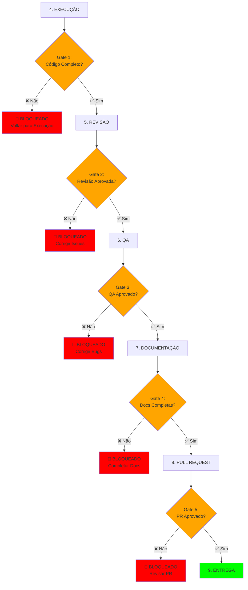
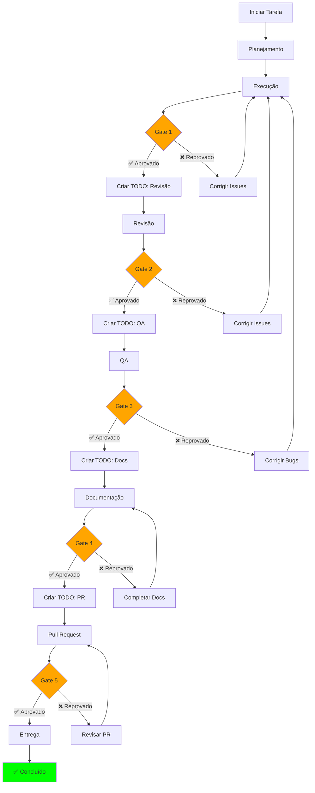

# Sistema de Gates Obrigatórios (Mandatory Gates)

## Visão Geral

Sistema de **checkpoints obrigatórios** entre fases que **BLOQUEIA** o progresso do agente até que todos os critérios sejam cumpridos e aprovados.

---

## Arquitetura de Gates



---

## Gate 1: Código Completo → Revisão

### Critérios de Aprovação

```typescript
interface Gate1Criteria {
  // ZERO TOLERÂNCIA (Regras 61-65, 68)
  errors: {
    lint_errors: 0;           // ✅ OBRIGATÓRIO
    type_errors: 0;           // ✅ OBRIGATÓRIO
    build_errors: 0;          // ✅ OBRIGATÓRIO
    runtime_errors: 0;        // ✅ OBRIGATÓRIO
    warnings: 0;              // ✅ OBRIGATÓRIO
  };
  
  // CÓDIGO LIMPO
  code_quality: {
    no_mocks: true;           // ✅ Zero mocks/placeholders
    no_todos: true;           // ✅ Zero TODO/FIXME/HACK/XXX
    no_workarounds: true;     // ✅ Zero gambiarras
    no_console_logs: true;    // ✅ Zero console.log
    no_any_types: true;       // ✅ Zero "any" em TypeScript
  };
  
  // FUNCIONALIDADE COMPLETA
  completeness: {
    all_features: true;       // ✅ Todas features implementadas
    all_crud: true;           // ✅ CRUD completo (C,R,U,D)
    error_handling: true;     // ✅ Tratamento de erros robusto
    validation: true;         // ✅ Validação Zod implementada
    edge_cases: true;         // ✅ Edge cases tratados
  };
}
```

### Validação Automática

```typescript
/**
 * Gate 1: Validar código antes de submeter para revisão
 */
async function validateGate1(): Promise<GateResult> {
  console.log("\n🚧 GATE 1: Validando código antes da revisão...\n");
  
  const checks: Check[] = [];
  
  // 1. LINT
  console.log("[1/8] Executando lint...");
  const lintResult = await run_terminal_cmd({
    command: "npm run lint",
    is_background: false,
    explanation: "Validar código com ESLint"
  });
  checks.push({
    name: "Lint",
    passed: lintResult.exitCode === 0,
    message: lintResult.exitCode === 0 ? "✅ 0 errors" : "❌ Errors encontrados"
  });
  
  // 2. TYPE CHECK
  console.log("[2/8] Executando type check...");
  const typeResult = await run_terminal_cmd({
    command: "npm run type-check",
    is_background: false,
    explanation: "Validar tipos TypeScript"
  });
  checks.push({
    name: "Type Check",
    passed: typeResult.exitCode === 0,
    message: typeResult.exitCode === 0 ? "✅ 0 errors" : "❌ Type errors encontrados"
  });
  
  // 3. BUILD
  console.log("[3/8] Executando build...");
  const buildResult = await run_terminal_cmd({
    command: "npm run build",
    is_background: false,
    explanation: "Validar build de produção"
  });
  checks.push({
    name: "Build",
    passed: buildResult.exitCode === 0,
    message: buildResult.exitCode === 0 ? "✅ Build success" : "❌ Build failed"
  });
  
  // 4. TESTES
  console.log("[4/8] Executando testes...");
  const testResult = await run_terminal_cmd({
    command: "npm test",
    is_background: false,
    explanation: "Validar testes unitários"
  });
  checks.push({
    name: "Tests",
    passed: testResult.exitCode === 0,
    message: testResult.exitCode === 0 ? "✅ All tests passed" : "❌ Tests failed"
  });
  
  // 5. BUSCAR MOCKS/PLACEHOLDERS
  console.log("[5/8] Verificando mocks/placeholders...");
  const mocksResult = await grep({
    pattern: "// TODO|// FIXME|// HACK|// XXX|// MOCK|placeholder",
    path: "src/",
    output_mode: "count"
  });
  const hasMocks = mocksResult.totalMatches > 0;
  checks.push({
    name: "No Mocks",
    passed: !hasMocks,
    message: hasMocks ? `❌ ${mocksResult.totalMatches} mocks/TODOs encontrados` : "✅ 0 mocks"
  });
  
  // 6. BUSCAR CONSOLE.LOGS
  console.log("[6/8] Verificando console.log...");
  const consoleResult = await grep({
    pattern: "console\\.log|console\\.error|console\\.warn|debugger",
    path: "src/",
    output_mode: "count"
  });
  const hasConsole = consoleResult.totalMatches > 0;
  checks.push({
    name: "No Console.log",
    passed: !hasConsole,
    message: hasConsole ? `❌ ${consoleResult.totalMatches} console.log encontrados` : "✅ 0 console.log"
  });
  
  // 7. BUSCAR TIPO ANY
  console.log("[7/8] Verificando tipo 'any'...");
  const anyResult = await grep({
    pattern: ": any|<any>",
    path: "src/",
    type: "ts",
    output_mode: "count"
  });
  const hasAny = anyResult.totalMatches > 0;
  checks.push({
    name: "No 'any' Types",
    passed: !hasAny,
    message: hasAny ? `❌ ${anyResult.totalMatches} tipos 'any' encontrados` : "✅ 0 any"
  });
  
  // 8. COVERAGE
  console.log("[8/8] Verificando coverage...");
  const coverageResult = await run_terminal_cmd({
    command: "npm test -- --coverage --silent",
    is_background: false,
    explanation: "Calcular code coverage"
  });
  // Parsear coverage do output (assumindo formato padrão)
  const coverageMatch = coverageResult.stdout.match(/All files.*?(\d+\.?\d*)/);
  const coverage = coverageMatch ? parseFloat(coverageMatch[1]) : 0;
  checks.push({
    name: "Coverage >= 80%",
    passed: coverage >= 80,
    message: coverage >= 80 ? `✅ ${coverage}%` : `❌ ${coverage}% (mínimo: 80%)`
  });
  
  // RESULTADO FINAL
  const allPassed = checks.every(c => c.passed);
  
  console.log("\n📊 RESULTADO DO GATE 1:\n");
  checks.forEach(check => {
    console.log(`${check.passed ? '✅' : '❌'} ${check.name}: ${check.message}`);
  });
  
  if (allPassed) {
    console.log("\n✅ ========================================");
    console.log("✅  GATE 1: APROVADO");
    console.log("✅ ========================================");
    console.log("✅ Código está pronto para REVISÃO\n");
    
    return {
      approved: true,
      nextPhase: "REVISÃO",
      checks
    };
  } else {
    console.log("\n❌ ========================================");
    console.log("❌  GATE 1: REPROVADO");
    console.log("❌ ========================================");
    console.log("❌ Corrija os problemas antes de prosseguir\n");
    
    // Gerar relatório de bloqueio
    await write({
      file_path: "docs/gates/gate1-blocked.md",
      contents: `# Gate 1 - BLOQUEADO

## Data: ${new Date().toISOString()}

## Problemas Encontrados

${checks.filter(c => !c.passed).map(c => `- ❌ **${c.name}**: ${c.message}`).join('\n')}

## Próximos Passos

Corrija TODOS os problemas acima antes de submeter para revisão.

## Regras Violadas

${checks.filter(c => !c.passed).map(c => {
  if (c.name === "Lint") return "- Regra 59: Zero erros de lint";
  if (c.name === "Type Check") return "- Regra 61: Zero erros de tipo";
  if (c.name === "Build") return "- Regra 60: Zero erros de build";
  if (c.name === "Tests") return "- Regra 66: Testes 100% passando";
  if (c.name === "No Mocks") return "- Regra 63: Zero mocks/placeholders";
  if (c.name === "No Console.log") return "- Regra 68: Zero console.log";
  if (c.name === "No 'any' Types") return "- Regra 64: Zero tipo 'any'";
  if (c.name === "Coverage >= 80%") return "- Regra 67: Coverage >= 80%";
  return "";
}).filter(Boolean).join('\n')}
`
    });
    
    return {
      approved: false,
      blockedReason: "Código não atende aos critérios mínimos",
      checks,
      mustFix: checks.filter(c => !c.passed)
    };
  }
}
```

### Uso Obrigatório

```typescript
// ANTES DE MARCAR TODO COMO COMPLETED
// O agente DEVE executar Gate 1

// ❌ ERRADO (pular direto)
await todo_write({
  merge: true,
  todos: [
    { id: "4-execution", status: "completed" }
  ]
});

// ✅ CORRETO (validar gate primeiro)
const gate1Result = await validateGate1();

if (!gate1Result.approved) {
  console.log("🚫 BLOQUEADO: Não pode prosseguir sem passar no Gate 1");
  
  // Marcar TODO como bloqueado
  await todo_write({
    merge: true,
    todos: [
      { id: "4-execution", status: "blocked", content: "Gate 1 reprovado - corrigir issues" }
    ]
  });
  
  // PARAR EXECUÇÃO
  throw new Error("Gate 1 failed - must fix issues before continuing");
}

// Se aprovado, criar TODO de revisão OBRIGATÓRIO
await todo_write({
  merge: true,
  todos: [
    { id: "4-execution", status: "completed" },
    { id: "5-review", status: "pending", content: "Submeter código para revisão do Agente-Revisor" }
  ]
});
```

---

## Gate 2: Revisão Aprovada → QA

### Critérios de Aprovação

```typescript
interface Gate2Criteria {
  // REVISÃO HUMANA/AGENTE
  code_review: {
    reviewer_assigned: true;
    review_completed: true;
    approval_given: true;
    comments_addressed: true;
  };
  
  // QUALIDADE
  quality: {
    complexity_ok: true;      // Complexidade ciclomática aceitável
    no_duplications: true;    // Sem código duplicado
    patterns_followed: true;  // Padrões do projeto seguidos
    security_ok: true;        // Sem vulnerabilidades óbvias
  };
  
  // DOCUMENTAÇÃO
  documentation: {
    jsdoc_complete: true;     // JSDoc em funções públicas
    readme_updated: true;     // README atualizado
    adr_created: boolean;     // ADR se decisão técnica
  };
}
```

### Validação

```typescript
async function validateGate2(): Promise<GateResult> {
  console.log("\n🚧 GATE 2: Validando revisão de código...\n");
  
  // 1. Verificar se revisor foi atribuído
  const reviewerAssigned = await checkReviewerAssigned();
  
  // 2. Verificar se review foi completada
  const reviewCompleted = await checkReviewCompleted();
  
  // 3. Verificar se foi aprovada
  const reviewApproved = await checkReviewApproved();
  
  if (!reviewApproved) {
    console.log("❌ GATE 2: REPROVADO - Code review não aprovada");
    return {
      approved: false,
      blockedReason: "Code review pendente ou rejeitada",
      nextAction: "Aguardar aprovação do revisor"
    };
  }
  
  console.log("✅ GATE 2: APROVADO - Prosseguir para QA");
  return {
    approved: true,
    nextPhase: "QA"
  };
}
```

---

## Gate 3: QA Aprovado → Documentação

### Critérios de Aprovação

```typescript
interface Gate3Criteria {
  // TESTES
  testing: {
    all_tests_passing: true;
    coverage_80_plus: true;
    e2e_tested: boolean;      // Se aplicável
    regression_tested: true;
  };
  
  // BUGS
  bugs: {
    critical_bugs: 0;
    high_bugs: 0;
    medium_bugs: number;      // Aceitável se documentado
  };
  
  // FUNCIONALIDADE
  functionality: {
    all_features_work: true;
    edge_cases_tested: true;
    error_states_tested: true;
    loading_states_tested: true;
  };
}
```

---

## Gate 4: Documentação Completa → PR

### Critérios de Aprovação

```typescript
interface Gate4Criteria {
  documentation: {
    readme_updated: true;
    jsdoc_complete: true;
    mermaid_diagrams: true;
    adr_created: boolean;     // Se decisões técnicas
    changelog_updated: true;
    api_docs: boolean;        // Se API pública
  };
}
```

---

## Gate 5: PR Aprovado → Entrega

### Critérios de Aprovação

```typescript
interface Gate5Criteria {
  pull_request: {
    created: true;
    template_filled: true;
    ci_cd_passed: true;
    approvals_obtained: {
      code_review: true;
      qa: true;
      cto: true;
      security: boolean;      // Se mudanças de segurança
    };
  };
}
```

---

## Implementação no Workflow

### Atualizar Fase 4: Execução

Adicionar ao final:

```typescript
// ==========================================
// GATE 1: VALIDAÇÃO OBRIGATÓRIA
// ==========================================

console.log("\n🚧 Executando Gate 1 (Código Completo → Revisão)...\n");

const gate1 = await validateGate1();

if (!gate1.approved) {
  // BLOQUEADO - não pode continuar
  await todo_write({
    merge: true,
    todos: [
      {
        id: "4-execution",
        status: "blocked",
        content: `Gate 1 REPROVADO: ${gate1.blockedReason}`
      }
    ]
  });
  
  throw new Error(`
🚫 ================================================
🚫  GATE 1: BLOQUEADO
🚫 ================================================

${gate1.mustFix.map(f => `❌ ${f.name}: ${f.message}`).join('\n')}

PRÓXIMOS PASSOS:
1. Corrigir TODOS os problemas acima
2. Executar Gate 1 novamente
3. Somente após aprovação prosseguir para Revisão

REGRAS VIOLADAS: ${gate1.checks.filter(c => !c.passed).length}
DOCUMENTAÇÃO: docs/gates/gate1-blocked.md
`);
}

// Gate aprovado - criar TODO de revisão
console.log("\n✅ Gate 1 aprovado! Criando TODO de revisão...\n");

await todo_write({
  merge: true,
  todos: [
    { id: "4-execution", status: "completed" },
    {
      id: "5-review",
      status: "pending",
      content: "Submeter código para revisão obrigatória (Agente-Revisor)"
    }
  ]
});
```

---

## Responsabilidade do Agente-CTO

O CTO deve **auditar** se todos os gates foram executados:

```typescript
async function auditGates(taskId: string): Promise<AuditResult> {
  const gatesExecuted = {
    gate1: await checkGateExecuted(taskId, "gate1"),
    gate2: await checkGateExecuted(taskId, "gate2"),
    gate3: await checkGateExecuted(taskId, "gate3"),
    gate4: await checkGateExecuted(taskId, "gate4"),
    gate5: await checkGateExecuted(taskId, "gate5")
  };
  
  const allGatesPassed = Object.values(gatesExecuted).every(Boolean);
  
  if (!allGatesPassed) {
    return {
      approved: false,
      reason: "Nem todos os gates foram executados",
      missingGates: Object.entries(gatesExecuted)
        .filter(([_, passed]) => !passed)
        .map(([gate]) => gate)
    };
  }
  
  return {
    approved: true,
    message: "Todos os gates foram executados com sucesso"
  };
}
```

---

## Diagrama de Decisão



---

## Enforcement via Agente-CTO

```typescript
/**
 * Regra 81 (NOVA): Gates obrigatórios entre fases
 * 
 * NENHUM agente pode prosseguir para a próxima fase sem:
 * 1. Executar o gate correspondente
 * 2. Obter aprovação do gate
 * 3. Criar TODO da próxima fase
 */
const RULE_81 = {
  name: "Gates Obrigatórios",
  enforcement: "blocking",
  phases: [
    { from: "EXECUÇÃO", gate: "Gate 1", to: "REVISÃO" },
    { from: "REVISÃO", gate: "Gate 2", to: "QA" },
    { from: "QA", gate: "Gate 3", to: "DOCUMENTAÇÃO" },
    { from: "DOCUMENTAÇÃO", gate: "Gate 4", to: "PULL REQUEST" },
    { from: "PULL REQUEST", gate: "Gate 5", to: "ENTREGA" }
  ]
};
```

---

**Versão**: 1.0  
**Data**: Outubro 2025  
**Autor**: Agente-CTO  
**Status**: **OBRIGATÓRIO** para todas as tarefas

