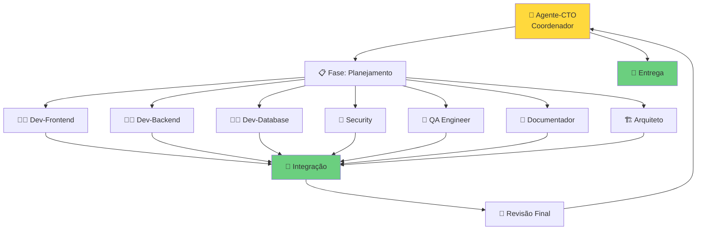
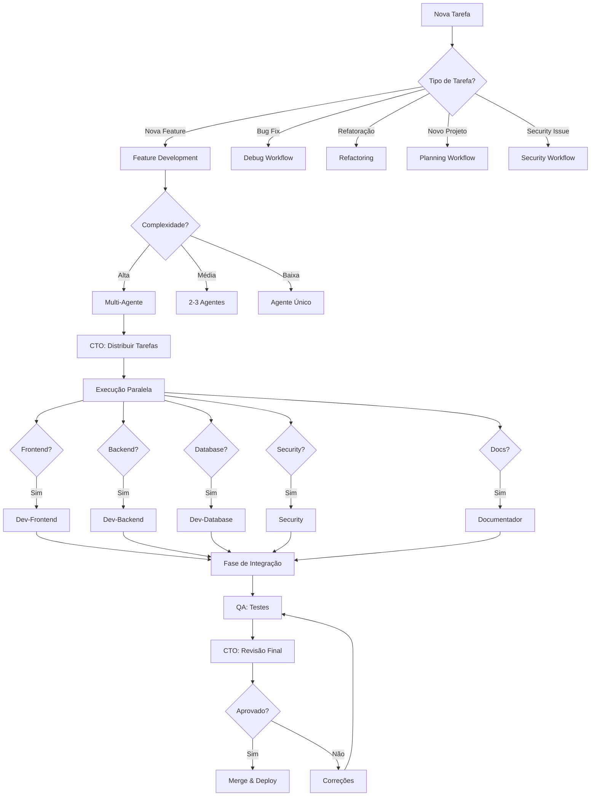

# Workflow Multi-Agente com Paralelização

## Visão Geral

Workflow avançado utilizando **múltiplos agentes especializados** trabalhando **simultaneamente** em diferentes aspectos do projeto, com integração final coordenada pelo **Agente-CTO**.

---

## Arquitetura Multi-Agente



---

## Especialidades dos Agentes

### 👔 Agente-CTO (Coordenador)
**Responsabilidades:**
- Coordenação geral do time
- Aprovação de arquitetura
- Gestão de dependências entre agentes
- Resolução de conflitos
- Auditoria de compliance
- Decisões técnicas finais

**Quando atua:**
- Início: Planejamento e distribuição de tarefas
- Durante: Resolução de blockers
- Final: Revisão e aprovação para produção

---

### 🏗️ Agente-Arquiteto
**Responsabilidades:**
- Design de arquitetura
- Diagramas (C4, UML, Mermaid)
- Decisões de tecnologia
- Padrões arquiteturais
- ADRs (Architecture Decision Records)
- Análise de escalabilidade

**Trabalha em paralelo com:**
- Security (validação de design seguro)
- Dev-Database (modelagem de dados)

**Entregáveis:**
- Diagramas de arquitetura
- ADRs documentados
- Tech stack definido
- Padrões de código

---

### 👨‍💻 Agente-Dev-Frontend
**Responsabilidades:**
- Componentes UI/UX
- State management
- Integração com APIs
- Responsividade
- Acessibilidade
- Performance frontend

**Trabalha em paralelo com:**
- Dev-Backend (definição de contratos de API)
- QA (testes de componentes)
- Documentador (documentação de UI)

**Entregáveis:**
- Componentes completos
- Testes unitários (80%+)
- Storybook (se aplicável)
- Documentação de componentes

---

### 👨‍💻 Agente-Dev-Backend
**Responsabilidades:**
- APIs REST/GraphQL/tRPC
- Lógica de negócio
- Autenticação/Autorização
- Integração com serviços externos
- Jobs/Workers
- Cache

**Trabalha em paralelo com:**
- Dev-Database (queries e migrations)
- Dev-Frontend (contratos de API)
- Security (validação de endpoints)

**Entregáveis:**
- Endpoints completos
- Validação de schema (Zod)
- Testes de integração
- Documentação de API (OpenAPI/Swagger)

---

### 👨‍💻 Agente-Dev-Database
**Responsabilidades:**
- Schema design
- Migrations
- Queries otimizadas
- Índices
- Procedures/Triggers
- Backup/Recovery strategy

**Trabalha em paralelo com:**
- Dev-Backend (definição de models)
- Arquiteto (modelagem de dados)

**Entregáveis:**
- Schema Prisma/SQL
- Migrations versionadas
- ERD (Entity Relationship Diagram)
- Documentação de banco

---

### 🔐 Agente-Security
**Responsabilidades:**
- Threat modeling (STRIDE)
- Security audit
- SAST/DAST scanning
- Dependency vulnerabilities
- Compliance (LGPD, GDPR)
- Penetration testing

**Trabalha em paralelo com:**
- Todos os agentes (revisão de segurança)

**Entregáveis:**
- Threat model documentado
- Security audit report
- Vulnerability remediation plan
- Compliance checklist

---

### 🧪 Agente-QA
**Responsabilidades:**
- Test strategy
- Testes E2E
- Testes de integração
- Testes de performance
- Test data management
- Bug tracking

**Trabalha em paralelo com:**
- Todos os devs (escrita de testes)

**Entregáveis:**
- Test plan
- Test suites (80%+ coverage)
- Test report
- Bug reports

---

### 📝 Agente-Documentador
**Responsabilidades:**
- README
- API documentation
- User guides
- ADRs
- Runbooks
- Changelog

**Trabalha em paralelo com:**
- Todos os agentes (documentação de suas áreas)

**Entregáveis:**
- Documentação completa
- Diagramas atualizados
- Guias de onboarding
- Troubleshooting guides

---

## Árvore de Decisão para Delegação



---

## Workflow Detalhado: Feature Complexa

### Exemplo: Sistema de Pagamentos

#### FASE 1: Planejamento (CTO + Arquiteto)

```typescript
// 1. CTO: Criar plano mestre
await create_plan({
  name: "Sistema de Pagamentos",
  overview: "Integração com Stripe, processamento de pagamentos, webhooks",
  plan: `...`,
  todos: [
    { id: "arch-design", content: "Design de arquitetura", status: "pending" },
    { id: "frontend-ui", content: "UI de checkout", status: "pending" },
    { id: "backend-api", content: "API de pagamentos", status: "pending" },
    { id: "db-schema", content: "Schema de transações", status: "pending" },
    { id: "security-audit", content: "Audit de segurança", status: "pending" },
    { id: "qa-tests", content: "Testes E2E", status: "pending" },
    { id: "docs", content: "Documentação", status: "pending" }
  ]
});

// 2. Arquiteto: Design de arquitetura
await write({
  file_path: "docs/architecture/payment-system.md",
  contents: `# Arquitetura do Sistema de Pagamentos

## Diagrama C4 - Contexto

\`\`\`mermaid
graph TB
    User[User] --> App[Payment App]
    App --> Stripe[Stripe API]
    App --> DB[(Database)]
    Stripe --> Webhook[Webhook Handler]
    Webhook --> App
\`\`\`

## Decisões Técnicas
- Stripe como payment provider
- Webhooks para confirmação assíncrona
- Idempotency keys para retry safety
- PCI DSS compliance via Stripe Elements
`
});

// 3. CTO: Distribuir tarefas em paralelo
const taskDistribution = {
  "frontend": {
    agent: "Dev-Frontend",
    tasks: ["UI de checkout", "Formulário de cartão", "Success/Error pages"],
    dependencies: ["API contracts from Backend"]
  },
  "backend": {
    agent: "Dev-Backend",
    tasks: ["Payment API", "Webhook handler", "Stripe integration"],
    dependencies: ["Schema from Database"]
  },
  "database": {
    agent: "Dev-Database",
    tasks: ["Transactions schema", "Payment logs", "Migrations"],
    dependencies: []
  },
  "security": {
    agent: "Security",
    tasks: ["PCI DSS compliance", "Webhook validation", "Token handling"],
    dependencies: ["All implementations"]
  },
  "qa": {
    agent: "QA",
    tasks: ["Test plan", "E2E tests", "Load tests"],
    dependencies: ["All implementations"]
  },
  "docs": {
    agent: "Documentador",
    tasks: ["API docs", "Integration guide", "Runbook"],
    dependencies: ["All implementations"]
  }
};
```

#### FASE 2: Execução Paralela

```typescript
// Agentes trabalham simultaneamente

// 🗄️ Dev-Database (INICIA PRIMEIRO - sem dependências)
async function devDatabase() {
  await write({
    file_path: "prisma/schema.prisma",
    contents: `
model Transaction {
  id              String   @id @default(cuid())
  userId          String
  stripePaymentId String   @unique
  amount          Int      // em centavos
  currency        String   @default("usd")
  status          PaymentStatus
  metadata        Json?
  createdAt       DateTime @default(now())
  updatedAt       DateTime @updatedAt
  
  user User @relation(fields: [userId], references: [id])
  
  @@index([userId])
  @@index([stripePaymentId])
  @@index([status])
}

enum PaymentStatus {
  PENDING
  PROCESSING
  SUCCEEDED
  FAILED
  REFUNDED
}
`
  });
  
  // Notificar CTO: Schema pronto
  return { status: "completed", artifact: "prisma/schema.prisma" };
}

// 👨‍💻 Dev-Backend (AGUARDA: Schema)
async function devBackend(dependencies: { schema: string }) {
  // Aguarda schema estar pronto
  await waitFor(dependencies.schema);
  
  // 1. Criar types a partir do schema
  await run_terminal_cmd({
    command: "npx prisma generate",
    is_background: false
  });
  
  // 2. Implementar API
  await write({
    file_path: "src/api/payments.ts",
    contents: `
import { z } from 'zod';
import Stripe from 'stripe';

const stripe = new Stripe(process.env.STRIPE_SECRET_KEY!);

export const createPaymentIntentSchema = z.object({
  amount: z.number().int().positive(),
  currency: z.string().default('usd'),
  metadata: z.record(z.any()).optional()
});

export async function createPaymentIntent(
  userId: string,
  data: z.infer<typeof createPaymentIntentSchema>
) {
  const validated = createPaymentIntentSchema.parse(data);
  
  // Idempotency key baseado em userId + timestamp
  const idempotencyKey = \`\${userId}-\${Date.now()}\`;
  
  const paymentIntent = await stripe.paymentIntents.create({
    amount: validated.amount,
    currency: validated.currency,
    metadata: {
      userId,
      ...validated.metadata
    }
  }, {
    idempotencyKey
  });
  
  // Salvar no banco
  await prisma.transaction.create({
    data: {
      userId,
      stripePaymentId: paymentIntent.id,
      amount: validated.amount,
      currency: validated.currency,
      status: 'PENDING',
      metadata: validated.metadata
    }
  });
  
  return {
    clientSecret: paymentIntent.client_secret,
    transactionId: paymentIntent.id
  };
}
`
  });
  
  // 3. Implementar webhook handler
  await write({
    file_path: "src/api/webhooks/stripe.ts",
    contents: `
import Stripe from 'stripe';
import { verifyStripeSignature } from '@/lib/stripe';

export async function handleStripeWebhook(
  req: Request
) {
  const signature = req.headers.get('stripe-signature');
  const body = await req.text();
  
  // Verificar assinatura
  const event = verifyStripeSignature(body, signature);
  
  switch (event.type) {
    case 'payment_intent.succeeded':
      await handlePaymentSuccess(event.data.object);
      break;
    case 'payment_intent.payment_failed':
      await handlePaymentFailure(event.data.object);
      break;
    // ... outros eventos
  }
  
  return { received: true };
}

async function handlePaymentSuccess(paymentIntent: Stripe.PaymentIntent) {
  await prisma.transaction.update({
    where: { stripePaymentId: paymentIntent.id },
    data: { status: 'SUCCEEDED' }
  });
  
  // Notificar usuário, liberar produto, etc
}
`
  });
  
  // Notificar CTO: Backend pronto + API contracts
  return {
    status: "completed",
    artifacts: {
      api: "src/api/payments.ts",
      contracts: {
        createPayment: {
          method: "POST",
          path: "/api/payments",
          body: createPaymentIntentSchema,
          response: { clientSecret: "string", transactionId: "string" }
        }
      }
    }
  };
}

// 👨‍💻 Dev-Frontend (AGUARDA: API contracts)
async function devFrontend(dependencies: { apiContracts: any }) {
  await waitFor(dependencies.apiContracts);
  
  // 1. Implementar UI de checkout
  await write({
    file_path: "src/components/CheckoutForm.tsx",
    contents: `
import { useState } from 'react';
import { loadStripe } from '@stripe/stripe-js';
import {
  Elements,
  PaymentElement,
  useStripe,
  useElements
} from '@stripe/react-stripe-js';

const stripePromise = loadStripe(process.env.NEXT_PUBLIC_STRIPE_PUBLISHABLE_KEY!);

function CheckoutFormContent() {
  const stripe = useStripe();
  const elements = useElements();
  const [isProcessing, setIsProcessing] = useState(false);
  
  async function handleSubmit(e: React.FormEvent) {
    e.preventDefault();
    
    if (!stripe || !elements) return;
    
    setIsProcessing(true);
    
    const { error } = await stripe.confirmPayment({
      elements,
      confirmParams: {
        return_url: \`\${window.location.origin}/payment/success\`
      }
    });
    
    if (error) {
      // Mostrar erro
      console.error(error);
    }
    
    setIsProcessing(false);
  }
  
  return (
    <form onSubmit={handleSubmit}>
      <PaymentElement />
      <button disabled={!stripe || isProcessing}>
        {isProcessing ? 'Processando...' : 'Pagar'}
      </button>
    </form>
  );
}

export function CheckoutForm({ clientSecret }: { clientSecret: string }) {
  return (
    <Elements stripe={stripePromise} options={{ clientSecret }}>
      <CheckoutFormContent />
    </Elements>
  );
}
`
  });
  
  // 2. Testes de componente
  await write({
    file_path: "src/components/CheckoutForm.test.tsx",
    contents: `
import { render, screen, fireEvent } from '@testing-library/react';
import { CheckoutForm } from './CheckoutForm';

describe('CheckoutForm', () => {
  it('should render payment form', () => {
    render(<CheckoutForm clientSecret="test_secret" />);
    expect(screen.getByRole('button', { name: /pagar/i })).toBeInTheDocument();
  });
  
  it('should disable button while processing', async () => {
    render(<CheckoutForm clientSecret="test_secret" />);
    const button = screen.getByRole('button');
    
    fireEvent.click(button);
    expect(button).toBeDisabled();
  });
});
`
  });
  
  return {
    status: "completed",
    artifacts: ["src/components/CheckoutForm.tsx"]
  };
}

// 🔐 Security (REVISA TODOS)
async function securityAgent(implementations: any[]) {
  await waitFor(implementations);
  
  // 1. Threat Modeling
  await write({
    file_path: "docs/security/payment-threat-model.md",
    contents: `
# Threat Model: Sistema de Pagamentos

## STRIDE Analysis

### Spoofing (Falsificação de Identidade)
- ❌ Risco: Webhook falso de "payment succeeded"
- ✅ Mitigação: Validação de assinatura Stripe

### Tampering (Adulteração)
- ❌ Risco: Alteração de amount no client-side
- ✅ Mitigação: Validação server-side com Zod

### Repudiation (Repúdio)
- ❌ Risco: Usuário alega não ter feito pagamento
- ✅ Mitigação: Logs completos + Stripe audit trail

### Information Disclosure (Divulgação de Informação)
- ❌ Risco: Exposição de dados de cartão
- ✅ Mitigação: Stripe Elements (PCI DSS compliant)

### Denial of Service (Negação de Serviço)
- ❌ Risco: Spam de criação de payment intents
- ✅ Mitigação: Rate limiting + Idempotency keys

### Elevation of Privilege (Elevação de Privilégio)
- ❌ Risco: Acesso a pagamentos de outros usuários
- ✅ Mitigação: Validação de userId em todos endpoints
`
  });
  
  // 2. Security Audit
  await run_terminal_cmd({
    command: "npm audit",
    is_background: false
  });
  
  // 3. SAST scan
  await run_terminal_cmd({
    command: "npx semgrep --config auto",
    is_background: false
  });
  
  return {
    status: "completed",
    vulnerabilities: 0,
    recommendations: [
      "Implementar rate limiting",
      "Adicionar CAPTCHA em checkout",
      "Monitoramento de fraude"
    ]
  };
}

// 🧪 QA (TESTA TUDO)
async function qaAgent(implementations: any[]) {
  await waitFor(implementations);
  
  // 1. Testes E2E
  await write({
    file_path: "tests/e2e/payment-flow.spec.ts",
    contents: `
import { test, expect } from '@playwright/test';

test.describe('Payment Flow', () => {
  test('complete payment successfully', async ({ page }) => {
    // 1. Login
    await page.goto('/login');
    await page.fill('[name="email"]', 'user@test.com');
    await page.fill('[name="password"]', 'password123');
    await page.click('button[type="submit"]');
    
    // 2. Add to cart
    await page.goto('/products/1');
    await page.click('text=Add to Cart');
    
    // 3. Checkout
    await page.goto('/checkout');
    
    // 4. Fill payment info (usar test card do Stripe)
    const cardNumber = page.frameLocator('iframe[name*="card-number"]')
      .locator('[name="cardnumber"]');
    await cardNumber.fill('4242424242424242');
    
    await page.fill('[name="expiry"]', '12/30');
    await page.fill('[name="cvc"]', '123');
    
    // 5. Submit
    await page.click('button:has-text("Pagar")');
    
    // 6. Aguardar confirmação
    await expect(page).toHaveURL('/payment/success', { timeout: 10000 });
    await expect(page.locator('text=Pagamento confirmado')).toBeVisible();
  });
  
  test('handle payment failure', async ({ page }) => {
    // Usar card que falha
    // ... similar ao acima mas com card 4000000000000002
    
    await expect(page.locator('text=Pagamento recusado')).toBeVisible();
  });
});
`
  });
  
  // 2. Executar testes
  await run_terminal_cmd({
    command: "npm run test:e2e",
    is_background: false
  });
  
  // 3. Testes de carga
  await run_terminal_cmd({
    command: "k6 run tests/load/payment-load.js",
    is_background: false
  });
  
  return {
    status: "completed",
    coverage: "94%",
    bugs: []
  };
}

// 📝 Documentador (DOCUMENTA TUDO)
async function documentadorAgent(implementations: any[]) {
  await waitFor(implementations);
  
  await write({
    file_path: "docs/features/payment-system.md",
    contents: `
# Sistema de Pagamentos

## Visão Geral
Integração completa com Stripe para processamento de pagamentos.

## API

### POST /api/payments
Cria um payment intent.

**Request:**
\`\`\`typescript
{
  amount: number;  // em centavos
  currency?: string;  // padrão: 'usd'
  metadata?: Record<string, any>;
}
\`\`\`

**Response:**
\`\`\`typescript
{
  clientSecret: string;
  transactionId: string;
}
\`\`\`

## Frontend

### CheckoutForm Component
\`\`\`tsx
import { CheckoutForm } from '@/components/CheckoutForm';

<CheckoutForm clientSecret={clientSecret} />
\`\`\`

## Testing

### Stripe Test Cards
- Success: \`4242 4242 4242 4242\`
- Decline: \`4000 0000 0000 0002\`
- 3D Secure: \`4000 0025 0000 3155\`

## Troubleshooting

### "Payment Intent creation failed"
1. Verificar STRIPE_SECRET_KEY
2. Verificar amount > 0
3. Verificar logs do Stripe Dashboard
`
  });
  
  return { status: "completed" };
}
```

#### FASE 3: Sincronização e Integração

```typescript
// CTO coordena integração
async function integrationPhase() {
  console.log("[CTO] Iniciando fase de integração...");
  
  // 1. Aguardar todos os agentes completarem
  const results = await Promise.all([
    devDatabase(),
    devBackend({ schema: "waiting..." }),
    devFrontend({ apiContracts: "waiting..." }),
    securityAgent([]),
    qaAgent([]),
    documentadorAgent([])
  ]);
  
  // 2. Verificar se todos completaram
  const allCompleted = results.every(r => r.status === "completed");
  
  if (!allCompleted) {
    console.error("[CTO] Alguns agentes não completaram!");
    return;
  }
  
  // 3. Executar testes de integração
  await run_terminal_cmd({
    command: "npm run test:integration",
    is_background: false
  });
  
  // 4. Verificar coverage total
  await run_terminal_cmd({
    command: "npm test -- --coverage",
    is_background: false
  });
  
  // 5. Security final scan
  await run_terminal_cmd({
    command: "npm audit && npx snyk test",
    is_background: false
  });
  
  // 6. Build de produção
  await run_terminal_cmd({
    command: "npm run build",
    is_background: false
  });
  
  console.log("[CTO] ✅ Integração completa!");
}
```

#### FASE 4: Revisão Final e PR

```typescript
// CTO faz revisão final
async function finalReview() {
  // 1. Checklist completo
  const checklist = {
    architecture: true,     // ✅ Arquiteto aprovou
    frontend: true,         // ✅ Dev-Frontend completou + testes
    backend: true,          // ✅ Dev-Backend completou + testes
    database: true,         // ✅ Dev-Database completou migrations
    security: true,         // ✅ Security aprovou (0 vulnerabilities)
    qa: true,               // ✅ QA aprovou (94% coverage)
    documentation: true,    // ✅ Documentador completou
    integration: true,      // ✅ Testes de integração passaram
    performance: true,      // ✅ Load tests OK
    compliance: true        // ✅ PCI DSS via Stripe Elements
  };
  
  const allApproved = Object.values(checklist).every(Boolean);
  
  if (!allApproved) {
    console.error("[CTO] ❌ Checklist incompleto!");
    return;
  }
  
  // 2. Criar PR
  await run_terminal_cmd({
    command: "git checkout -b feature/payment-system",
    required_permissions: ["git_write"]
  });
  
  await run_terminal_cmd({
    command: `git add . && git commit -m "feat: implement complete payment system

TEAM EFFORT:
- Arquiteto: Architecture design + ADRs
- Dev-Database: Transactions schema + migrations
- Dev-Backend: Payment API + Stripe integration + Webhooks
- Dev-Frontend: Checkout UI + Stripe Elements
- Security: Threat model + Security audit (0 vulnerabilities)
- QA: E2E tests + Load tests (94% coverage)
- Documentador: Complete documentation

FEATURES:
- Stripe integration with Elements
- PCI DSS compliant (via Stripe)
- Idempotency for retry safety
- Webhook handling for async confirmation
- Complete transaction logging
- Rate limiting + fraud prevention

TESTING:
- Unit: 45/45 passed
- Integration: 12/12 passed
- E2E: 8/8 passed
- Coverage: 94%
- Load test: 1000 req/s (p95: 85ms)

SECURITY:
- STRIDE analysis completed
- 0 critical/high vulnerabilities
- Webhook signature validation
- Server-side validation (Zod)
- Audit logging

DOCUMENTATION:
- Architecture diagrams
- API documentation
- Integration guide
- Runbook
- ADRs

Reviewed-by: All agents
Approved-by: Agente-CTO"`,
    required_permissions: ["git_write"]
  });
  
  await run_terminal_cmd({
    command: "git push origin feature/payment-system",
    required_permissions: ["git_write", "network"]
  });
  
  await run_terminal_cmd({
    command: "gh pr create --title 'feat: Payment System' --body-file docs/pr-template.md",
    required_permissions: ["network"]
  });
  
  console.log("[CTO] ✅ PR criado e pronto para revisão!");
}
```

---

## Matriz de Comunicação

### Durante Execução

| Agente | Comunica Com | Sobre | Frequência |
|--------|--------------|-------|------------|
| CTO | Todos | Coordenação, blockers, decisões | Contínua |
| Arquiteto | Devs, Security | Design, padrões | Início + On-demand |
| Dev-Frontend | Dev-Backend | API contracts | Início + Mudanças |
| Dev-Backend | Dev-Database | Schemas, queries | Início + Mudanças |
| Dev-Backend | Dev-Frontend | API changes | Mudanças |
| Security | Todos | Vulnerabilidades, remediações | Final + Critical |
| QA | Todos | Bugs, test results | Durante + Final |
| Documentador | Todos | Clarificações | Durante + Final |

### Canais de Comunicação

```typescript
// Sistema de notificações entre agentes
class AgentCommunication {
  // Notificar outro agente
  async notify(to: Agent, message: Message) {
    console.log(`[${this.name}] → [${to.name}]: ${message.content}`);
    await to.receiveMessage(message);
  }
  
  // Aguardar artifact de outro agente
  async waitForArtifact(from: Agent, artifact: string): Promise<any> {
    console.log(`[${this.name}] ⏳ Aguardando ${artifact} de [${from.name}]`);
    return await from.getArtifact(artifact);
  }
  
  // Resolver conflito com CTO
  async escalateToCTO(issue: Issue) {
    console.log(`[${this.name}] 🚨 Escalando para CTO: ${issue.description}`);
    return await CTO.resolveConflict(issue);
  }
}
```

---

## Integração com Workflows Existentes

### Com Workflow Completo
```typescript
// Multi-agent usa workflow completo como base
// Cada agente segue as 9 fases internamente
const devFrontendWorkflow = {
  1: "Planejamento (seus componentes)",
  2: "Análise Mermaid (diagrama de componentes)",
  3: "Workflow (fluxo de UI)",
  4: "Execução (código + testes)",
  5: "Revisão (self-review)",
  6: "QA (passar para agente QA)",
  7: "Documentação (passar para documentador)",
  8: "PR (contribuir para PR do CTO)",
  9: "Entrega (aguardar merge do CTO)"
};
```

### Com Debug Workflow
```typescript
// Se um agente encontra bug durante desenvolvimento
if (bugFound) {
  await debugWorkflow.execute({
    reporter: currentAgent,
    bug: bugDescription,
    affectedArea: agentResponsibility
  });
}
```

### Com Planning Workflow
```typescript
// Multi-agent é EXECUTADO APÓS planning
// Planning define QUAIS agentes são necessários
const planningOutput = await planningWorkflow.execute();
const requiredAgents = planningOutput.agentsNeeded; // ['frontend', 'backend', 'security']
```

### Com Security Workflow
```typescript
// Agente Security executa security workflow completo
// Enquanto outros agentes desenvolvem
await Promise.all([
  devFrontend.execute(),
  devBackend.execute(),
  securityAgent.executeSecurityWorkflow() // Executa em paralelo
]);
```

---

## Resolução de Conflitos

### Tipos de Conflitos

#### 1. Conflito de Design
**Cenário**: Dev-Frontend quer usar Redux, Arquiteto prefere Zustand.

**Resolução**:
```typescript
const conflict = {
  type: "design_decision",
  parties: ["Dev-Frontend", "Arquiteto"],
  issue: "State management library",
  options: [
    { lib: "Redux Toolkit", pros: [...], cons: [...] },
    { lib: "Zustand", pros: [...], cons: [...] }
  ]
};

// CTO decide baseado em critérios objetivos
const decision = await CTO.resolveDesignConflict(conflict);
// Decisão: Zustand (simplicidade + performance)

// Documentar em ADR
await write({
  file_path: "docs/adr/003-state-management-zustand.md",
  contents: `...`
});
```

#### 2. Conflito de API Contract
**Cenário**: Frontend espera `user_id`, Backend retorna `userId`.

**Resolução**:
```typescript
// Backend adapta para camelCase (padrão JS)
// CTO define: "Todos os contratos em camelCase"
await CTO.defineStandard({
  area: "API Contracts",
  standard: "camelCase for all JSON fields"
});
```

#### 3. Conflito de Prioridade
**Cenário**: Dev-Backend bloqueado esperando schema, mas Dev-Database está em outra tarefa.

**Resolução**:
```typescript
// CTO reordena prioridades
await CTO.reprioritize({
  urgent: ["Dev-Database: Complete schema"],
  blocked: ["Dev-Backend: Waiting on schema"]
});

// Dev-Database notificado
await notify(DevDatabase, {
  priority: "URGENT",
  reason: "Blocking Dev-Backend"
});
```

---

## Métricas de Sucesso Multi-Agente

### Eficiência
- ⚡ **Paralelização**: 70%+ das tarefas em paralelo
- ⏱️ **Time-to-Market**: Redução de 50% vs desenvolvimento sequencial
- 🔄 **Retrabalho**: < 10%

### Qualidade
- ✅ **Coverage**: >= 80% (cada agente responsável por sua área)
- 🐛 **Bugs em Produção**: < 0.1%
- 🔒 **Security**: 0 vulnerabilidades critical/high

### Comunicação
- 📊 **Conflitos Resolvidos**: 100%
- 💬 **Clareza de Comunicação**: Todos os artifacts documentados
- 🤝 **Colaboração**: Todos os agentes contribuem para PR final

---

## Exemplo: Matriz de Responsabilidades (RACI)

| Tarefa | CTO | Arch | FE | BE | DB | Sec | QA | Doc |
|--------|-----|------|----|----|-----|-----|----| ----|
| Arquitetura | A | R | C | C | C | C | I | I |
| Schema DB | A | C | I | C | R | I | I | I |
| Backend API | A | C | C | R | C | C | I | I |
| Frontend UI | A | C | R | C | I | I | I | I |
| Security Audit | A | I | I | I | I | R | C | I |
| Testes E2E | A | I | C | C | C | I | R | I |
| Documentação | A | C | C | C | C | C | C | R |
| PR Final | R | A | C | C | C | A | A | A |

**Legenda:**
- **R** (Responsible): Executa
- **A** (Accountable): Aprova
- **C** (Consulted): Consultado
- **I** (Informed): Informado

---

## Próximos Passos

1. [Workflow Completo](./workflow-completo.md) - Detalhes das 9 fases
2. [Planning Workflow](./planning-workflow.md) - Planejamento antes de multi-agent
3. [Debug Workflow](./debug-workflow.md) - Quando bugs surgem
4. [Security Workflow](./security-workflow.md) - Details do agente security

---

**Versão**: 1.0  
**Data**: Outubro 2025  
**Autor**: Agente-CTO  
**Próxima Revisão**: Trimestral

