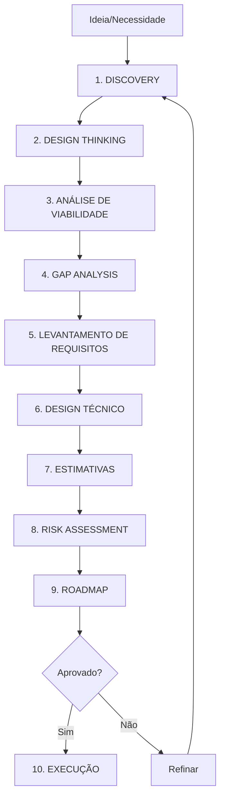
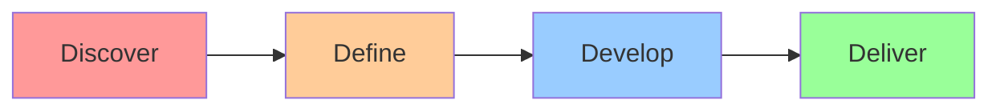

# Planning Workflow - Planejamento Completo de Projetos

## Visão Geral

Workflow completo para **planejamento de novos projetos, funcionalidades, módulos** incluindo **Discovery**, **Gap Analysis**, **Design Thinking**, **Viabilidade** e **Roadmap**.

---

## Fluxo Completo de Planejamento



---

## FASE 1: DISCOVERY (Descoberta)

### Objetivo
Entender profundamente o problema, contexto e necessidades.

### Framework: 5W2H

```typescript
await write({
  file_path: "docs/planning/01-discovery.md",
  contents: `# Discovery: [Nome do Projeto]

## Data: ${new Date().toISOString()}
## Facilitador: Agente-CTO

## 1. WHAT (O quê?)

### Problema a Resolver
[Descrever o problema atual de forma clara e objetiva]

**Exemplo:**
"Usuários não conseguem processar pagamentos recorrentes, causando perda de receita."

### Solução Proposta
[Descrever a solução de alto nível]

**Exemplo:**
"Implementar sistema de assinaturas com pagamentos recorrentes via Stripe."

## 2. WHY (Por quê?)

### Justificativa de Negócio
- **Problema atual**: [descrição]
- **Impacto**: [financeiro, operacional, UX]
- **Oportunidade**: [o que ganhamos resolvendo isso]

**Métricas Atuais:**
- Perda mensal: R$ XX.XXX
- Tempo gasto manualmente: XX horas/mês
- Satisfação do cliente: XX/10

**Métricas Esperadas Pós-Implementação:**
- Receita adicional: R$ XX.XXX/mês
- Redução de tempo: XX%
- Satisfação do cliente: 9/10

### Alinhamento Estratégico
- [ ] Alinhado com OKRs da empresa
- [ ] Prioridade: Alta / Média / Baixa
- [ ] Stakeholders: [listar]

## 3. WHO (Quem?)

### Stakeholders
| Nome | Papel | Interesse | Influência |
|------|-------|-----------|-----------|
| João Silva | Product Owner | Alto | Alto |
| Maria Santos | CFO | Médio | Alto |
| Tech Team | Desenvolvedores | Alto | Médio |
| End Users | Clientes | Alto | Baixo |

### Usuários Finais
- **Persona 1**: [Nome - Descrição]
  - Necessidades: [listar]
  - Pain points: [listar]
  - Comportamento atual: [descrever]

- **Persona 2**: [Nome - Descrição]
  - Necessidades: [listar]
  - Pain points: [listar]
  - Comportamento atual: [descrever]

## 4. WHERE (Onde?)

### Contexto de Uso
- **Plataforma**: Web / Mobile / Desktop
- **Ambiente**: Produção / Interno
- **Localização**: [Brasil / Global]
- **Dispositivos**: Desktop (70%), Mobile (30%)

### Integração com Sistemas Existentes
- Sistema A: [como interage]
- Sistema B: [como interage]
- Sistema C: [dependências]

## 5. WHEN (Quando?)

### Timeline
- **Início desejado**: [data]
- **Go-live esperado**: [data]
- **Milestones críticos**:
  - M1: [data] - [entregável]
  - M2: [data] - [entregável]
  - M3: [data] - [entregável]

### Sazonalidade / Restrições
- Black Friday: Alto volume
- Final de ano: Time reduzido
- Dependência externa: [detalhar]

## 6. HOW (Como?)

### Abordagem Preliminar
- **Metodologia**: Agile / Scrum / Kanban
- **Time**: [composição]
- **Ferramentas**: [listar]
- **Infraestrutura**: Cloud / On-premise

### Restrições Conhecidas
- **Técnicas**: [listar]
- **Orçamento**: R$ XX.XXX
- **Recursos**: X desenvolvedores
- **Regulatórias**: LGPD, PCI-DSS

## 7. HOW MUCH (Quanto?)

### Investimento Estimado (rough)
- **Desenvolvimento**: R$ XX.XXX
- **Infraestrutura**: R$ X.XXX/mês
- **Third-party**: R$ X.XXX/mês (Stripe)
- **Manutenção**: R$ X.XXX/mês
- **Total inicial**: R$ XXX.XXX

### ROI Esperado
- **Break-even**: X meses
- **ROI 12 meses**: XX%
- **LTV adicional**: R$ XXX por cliente

---

## Perguntas Chave Respondidas

1. **É realmente necessário?** ✅ Sim / ❌ Não
   - Justificativa: [...]

2. **Podemos fazer mais simples?** 
   - Alternativa MVP: [...]

3. **Existem soluções prontas?**
   - SaaS disponível: [pesquisar]
   - Build vs Buy analysis: [...]

4. **Timing é correto?**
   - Dependências: [listar]
   - Recursos disponíveis: [sim/não]

---

## Decisão

- [ ] Seguir para Design Thinking
- [ ] Refinar Discovery
- [ ] Rejeitar (não viável)

**Aprovado por**: [nome]  
**Data**: [data]
`
});
```

---

## FASE 2: DESIGN THINKING

### Metodologia: Double Diamond



### Implementação

```typescript
await write({
  file_path: "docs/planning/02-design-thinking.md",
  contents: `# Design Thinking: [Nome do Projeto]

## DISCOVER (Descobrir)

### Pesquisa com Usuários
- **Entrevistas**: [quantidade] usuários
- **Surveys**: [quantidade] respostas
- **Observação**: [contexto]

**Insights Principais:**
1. Usuários querem X porque Y
2. Principal frustração é Z
3. Alternativa atual é W (insatisfatória)

### Mapa de Empatia

\`\`\`
O que PENSA e SENTE?
┌─────────────────────┐
│ "Preciso pagar      │
│  facilmente"        │
│ "Tenho medo de      │
│  fraude"            │
└─────────────────────┘

O que VÊ?             O que ESCUTA?
┌──────────────┐     ┌──────────────┐
│ Concorrentes │     │ "Sistema X é │
│ com feature  │     │  mais fácil" │
└──────────────┘     └──────────────┘

O que DIZ e FAZ?      DOR           GANHO
┌──────────────┐     ┌─────────┐   ┌─────────┐
│ "Vou testar  │     │ Processo│   │ Economia│
│  depois"     │     │ manual  │   │ de tempo│
└──────────────┘     └─────────┘   └─────────┘
\`\`\`

## DEFINE (Definir)

### Problem Statement
"[Persona] precisa de [necessidade] porque [insight]"

**Exemplo:**
"Gerente de vendas precisa de sistema automatizado de cobrança porque perde 20h/mês em processo manual"

### How Might We (HMW)
- HMW automatizar cobrança sem perder controle?
- HMW garantir segurança nas transações?
- HMW facilitar cancelamento sem fricção?

## DEVELOP (Desenvolver)

### Brainstorming de Soluções
1. **Solução A**: Integração Stripe + UI simples
   - Pros: Rápido, seguro, confiável
   - Cons: Dependência externa

2. **Solução B**: Sistema próprio de pagamento
   - Pros: Controle total
   - Cons: PCI-DSS compliance complexo

3. **Solução C**: Multi-provider (Stripe + alternativas)
   - Pros: Resiliência
   - Cons: Complexidade

### Matriz de Decisão

| Solução | Viabilidade | Impacto | Custo | Prazo | SCORE |
|---------|-------------|---------|-------|-------|-------|
| A       | 9          | 8       | 7     | 9     | 8.25  |
| B       | 4          | 9       | 3     | 2     | 4.5   |
| C       | 6          | 9       | 5     | 4     | 6.0   |

**Solução Escolhida**: A (Stripe + UI simples)

## DELIVER (Entregar)

### Protótipo
- **Wireframes**: [link Figma]
- **User Flow**: [diagrama]
- **MVP features**: [listar]

### Testes de Usabilidade
- **Testadores**: 5 usuários
- **Taxa de sucesso**: 90%
- **Feedback**: [principais pontos]

---

## Aprovação

- [x] Problema bem definido
- [x] Solução validada com usuários
- [x] Protótipo testado
- [x] Próxima fase: Viabilidade
`
});
```

---

## FASE 3: ANÁLISE DE VIABILIDADE

### 4 Dimensões

```typescript
await write({
  file_path: "docs/planning/03-viabilidade.md",
  contents: `# Análise de Viabilidade

## 1. VIABILIDADE TÉCNICA

### Stack Tecnológico
- **Frontend**: React 18 + Next.js 14
  - ✅ Team tem expertise
  - ✅ Documentação robusta
  - ✅ Comunidade ativa

- **Backend**: Node.js + Prisma + PostgreSQL
  - ✅ Stack atual da empresa
  - ✅ Performance adequada
  - ⚠️ Precisa escalar (solução: clustering)

- **Payments**: Stripe API
  - ✅ PCI-DSS compliant
  - ✅ Webhooks confiáveis
  - ✅ Docs excelentes

### Complexidade Técnica
- **Score**: 6/10 (Média)
- **Riscos técnicos**:
  1. Webhooks podem ter delay (mitigação: retry + idempotency)
  2. Concorrência em pagamentos (mitigação: locking)

### Infraestrutura
- **Atual**: Vercel + Supabase
  - ✅ Suporta o projeto
  - ⚠️ Precisa upgrade de plano

### Recursos Humanos
- **Disponíveis**: 3 devs full-time
- **Necessários**: 2 devs (suficiente)
- **Expertise**: ✅ Adequada

**Conclusão Técnica**: ✅ VIÁVEL

## 2. VIABILIDADE FINANCEIRA

### Investimento Inicial
| Item | Custo | Frequência |
|------|-------|------------|
| Desenvolvimento | R$ 80.000 | One-time |
| Infraestrutura upgrade | R$ 2.000 | Mensal |
| Stripe fees | 2.9% + R$ 0.30 | Por transação |
| Monitoring | R$ 500 | Mensal |
| **TOTAL INICIAL** | **R$ 80.000** | - |
| **TOTAL MENSAL** | **R$ 2.500** | Fixo |

### Projeção de Receita
| Mês | Clientes | Receita | Custos | Lucro |
|-----|----------|---------|--------|-------|
| 1 | 10 | R$ 1.000 | R$ 2.500 | -R$ 1.500 |
| 3 | 50 | R$ 5.000 | R$ 2.500 | R$ 2.500 |
| 6 | 150 | R$ 15.000 | R$ 3.500 | R$ 11.500 |
| 12 | 400 | R$ 40.000 | R$ 5.000 | R$ 35.000 |

### Análise de ROI
- **Break-even**: Mês 7
- **ROI 12 meses**: 152%
- **Payback period**: 6.8 meses

**Conclusão Financeira**: ✅ VIÁVEL (bom ROI)

## 3. VIABILIDADE DE PRAZO

### Timeline Realista
- **Discovery + Design**: 2 semanas
- **Desenvolvimento**: 6 semanas
  - Sprint 1-2: Backend + Stripe
  - Sprint 3-4: Frontend + UX
  - Sprint 5-6: Testes + Refinamento
- **QA + Security**: 1 semana
- **Deploy + Monitoring**: 1 semana
- **TOTAL**: 10 semanas

### Análise de Prazo
- **Prazo do stakeholder**: 12 semanas
- **Prazo realista**: 10 semanas
- **Buffer**: 2 semanas (adequado)

**Conclusão de Prazo**: ✅ VIÁVEL

## 4. VIABILIDADE DE TIME

### Recursos Necessários
- **Dev Frontend**: 1 pessoa x 6 semanas
- **Dev Backend**: 1 pessoa x 6 semanas
- **Security**: 0.5 pessoa x 1 semana
- **QA**: 0.5 pessoa x 2 semanas
- **DevOps**: 0.25 pessoa x 2 semanas

### Disponibilidade
- **Frontend dev**: João (disponível)
- **Backend dev**: Maria (disponível)
- **Security**: External audit (contratar)
- **QA**: Team QA (disponível)

**Conclusão de Time**: ✅ VIÁVEL

---

## DECISÃO FINAL DE VIABILIDADE

| Dimensão | Status | Score | Blocker? |
|----------|--------|-------|----------|
| Técnica | ✅ Viável | 8/10 | Não |
| Financeira | ✅ Viável | 9/10 | Não |
| Prazo | ✅ Viável | 9/10 | Não |
| Time | ✅ Viável | 8/10 | Não |
| **OVERALL** | **✅ VIÁVEL** | **8.5/10** | **NÃO** |

**Recomendação**: ✅ Prosseguir para Gap Analysis
`
});
```

---

## FASE 4: GAP ANALYSIS

### Framework: Current State vs Desired State

```typescript
await write({
  file_path: "docs/planning/04-gap-analysis.md",
  contents: `# Gap Analysis: [Nome do Projeto]

## Estado Atual (AS-IS)

### Funcionalidades Existentes
| Feature | Status | Qualidade | Cobertura |
|---------|--------|-----------|-----------|
| Pagamento único | ✅ Existe | 7/10 | 100% |
| Checkout manual | ✅ Existe | 5/10 | 80% |
| Nota fiscal | ✅ Existe | 8/10 | 100% |
| **Pagamento recorrente** | ❌ Não existe | - | 0% |
| **Gestão de assinaturas** | ❌ Não existe | - | 0% |
| **Cancelamento automático** | ❌ Não existe | - | 0% |

### Processos Atuais
1. **Cobrança Manual** (20h/mês)
   - Admin gera boleto manualmente
   - Envia por email
   - Aguarda pagamento
   - Libera acesso manualmente

2. **Controle de Inadimplência** (10h/mês)
   - Planilha Excel
   - Follow-up manual
   - Bloqueio manual

### Pain Points
- ❌ Processo manual e suscetível a erros
- ❌ Delay de 2-3 dias para liberação
- ❌ Sem controle de churn
- ❌ Sem métricas automatizadas
- ❌ Experiência ruim do usuário

## Estado Desejado (TO-BE)

### Funcionalidades Necessárias
| Feature | Prioridade | Complexidade | Valor |
|---------|-----------|--------------|-------|
| Pagamento recorrente | P0 | Alta | Alto |
| Dashboard de assinaturas | P0 | Média | Alto |
| Cancelamento self-service | P1 | Baixa | Médio |
| Upgrade/Downgrade de plano | P1 | Média | Alto |
| Trial period | P2 | Média | Médio |
| Cupons de desconto | P2 | Baixa | Baixo |
| Nota fiscal automática | P3 | Alta | Médio |

### Processos Futuros
1. **Cobrança Automatizada** (0h/mês)
   - Stripe processa automaticamente
   - Webhook notifica sistema
   - Acesso liberado em segundos

2. **Gestão de Inadimplência** (1h/mês)
   - Retry automático (3 tentativas)
   - Email automático de aviso
   - Bloqueio automático após 7 dias
   - Dashboard de métricas

### Benefícios Esperados
- ✅ Economia de 29h/mês (R$ 5.800/mês)
- ✅ Experiência de usuário 9/10
- ✅ Redução de churn em 15%
- ✅ Métricas em tempo real

## Gaps Identificados

### GAPS CRÍTICOS (P0)

#### Gap 1: Pagamento Recorrente
- **Status Atual**: Não existe
- **Status Desejado**: Automático via Stripe
- **Impacto**: CRÍTICO
- **Esforço**: 3 semanas
- **Dependências**: Integração Stripe

#### Gap 2: Dashboard de Gestão
- **Status Atual**: Planilha Excel
- **Status Desejado**: Dashboard web real-time
- **Impacto**: ALTO
- **Esforço**: 2 semanas
- **Dependências**: Banco de dados + API

### GAPS IMPORTANTES (P1)

#### Gap 3: Cancelamento Self-Service
- **Status Atual**: Precisa chamar suporte
- **Status Desejado**: Botão na interface
- **Impacto**: MÉDIO
- **Esforço**: 1 semana

#### Gap 4: Upgrade/Downgrade
- **Status Atual**: Não existe
- **Status Desejado**: Mudança de plano instantânea
- **Impacto**: MÉDIO
- **Esforço**: 2 semanas

### GAPS DESEJÁVEIS (P2+)

#### Gap 5: Trial Period
- **Impacto**: BAIXO
- **Esforço**: 1 semana

#### Gap 6: Cupons
- **Impacto**: BAIXO
- **Esforço**: 1 semana

## Análise de Dependências

\`\`\`mermaid
graph TD
    A[Stripe Integration] --> B[Pagamento Recorrente]
    A --> C[Webhooks Handler]
    B --> D[Dashboard]
    C --> D
    D --> E[Cancelamento]
    D --> F[Upgrade/Downgrade]
    B --> G[Nota Fiscal Auto]
\`\`\`

## Priorização (MoSCoW)

### Must Have (MVP)
- Pagamento recorrente
- Dashboard básico
- Webhooks handler

### Should Have (V1)
- Cancelamento self-service
- Upgrade/Downgrade
- Retry automático

### Could Have (V2)
- Trial period
- Cupons de desconto

### Won't Have (Agora)
- Múltiplas moedas
- Pix recorrente
- Boleto recorrente

## Roadmap de Fechamento de Gaps

### Sprint 1-2: MVP (4 semanas)
- Integração Stripe
- Pagamento recorrente
- Webhooks

### Sprint 3-4: V1 (4 semanas)
- Dashboard
- Cancelamento
- Upgrade/Downgrade

### Sprint 5-6: V2 (4 semanas)
- Trial
- Cupons
- Refinamentos

---

## Aprovação

- [x] Gaps identificados e priorizados
- [x] Dependências mapeadas
- [x] Roadmap definido
- [x] Próxima fase: Requisitos Detalhados
`
});
```

---

## FASE 5: LEVANTAMENTO DE REQUISITOS

### Formato: User Stories + BDD

```typescript
await write({
  file_path: "docs/planning/05-requisitos.md",
  contents: `# Requisitos: Sistema de Assinaturas

## User Stories (MVP)

### US-001: Criar Assinatura
**Como** gerente de vendas  
**Quero** criar assinatura recorrente para cliente  
**Para** automatizar cobrança mensal

**Critérios de Aceite (BDD):**
\`\`\`gherkin
Feature: Criar Assinatura

Scenario: Criar assinatura com sucesso
  Given estou logado como admin
  And seleciono cliente "João Silva"
  When preencho plano "Pro" (R$ 99/mês)
  And clico em "Criar Assinatura"
  Then assinatura é criada no Stripe
  And cliente recebe email de confirmação
  And status é "active"

Scenario: Criar assinatura sem dados de pagamento
  Given cliente não tem cartão cadastrado
  When tento criar assinatura
  Then vejo mensagem "Cadastre forma de pagamento"
  And assinatura não é criada
\`\`\`

### US-002: Processar Pagamento Recorrente
**Como** sistema  
**Quero** processar pagamento automaticamente todo mês  
**Para** manter assinatura ativa

**Critérios de Aceite:**
\`\`\`gherkin
Feature: Pagamento Recorrente

Scenario: Pagamento bem-sucedido
  Given é dia de cobrança
  And cliente tem cartão válido
  When Stripe processa pagamento
  Then webhook "payment_succeeded" é recebido
  And status da assinatura permanece "active"
  And nota fiscal é emitida
  And cliente recebe email de confirmação

Scenario: Pagamento falhou
  Given é dia de cobrança
  And cartão está expirado
  When Stripe tenta processar
  Then webhook "payment_failed" é recebido
  And sistema agenda retry em 3 dias
  And cliente recebe email de falha
  And status muda para "past_due"

Scenario: Pagamento falhou após 3 tentativas
  Given é a 3ª tentativa de cobrança
  And pagamento falha novamente
  Then status muda para "canceled"
  And acesso do cliente é bloqueado
  And admin é notificado
\`\`\`

### US-003: Cancelar Assinatura
**Como** cliente  
**Quero** cancelar minha assinatura  
**Para** parar de ser cobrado

**Critérios de Aceite:**
\`\`\`gherkin
Feature: Cancelamento

Scenario: Cancelamento imediato
  Given tenho assinatura ativa
  When clico em "Cancelar Assinatura"
  And confirmo cancelamento
  Then assinatura é cancelada no Stripe
  And status muda para "canceled"
  And acesso permanece até fim do período pago
  And recebo email de confirmação

Scenario: Cancelamento com reembolso
  Given cancelei há menos de 7 dias
  When solicito reembolso
  Then valor proporcional é devolvido
  And acesso é bloqueado imediatamente
\`\`\`

## Requisitos Não-Funcionais

### Performance
- **RNF-001**: Webhook deve ser processado em < 2s (p95)
- **RNF-002**: Dashboard deve carregar em < 1s
- **RNF-003**: Sistema deve suportar 1000 assinaturas simultâneas

### Segurança
- **RNF-004**: Dados de cartão NUNCA armazenados (PCI-DSS)
- **RNF-005**: Webhooks devem validar assinatura Stripe
- **RNF-006**: Logs devem mascarar dados sensíveis

### Confiabilidade
- **RNF-007**: Retry automático de webhooks (3 tentativas)
- **RNF-008**: Idempotência em todas operações críticas
- **RNF-009**: Backup de transações diário

### Usabilidade
- **RNF-010**: Interface em português BR
- **RNF-011**: Responsiva (mobile + desktop)
- **RNF-012**: Acessibilidade WCAG 2.1 AA

### Compliance
- **RNF-013**: LGPD compliant (dados de pagamento)
- **RNF-014**: Nota fiscal automática (lei brasileira)
- **RNF-015**: Audit trail de todas transações

---

## Matriz de Rastreabilidade

| User Story | Requisitos Funcionais | Requisitos Não-Funcionais | Prioridade |
|------------|----------------------|---------------------------|------------|
| US-001 | RF-001, RF-002 | RNF-001, RNF-004, RNF-010 | P0 |
| US-002 | RF-003, RF-004, RF-005 | RNF-001, RNF-007, RNF-008 | P0 |
| US-003 | RF-006, RF-007 | RNF-002, RNF-010 | P1 |

## Aprovação

- [x] User stories completas com BDD
- [x] Requisitos não-funcionais definidos
- [x] Rastreabilidade garantida
- [x] Próxima fase: Design Técnico
`
});
```

---

## FASE 6: DESIGN TÉCNICO

```typescript
await write({
  file_path: "docs/planning/06-design-tecnico.md",
  contents: `# Design Técnico: Sistema de Assinaturas

## Arquitetura C4

### Nível 1: Contexto

\`\`\`mermaid
graph TB
    User[Cliente] --> App[Sistema de<br/>Assinaturas]
    Admin[Admin] --> App
    App --> Stripe[Stripe API]
    App --> DB[(Database)]
    Stripe --> Webhook[Webhook<br/>Handler]
    Webhook --> App
\`\`\`

### Nível 2: Containers

\`\`\`mermaid
graph TB
    subgraph Frontend
        UI[Next.js App]
    end
    
    subgraph Backend
        API[API REST]
        WH[Webhook Handler]
        Jobs[Background Jobs]
    end
    
    subgraph Data
        DB[(PostgreSQL)]
        Cache[(Redis)]
    end
    
    subgraph External
        Stripe[Stripe API]
    end
    
    UI --> API
    API --> DB
    API --> Cache
    API --> Stripe
    Stripe --> WH
    WH --> DB
    Jobs --> DB
    Jobs --> Stripe
\`\`\`

### Nível 3: Components (Backend)

\`\`\`mermaid
graph TD
    API[API Layer] --> Auth[Auth Middleware]
    API --> Valid[Validation Layer]
    Valid --> SubCtrl[Subscription Controller]
    SubCtrl --> SubSvc[Subscription Service]
    SubSvc --> Stripe[Stripe Service]
    SubSvc --> SubRepo[Subscription Repository]
    SubRepo --> Prisma[Prisma ORM]
\`\`\`

## Modelo de Dados

\`\`\`prisma
model User {
  id            String   @id @default(cuid())
  email         String   @unique
  stripeCustomerId String? @unique
  subscriptions Subscription[]
}

model Subscription {
  id                String   @id @default(cuid())
  userId            String
  stripeSubscriptionId String @unique
  stripePriceId     String
  status            SubscriptionStatus
  currentPeriodStart DateTime
  currentPeriodEnd  DateTime
  cancelAtPeriodEnd Boolean @default(false)
  createdAt         DateTime @default(now())
  updatedAt         DateTime @updatedAt
  
  user User @relation(fields: [userId], references: [id])
  invoices Invoice[]
  
  @@index([userId])
  @@index([status])
}

enum SubscriptionStatus {
  ACTIVE
  PAST_DUE
  CANCELED
  INCOMPLETE
  TRIALING
}

model Invoice {
  id              String   @id @default(cuid())
  subscriptionId  String
  stripeInvoiceId String   @unique
  amount          Int
  status          InvoiceStatus
  paidAt          DateTime?
  dueDate         DateTime
  createdAt       DateTime @default(now())
  
  subscription Subscription @relation(fields: [subscriptionId], references: [id])
  
  @@index([subscriptionId])
  @@index([status])
}

enum InvoiceStatus {
  DRAFT
  OPEN
  PAID
  VOID
  UNCOLLECTIBLE
}
\`\`\`

## APIs

### Endpoints REST

| Método | Endpoint | Descrição | Auth |
|--------|----------|-----------|------|
| POST | /api/subscriptions | Criar assinatura | Admin |
| GET | /api/subscriptions | Listar assinaturas | Admin |
| GET | /api/subscriptions/:id | Detalhes | User |
| PATCH | /api/subscriptions/:id | Atualizar plano | User |
| DELETE | /api/subscriptions/:id | Cancelar | User |
| POST | /api/webhooks/stripe | Webhook handler | Stripe |

### Exemplo de Implementação

\`\`\`typescript
// POST /api/subscriptions
export async function createSubscription(
  userId: string,
  priceId: string
) {
  // 1. Validação
  const schema = z.object({
    userId: z.string().cuid(),
    priceId: z.string().startsWith('price_')
  });
  
  const data = schema.parse({ userId, priceId });
  
  // 2. Buscar ou criar customer no Stripe
  let customer = await getStripeCustomer(userId);
  if (!customer) {
    customer = await createStripeCustomer(userId);
  }
  
  // 3. Criar subscription no Stripe
  const subscription = await stripe.subscriptions.create({
    customer: customer.id,
    items: [{ price: priceId }],
    payment_behavior: 'default_incomplete',
    expand: ['latest_invoice.payment_intent']
  });
  
  // 4. Salvar no banco
  await prisma.subscription.create({
    data: {
      userId,
      stripeSubscriptionId: subscription.id,
      stripePriceId: priceId,
      status: 'INCOMPLETE',
      currentPeriodStart: new Date(subscription.current_period_start * 1000),
      currentPeriodEnd: new Date(subscription.current_period_end * 1000)
    }
  });
  
  // 5. Retornar client secret para frontend
  return {
    subscriptionId: subscription.id,
    clientSecret: subscription.latest_invoice.payment_intent.client_secret
  };
}
\`\`\`

## Fluxo de Webhook

\`\`\`mermaid
sequenceDiagram
    participant S as Stripe
    participant W as Webhook Handler
    participant DB as Database
    participant E as Email Service
    
    S->>W: POST /webhooks/stripe
    W->>W: Verify signature
    W->>W: Parse event
    
    alt payment_succeeded
        W->>DB: Update status: ACTIVE
        W->>E: Send confirmation email
    else payment_failed
        W->>DB: Update status: PAST_DUE
        W->>E: Send failure email
        W->>DB: Schedule retry
    else customer.subscription.deleted
        W->>DB: Update status: CANCELED
        W->>E: Send cancellation email
    end
    
    W-->>S: 200 OK
\`\`\`

## Decisões Técnicas (ADR)

Ver: \`docs/adr/004-subscription-architecture.md\`

---

## Aprovação

- [x] Arquitetura C4 completa
- [x] Modelo de dados definido
- [x] APIs especificadas
- [x] Fluxos documentados
- [x] ADRs criados
- [x] Próxima fase: Estimativas
`
});
```

---

## FASE 7: ESTIMATIVAS

### Técnicas: Planning Poker + Story Points

\`\`\`typescript
await write({
  file_path: "docs/planning/07-estimativas.md",
  contents: \`# Estimativas: Sistema de Assinaturas

## Story Points

### Escala Fibonacci
1, 2, 3, 5, 8, 13, 21

### Calibração
- **1 point**: Tarefa trivial (< 2h)
- **2 points**: Tarefa simples (2-4h)
- **3 points**: Tarefa média (4-8h, 1 dia)
- **5 points**: Tarefa complexa (1-2 dias)
- **8 points**: Tarefa muito complexa (2-3 dias)
- **13 points**: Epic pequeno (1 semana)
- **21 points**: Precisa quebrar em tarefas menores

## Estimativas por User Story

| ID | User Story | Story Points | Horas | Dias |
|----|-----------|--------------|-------|------|
| US-001 | Criar assinatura | 5 | 12h | 1.5 |
| US-002 | Pagamento recorrente | 8 | 20h | 2.5 |
| US-003 | Webhook handler | 5 | 12h | 1.5 |
| US-004 | Dashboard | 8 | 20h | 2.5 |
| US-005 | Cancelamento | 3 | 8h | 1 |
| US-006 | Upgrade/Downgrade | 5 | 12h | 1.5 |
| **TOTAL MVP** | - | **34** | **84h** | **10.5 dias** |

## Buffer de Risco

| Risco | Probabilidade | Impacto | Buffer |
|-------|---------------|---------|--------|
| Stripe API changes | Baixo | Alto | +2 dias |
| Problemas de integração | Médio | Médio | +3 dias |
| Bugs complexos | Alto | Médio | +5 dias |
| **TOTAL BUFFER** | - | - | **+10 dias** |

## Timeline Final

- **Desenvolvimento puro**: 10.5 dias (2.1 semanas)
- **Buffer**: 10 dias (2 semanas)
- **QA + Testes**: 5 dias (1 semana)
- **Deploy + Docs**: 3 dias
- **TOTAL**: **28.5 dias = 5.7 semanas ≈ 6 semanas**

## Velocity do Time

- **Velocity média**: 15 story points/sprint (2 semanas)
- **Sprints necessários**: 34 ÷ 15 = 2.3 sprints
- **Timeline realista**: **3 sprints = 6 semanas** ✅

## Custo Estimado

### Desenvolvimento
| Recurso | Taxa/hora | Horas | Total |
|---------|-----------|-------|-------|
| Dev Senior | R$ 150 | 84h | R$ 12.600 |
| Dev Mid | R$ 100 | 84h | R$ 8.400 |
| QA | R$ 80 | 40h | R$ 3.200 |
| DevOps | R$ 120 | 16h | R$ 1.920 |
| **TOTAL DEV** | - | **224h** | **R$ 26.120** |

### Infraestrutura (anual)
| Item | Custo/mês | Anual |
|------|-----------|-------|
| Vercel Pro | R$ 100 | R$ 1.200 |
| Supabase Pro | R$ 150 | R$ 1.800 |
| Stripe fees | R$ 300 | R$ 3.600 |
| Monitoring | R$ 50 | R$ 600 |
| **TOTAL INFRA** | **R$ 600** | **R$ 7.200** |

### Investimento Total
- **One-time**: R$ 26.120
- **Recorrente (ano 1)**: R$ 7.200
- **TOTAL ANO 1**: **R$ 33.320**

## Aprovação

- [x] Estimativas validadas com time
- [x] Buffer adequado incluído
- [x] Custos aprovados
- [x] Próxima fase: Risk Assessment
\`
});
\`\`\`

---

## FASE 8: RISK ASSESSMENT

### Framework: Risk Matrix

\`\`\`typescript
await write({
  file_path: "docs/planning/08-risk-assessment.md",
  contents: \`# Risk Assessment

## Matriz de Riscos

| ID | Risco | Probabilidade | Impacto | Score | Mitigação |
|----|-------|---------------|---------|-------|-----------|
| R001 | Stripe API changes | Baixo (1) | Alto (4) | 4 | Monitorar changelog, testes |
| R002 | Webhooks perdidos | Médio (2) | Alto (4) | 8 | Retry mechanism |
| R003 | Performance issues | Médio (2) | Médio (3) | 6 | Load testing |
| R004 | Security breach | Baixo (1) | Crítico (5) | 5 | Security audit |
| R005 | Key developer leaves | Baixo (1) | Alto (4) | 4 | Documentação |
| R006 | Scope creep | Alto (3) | Médio (3) | 9 | Controle rígido |
| R007 | Integration delays | Médio (2) | Médio (3) | 6 | Buffer no timeline |

### Legenda
- **Probabilidade**: 1=Baixo, 2=Médio, 3=Alto
- **Impacto**: 1-2=Baixo, 3=Médio, 4=Alto, 5=Crítico
- **Score**: Probabilidade × Impacto

## Top 3 Riscos (Score >= 8)

### R006: Scope Creep (Score 9)
**Descrição**: Cliente solicita features não planejadas durante desenvolvimento

**Mitigação**:
- Contrato com escopo fechado
- Change request process formal
- Comunicação clara de impactos
- Buffer de 10% para ajustes menores

**Plano de Contingência**:
- Se scope aumentar >20%: renegociar timeline/custo
- Manter backlog de "nice-to-have" para v2

### R002: Webhooks Perdidos (Score 8)
**Descrição**: Stripe webhook não chega ou falha ao processar

**Mitigação**:
- Idempotency keys
- Retry mechanism (3 tentativas)
- Dead letter queue
- Monitoring e alertas

**Plano de Contingência**:
- Sync job diário para reconciliar
- Manual intervention process documentado

## Plano de Monitoramento

| Risco | Métrica | Alerta | Ação |
|-------|---------|--------|------|
| R002 | Webhook success rate | < 98% | Investigar |
| R003 | p95 latency | > 2s | Otimizar |
| R004 | Security events | > 0 | Audit |

## Aprovação

- [x] Riscos identificados e priorizados
- [x] Mitigações definidas
- [x] Contingências planejadas
- [x] Próxima fase: Roadmap
\`
});
\`\`\`

---

## FASE 9: ROADMAP

### Timeline Visual

\`\`\`typescript
await write({
  file_path: "docs/planning/09-roadmap.md",
  contents: \`# Roadmap: Sistema de Assinaturas

## Timeline Geral

\`\`\`mermaid
gantt
    title Roadmap de Implementação
    dateFormat YYYY-MM-DD
    
    section Discovery
    Discovery & Design Thinking    :done, disc, 2025-01-01, 2w
    Viabilidade & Gap Analysis      :done, viab, after disc, 1w
    
    section Planning
    Requisitos & Design Técnico     :active, plan, after viab, 1w
    Estimativas & Risks             :plan2, after plan, 3d
    
    section Development
    Sprint 1 - Stripe Integration   :sprint1, after plan2, 2w
    Sprint 2 - Webhooks & Jobs      :sprint2, after sprint1, 2w
    Sprint 3 - Dashboard & UI       :sprint3, after sprint2, 2w
    
    section QA
    Testing & Security Audit        :qa, after sprint3, 1w
    
    section Deploy
    Staging Deploy & Validation     :staging, after qa, 3d
    Production Deploy               :prod, after staging, 2d
    
    section Post-Launch
    Monitoring & Adjustments        :monitor, after prod, 1w
\`\`\`

## Milestones

### M1: Planning Complete (Semana 4)
- [x] Discovery
- [x] Design Thinking
- [x] Viabilidade
- [x] Gap Analysis
- [x] Requisitos
- [x] Design Técnico
- [x] Estimativas
- [x] Risks
- [x] Roadmap

**Entregável**: Documentação completa de planejamento  
**Aprovação**: Product Owner + CTO

### M2: MVP Backend (Semana 8)
- [ ] Stripe integration funcionando
- [ ] Webhook handler completo
- [ ] Background jobs
- [ ] Testes unitários (80%+)

**Entregável**: API REST funcional  
**Aprovação**: Tech Lead + QA

### M3: MVP Frontend (Semana 10)
- [ ] Dashboard de assinaturas
- [ ] Telas de pagamento
- [ ] Cancelamento
- [ ] Upgrade/Downgrade

**Entregável**: UI completa e integrada  
**Aprovação**: Product Owner + UX

### M4: Production Ready (Semana 11)
- [ ] Security audit aprovado
- [ ] Load tests passed
- [ ] Documentação completa
- [ ] Monitoring configurado

**Entregável**: Sistema pronto para produção  
**Aprovação**: CTO + Security

### M5: Go-Live (Semana 12)
- [ ] Deploy em produção
- [ ] Smoke tests passed
- [ ] Monitoring ativo
- [ ] Suporte preparado

**Entregável**: Sistema em produção  
**Aprovação**: Todos stakeholders

## Releases

### v0.1 (MVP) - Semana 10
**Features:**
- Criar assinatura
- Pagamento recorrente
- Webhook handler
- Dashboard básico

**Users**: Interno (beta)

### v1.0 (GA) - Semana 12
**Features MVP + :**
- Cancelamento
- Upgrade/Downgrade
- Retry automático
- Email notifications

**Users**: Todos os clientes

### v1.1 (Improvements) - Semana 16
**Features:**
- Trial period
- Cupons de desconto
- Relatórios avançados

**Users**: Todos os clientes

### v2.0 (Scale) - Semana 24
**Features:**
- Múltiplas moedas
- Pix recorrente
- API pública
- Webhooks customizáveis

**Users**: Todos + partners

## Critérios de Go/No-Go

### Go-Live em Produção

**DEVE ter (bloqueadores):**
- [x] Todos testes passed (unit, integration, e2e)
- [x] Security audit aprovado (0 critical/high)
- [x] Performance OK (p95 < 2s)
- [x] Monitoring e alertas configurados
- [x] Rollback plan testado
- [x] Documentação completa
- [x] Suporte treinado

**BOM ter (não bloqueadores):**
- [ ] Load test 10x traffic esperado
- [ ] Chaos engineering tests
- [ ] Multi-region deploy
- [ ] A/B testing infrastructure

**Aprovadores necessários:**
- [ ] CTO
- [ ] Security Lead
- [ ] Product Owner
- [ ] QA Lead

## Post-Launch

### Semana 1 pós-launch
- Daily standups
- Monitoring 24/7
- Hotfix capacity ready
- User feedback collection

### Semana 2-4 pós-launch
- Weekly retrospectives
- Bug fixing
- Minor improvements
- Documentation updates

### Mês 2-3 pós-launch
- Feature requests analysis
- v1.1 planning
- Performance optimization
- Scale preparation

## Success Metrics (OKRs)

### Objective 1: Adoção
- **KR1**: 100 assinaturas ativas em 30 dias
- **KR2**: 80% taxa de conversão trial → paid
- **KR3**: NPS >= 8/10

### Objective 2: Qualidade
- **KR1**: 0 bugs críticos em produção
- **KR2**: 99.9% uptime
- **KR3**: p95 latency < 2s

### Objective 3: Eficiência
- **KR1**: Reduzir 90% tempo manual
- **KR2**: ROI positivo em 6 meses
- **KR3**: 0 chargebacks

---

## Aprovação Final de Planning

### Checklist Completo

#### Discovery ✅
- [x] 5W2H respondido
- [x] Stakeholders mapeados
- [x] Problem statement claro

#### Design Thinking ✅
- [x] Pesquisa com usuários
- [x] Mapa de empatia
- [x] Protótipo validado

#### Viabilidade ✅
- [x] Técnica: Viável
- [x] Financeira: ROI 152%
- [x] Prazo: 10 semanas
- [x] Time: Disponível

#### Gap Analysis ✅
- [x] AS-IS mapeado
- [x] TO-BE definido
- [x] Gaps priorizados (MoSCoW)

#### Requisitos ✅
- [x] User stories com BDD
- [x] Requisitos não-funcionais
- [x] Rastreabilidade

#### Design Técnico ✅
- [x] Arquitetura C4
- [x] Modelo de dados
- [x] APIs especificadas
- [x] ADRs criados

#### Estimativas ✅
- [x] Story points definidos
- [x] Buffer de risco
- [x] Custos aprovados

#### Risks ✅
- [x] Riscos identificados
- [x] Mitigações definidas
- [x] Contingências planejadas

#### Roadmap ✅
- [x] Timeline definido
- [x] Milestones claros
- [x] Critérios de sucesso
- [x] OKRs definidos

### Aprovações

| Stakeholder | Papel | Status | Data |
|-------------|-------|--------|------|
| João Silva | Product Owner | ✅ Aprovado | 2025-01-XX |
| Maria Santos | CTO | ✅ Aprovado | 2025-01-XX |
| Pedro Costa | CFO | ✅ Aprovado | 2025-01-XX |
| Ana Lima | Security Lead | ✅ Aprovado | 2025-01-XX |

### Próximo Passo

✅ **PLANEJAMENTO COMPLETO**

Iniciar execução seguindo:
1. [Multi-Agent Workflow](./multi-agent-workflow.md) - Coordenação do time
2. [Workflow Completo](./workflow-completo.md) - 9 fases de desenvolvimento
3. [Security Workflow](./security-workflow.md) - Segurança contínua

---

**Status**: ✅ APROVADO PARA EXECUÇÃO  
**Investment**: R$ 33.320 (ano 1)  
**Timeline**: 12 semanas  
**ROI Esperado**: 152% (12 meses)  
**Risk Level**: BAIXO (mitigado)

**Versão**: 1.0  
**Data**: \${new Date().toISOString().split('T')[0]}  
**Responsável**: Agente-CTO
\`
});
\`\`\`

---

## Integração com Outros Workflows

### Depois de Planning → Multi-Agent
Planning define QUAIS agentes são necessários e suas responsabilidades.

### Depois de Planning → Workflow Completo
Cada agente segue as 9 fases obrigatórias.

### Durante Execução → Security Workflow
Agente-Security executa em paralelo.

### Se encontrar Bug → Debug Workflow
Root cause analysis e correção adequada.

---

## Checklist de Planning Completo

- [ ] FASE 1: Discovery (5W2H)
- [ ] FASE 2: Design Thinking (Double Diamond)
- [ ] FASE 3: Viabilidade (4 dimensões)
- [ ] FASE 4: Gap Analysis (AS-IS vs TO-BE)
- [ ] FASE 5: Requisitos (User Stories + BDD)
- [ ] FASE 6: Design Técnico (C4 + APIs)
- [ ] FASE 7: Estimativas (Story Points + Custo)
- [ ] FASE 8: Risk Assessment (Matriz de Riscos)
- [ ] FASE 9: Roadmap (Timeline + Milestones)
- [ ] Aprovações de todos stakeholders
- [ ] Documentação completa e versionada

---

**Versão**: 1.0  
**Data**: Outubro 2025  
**Autor**: Agente-CTO  
**Workflow Duration**: 3-4 semanas (planejamento)  
**Output**: Projeto 100% especificado e pronto para execução
