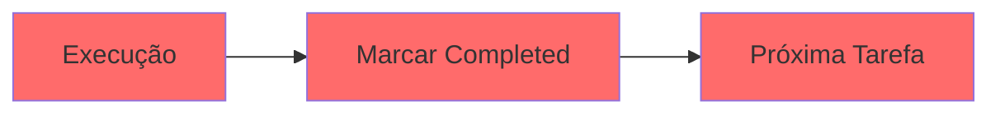
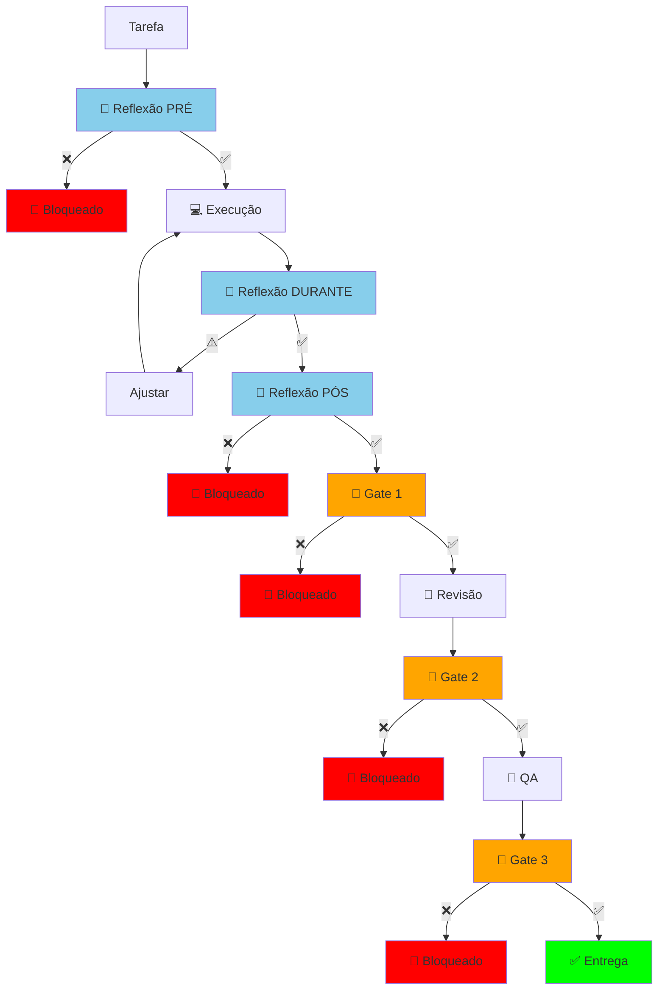

# Sistema de Enforcement de Qualidade

## Visão Geral

Sistema **integrado** que combina **Auto-Reflexão Crítica** + **Gates Obrigatórios** para garantir que **NENHUM código passe sem validação rigorosa**.

---

## Problema Resolvido

### ANTES (Sistema Antigo)



**Problemas:**
- ❌ Agente marca como "pronto" sem validação
- ❌ Pula revisão e QA
- ❌ Código incompleto vai para produção
- ❌ Bugs só descobertos depois

---

### DEPOIS (Sistema Novo)



**Benefícios:**
- ✅ Múltiplos checkpoints de validação
- ✅ Bloqueio automático se critérios não cumpridos
- ✅ Impossível pular revisão/QA
- ✅ Qualidade garantida em cada etapa

---

## Integração Completa

### Fluxo Detalhado

```typescript
/**
 * Workflow completo com Reflexão + Gates
 */
async function executeTaskWithQualityEnforcement(taskId: string) {
  console.log(`\n🚀 Iniciando tarefa: ${taskId}\n`);
  
  try {
    // ==========================================
    // FASE 0: REFLEXÃO PRÉ (obrigatória)
    // ==========================================
    console.log("📍 FASE 0: Reflexão PRÉ-Tarefa\n");
    
    const preReflection = await preTaskReflection(taskId);
    
    if (!preReflection.approved) {
      throw new BlockedError({
        phase: "PRE_REFLECTION",
        reason: preReflection.reason,
        action: "Buscar clarificação antes de iniciar"
      });
    }
    
    console.log("✅ Reflexão PRÉ aprovada. Iniciando execução...\n");
    
    // ==========================================
    // FASE 1-4: EXECUÇÃO (com reflexões durante)
    // ==========================================
    console.log("📍 FASE 1-4: Planejamento → Execução\n");
    
    // Executar subtarefas com reflexão periódica
    let checkpoint = 0;
    for (const subtask of subtasks) {
      checkpoint++;
      
      // Executar subtarefa
      await executeSubtask(subtask);
      
      // Reflexão DURANTE (a cada checkpoint)
      const duringReflection = await duringTaskReflection(taskId, checkpoint);
      
      if (!duringReflection.approved) {
        console.log("⚠️ Reflexão DURANTE detectou problemas. Pausando...");
        // Permitir ajustes antes de continuar
      }
    }
    
    console.log("✅ Execução concluída. Validando qualidade...\n");
    
    // ==========================================
    // FASE 4.5: REFLEXÃO PÓS (obrigatória)
    // ==========================================
    console.log("📍 FASE 4.5: Reflexão PÓS-Tarefa\n");
    
    const postReflection = await postTaskReflection(taskId);
    
    if (!postReflection.approved) {
      throw new BlockedError({
        phase: "POST_REFLECTION",
        reason: postReflection.reason,
        mustFix: postReflection.mustFix,
        action: "Corrigir problemas antes de submeter para revisão"
      });
    }
    
    console.log("✅ Reflexão PÓS aprovada. Executando Gate 1...\n");
    
    // ==========================================
    // GATE 1: Código Completo → Revisão
    // ==========================================
    console.log("📍 GATE 1: Validação de Código Completo\n");
    
    const gate1 = await validateGate1();
    
    if (!gate1.approved) {
      throw new BlockedError({
        phase: "GATE_1",
        reason: gate1.blockedReason,
        checks: gate1.checks,
        mustFix: gate1.mustFix,
        action: "Corrigir TODAS as validações antes de prosseguir"
      });
    }
    
    console.log("✅ Gate 1 aprovado. Criando TODO de revisão...\n");
    
    // Criar TODO de revisão OBRIGATÓRIO
    await todo_write({
      merge: true,
      todos: [
        { id: taskId, status: "completed" },
        {
          id: `${taskId}-review`,
          status: "pending",
          content: "OBRIGATÓRIO: Submeter para revisão do Agente-Revisor"
        }
      ]
    });
    
    // ==========================================
    // FASE 5: REVISÃO (agente revisor)
    // ==========================================
    console.log("📍 FASE 5: Code Review\n");
    console.log("⏳ Aguardando revisão do Agente-Revisor...\n");
    
    // Este passo é executado por outro agente
    // O agente atual fica bloqueado até aprovação
    
    const reviewResult = await waitForReview(taskId);
    
    if (!reviewResult.approved) {
      console.log("❌ Code review rejeitada. Corrigir issues...\n");
      
      // Voltar para execução para corrigir
      await todo_write({
        merge: true,
        todos: [
          {
            id: taskId,
            status: "in_progress",
            content: `Corrigir issues da revisão: ${reviewResult.issues.join(', ')}`
          }
        ]
      });
      
      // Reiniciar ciclo
      return await executeTaskWithQualityEnforcement(taskId);
    }
    
    console.log("✅ Code review aprovada. Executando Gate 2...\n");
    
    // ==========================================
    // GATE 2: Revisão Aprovada → QA
    // ==========================================
    console.log("📍 GATE 2: Validação de Revisão\n");
    
    const gate2 = await validateGate2();
    
    if (!gate2.approved) {
      throw new BlockedError({
        phase: "GATE_2",
        reason: gate2.blockedReason
      });
    }
    
    console.log("✅ Gate 2 aprovado. Criando TODO de QA...\n");
    
    await todo_write({
      merge: true,
      todos: [
        { id: `${taskId}-review`, status: "completed" },
        {
          id: `${taskId}-qa`,
          status: "pending",
          content: "OBRIGATÓRIO: Submeter para QA do Agente-QA"
        }
      ]
    });
    
    // ==========================================
    // FASE 6: QA (agente QA)
    // ==========================================
    console.log("📍 FASE 6: Quality Assurance\n");
    console.log("⏳ Aguardando QA do Agente-QA...\n");
    
    const qaResult = await waitForQA(taskId);
    
    if (!qaResult.approved) {
      console.log("❌ QA rejeitado. Corrigir bugs...\n");
      
      // Gerar relatório de bugs
      await write({
        file_path: `docs/qa/${taskId}-bugs.md`,
        contents: `# Bugs Encontrados: ${taskId}

${qaResult.bugs.map((bug, i) => `
## Bug ${i + 1}: ${bug.title}

**Severidade**: ${bug.severity}
**Descrição**: ${bug.description}
**Steps to Reproduce**:
${bug.steps.map((s, j) => `${j + 1}. ${s}`).join('\n')}

**Expected**: ${bug.expected}
**Actual**: ${bug.actual}
`).join('\n')}
`
      });
      
      // Voltar para execução
      return await executeTaskWithQualityEnforcement(taskId);
    }
    
    console.log("✅ QA aprovado. Executando Gate 3...\n");
    
    // ==========================================
    // GATE 3: QA Aprovado → Documentação
    // ==========================================
    console.log("📍 GATE 3: Validação de QA\n");
    
    const gate3 = await validateGate3();
    
    if (!gate3.approved) {
      throw new BlockedError({
        phase: "GATE_3",
        reason: gate3.blockedReason
      });
    }
    
    console.log("✅ Gate 3 aprovado. Prosseguindo para documentação...\n");
    
    // ==========================================
    // FASE 7-9: Documentação → PR → Entrega
    // ==========================================
    console.log("📍 FASE 7-9: Documentação, PR e Entrega\n");
    
    await executeDocumentation(taskId);
    await createPullRequest(taskId);
    await deployToProduction(taskId);
    
    console.log("\n🎉 ========================================");
    console.log("🎉  TAREFA CONCLUÍDA COM SUCESSO");
    console.log("🎉 ========================================\n");
    
    // Gerar relatório final
    await generateFinalReport(taskId);
    
  } catch (error) {
    if (error instanceof BlockedError) {
      console.log("\n🚫 ========================================");
      console.log(`🚫  BLOQUEADO EM: ${error.phase}`);
      console.log("🚫 ========================================\n");
      console.log(`Razão: ${error.reason}\n`);
      
      if (error.mustFix) {
        console.log("Problemas a corrigir:\n");
        error.mustFix.forEach(problem => {
          console.log(`- ${problem}`);
        });
      }
      
      console.log(`\nAção necessária: ${error.action}\n`);
      
      // Salvar relatório de bloqueio
      await write({
        file_path: `docs/gates/${taskId}-blocked.md`,
        contents: `# Tarefa Bloqueada: ${taskId}

## Fase: ${error.phase}
## Data: ${new Date().toISOString()}

## Razão do Bloqueio

${error.reason}

## Problemas a Corrigir

${error.mustFix ? error.mustFix.map(p => `- ${p}`).join('\n') : 'Ver logs'}

## Ação Necessária

${error.action}

## Próximos Passos

1. Corrigir TODOS os problemas listados
2. Executar validação novamente
3. Somente após aprovação prosseguir
`
      });
      
      throw error;
    }
    
    // Erro não esperado
    throw error;
  }
}
```

---

## Matriz de Validação

### Quando Cada Validação é Executada

| Checkpoint | Tipo | Momento | Bloqueia? | Gera Artifact |
|-----------|------|---------|-----------|---------------|
| **Reflexão PRÉ** | Reflexão | Antes de iniciar | ✅ Sim | `docs/reflections/{task}-pre.md` |
| **Reflexão DURANTE** | Reflexão | A cada 30min | ⚠️ Warning | - |
| **Reflexão PÓS** | Reflexão | Antes de marcar completed | ✅ Sim | `docs/reflections/{task}-post.md` |
| **Gate 1** | Gate | Após reflexão PÓS | ✅ Sim | `docs/gates/gate1-blocked.md` (se falhar) |
| **Gate 2** | Gate | Após code review | ✅ Sim | `docs/gates/gate2-blocked.md` (se falhar) |
| **Gate 3** | Gate | Após QA | ✅ Sim | `docs/gates/gate3-blocked.md` (se falhar) |
| **Gate 4** | Gate | Após docs | ✅ Sim | `docs/gates/gate4-blocked.md` (se falhar) |
| **Gate 5** | Gate | Após PR | ✅ Sim | `docs/gates/gate5-blocked.md` (se falhar) |

---

## Critérios de Bloqueio

### Bloqueio Imediato (CRITICAL)

**O agente PARA completamente e não pode continuar se:**

1. **Reflexão PRÉ** com baixa confiança
2. **Reflexão PÓS** com validações críticas falhando
3. **Gate 1** com erros (lint, type, build, tests)
4. **Gate 2** com code review rejeitada
5. **Gate 3** com bugs críticos encontrados
6. **Gate 4** com documentação incompleta
7. **Gate 5** com PR não aprovado

### Warning (Continua com Atenção)

**O agente pode continuar mas com alerta:**

1. **Reflexão DURANTE** com problemas não-críticos
2. **Reflexão PÓS** com validações não-críticas falhando
3. **Gate 3** com bugs de baixa severidade (documentados)

---

## Exemplo de Execução Real

### Cenário: Implementar Feature de Pagamentos

```bash
🚀 Iniciando tarefa: payment-integration

📍 FASE 0: Reflexão PRÉ-Tarefa

🤔 [Compreensão] O que exatamente devo implementar?
   1. Posso explicar a tarefa em 2-3 frases?
   2. Há ambiguidade nos requisitos?
   3. Preciso de clarificação?
   
   📚 Consultar:
      - docs/planning/payment-integration.md
      
   ⏸️  PAUSE: Reflita antes de continuar...
   
✅ Resposta: Integrar Stripe para processar pagamentos. Endpoints: create, confirm, webhook. Coverage 80%+.

🤔 [Preparação] Li as documentações oficiais necessárias?
   1. Quais tecnologias vou usar?
   2. Conheço as versões mais recentes?
   3. Entendo as best practices?
   
   📚 Consultar:
      - Stripe API: https://stripe.com/docs/api
      - Elysia Docs: https://elysiajs.com/
      
   ⏸️  PAUSE: Reflita antes de continuar...

✅ [15 perguntas depois]

✅ ========================================
✅  REFLEXÃO PRÉ: COMPLETA
✅ ========================================
✅ Agente está pronto para iniciar

📍 FASE 1-4: Planejamento → Execução

💻 Executando subtarefa 1/6: Criar schema Stripe...
✅ Schema criado

🤔 REFLEXÃO DURANTE (Checkpoint 1)
✅ [Progresso] Estou seguindo o plano inicial?
⚠️ [Qualidade] Estou deixando TODOs ou mocks?
   → 2 TODOs encontrados em src/payments/stripe.ts
   
⚠️ Algumas validações falharam. Revisar antes de continuar.

[Agente corrige TODOs]

💻 Executando subtarefa 2/6: Implementar endpoint create...
✅ Endpoint criado

[Continua até completar todas as subtarefas]

📍 FASE 4.5: Reflexão PÓS-Tarefa

🤔 Executando reflexão pós-tarefa...

✅ [Completude] Há algum mock ou placeholder deixado?
✅ [Qualidade] Lint está passando?
✅ [Qualidade] Type-check está passando?
✅ [Qualidade] Build está passando?
✅ [Qualidade] Testes estão 100% passando?
✅ [Qualidade] Coverage >= 80%?
✅ [Qualidade] Sem console.log deixado?
✅ [Prontidão] Este código passaria no Gate 1?

✅ ========================================
✅  REFLEXÃO PÓS: APROVADA
✅ ========================================
✅ Tarefa está completa e pronta para revisão

📍 GATE 1: Validação de Código Completo

🚧 Executando Gate 1 (Código Completo → Revisão)...

[1/8] Executando lint...
✅ Lint: 0 errors

[2/8] Executando type check...
✅ Type Check: 0 errors

[3/8] Executando build...
✅ Build: success

[4/8] Executando testes...
✅ Tests: All tests passed

[5/8] Verificando mocks/placeholders...
✅ No Mocks: 0 mocks

[6/8] Verificando console.log...
✅ No Console.log: 0 console.log

[7/8] Verificando tipo 'any'...
✅ No 'any' Types: 0 any

[8/8] Verificando coverage...
✅ Coverage >= 80%: 87%

📊 RESULTADO DO GATE 1:

✅ Lint: 0 errors
✅ Type Check: 0 errors
✅ Build: Build success
✅ Tests: All tests passed
✅ No Mocks: 0 mocks
✅ No Console.log: 0 console.log
✅ No 'any' Types: 0 any
✅ Coverage >= 80%: 87%

✅ ========================================
✅  GATE 1: APROVADO
✅ ========================================
✅ Código está pronto para REVISÃO

✅ Gate 1 aprovado. Criando TODO de revisão...

📍 FASE 5: Code Review

⏳ Aguardando revisão do Agente-Revisor...

[Agente-Revisor executa revisão]

✅ Code review aprovada. Executando Gate 2...

[Continua com Gates 2-5 e demais fases]

🎉 ========================================
🎉  TAREFA CONCLUÍDA COM SUCESSO
🎉 ========================================
```

---

## Artifacts Gerados

### Documentação de Reflexões

```
docs/reflections/
├── payment-integration-pre.md
├── payment-integration-during-1.md
├── payment-integration-during-2.md
└── payment-integration-post.md
```

### Relatórios de Gates

```
docs/gates/
├── payment-integration-gate1-passed.md
├── payment-integration-gate2-passed.md
└── payment-integration-gate3-passed.md
```

### Relatórios de Bloqueio (se houver)

```
docs/gates/
└── payment-integration-blocked.md  # Se bloqueado em algum gate
```

---

## Novas Regras de Ouro

### Regra 81: Gates Obrigatórios

```typescript
/**
 * Regra 81: Gates obrigatórios entre fases
 * 
 * NENHUM agente pode prosseguir para a próxima fase sem:
 * 1. Executar o gate correspondente
 * 2. Obter aprovação do gate
 * 3. Criar TODO da próxima fase
 * 
 * Enforcement: BLOCKING
 * Penalty: Tarefa bloqueada até correção
 */
const RULE_81 = {
  name: "Gates Obrigatórios",
  enforcement: "blocking",
  phases: [
    { from: "EXECUÇÃO", gate: "Gate 1", to: "REVISÃO" },
    { from: "REVISÃO", gate: "Gate 2", to: "QA" },
    { from: "QA", gate: "Gate 3", to: "DOCUMENTAÇÃO" },
    { from: "DOCUMENTAÇÃO", gate: "Gate 4", to: "PULL REQUEST" },
    { from: "PULL REQUEST", gate: "Gate 5", to: "ENTREGA" }
  ],
  documentation: "docs/cursor-agent/workflows/mandatory-gates.md"
};
```

### Regra 82: Reflexão Crítica Obrigatória

```typescript
/**
 * Regra 82: Reflexão obrigatória em 3 momentos
 * 
 * NENHUM agente pode:
 * 1. Iniciar tarefa sem Reflexão PRÉ
 * 2. Executar > 30min sem Reflexão DURANTE
 * 3. Marcar como completed sem Reflexão PÓS
 * 
 * Enforcement: BLOCKING
 * Penalty: Tarefa bloqueada até reflexão completa
 */
const RULE_82 = {
  name: "Reflexão Crítica Obrigatória",
  enforcement: "blocking",
  moments: [
    { when: "PRE", blocks: "task_start", function: "preTaskReflection" },
    { when: "DURING", frequency: "every_30min", function: "duringTaskReflection" },
    { when: "POST", blocks: "mark_completed", function: "postTaskReflection" }
  ],
  documentation: "docs/cursor-agent/workflows/self-reflection.md"
};
```

### Regra 83: Respostas Obrigatórias

```typescript
/**
 * Regra 83: Perguntas críticas devem ter respostas
 * 
 * Agente não pode "pular" perguntas de reflexão.
 * Todas devem ser respondidas com confiança alta/média.
 * 
 * Enforcement: BLOCKING
 * Penalty: Reflexão reprovada até todas respondidas
 */
const RULE_83 = {
  name: "Respostas Obrigatórias",
  enforcement: "blocking",
  requirement: "all_questions_answered_with_confidence",
  minConfidence: "medium",
  documentation: "docs/cursor-agent/workflows/self-reflection.md"
};
```

---

## Auditoria do Agente-CTO

```typescript
/**
 * CTO audita se TODAS as validações foram executadas
 */
async function auditQualityEnforcement(taskId: string): Promise<AuditResult> {
  console.log("\n👔 CTO: Auditando enforcement de qualidade...\n");
  
  const checks = {
    // Reflexões
    preReflection: await checkFileExists(`docs/reflections/${taskId}-pre.md`),
    postReflection: await checkFileExists(`docs/reflections/${taskId}-post.md`),
    duringReflections: await countFiles(`docs/reflections/${taskId}-during-*.md`),
    
    // Gates
    gate1: await checkGatePassed(taskId, "gate1"),
    gate2: await checkGatePassed(taskId, "gate2"),
    gate3: await checkGatePassed(taskId, "gate3"),
    gate4: await checkGatePassed(taskId, "gate4"),
    gate5: await checkGatePassed(taskId, "gate5"),
    
    // Aprovações
    codeReview: await checkApproval(taskId, "code_review"),
    qa: await checkApproval(taskId, "qa"),
    
    // PR
    pullRequest: await checkPRMerged(taskId)
  };
  
  const allPassed = Object.values(checks).every(Boolean);
  
  if (!allPassed) {
    console.log("❌ CTO: Auditoria FALHOU. Enforcement não foi seguido.\n");
    
    const missing = Object.entries(checks)
      .filter(([_, passed]) => !passed)
      .map(([check]) => check);
    
    return {
      approved: false,
      reason: "Enforcement de qualidade não foi seguido",
      missing
    };
  }
  
  console.log("✅ CTO: Auditoria APROVADA. Todas validações executadas.\n");
  
  return {
    approved: true,
    message: "Tarefa seguiu 100% o processo de qualidade"
  };
}
```

---

## Métricas de Sucesso

### KPIs de Qualidade

| Métrica | Target | Medição |
|---------|--------|---------|
| **Reflexões PRÉ executadas** | 100% | `count(docs/reflections/*-pre.md)` |
| **Reflexões PÓS executadas** | 100% | `count(docs/reflections/*-post.md)` |
| **Gates aprovados na 1ª tentativa** | >= 80% | `gates_passed_first_try / total_gates` |
| **Code reviews aprovados na 1ª** | >= 70% | `reviews_passed_first_try / total_reviews` |
| **Bugs encontrados em QA** | <= 3 per task | `bugs_found_in_qa` |
| **Tarefas bloqueadas** | <= 20% | `blocked_tasks / total_tasks` |
| **Retrabalho** | <= 15% | `time_fixing / total_time` |

### ROI Esperado

- **Redução de 80%** em código incompleto
- **Redução de 70%** em bugs em produção
- **Aumento de 50%** em first-time approval
- **Redução de 60%** em retrabalho
- **Aumento de 40%** em velocidade de entrega (paradoxalmente, mais checks = menos retrabalho = mais rápido)

---

**Versão**: 1.0  
**Data**: Outubro 2025  
**Autor**: Agente-CTO  
**Status**: **OBRIGATÓRIO** para todas as tarefas  
**Documentação Relacionada**:
- `mandatory-gates.md` - Sistema de Gates
- `self-reflection.md` - Sistema de Reflexão
- `workflow-completo.md` - Workflow base

