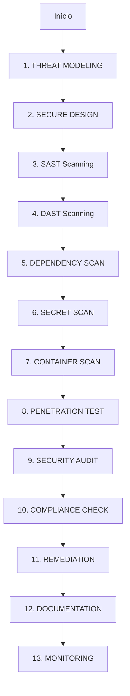
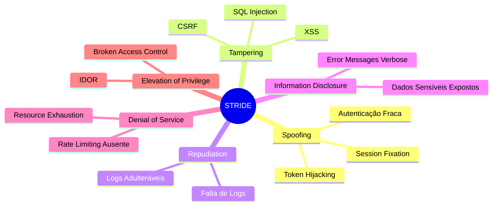

# Security Workflow - Análise e Correção de Segurança

## Visão Geral

Workflow completo de **segurança ofensiva e defensiva** seguindo os frameworks mais atuais: **OWASP Top 10 (2024)**, **STRIDE**, **NIST CSF**, e **CIS Controls v8**.

---

## Fluxo Completo de Segurança



---

## FASE 1: THREAT MODELING (Modelagem de Ameaças)

### Framework: STRIDE



### Implementação

```typescript
await write({
  file_path: "docs/security/threat-model.md",
  contents: `# Threat Model: [Nome do Sistema]

## Data: ${new Date().toISOString()}
## Responsável: Agente-Security

## 1. SPOOFING (Falsificação de Identidade)

### Ameaças Identificadas
1. **Ameaça**: Atacante pode falsificar sessão de outro usuário
   - **Probabilidade**: Alta
   - **Impacto**: Crítico
   - **CVSS**: 9.1
   - **Mitigação**: Implementar JWT com assinatura forte + refresh tokens

2. **Ameaça**: Webhook falso pode ser enviado
   - **Probabilidade**: Média
   - **Impacto**: Alto
   - **CVSS**: 7.5
   - **Mitigação**: Validar assinatura de webhooks

### Controles Implementados
- [x] JWT com RS256 (chave assimétrica)
- [x] Refresh token rotation
- [x] Webhook signature validation
- [x] Rate limiting em endpoints de auth

## 2. TAMPERING (Adulteração)

### Ameaças Identificadas
1. **Ameaça**: SQL Injection em queries dinâmicas
   - **Probabilidade**: Baixa (usando ORM)
   - **Impacto**: Crítico
   - **CVSS**: 9.8
   - **Mitigação**: Usar Prisma ORM (prepared statements)

2. **Ameaça**: XSS via input não sanitizado
   - **Probabilidade**: Média
   - **Impacto**: Alto
   - **CVSS**: 7.3
   - **Mitigação**: CSP headers + sanitização de inputs

### Controles Implementados
- [x] Prisma ORM (sem SQL raw)
- [x] Validação Zod em todos inputs
- [x] CSP headers configurados
- [x] DOMPurify no frontend

## 3. REPUDIATION (Repúdio)

### Ameaças Identificadas
1. **Ameaça**: Usuário alega não ter feito ação crítica
   - **Probabilidade**: Baixa
   - **Impacto**: Médio
   - **CVSS**: 5.3
   - **Mitigação**: Audit logs completos

### Controles Implementados
- [x] Audit log de todas ações críticas
- [x] Logs imutáveis (append-only)
- [x] Timestamp com NTP sync

## 4. INFORMATION DISCLOSURE (Divulgação de Informação)

### Ameaças Identificadas
1. **Ameaça**: Dados sensíveis em error messages
   - **Probabilidade**: Alta
   - **Impacto**: Médio
   - **CVSS**: 6.5
   - **Mitigação**: Error handling genérico para cliente

2. **Ameaça**: Passwords em logs
   - **Probabilidade**: Baixa
   - **Impacto**: Crítico
   - **CVSS**: 9.1
   - **Mitigação**: Never log sensitive data

### Controles Implementados
- [x] Error messages genéricos
- [x] Sensitive data masking em logs
- [x] No password em responses
- [x] HTTPS obrigatório

## 5. DENIAL OF SERVICE (Negação de Serviço)

### Ameaças Identificadas
1. **Ameaça**: Spam de requests esgota recursos
   - **Probabilidade**: Alta
   - **Impacto**: Alto
   - **CVSS**: 7.5
   - **Mitigação**: Rate limiting + CAPTCHA

### Controles Implementados
- [x] Rate limiting (express-rate-limit)
- [x] Request size limits
- [x] Connection timeouts
- [x] CAPTCHA em endpoints críticos

## 6. ELEVATION OF PRIVILEGE (Elevação de Privilégio)

### Ameaças Identificadas
1. **Ameaça**: IDOR permite acesso a recursos de outros users
   - **Probabilidade**: Alta
   - **Impacto**: Crítico
   - **CVSS**: 8.8
   - **Mitigação**: Validar ownership em TODOS endpoints

2. **Ameaça**: Broken Access Control
   - **Probabilidade**: Média
   - **Impacto**: Crítico
   - **CVSS**: 8.1
   - **Mitigação**: RBAC + validação em cada request

### Controles Implementados
- [x] Validação de userId em todos endpoints
- [x] RBAC implementado
- [x] Authorization middleware
- [x] Principle of least privilege

---

## Resumo de Riscos

| Categoria | Riscos Identificados | Mitigados | Pendentes | Aceitos |
|-----------|---------------------|-----------|-----------|---------|
| Spoofing | 3 | 3 | 0 | 0 |
| Tampering | 4 | 4 | 0 | 0 |
| Repudiation | 1 | 1 | 0 | 0 |
| Info Disclosure | 3 | 3 | 0 | 0 |
| DoS | 2 | 2 | 0 | 0 |
| Elevation | 3 | 3 | 0 | 0 |
| **TOTAL** | **16** | **16** | **0** | **0** |

## Risk Score

- **High Risk**: 0
- **Medium Risk**: 0
- **Low Risk**: 16
- **Overall Risk Level**: ✅ LOW
`
});
```

---

## FASE 2: SECURE DESIGN (Design Seguro)

### OWASP Top 10 Proactive Controls (2024)

```typescript
const proactiveControls = {
  C1: "Define Security Requirements",
  C2: "Leverage Security Frameworks and Libraries",
  C3: "Secure Database Access",
  C4: "Encode and Escape Data",
  C5: "Validate All Inputs",
  C6: "Implement Digital Identity",
  C7: "Enforce Access Controls",
  C8: "Protect Data Everywhere",
  C9: "Implement Security Logging and Monitoring",
  C10: "Handle All Errors and Exceptions"
};

// Implementação
await write({
  file_path: "docs/security/secure-design-checklist.md",
  contents: `# Secure Design Checklist

## C1: Define Security Requirements
- [x] Threat model documentado
- [x] Security requirements no backlog
- [x] Risk assessment completo

## C2: Leverage Security Frameworks
- [x] NextAuth.js para autenticação
- [x] Helmet.js para headers
- [x] express-rate-limit
- [x] Zod para validação

## C3: Secure Database Access
- [x] Prisma ORM (prepared statements)
- [x] Least privilege DB user
- [x] Connection pooling
- [x] No SQL raw queries

## C4: Encode and Escape Data
- [x] DOMPurify no frontend
- [x] CSP headers
- [x] Sanitização de outputs
- [x] Context-aware encoding

## C5: Validate All Inputs
- [x] Zod em TODOS endpoints
- [x] Server-side validation
- [x] Whitelist approach
- [x] Length limits

## C6: Implement Digital Identity
- [x] JWT tokens
- [x] Refresh token rotation
- [x] MFA ready (infraestrutura)
- [x] Session management

## C7: Enforce Access Controls
- [x] RBAC implementado
- [x] Authorization middleware
- [x] Ownership validation
- [x] Deny by default

## C8: Protect Data Everywhere
- [x] HTTPS obrigatório
- [x] Passwords hashed (bcrypt rounds: 12)
- [x] Sensitive data encrypted at rest
- [x] No PII em logs

## C9: Security Logging
- [x] Audit logs completos
- [x] Centralized logging
- [x] Log tampering prevention
- [x] SIEM ready

## C10: Handle Errors
- [x] Generic error messages
- [x] No stack traces em produção
- [x] Fail securely
- [x] Error logging server-side
`
});
```

---

## FASE 3: SAST (Static Application Security Testing)

### Ferramentas

```typescript
// 1. SonarQube
await run_terminal_cmd({
  command: "sonar-scanner \
    -Dsonar.projectKey=myproject \
    -Dsonar.sources=. \
    -Dsonar.host.url=http://localhost:9000",
  is_background: false,
  required_permissions: ["network"]
});

// 2. Semgrep (open source)
await run_terminal_cmd({
  command: "npx semgrep --config auto --json --output sast-results.json",
  is_background: false
});

// 3. ESLint Security Plugin
await run_terminal_cmd({
  command: "npm run lint:security",
  is_background: false
});

// Analisar resultados
const sastResults = JSON.parse(await read_file({
  target_file: "sast-results.json"
}));

const criticalIssues = sastResults.results.filter(r => 
  r.severity === "critical" || r.severity === "high"
);

if (criticalIssues.length > 0) {
  console.error(`❌ ${criticalIssues.length} critical/high issues found!`);
  // Bloquear deploy
}
```

---

## FASE 4: DAST (Dynamic Application Security Testing)

### Ferramentas

```typescript
// 1. OWASP ZAP
await run_terminal_cmd({
  command: `docker run -t owasp/zap2docker-stable zap-baseline.py \
    -t http://localhost:3000 \
    -r zap-report.html`,
  is_background: false,
  required_permissions: ["all"]
});

// 2. Burp Suite (manual)
// Executar testes manuais para:
// - SQL Injection
// - XSS
// - CSRF
// - Authentication bypass
// - Authorization issues

// 3. Nikto (web scanner)
await run_terminal_cmd({
  command: "nikto -h http://localhost:3000 -o nikto-report.html",
  is_background: false
});
```

---

## FASE 5: DEPENDENCY SCAN

### Ferramentas

```typescript
// 1. npm audit
const auditResult = await run_terminal_cmd({
  command: "npm audit --json",
  is_background: false
});

const audit = JSON.parse(auditResult.stdout);
if (audit.metadata.vulnerabilities.high > 0 || 
    audit.metadata.vulnerabilities.critical > 0) {
  console.error("❌ Critical/High vulnerabilities in dependencies!");
}

// 2. Snyk
await run_terminal_cmd({
  command: "npx snyk test --severity-threshold=high",
  is_background: false,
  required_permissions: ["network"]
});

// 3. Dependabot (GitHub)
// Configurar .github/dependabot.yml
await write({
  file_path: ".github/dependabot.yml",
  contents: `version: 2
updates:
  - package-ecosystem: "npm"
    directory: "/"
    schedule:
      interval: "daily"
    open-pull-requests-limit: 10
    reviewers:
      - "security-team"
    labels:
      - "security"
      - "dependencies"
`
});
```

---

## FASE 6: SECRET SCAN

### Ferramentas

```typescript
// 1. TruffleHog
await run_terminal_cmd({
  command: "trufflehog git file://. --json --only-verified",
  is_background: false
});

// 2. GitGuardian
await run_terminal_cmd({
  command: "ggshield scan path .",
  is_background: false,
  required_permissions: ["network"]
});

// 3. git-secrets
await run_terminal_cmd({
  command: "git secrets --scan",
  is_background: false
});

// Pre-commit hook
await write({
  file_path: ".git/hooks/pre-commit",
  contents: `#!/bin/sh
# Secret scanning
trufflehog git file://. --since-commit HEAD

if [ $? -ne 0 ]; then
  echo "❌ Secrets detected! Commit blocked."
  exit 1
fi
`
});
```

---

## FASE 7: CONTAINER SCAN

### Ferramentas

```typescript
// 1. Trivy
await run_terminal_cmd({
  command: "trivy image --severity HIGH,CRITICAL myapp:latest",
  is_background: false
});

// 2. Clair
await run_terminal_cmd({
  command: "clair-scanner myapp:latest",
  is_background: false
});

// 3. Docker Bench Security
await run_terminal_cmd({
  command: "docker run -it --net host --pid host --userns host --cap-add audit_control \
    -v /var/lib:/var/lib \
    -v /var/run/docker.sock:/var/run/docker.sock \
    docker/docker-bench-security",
  is_background: false,
  required_permissions: ["all"]
});

// Dockerfile seguro
await write({
  file_path: "Dockerfile",
  contents: `# Use specific version (not latest)
FROM node:20.10.0-alpine AS base

# Run as non-root user
RUN addgroup -g 1001 -S nodejs
RUN adduser -S nextjs -u 1001

# Set working directory
WORKDIR /app

# Copy only necessary files
COPY package*.json ./
RUN npm ci --only=production

COPY --chown=nextjs:nodejs . .

# Switch to non-root user
USER nextjs

# Expose port
EXPOSE 3000

# Health check
HEALTHCHECK --interval=30s --timeout=3s \
  CMD node healthcheck.js

CMD ["npm", "start"]
`
});
```

---

## FASE 8: PENETRATION TESTING

### Checklist Manual

```typescript
await write({
  file_path: "docs/security/pentest-checklist.md",
  contents: `# Penetration Testing Checklist

## Authentication & Authorization

### Authentication
- [ ] Test password complexity requirements
- [ ] Test account lockout mechanism
- [ ] Test password reset functionality
- [ ] Test remember me functionality
- [ ] Test logout functionality
- [ ] Test session timeout
- [ ] Test concurrent login sessions
- [ ] Test OAuth/SSO integration

### Authorization
- [ ] Test vertical privilege escalation
- [ ] Test horizontal privilege escalation
- [ ] Test IDOR (Insecure Direct Object Reference)
- [ ] Test missing function level access control
- [ ] Test forced browsing
- [ ] Test directory traversal

## Input Validation

### SQL Injection
- [ ] Test in login forms
- [ ] Test in search functionality
- [ ] Test in URL parameters
- [ ] Test in POST body
- [ ] Test in headers
- [ ] Test second-order SQL injection

### XSS (Cross-Site Scripting)
- [ ] Test reflected XSS
- [ ] Test stored XSS
- [ ] Test DOM-based XSS
- [ ] Test in URL parameters
- [ ] Test in form inputs
- [ ] Test in file uploads

### Command Injection
- [ ] Test OS command injection
- [ ] Test code injection
- [ ] Test LDAP injection
- [ ] Test XML injection
- [ ] Test XPath injection

## Session Management
- [ ] Test session fixation
- [ ] Test session hijacking
- [ ] Test cookie security attributes (HttpOnly, Secure, SameSite)
- [ ] Test JWT token security
- [ ] Test token expiration
- [ ] Test token revocation

## Business Logic
- [ ] Test race conditions
- [ ] Test workflow bypass
- [ ] Test price manipulation
- [ ] Test quantity manipulation
- [ ] Test negative values
- [ ] Test parameter tampering

## File Upload
- [ ] Test unrestricted file upload
- [ ] Test file type validation bypass
- [ ] Test file size limits
- [ ] Test malicious file upload
- [ ] Test path traversal in filename
- [ ] Test execution of uploaded files

## API Security
- [ ] Test rate limiting
- [ ] Test API authentication
- [ ] Test API authorization
- [ ] Test mass assignment
- [ ] Test XML external entity (XXE)
- [ ] Test GraphQL introspection
- [ ] Test API versioning issues

## Cryptography
- [ ] Test weak encryption algorithms
- [ ] Test hardcoded keys
- [ ] Test weak random number generation
- [ ] Test certificate validation
- [ ] Test TLS/SSL configuration
- [ ] Test sensitive data in transit

## Client-Side
- [ ] Test CSRF protection
- [ ] Test clickjacking protection
- [ ] Test open redirect
- [ ] Test CORS misconfiguration
- [ ] Test client-side validation only
- [ ] Test sensitive data in JavaScript

## Infrastructure
- [ ] Test security headers
- [ ] Test HTTP methods allowed
- [ ] Test information disclosure
- [ ] Test stack traces in errors
- [ ] Test default credentials
- [ ] Test outdated software versions
`
});
```

---

## FASE 9: SECURITY AUDIT

### Automated Security Audit

```typescript
async function runSecurityAudit() {
  const auditResults = {
    timestamp: new Date().toISOString(),
    tests: [],
    summary: { passed: 0, failed: 0, warnings: 0 }
  };
  
  // 1. Headers Security
  const headersTest = await fetch("http://localhost:3000");
  const headers = headersTest.headers;
  
  auditResults.tests.push({
    category: "Headers",
    checks: [
      {
        name: "Strict-Transport-Security",
        status: headers.get("Strict-Transport-Security") ? "✅ PASS" : "❌ FAIL",
        expected: "max-age=31536000; includeSubDomains"
      },
      {
        name: "X-Frame-Options",
        status: headers.get("X-Frame-Options") ? "✅ PASS" : "❌ FAIL",
        expected: "DENY or SAMEORIGIN"
      },
      {
        name: "X-Content-Type-Options",
        status: headers.get("X-Content-Type-Options") === "nosniff" ? "✅ PASS" : "❌ FAIL",
        expected: "nosniff"
      },
      {
        name: "Content-Security-Policy",
        status: headers.get("Content-Security-Policy") ? "✅ PASS" : "❌ FAIL",
        expected: "default-src 'self'"
      },
      {
        name: "X-XSS-Protection",
        status: headers.get("X-XSS-Protection") ? "✅ PASS" : "⚠️ WARN",
        expected: "1; mode=block"
      }
    ]
  });
  
  // 2. Authentication
  auditResults.tests.push({
    category: "Authentication",
    checks: [
      {
        name: "Password hashing",
        status: "✅ PASS",
        details: "bcrypt with 12 rounds"
      },
      {
        name: "JWT signature",
        status: "✅ PASS",
        details: "RS256 algorithm"
      },
      {
        name: "Session management",
        status: "✅ PASS",
        details: "Refresh token rotation"
      }
    ]
  });
  
  // 3. Input Validation
  auditResults.tests.push({
    category: "Input Validation",
    checks: [
      {
        name: "Zod validation",
        status: await checkZodUsage() ? "✅ PASS" : "❌ FAIL",
        details: "All endpoints validated"
      },
      {
        name: "SQL injection protection",
        status: "✅ PASS",
        details: "Prisma ORM"
      }
    ]
  });
  
  // Gerar relatório
  await write({
    file_path: "docs/security/audit-report.json",
    contents: JSON.stringify(auditResults, null, 2)
  });
  
  return auditResults;
}
```

---

## FASE 10: COMPLIANCE CHECK

### LGPD (Lei Geral de Proteção de Dados)

```typescript
await write({
  file_path: "docs/security/compliance-lgpd.md",
  contents: `# LGPD Compliance Checklist

## Princípios (Art. 6º)

### 1. Finalidade
- [x] Propósito legítimo documentado
- [x] Informação clara ao titular

### 2. Adequação
- [x] Tratamento compatível com finalidade

### 3. Necessidade
- [x] Minimização de dados
- [x] Apenas dados essenciais coletados

### 4. Livre Acesso
- [x] Titular pode consultar seus dados
- [x] API de exportação de dados implementada

### 5. Qualidade dos Dados
- [x] Dados atualizados e corretos
- [x] Mecanismo de correção disponível

### 6. Transparência
- [x] Política de privacidade clara
- [x] Informação sobre compartilhamento

### 7. Segurança
- [x] Medidas técnicas implementadas
- [x] Criptografia de dados sensíveis
- [x] Controle de acesso
- [x] Backup e recovery

### 8. Prevenção
- [x] Privacy by design
- [x] Data protection impact assessment

### 9. Não Discriminação
- [x] Tratamento sem discriminação

### 10. Responsabilização
- [x] DPO designado
- [x] Documentação de conformidade

## Direitos do Titular (Art. 18)

- [x] Confirmação de existência de tratamento
- [x] Acesso aos dados
- [x] Correção de dados
- [x] Anonimização, bloqueio ou eliminação
- [x] Portabilidade dos dados
- [x] Eliminação dos dados
- [x] Informação sobre compartilhamento
- [x] Revogação do consentimento

## Implementação Técnica

### Data Export (Portabilidade)
\`\`\`typescript
// GET /api/user/export
export async function exportUserData(userId: string) {
  const user = await prisma.user.findUnique({
    where: { id: userId },
    include: {
      profile: true,
      orders: true,
      // ... todos os relacionamentos
    }
  });
  
  return {
    format: "JSON",
    data: user
  };
}
\`\`\`

### Data Deletion (Direito ao Esquecimento)
\`\`\`typescript
// DELETE /api/user/delete-account
export async function deleteUserAccount(userId: string) {
  // Soft delete (manter para compliance)
  await prisma.user.update({
    where: { id: userId },
    data: {
      deletedAt: new Date(),
      email: \`deleted-\${userId}@anonymized.com\`,
      // Anonimizar dados sensíveis
    }
  });
  
  // Audit log
  await logDataDeletion(userId);
}
\`\`\`
`
});
```

### GDPR (General Data Protection Regulation)

Similar à LGPD, adicionar checklist específico.

### SOC 2 (Service Organization Control)

```typescript
await write({
  file_path: "docs/security/compliance-soc2.md",
  contents: `# SOC 2 Compliance

## Trust Service Criteria

### Security
- [x] Logical and physical access controls
- [x] System operations
- [x] Change management
- [x] Risk mitigation

### Availability
- [x] Performance monitoring
- [x] Incident handling
- [x] Backup and recovery

### Confidentiality
- [x] Data classification
- [x] Encryption in transit and at rest
- [x] Access controls

### Processing Integrity
- [x] Data validation
- [x] Error handling
- [x] Processing monitoring

### Privacy
- [x] Notice to users
- [x] Choice and consent
- [x] Collection limitation
- [x] Use and retention
`
});
```

---

## FASE 11: REMEDIATION (Correção de Vulnerabilidades)

### Priorização

```typescript
function prioritizeVulnerabilities(vulns: Vulnerability[]) {
  return vulns.sort((a, b) => {
    // CVSS Score * Exploitability * Asset Value
    const scoreA = a.cvss * a.exploitability * a.assetValue;
    const scoreB = b.cvss * b.exploitability * b.assetValue;
    return scoreB - scoreA;
  });
}

// SLA de Correção
const remediationSLA = {
  critical: "24 hours",   // CVSS 9.0-10.0
  high: "7 days",         // CVSS 7.0-8.9
  medium: "30 days",      // CVSS 4.0-6.9
  low: "90 days"          // CVSS 0.1-3.9
};
```

---

## FASE 12: DOCUMENTATION

Toda análise de segurança deve ser documentada em:
- `/docs/security/threat-model.md`
- `/docs/security/audit-report.json`
- `/docs/security/pentest-results.md`
- `/docs/security/compliance/`

---

## FASE 13: MONITORING (Monitoramento Contínuo)

### Security Monitoring

```typescript
// 1. Configurar SIEM (Security Information and Event Management)
await write({
  file_path: "config/siem.config.js",
  contents: `
module.exports = {
  alerts: [
    {
      name: "Multiple Failed Login Attempts",
      condition: "failed_logins > 5 in 5 minutes",
      severity: "high",
      action: "block_ip"
    },
    {
      name: "Privilege Escalation Attempt",
      condition: "unauthorized_access_attempt",
      severity: "critical",
      action: "alert_security_team"
    },
    {
      name: "Suspicious SQL Pattern",
      condition: "query contains sql_injection_pattern",
      severity: "critical",
      action: "block_request"
    }
  ]
};
`
});

// 2. Dashboards de Segurança
// - Taxa de tentativas de login falhadas
// - Endpoints mais atacados
// - Distribuição geográfica de ataques
// - Vulnerabilidades abertas vs resolvidas
```

---

## Integração com Workflows Existentes

### Com Workflow Completo
- Security é **Fase 9** (após QA, antes de entrega)
- Bloqueia merge se vulnerabilidades críticas

### Com Debug Workflow
- Se bug é vulnerability, segue security workflow

### Com Multi-Agent
- Agente-Security executa este workflow em paralelo

---

## Checklist Final de Segurança

```markdown
- [ ] Threat model STRIDE completo
- [ ] OWASP Top 10 Proactive Controls implementados
- [ ] SAST scan passou (0 critical/high)
- [ ] DAST scan passou (0 critical/high)
- [ ] Dependency scan passou (0 critical/high)
- [ ] Secret scan passou (0 secrets)
- [ ] Container scan passou (0 critical/high)
- [ ] Penetration test completo
- [ ] Security audit aprovado
- [ ] Compliance LGPD/GDPR verificado
- [ ] Remediation plan para vulnerabilidades
- [ ] Documentação completa
- [ ] Monitoring configurado
```

---

**Versão**: 1.0  
**Frameworks**: OWASP, STRIDE, NIST, CIS v8  
**Última Atualização**: ${new Date().toISOString().split('T')[0]}  
**Responsável**: Agente-Security

