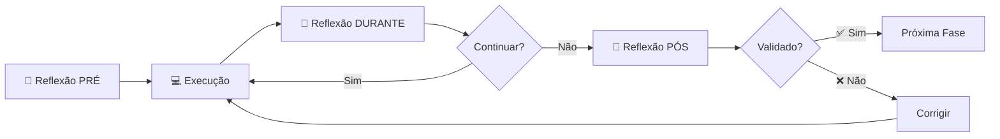
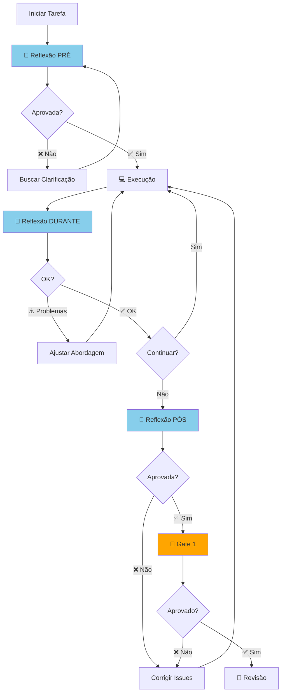

# Sistema de Auto-Reflexão Crítica (Self-Reflection)

## Visão Geral

Sistema de **questionamento crítico obrigatório** que força agentes a **pausar e refletir** sobre seu trabalho **ANTES**, **DURANTE** e **DEPOIS** de cada fase.

---

## Por Que Reflexão é Crítica

### Problema Identificado

<boltArtifact id="agente-cto-v2" title="Agente-CTO v2.0 - Chief Technology Officer">Agentes executam tarefas **linearmente** sem pausas reflexivas:

```typescript
// ❌ EXECUÇÃO LINEAR (sem reflexão)
await implementar();      // Apenas executa
await marcarCompleto();   // Marca como pronto
await proximaTarefa();    // Vai para próxima
```

Resultados:
- Código incompleto marcado como "pronto"
- Bugs não detectados
- Requisitos mal compreendidos
- Padrões não seguidos

### Solução: Reflexão em 3 Momentos



---

## Reflexão PRÉ (Before Starting)

### Objetivo

Garantir que o agente **compreendeu completamente** a tarefa antes de iniciar.

### Perguntas Obrigatórias

```typescript
interface PreReflection {
  understanding: {
    q1: "O que exatamente devo implementar?";
    q2: "Por que esta tarefa é importante?";
    q3: "Qual o critério de sucesso?";
    q4: "Quais são as dependências?";
    q5: "Qual a estimativa de tempo?";
  };
  
  preparation: {
    q6: "Li as documentações oficiais necessárias?";
    q7: "Entendo os padrões do projeto?";
    q8: "Tenho todas as informações necessárias?";
    q9: "Identifiquei possíveis riscos?";
    q10: "Sei exatamente onde começar?";
  };
  
  alignment: {
    q11: "Esta tarefa segue as 80 Regras de Ouro?";
    q12: "Vou precisar de outros agentes?";
    q13: "Há decisões técnicas que precisam de ADR?";
    q14: "Entendo como será testado?";
    q15: "Sei como será revisado?";
  };
}
```

### Implementação

```typescript
/**
 * Reflexão PRÉ: Executar ANTES de iniciar qualquer tarefa
 */
async function preTaskReflection(taskId: string): Promise<ReflectionResult> {
  console.log("\n🤔 ========================================");
  console.log("🤔  REFLEXÃO PRÉ-TAREFA");
  console.log("🤔 ========================================\n");
  
  const questions = [
    // COMPREENSÃO
    {
      id: "q1",
      category: "Compreensão",
      question: "O que exatamente devo implementar?",
      criticalThinking: [
        "Posso explicar a tarefa em 2-3 frases?",
        "Há ambiguidade nos requisitos?",
        "Preciso de clarificação?"
      ]
    },
    {
      id: "q2",
      category: "Compreensão",
      question: "Por que esta tarefa é importante?",
      criticalThinking: [
        "Qual o impacto no usuário?",
        "Qual o valor de negócio?",
        "O que acontece se não fizer?"
      ]
    },
    {
      id: "q3",
      category: "Compreensão",
      question: "Qual o critério de sucesso?",
      criticalThinking: [
        "Como saberei que está pronto?",
        "Quais métricas devo atingir?",
        "Como será validado?"
      ]
    },
    
    // PREPARAÇÃO
    {
      id: "q6",
      category: "Preparação",
      question: "Li as documentações oficiais necessárias?",
      criticalThinking: [
        "Quais tecnologias vou usar?",
        "Conheço as versões mais recentes?",
        "Entendo as best practices?"
      ],
      artifacts: [
        "docs/cursor-agent/reference/base-conhecimento.md",
        "Docs oficiais das tecnologias"
      ]
    },
    {
      id: "q7",
      category: "Preparação",
      question: "Entendo os padrões do projeto?",
      criticalThinking: [
        "Li o ADR de padrões?",
        "Conheço a estrutura de pastas?",
        "Sei como nomear arquivos?"
      ],
      artifacts: [
        "docs/adr/",
        "docs/architecture/"
      ]
    },
    
    // ALINHAMENTO
    {
      id: "q11",
      category: "Alinhamento",
      question: "Esta tarefa segue as 80 Regras de Ouro?",
      criticalThinking: [
        "Vou implementar código completo (Regra 11)?",
        "Vou usar Zod (Regra 19)?",
        "Vou atingir 80%+ coverage (Regra 67)?"
      ],
      artifacts: [
        "docs/cursor-agent/README.md (80 Regras)"
      ]
    },
    {
      id: "q15",
      category: "Alinhamento",
      question: "Sei como será revisado?",
      criticalThinking: [
        "Quais serão os critérios de revisão?",
        "Quem vai revisar?",
        "Como será o QA?"
      ],
      artifacts: [
        "docs/cursor-agent/workflows/workflow-completo.md (Fase 5, 6)"
      ]
    }
  ];
  
  // Executar reflexão para cada pergunta
  const answers: ReflectionAnswer[] = [];
  
  for (const q of questions) {
    console.log(`\n📌 [${q.category}] ${q.question}\n`);
    
    // Listar perguntas críticas
    q.criticalThinking.forEach((ct, i) => {
      console.log(`   ${i + 1}. ${ct}`);
    });
    
    // Listar artifacts recomendados
    if (q.artifacts) {
      console.log("\n   📚 Consultar:");
      q.artifacts.forEach(a => console.log(`      - ${a}`));
    }
    
    // PAUSE FORÇADA - agente deve responder
    console.log("\n   ⏸️  PAUSE: Reflita antes de continuar...\n");
    
    // Simular resposta do agente (em produção, seria uma interação)
    const answer = {
      questionId: q.id,
      category: q.category,
      question: q.question,
      answered: true,
      confidence: "high" as "high" | "medium" | "low",
      notes: "Resposta do agente (autogerada ou interativa)"
    };
    
    answers.push(answer);
  }
  
  // Avaliar confiança geral
  const lowConfidenceAnswers = answers.filter(a => a.confidence === "low");
  
  if (lowConfidenceAnswers.length > 0) {
    console.log("\n⚠️  ========================================");
    console.log("⚠️   ATENÇÃO: Baixa Confiança Detectada");
    console.log("⚠️  ========================================\n");
    
    lowConfidenceAnswers.forEach(a => {
      console.log(`❌ ${a.question}`);
    });
    
    console.log("\n🛑 RECOMENDAÇÃO: Buscar clarificação antes de prosseguir\n");
    
    return {
      approved: false,
      reason: "Baixa confiança na compreensão da tarefa",
      mustClarify: lowConfidenceAnswers.map(a => a.question)
    };
  }
  
  console.log("\n✅ ========================================");
  console.log("✅  REFLEXÃO PRÉ: COMPLETA");
  console.log("✅ ========================================");
  console.log("✅ Agente está pronto para iniciar\n");
  
  // Salvar reflexão
  await write({
    file_path: `docs/reflections/${taskId}-pre.md`,
    contents: `# Reflexão PRÉ-Tarefa: ${taskId}

## Data: ${new Date().toISOString()}

## Respostas

${answers.map(a => `
### ${a.category}: ${a.question}

**Confiança**: ${a.confidence}
**Notas**: ${a.notes}
`).join('\n')}

## Conclusão

✅ Agente compreendeu completamente a tarefa e está pronto para iniciar.
`
  });
  
  return {
    approved: true,
    answers,
    artifactPath: `docs/reflections/${taskId}-pre.md`
  };
}
```

---

## Reflexão DURANTE (During Execution)

### Objetivo

**Pausas periódicas** durante a execução para validar progresso e direção.

### Perguntas Obrigatórias (A cada 30min ou checkpoint)

```typescript
interface DuringReflection {
  progress: {
    q1: "Estou seguindo o plano inicial?";
    q2: "Estou no caminho certo?";
    q3: "Há desvios do escopo original?";
    q4: "Estou bloqueado em algo?";
  };
  
  quality: {
    q5: "O código que escrevi até agora está limpo?";
    q6: "Estou seguindo os padrões?";
    q7: "Estou deixando TODOs ou mocks?";
    q8: "Estou escrevendo testes?";
  };
  
  adjustment: {
    q9: "Preciso ajustar a abordagem?";
    q10: "Preciso de ajuda de outro agente?";
    q11: "Estou respeitando o tempo estimado?";
    q12: "Há riscos que não identifiquei antes?";
  };
}
```

### Implementação

```typescript
/**
 * Reflexão DURANTE: Executar periodicamente durante execução
 */
async function duringTaskReflection(
  taskId: string,
  checkpoint: number
): Promise<ReflectionResult> {
  console.log("\n🤔 ========================================");
  console.log(`🤔  REFLEXÃO DURANTE (Checkpoint ${checkpoint})`);
  console.log("🤔 ========================================\n");
  
  const checks = [
    // PROGRESSO
    {
      category: "Progresso",
      question: "Estou seguindo o plano inicial?",
      validation: async () => {
        // Comparar código atual com plano
        // Retornar true se alinhado
        return true;
      }
    },
    {
      category: "Progresso",
      question: "Há desvios do escopo original?",
      validation: async () => {
        // Verificar se implementou coisas fora do escopo
        return false; // false = sem desvios
      }
    },
    
    // QUALIDADE
    {
      category: "Qualidade",
      question: "Estou deixando TODOs ou mocks?",
      validation: async () => {
        const mocks = await grep({
          pattern: "TODO|FIXME|MOCK|placeholder",
          path: "src/",
          output_mode: "count"
        });
        return mocks.totalMatches === 0;
      }
    },
    {
      category: "Qualidade",
      question: "Estou escrevendo testes?",
      validation: async () => {
        // Verificar se há arquivos .test.ts sendo criados
        const tests = await glob_file_search({
          glob_pattern: "*.test.ts"
        });
        return tests.length > 0;
      }
    },
    
    // AJUSTE
    {
      category: "Ajuste",
      question: "Preciso de ajuda de outro agente?",
      validation: async () => {
        // Agente avalia se está bloqueado
        return true; // true = não precisa de ajuda
      }
    }
  ];
  
  const results = [];
  for (const check of checks) {
    const passed = await check.validation();
    results.push({
      category: check.category,
      question: check.question,
      passed,
      message: passed ? "✅ OK" : "⚠️ Atenção necessária"
    });
    
    console.log(`${passed ? '✅' : '⚠️'} [${check.category}] ${check.question}`);
  }
  
  const allPassed = results.every(r => r.passed);
  
  if (!allPassed) {
    console.log("\n⚠️  Algumas validações falharam. Revisar antes de continuar.\n");
  } else {
    console.log("\n✅ Tudo OK. Continuar execução.\n");
  }
  
  return {
    approved: allPassed,
    checkpoint,
    results
  };
}
```

### Quando Executar

```typescript
// EXEMPLO: Executar a cada 30 minutos ou após cada subtarefa

let checkpoint = 0;

async function executeWithReflection() {
  // Reflexão PRÉ (obrigatória)
  await preTaskReflection(taskId);
  
  // Iniciar execução
  for (const subtask of subtasks) {
    checkpoint++;
    
    // Executar subtarefa
    await implementSubtask(subtask);
    
    // Reflexão DURANTE (a cada checkpoint)
    const reflection = await duringTaskReflection(taskId, checkpoint);
    
    if (!reflection.approved) {
      console.log("⚠️ Reflexão detectou problemas. Pausando para correção.");
      // Permitir correção antes de continuar
    }
  }
  
  // Reflexão PÓS (obrigatória)
  await postTaskReflection(taskId);
}
```

---

## Reflexão PÓS (After Completion)

### Objetivo

Validar que a tarefa foi **completamente concluída** antes de marcar como "completed".

### Perguntas Obrigatórias

```typescript
interface PostReflection {
  completeness: {
    q1: "Implementei TODAS as features planejadas?";
    q2: "Há algum mock ou placeholder deixado?";
    q3: "Todos os TODOs foram resolvidos?";
    q4: "O código está 100% completo?";
  };
  
  quality: {
    q5: "Lint, type-check e build estão passando?";
    q6: "Testes estão 100% passando?";
    q7: "Coverage é >= 80%?";
    q8: "Há console.log deixado?";
    q9: "Há tipo 'any' usado?";
  };
  
  documentation: {
    q10: "Adicionei JSDoc nas funções públicas?";
    q11: "README foi atualizado?";
    q12: "Criei ADR para decisões técnicas?";
    q13: "Diagramas Mermaid foram criados?";
  };
  
  testing: {
    q14: "Testei cenários positivos?";
    q15: "Testei cenários negativos?";
    q16: "Testei edge cases?";
    q17: "Erro states estão funcionando?";
  };
  
  readiness: {
    q18: "Este código está pronto para revisão?";
    q19: "Estou confiante na qualidade?";
    q20: "Passaria no Gate 1?";
  };
}
```

### Implementação

```typescript
/**
 * Reflexão PÓS: Executar ANTES de marcar como completed
 */
async function postTaskReflection(taskId: string): Promise<ReflectionResult> {
  console.log("\n🤔 ========================================");
  console.log("🤔  REFLEXÃO PÓS-TAREFA");
  console.log("🤔 ========================================\n");
  
  const checks = [
    // COMPLETENESS
    {
      category: "Completude",
      question: "Há algum mock ou placeholder deixado?",
      validation: async () => {
        const mocks = await grep({
          pattern: "TODO|FIXME|MOCK|placeholder|XXX|HACK",
          path: "src/",
          output_mode: "count"
        });
        return mocks.totalMatches === 0;
      },
      critical: true  // Crítico - deve ser 0
    },
    
    // QUALITY
    {
      category: "Qualidade",
      question: "Lint está passando?",
      validation: async () => {
        const result = await run_terminal_cmd({
          command: "npm run lint",
          is_background: false
        });
        return result.exitCode === 0;
      },
      critical: true
    },
    {
      category: "Qualidade",
      question: "Type-check está passando?",
      validation: async () => {
        const result = await run_terminal_cmd({
          command: "npm run type-check",
          is_background: false
        });
        return result.exitCode === 0;
      },
      critical: true
    },
    {
      category: "Qualidade",
      question: "Build está passando?",
      validation: async () => {
        const result = await run_terminal_cmd({
          command: "npm run build",
          is_background: false
        });
        return result.exitCode === 0;
      },
      critical: true
    },
    {
      category: "Qualidade",
      question: "Testes estão 100% passando?",
      validation: async () => {
        const result = await run_terminal_cmd({
          command: "npm test",
          is_background: false
        });
        return result.exitCode === 0;
      },
      critical: true
    },
    {
      category: "Qualidade",
      question: "Coverage >= 80%?",
      validation: async () => {
        const result = await run_terminal_cmd({
          command: "npm test -- --coverage",
          is_background: false
        });
        const match = result.stdout.match(/All files.*?(\d+\.?\d*)/);
        const coverage = match ? parseFloat(match[1]) : 0;
        return coverage >= 80;
      },
      critical: true
    },
    {
      category: "Qualidade",
      question: "Sem console.log deixado?",
      validation: async () => {
        const result = await grep({
          pattern: "console\\.log|console\\.error",
          path: "src/",
          output_mode: "count"
        });
        return result.totalMatches === 0;
      },
      critical: true
    },
    
    // DOCUMENTATION
    {
      category: "Documentação",
      question: "JSDoc foi adicionado?",
      validation: async () => {
        // Verificar se funções públicas têm JSDoc
        // (implementação simplificada)
        return true;
      },
      critical: false
    },
    {
      category: "Documentação",
      question: "README foi atualizado?",
      validation: async () => {
        // Verificar se há mudanças no README
        return true;
      },
      critical: false
    },
    
    // READINESS
    {
      category: "Prontidão",
      question: "Este código passaria no Gate 1?",
      validation: async () => {
        // Executar validação do Gate 1
        const gate1 = await validateGate1();
        return gate1.approved;
      },
      critical: true
    }
  ];
  
  console.log("Executando validações...\n");
  
  const results = [];
  for (const check of checks) {
    const passed = await check.validation();
    results.push({
      category: check.category,
      question: check.question,
      passed,
      critical: check.critical
    });
    
    const icon = passed ? '✅' : (check.critical ? '❌' : '⚠️');
    console.log(`${icon} [${check.category}] ${check.question}`);
  }
  
  // Verificar se todas as críticas passaram
  const criticalFailures = results.filter(r => r.critical && !r.passed);
  
  if (criticalFailures.length > 0) {
    console.log("\n❌ ========================================");
    console.log("❌  REFLEXÃO PÓS: REPROVADA");
    console.log("❌ ========================================\n");
    
    console.log("Validações críticas falharam:\n");
    criticalFailures.forEach(f => {
      console.log(`❌ ${f.question}`);
    });
    
    console.log("\n🛑 AÇÃO NECESSÁRIA: Corrigir ANTES de marcar como completed\n");
    
    return {
      approved: false,
      reason: "Validações críticas falharam",
      mustFix: criticalFailures.map(f => f.question)
    };
  }
  
  console.log("\n✅ ========================================");
  console.log("✅  REFLEXÃO PÓS: APROVADA");
  console.log("✅ ========================================");
  console.log("✅ Tarefa está completa e pronta para revisão\n");
  
  // Salvar reflexão
  await write({
    file_path: `docs/reflections/${taskId}-post.md`,
    contents: `# Reflexão PÓS-Tarefa: ${taskId}

## Data: ${new Date().toISOString()}

## Validações

${results.map(r => `
### ${r.category}: ${r.question}

**Status**: ${r.passed ? '✅ Passou' : '❌ Falhou'}
**Crítico**: ${r.critical ? 'Sim' : 'Não'}
`).join('\n')}

## Conclusão

✅ Todas as validações críticas passaram. Tarefa está pronta para Gate 1 e revisão.
`
  });
  
  return {
    approved: true,
    results,
    artifactPath: `docs/reflections/${taskId}-post.md`
  };
}
```

---

## Integração com Workflow

### Atualizar TODO Write

```typescript
// ❌ ERRADO (marcar sem reflexão)
await todo_write({
  merge: true,
  todos: [
    { id: "task-1", status: "completed" }
  ]
});

// ✅ CORRETO (reflexão obrigatória)
async function completeTask(taskId: string) {
  // 1. Reflexão PÓS (obrigatória)
  console.log("\n🤔 Executando reflexão pós-tarefa...\n");
  
  const postReflection = await postTaskReflection(taskId);
  
  if (!postReflection.approved) {
    console.log("❌ Reflexão PÓS reprovada. Não pode marcar como completed.");
    console.log("\nProblemas encontrados:");
    postReflection.mustFix.forEach(problem => {
      console.log(`- ${problem}`);
    });
    
    // Marcar como bloqueado
    await todo_write({
      merge: true,
      todos: [
        {
          id: taskId,
          status: "blocked",
          content: `Reflexão PÓS reprovada: ${postReflection.mustFix.join(', ')}`
        }
      ]
    });
    
    throw new Error("Task blocked: Post-reflection failed");
  }
  
  // 2. Se aprovada, executar Gate 1
  console.log("\n✅ Reflexão aprovada. Executando Gate 1...\n");
  
  const gate1 = await validateGate1();
  
  if (!gate1.approved) {
    console.log("❌ Gate 1 reprovado. Corrigir issues antes de prosseguir.");
    throw new Error("Gate 1 failed");
  }
  
  // 3. Tudo OK - marcar como completed e criar TODO de revisão
  console.log("\n✅ Reflexão + Gate 1 aprovados. Marcando como completed...\n");
  
  await todo_write({
    merge: true,
    todos: [
      { id: taskId, status: "completed" },
      {
        id: `${taskId}-review`,
        status: "pending",
        content: "Submeter para revisão obrigatória"
      }
    ]
  });
  
  console.log("✅ Tarefa concluída e pronta para revisão!\n");
}
```

---

## Checklist de Reflexão por Fase

### Fase 1: Planejamento

**PRÉ:**
- [ ] Entendo o problema completamente?
- [ ] Li documentações oficiais?
- [ ] Identifiquei riscos?

**DURANTE:**
- [ ] O plano é realista?
- [ ] Cobri todos os requisitos?
- [ ] Defini critérios de sucesso?

**PÓS:**
- [ ] Plano está completo?
- [ ] Tem aprovação do CTO?
- [ ] TODOs estão claros?

---

### Fase 4: Execução

**PRÉ:**
- [ ] Sei exatamente o que implementar?
- [ ] Tenho todas as dependências?
- [ ] Entendo os padrões?

**DURANTE:**
- [ ] Estou seguindo o plano?
- [ ] Código está limpo?
- [ ] Estou escrevendo testes?

**PÓS:**
- [ ] Código está 100% completo?
- [ ] Sem mocks/TODOs?
- [ ] Passaria no Gate 1?

---

### Fase 5: Revisão

**PRÉ:**
- [ ] Executei Gate 1?
- [ ] Código está pronto para revisão?
- [ ] Revisor foi atribuído?

**DURANTE:**
- [ ] Estou respondendo aos comentários?
- [ ] Entendo as críticas?
- [ ] Estou corrigindo adequadamente?

**PÓS:**
- [ ] Todos os comentários foram endereçados?
- [ ] Revisor aprovou?
- [ ] Passaria no Gate 2?

---

## Enforcement via Regras

```typescript
/**
 * Regra 82 (NOVA): Reflexão obrigatória em 3 momentos
 * 
 * NENHUM agente pode:
 * 1. Iniciar tarefa sem Reflexão PRÉ
 * 2. Executar > 30min sem Reflexão DURANTE
 * 3. Marcar como completed sem Reflexão PÓS
 */
const RULE_82 = {
  name: "Reflexão Crítica Obrigatória",
  enforcement: "blocking",
  moments: [
    { when: "PRE", blocks: "task_start", function: "preTaskReflection" },
    { when: "DURING", frequency: "every_30min", function: "duringTaskReflection" },
    { when: "POST", blocks: "mark_completed", function: "postTaskReflection" }
  ]
};

/**
 * Regra 83 (NOVA): Perguntas críticas devem ter respostas
 * 
 * Agente não pode "pular" perguntas de reflexão.
 * Todas devem ser respondidas com confiança alta/média.
 */
const RULE_83 = {
  name: "Respostas Obrigatórias",
  enforcement: "blocking",
  requirement: "all_questions_answered_with_confidence"
};
```

---

## Diagrama Completo: Reflexão + Gates



---

## Métricas de Sucesso

### Para Agentes
- **100%** das tarefas com reflexão PRÉ
- **100%** das tarefas com reflexão PÓS
- **>= 1** reflexão DURANTE por tarefa > 30min

### Para Qualidade
- **Redução de 80%+** em código incompleto
- **Redução de 70%+** em bugs encontrados em revisão
- **Aumento de 50%+** em first-time approval rate

### Para Time
- **Menos retrabalho** (menos idas e vindas)
- **Maior confiança** (validação contínua)
- **Melhor documentação** (aprendizados registrados)

---

**Versão**: 1.0  
**Data**: Outubro 2025  
**Autor**: Agente-CTO  
**Status**: **OBRIGATÓRIO** para todas as tarefas  
**Complementa**: `mandatory-gates.md`

