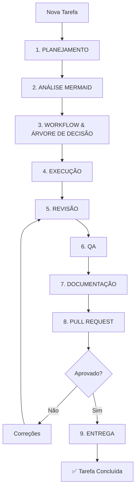
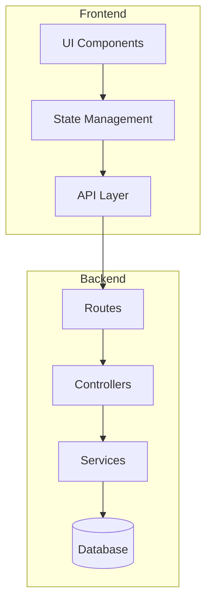
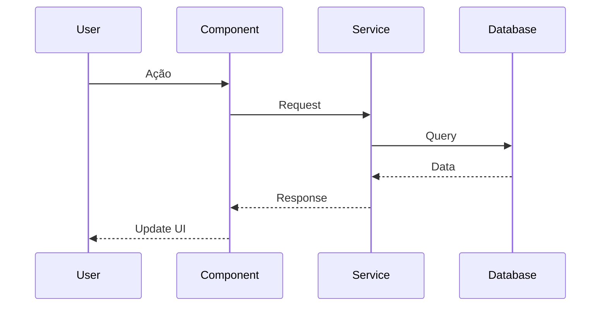
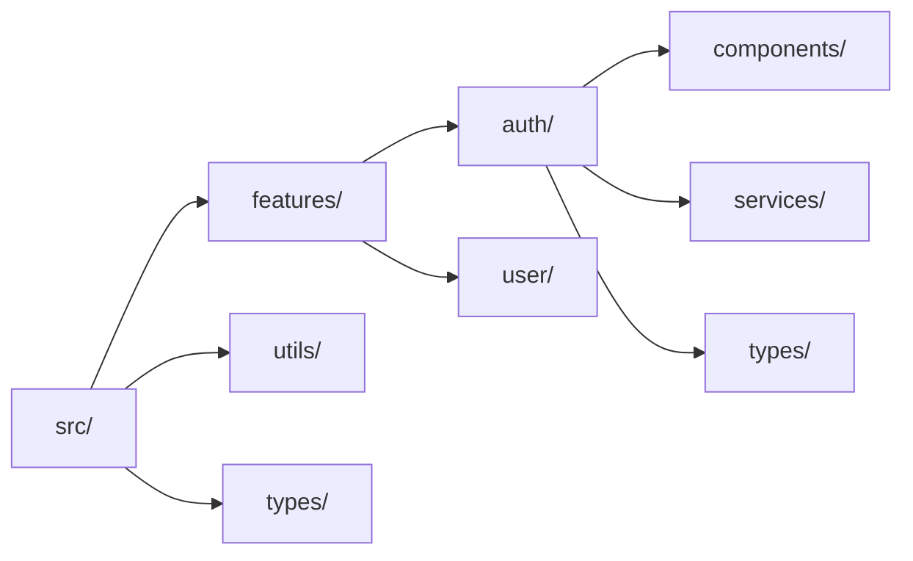
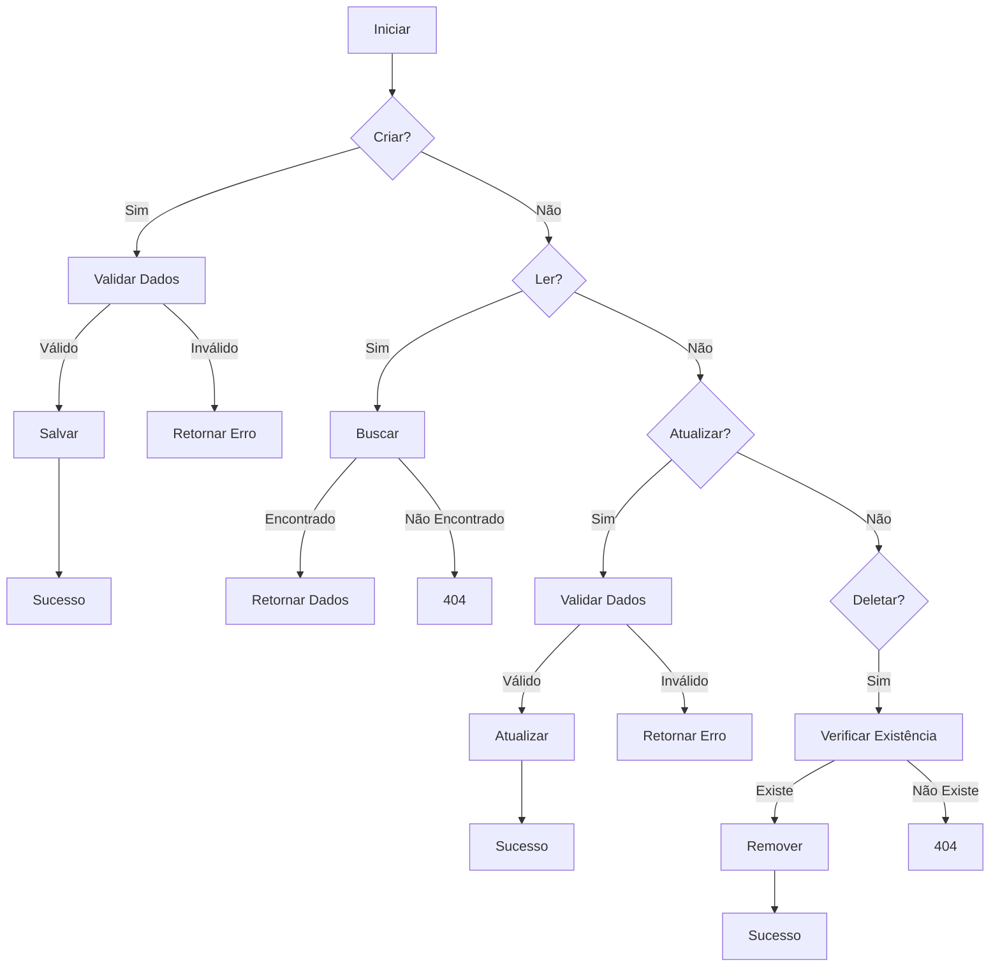
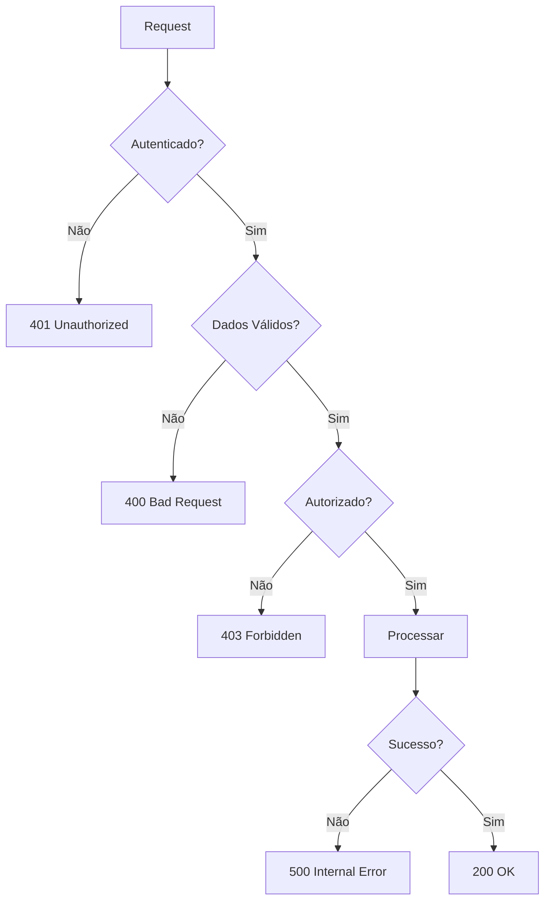
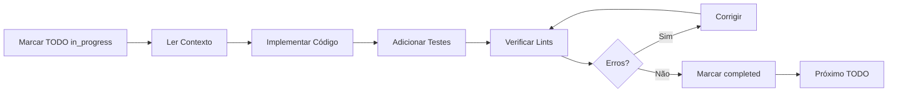
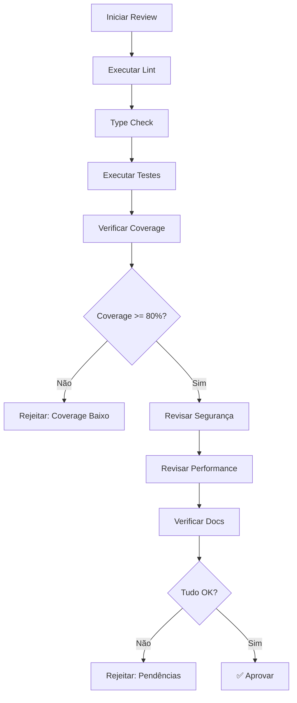
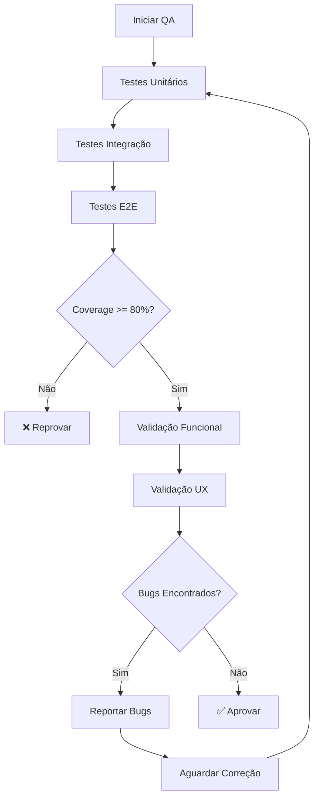
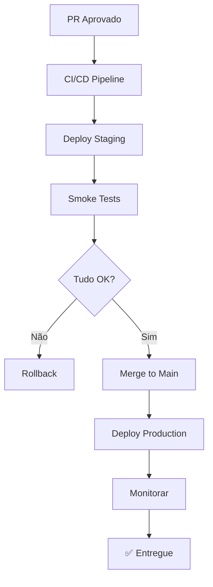

# Workflow Completo de Desenvolvimento

## Visão Geral

Este documento define o **workflow obrigatório** para todas as tarefas de desenvolvimento, garantindo conformidade com o Protocolo Agente-CTO e as 50 Regras de Ouro.

---

## Fluxo Completo



---

## Fase 1: PLANEJAMENTO

### Objetivo
Definir escopo, contexto e estratégia antes de qualquer código.

### Checklist

- [ ] Contexto técnico documentado
- [ ] Objetivo claro e mensurável
- [ ] Prompt de missão criado
- [ ] Escopo 100% fechado e versionado
- [ ] Subtarefas definidas (máx 6)
- [ ] Responsáveis atribuídos
- [ ] Dependências identificadas
- [ ] Links de documentação oficial salvos na base de conhecimento

### Ações

```typescript
// 1. Estudar documentações oficiais necessárias
await update_memory({
  action: "create",
  title: "Documentação React v18",
  knowledge_to_store: "Documentação oficial React v18: https://react.dev/. Principais mudanças: Concurrent rendering, Automatic batching, Transitions API, Suspense improvements."
});

// 2. Criar plano estruturado
await create_plan({
  name: "Implementação do Módulo X",
  overview: "Descrição executiva da implementação",
  plan: `# Plano Detalhado
  
## Contexto
[Descrever contexto técnico e de negócio]

## Objetivo
[Objetivo mensurável e claro]

## Escopo
### Incluído
- Item 1
- Item 2

### Excluído
- Item A
- Item B

## Dependências
- Biblioteca X v1.2.3
- API Y endpoint Z

## Documentações Oficiais
- React: https://react.dev/
- TypeScript: https://www.typescriptlang.org/docs/
- Zod: https://zod.dev/

## Subtarefas
[Ver TODOs abaixo]
`,
  todos: [
    { id: "1-schema", content: "Criar schema com Zod", status: "pending" },
    { id: "2-component", content: "Implementar componente", status: "pending" },
    { id: "3-tests", content: "Testes 80%+ coverage", status: "pending" },
    { id: "4-docs", content: "Documentar API", status: "pending" }
  ]
});
```

### Output Esperado

- ✅ Plano aprovado pelo Agente-CTO
- ✅ Base de conhecimento atualizada com docs oficiais
- ✅ TODOs criados e rastreáveis

---

## Fase 2: ANÁLISE MERMAID

### Objetivo
Visualizar arquitetura, fluxos e relações antes da implementação.

### Diagramas Obrigatórios

#### 1. Arquitetura de Componentes



#### 2. Fluxo de Dados



#### 3. Estrutura de Arquivos



### Ações

```typescript
await write({
  file_path: "docs/architecture/module-x-architecture.md",
  contents: `# Arquitetura do Módulo X

## Diagrama de Componentes
\`\`\`mermaid
[inserir diagrama]
\`\`\`

## Fluxo de Dados
\`\`\`mermaid
[inserir diagrama]
\`\`\`

## Estrutura de Arquivos
\`\`\`mermaid
[inserir diagrama]
\`\`\`
`
});
```

---

## Fase 3: WORKFLOW & ÁRVORE DE DECISÃO

### Objetivo
Definir fluxos lógicos e pontos de decisão críticos.

### Workflow CRUD Completo



### Árvore de Decisão



### Ações

```typescript
await write({
  file_path: "docs/workflows/module-x-workflow.md",
  contents: `# Workflow do Módulo X

## CRUD Completo
\`\`\`mermaid
[inserir workflow CRUD]
\`\`\`

## Árvore de Decisão
\`\`\`mermaid
[inserir árvore de decisão]
\`\`\`

## Casos de Uso

### Caso 1: Criar Novo Item
1. Validar dados de entrada (Zod)
2. Verificar duplicatas
3. Salvar no banco
4. Retornar item criado

### Caso 2: Atualizar Item
1. Verificar existência
2. Validar permissões
3. Validar novos dados
4. Atualizar banco
5. Retornar item atualizado
`
});
```

---

## Fase 4: EXECUÇÃO

### Objetivo
Implementar código completo, sem mocks ou placeholders.

### Checklist de Execução

- [ ] Código completo (Regra 11)
- [ ] CRUDs completos com tratamento de erros (Regra 12)
- [ ] Validação de schema com Zod (Regra 19)
- [ ] Nomes autoexplicativos (Regra 16)
- [ ] Documentação inline JSDoc (Regra 17)
- [ ] Tipos explícitos (TypeScript)
- [ ] Testes unitários e integração (Regra 20)

### Workflow de Implementação



### Exemplo de Implementação

```typescript
// 1. Marcar TODO como in_progress
await todo_write({
  merge: true,
  todos: [
    { id: "1-schema", status: "in_progress" }
  ]
});

// 2. Implementar schema
await write({
  file_path: "src/schemas/user.ts",
  contents: `import { z } from 'zod';

/**
 * Schema de validação para usuário
 * @see https://zod.dev
 */
export const userSchema = z.object({
  name: z.string().min(2, 'Nome deve ter no mínimo 2 caracteres'),
  email: z.string().email('Email inválido'),
  password: z.string()
    .min(8, 'Senha deve ter no mínimo 8 caracteres')
    .regex(/[A-Z]/, 'Senha deve conter letra maiúscula')
    .regex(/[0-9]/, 'Senha deve conter número'),
  role: z.enum(['admin', 'user']).default('user')
});

export type User = z.infer<typeof userSchema>;
`
});

// 3. Implementar testes
await write({
  file_path: "src/schemas/user.test.ts",
  contents: `import { userSchema } from './user';

describe('userSchema', () => {
  it('should validate correct user data', () => {
    const validUser = {
      name: 'John Doe',
      email: 'john@example.com',
      password: 'Password123',
      role: 'user'
    };
    
    const result = userSchema.parse(validUser);
    expect(result).toEqual(validUser);
  });
  
  it('should reject invalid email', () => {
    const invalidUser = {
      name: 'John Doe',
      email: 'invalid-email',
      password: 'Password123'
    };
    
    expect(() => userSchema.parse(invalidUser)).toThrow();
  });
  
  // Mais testes para cenários negativos e edge cases...
});
`
});

// 4. Verificar lints
const lints = await read_lints({
  paths: ["src/schemas/"]
});

// 5. Executar testes
await run_terminal_cmd({
  command: "npm test user.test.ts",
  is_background: false
});

// 6. Marcar como completed
await todo_write({
  merge: true,
  todos: [
    { id: "1-schema", status: "completed" },
    { id: "2-component", status: "in_progress" }
  ]
});
```

---

## Fase 5: REVISÃO

### Objetivo
Code review rigoroso seguindo checklist de qualidade.

### Checklist de Review (Regra 27)

#### Qualidade de Código
- [ ] Lint passou sem erros
- [ ] Type checking passou
- [ ] Sem `console.log` deixados
- [ ] Sem código comentado
- [ ] Sem TODOs ou FIXMEs
- [ ] Complexidade ciclomática aceitável
- [ ] Sem duplicações de código

#### Funcionalidade
- [ ] Implementação completa (sem mocks)
- [ ] CRUDs completos (C, R, U, D)
- [ ] Error handling robusto
- [ ] Validação de entrada (Zod)
- [ ] Edge cases tratados

#### Segurança
- [ ] Validação de input sanitizada
- [ ] Sem SQL injection vulnerabilities
- [ ] Sem exposição de secrets
- [ ] Autenticação/autorização implementada
- [ ] Rate limiting onde necessário

#### Performance
- [ ] Queries otimizadas
- [ ] Sem N+1 queries
- [ ] Caching implementado onde adequado
- [ ] Bundle size razoável

#### Documentação
- [ ] JSDoc em funções públicas
- [ ] README atualizado
- [ ] Comentários onde necessário
- [ ] Tipos documentados

### Workflow de Review



### Ações

```typescript
// Executar pipeline de review
await run_terminal_cmd({
  command: "npm run lint && npm run type-check && npm test -- --coverage",
  is_background: false,
  explanation: "Pipeline completo de validação"
});

// Gerar relatório de review
await write({
  file_path: "docs/reviews/module-x-review.md",
  contents: `# Code Review: Módulo X

## Data: ${new Date().toISOString()}
## Revisor: Agente-CTO
## Status: ✅ Aprovado

## Checklist

### Qualidade de Código
- [x] Lint passou
- [x] Type check passou
- [x] Sem console.log
- [x] Complexidade OK

### Funcionalidade
- [x] Implementação completa
- [x] CRUDs completos
- [x] Error handling

### Segurança
- [x] Validação de input
- [x] Sem vulnerabilidades
- [x] Auth implementada

### Performance
- [x] Queries otimizadas
- [x] Bundle size OK

### Documentação
- [x] JSDoc completo
- [x] README atualizado

## Métricas
- Coverage: 87%
- Lint errors: 0
- Type errors: 0
- Vulnerabilidades: 0

## Decisões Técnicas (ADR)
[Link para ADR]

## Aprovação
✅ Código aprovado para próxima fase (QA)
`
});
```

---

## Fase 6: QA (Quality Assurance)

### Objetivo
Validação completa de funcionalidade, UX e consistência.

### Checklist de QA (Regra 31-40)

#### Testes Automatizados
- [ ] Testes unitários (80%+ coverage)
- [ ] Testes de integração
- [ ] Testes E2E (fluxos críticos)
- [ ] Testes de regressão

#### Cenários de Teste
- [ ] Cenários positivos (happy path)
- [ ] Cenários negativos (erros esperados)
- [ ] Edge cases (limites)
- [ ] Casos de uso reais

#### Validação Funcional
- [ ] Funcionalidade conforme especificação
- [ ] Workflows Mermaid seguidos
- [ ] CRUDs completos funcionando
- [ ] Error messages claros

#### UX/UI
- [ ] Interface responsiva
- [ ] Acessibilidade (WCAG)
- [ ] Loading states
- [ ] Error states
- [ ] Empty states

### Workflow de QA



### Ações

```typescript
// 1. Executar suite completa de testes
await run_terminal_cmd({
  command: "npm test -- --coverage --verbose",
  is_background: false
});

// 2. Executar testes E2E
await run_terminal_cmd({
  command: "npm run test:e2e",
  is_background: false
});

// 3. Gerar relatório de QA
await write({
  file_path: "docs/qa/module-x-qa-report.md",
  contents: `# Relatório de QA: Módulo X

## Data: ${new Date().toISOString()}
## QA Engineer: Agente-QA
## Status: ✅ Aprovado

## Testes Executados

### Unitários
- Total: 45 testes
- Passou: 45
- Falhou: 0
- Coverage: 87%

### Integração
- Total: 12 testes
- Passou: 12
- Falhou: 0

### E2E
- Total: 5 fluxos
- Passou: 5
- Falhou: 0

## Bugs Encontrados
Nenhum bug crítico ou bloqueante encontrado.

## Cenários Testados

### Positivos
- [x] Criar usuário com dados válidos
- [x] Login com credenciais corretas
- [x] Atualizar perfil
- [x] Logout

### Negativos
- [x] Criar usuário com email duplicado
- [x] Login com senha incorreta
- [x] Acesso sem autenticação

### Edge Cases
- [x] Nome muito longo
- [x] Email com caracteres especiais
- [x] Múltiplas requisições simultâneas

## Aprovação
✅ Módulo aprovado para produção
`
});
```

---

## Fase 7: DOCUMENTAÇÃO

### Objetivo
Documentação completa e versionada (Regra 44).

### Documentação Obrigatória

#### 1. README do Módulo

```typescript
await write({
  file_path: "src/features/module-x/README.md",
  contents: `# Módulo X

## Descrição
[Descrição clara do que o módulo faz]

## Instalação
\`\`\`bash
npm install
\`\`\`

## Uso

### Básico
\`\`\`typescript
import { ModuleX } from './module-x';

const module = new ModuleX();
module.doSomething();
\`\`\`

### Avançado
[Exemplos avançados]

## API

### \`doSomething()\`
Descrição da função.

**Parâmetros:**
- \`param1\` (string): Descrição
- \`param2\` (number): Descrição

**Retorno:**
- \`Promise<Result>\`: Descrição

**Exemplo:**
\`\`\`typescript
const result = await module.doSomething('test', 123);
\`\`\`

## Configuração
[Opções de configuração]

## Testes
\`\`\`bash
npm test
\`\`\`

## Documentação Adicional
- [Arquitetura](../../docs/architecture/module-x-architecture.md)
- [Workflows](../../docs/workflows/module-x-workflow.md)
- [ADR](../../docs/adr/001-module-x-decisions.md)
`
});
```

#### 2. ADR (Architecture Decision Record)

```typescript
await write({
  file_path: "docs/adr/001-module-x-technology-choices.md",
  contents: `# ADR 001: Escolhas Tecnológicas do Módulo X

## Status
Aceito

## Contexto
[Descrever o contexto da decisão]

## Decisão
Decidimos usar:
- React 18 para UI
- Zod para validação
- TypeScript para type safety

## Consequências

### Positivas
- Type safety completo
- Validação robusta
- Performance melhorada

### Negativas
- Curva de aprendizado inicial
- Bundle size ligeiramente maior

## Alternativas Consideradas
1. **Yup para validação**
   - Prós: Mais maduro
   - Contras: Menos performático
   
2. **JavaScript puro**
   - Prós: Simplicidade
   - Contras: Sem type safety

## Referências
- React Docs: https://react.dev/
- Zod Docs: https://zod.dev/
- TypeScript Docs: https://www.typescriptlang.org/docs/

## Data
${new Date().toISOString()}

## Autor
Agente-CTO
`
});
```

#### 3. CHANGELOG

```typescript
await write({
  file_path: "CHANGELOG.md",
  contents: `# Changelog

## [1.0.0] - ${new Date().toISOString().split('T')[0]}

### Added
- Módulo X implementado
- Validação com Zod
- Testes com 87% coverage
- Documentação completa

### Changed
- N/A

### Fixed
- N/A

### Security
- Validação de input implementada
- Rate limiting adicionado
`
});
```

---

## Fase 8: PULL REQUEST

### Objetivo
Criar PR estruturado e completo para revisão final.

### Template de PR

```typescript
await write({
  file_path: ".github/PULL_REQUEST_TEMPLATE.md",
  contents: `# Pull Request

## Descrição
[Descrição clara das mudanças]

## Tipo de Mudança
- [ ] 🐛 Bug fix (mudança que corrige um issue)
- [ ] ✨ Feature (mudança que adiciona funcionalidade)
- [ ] 💥 Breaking change (correção ou feature que quebra compatibilidade)
- [ ] 📝 Documentação
- [ ] ♻️ Refatoração
- [ ] ⚡ Performance

## Issue Relacionada
Closes #[número]

## Mudanças Implementadas
- Mudança 1
- Mudança 2
- Mudança 3

## Checklist de Desenvolvimento

### Código
- [ ] Código completo (sem mocks/placeholders)
- [ ] CRUDs completos com error handling
- [ ] Validação Zod implementada
- [ ] Documentação inline (JSDoc)
- [ ] Tipos TypeScript completos

### Testes
- [ ] Testes unitários (80%+ coverage)
- [ ] Testes de integração
- [ ] Testes E2E (se aplicável)
- [ ] Cenários positivos testados
- [ ] Cenários negativos testados
- [ ] Edge cases testados

### Qualidade
- [ ] Lint passou (0 erros)
- [ ] Type check passou (0 erros)
- [ ] Build passou
- [ ] Sem console.log deixados
- [ ] Complexidade aceitável

### Documentação
- [ ] README atualizado
- [ ] Diagramas Mermaid criados
- [ ] ADR criado para decisões técnicas
- [ ] CHANGELOG atualizado
- [ ] Comentários onde necessário

### Segurança
- [ ] Validação de input
- [ ] Sem vulnerabilidades conhecidas
- [ ] Secrets não expostos
- [ ] Auth/authz implementada

### Performance
- [ ] Queries otimizadas
- [ ] Bundle size razoável
- [ ] Caching implementado (se aplicável)

## Screenshots/Vídeos
[Se aplicável]

## Notas para Revisores
[Informações adicionais para facilitar review]

## Documentação
- [Arquitetura](docs/architecture/module-x-architecture.md)
- [Workflow](docs/workflows/module-x-workflow.md)
- [ADR](docs/adr/001-module-x-decisions.md)
- [QA Report](docs/qa/module-x-qa-report.md)

## Aprovações Necessárias
- [ ] Code Review (Agente-Revisor)
- [ ] QA (Agente-QA)
- [ ] CTO (Agente-CTO)
`
});
```

### Criar PR via Git

```typescript
// 1. Criar branch
await run_terminal_cmd({
  command: "git checkout -b feature/module-x",
  is_background: false,
  required_permissions: ["git_write"]
});

// 2. Adicionar arquivos
await run_terminal_cmd({
  command: "git add .",
  is_background: false,
  required_permissions: ["git_write"]
});

// 3. Commit
await run_terminal_cmd({
  command: `git commit -m "feat: implement module X

- Complete CRUD implementation
- Zod validation
- 87% test coverage
- Full documentation

Closes #123"`,
  is_background: false,
  required_permissions: ["git_write"]
});

// 4. Push
await run_terminal_cmd({
  command: "git push origin feature/module-x",
  is_background: false,
  required_permissions: ["git_write", "network"]
});

// 5. Criar PR (via GitHub CLI ou API)
await run_terminal_cmd({
  command: `gh pr create --title "feat: Implement Module X" --body-file .github/PULL_REQUEST_TEMPLATE.md`,
  is_background: false,
  required_permissions: ["network"]
});
```

---

## Fase 9: ENTREGA

### Objetivo
Merge final e comunicação de conclusão.

### Checklist de Entrega

- [ ] PR aprovado por todos os revisores
- [ ] CI/CD passou completamente
- [ ] Deploy realizado (staging)
- [ ] Smoke tests passaram
- [ ] Documentação publicada
- [ ] Stakeholders notificados

### Workflow de Entrega



### Ações Finais

```typescript
// 1. Merge PR
await run_terminal_cmd({
  command: "gh pr merge --squash --delete-branch",
  is_background: false,
  required_permissions: ["git_write", "network"]
});

// 2. Atualizar memória com aprendizados
await update_memory({
  action: "create",
  title: "Aprendizados: Módulo X",
  knowledge_to_store: `Implementação do Módulo X concluída com sucesso. 
  
Principais aprendizados:
- Zod validation é muito eficiente para schemas complexos
- Testes E2E ajudaram a identificar edge cases não cobertos
- Documentação detalhada facilitou onboarding

Métricas finais:
- Coverage: 87%
- 0 bugs em produção após 1 semana
- Performance dentro do esperado

Referências usadas:
- React: https://react.dev/
- Zod: https://zod.dev/
- TypeScript: https://www.typescriptlang.org/docs/`
});

// 3. Gerar relatório final
await write({
  file_path: "docs/delivery/module-x-delivery-report.md",
  contents: `# Relatório de Entrega: Módulo X

## Data: ${new Date().toISOString()}
## Status: ✅ Entregue

## Resumo
Módulo X implementado e entregue com sucesso.

## Métricas Finais
- **Coverage**: 87%
- **Lint errors**: 0
- **Type errors**: 0
- **Bugs encontrados em QA**: 0
- **Performance**: Dentro do esperado
- **Tempo de desenvolvimento**: 3 dias

## Entregas
- [x] Código completo
- [x] Testes (80%+)
- [x] Documentação
- [x] Diagramas Mermaid
- [x] ADR
- [x] PR aprovado e merged
- [x] Deploy em produção

## Documentação
- [README](../features/module-x/README.md)
- [Arquitetura](../architecture/module-x-architecture.md)
- [Workflows](../workflows/module-x-workflow.md)
- [ADR](../adr/001-module-x-decisions.md)
- [QA Report](../qa/module-x-qa-report.md)

## Referências Utilizadas
- React v18: https://react.dev/
- TypeScript: https://www.typescriptlang.org/docs/
- Zod: https://zod.dev/

## Próximos Passos
- Monitorar performance em produção
- Coletar feedback de usuários
- Iterar se necessário
`
});
```

---

## Auditoria e Conformidade

### Checklist Final do Agente-CTO

```typescript
const finalAudit = {
  task: "Módulo X",
  status: "Entregue",
  protocol_verification: "Completo",
  checked_rules: 50,
  missing_items: [],
  phases_completed: [
    { phase: "Planejamento", status: "✅" },
    { phase: "Análise Mermaid", status: "✅" },
    { phase: "Workflow & Decisões", status: "✅" },
    { phase: "Execução", status: "✅" },
    { phase: "Revisão", status: "✅" },
    { phase: "QA", status: "✅" },
    { phase: "Documentação", status: "✅" },
    { phase: "Pull Request", status: "✅" },
    { phase: "Entrega", status: "✅" }
  ],
  quality_metrics: {
    coverage: "87%",
    lintErrors: 0,
    typeErrors: 0,
    bugs: 0
  },
  authorized_by: "Agente-CTO",
  timestamp: new Date().toISOString()
};
```

---

## Exemplo Completo de Execução

Ver [exemplo-completo.md](./exemplo-completo.md) para um walkthrough passo-a-passo de implementação seguindo este workflow.

---

## Próximos Passos

- [Exemplo Completo de Implementação →](./exemplo-completo.md)
- [Base de Conhecimento →](../reference/base-conhecimento.md)
- [Templates →](../reference/templates.md)

