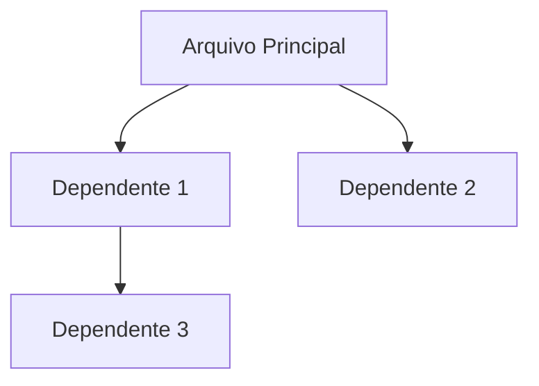
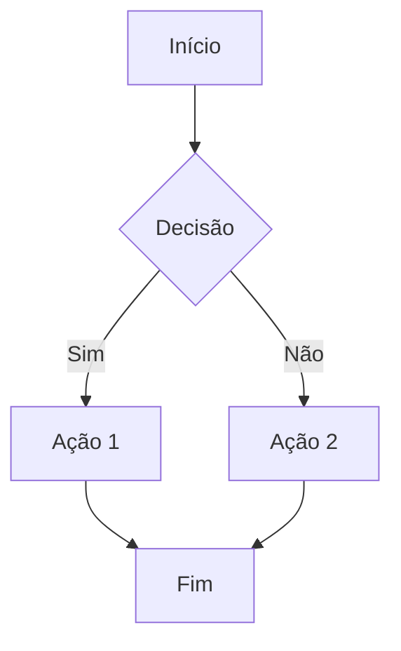

# Pull Request

## 📋 Descrição

<!-- Descreva CLARAMENTE o que foi feito e por quê -->

### Contexto e Objetivo
<!-- Explique o problema que esta PR resolve -->

### Solução Implementada
<!-- Descreva a solução técnica adotada -->

---

## 🎯 Tipo de Mudança

- [ ] `feat:` Nova funcionalidade
- [ ] `fix:` Correção de bug
- [ ] `refactor:` Refatoração (sem mudança de comportamento)
- [ ] `docs:` Atualização de documentação
- [ ] `test:` Adição/correção de testes
- [ ] `perf:` Melhoria de performance
- [ ] `chore:` Manutenção (deps, build, config)
- [ ] `security:` Correção de segurança

---

## 📦 Escopo

### Módulos Afetados
<!-- Liste os módulos/áreas impactadas -->
- [ ] Backend
- [ ] Frontend
- [ ] Database
- [ ] Exchanges
- [ ] Trading Bots
- [ ] Authentication
- [ ] Outro: _______

### Arquivos Principais
<!-- Liste os arquivos mais importantes modificados -->
1. `path/to/file1.ts` - Descrição
2. `path/to/file2.ts` - Descrição

---

## ✅ Checklist de Qualidade (Regras 21-30)

### Código
- [ ] Nenhum mock, placeholder ou código incompleto (Regra 11)
- [ ] Código idempotente e seguro (Regra 13)
- [ ] Dependências auditadas e atualizadas (Regra 14)
- [ ] Nomes autoexplicativos (sem abreviações) (Regra 16)
- [ ] Documentação JSDoc/NatSpec completa (Regra 17)
- [ ] Validação Zod implementada (Regra 19)

### Testes
- [ ] Testes unitários adicionados/atualizados (Regra 20)
- [ ] Testes de integração executados (Regra 31)
- [ ] Coverage ≥ 80% (backend) / ≥ 95% (contratos) (Regra 31)
- [ ] Cenários positivos, negativos e edge cases (Regra 33)

### Validações Técnicas
- [ ] `bun run lint` - PASSOU ✅
- [ ] `bun run typecheck` - PASSOU ✅
- [ ] `bun run build` - PASSOU ✅
- [ ] `bun test` - PASSOU ✅

### Segurança
- [ ] Nenhuma chave/senha hardcoded
- [ ] Validação de inputs implementada
- [ ] Auditoria de segurança executada
- [ ] Vulnerabilidades conhecidas verificadas

### Documentação
- [ ] README atualizado (se aplicável)
- [ ] ADR criado para decisões arquiteturais (Regra 10)
- [ ] Workflow Mermaid criado/atualizado (Regra 5)
- [ ] Changelog atualizado (Regra 47)

---

## 🔍 Análise de Dependências (Regra 53)

### Arquivos Modificados e Dependentes
<!-- Liste arquivos modificados e seus dependentes identificados via grep -->

**Arquivo:** `path/to/modified-file.ts`
- Dependentes identificados:
  - [ ] `file1.ts` - Analisado ✅ / Atualizado ✅
  - [ ] `file2.ts` - Analisado ✅ / Atualizado ✅

### Grafo de Dependências
<!-- Insira diagrama Mermaid do grafo de dependências se houver mudanças complexas -->



### Validação de Consistência
- [ ] `grep` executado para validar referências
- [ ] Nenhuma referência quebrada encontrada
- [ ] Imports/requires validados
- [ ] Links de documentação verificados

---

## 🧪 Testes

### Como Testar
<!-- Forneça passos claros para testar as mudanças -->

1. Execute `bun install`
2. Execute `bun run dev`
3. Teste endpoint/feature X
4. Verifique comportamento Y

### Resultados dos Testes

```bash
# Cole aqui a saída dos testes
bun test
```

**Coverage Report:**
- Lines: X%
- Branches: X%
- Functions: X%
- Statements: X%

---

## 📊 Workflow & Diagramas

### Workflow da Feature (Regra 41-42)



### Árvore de Decisão
<!-- Descreva os fluxos de decisão implementados -->

---

## 🔗 Issues Relacionadas

Closes #ISSUE_NUMBER
Relates to #ISSUE_NUMBER

---

## 📝 Notas Adicionais

### Breaking Changes
<!-- Liste qualquer breaking change -->
- [ ] Nenhum breaking change
- [ ] Breaking changes (liste abaixo):
  - Mudança 1: Descrição e migração necessária
  - Mudança 2: Descrição e migração necessária

### Migrações/Seeds
<!-- Se houver mudanças no banco de dados -->
- [ ] Nenhuma migração necessária
- [ ] Migração criada: `migrations/XXXX_description.sql`
- [ ] Seeds atualizados

### Deploy Notes
<!-- Instruções especiais para deploy -->
- [ ] Nenhuma ação manual necessária
- [ ] Ações manuais:
  1. Passo 1
  2. Passo 2

### Screenshots/GIFs
<!-- Se aplicável, adicione capturas de tela -->

---

## 👥 Revisores

### Revisores Obrigatórios (Regra 21-22)
- [ ] @reviewer1 - Code Review
- [ ] @reviewer2 - Security Review
- [ ] @reviewer3 - Architecture Review (contratos)

### Aprovação do Agente-CTO
- [ ] Protocolo completo verificado
- [ ] Checklist das 53 Regras validado
- [ ] Auditoria técnica gerada

---

## 🔐 Assinaturas Digitais (Regra 28)

**Autor:** @username
**Data:** YYYY-MM-DD
**Revisores:**
- @reviewer1 - Aprovado em YYYY-MM-DD
- @reviewer2 - Aprovado em YYYY-MM-DD

---

## 📊 Auditoria Técnica

```json
{
  "task": "Feature/Fix Description",
  "status": "Aguardando Revisão",
  "protocol_verification": "Completo",
  "checked_rules": 53,
  "missing_items": [],
  "next_steps": ["Code Review", "QA", "Merge"],
  "authorized_by": "Agente-CTO",
  "timestamp": "YYYY-MM-DD HH:MM:SS"
}
```

---

**✅ Esta PR segue rigorosamente as 53 Regras de Ouro do AGENTS.md**

