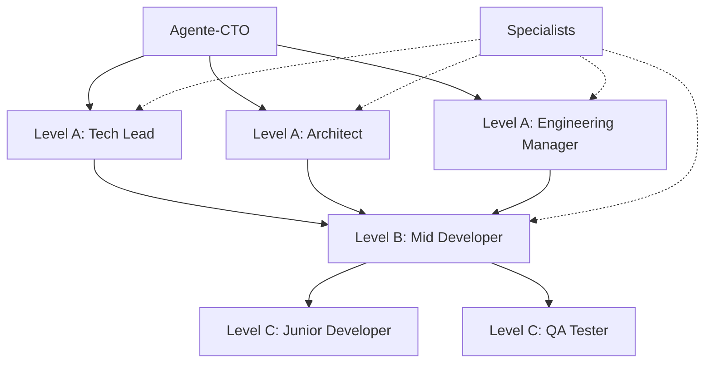
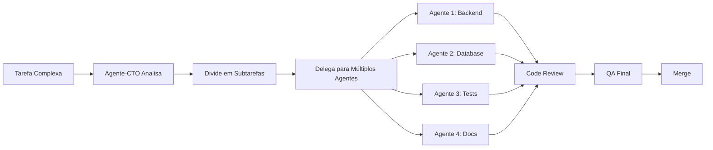

# CLAUDE.md

This file provides guidance to Claude Code (claude.ai/code) when working with code in this repository.

## ⚠️ IMPORTANTE: Siga o AGENTS.md

**ANTES de iniciar qualquer tarefa de desenvolvimento**, você DEVE ler e seguir o **[AGENTS.md](./AGENTS.md)**.

O `AGENTS.md` contém:
- ✅ **53 Regras de Ouro** obrigatórias para todo desenvolvimento
- ✅ **Protocolos de Governança** do Agente-CTO
- ✅ **Guidelines Web3/Blockchain** específicas para o projeto
- ✅ **Padrões de código** e convenções
- ✅ **Processos de segurança** críticos
- ✅ **REGRA CRÍTICA**: Análise de dependências antes de modificar qualquer arquivo

**Nenhuma tarefa deve iniciar sem validação completa do Agente-CTO conforme protocolos do AGENTS.md.**

---

## 🤝 TRABALHO EM EQUIPE - AGENTES EM PARALELO

### Princípios de Colaboração

1. **SEMPRE trabalhe em EQUIPE** - Nunca trabalhe sozinho em tarefas complexas
2. **Consulte especialistas** quando trabalhar com tecnologias específicas
3. **Delegue apropriadamente** baseado na hierarquia e expertise
4. **Escale quando bloqueado** - Não tente resolver tudo sozinho
5. **Documente decisões** em TEAM_DECISIONS.md
6. **Atualize progresso** regularmente

### Hierarquia de Agentes



### Quando Consultar Especialistas

| Tecnologia | Especialista |
|------------|--------------|
| CCXT / Exchanges | `/agent ccxt-specialist` |
| Elysia.js | `/agent elysia-specialist` |
| Drizzle ORM | `/agent drizzle-specialist` |
| Better Auth | `/agent better-auth-specialist` |
| PostgreSQL | `/agent postgresql-specialist` |
| Redis | `/agent redis-specialist` |
| TimescaleDB | `/agent timescaledb-specialist` |
| TypeScript | `/agent typescript-specialist` |
| Zod | `/agent zod-specialist` |

### Workflow de Trabalho em Paralelo



### Regras de Paralelização

1. **Identifique dependências** entre subtarefas
2. **Tarefas independentes** executam em paralelo
3. **Tarefas dependentes** executam em sequência
4. **Sincronize resultados** antes de integrar
5. **Code review cruzado** entre agentes

---

## 🛠️ USO DE COMANDOS PERSONALIZADOS

### Comandos Disponíveis

Temos **13 comandos** na pasta `.claude/commands/`. **USE-OS ATIVAMENTE!**

#### 🎯 Quando Usar Cada Comando

**ANTES de começar qualquer desenvolvimento:**
- `/agent-cto-validate` - Validar protocolo completo (53 Regras)
- `/project-init` - Inicializar novo módulo/feature

**DURANTE o desenvolvimento:**
- `/dev-analyze-dependencies` - Antes de modificar arquivo (Regra 53)
- `/exchange-test` - Testar integração CCXT
- `/strategy-validate` - Validar estratégia de trading

**ANTES de backtest/deploy:**
- `/backtest-run` - Executar backtest completo
- `/project-health-check` - Verificar saúde do projeto

**DURANTE code review:**
- `/dev-code-review` - Review profundo seguindo regras

### Como Executar Comandos

```bash
# No Claude Code, digite:
/agent-cto-validate

# Ou especifique contexto:
/exchange-test Binance BTC/USDT

# Para análise de dependências:
/dev-analyze-dependencies src/services/exchange.service.ts
```

### Quick Links
- 📘 [AGENTS.md](./AGENTS.md) - Guia principal (LEIA PRIMEIRO)
- 📊 [IMPLEMENTACAO.md](./docs/IMPLEMENTACAO.md) - Status de implementação (5% completo)
- 🔄 [MIGRATION_WEB3_TO_TRADING.md](./docs/MIGRATION_WEB3_TO_TRADING.md) - Migração Web3→Trading
- 📖 [AGENTS_README.md](./docs/AGENTS_README.md) - Guia rápido
- ✅ [AGENTS_ADAPTATION_APPROVAL.json](./docs/AGENTS_ADAPTATION_APPROVAL.json) - Relatório de aprovação

---

## Project Overview

**Beecripto** is a cryptocurrency/blockchain project built with:
- **Backend**: Elysia.js framework with Bun runtime (TypeScript)
- **Architecture**: Monorepo structure with separate backend service
- **Focus**: Security-first Web3 development

## Repository Structure

```
beecripto/
├── backend/          # Elysia backend API service
│   ├── src/
│   │   └── index.ts  # Main application entry point
│   ├── package.json
│   └── tsconfig.json
├── .claude/          # Claude Code customizations (commands, hooks)
└── docs/             # Project documentation
```

## Development Commands

### Backend (Elysia with Bun)

**Working directory**: `backend/`

- **Start dev server**: `bun run dev`
  - Runs with hot reload on file changes
  - Server starts at http://localhost:3000

- **Run directly**: `bun run src/index.ts`
  - Executes without watch mode

- **Install dependencies**: `bun install`

## TypeScript Configuration

The backend uses strict TypeScript settings:
- Target: ES2021
- Module: ES2022
- Strict mode enabled
- Bun types included

## Custom Slash Commands

This project has several custom slash commands configured in `.claude/commands/`:

### Available Commands

**See** [.claude/README.md](.claude/README.md) **for complete list of 34 commands.**

**Most used:**
- `/agent-cto-validate` - Validate task with CTO protocols
- `/project-init` - Initialize new module/feature
- `/dev-code-review` - Deep code review
- `/strategy-validate` - Validate trading strategy
- `/backtest-run` - Run backtesting
- `/exchange-test` - Test CCXT integration

## Architecture Notes

### Backend (Elysia)
- Entry point: `backend/src/index.ts`
- Framework: Elysia - Fast and ergonomic web framework for Bun
- Runtime: Bun - All-in-one JavaScript runtime with native TypeScript support
- Default server: Runs on port 3000

## Planned Structure

As the project develops, additional directories will include:
```
strategies/    # Trading strategies
indicators/    # Technical indicators
backtest/      # Backtesting framework
contracts/     # Database contracts/interfaces
scripts/       # Utility scripts
test/          # Test files
```

## Development Workflow

When working on this project:
1. Backend development in `backend/` with `bun run dev`
2. Use `/agent-cto-validate` before starting any task
3. Use `/dev-analyze-dependencies` before modifying files
4. Test exchanges with `/exchange-test`
5. Validate strategies with `/strategy-validate`
6. Run backtests with `/backtest-run`
7. Health check with `/project-health-check`

## Additional Resources

- Plugin recommendations: `docs/PLUGINS_RECOMENDADOS.md`
- Claude Code setup guide: `docs/CLAUDE_CODE_SETUP.md`

---

## 🎯 Workflow Obrigatório (Agente-CTO)

Antes de iniciar qualquer desenvolvimento, siga este protocolo do `AGENTS.md`:

### 1. Planejamento (Regras 1-10)
```markdown
[ ] Definir contexto e objetivo técnico
[ ] Criar workflow Mermaid
[ ] Quebrar em ≤6 subtarefas
[ ] **ANÁLISE DE DEPENDÊNCIAS** (grep arquivos linkados)
[ ] **MAPEAR GRAFO DE DEPENDÊNCIAS**
[ ] Validar padrões de código
```

### 2. Análise de Dependências (CRÍTICO)
```bash
# Antes de modificar QUALQUER arquivo:
grep -r "nome-do-arquivo" . --exclude-dir=node_modules

# Ler todos os arquivos encontrados
# Avaliar impacto das mudanças
# Planejar atualizações em cascata
# Garantir mudança atômica
```

### 3. Desenvolvimento (Regras 11-20)
```markdown
[ ] Zero mocks/placeholders
[ ] Código completo e testado
[ ] Documentação JSDoc/NatSpec
[ ] Validação com Zod
[ ] Coverage ≥80% (backend) / ≥95% (contratos)
```

### 4. Validação Pós-Modificação
```bash
# Após modificações:
grep -r "referencias" . --exclude-dir=node_modules
bun test
bun run lint
bun run typecheck
```

### 5. Code Review (Regras 21-30)
```markdown
[ ] 2+ revisores (contratos)
[ ] Security scan passou
[ ] Gas report OK (contratos)
[ ] CI/CD verde
```

### ⚠️ Zero Tolerância
- Referências quebradas
- Imports quebrados
- Links de documentação inválidos
- Testes falhando
- Vulnerabilidades de segurança

**Lembre-se**: No blockchain, não há "quase certo" — ou está seguro, ou não está.

---

---

## 🔍 PROTOCOLOS OBRIGATÓRIOS

### 1. Auto-Validação (3 Perguntas Críticas)

**Antes de completar QUALQUER tarefa**:

❓ **#1: Excelência Técnica** - "Este trabalho atende ao MAIS ALTO padrão?"
❓ **#2: Conformidade** - "Segui RIGOROSAMENTE todos os protocolos?"
❓ **#3: Impacto** - "Considerei TODAS as consequências?"

**Se QUALQUER = NÃO**: 🚫 Corrija antes de prosseguir

→ [.claude/AGENT_SELF_VALIDATION_PROTOCOL.md](.claude/AGENT_SELF_VALIDATION_PROTOCOL.md)

---

### 2. Consulta de Documentação Oficial

**5 Momentos Obrigatórios**:
1. ✅ Antes de iniciar desenvolvimento
2. ✅ Durante planejamento
3. ✅ Durante desenvolvimento (cada método)
4. ✅ Quando encontrar problemas
5. ✅ Após implementação

**Princípio**: *"Documentação oficial > Memória do agente"*

→ [.claude/DOCUMENTATION_CONSULTATION_PROTOCOL.md](.claude/DOCUMENTATION_CONSULTATION_PROTOCOL.md)

---

### 3. Resolução de Problemas Eficiente

**Classificação por Score (4-15)**:
- L1 (4-6): 1 agente, <15min
- L2 (7-9): 1-2 agentes, <1h
- L3 (10-12): 2-4 paralelos, <4h
- L4 (13+): War Room, <8h

**Score = Módulos + Domínios + Reprodução + Impacto**

→ [.claude/PROBLEM_SOLVING_WORKFLOW.md](.claude/PROBLEM_SOLVING_WORKFLOW.md)

---

## 📚 Hierarquia de Documentação

1. **AGENTS.md** ← Fonte única de verdade (53 Regras)
2. **CLAUDE.md** ← Este arquivo (instruções para agentes)
3. **.claude/** ← Protocolos, comandos, hooks
4. docs/ ← Documentação técnica
5. README.md ← Informações do projeto
