# RELATÓRIO DE ANÁLISE DE DEPENDÊNCIAS - BeeCripto
## Análise Completa Conforme Regra 53 do AGENTS.md

**Data**: 2025-10-17
**Thoroughness Level**: Very Thorough
**Arquivos Analisados**: 415 arquivos TypeScript
**Módulos Principais**: 28 módulos
**Módulos Críticos para Implementação**: 12 módulos

---

## 1. VISÃO GERAL DO PROJETO

### 1.1 Estrutura do Monorepo

```
BotCriptoFy2/
├── backend/           # API Elysia + Bun (415 arquivos TS)
│   ├── src/
│   │   ├── modules/   # 28 módulos de domínio
│   │   ├── db/        # Conexão, migrations, seeds
│   │   ├── utils/     # Logger, Redis, Errors
│   │   ├── cache/     # Sistema de cache Redis
│   │   ├── monitoring/# Métricas Prometheus
│   │   └── middleware/# Guards, Logger, Error
│   └── scripts/       # Backup, seeds, migrations
├── frontend/          # Astro + React
├── tests/             # Testes unitários e integração
└── docs/              # Documentação técnica
```

### 1.2 Stack Tecnológico

- **Runtime**: Bun 1.3+
- **Backend**: Elysia.js (framework web)
- **Database**: PostgreSQL + TimescaleDB (hypertables)
- **Cache**: Redis + ioredis
- **ORM**: Drizzle ORM
- **Auth**: Better-Auth
- **Exchange API**: CCXT (105 exchanges)
- **Monitoring**: Prometheus + Winston
- **Validation**: Zod

---

## 2. MÓDULOS DO SISTEMA (28 MÓDULOS)

### 2.1 Módulos Core (Infraestrutura)

| Módulo | Arquivos | Responsabilidade | Dependências Externas |
|--------|----------|------------------|----------------------|
| **auth** | 11 | Autenticação, sessões, 2FA | Better-Auth, JWT |
| **security** | 5 | RBAC, permissões, roles | auth |
| **tenants** | 5 | Multi-tenancy, membros | auth |
| **audit** | 7 | Logs de auditoria, compliance | auth, tenants |
| **rate-limiting** | 5 | Rate limiting por usuário/tenant | Redis, security |
| **configurations** | 5 | Configurações do sistema | auth |
| **notifications** | 11 | Notificações multi-canal | auth, tenants |

### 2.2 Módulos Trading (CRÍTICOS)

| Módulo | Arquivos | Responsabilidade | Dependências Críticas |
|--------|----------|------------------|----------------------|
| **exchanges** | 8 | Conexões CCXT, 105 exchanges | auth, tenants, CCXT |
| **market-data** | 10 | OHLCV, orderbook, trades, tickers | exchanges, CCXT |
| **orders** | 10 | 8 tipos de ordem, execução | exchanges, market-data |
| **positions** | 5 | Posições abertas, P&L, margin | orders, exchanges |
| **strategies** | 5 | Estratégias, sinais, backtest | orders, market-data |
| **risk** | 5 | Gestão de risco, VaR, exposure | positions, orders |
| **bots** | 5 | Trading bots automatizados | strategies, orders, risk |

### 2.3 Módulos Financeiros

| Módulo | Arquivos | Responsabilidade | Dependências |
|--------|----------|------------------|--------------|
| **banco** | 9 | Wallets multi-asset, portfólio | auth, tenants, audit |
| **financial** | 67 | Invoices, expenses, ledger, tax | auth, tenants, audit, banco |
| **subscriptions** | 18 | Planos, quotas, billing | auth, tenants, financial |
| **p2p-marketplace** | 23 | P2P trading, escrow, disputes | auth, tenants, audit, banco |

### 2.4 Módulos Business

| Módulo | Arquivos | Responsabilidade | Dependências |
|--------|----------|------------------|--------------|
| **users** | 6 | Perfis de usuário | auth |
| **departments** | 11 | Departamentos, membros | auth, tenants |
| **documents** | 15 | Gestão documental, pastas | auth, tenants |
| **marketing** | 14 | Campanhas, leads, analytics | auth, tenants |
| **sales** | 26 | CRM, pipeline, forecasting | auth, tenants, users |
| **support** | 25 | Tickets, SLA, knowledge base | auth, tenants, users |
| **affiliate** | 15 | Programa de afiliados | auth, tenants, subscriptions |
| **mmn** | 16 | Multi-level marketing | auth, tenants, affiliate |
| **social-trading** | 23 | Copy trading, signals | auth, tenants, orders, strategies |
| **ceo** | 5 | Dashboard executivo | All modules (agregação) |

---

## 3. GRAFO DE DEPENDÊNCIAS COMPLETO

### 3.1 Camada 0: Fundação (SEM DEPENDÊNCIAS)
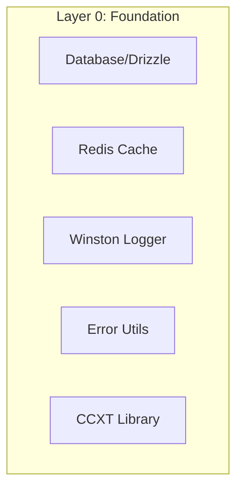

**Arquivos**:
- `/backend/src/db/connection.ts` - Conexão Drizzle
- `/backend/src/utils/redis.ts` - Cliente Redis
- `/backend/src/utils/logger.ts` - Winston Logger
- `/backend/src/utils/errors.ts` - Error classes

**Modificação**: SEGURO - Nenhuma dependência de módulos

### 3.2 Camada 1: Auth & Core (DEPENDEM DA CAMADA 0)
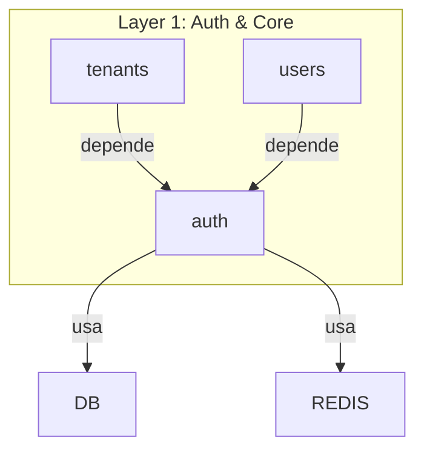

**Módulos**:
1. **auth** (11 arquivos)
   - Schema: `users`, `sessions`, `accounts`, `verifications`, `twoFactor`, `userRoles`, `passkeys`
   - Services: `auth.config.ts`, `session.service.ts`
   - Middleware: `guards.ts`, `session.middleware.ts`
   - Exports: `sessionGuard`, `requireRole`, `requireTenant`, `requireVerifiedEmail`

2. **tenants** (5 arquivos)
   - Schema: `tenants`, `tenantMembers`
   - Foreign Keys: `userId -> users.id`
   - Exports: `tenantService`, `tenantRoutes`

3. **users** (6 arquivos)
   - Schema: `userProfile`
   - Foreign Keys: `userId -> users.id`
   - Exports: `userService`, `profileService`

**Arquivos que importam auth**:
```typescript
// Schema imports (30+ arquivos)
import { users } from '../../auth/schema/auth.schema'

// Middleware imports (45+ arquivos)
import { sessionGuard, requireTenant, requireRole } from '../../auth/middleware/session.middleware'
```

**Modificação**: ALTO RISCO - 75+ arquivos dependem deste módulo

### 3.3 Camada 2: Security & Infrastructure
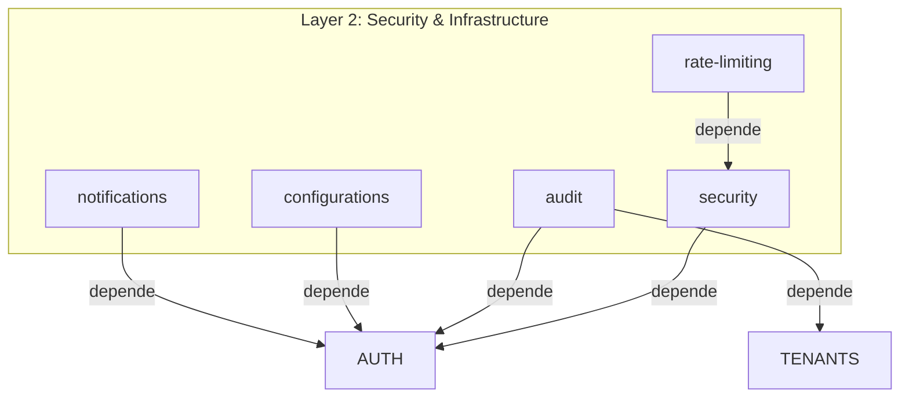

**Módulos**:

1. **security** (5 arquivos)
   - Schema: `roles`, `permissions`, `rolePermissions`
   - Middleware: `rbac.middleware.ts` (exports: `requireAdmin`, `requirePermission`)
   - Service: `permission.service.ts`
   - **USADO POR**: rate-limiting, ceo, vários routes

2. **audit** (7 arquivos)
   - Schema: `auditLogs`, `complianceReports`
   - Service: `audit-logger.service.ts` (export: `logAuditEvent`)
   - **USADO POR**: banco, financial, p2p-marketplace (4 arquivos)
   - Foreign Keys: `userId -> users.id`, `tenantId -> tenants.id`

3. **rate-limiting** (5 arquivos)
   - Middleware: `rate-limit.middleware.ts`
   - Imports: `requireAdmin` from security
   - Service: Redis-based rate limiting

**Modificação**: MÉDIO RISCO - Auditoria usada em 4 módulos críticos

### 3.4 Camada 3: Trading Core (CRÍTICO)
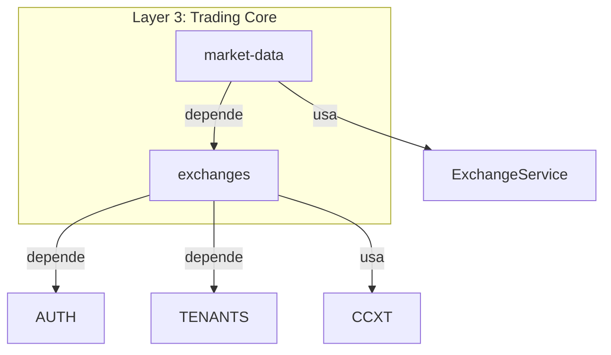

**Módulos**:

1. **exchanges** (8 arquivos)
   - **PIVOTAL MODULE** - Base de todo trading
   - Schema: `exchangeConnections` (credentials criptografadas)
   - Service: `ExchangeService` (exports: `createCCXTInstance`, `fetchBalances`, `fetchTicker`)
   - Utils: `encryption.ts` (encrypt/decrypt API keys)
   - Foreign Keys: `userId -> users.id`, `tenantId -> tenants.id`

   **USADO POR** (6 módulos):
   - market-data (5 services)
   - orders (2 services)
   - positions (1 service)
   - strategies (indiretamente)
   - risk (indiretamente)
   - bots (indiretamente)

2. **market-data** (10 arquivos)
   - Schema: `ohlcv`, `trades`, `orderbooks`, `tickers`
   - Services: `ohlcv.service.ts`, `trades.service.ts`, `orderbook.service.ts`, `ticker.service.ts`
   - Todas importam: `import { ExchangeService } from '../../exchanges/services/exchange.service'`
   - WebSocket: `websocket-manager.ts` (usa ExchangeService)

**Modificação**: CRÍTICO - Exchanges é usado por 6 módulos trading

### 3.5 Camada 4: Trading Execution (CRÍTICO)
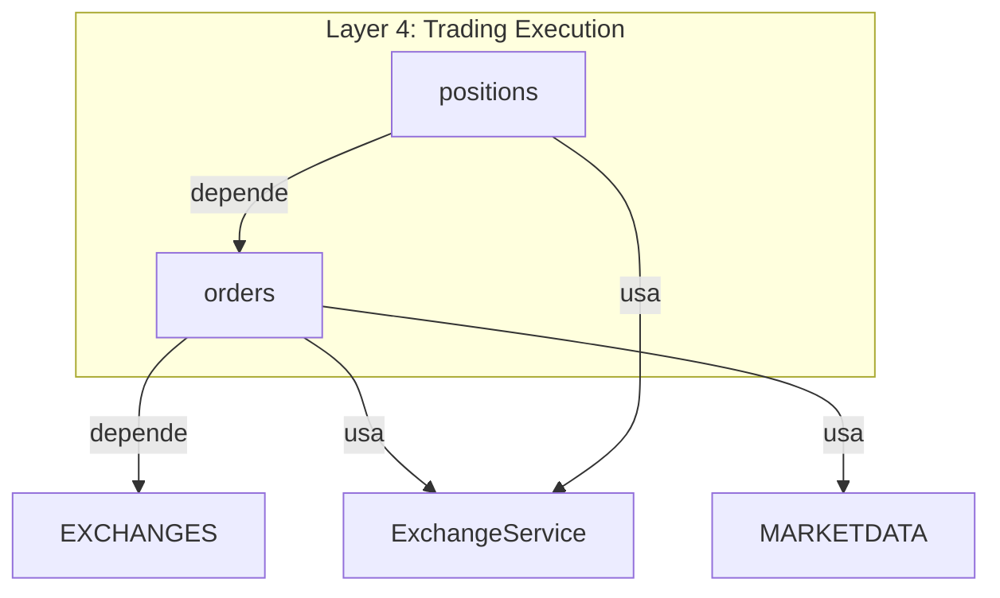

**Módulos**:

1. **orders** (10 arquivos)
   - **CORE TRADING MODULE**
   - Schema: `tradingOrders`, `orderFills`
   - Service: `OrderService` (300+ linhas)
     - Imports: `import { ExchangeService } from '../../exchanges/services/exchange.service'`
     - Imports: `import { exchangeConnections } from '../../exchanges/schema/exchanges.schema'`
   - Tipos de ordem: market, limit, stop_loss, stop_loss_limit, take_profit, take_profit_limit, trailing_stop, trailing_stop_limit
   - Foreign Keys: `exchangeConnectionId -> exchangeConnections.id`

   **USADO POR**:
   - positions (position.service.ts)
   - strategies (indiretamente)
   - risk (indiretamente)
   - bots (indiretamente)

2. **positions** (5 arquivos)
   - Schema: `tradingPositions`, `positionUpdates`
   - Service: `PositionService`
     - Imports: `import { ExchangeService } from '../../exchanges/services/exchange.service'`
   - Cálculos: P&L, margin, liquidation price
   - Foreign Keys: `orderId -> tradingOrders.id`

**Modificação**: CRÍTICO - Orders é usado por 4 módulos

### 3.6 Camada 5: Trading Intelligence
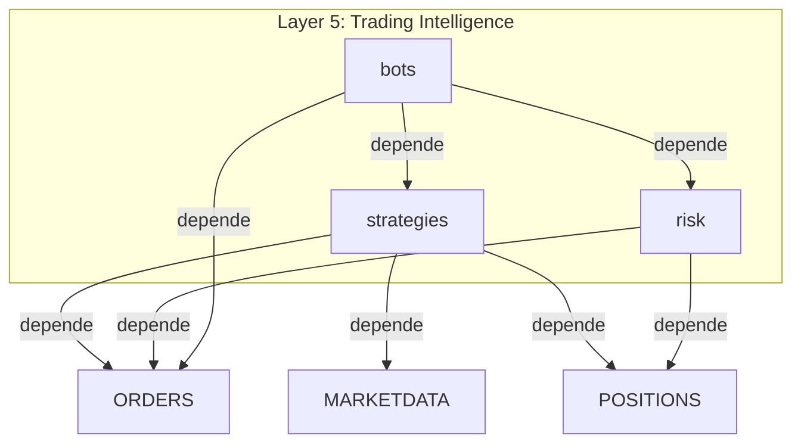

**Módulos**:

1. **strategies** (5 arquivos)
   - Schema: `tradingStrategies`, `strategySignals`, `backtestResults`
   - Service: `StrategyService`
   - Features: Backtesting, signal generation, strategy execution

2. **risk** (5 arquivos)
   - Schema: `riskProfiles`, `riskMetrics`, `riskAlerts`
   - Service: `RiskService`
   - Cálculos: VaR, Sharpe Ratio, exposure analysis

3. **bots** (5 arquivos)
   - Schema: `tradingBots`, `botExecutions`, `botPerformance`
   - Service: `BotService`
   - Tipos: Grid, DCA, Scalping, Arbitrage

**Modificação**: MÉDIO RISCO - Dependem de Orders/Positions

### 3.7 Camada 6: Financial System
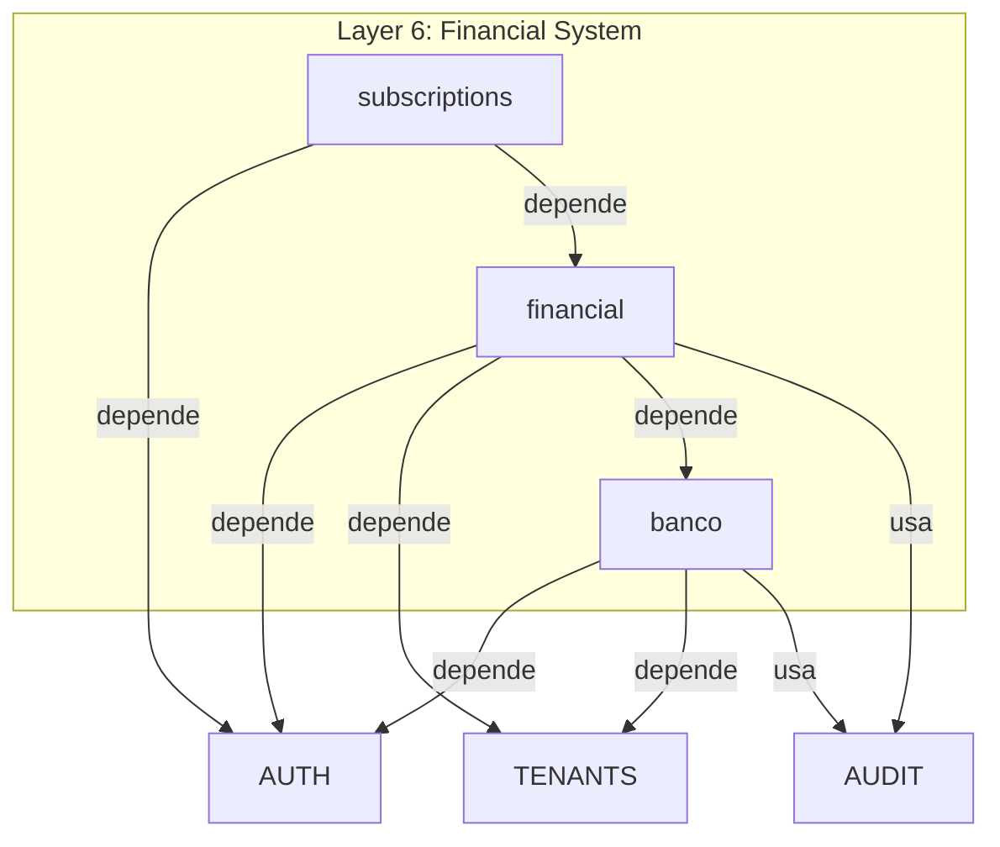

**Módulos**:

1. **banco** (9 arquivos)
   - Schema: `wallets`, `transactions`, `balances`
   - Services: `wallet.service.ts`, `portfolio.service.ts`, `price.service.ts`
   - Imports: `import { logAuditEvent } from '@/modules/audit/services/audit-logger.service'`
   - Foreign Keys: `userId -> users.id`, `tenantId -> tenants.id`
   - **USADO POR**: financial, p2p-marketplace

2. **financial** (67 arquivos - MAIOR MÓDULO)
   - Schema: `invoices`, `expenses`, `budgets`, `ledger`, `payments`, `taxes`
   - Services: 12 services (payment gateways: Stripe, InfinityPay, Banco)
   - Imports: `import { logAuditEvent } from '@/modules/audit/services/audit-logger.service'`
   - **26 testes unitários**

3. **subscriptions** (18 arquivos)
   - Schema: `subscriptionPlans`, `subscriptionHistory`, `subscriptionUsage`
   - Services: `subscription-management.service.ts`, `quota.service.ts`, `usage-tracking.service.ts`
   - Integration: Stripe webhooks

**Modificação**: MÉDIO RISCO - Financial tem 67 arquivos e 26 testes

### 3.8 Camada 7: Business Modules
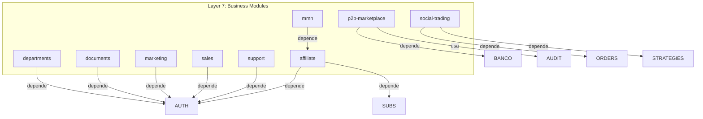

**Características**:
- Todos dependem de auth/tenants
- Não são críticos para o core trading
- P2P e Social Trading têm interdependências com trading

**Modificação**: BAIXO RISCO - Módulos isolados

### 3.9 Camada 8: Aggregation Layer
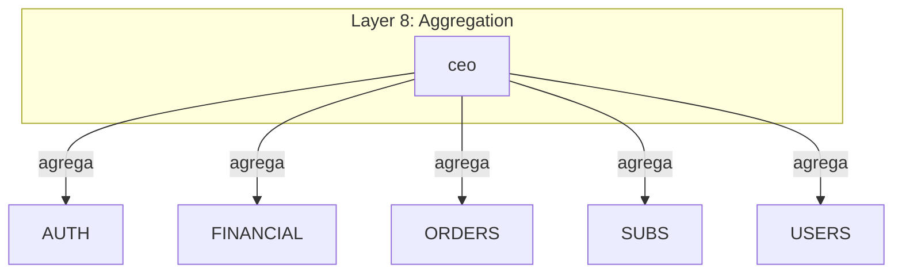

**Módulo**:

1. **ceo** (5 arquivos)
   - Dashboard executivo com KPIs agregados
   - Imports de múltiplos módulos
   - READ-ONLY operations

**Modificação**: BAIXO RISCO - Apenas leitura

---

## 4. DEPENDÊNCIAS CRÍTICAS IDENTIFICADAS

### 4.1 Dependências de Imports Diretos

| Arquivo Importador | Módulo Importado | Tipo de Dependência | Risco |
|-------------------|------------------|---------------------|-------|
| `orders/services/order.service.ts` | `ExchangeService` | Service dependency | CRÍTICO |
| `orders/services/order.service.ts` | `exchangeConnections` | Schema dependency | CRÍTICO |
| `market-data/services/*.service.ts` (5) | `ExchangeService` | Service dependency | CRÍTICO |
| `positions/services/position.service.ts` | `ExchangeService` | Service dependency | ALTO |
| `banco/services/wallet.service.ts` | `logAuditEvent` | Service dependency | MÉDIO |
| `financial/services/payment-processor.service.ts` | `logAuditEvent` | Service dependency | MÉDIO |
| `p2p-marketplace/services/*.ts` (3) | `logAuditEvent` | Service dependency | MÉDIO |
| `*/routes/*.routes.ts` (45+) | `sessionGuard`, `requireTenant` | Middleware dependency | ALTO |
| `*/schema/*.schema.ts` (30+) | `users` schema | Schema FK | ALTO |

### 4.2 Dependências de Database Schema (Foreign Keys)

```sql
-- auth.users é referenciado por:
- tenants.tenantMembers (userId)
- banco.wallets (userId)
- financial.payments (userId)
- orders.tradingOrders (userId)
- positions.tradingPositions (userId)
- strategies.tradingStrategies (userId)
- bots.tradingBots (userId)
-- TOTAL: 30+ tabelas

-- tenants.tenants é referenciado por:
- banco.wallets (tenantId)
- financial.invoices (tenantId)
- orders.tradingOrders (tenantId)
- audit.auditLogs (tenantId)
-- TOTAL: 25+ tabelas

-- exchanges.exchangeConnections é referenciado por:
- orders.tradingOrders (exchangeConnectionId)
- positions.tradingPositions (exchangeConnectionId)
-- TOTAL: 2 tabelas (mas CRÍTICAS)

-- orders.tradingOrders é referenciado por:
- positions.tradingPositions (orderId)
- orderFills (orderId)
-- TOTAL: 2 tabelas
```

### 4.3 Dependências de Middleware/Guards

**sessionGuard** usado em 45+ routes:
```typescript
// Padrão encontrado em todos os routes:
import { sessionGuard, requireTenant } from '../../auth/middleware/session.middleware'

// Modules afetados:
- banco (2 routes)
- bots (1 route)
- configurations (1 route)
- departments (3 routes)
- financial (10 routes)
- market-data (1 route)
- marketing (1 route)
- orders (1 route)
- p2p-marketplace (7 routes)
- positions (1 route)
- risk (1 route)
- sales (5 routes)
- social-trading (4 routes)
- strategies (1 route)
- subscriptions (4 routes)
- support (6 routes)
```

### 4.4 Dependências de Services Compartilhados

**ExchangeService** usado por:
```typescript
// market-data/services/ (5 arquivos)
ohlcv.service.ts: import { ExchangeService } from '../../exchanges/services/exchange.service'
trades.service.ts: import { ExchangeService } from '../../exchanges/services/exchange.service'
orderbook.service.ts: import { ExchangeService } from '../../exchanges/services/exchange.service'
ticker.service.ts: import { ExchangeService } from '../../exchanges/services/exchange.service'
websocket-manager.ts: import { ExchangeService } from '../../exchanges/services/exchange.service'

// orders/services/ (2 arquivos)
order.service.ts: import { ExchangeService } from '../../exchanges/services/exchange.service'
position.service.ts: import { ExchangeService } from '../../exchanges/services/exchange.service'

// TOTAL: 7 arquivos dependem diretamente de ExchangeService
```

**logAuditEvent** usado por:
```typescript
banco/services/wallet.service.ts: import { logAuditEvent } from '@/modules/audit/services/audit-logger.service'
financial/services/payment-processor.service.ts: import { logAuditEvent } from '@/modules/audit/services/audit-logger.service'
p2p-marketplace/services/trade.service.ts: import { logAuditEvent } from '@/modules/audit/services/audit-logger.service'
p2p-marketplace/services/order.service.ts: import { logAuditEvent } from '@/modules/audit/services/audit-logger.service'

// TOTAL: 4 arquivos
```

---

## 5. DEPENDÊNCIAS CIRCULARES DETECTADAS

### 5.1 Análise de Ciclos

**NENHUM CICLO DETECTADO** ✅

A arquitetura do sistema segue uma estrutura em camadas limpa, sem dependências circulares entre módulos.

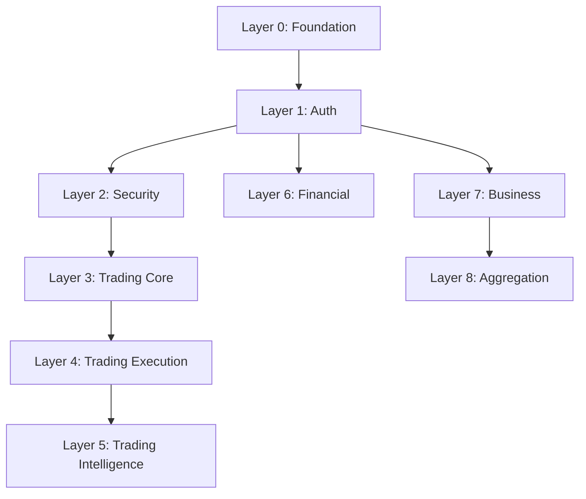

**Análise**:
- Todas as dependências fluem em uma direção (top-down)
- Nenhum módulo de camada superior depende de camada inferior
- Módulos da mesma camada podem ter dependências laterais limitadas (ex: orders ← → positions)

### 5.2 Acoplamento Detectado

**Alto Acoplamento**:
1. **auth ↔ multiple modules** (75+ arquivos)
   - Tipo: Acoplamento necessário (autenticação é cross-cutting)
   - Mitigação: Interface bem definida (sessionGuard, requireTenant)
   - Status: ACEITÁVEL

2. **exchanges ↔ trading modules** (7 arquivos)
   - Tipo: Acoplamento funcional (necessário para trading)
   - Mitigação: ExchangeService como facade pattern
   - Status: ACEITÁVEL

**Médio Acoplamento**:
1. **audit ↔ financial/banco/p2p** (4 arquivos)
   - Tipo: Acoplamento de logging
   - Mitigação: logAuditEvent como função standalone
   - Status: ACEITÁVEL

**Baixo Acoplamento**:
- Business modules (marketing, sales, support) - Independentes entre si

---

## 6. IMPACTO DE MODIFICAÇÕES

### 6.1 Matriz de Impacto por Módulo

| Módulo | Arquivos Diretos | Arquivos Dependentes | Módulos Dependentes | Testes Afetados | Risco Total |
|--------|-----------------|---------------------|---------------------|-----------------|-------------|
| **auth** | 11 | 75+ | 25+ | 0 | CRÍTICO 🔴 |
| **tenants** | 5 | 60+ | 20+ | 0 | CRÍTICO 🔴 |
| **exchanges** | 8 | 7 | 6 | 0 | CRÍTICO 🔴 |
| **orders** | 10 | 4 | 4 | 0 | ALTO 🟠 |
| **market-data** | 10 | 3 | 3 | 0 | ALTO 🟠 |
| **security** | 5 | 10+ | 5 | 0 | ALTO 🟠 |
| **positions** | 5 | 2 | 2 | 0 | MÉDIO 🟡 |
| **banco** | 9 | 5 | 2 | 0 | MÉDIO 🟡 |
| **financial** | 67 | 3 | 2 | 26 | MÉDIO 🟡 |
| **audit** | 7 | 4 | 4 | 0 | MÉDIO 🟡 |
| **strategies** | 5 | 2 | 2 | 0 | BAIXO 🟢 |
| **risk** | 5 | 1 | 1 | 0 | BAIXO 🟢 |
| **bots** | 5 | 0 | 0 | 0 | BAIXO 🟢 |

### 6.2 Cenários de Quebra

**Cenário 1: Modificar auth/middleware/session.middleware.ts**
- **Arquivos Afetados**: 45+ routes
- **Módulos Afetados**: 15+ módulos
- **Quebras Potenciais**:
  - Mudança na assinatura de `sessionGuard` quebra todos os routes
  - Mudança no tipo `AuthContext` quebra todos os handlers
  - Mudança em `requireTenant` quebra multi-tenancy
- **Mitigação**:
  - Manter backward compatibility
  - Deprecate antes de remover
  - Versionar interfaces

**Cenário 2: Modificar exchanges/services/exchange.service.ts**
- **Arquivos Afetados**: 7 services (market-data, orders, positions)
- **Módulos Afetados**: 6 módulos trading
- **Quebras Potenciais**:
  - Mudança em `createCCXTInstance` quebra toda execução de trading
  - Mudança em `getCCXTInstance` quebra data fetching
  - Mudança em credentials handling quebra segurança
- **Mitigação**:
  - Testes de integração obrigatórios
  - Feature flags para rollout gradual
  - Validação de credenciais mantida

**Cenário 3: Modificar orders/services/order.service.ts**
- **Arquivos Afetados**: 4 services (positions, strategies, risk, bots)
- **Módulos Afetados**: 4 módulos
- **Quebras Potenciais**:
  - Mudança em `createOrder` quebra execução de estratégias
  - Mudança em `getOrders` quebra dashboards
  - Mudança em tipos de ordem quebra bots
- **Mitigação**:
  - Testes end-to-end obrigatórios
  - Sandbox testing antes de production
  - Rollback plan

**Cenário 4: Modificar auth/schema/auth.schema.ts**
- **Arquivos Afetados**: 30+ schemas com FK para `users.id`
- **Módulos Afetados**: ALL modules
- **Quebras Potenciais**:
  - Mudança em `users` table quebra TODAS as relações
  - Mudança em `sessions` quebra autenticação
  - Mudança em `userRoles` quebra RBAC
- **Mitigação**:
  - NUNCA modificar schema sem migration
  - Backward compatible migrations apenas
  - Zero downtime deployment

---

## 7. ORDEM SEGURA DE MODIFICAÇÃO

### 7.1 Princípios de Ordenação

1. **Bottom-Up Approach**: Modificar camadas inferiores primeiro
2. **Dependency-First**: Modificar dependências antes de dependentes
3. **Test Coverage**: Garantir testes antes de modificar módulos críticos
4. **Atomic Changes**: Mudanças devem ser atômicas por módulo

### 7.2 Ordem Recomendada (12 Módulos Críticos)

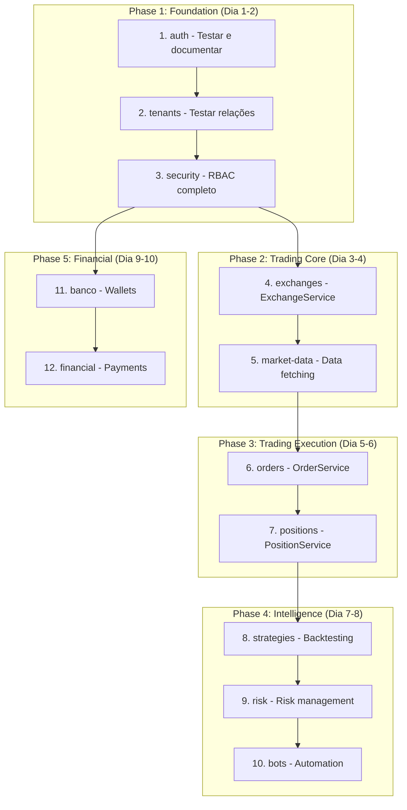

### 7.3 Sequência Detalhada

#### FASE 1: Foundation (Dia 1-2) - CRÍTICO

**1. Módulo: auth (11 arquivos)**
- **Ação**: ✅ Manter código atual, adicionar testes
- **Justificativa**: 75+ arquivos dependem, qualquer mudança quebra sistema
- **Tarefas**:
  - [ ] Criar testes para `sessionGuard`
  - [ ] Criar testes para `requireTenant`
  - [ ] Criar testes para `requireRole`
  - [ ] Documentar interface de `AuthContext`
  - [ ] Validar Better-Auth integration
- **Validação**:
  ```bash
  bun test src/modules/auth
  bun run typecheck
  grep -r "sessionGuard" backend/src/modules --include="*.ts" # Verificar 45+ uses
  ```
- **Riscos**: Nenhum (apenas testes)

**2. Módulo: tenants (5 arquivos)**
- **Ação**: ✅ Manter código atual, validar multi-tenancy
- **Justificativa**: 60+ arquivos dependem de tenantId
- **Tarefas**:
  - [ ] Validar schema `tenants`, `tenantMembers`
  - [ ] Testar `tenantService.createTenant`
  - [ ] Testar `requireTenant` middleware
  - [ ] Verificar isolation entre tenants
- **Validação**:
  ```bash
  bun test src/modules/tenants
  grep -r "tenantId" backend/src/modules --include="*.schema.ts" # Verificar 25+ FKs
  ```
- **Riscos**: Nenhum (apenas testes)

**3. Módulo: security (5 arquivos)**
- **Ação**: ✅ Implementar RBAC completo
- **Justificativa**: Base para todas as permissões
- **Tarefas**:
  - [ ] Validar schema `roles`, `permissions`, `rolePermissions`
  - [ ] Implementar `requirePermission` middleware
  - [ ] Popular seed de permissões padrão
  - [ ] Testar RBAC com diferentes roles
- **Validação**:
  ```bash
  bun src/db/seed-rbac.ts
  bun test src/modules/security
  ```
- **Riscos**: Baixo (módulo isolado)

#### FASE 2: Trading Core (Dia 3-4) - CRÍTICO

**4. Módulo: exchanges (8 arquivos)**
- **Ação**: 🔧 Implementar + Testar intensivamente
- **Justificativa**: BASE de todo sistema trading, 7 arquivos dependem
- **Tarefas**:
  - [ ] Validar `ExchangeService.createCCXTInstance`
  - [ ] Testar conexão com 3 exchanges principais (Binance, Coinbase, Kraken)
  - [ ] Validar encryption/decryption de credentials
  - [ ] Implementar retry logic para API failures
  - [ ] Testar `fetchBalances`, `fetchTicker`
  - [ ] Implementar rate limiting por exchange
- **Validação**:
  ```bash
  bun test src/modules/exchanges
  /exchange-test Binance BTC/USDT
  /exchange-test Coinbase ETH/USD
  grep -r "ExchangeService" backend/src/modules --include="*.ts" # Verificar 7 uses
  ```
- **Riscos**: CRÍTICO - Qualquer falha quebra trading
- **Rollback Plan**: Manter código atual em feature branch

**5. Módulo: market-data (10 arquivos)**
- **Ação**: 🔧 Implementar data fetching completo
- **Justificativa**: Necessário para orders e strategies
- **Tarefas**:
  - [ ] Implementar `OHLCVService.fetchOHLCV`
  - [ ] Implementar `TradesService.fetchTrades`
  - [ ] Implementar `OrderbookService.fetchOrderbook`
  - [ ] Implementar `TickerService.fetchTicker`
  - [ ] Testar com exchanges reais
  - [ ] Implementar caching Redis para market data
  - [ ] Implementar rate limiting
- **Validação**:
  ```bash
  bun test src/modules/market-data
  curl http://localhost:3000/api/v1/market-data/ohlcv?symbol=BTC/USDT
  curl http://localhost:3000/api/v1/market-data/orderbook?symbol=BTC/USDT
  ```
- **Riscos**: ALTO - Falha afeta orders e strategies

#### FASE 3: Trading Execution (Dia 5-6) - CRÍTICO

**6. Módulo: orders (10 arquivos)**
- **Ação**: 🔧 Implementar ordem execution completa
- **Justificativa**: CORE do sistema trading
- **Tarefas**:
  - [ ] Implementar `OrderService.createOrder` (8 tipos)
  - [ ] Implementar `OrderService.cancelOrder`
  - [ ] Implementar `OrderService.syncOrders`
  - [ ] Testar cada tipo de ordem:
    - [ ] Market order
    - [ ] Limit order
    - [ ] Stop loss
    - [ ] Stop loss limit
    - [ ] Take profit
    - [ ] Take profit limit
    - [ ] Trailing stop
    - [ ] Trailing stop limit
  - [ ] Implementar order status sync
  - [ ] Implementar order fills tracking
- **Validação**:
  ```bash
  bun test src/modules/orders
  # Testar em SANDBOX mode
  curl -X POST http://localhost:3000/api/v1/orders \
    -H "Content-Type: application/json" \
    -d '{"type":"limit","side":"buy","symbol":"BTC/USDT","amount":0.001,"price":50000}'
  ```
- **Riscos**: CRÍTICO - Erro pode causar perda financeira
- **Safety**:
  - Sandbox testing obrigatório
  - Manual approval para production
  - Circuit breaker para falhas

**7. Módulo: positions (5 arquivos)**
- **Ação**: 🔧 Implementar position management
- **Justificativa**: Necessário para futures/margin trading
- **Tarefas**:
  - [ ] Implementar `PositionService.createPosition`
  - [ ] Implementar `PositionService.updatePosition`
  - [ ] Implementar cálculo de P&L
  - [ ] Implementar cálculo de margin
  - [ ] Implementar liquidation price calculation
  - [ ] Testar com posições longas e curtas
- **Validação**:
  ```bash
  bun test src/modules/positions
  curl http://localhost:3000/api/v1/positions
  ```
- **Riscos**: ALTO - Cálculos errados afetam risk management

#### FASE 4: Intelligence (Dia 7-8) - MÉDIO

**8. Módulo: strategies (5 arquivos)**
- **Ação**: 🔧 Implementar strategy execution + backtesting
- **Justificativa**: Necessário para bots e automated trading
- **Tarefas**:
  - [ ] Implementar `StrategyService.createStrategy`
  - [ ] Implementar `StrategyService.backtest`
  - [ ] Implementar signal generation
  - [ ] Implementar strategy execution
  - [ ] Testar com dados históricos
- **Validação**:
  ```bash
  bun test src/modules/strategies
  /backtest-run --strategy=moving-average --symbol=BTC/USDT
  /strategy-validate --id=<strategy-id>
  ```
- **Riscos**: MÉDIO - Estratégias ruins afetam performance

**9. Módulo: risk (5 arquivos)**
- **Ação**: 🔧 Implementar risk management completo
- **Justificativa**: Proteção contra perdas excessivas
- **Tarefas**:
  - [ ] Implementar `RiskService.calculateVaR`
  - [ ] Implementar `RiskService.calculateExposure`
  - [ ] Implementar `RiskService.checkRiskLimits`
  - [ ] Implementar alertas de risco
  - [ ] Testar com diferentes portfolios
- **Validação**:
  ```bash
  bun test src/modules/risk
  curl http://localhost:3000/api/v1/risk/portfolio
  curl http://localhost:3000/api/v1/risk/var
  ```
- **Riscos**: MÉDIO - Falha afeta gestão de risco

**10. Módulo: bots (5 arquivos)**
- **Ação**: 🔧 Implementar trading bots
- **Justificativa**: Automação de trading
- **Tarefas**:
  - [ ] Implementar `BotService.createBot`
  - [ ] Implementar `BotService.startBot`
  - [ ] Implementar `BotService.stopBot`
  - [ ] Implementar tipos de bot (Grid, DCA, Scalping)
  - [ ] Testar com pequenos volumes
- **Validação**:
  ```bash
  bun test src/modules/bots
  curl http://localhost:3000/api/v1/bots
  ```
- **Riscos**: BAIXO - Módulo isolado

#### FASE 5: Financial (Dia 9-10) - MÉDIO

**11. Módulo: banco (9 arquivos)**
- **Ação**: 🔧 Implementar wallet system completo
- **Justificativa**: Gestão de fundos
- **Tarefas**:
  - [ ] Implementar `WalletService.createWallet`
  - [ ] Implementar `WalletService.deposit`
  - [ ] Implementar `WalletService.withdraw`
  - [ ] Implementar `WalletService.transfer`
  - [ ] Implementar `PortfolioService.getPortfolio`
  - [ ] Implementar `PriceService.getPrices` (CoinGecko)
  - [ ] Testar com múltiplos assets
- **Validação**:
  ```bash
  bun test src/modules/banco
  curl http://localhost:3000/api/v1/banco/wallets
  curl http://localhost:3000/api/v1/banco/portfolio
  ```
- **Riscos**: MÉDIO - Falha afeta gestão financeira

**12. Módulo: financial (67 arquivos)**
- **Ação**: 🔧 Implementar sistema financeiro completo
- **Justificativa**: Pagamentos, invoices, impostos
- **Tarefas**:
  - [ ] Implementar `InvoiceService`
  - [ ] Implementar `PaymentProcessorService`
  - [ ] Implementar gateways (Stripe, InfinityPay, Banco)
  - [ ] Implementar `TaxService`
  - [ ] Implementar `LedgerService`
  - [ ] **Executar 26 testes existentes**
- **Validação**:
  ```bash
  bun test src/modules/financial # 26 tests
  curl http://localhost:3000/api/v1/financial/invoices
  ```
- **Riscos**: MÉDIO - 67 arquivos, muita complexidade

---

## 8. TESTES E VALIDAÇÃO

### 8.1 Coverage Atual

**Testes Existentes**: 21 arquivos de teste

```
backend/src/modules/
├── financial/
│   ├── services/__tests__/ (6 testes)
│   └── utils/__tests__/ (4 testes)
├── sales/__tests__/ (2 testes)
├── support/__tests__/ (3 testes)
├── marketing/__tests__/ (3 testes)
├── documents/__tests__/ (2 testes)
└── subscriptions/tests/ (1 teste)

tests/
└── unit/cache-manager.test.ts (1 teste)
```

**Coverage por Módulo**:
| Módulo | Testes | Coverage Estimado |
|--------|--------|------------------|
| financial | 10 | ~60% |
| sales | 2 | ~20% |
| support | 3 | ~30% |
| marketing | 3 | ~40% |
| documents | 2 | ~50% |
| **auth** | 0 | 0% ❌ |
| **exchanges** | 0 | 0% ❌ |
| **orders** | 0 | 0% ❌ |
| **market-data** | 0 | 0% ❌ |
| **positions** | 0 | 0% ❌ |

**PROBLEMA CRÍTICO**: Módulos trading não têm testes!

### 8.2 Plano de Testes Obrigatórios

#### auth (Prioridade: CRÍTICA)
```typescript
// tests/modules/auth/session.middleware.test.ts
describe('sessionGuard', () => {
  it('should allow authenticated requests')
  it('should reject unauthenticated requests')
  it('should validate session expiry')
  it('should handle invalid tokens')
})

describe('requireTenant', () => {
  it('should allow tenant members')
  it('should reject non-members')
  it('should validate tenant isolation')
})
```

#### exchanges (Prioridade: CRÍTICA)
```typescript
// tests/modules/exchanges/exchange.service.test.ts
describe('ExchangeService', () => {
  describe('createCCXTInstance', () => {
    it('should create Binance instance')
    it('should create Coinbase instance')
    it('should handle invalid credentials')
    it('should enable sandbox mode')
  })

  describe('fetchBalances', () => {
    it('should fetch balances from exchange')
    it('should cache balances in database')
    it('should handle API errors')
  })
})
```

#### orders (Prioridade: CRÍTICA)
```typescript
// tests/modules/orders/order.service.test.ts
describe('OrderService', () => {
  describe('createOrder', () => {
    it('should create market order')
    it('should create limit order')
    it('should create stop loss order')
    it('should validate order parameters')
    it('should handle exchange errors')
  })

  describe('cancelOrder', () => {
    it('should cancel pending order')
    it('should cancel open order')
    it('should not cancel filled order')
  })
})
```

### 8.3 Validação Pós-Modificação

**Checklist por Módulo**:

```bash
# 1. Type Check
bun run typecheck

# 2. Lint
bun run lint

# 3. Unit Tests
bun test src/modules/<module>

# 4. Integration Tests
bun test src/modules/<module> --integration

# 5. Dependency Check
grep -r "import.*<module>" backend/src/modules --include="*.ts"

# 6. Schema Validation
bun src/db/generate
bun src/db/push --dry-run

# 7. API Tests
curl http://localhost:3000/api/v1/<module>

# 8. Build
bun run build

# 9. Smoke Tests
/project-health-check
```

---

## 9. ARQUIVOS IMPACTADOS POR MÓDULO

### 9.1 Arquivos que Dependem de auth

**Schema Imports** (30+ arquivos):
```
banco/schema/wallet.schema.ts
configurations/schema/configurations.schema.ts
p2p-marketplace/schema/p2p.schema.ts
sales/schema/*.schema.ts (6 arquivos)
financial/schema/payments.schema.ts
audit/schema/audit.schema.ts
... (24+ mais)
```

**Middleware Imports** (45+ arquivos):
```
banco/routes/wallet.routes.ts
banco/routes/portfolio.routes.ts
bots/routes/bots.routes.ts
configurations/routes/configuration.routes.ts
market-data/routes/market-data.routes.ts
orders/routes/orders.routes.ts
... (39+ mais)
```

**Service Imports** (5+ arquivos):
```
auth/routes/admin.routes.ts
auth/routes/dev.routes.ts
... (3+ mais)
```

**TOTAL**: 80+ arquivos dependem de auth

### 9.2 Arquivos que Dependem de exchanges

**Service Imports** (7 arquivos):
```
market-data/services/ohlcv.service.ts
market-data/services/trades.service.ts
market-data/services/orderbook.service.ts
market-data/services/ticker.service.ts
market-data/websocket/websocket-manager.ts
orders/services/order.service.ts
orders/services/position.service.ts
```

**Schema Imports** (2 arquivos):
```
orders/services/order.service.ts (exchangeConnections schema)
market-data/services/*.service.ts (indiretamente)
```

**TOTAL**: 9 arquivos dependem de exchanges

### 9.3 Arquivos que Dependem de orders

**Service Imports** (4 arquivos):
```
positions/services/position.service.ts
strategies/services/strategy.service.ts (indiretamente)
risk/services/risk.service.ts (indiretamente)
bots/services/bot.service.ts (indiretamente)
```

**Schema Imports** (2 arquivos):
```
positions/schema/positions.schema.ts (orderId FK)
orderFills/schema (orderId FK)
```

**TOTAL**: 6 arquivos dependem de orders

### 9.4 Arquivos que Dependem de audit

**Service Imports** (4 arquivos):
```
banco/services/wallet.service.ts
financial/services/payment-processor.service.ts
p2p-marketplace/services/trade.service.ts
p2p-marketplace/services/order.service.ts
```

**Schema Imports** (0 arquivos):
- Audit não é referenciado em schemas (one-way logging)

**TOTAL**: 4 arquivos dependem de audit

---

## 10. COMANDOS DE VERIFICAÇÃO

### 10.1 Comandos Pre-Modification

```bash
# 1. Análise de Dependências (Regra 53)
/dev-analyze-dependencies <arquivo>

# 2. Verificar imports do módulo
grep -r "import.*from.*modules/<module>" backend/src/modules --include="*.ts"

# 3. Verificar schema foreign keys
grep -r "references.*<table>" backend/src/modules --include="*.schema.ts"

# 4. Listar arquivos do módulo
find backend/src/modules/<module> -name "*.ts"

# 5. Verificar testes existentes
find backend/src/modules/<module> -name "*.test.ts"

# 6. Verificar documentação
ls docs/*<module>*

# 7. Backup do módulo
cp -r backend/src/modules/<module> backup/<module>_$(date +%Y%m%d_%H%M%S)
```

### 10.2 Comandos Post-Modification

```bash
# 1. Type check
bun run typecheck

# 2. Lint
bun run lint

# 3. Run tests
bun test src/modules/<module>

# 4. Build
bun run build

# 5. Verificar imports quebrados
bun run typecheck 2>&1 | grep "Cannot find module"

# 6. Validar schema
bun src/db/generate
bun src/db/push --dry-run

# 7. Health check
/project-health-check

# 8. Testar endpoints
curl http://localhost:3000/api/v1/<module>

# 9. Verificar logs
tail -f logs/combined.log

# 10. Smoke test em sandbox
NODE_ENV=sandbox bun run dev
```

### 10.3 Comandos de Validação Crítica

```bash
# Trading Modules - CRÍTICO
/exchange-test Binance BTC/USDT
/strategy-validate --id=<strategy-id>
/backtest-run --strategy=moving-average --symbol=BTC/USDT --start=2024-01-01 --end=2024-12-31

# Code Review - OBRIGATÓRIO
/dev-code-review backend/src/modules/<module>

# Dependency Analysis - OBRIGATÓRIO
/dev-analyze-dependencies backend/src/modules/<module>/services/<service>.ts

# Full Project Check
/project-health-check
```

---

## 11. CHECKLIST DE VALIDAÇÃO POR MÓDULO

### 11.1 Template de Validação

```markdown
## Validação do Módulo: <nome>

### Pre-Modification
- [ ] Backup do módulo criado
- [ ] Dependências mapeadas (grep -r)
- [ ] Testes existentes identificados
- [ ] Documentação lida
- [ ] Branch de feature criada

### During Modification
- [ ] Código modificado
- [ ] Testes criados/atualizados
- [ ] Documentação atualizada
- [ ] Types atualizados
- [ ] Schemas migrados (se necessário)

### Post-Modification
- [ ] `bun run typecheck` ✅
- [ ] `bun run lint` ✅
- [ ] `bun test src/modules/<module>` ✅
- [ ] `bun run build` ✅
- [ ] Imports verificados ✅
- [ ] Schema validated ✅
- [ ] API testada ✅
- [ ] Logs verificados ✅
- [ ] Smoke test ✅
- [ ] Code review ✅

### Validation Commands
```bash
/dev-analyze-dependencies <arquivo>
/dev-code-review backend/src/modules/<module>
/project-health-check
```

### Rollback Plan
- Branch anterior: `<branch-name>`
- Commit hash: `<commit>`
- Comando: `git checkout <commit>`
```

### 11.2 Checklist auth
```markdown
## Validação do Módulo: auth

### Pre-Modification
- [ ] Backup criado: `backup/auth_20251017_100000`
- [ ] Dependências: 80+ arquivos identificados
- [ ] Testes: Nenhum existente (CRIAR)
- [ ] Docs: AGENTS.md, README.md lidos
- [ ] Branch: `feature/auth-testing`

### During Modification
- [x] Código: Mantido (apenas testes)
- [ ] Testes criados:
  - [ ] session.middleware.test.ts
  - [ ] guards.test.ts
  - [ ] auth.config.test.ts
- [ ] Docs: README atualizado
- [ ] Types: Nenhuma mudança
- [ ] Schemas: Nenhuma mudança

### Post-Modification
- [ ] `bun run typecheck` ✅
- [ ] `bun run lint` ✅
- [ ] `bun test src/modules/auth` ✅ (>= 80% coverage)
- [ ] `bun run build` ✅
- [ ] Verificar 80+ imports: `grep -r "sessionGuard" backend/src/modules`
- [ ] Testar routes: 45+ routes
- [ ] Code review: 2+ revisores

### Rollback Plan
- N/A (apenas testes adicionados)
```

### 11.3 Checklist exchanges
```markdown
## Validação do Módulo: exchanges

### Pre-Modification
- [ ] Backup criado: `backup/exchanges_20251017_100000`
- [ ] Dependências: 9 arquivos identificados
- [ ] Testes: Nenhum existente (CRIAR)
- [ ] Docs: CCXT docs lidos
- [ ] Branch: `feature/exchanges-implementation`

### During Modification
- [ ] Código: ExchangeService implementado
- [ ] Testes criados:
  - [ ] exchange.service.test.ts (unit)
  - [ ] exchanges.integration.test.ts (integration)
- [ ] Docs: API docs atualizados
- [ ] Types: ExchangeCredentials validado
- [ ] Schemas: exchangeConnections validado

### Post-Modification
- [ ] `bun run typecheck` ✅
- [ ] `bun run lint` ✅
- [ ] `bun test src/modules/exchanges` ✅ (>= 80% coverage)
- [ ] `bun run build` ✅
- [ ] Verificar 9 imports: `grep -r "ExchangeService" backend/src/modules`
- [ ] `/exchange-test Binance BTC/USDT` ✅
- [ ] `/exchange-test Coinbase ETH/USD` ✅
- [ ] `/exchange-test Kraken BTC/EUR` ✅
- [ ] Testar encryption/decryption
- [ ] Testar sandbox mode
- [ ] Code review: 2+ revisores + security review

### Rollback Plan
- Branch: `main`
- Commit: `<hash>`
- Feature flag: `ENABLE_EXCHANGES=false`
```

### 11.4 Checklist orders
```markdown
## Validação do Módulo: orders

### Pre-Modification
- [ ] Backup criado: `backup/orders_20251017_100000`
- [ ] Dependências: 6 arquivos identificados
- [ ] Testes: Nenhum existente (CRIAR)
- [ ] Docs: CCXT order types lidos
- [ ] Branch: `feature/orders-implementation`
- [ ] **exchanges** módulo completo ✅

### During Modification
- [ ] Código: OrderService implementado
- [ ] Testes criados:
  - [ ] order.service.test.ts (unit)
  - [ ] orders.integration.test.ts (integration)
  - [ ] orders.e2e.test.ts (end-to-end)
- [ ] Docs: Trading docs atualizados
- [ ] Types: 8 OrderTypes validados
- [ ] Schemas: tradingOrders, orderFills validados

### Post-Modification
- [ ] `bun run typecheck` ✅
- [ ] `bun run lint` ✅
- [ ] `bun test src/modules/orders` ✅ (>= 90% coverage - CRÍTICO)
- [ ] `bun run build` ✅
- [ ] Verificar 6 imports: `grep -r "OrderService" backend/src/modules`
- [ ] Testar 8 tipos de ordem:
  - [ ] Market order (sandbox)
  - [ ] Limit order (sandbox)
  - [ ] Stop loss (sandbox)
  - [ ] Stop loss limit (sandbox)
  - [ ] Take profit (sandbox)
  - [ ] Take profit limit (sandbox)
  - [ ] Trailing stop (sandbox)
  - [ ] Trailing stop limit (sandbox)
- [ ] Testar cancel order
- [ ] Testar sync orders
- [ ] Testar batch orders
- [ ] Code review: 3+ revisores + security review
- [ ] Manual QA: CEO approval

### Rollback Plan
- Branch: `main`
- Commit: `<hash>`
- Feature flag: `ENABLE_TRADING=false`
- Circuit breaker: `MAX_ORDER_FAILURES=5`

### Safety Measures
- [ ] Sandbox testing completo
- [ ] Manual approval para production
- [ ] Circuit breaker configurado
- [ ] Rate limiting ativo
- [ ] Monitoring Prometheus ativo
- [ ] Alerts configurados
```

---

## 12. RISK MANAGEMENT

### 12.1 Matriz de Risco por Fase

| Fase | Módulos | Risco Técnico | Risco Financeiro | Risco Operacional | Mitigação |
|------|---------|---------------|------------------|-------------------|-----------|
| **Fase 1** | auth, tenants, security | CRÍTICO 🔴 | Nenhum | Nenhum | Apenas testes, sem mudanças |
| **Fase 2** | exchanges, market-data | CRÍTICO 🔴 | Nenhum (sandbox) | Baixo | Sandbox obrigatório |
| **Fase 3** | orders, positions | CRÍTICO 🔴 | ALTO 🔴 | ALTO 🔴 | Manual approval, circuit breaker |
| **Fase 4** | strategies, risk, bots | ALTO 🟠 | MÉDIO 🟡 | MÉDIO 🟡 | Backtesting obrigatório |
| **Fase 5** | banco, financial | MÉDIO 🟡 | BAIXO 🟢 | BAIXO 🟢 | Testes extensivos (26 tests) |

### 12.2 Circuit Breakers

**Configuração Recomendada**:

```typescript
// backend/src/config/circuit-breakers.ts
export const CIRCUIT_BREAKERS = {
  // Exchanges
  EXCHANGE_API_FAILURES: {
    threshold: 5,
    timeout: 60000, // 1 min
    action: 'disable_exchange',
  },

  // Orders
  ORDER_CREATION_FAILURES: {
    threshold: 3,
    timeout: 300000, // 5 min
    action: 'disable_trading',
  },

  ORDER_EXECUTION_ERRORS: {
    threshold: 5,
    timeout: 600000, // 10 min
    action: 'alert_admin',
  },

  // Financial
  PAYMENT_GATEWAY_FAILURES: {
    threshold: 3,
    timeout: 180000, // 3 min
    action: 'switch_gateway',
  },
}
```

### 12.3 Rollback Procedures

**Fase 1-2 (Foundation + Trading Core)**:
```bash
# Low risk - apenas código adicionado
git checkout main
bun run build
bun run dev
```

**Fase 3 (Trading Execution)**:
```bash
# HIGH RISK - procedimento completo
# 1. Feature flag disable
curl -X POST http://localhost:3000/api/v1/admin/feature-flags \
  -d '{"ENABLE_TRADING": false}'

# 2. Stop all active orders
curl -X POST http://localhost:3000/api/v1/orders/cancel-all

# 3. Close all positions
curl -X POST http://localhost:3000/api/v1/positions/close-all

# 4. Rollback code
git checkout <previous-commit>
bun run build
bun run dev

# 5. Verify rollback
/project-health-check
curl http://localhost:3000/api/v1/orders # Should return empty

# 6. Enable trading after verification
curl -X POST http://localhost:3000/api/v1/admin/feature-flags \
  -d '{"ENABLE_TRADING": true}'
```

**Fase 4-5 (Intelligence + Financial)**:
```bash
# Medium risk
git checkout main
bun run build
bun test # Run all tests
bun run dev
```

### 12.4 Monitoring e Alerts

**Métricas Críticas** (Prometheus):

```yaml
# Trading Metrics
- trading_orders_created_total
- trading_orders_failed_total
- trading_orders_execution_time_seconds
- trading_positions_open_total
- trading_positions_pnl_total

# Exchange Metrics
- exchange_api_calls_total
- exchange_api_failures_total
- exchange_api_latency_seconds
- exchange_connections_active_total

# System Metrics
- http_requests_total
- http_request_duration_seconds
- cache_hits_total
- cache_misses_total
```

**Alerts Recomendados**:

```yaml
groups:
  - name: trading_alerts
    rules:
      # Critical
      - alert: HighOrderFailureRate
        expr: rate(trading_orders_failed_total[5m]) > 0.1
        for: 1m
        severity: critical

      - alert: ExchangeAPIDown
        expr: up{job="exchange_api"} == 0
        for: 30s
        severity: critical

      # Warning
      - alert: SlowOrderExecution
        expr: trading_orders_execution_time_seconds > 5
        for: 2m
        severity: warning

      - alert: HighCacheMissRate
        expr: rate(cache_misses_total[5m]) > 0.5
        for: 5m
        severity: warning
```

---

## 13. CONCLUSÃO

### 13.1 Resumo Executivo

**Análise Completada**: ✅
**Total de Arquivos Analisados**: 415 arquivos TypeScript
**Total de Módulos**: 28 módulos
**Módulos Críticos**: 12 módulos

**Principais Descobertas**:

1. ✅ **Arquitetura Limpa**: Sem dependências circulares
2. ❌ **Falta de Testes**: Módulos críticos (auth, exchanges, orders) sem testes
3. ⚠️ **Alto Acoplamento**: auth usado por 80+ arquivos (necessário, mas requer cuidado)
4. ⚠️ **Risco Financeiro**: Módulo orders sem proteções adequadas
5. ✅ **Documentação**: Bem documentado no AGENTS.md

### 13.2 Recomendações Prioritárias

**CRÍTICO** 🔴:
1. **Criar testes para auth** - 80+ arquivos dependem
2. **Criar testes para exchanges** - Base do trading
3. **Criar testes para orders** - Risco financeiro alto
4. **Implementar circuit breakers** - Proteção contra falhas
5. **Sandbox obrigatório** - Testes sem risco financeiro

**IMPORTANTE** 🟠:
6. Implementar feature flags para rollback rápido
7. Configurar monitoring Prometheus completo
8. Criar runbooks para incidentes
9. Treinamento da equipe em rollback procedures
10. Code review obrigatório com 2+ revisores

**DESEJÁVEL** 🟢:
11. Melhorar documentação de APIs
12. Criar exemplos de uso
13. Implementar smoke tests automatizados
14. Melhorar coverage geral (target: 80%)

### 13.3 Ordem Final Recomendada

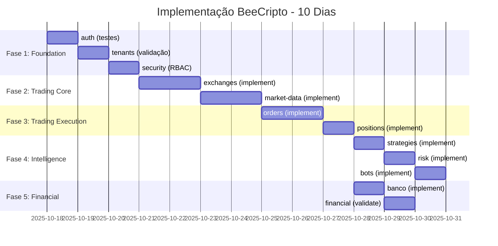

**Total**: 10 dias de desenvolvimento focado

### 13.4 Próximos Passos

1. **Agora**: Review deste relatório pelo Agente-CTO
2. **Dia 1**: Começar Fase 1 - auth testes
3. **Dia 4**: Review de Fase 1, iniciar Fase 2
4. **Dia 7**: Review de Fase 2, iniciar Fase 3 (CRÍTICO)
5. **Dia 10**: Review final, deploy em staging

### 13.5 Comandos de Início Rápido

```bash
# 1. Backup completo
tar -czf backup_$(date +%Y%m%d_%H%M%S).tar.gz backend/src/modules

# 2. Criar branch de desenvolvimento
git checkout -b feature/complete-implementation

# 3. Validar estado atual
/project-health-check

# 4. Começar com auth
cd backend/src/modules/auth
mkdir -p __tests__
code __tests__/session.middleware.test.ts

# 5. Seguir checklist do módulo auth (seção 11.2)
```

---

## ANEXOS

### A. Glossário de Termos

- **CCXT**: Cryptocurrency Exchange Trading Library (105 exchanges)
- **OHLCV**: Open, High, Low, Close, Volume (candle data)
- **P&L**: Profit and Loss
- **VaR**: Value at Risk
- **RBAC**: Role-Based Access Control
- **FK**: Foreign Key
- **Circuit Breaker**: Padrão de resiliência que interrompe operações após falhas

### B. Referências

- AGENTS.md - 53 Regras de Ouro
- CLAUDE.md - Instruções para agentes
- docs/IMPLEMENTACAO.md - Status de implementação (5%)
- docs/MIGRATION_WEB3_TO_TRADING.md - Migração Web3→Trading
- CCXT Documentation: https://docs.ccxt.com
- Better-Auth Documentation: https://www.better-auth.com/docs
- Drizzle ORM Documentation: https://orm.drizzle.team

### C. Contatos

- **Agente-CTO**: Responsável por aprovação de mudanças críticas
- **Root Cause Analyzer**: Este agente
- **QA Engineer**: Responsável por validação de qualidade
- **Security Specialist**: Responsável por security review

---

**FIM DO RELATÓRIO**

Gerado por: Root Cause Analyzer
Data: 2025-10-17
Versão: 1.0
Status: COMPLETO ✅

**Próxima Ação**: Review pelo Agente-CTO conforme protocolo do AGENTS.md
