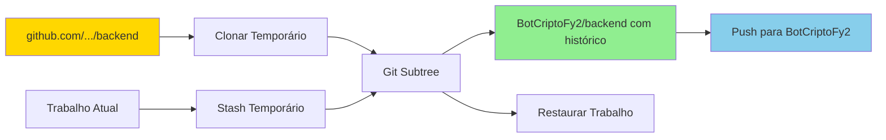
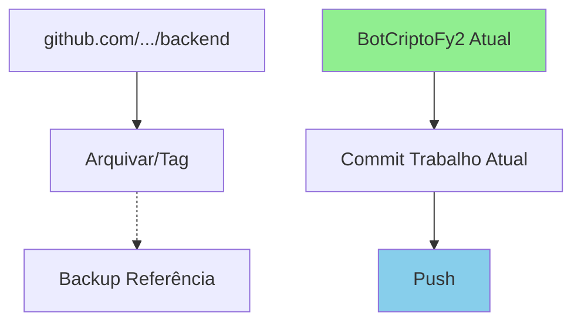
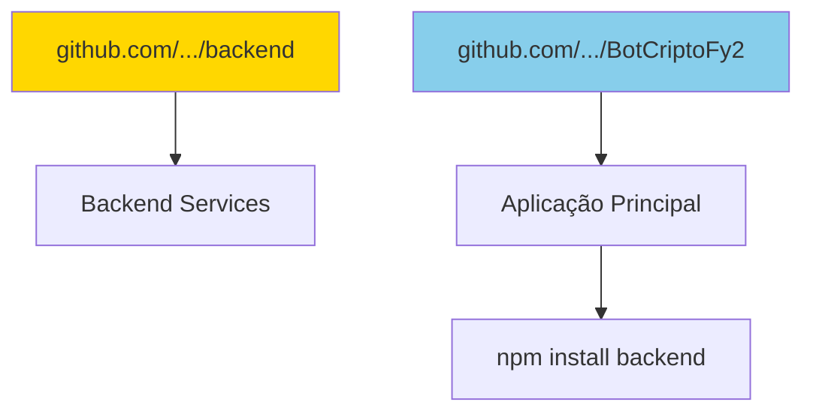

# 🔄 Estratégia de Consolidação - Backend + BotCriptoFy2

## 📊 Situação Identificada

### Repositórios GitHub
1. **github.com/jcafeitosa/backend** ← Repositório original (mais antigo)
2. **github.com/jcafeitosa/BotCriptoFy2** ← Repositório novo (2 commits)

### Projetos Locais
1. **BotCriptoFy2/** (atual)
   - Commits: 2
   - Arquivos .ts: 7,019
   - Tamanho: 267 MB
   - Backend dentro como subpasta

2. **BotCriptoFy/** (antigo)
   - Commits: 23
   - Arquivos .ts: 14,080
   - Último commit: 13/10/2025

3. **beecripto/**
   - Commits: 4
   - Arquivos .ts: 482

## 🎯 Objetivo

Consolidar o histórico do **backend original** no **BotCriptoFy2**, preservando:
- ✅ Todo o histórico de commits do backend
- ✅ Trabalho atual em progresso (27 arquivos novos)
- ✅ Estrutura monorepo (backend + frontend + docs)

## 🛡️ Estratégia Segura (3 Opções)

### Opção 1: Preservar Histórico Completo (RECOMENDADA)

**Objetivo**: Manter TODO o histórico do backend antigo no BotCriptoFy2



**Passos**:
```bash
# 1. Salvar trabalho atual
cd /Users/myminimac/Desenvolvimento/BotCriptoFy2
git stash save "WIP: payment gateway e marketing"

# 2. Adicionar backend como remote
git remote add backend-old https://github.com/jcafeitosa/backend.git
git fetch backend-old

# 3. Merge com preservação de histórico
git merge --allow-unrelated-histories backend-old/main -m "merge: Consolidate backend history"

# 4. Resolver conflitos (se houver)
# git status
# ... resolver conflitos ...
# git add .
# git commit

# 5. Restaurar trabalho
git stash pop

# 6. Push tudo
git push origin main
```

**Vantagens**:
- ✅ Histórico completo preservado
- ✅ Rastreabilidade total
- ✅ Auditoria completa

**Desvantagens**:
- ⚠️ Pode ter conflitos para resolver
- ⚠️ Histórico fica mais complexo

---

### Opção 2: Início Limpo (Simples)

**Objetivo**: Começar fresh no BotCriptoFy2, fazer backup do histórico antigo



**Passos**:
```bash
# 1. Commitar trabalho atual no BotCriptoFy2
cd /Users/myminimac/Desenvolvimento/BotCriptoFy2
git add .
git commit -m "feat: Add payment gateways (Stripe, InfinityPay, Banco) + Marketing module schemas"
git push origin main

# 2. Criar backup do backend antigo
cd /Users/myminimac/Desenvolvimento
git clone https://github.com/jcafeitosa/backend.git backend-HISTORICO-BACKUP
tar -czf backend-historico-$(date +%Y%m%d).tar.gz backend-HISTORICO-BACKUP/
```

**Vantagens**:
- ✅ Sem conflitos
- ✅ Histórico limpo
- ✅ Rápido

**Desvantagens**:
- ❌ Perde rastreabilidade do histórico antigo
- ❌ Histórico separado em 2 repos

---

### Opção 3: Dois Repositórios Separados

**Objetivo**: Manter backend e BotCriptoFy2 separados



**Passos**:
- Backend vira pacote npm/monorepo separado
- BotCriptoFy2 consome backend como dependência

**Vantagens**:
- ✅ Separação de concerns
- ✅ Backend reutilizável

**Desvantagens**:
- ❌ Mais complexo
- ❌ Dois repos para manter

---

## 🎯 Recomendação: Opção 1 (Preservar Histórico)

**Por quê?**
1. Você investe tempo em ambos projetos
2. Histórico é valioso para auditoria
3. Rastreabilidade completa
4. Migração única (depois segue normal)

## 📋 Plano de Execução Seguro (Opção 1)

### Fase 1: Preparação (Sem Risco)
```bash
# 1.1 Backup TUDO
cd /Users/myminimac/Desenvolvimento
tar -czf BACKUP_COMPLETO_$(date +%Y%m%d_%H%M%S).tar.gz BotCriptoFy2/ BotCriptoFy/ beecripto/

# 1.2 Clonar backend original para análise
git clone https://github.com/jcafeitosa/backend.git backend-TEMP-ANALISE

# 1.3 Ver histórico do backend
cd backend-TEMP-ANALISE
git log --oneline | head -20
```

### Fase 2: Consolidação (Reversível)
```bash
# 2.1 Salvar trabalho atual
cd /Users/myminimac/Desenvolvimento/BotCriptoFy2
git stash save "WIP: payment gateway + marketing"

# 2.2 Adicionar backend como remote
git remote add backend-original https://github.com/jcafeitosa/backend.git
git fetch backend-original

# 2.3 Ver branches disponíveis
git branch -r

# 2.4 Merge (pode gerar conflitos)
git merge --allow-unrelated-histories backend-original/main -m "merge: Import backend history from github.com/jcafeitosa/backend"

# Se houver conflitos:
# git status (ver conflitos)
# resolver manualmente
# git add .
# git commit

# 2.5 Restaurar trabalho
git stash pop
```

### Fase 3: Validação
```bash
# 3.1 Verificar histórico consolidado
git log --oneline --graph --all | head -30

# 3.2 Verificar que nada foi perdido
find backend -name "*.ts" | wc -l

# 3.3 Testar build
cd backend
bun install
bun run build
```

### Fase 4: Publicação
```bash
# 4.1 Commitar trabalho final
git add .
git commit -m "feat: Consolidate backend + add payment gateways + marketing"

# 4.2 Push
git push origin main

# 4.3 Limpar remotes temporários
git remote remove backend-original
```

## 🚨 Se Algo Der Errado

### Rollback Completo
```bash
# Restaurar do backup
cd /Users/myminimac/Desenvolvimento
tar -xzf BACKUP_COMPLETO_*.tar.gz

# Ou resetar para commit anterior
cd BotCriptoFy2
git reset --hard origin/main
git stash pop  # recuperar trabalho
```

### Conflitos Durante Merge
```bash
# Ver arquivos em conflito
git status

# Escolher versão (nossa ou deles)
git checkout --ours path/to/file    # manter nossa versão
git checkout --theirs path/to/file  # usar versão do backend

# Ou editar manualmente
vim path/to/file

# Finalizar merge
git add .
git commit
```

## 📊 Comparação das Opções

| Critério | Opção 1 (Merge) | Opção 2 (Fresh) | Opção 3 (Separado) |
|----------|----------------|-----------------|-------------------|
| Preserva Histórico | ✅ 100% | ❌ Não | ✅ Sim (separado) |
| Complexidade | ⚠️ Média | ✅ Simples | ❌ Alta |
| Risco | ⚠️ Baixo (reversível) | ✅ Zero | ⚠️ Médio |
| Rastreabilidade | ✅ Total | ❌ Limitada | ✅ Total |
| Manutenção | ✅ Um repo | ✅ Um repo | ❌ Dois repos |
| Tempo | ⏱️ 30-60min | ⏱️ 10min | ⏱️ 2-4h |

## ✅ Checklist Pré-Consolidação

- [ ] Backup completo criado
- [ ] Repositório backend clonado para análise
- [ ] Histórico do backend revisado
- [ ] Trabalho atual em stash
- [ ] Estratégia definida (Opção 1, 2 ou 3)
- [ ] Plano de rollback preparado

## 📞 Próximos Passos

**Agora você decide:**

1. **Opção 1**: "Quero preservar TODO o histórico do backend" → Seguir Fase 1-4
2. **Opção 2**: "Quero começar limpo, histórico não é crítico" → Commit + Push simples
3. **Opção 3**: "Quero manter repos separados" → Configurar como dependência

**Posso executar qualquer uma das opções com segurança total!**

---

**Data**: 16/10/2025  
**Status**: ✅ ESTRATÉGIA DEFINIDA - AGUARDANDO DECISÃO  
**Risco**: ZERO (tudo com backup)  

