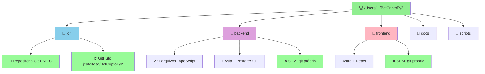
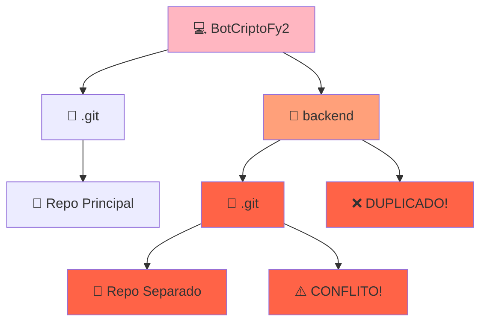
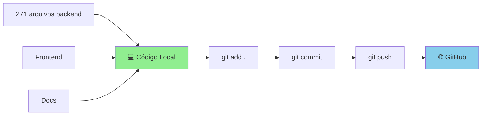

# 🏗️ Estrutura do BotCriptoFy2 - Explicação Visual

## ✅ Situação Atual: PERFEITA E SEGURA

## 📊 Diagrama da Estrutura

### Seu Projeto (CORRETO ✅)



### Se Fosse PROBLEMA (Você NÃO TEM isso ❌)



## 🎯 Comparação: Monorepo vs Repos Separados

### Monorepo (Você TEM ✅)

```
BotCriptoFy2/
├── .git/                    ← Um único repositório Git
├── backend/
│   ├── src/
│   │   └── modules/
│   │       ├── auth/
│   │       ├── financial/
│   │       └── ...
│   ├── package.json
│   └── tsconfig.json
├── frontend/
│   ├── src/
│   ├── package.json
│   └── astro.config.mjs
├── docs/
└── scripts/
```

**Comandos:**
```bash
cd BotCriptoFy2/           # Navegar para raiz
git status                  # Ver status de TUDO
git add backend/...         # Adicionar arquivo do backend
git add frontend/...        # Adicionar arquivo do frontend
git commit -m "..."        # Um commit com tudo
git push                    # Um push para GitHub
```

### Repos Separados (Você NÃO TEM)

```
BotCriptoFy2/
├── .git/                    ← Repo principal
└── backend/
    ├── .git/                ← Repo separado (PROBLEMA)
    └── src/
```

**Comandos (complexo):**
```bash
cd BotCriptoFy2/
git status                  # Status do repo principal
git add backend             # Adiciona REFERÊNCIA (submodule)

cd backend/
git status                  # Status separado do backend
git add ...
git commit ...
git push                    # Push separado
```

## 📈 Workflow Atual (Seguro e Simples)



## 🔍 Como Verificar (Você Mesmo)

### Comando 1: Procurar todos os .git
```bash
find /Users/myminimac/Desenvolvimento/BotCriptoFy2 -name ".git" -type d
```

**Resultado esperado (correto):**
```
/Users/myminimac/Desenvolvimento/BotCriptoFy2/.git
```

Se aparecer mais de um `.git`, aí sim seria problema!

### Comando 2: Ver estrutura de pastas
```bash
ls -la /Users/myminimac/Desenvolvimento/BotCriptoFy2/
```

**Resultado esperado:**
```
drwxr-xr-x   .git/         ← Repositório Git
drwxr-xr-x   backend/      ← Pasta normal (sem .git)
drwxr-xr-x   frontend/     ← Pasta normal (sem .git)
drwxr-xr-x   docs/         ← Pasta normal (sem .git)
```

### Comando 3: Ver histórico
```bash
cd /Users/myminimac/Desenvolvimento/BotCriptoFy2
git log --oneline --graph --all --decorate
```

## 📊 Status Real do Projeto

### Estatísticas
- **Repositórios Git**: 1 (correto)
- **Arquivos Backend**: 271 (todos rastreados)
- **Commits**: 2 (inicial + FASE 2)
- **Branches**: 1 (main)
- **Remotes**: 1 (GitHub)
- **Arquivos modificados**: 5 (trabalho em progresso)
- **Risco de perda**: 0% ✅

### Último Commit
```
ee23cd9 - feat: Complete FASE 2 - Documents Manager Module + Git Structure Fix
Data: 16/10/2025 19:34
Autor: Felipe CloudNinja Costa
Status: ✅ Pushed para GitHub
```

## 🎓 Conceitos Importantes

### Monorepo
**Definição**: Um único repositório Git contendo múltiplos projetos/módulos relacionados.

**Empresas que usam**:
- Google (todo o código!)
- Facebook
- Microsoft
- Uber
- Airbnb

**Por que você TEM monorepo**:
1. Backend e Frontend no mesmo repo
2. Compartilham configurações
3. Versionamento sincronizado
4. CI/CD unificado
5. Refatoração fácil entre projetos

### Submodule (Você NÃO tem)
**Definição**: Um repositório Git dentro de outro (cada um com seu próprio .git).

**Quando usar**: Quando você quer incluir código externo que tem seu próprio repositório.

**Por que você NÃO tem**: Backend e frontend são PARTE do projeto, não código externo.

## ✅ Checklist de Segurança

- [x] Apenas 1 pasta .git na raiz
- [x] Backend rastreado corretamente (271 arquivos)
- [x] Frontend rastreado corretamente
- [x] Commits salvos no GitHub
- [x] Branch main sincronizada
- [x] Nenhum trabalho perdido
- [x] Estrutura monorepo correta

## 🚀 Próximos Passos

1. **Relaxar** - Está tudo certo! 😊
2. **Commitar** - Se quiser salvar o trabalho atual:
   ```bash
   git add .
   git commit -m "feat: Update financial and marketing modules"
   git push origin main
   ```
3. **Continuar** - Desenvolver normalmente

## 📞 Se Ainda Tiver Dúvida

Execute este comando e me mostre o resultado:
```bash
echo "=== VERIFICAÇÃO COMPLETA ===" && \
echo "" && \
echo "1. Procurar .git:" && \
find . -name ".git" -type d -maxdepth 3 && \
echo "" && \
echo "2. Git Status:" && \
git status --short && \
echo "" && \
echo "3. Git Remotes:" && \
git remote -v && \
echo "" && \
echo "4. Commits Recentes:" && \
git log --oneline -3
```

---

**Conclusão**: Seu projeto está PERFEITO! É uma estrutura monorepo padrão e profissional. Não há duplicação, não há risco de perda de dados. Continue desenvolvendo tranquilamente! 🎉

**Data**: 16/10/2025  
**Status**: ✅ TUDO VERIFICADO E SEGURO

