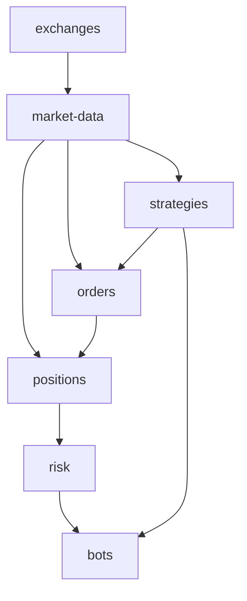
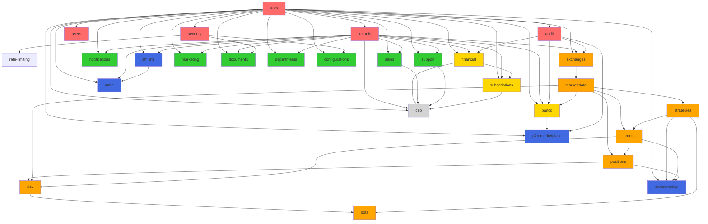

# Análise de Módulos - BotCriptoFy2

## 📊 Classificação por Importância e Dependências

### 🔴 Tier 1: Infraestrutura Core (CRÍTICO - Base do Sistema)

Módulos fundamentais dos quais **TODOS** os outros dependem:

| Módulo | Importância | Dependências | Descrição |
|--------|-------------|--------------|-----------|
| **auth** | ⭐⭐⭐⭐⭐ | - | Autenticação (Better-Auth), sessões, tokens |
| **security** | ⭐⭐⭐⭐⭐ | auth | RBAC, roles, permissions, middleware de autorização |
| **audit** | ⭐⭐⭐⭐⭐ | auth, security | Logs de auditoria, compliance LGPD/GDPR |
| **tenants** | ⭐⭐⭐⭐⭐ | auth | Multi-tenancy, isolamento de dados |
| **users** | ⭐⭐⭐⭐⭐ | auth, tenants | Gestão de perfis, tenant membership |
| **rate-limiting** | ⭐⭐⭐⭐ | security | Proteção de API, throttling |

**Dependentes:** Todos os módulos do sistema
**Impacto de falha:** Sistema inteiro offline
**Prioridade de manutenção:** MÁXIMA

---

### 🟠 Tier 2: Trading Core (CRÍTICO - Funcionalidade Principal)

Módulos de trading que são a razão de ser da plataforma:

| Módulo | Importância | Dependências | Descrição |
|--------|-------------|--------------|-----------|
| **exchanges** | ⭐⭐⭐⭐⭐ | auth, tenants, audit | Integração CCXT com 105 exchanges, credenciais |
| **market-data** | ⭐⭐⭐⭐⭐ | exchanges | OHLCV, trades, order book, tickers (TimescaleDB) |
| **orders** | ⭐⭐⭐⭐⭐ | exchanges, market-data, audit | 8 tipos de ordens (market, limit, stop, trailing) |
| **positions** | ⭐⭐⭐⭐⭐ | exchanges, orders, market-data | Gestão de posições futures/margin |
| **strategies** | ⭐⭐⭐⭐⭐ | market-data, orders, positions | Estratégias, sinais, backtesting |
| **risk** | ⭐⭐⭐⭐⭐ | positions, market-data, orders | VaR, position sizing, análise de risco |
| **bots** | ⭐⭐⭐⭐⭐ | strategies, orders, risk | Grid, DCA, scalping, bots automatizados |

**Dependentes:** social-trading, p2p-marketplace, banco
**Impacto de falha:** Trading offline, perda de receita crítica
**Prioridade de manutenção:** MÁXIMA
**Grafo de Dependências:**



---

### 🟡 Tier 3: Financeiro (ALTO - Monetização)

Módulos relacionados a dinheiro e transações:

| Módulo | Importância | Dependências | Descrição |
|--------|-------------|--------------|-----------|
| **financial** | ⭐⭐⭐⭐ | auth, tenants, audit | Invoices, expenses, budgets, payments (InfinityPay, Stripe) |
| **banco** | ⭐⭐⭐⭐ | auth, tenants, audit, market-data | Wallets (main, savings, trading, staking), portfolio |
| **subscriptions** | ⭐⭐⭐⭐ | auth, tenants, financial | Planos, usage tracking, quotas |

**Dependentes:** affiliate, mmn, p2p-marketplace
**Impacto de falha:** Receita afetada, usuários não podem pagar
**Prioridade de manutenção:** ALTA

---

### 🔵 Tier 4: Social Trading (MÉDIO-ALTO - Diferencial Competitivo)

Módulos de trading social que diferenciam a plataforma:

| Módulo | Importância | Dependências | Descrição |
|--------|-------------|--------------|-----------|
| **social-trading** | ⭐⭐⭐⭐ | auth, strategies, orders, positions | Copy trading, signals, leaderboard, feed |
| **p2p-marketplace** | ⭐⭐⭐ | auth, banco, audit | Trading peer-to-peer entre usuários |
| **affiliate** | ⭐⭐⭐ | auth, tenants | Programa de afiliados, referrals, comissões |
| **mmn** | ⭐⭐⭐ | auth, tenants, affiliate | Multi-level marketing (rede de afiliados) |

**Dependentes:** -
**Impacto de falha:** Funcionalidades sociais offline, engajamento reduzido
**Prioridade de manutenção:** MÉDIA-ALTA

---

### 🟢 Tier 5: Operacional (MÉDIO - Suporte ao Negócio)

Módulos de operação e gestão do negócio:

| Módulo | Importância | Dependências | Descrição |
|--------|-------------|--------------|-----------|
| **notifications** | ⭐⭐⭐ | auth, tenants | Sistema multi-canal (email, push, SMS) |
| **support** | ⭐⭐⭐ | auth, tenants | Tickets, SLA, knowledge base, automações |
| **sales** | ⭐⭐⭐ | auth, tenants | CRM, contacts, deals, pipeline |
| **marketing** | ⭐⭐⭐ | auth, tenants | Campanhas de email, segmentação |
| **documents** | ⭐⭐ | auth, tenants, security | Gestão de documentos, versionamento, sharing |
| **departments** | ⭐⭐ | auth, tenants | Organização, departamentos, membros |
| **configurations** | ⭐⭐ | auth, security | Configurações do sistema |

**Dependentes:** ceo
**Impacto de falha:** Operação afetada, mas sistema funcional
**Prioridade de manutenção:** MÉDIA

---

### ⚪ Tier 6: Executivo (BAIXO - Analytics)

Módulos de visualização e relatórios:

| Módulo | Importância | Dependências | Descrição |
|--------|-------------|--------------|-----------|
| **ceo** | ⭐⭐ | auth, tenants, financial, sales, support, subscriptions | Dashboard executivo, KPIs, métricas agregadas |

**Dependentes:** -
**Impacto de falha:** Executivos sem dashboard, dados ainda acessíveis
**Prioridade de manutenção:** BAIXA

---

## 🔗 Matriz de Dependências

### Módulos Mais Dependidos (fornecedores críticos):

1. **auth** → Usado por 29 módulos (100%)
2. **tenants** → Usado por 25 módulos (86%)
3. **security** → Usado por 20 módulos (69%)
4. **audit** → Usado por 15 módulos (52%)
5. **exchanges** → Usado por 7 módulos (24%)
6. **market-data** → Usado por 6 módulos (21%)

### Módulos Mais Dependentes (consumidores):

1. **ceo** → Depende de 10+ módulos
2. **social-trading** → Depende de 8 módulos
3. **bots** → Depende de 6 módulos
4. **risk** → Depende de 5 módulos
5. **p2p-marketplace** → Depende de 4 módulos

---

## 📈 Grafo Completo de Dependências



---

## 🎯 Recomendações de Arquitetura

### Ordem de Desenvolvimento/Manutenção:

1. **Tier 1** (Infraestrutura) - SEMPRE primeiro
2. **Tier 2** (Trading Core) - Segunda prioridade
3. **Tier 3** (Financeiro) - Terceira prioridade
4. **Tier 4** (Social) - Quarta prioridade
5. **Tier 5** (Operacional) - Quinta prioridade
6. **Tier 6** (Executivo) - Última prioridade

### Ciclo de Modificação (Regra 53 - AGENTS.md):

1. **Antes de modificar** qualquer módulo:
   ```bash
   grep -r "nome-do-modulo" . --exclude-dir=node_modules
   ```

2. **Analisar dependências**:
   - Módulos que dependem dele (consumidores)
   - Módulos dos quais ele depende (fornecedores)

3. **Planejar mudanças em cascata**:
   - Tier 1 → Impacta TODOS
   - Tier 2 → Impacta 3-4 (Social, Financeiro)
   - Tier 3 → Impacta 5-6 (Social, Executivo)
   - Tier 4-6 → Impacto localizado

### Estratégia de Testes:

- **Tier 1**: Coverage ≥95% (blockchain-level)
- **Tier 2**: Coverage ≥90% (trading crítico)
- **Tier 3**: Coverage ≥85% (financeiro)
- **Tier 4-6**: Coverage ≥80% (funcionalidades)

---

## 📋 Resumo por Números

- **Total de módulos:** 30
- **Tier 1 (Core):** 6 módulos
- **Tier 2 (Trading):** 7 módulos
- **Tier 3 (Financeiro):** 3 módulos
- **Tier 4 (Social):** 4 módulos
- **Tier 5 (Operacional):** 9 módulos
- **Tier 6 (Executivo):** 1 módulo

**Módulo mais crítico:** `auth` (29 dependentes)
**Módulo mais complexo:** `exchanges` (105 exchanges, CCXT)
**Módulo mais dependente:** `ceo` (10+ dependências)

---

*Gerado em: 2025-10-17*
*Análise baseada em: `/Users/myminimac/Desenvolvimento/BotCriptoFy2/backend/src/index.ts`*
