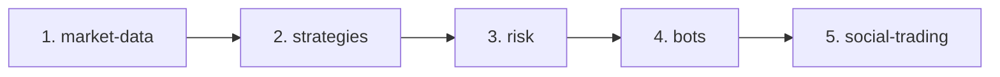
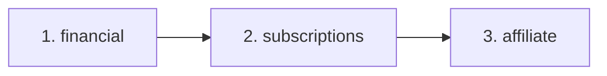

# Workflow de Trabalho com Módulos - BotCriptoFy2

## 🎯 Guia Prático de Desenvolvimento

### 1. Antes de Modificar Qualquer Módulo (OBRIGATÓRIO)

#### Passo 1: Análise de Dependências (Regra 53 - AGENTS.md)

```bash
# 1. Encontrar quem usa este módulo
grep -r "from '@/modules/nome-do-modulo" backend/src --include="*.ts" | cut -d: -f1 | sort -u

# 2. Encontrar o que este módulo usa
grep "from '@/modules/" backend/src/modules/nome-do-modulo --include="*.ts" -r

# 3. Usar o comando personalizado
/dev-analyze-dependencies src/modules/nome-do-modulo
```

#### Passo 2: Verificar Tier do Módulo

Consulte `MODULES_ANALYSIS.md` para identificar:
- **Tier 1**: Impacto CRÍTICO (todos dependem)
- **Tier 2**: Impacto ALTO (trading afetado)
- **Tier 3-6**: Impacto MÉDIO/BAIXO (localizado)

#### Passo 3: Planejar Mudanças em Cascata

```markdown
# Exemplo: Modificando `market-data`

Dependentes diretos:
- orders (usa pricing)
- positions (usa currentPrice)
- strategies (usa historical data)
- risk (usa volatility)
- bots (usa real-time data)
- banco (usa asset prices)

Ação: Atualizar TODOS os 6 módulos se alterar interface
```

---

### 2. Adicionando um Novo Módulo

#### Template de Criação:

```bash
# 1. Criar estrutura
mkdir -p backend/src/modules/novo-modulo/{routes,services,schema,types,middleware}

# 2. Criar arquivos base
touch backend/src/modules/novo-modulo/index.ts
touch backend/src/modules/novo-modulo/routes/novo-modulo.routes.ts
touch backend/src/modules/novo-modulo/services/novo-modulo.service.ts
touch backend/src/modules/novo-modulo/schema/novo-modulo.schema.ts
touch backend/src/modules/novo-modulo/types/novo-modulo.types.ts

# 3. Usar comando personalizado
/project-init novo-modulo
```

#### Estrutura Padrão:

```
novo-modulo/
├── index.ts              # Exportações principais
├── routes/
│   └── index.ts          # Rotas Elysia
├── services/
│   └── index.ts          # Lógica de negócio
├── schema/
│   └── index.ts          # Schema Drizzle
├── types/
│   └── index.ts          # TypeScript types
└── middleware/
    └── index.ts          # Middlewares específicos
```

#### Checklist de Integração:

```typescript
// 1. Exportar rotas em index.ts
export { novoModuloRoutes } from './routes';

// 2. Adicionar em backend/src/index.ts
import { novoModuloRoutes } from './modules/novo-modulo';

app.use(novoModuloRoutes);

// 3. Adicionar tag Swagger
tags: [
  { name: 'Novo Módulo', description: 'Descrição do módulo' }
]

// 4. Validar com CTO
/agent-cto-validate
```

---

### 3. Modificando Módulos Existentes

#### Tier 1 (Infraestrutura) - EXTREMO CUIDADO

```bash
# Exemplo: Modificando `auth`

⚠️ ATENÇÃO: 29 módulos dependem de auth!

Checklist:
1. [ ] Ler AGENTS.md (53 Regras)
2. [ ] Análise de dependências completa
3. [ ] Criar branch específica
4. [ ] Testes ANTES (coverage ≥95%)
5. [ ] Modificação mínima possível
6. [ ] Backward compatibility OBRIGATÓRIA
7. [ ] Testes DEPOIS (todos os 29 módulos)
8. [ ] Code review (2+ revisores)
9. [ ] Deploy gradual (canary)
```

#### Tier 2 (Trading) - ALTO CUIDADO

```bash
# Exemplo: Modificando `exchanges`

⚠️ ATENÇÃO: 7 módulos de trading dependem!

Checklist:
1. [ ] Análise de dependências
2. [ ] Testes unitários (coverage ≥90%)
3. [ ] Testes de integração (CCXT)
4. [ ] /exchange-test para validar
5. [ ] Atualizar módulos dependentes:
   - market-data
   - orders
   - positions
   - strategies
   - risk
   - bots
   - banco
6. [ ] Code review (1+ revisor)
```

#### Tier 3-6 (Outros) - CUIDADO NORMAL

```bash
# Exemplo: Modificando `marketing`

Checklist:
1. [ ] Análise de dependências
2. [ ] Testes unitários (coverage ≥80%)
3. [ ] Atualizar módulos dependentes (se houver)
4. [ ] Code review
```

---

### 4. Ordem de Desenvolvimento para Novos Features

#### Feature: "Novo Tipo de Bot"



**Explicação:**
1. Garantir que `market-data` fornece dados necessários
2. Criar estratégia em `strategies`
3. Definir limites de risco em `risk`
4. Implementar bot em `bots`
5. Integrar com `social-trading` (opcional)

#### Feature: "Novo Gateway de Pagamento"



**Explicação:**
1. Adicionar gateway em `financial`
2. Integrar com `subscriptions`
3. Configurar comissões em `affiliate`

---

### 5. Debugging de Problemas

#### Problema: "Erro ao criar ordem"

```bash
# Caminho de debugging (Tier 2):

1. Verificar `auth` (usuário autenticado?)
   └─ logs em /var/log/botcripto/auth.log

2. Verificar `exchanges` (exchange conectada?)
   └─ GET /exchanges/:id
   └─ logs em /var/log/botcripto/exchanges.log

3. Verificar `market-data` (preço disponível?)
   └─ GET /market-data/ticker?symbol=BTC/USDT
   └─ logs em /var/log/botcripto/market-data.log

4. Verificar `orders` (criação de ordem)
   └─ logs em /var/log/botcripto/orders.log
   └─ PostgreSQL: SELECT * FROM orders WHERE status='rejected'

5. Verificar `audit` (rastreamento)
   └─ SELECT * FROM audit_logs WHERE entity_type='order'
```

#### Problema: "Performance lenta"

```bash
# Identificar módulo lento:

1. Prometheus metrics
   └─ GET /metrics
   └─ Procurar por http_request_duration_seconds

2. Winston logs
   └─ grep "duration" /var/log/botcripto/*.log | sort -t: -k4 -n

3. PostgreSQL slow queries
   └─ SELECT * FROM pg_stat_statements ORDER BY mean_exec_time DESC

4. Redis slow log
   └─ redis-cli SLOWLOG GET 10

# Módulos comuns de gargalo:
- market-data (TimescaleDB queries)
- risk (cálculos complexos)
- social-trading (queries join-heavy)
```

---

### 6. Testes por Tier

#### Tier 1 (Infraestrutura)

```bash
# Coverage mínimo: 95%

bun test src/modules/auth --coverage
bun test src/modules/security --coverage
bun test src/modules/audit --coverage
bun test src/modules/tenants --coverage
bun test src/modules/users --coverage

# Testes críticos:
- Auth flow completo
- RBAC permissions
- Audit logging
- Tenant isolation
```

#### Tier 2 (Trading)

```bash
# Coverage mínimo: 90%

bun test src/modules/exchanges --coverage
bun test src/modules/market-data --coverage
bun test src/modules/orders --coverage
bun test src/modules/positions --coverage
bun test src/modules/strategies --coverage
bun test src/modules/risk --coverage
bun test src/modules/bots --coverage

# Testes críticos:
- CCXT integration
- Order execution
- Position tracking
- Risk calculations
- Backtesting accuracy
```

#### Tier 3-6 (Outros)

```bash
# Coverage mínimo: 80%

bun test src/modules/financial --coverage
bun test src/modules/banco --coverage
bun test src/modules/social-trading --coverage
# ... outros módulos
```

---

### 7. Comandos Úteis por Módulo

#### Trading Modules:

```bash
# Testar exchange
/exchange-test Binance BTC/USDT

# Validar estratégia
/strategy-validate minha-estrategia

# Executar backtest
/backtest-run --strategy=ma-crossover --symbol=BTC/USDT --start=2024-01-01

# Verificar risco
GET /risk/portfolio
GET /risk/var
```

#### Operacional:

```bash
# Health check completo
/project-health-check

# Code review
/dev-code-review src/modules/marketing

# Análise de dependências
/dev-analyze-dependencies src/modules/sales/services/deals.service.ts
```

---

### 8. Padrões de Código por Módulo

#### Services (Lógica de Negócio):

```typescript
// backend/src/modules/*/services/*.service.ts

import { db } from '@/db';
import { ServiceResponse } from '@/types';
import { logAuditEvent } from '@/modules/audit/services/audit-logger.service';

export class NomeService {
  /**
   * Descrição da função
   * @param {Type} param - Descrição do parâmetro
   * @returns {ServiceResponse<Type>} Resultado da operação
   */
  async metodo(param: Type): Promise<ServiceResponse<Type>> {
    try {
      // 1. Validação
      if (!param) {
        return { success: false, error: 'Parâmetro inválido' };
      }

      // 2. Lógica de negócio
      const result = await db.query(/* ... */);

      // 3. Audit logging (se necessário)
      await logAuditEvent({
        action: 'nome.metodo',
        entityType: 'nome',
        entityId: result.id,
      });

      // 4. Retorno
      return { success: true, data: result };
    } catch (error) {
      return {
        success: false,
        error: error instanceof Error ? error.message : 'Erro desconhecido',
      };
    }
  }
}
```

#### Routes (Endpoints):

```typescript
// backend/src/modules/*/routes/*.routes.ts

import { Elysia, t } from 'elysia';
import { nomeService } from '../services/nome.service';

export const nomeRoutes = new Elysia({ prefix: '/nome' })
  .get(
    '/',
    async ({ query }) => {
      const result = await nomeService.listar(query);
      return result;
    },
    {
      detail: {
        tags: ['Nome'],
        summary: 'Listar itens',
        description: 'Retorna lista de itens com paginação',
      },
      query: t.Object({
        page: t.Optional(t.Number()),
        limit: t.Optional(t.Number()),
      }),
    }
  );
```

---

### 9. Migração de Dependências

#### Cenário: Trocar `market-data` source

```bash
# Antes: CoinGecko
# Depois: Binance WebSocket

Módulos afetados:
1. market-data (implementação)
2. orders (pricing)
3. positions (currentPrice)
4. strategies (signals)
5. risk (volatility)
6. bots (execution)
7. banco (portfolio pricing)

Plano:
1. [ ] Criar nova implementação em market-data
2. [ ] Feature flag para switch gradual
3. [ ] Testes A/B (CoinGecko vs Binance)
4. [ ] Atualizar consumidores (1 por vez)
5. [ ] Monitorar métricas
6. [ ] Deprecar CoinGecko após 30 dias
```

---

### 10. Checklist de Finalização

Ao completar modificações em um módulo:

```markdown
## Checklist Final

### Código
- [ ] TypeScript: Zero erros
- [ ] ESLint: Zero warnings
- [ ] Prettier: Formatado
- [ ] Coverage: ≥ threshold (95%/90%/80%)
- [ ] Documentação: JSDoc completa

### Dependências
- [ ] Análise de dependências completa
- [ ] Módulos dependentes atualizados
- [ ] Backward compatibility verificada
- [ ] Breaking changes documentadas

### Testes
- [ ] Testes unitários passando
- [ ] Testes de integração passando
- [ ] Testes E2E passando (se aplicável)
- [ ] Performance tests (se Tier 1-2)

### Segurança
- [ ] Nenhum secret exposto
- [ ] Validação de entrada (Zod)
- [ ] SQL injection prevenido
- [ ] XSS prevenido
- [ ] CSRF tokens (se aplicável)

### Operacional
- [ ] Logs adequados (Winston)
- [ ] Metrics expostas (Prometheus)
- [ ] Audit events registrados
- [ ] Error handling completo

### Deploy
- [ ] CI/CD verde
- [ ] Migrations executadas
- [ ] Rollback plan definido
- [ ] Monitoring configurado

### Documentação
- [ ] CHANGELOG.md atualizado
- [ ] API docs atualizadas (Swagger)
- [ ] README atualizado (se novo módulo)
- [ ] MODULES_ANALYSIS.md atualizado (se nova dependência)
```

---

## 🚀 Exemplos Práticos

### Exemplo 1: Adicionar Nova Exchange

```bash
# Módulo afetado: exchanges

1. Verificar suporte CCXT
   └─ https://github.com/ccxt/ccxt#supported-cryptocurrency-exchange-markets

2. Adicionar em exchanges/services/exchange.service.ts
   └─ Criar método connectNovaExchange()

3. Testes
   └─ /exchange-test NovaExchange BTC/USDT

4. Atualizar dependentes (SE necessário)
   └─ market-data (se nova API)
   └─ orders (se nova sintaxe)

5. Documentação
   └─ Adicionar em SUPPORTED_EXCHANGES.md
```

### Exemplo 2: Adicionar Nova Estratégia

```bash
# Módulo afetado: strategies

1. Criar em strategies/services/strategies/nova-estrategia.ts

2. Registrar em strategies/services/strategy-registry.ts

3. Backtest
   └─ /backtest-run --strategy=nova-estrategia --symbol=BTC/USDT

4. Validação
   └─ /strategy-validate nova-estrategia

5. Integração com bots (opcional)
   └─ Adicionar em bots/types/bot-strategies.ts
```

### Exemplo 3: Adicionar Novo Tipo de Wallet

```bash
# Módulo afetado: banco

1. Atualizar schema
   └─ banco/schema/wallet.schema.ts
   └─ Adicionar novo tipo: 'lending' | 'yield'

2. Serviços
   └─ banco/services/wallet.service.ts
   └─ Criar createLendingWallet()

3. Routes
   └─ banco/routes/wallet.routes.ts
   └─ POST /banco/wallets/lending

4. Dependentes
   └─ portfolio (adicionar cálculo de yield)
   └─ financial (adicionar categoria)

5. Testes
   └─ bun test src/modules/banco --coverage
```

---

*Última atualização: 2025-10-17*
*Baseado em: AGENTS.md (53 Regras de Ouro)*
