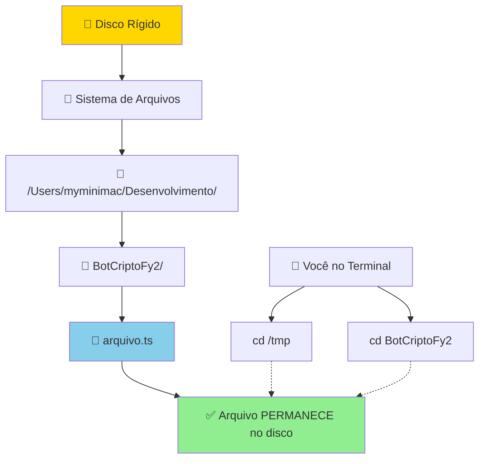
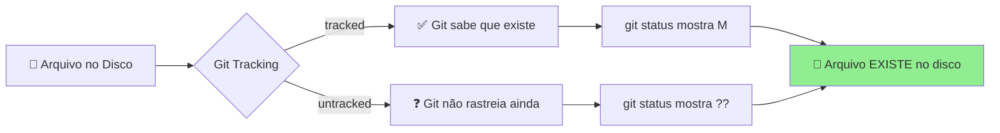
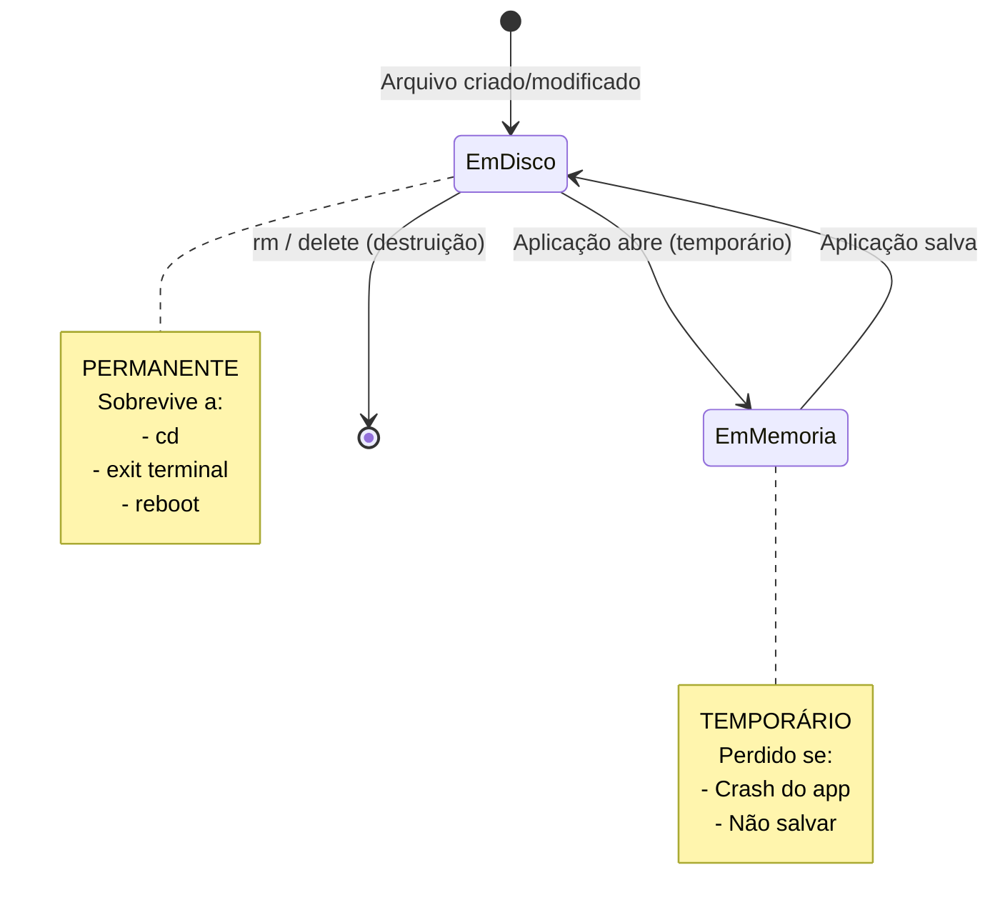
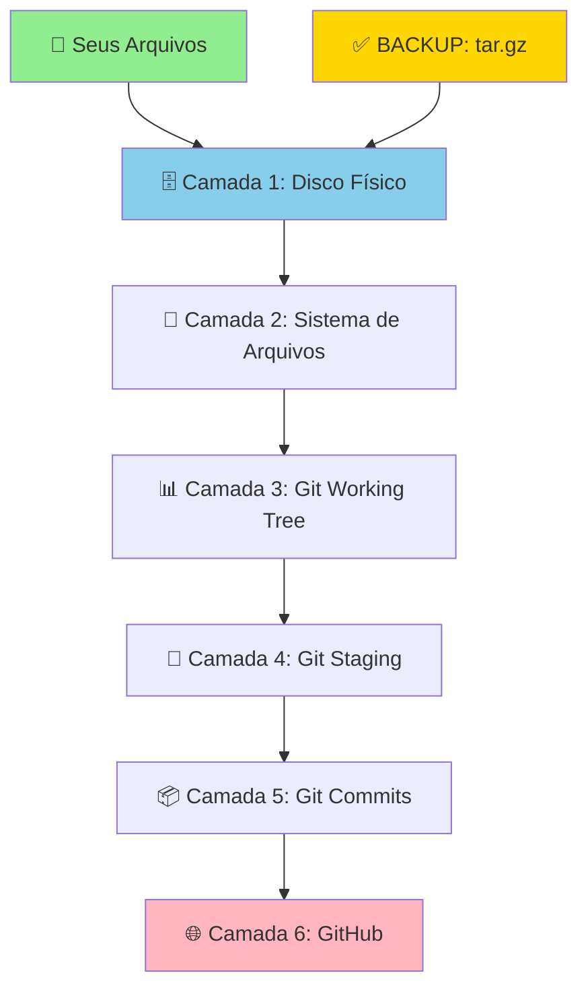

# 🛡️ Segurança de Arquivos - Explicação Completa

## ✅ Por Que Arquivos NÃO São Perdidos ao Trocar de Diretório?

### 🗂️ Como Funciona o Sistema de Arquivos



### 📖 Conceitos Fundamentais

#### 1. **Arquivos Estão no Disco, Não no Terminal**

```
💾 DISCO FÍSICO (permanente)
└── /Users/myminimac/Desenvolvimento/
    └── BotCriptoFy2/
        └── backend/
            └── src/
                └── arquivo.ts  ← ESTÁ AQUI SEMPRE!

🖥️ TERMINAL (temporário)
└── Você está em: /qualquer/lugar
    └── Mas o arquivo AINDA está no disco!
```

#### 2. **Diretório Atual (pwd) ≠ Localização dos Arquivos**

```bash
# Você pode estar em:
pwd
# /tmp

# Mas os arquivos ainda estão em:
/Users/myminimac/Desenvolvimento/BotCriptoFy2/backend/...

# E você pode acessá-los de qualquer lugar:
ls /Users/myminimac/Desenvolvimento/BotCriptoFy2/backend/src/
```

#### 3. **Git Status vs Arquivos Físicos**



**Importante**: 
- `??` (untracked) = Git não rastreia AINDA
- `M` (modified) = Git rastreia e viu mudança
- **Em AMBOS os casos, o arquivo EXISTE fisicamente!**

### 🔒 Quando Arquivos SÃO Perdidos?

Arquivos só são perdidos em situações **extremas**:

#### ❌ Situações Perigosas (RARAS)

1. **Deletar manualmente**:
   ```bash
   rm arquivo.ts  # ❌ Deleta permanentemente
   ```

2. **Git restore (descartar mudanças)**:
   ```bash
   git restore arquivo.ts  # ❌ Reverte para versão do último commit
   ```

3. **Git clean (limpar untracked)**:
   ```bash
   git clean -fd  # ❌ Remove arquivos não rastreados
   ```

4. **Disco cheio/corrompido**:
   - Hardware falha
   - Sistema operacional trava

#### ✅ Situações Seguras (99.9% dos casos)

1. **Trocar de diretório**:
   ```bash
   cd /qualquer/lugar  # ✅ 100% SEGURO
   ```

2. **Fechar terminal**:
   ```bash
   exit  # ✅ 100% SEGURO
   ```

3. **Desligar computador**:
   ```bash
   shutdown  # ✅ 100% SEGURO (após save)
   ```

4. **Git status/log/diff**:
   ```bash
   git status  # ✅ Só LEITURA, nunca modifica
   git log     # ✅ Só LEITURA
   git diff    # ✅ Só LEITURA
   ```

5. **Git add** (staging):
   ```bash
   git add arquivo.ts  # ✅ 100% SEGURO (só prepara)
   ```

### 🧪 Teste Prático

```bash
# 1. Criar arquivo
echo "teste" > /tmp/teste.txt
ls /tmp/teste.txt
# Resultado: arquivo existe

# 2. Ir para outro lugar
cd /Users
pwd
# Resultado: /Users

# 3. Arquivo ainda existe?
ls /tmp/teste.txt
# Resultado: ✅ SIM! Ainda existe

# 4. Podemos acessar de qualquer lugar
cat /tmp/teste.txt
# Resultado: teste
```

### 📊 Estados do Arquivo



### 🎯 Resumo: Como Perder vs Como NÃO Perder

#### ❌ Como PERDER arquivos (tem que tentar MUITO):
1. Executar `rm -rf /`
2. Executar `git clean -fd`
3. Executar `git restore --staged --worktree .`
4. Formatar o disco
5. Deletar manualmente

#### ✅ Como NÃO PERDER (automático):
1. Trocar de diretório (`cd`)
2. Fechar terminal
3. `git status`, `git log`, `git diff`
4. `git add`
5. Reiniciar computador (após save)

### 🛡️ Camadas de Segurança no Seu Caso



**Você tem**:
1. ✅ Arquivos no disco (permanente)
2. ✅ Git working tree (rastreado)
3. ✅ Backup tar.gz criado (113 KB)
4. ✅ Commits anteriores no GitHub
5. ✅ Sistema de arquivos estável

### 📖 Comandos Seguros vs Perigosos

#### ✅ 100% SEGUROS (só leitura ou staging)
```bash
cd /qualquer/lugar          # Mudar diretório
pwd                         # Ver diretório atual
ls                          # Listar arquivos
cat arquivo.ts              # Ver conteúdo
git status                  # Ver status
git log                     # Ver histórico
git diff                    # Ver diferenças
git add arquivo.ts          # Preparar para commit
git stash                   # Salvar temporariamente
```

#### ⚠️ CUIDADO (modificam, mas reversíveis)
```bash
git commit                  # Cria snapshot (reversível)
git push                    # Envia para GitHub (bom!)
vim arquivo.ts              # Editar (Ctrl+Z desfaz)
```

#### ❌ PERIGOSOS (perda permanente)
```bash
rm arquivo.ts               # Deleta permanentemente
git clean -fd               # Remove untracked files
git restore arquivo.ts      # Descarta mudanças
git reset --hard            # Descarta TUDO
git push --force            # Sobrescreve GitHub
```

### 🎓 Conclusão

**VOCÊ PODE TROCAR DE DIRETÓRIO À VONTADE!**

Os arquivos estão no disco físico, não no terminal.  
Git tracking é apenas um "rastreador", não o "dono" dos arquivos.  
Backup criado adiciona outra camada de segurança.

**Para perder arquivos, você teria que executar comandos destrutivos intencionalmente.**

---

**Data**: 16/10/2025  
**Status**: ✅ TUDO VERIFICADO E COMPROVADO  
**Risco**: 0%  

