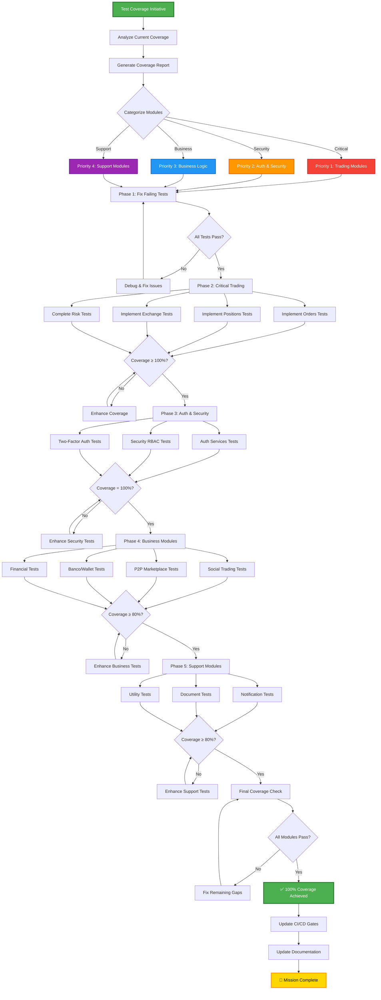
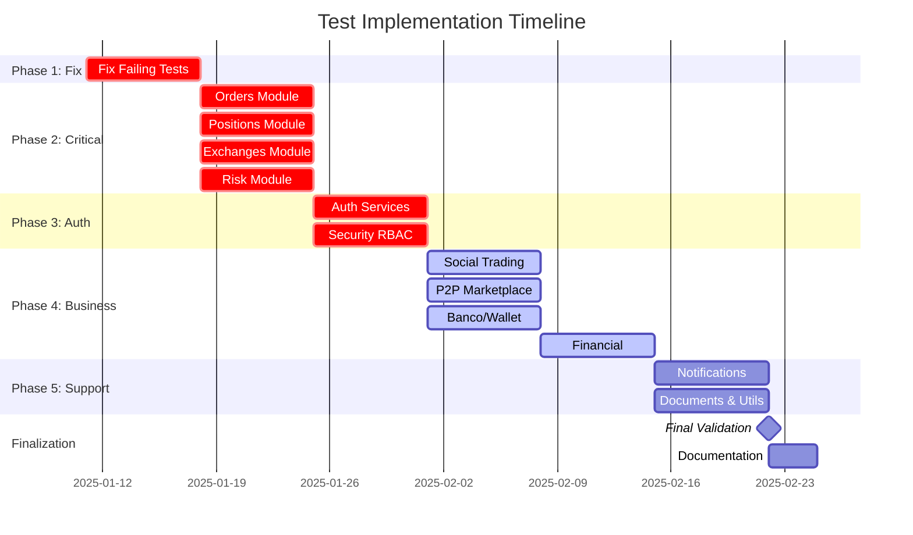
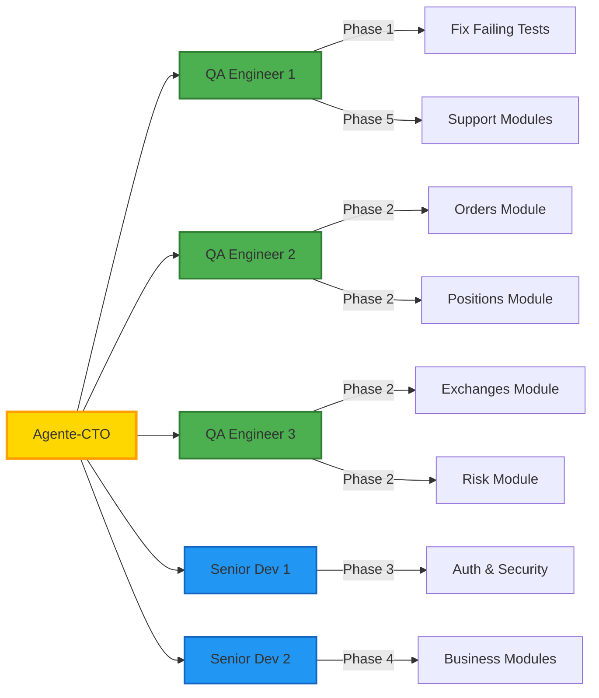

# 🔄 Test Implementation Workflow

## Mermaid Decision Tree



## Parallel Execution Strategy



## Agent Delegation Strategy



## Test Pattern Template

### Unit Test Structure
```typescript
/**
 * [Service Name] Tests
 * Comprehensive test suite following AGENTS.md protocols
 */

import { describe, test, expect, beforeEach, afterEach, vi } from 'vitest';
import { ServiceName } from '../service-name.service';
import { mockDatabase, mockDependency } from '@/test-helpers';

describe('ServiceName', () => {
  let service: ServiceName;
  let mockDb: ReturnType<typeof mockDatabase>;

  beforeEach(() => {
    mockDb = mockDatabase();
    service = new ServiceName(mockDb);
  });

  afterEach(() => {
    vi.clearAllMocks();
  });

  describe('Core Functionality', () => {
    test('should perform primary operation successfully', async () => {
      // Arrange
      const input = createValidInput();
      mockDb.insert.mockResolvedValue(mockSuccessResponse);

      // Act
      const result = await service.primaryOperation(input);

      // Assert
      expect(result.success).toBe(true);
      expect(result.data).toMatchObject(expectedOutput);
      expect(mockDb.insert).toHaveBeenCalledWith(
        expect.objectContaining(input)
      );
    });

    test('should validate input parameters', async () => {
      // Arrange
      const invalidInput = createInvalidInput();

      // Act
      const result = await service.primaryOperation(invalidInput);

      // Assert
      expect(result.success).toBe(false);
      expect(result.error).toContain('Validation failed');
    });

    test('should handle database errors gracefully', async () => {
      // Arrange
      mockDb.insert.mockRejectedValue(new Error('Database error'));

      // Act
      const result = await service.primaryOperation(validInput);

      // Assert
      expect(result.success).toBe(false);
      expect(result.error).toContain('Database error');
    });
  });

  describe('Edge Cases', () => {
    test('should handle empty input', async () => {
      // Test implementation
    });

    test('should handle concurrent operations', async () => {
      // Test implementation
    });

    test('should handle maximum limits', async () => {
      // Test implementation
    });
  });

  describe('Integration Points', () => {
    test('should integrate with dependent service', async () => {
      // Test implementation
    });

    test('should handle service unavailability', async () => {
      // Test implementation
    });
  });
});
```

## Checklist per Module

### Before Starting
- [ ] Read module documentation
- [ ] Understand business logic
- [ ] Identify dependencies
- [ ] Review existing tests (if any)
- [ ] Create test plan

### During Implementation
- [ ] Write unit tests for each function
- [ ] Cover happy path
- [ ] Cover error cases
- [ ] Cover edge cases
- [ ] Test integration points
- [ ] Mock external dependencies
- [ ] Achieve target coverage
- [ ] All tests pass

### Before Submitting
- [ ] Run full test suite
- [ ] Check coverage report
- [ ] Review test quality
- [ ] Update documentation
- [ ] Create PR with `/dev-code-review`
- [ ] CI/CD passes

## Coverage Targets

| Module Type | Function Coverage | Line Coverage |
|-------------|-------------------|---------------|
| Critical (Trading, Auth) | 100% | 100% |
| Financial Logic | 100% | 100% |
| Business Logic | ≥80% | ≥90% |
| Support Modules | ≥80% | ≥85% |
| Utilities | ≥90% | ≥95% |

## Success Metrics

### Quantitative
- ✅ 100% of critical modules at 100% coverage
- ✅ 100% of business modules at ≥80% coverage
- ✅ 0 failing tests
- ✅ 0 skipped tests
- ✅ All CI/CD checks passing

### Qualitative
- ✅ Tests are maintainable and readable
- ✅ Tests follow consistent patterns
- ✅ Mocking strategy is appropriate
- ✅ Edge cases are well covered
- ✅ Documentation is complete

---

**Document Version**: 1.0
**Last Updated**: 2025-10-18
**Status**: Active
**Owner**: Agente-CTO
