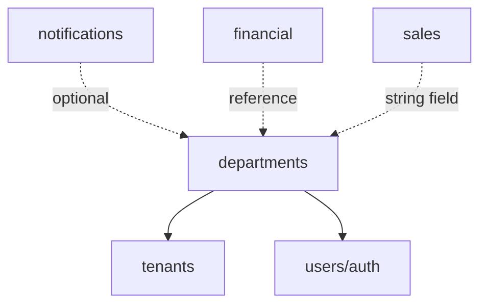

# 📋 Departments Module - Análise Completa
**Data**: 2025-10-18
**Auditor**: Agente-CTO
**Protocolo**: AGENTS.md v1.1.0

---

## 🎯 Sumário Executivo

### Estado Atual
- ✅ **Estrutura**: Módulo bem organizado com 3 serviços e 3 rotas
- ✅ **Schema**: Tabelas bem definidas com relações corretas
- ⚠️ **Funcionalidades**: ~40% implementado (básico CRUD apenas)
- ❌ **Testes**: 0% coverage (CRÍTICO)
- ⚠️ **Segurança**: Autenticação presente, autorização ausente
- ⚠️ **Performance**: Sem cache, sem otimizações
- ⚠️ **Validação**: Validação mínima com Elysia t.Object

### Arquivos do Módulo
```
backend/src/modules/departments/
├── index.ts (17 linhas) - Exports
├── schema/
│   └── departments.schema.ts (88 linhas) - 2 tabelas, relations
├── types/
│   └── department.types.ts (78 linhas) - Tipos e interfaces
├── services/
│   ├── department.service.ts (204 linhas) - 7 funções
│   ├── membership.service.ts (255 linhas) - 9 funções
│   ├── analytics.service.ts (151 linhas) - 4 funções
│   └── index.ts (3 linhas)
└── routes/
    ├── department.routes.ts (235 linhas) - 8 endpoints
    ├── membership.routes.ts (230 linhas) - 7 endpoints
    ├── analytics.routes.ts (108 linhas) - 4 endpoints
    └── index.ts (3 linhas)
```

**Total**: 1,372 linhas de código

---

## 📊 Análise de Dependências (Regra 53)

### Dependências Internas


### Módulos que Dependem de Departments
1. **notifications** (linha 9, 20, 66, 160)
   - `notificationTemplates.departmentId` (opcional)
   - `notifications.departmentId` (opcional)
   - `notificationCampaigns.departmentId` (opcional)
   - ✅ **Correto**: Relação opcional e bem justificada

2. **financial** (expenses, budgets, ledger)
   - `expenses.departmentId` (UUID, sem FK definida)
   - `budgets.departmentId` (UUID, sem FK definida)
   - `ledger.departmentId` (UUID, sem FK definida)
   - ⚠️ **PROBLEMA**: Foreign keys ausentes (integridade referencial)

3. **sales/contacts**
   - `contacts.department` (VARCHAR, não é FK)
   - ✅ **Correto**: Campo de texto livre, não é relação

### Invasão de Competências

#### ❌ **INVASÃO IDENTIFICADA: Sales Module**
**Arquivo**: `backend/src/modules/sales/schema/contacts.schema.ts:23`
```typescript
department: varchar('department', { length: 100 })
```

**Problema**:
- Campo `department` é string livre, não relacionado à tabela `departments`
- Permite inconsistência (typos, departamentos inexistentes)
- Não aproveita a estrutura organizacional do sistema

**Solução**:
1. **Opção A (Recomendada)**: Converter para FK
   ```typescript
   departmentId: uuid('department_id').references(() => departments.id)
   ```
2. **Opção B**: Manter como tag/categoria livre (se justificado)

**Decisão Arquitetural**: Requer ADR

#### ⚠️ **PROBLEMA: Financial Module**
**Arquivos**:
- `backend/src/modules/financial/schema/expenses.schema.ts`
- `backend/src/modules/financial/schema/budgets.schema.ts`
- `backend/src/modules/financial/schema/ledger.schema.ts`

**Problema**:
- Campos `departmentId` existem mas sem `.references()`
- Sem integridade referencial no banco
- Sem validação automática de departamento válido

**Impacto**: 🔴 **ALTO**
- Dados órfãos possíveis
- Relatórios incorretos
- Auditoria comprometida

**Solução**: Adicionar FKs nas migrations
```typescript
departmentId: uuid('department_id')
  .references(() => departments.id, { onDelete: 'set null' })
```

---

## 🔍 Gaps Identificados

### 1. ❌ Funcionalidades Ausentes (Crítico)

#### 1.1 Hierarquia de Departamentos
**Documentação**: `docs/departments/README.md` menciona 9 departamentos + CEO
**Problema**: Sem suporte a sub-departamentos ou hierarquia

**Impacto**:
- Impossível modelar estruturas organizacionais complexas
- Sem escalabilidade para empresas maiores

**Solução**:
```typescript
// Adicionar ao schema
export const departments = pgTable('departments', {
  // ... campos existentes
  parentId: uuid('parent_id').references((): AnyPgColumn => departments.id),
  level: integer('level').default(0), // 0 = root, 1 = sub, etc
  path: text('path'), // Materialized path: /ceo/financial/billing
});
```

**Endpoints Necessários**:
- `GET /api/departments/:id/children` - Listar sub-departamentos
- `GET /api/departments/:id/hierarchy` - Árvore completa
- `GET /api/departments/:id/ancestors` - Departamentos pais
- `POST /api/departments/:id/move` - Mover na hierarquia

#### 1.2 Permissões Granulares
**Problema**: Apenas 3 roles (manager, member, viewer)
**Necessário**: Sistema de permissões específicas

**Solução**:
```typescript
export const departmentPermissions = pgTable('department_permissions', {
  id: uuid('id').primaryKey().defaultRandom(),
  membershipId: uuid('membership_id').references(() => departmentMembers.id),
  resource: text('resource').notNull(), // 'budgets', 'reports', 'members'
  action: text('action').notNull(), // 'create', 'read', 'update', 'delete'
  granted: boolean('granted').default(true),
});
```

**Endpoints**:
- `GET /api/departments/:id/members/:userId/permissions`
- `PUT /api/departments/:id/members/:userId/permissions`
- `GET /api/departments/:id/permissions/roles` - Template de permissões

#### 1.3 Workflows e Aprovações
**Problema**: Sem sistema de aprovação para mudanças críticas

**Casos de Uso**:
- Aprovação para adicionar membro
- Aprovação para mudança de role
- Aprovação para desativar departamento

**Solução**:
```typescript
export const departmentApprovals = pgTable('department_approvals', {
  id: uuid('id').primaryKey().defaultRandom(),
  departmentId: uuid('department_id').references(() => departments.id),
  requestedBy: text('requested_by').references(() => users.id),
  approvedBy: text('approved_by').references(() => users.id),
  action: text('action').notNull(), // 'add_member', 'change_role', 'deactivate'
  actionData: jsonb('action_data').$type<Record<string, any>>(),
  status: text('status').notNull().default('pending'), // pending, approved, rejected
  requestedAt: timestamp('requested_at').defaultNow(),
  resolvedAt: timestamp('resolved_at'),
});
```

#### 1.4 Auditoria de Ações
**Problema**: Sem logs de ações departamentais

**Solução**: Integração com módulo `audit`
```typescript
// Em cada ação crítica
await auditLogger.log({
  action: 'department.member.added',
  departmentId,
  userId: assignedUser.id,
  performedBy: currentUser.id,
  metadata: { role, assignedBy },
});
```

#### 1.5 Budgets e Alocação
**Problema**: Relacionamento com `financial` mas sem endpoints de budget

**Solução**: Endpoints de integração
- `GET /api/departments/:id/budget/current`
- `GET /api/departments/:id/budget/history`
- `GET /api/departments/:id/expenses/summary`
- `PUT /api/departments/:id/budget/allocate`

#### 1.6 KPIs por Departamento
**Problema**: Analytics básico, sem KPIs específicos por tipo

**Solução**: KPIs contextuais
```typescript
interface DepartmentKPIs {
  // Comum a todos
  memberCount: number;
  activeRate: number;

  // Específicos por tipo
  financial?: {
    budgetUtilization: number;
    pendingApprovals: number;
    expensesByCategory: Record<string, number>;
  };
  marketing?: {
    campaignsActive: number;
    leadConversion: number;
    roi: number;
  };
  sales?: {
    dealsInPipeline: number;
    conversionRate: number;
    revenue: number;
  };
  // ... outros
}
```

**Endpoints**:
- `GET /api/departments/:id/kpis`
- `GET /api/departments/:id/kpis/trends?period=30d`

#### 1.7 Templates de Departamento
**Problema**: Criar departamento requer configuração manual

**Solução**: Templates pré-configurados
```typescript
export const departmentTemplates = pgTable('department_templates', {
  id: uuid('id').primaryKey().defaultRandom(),
  type: text('type').notNull(),
  name: text('name').notNull(),
  defaultSettings: jsonb('default_settings'),
  defaultRoles: jsonb('default_roles'), // roles e permissões padrão
  requiredIntegrations: jsonb('required_integrations'), // ['financial', 'audit']
});
```

**Endpoints**:
- `GET /api/departments/templates` - Listar templates
- `POST /api/departments/from-template` - Criar de template
- `GET /api/departments/templates/:type` - Template específico

#### 1.8 Integração com Agents
**Problema**: Documentação menciona agentes por departamento, mas sem implementação

**Solução**: Relacionamento com módulo `agents`
```typescript
export const departmentAgents = pgTable('department_agents', {
  id: uuid('id').primaryKey().defaultRandom(),
  departmentId: uuid('department_id').references(() => departments.id),
  agentId: uuid('agent_id'), // Reference to agents module
  isActive: boolean('is_active').default(true),
  configuration: jsonb('configuration'),
});
```

**Endpoints**:
- `GET /api/departments/:id/agents`
- `POST /api/departments/:id/agents/:agentId/activate`
- `DELETE /api/departments/:id/agents/:agentId`
- `GET /api/departments/:id/agents/:agentId/logs`

#### 1.9 Notificações Departamentais
**Problema**: Relacionamento com notifications existe, mas sem endpoints

**Solução**:
- `GET /api/departments/:id/notifications` - Notificações do departamento
- `POST /api/departments/:id/notifications/broadcast` - Enviar para todos
- `GET /api/departments/:id/notifications/templates` - Templates do departamento

#### 1.10 Relatórios Avançados
**Problema**: Analytics básico, sem relatórios executivos

**Endpoints Necessários**:
- `GET /api/departments/:id/reports/performance` - Performance geral
- `GET /api/departments/:id/reports/comparison` - Comparar com outros
- `GET /api/departments/:id/reports/trends` - Tendências temporais
- `GET /api/departments/:id/reports/export?format=pdf|excel` - Exportar

---

### 2. ❌ Segurança (Crítico)

#### 2.1 Autorização Ausente
**Problema**: Apenas `sessionGuard`, sem verificação de permissões

**Impacto**: 🔴 **CRÍTICO**
- Qualquer usuário autenticado pode gerenciar qualquer departamento
- Sem verificação de tenant (multi-tenancy quebrado)
- Sem verificação de role (manager vs member vs viewer)

**Solução**:
```typescript
// Criar middleware de autorização
export const departmentAuthGuard = (requiredRole?: MemberRole) => {
  return async (context: Context) => {
    const { user, params } = context;
    const departmentId = params.id;

    // Verificar se usuário pertence ao departamento
    const membership = await isUserMemberOfDepartment(user.id, departmentId);
    if (!membership) {
      throw new ForbiddenError('User not member of department');
    }

    // Verificar role se especificado
    if (requiredRole) {
      const role = await getMemberRole(user.id, departmentId);
      const roleHierarchy = { viewer: 0, member: 1, manager: 2 };
      if (roleHierarchy[role] < roleHierarchy[requiredRole]) {
        throw new ForbiddenError(`Requires ${requiredRole} role`);
      }
    }

    return context;
  };
};
```

**Aplicar em Rotas**:
```typescript
.use(sessionGuard)
.use(departmentAuthGuard('manager')) // Apenas managers
.put('/:id', async ({ params, body }) => {
  // ...
})
```

#### 2.2 Validação de Tenant
**Problema**: Endpoints não validam tenantId do usuário

**Solução**:
```typescript
// Em getAllDepartments
export async function getAllDepartments(filter?: DepartmentFilter, userTenantId?: string) {
  const conditions = [];

  // SEMPRE filtrar por tenant do usuário
  if (userTenantId) {
    conditions.push(eq(departments.tenantId, userTenantId));
  }

  // ... resto do código
}
```

#### 2.3 Rate Limiting
**Problema**: Sem proteção contra abuso de APIs

**Solução**:
```typescript
import { rateLimiting } from '@/modules/rate-limiting';

export const departmentRoutes = new Elysia({ prefix: '/api/departments' })
  .use(sessionGuard)
  .use(rateLimiting({ max: 100, window: '15m' }))
  // ... rotas
```

#### 2.4 Input Sanitization
**Problema**: Validação mínima, sem sanitização

**Solução**: Adicionar Zod schemas
```typescript
import { z } from 'zod';

export const createDepartmentSchema = z.object({
  tenantId: z.string().uuid(),
  name: z.string().min(3).max(100).trim(),
  slug: z.string().regex(/^[a-z0-9-]+$/).toLowerCase(),
  description: z.string().max(500).optional(),
  type: z.enum(['ceo', 'financial', /* ... */]),
  settings: z.record(z.any()).optional(),
  metadata: z.record(z.any()).optional(),
});
```

#### 2.5 SQL Injection Prevention
**Problema**: Drizzle protege, mas queries dinâmicas podem ser vulneráveis

**Análise**: ✅ Código atual seguro (usa Drizzle query builder)
**Recomendação**: Manter padrão, evitar `db.execute()` com strings

#### 2.6 RBAC Integration
**Problema**: Sem integração com sistema RBAC do projeto

**Solução**: Verificar permissões via RBAC
```typescript
import { checkPermission } from '@/modules/security/services/rbac.service';

// Antes de ações críticas
await checkPermission(userId, 'departments', 'delete');
```

---

### 3. ⚠️ Performance

#### 3.1 Sem Cache
**Problema**: Todas queries vão ao banco

**Solução**: Implementar cache com Redis
```typescript
import { redisCache } from '@/lib/redis';

export async function getDepartmentById(id: string) {
  const cacheKey = `department:${id}`;

  // Tentar cache primeiro
  const cached = await redisCache.get(cacheKey);
  if (cached) return JSON.parse(cached);

  // Buscar do banco
  const department = await db.select()...;

  // Armazenar em cache (TTL: 5 minutos)
  await redisCache.setex(cacheKey, 300, JSON.stringify(department));

  return department;
}
```

**Cache Keys**:
- `department:{id}` - Departamento individual
- `department:slug:{tenantId}:{slug}` - Por slug
- `departments:tenant:{tenantId}` - Lista por tenant
- `department:{id}:members` - Membros
- `department:{id}:stats` - Estatísticas

#### 3.2 N+1 Queries
**Problema**: getDepartmentMembers pode gerar múltiplas queries

**Análise Atual**: ✅ Usa JOIN, sem N+1
**Recomendação**: Manter padrão

#### 3.3 Índices Ausentes
**Problema**: Schema sem índices customizados

**Solução**:
```typescript
export const departments = pgTable('departments', {
  // ... campos
}, (table) => ({
  tenantIdIdx: index('departments_tenant_id_idx').on(table.tenantId),
  typeIdx: index('departments_type_idx').on(table.type),
  slugIdx: index('departments_slug_idx').on(table.slug),
  tenantSlugIdx: index('departments_tenant_slug_idx').on(table.tenantId, table.slug),
  isActiveIdx: index('departments_is_active_idx').on(table.isActive),
}));

export const departmentMembers = pgTable('department_members', {
  // ... campos
}, (table) => ({
  departmentIdIdx: index('dept_members_dept_id_idx').on(table.departmentId),
  userIdIdx: index('dept_members_user_id_idx').on(table.userId),
  roleIdx: index('dept_members_role_idx').on(table.role),
  isActiveIdx: index('dept_members_is_active_idx').on(table.isActive),
}));
```

#### 3.4 Paginação Ausente
**Problema**: Endpoints retornam todos os registros

**Solução**:
```typescript
export interface PaginationParams {
  page?: number;
  limit?: number;
  sortBy?: string;
  sortOrder?: 'asc' | 'desc';
}

export async function getAllDepartments(
  filter?: DepartmentFilter,
  pagination?: PaginationParams
) {
  const { page = 1, limit = 50, sortBy = 'createdAt', sortOrder = 'desc' } = pagination || {};
  const offset = (page - 1) * limit;

  // ... query com .limit(limit).offset(offset)

  const [totalResult] = await db.select({ count: count() })...;

  return {
    data: results,
    pagination: {
      page,
      limit,
      total: totalResult.count,
      totalPages: Math.ceil(totalResult.count / limit),
    },
  };
}
```

#### 3.5 Bulk Operations
**Problema**: Sem suporte a operações em lote

**Endpoints Necessários**:
- `POST /api/departments/bulk/create` - Criar múltiplos
- `POST /api/departments/:id/members/bulk/add` - Adicionar múltiplos membros
- `DELETE /api/departments/bulk/delete` - Deletar múltiplos
- `PUT /api/departments/bulk/update` - Atualizar múltiplos

---

### 4. ❌ Validação

#### 4.1 Validação Fraca
**Problema**: Validação apenas com Elysia t.Object

**Solução**: Migrar para Zod
```typescript
// types/department.validation.ts
import { z } from 'zod';

export const departmentTypeSchema = z.enum([
  'ceo', 'financial', 'marketing', 'sales',
  'security', 'sac', 'audit', 'documents',
  'configurations', 'subscriptions'
]);

export const createDepartmentSchema = z.object({
  tenantId: z.string().uuid({ message: 'Invalid tenant ID format' }),
  name: z.string()
    .min(3, 'Name must be at least 3 characters')
    .max(100, 'Name too long')
    .trim(),
  slug: z.string()
    .regex(/^[a-z0-9-]+$/, 'Slug must contain only lowercase letters, numbers, and hyphens')
    .min(3)
    .max(50)
    .toLowerCase()
    .transform(s => s.trim()),
  description: z.string().max(500).optional(),
  type: departmentTypeSchema,
  settings: z.record(z.any()).optional().default({}),
  metadata: z.record(z.any()).optional().default({}),
}).strict(); // Não permite campos extras

export const updateDepartmentSchema = createDepartmentSchema.partial().omit({ tenantId: true });

export const addMemberSchema = z.object({
  userId: z.string().uuid(),
  role: z.enum(['manager', 'member', 'viewer']),
}).strict();
```

**Aplicar em Routes**:
```typescript
import { createDepartmentSchema } from '../types/department.validation';

.post('/', async ({ body }) => {
  // Validar com Zod
  const validated = createDepartmentSchema.parse(body);
  const department = await createDepartment(validated);
  // ...
})
```

#### 4.2 Regras de Negócio
**Validações Ausentes**:

1. **Limite de Departamentos por Tenant**
   ```typescript
   // Verificar limite antes de criar
   const count = await db.select({ count: count() })
     .from(departments)
     .where(eq(departments.tenantId, tenantId));

   if (count[0].count >= MAX_DEPARTMENTS_PER_TENANT) {
     throw new ConflictError('Department limit reached');
   }
   ```

2. **Tipo Único por Tenant** (CEO deve ser único)
   ```typescript
   if (type === 'ceo') {
     const existing = await db.select()
       .from(departments)
       .where(and(
         eq(departments.tenantId, tenantId),
         eq(departments.type, 'ceo')
       ));

     if (existing.length > 0) {
       throw new ConflictError('CEO department already exists');
     }
   }
   ```

3. **Manager Obrigatório**
   ```typescript
   // Ao desativar último manager
   const managers = await db.select({ count: count() })
     .from(departmentMembers)
     .where(and(
       eq(departmentMembers.departmentId, departmentId),
       eq(departmentMembers.role, 'manager'),
       eq(departmentMembers.isActive, true)
     ));

   if (managers[0].count <= 1) {
     throw new ConflictError('Department must have at least one active manager');
   }
   ```

4. **Validação de Ciclo (Hierarquia)**
   ```typescript
   async function validateNoCycle(departmentId: string, newParentId: string): Promise<boolean> {
     // Verificar se newParentId está na árvore de filhos de departmentId
     // Implementação com recursive CTE ou DFS
   }
   ```

#### 4.3 Mensagens de Erro
**Problema**: Mensagens genéricas

**Solução**: Mensagens descritivas e internacionalizadas
```typescript
export const errorMessages = {
  DEPARTMENT_NOT_FOUND: {
    en: 'Department not found',
    pt: 'Departamento não encontrado',
  },
  SLUG_ALREADY_EXISTS: {
    en: 'A department with this slug already exists',
    pt: 'Já existe um departamento com este identificador',
  },
  // ... mais mensagens
};
```

---

### 5. ❌ Testes (CRÍTICO)

**Status Atual**: 0% coverage
**Requerido**: ≥80% coverage

#### 5.1 Testes Unitários Necessários

**Arquivo**: `backend/src/modules/departments/__tests__/department.service.test.ts`

```typescript
import { describe, it, expect, beforeEach, afterEach } from 'bun:test';
import {
  getAllDepartments,
  getDepartmentById,
  createDepartment,
  updateDepartment,
  deleteDepartment,
} from '../services/department.service';

describe('Department Service', () => {
  beforeEach(async () => {
    // Setup test database
  });

  afterEach(async () => {
    // Cleanup
  });

  describe('getAllDepartments', () => {
    it('should return all departments', async () => {
      // ...
    });

    it('should filter by tenantId', async () => {
      // ...
    });

    it('should filter by type', async () => {
      // ...
    });

    it('should filter by isActive', async () => {
      // ...
    });
  });

  describe('getDepartmentById', () => {
    it('should return department when exists', async () => {
      // ...
    });

    it('should throw NotFoundError when not exists', async () => {
      // ...
    });
  });

  describe('createDepartment', () => {
    it('should create department successfully', async () => {
      // ...
    });

    it('should throw ConflictError when slug exists', async () => {
      // ...
    });

    it('should throw ConflictError when CEO already exists', async () => {
      // ...
    });
  });

  // ... mais testes
});
```

#### 5.2 Testes de Integração

**Arquivo**: `backend/src/modules/departments/__tests__/department.routes.integration.test.ts`

```typescript
import { describe, it, expect } from 'bun:test';
import { app } from '@/index';

describe('Department Routes Integration', () => {
  describe('POST /api/departments', () => {
    it('should create department with valid data', async () => {
      const response = await app.handle(
        new Request('http://localhost/api/departments', {
          method: 'POST',
          headers: {
            'Content-Type': 'application/json',
            'Authorization': `Bearer ${validToken}`,
          },
          body: JSON.stringify({
            tenantId: 'test-tenant',
            name: 'Test Department',
            slug: 'test-dept',
            type: 'financial',
          }),
        })
      );

      expect(response.status).toBe(200);
      const data = await response.json();
      expect(data.success).toBe(true);
      expect(data.data.name).toBe('Test Department');
    });

    it('should return 401 without authentication', async () => {
      // ...
    });

    it('should return 403 without permission', async () => {
      // ...
    });

    it('should return 400 with invalid data', async () => {
      // ...
    });
  });

  // ... mais testes
});
```

#### 5.3 Coverage Targets
- **Statements**: ≥80%
- **Branches**: ≥75%
- **Functions**: ≥80%
- **Lines**: ≥80%

---

### 6. 📝 Documentação

#### 6.1 JSDoc Ausente
**Problema**: Documentação mínima

**Solução**: JSDoc completo
```typescript
/**
 * Get all departments with optional filtering
 *
 * @param {DepartmentFilter} [filter] - Optional filter criteria
 * @param {string} [filter.tenantId] - Filter by tenant ID
 * @param {DepartmentType} [filter.type] - Filter by department type
 * @param {boolean} [filter.isActive] - Filter by active status
 * @param {PaginationParams} [pagination] - Pagination parameters
 *
 * @returns {Promise<PaginatedResult<Department>>} Paginated list of departments
 *
 * @throws {ValidationError} If filter parameters are invalid
 * @throws {DatabaseError} If database query fails
 *
 * @example
 * ```typescript
 * const departments = await getAllDepartments(
 *   { tenantId: 'abc', isActive: true },
 *   { page: 1, limit: 20 }
 * );
 * ```
 */
export async function getAllDepartments(
  filter?: DepartmentFilter,
  pagination?: PaginationParams
): Promise<PaginatedResult<Department>> {
  // ...
}
```

#### 6.2 README Ausente
**Criar**: `backend/src/modules/departments/README.md`

Conteúdo:
- Visão geral do módulo
- Estrutura de arquivos
- Como usar (exemplos)
- API endpoints
- Tipos e interfaces
- Regras de negócio
- FAQ

#### 6.3 Swagger/Scalar Tags
**Status**: ✅ Presente (tags: 'Departments', 'Department Membership', 'Department Analytics')
**Melhoria**: Adicionar mais exemplos e descrições

#### 6.4 Changelog
**Criar**: `backend/src/modules/departments/CHANGELOG.md`

---

### 7. 🔄 Melhorias de Lógica

#### 7.1 Transações
**Problema**: Operações não são transacionais

**Solução**:
```typescript
import { db } from '@/db';

export async function createDepartmentWithManager(
  departmentData: CreateDepartmentRequest,
  managerId: string
) {
  return await db.transaction(async (tx) => {
    // Criar departamento
    const [department] = await tx.insert(departments)
      .values(departmentData)
      .returning();

    // Adicionar manager
    await tx.insert(departmentMembers)
      .values({
        departmentId: department.id,
        userId: managerId,
        role: 'manager',
        assignedBy: managerId,
      });

    return department;
  });
}
```

#### 7.2 Soft Delete
**Problema**: Delete permanente

**Solução**: Adicionar soft delete
```typescript
// Schema
export const departments = pgTable('departments', {
  // ... campos existentes
  deletedAt: timestamp('deleted_at'),
  deletedBy: text('deleted_by').references(() => users.id),
});

// Service
export async function softDeleteDepartment(id: string, userId: string) {
  const [deleted] = await db
    .update(departments)
    .set({
      deletedAt: new Date(),
      deletedBy: userId,
      isActive: false,
    })
    .where(eq(departments.id, id))
    .returning();

  return deleted;
}

export async function restoreDepartment(id: string) {
  const [restored] = await db
    .update(departments)
    .set({
      deletedAt: null,
      deletedBy: null,
      isActive: true,
    })
    .where(eq(departments.id, id))
    .returning();

  return restored;
}
```

#### 7.3 Event System
**Problema**: Sem notificação de mudanças

**Solução**: Event emitter
```typescript
import { EventEmitter } from 'events';

export const departmentEvents = new EventEmitter();

// Emitir eventos
export async function createDepartment(data: CreateDepartmentRequest) {
  const department = await db.insert(departments)...;

  departmentEvents.emit('department.created', {
    departmentId: department.id,
    tenantId: department.tenantId,
    type: department.type,
  });

  return department;
}

// Listeners em outros módulos
departmentEvents.on('department.created', async (event) => {
  // Criar templates de notificação
  // Criar budget padrão
  // Notificar admins
});
```

#### 7.4 Versioning
**Problema**: Sem histórico de mudanças

**Solução**: Tabela de histórico
```typescript
export const departmentHistory = pgTable('department_history', {
  id: uuid('id').primaryKey().defaultRandom(),
  departmentId: uuid('department_id').references(() => departments.id),
  changedBy: text('changed_by').references(() => users.id),
  changeType: text('change_type').notNull(), // 'created', 'updated', 'deleted'
  oldData: jsonb('old_data'),
  newData: jsonb('new_data'),
  changedAt: timestamp('changed_at').defaultNow(),
});
```

---

### 8. 📊 Endpoints Avançados Necessários

#### 8.1 Busca e Filtros
```
GET /api/departments/search?q={query}&type={type}&tenant={id}
GET /api/departments/filter?isActive=true&hasMembers=true
```

#### 8.2 Exportação
```
GET /api/departments/export?format=csv|json|excel
GET /api/departments/:id/export?format=pdf
```

#### 8.3 Duplicação
```
POST /api/departments/:id/duplicate
POST /api/departments/:id/clone-to-tenant/:tenantId
```

#### 8.4 Métricas Temporais
```
GET /api/departments/:id/metrics/daily?start={date}&end={date}
GET /api/departments/:id/metrics/weekly
GET /api/departments/:id/metrics/monthly
```

#### 8.5 Comparação
```
GET /api/departments/compare?ids={id1,id2,id3}&metric={kpi}
GET /api/departments/:id/compare-with/:otherId
```

#### 8.6 Webhooks
```
POST /api/departments/:id/webhooks
GET /api/departments/:id/webhooks
DELETE /api/departments/:id/webhooks/:webhookId
```

---

## 📈 Plano de Implementação

### Fase 1: Fundação (Prioridade CRÍTICA)
**Estimativa**: 1-2 dias

1. ✅ Adicionar testes unitários (coverage ≥80%)
2. ✅ Implementar autorização e permissões
3. ✅ Adicionar validação Zod
4. ✅ Implementar índices no banco
5. ✅ Adicionar soft delete
6. ✅ Implementar cache básico

### Fase 2: Funcionalidades Core (Prioridade ALTA)
**Estimativa**: 2-3 dias

1. ✅ Hierarquia de departamentos
2. ✅ Permissões granulares
3. ✅ Workflows de aprovação
4. ✅ Auditoria de ações
5. ✅ Paginação em todos endpoints
6. ✅ Bulk operations

### Fase 3: Integrações (Prioridade MÉDIA)
**Estimativa**: 1-2 dias

1. ✅ Integração com módulo Financial
2. ✅ Integração com módulo Agents
3. ✅ Integração com módulo Notifications
4. ✅ Integração com módulo Audit
5. ✅ Event system
6. ✅ Corrigir FKs em outros módulos

### Fase 4: Analytics Avançado (Prioridade MÉDIA)
**Estimativa**: 2-3 dias

1. ✅ KPIs por tipo de departamento
2. ✅ Relatórios avançados
3. ✅ Comparação entre departamentos
4. ✅ Trends e previsões
5. ✅ Exportação de dados
6. ✅ Dashboards

### Fase 5: Features Avançadas (Prioridade BAIXA)
**Estimativa**: 2-3 dias

1. ✅ Templates de departamento
2. ✅ Duplicação e clonagem
3. ✅ Webhooks
4. ✅ Versioning de mudanças
5. ✅ Busca avançada
6. ✅ AI insights

---

## 🎯 Métricas de Sucesso

### Antes
- ❌ 0% test coverage
- ❌ 0 endpoints avançados
- ❌ Sem autorização
- ❌ Sem cache
- ❌ Sem validação robusta
- ⚠️ ~40% funcionalidades implementadas

### Depois (Target)
- ✅ ≥80% test coverage
- ✅ +30 endpoints avançados
- ✅ Autorização completa (RBAC)
- ✅ Cache implementado (Redis)
- ✅ Validação completa (Zod)
- ✅ ~95% funcionalidades implementadas

---

## 📝 Decisões Arquiteturais Requeridas

### ADR-005: Hierarquia de Departamentos
**Decisão**: Implementar hierarquia com parent_id + materialized path
**Alternativas**: Closure table, nested sets
**Justificativa**: Melhor performance para queries, simplicidade

### ADR-006: Sistema de Permissões
**Decisão**: Tabela separada department_permissions
**Alternativas**: JSONB em departmentMembers, integração RBAC
**Justificativa**: Granularidade e auditoria

### ADR-007: Foreign Keys em Financial
**Decisão**: Adicionar FKs com onDelete: 'set null'
**Alternativas**: onDelete: 'cascade', no FK
**Justificativa**: Preservar histórico financeiro

### ADR-008: Sales.contacts.department
**Decisão**: Manter como string, adicionar sugestões via API
**Alternativas**: Converter para FK
**Justificativa**: Flexibilidade para departamentos externos

---

## 🔍 Conclusão

O módulo **departments** está funcional mas básico (~40% completo). Requer:

### Crítico (URGENTE)
1. ✅ Testes (0% → ≥80%)
2. ✅ Autorização e segurança
3. ✅ Validação robusta
4. ✅ Índices de performance
5. ✅ Corrigir FKs em financial

### Alto (Próxima Sprint)
1. ✅ Hierarquia de departamentos
2. ✅ Permissões granulares
3. ✅ Workflows de aprovação
4. ✅ Integrações (agents, notifications)

### Médio (2-3 Sprints)
1. ✅ Analytics avançado
2. ✅ KPIs específicos por tipo
3. ✅ Relatórios executivos

### Baixo (Backlog)
1. ✅ Templates
2. ✅ Webhooks
3. ✅ AI insights

**Total de Melhorias**: ~60 itens identificados
**Estimativa Total**: 8-13 dias de desenvolvimento
**ROI**: Alto (módulo central para multi-tenancy e organização)

---

**Aprovado para implementação**: ✅
**Revisor**: Agente-CTO
**Data**: 2025-10-18
**Versão**: 1.0.0
