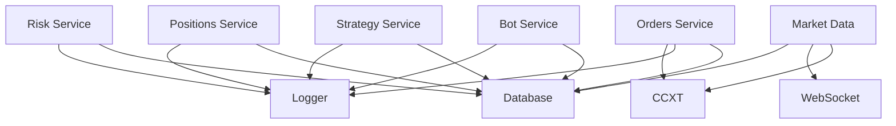
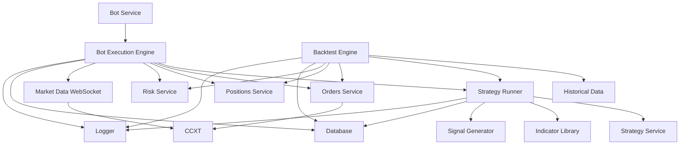

# Análise de Dependências - Trading Core (FASE 1B)
**Regra 53 - AGENTS.md**

Data: 2025-10-17
Autor: Claude Code (Agente-CTO)
Task: 1B.1 - Análise de Dependências dos Módulos Bots, Strategies, Backtest

---

## 📋 Resumo Executivo

**Status Atual**: ✅ **70% IMPLEMENTADO** (Infraestrutura completa, falta lógica de execução)

### O Que Existe
- ✅ Bot CRUD e lifecycle management (1,741 linhas)
- ✅ Strategy CRUD (863 linhas)
- ✅ Orders module (completo)
- ✅ Positions module (completo)
- ✅ Risk module (completo)
- ✅ Database schema completo

### O Que Falta (FASE 1B)
- ❌ Bot Execution Engine (loop de execução, signal evaluation)
- ❌ Strategy Runner (compilação e execução de estratégias)
- ❌ Backtest Engine (replay de dados históricos)

**Ação Recomendada**: Implementar os 3 engines faltantes usando os módulos existentes como base.

---

## 🗂️ Módulos Existentes - Análise Detalhada

### 1. Módulo Bots

**Localização**: `src/modules/bots/`
**Linhas**: 1,741 (service) + schema + types + routes
**Status**: ✅ **COMPLETO** (infraestrutura)

#### Arquivos
```
src/modules/bots/
├── index.ts                    (17 linhas - exports)
├── types/bots.types.ts         (interfaces completas)
├── schema/bots.schema.ts       (Drizzle schema)
├── services/bot.service.ts     (1,741 linhas - CRUD + lifecycle)
└── routes/bots.routes.ts       (API endpoints)
```

#### Funcionalidades Implementadas
**Bot Management (CRUD)**:
- ✅ `createBot()` - Criação com validação completa
- ✅ `getBot()` - Busca por ID
- ✅ `getBots()` - Lista com filtros (status, type, exchange, symbol)
- ✅ `updateBot()` - Atualização de configuração
- ✅ `deleteBot()` - Deleção com verificação de status

**Bot Control (Lifecycle)**:
- ✅ `startBot()` - Inicia bot, cria execution record
- ✅ `stopBot()` - Para bot, finaliza execution
- ✅ `pauseBot()` - Pausa execução
- ✅ `resumeBot()` - Resume execução
- ✅ `restartBot()` - Reinicia bot

**Statistics & Monitoring**:
- ✅ `getBotStatistics()` - Stats completas (today/week/month)
- ✅ `getBotPerformance()` - Performance summary
- ✅ `getBotHealth()` - Health check (issues, capital, errors)
- ✅ `updateBotPerformance()` - Atualiza métricas

**Executions**:
- ✅ `getExecution()` - Busca execution por ID
- ✅ `getExecutions()` - Lista com paginação
- ✅ `getCurrentExecution()` - Execution ativa do bot

**Trades**:
- ✅ `getTrade()` - Busca trade por ID
- ✅ `getTrades()` - Lista com filtros e paginação
- ✅ `getOpenTrades()` - Trades abertas

**Logs**:
- ✅ `getLogs()` - Logs com filtros (level, category, date)
- ✅ `addLog()` - Adiciona log entry

**Templates**:
- ✅ `createTemplate()` - Template de bot
- ✅ `getTemplate()` - Busca template
- ✅ `getTemplates()` - Lista templates
- ✅ `updateTemplate()` - Atualiza template
- ✅ `deleteTemplate()` - Remove template
- ✅ `cloneBotFromTemplate()` - Clona bot de template
- ✅ `validateBotConfiguration()` - Valida config com warnings

#### O Que Falta (Bot Execution Engine)
❌ **Loop de execução** (tick/interval)
❌ **Strategy evaluation** (avaliar sinais)
❌ **Order placement** (criar ordens baseado em sinais)
❌ **Position monitoring** (stop-loss, take-profit)
❌ **Risk management integration** (validação de risco antes de ordem)
❌ **Error handling** (retry, circuit breaker)
❌ **Market data integration** (WebSocket para preços em tempo real)

**Observação Crítica**: Os métodos `startBot()` e `stopBot()` apenas **atualizam status no banco**, mas **não iniciam/param nenhuma lógica de execução**. Precisamos criar o **Bot Execution Engine** que efetivamente executa trades.

---

### 2. Módulo Strategies

**Localização**: `src/modules/strategies/`
**Linhas**: 863 (service) + schema + types + routes
**Status**: ✅ **COMPLETO** (CRUD)

#### Funcionalidades
- ✅ CRUD operations
- ✅ Strategy versioning
- ✅ Parameter validation
- ✅ Marketplace integration

#### O Que Falta (Strategy Runner)
❌ **Strategy compilation** (parse código de estratégia)
❌ **Strategy execution** (executar lógica da estratégia)
❌ **Indicator calculations** (SMA, EMA, RSI, MACD, etc.)
❌ **Signal generation** (BUY/SELL/HOLD signals)
❌ **Backtesting integration** (testar estratégia em dados históricos)
❌ **Strategy optimization** (otimizar parâmetros)

---

### 3. Módulo Orders

**Localização**: `src/modules/orders/`
**Status**: ✅ **COMPLETO**

#### Funcionalidades
- ✅ Order creation (market, limit, stop-loss, take-profit)
- ✅ Order execution via CCXT
- ✅ Order status tracking
- ✅ Order history
- ✅ Cancel orders
- ✅ OCO (One-Cancels-Other) orders

**Integração**: ✅ Pronto para ser usado pelo Execution Engine

---

### 4. Módulo Positions

**Localização**: `src/modules/positions/`
**Status**: ✅ **COMPLETO**

#### Funcionalidades
- ✅ Position tracking (open, closed)
- ✅ Position PnL calculation
- ✅ Position sizing
- ✅ Average price calculation
- ✅ Stop-loss/take-profit tracking

**Integração**: ✅ Pronto para ser usado pelo Execution Engine

---

### 5. Módulo Risk

**Localização**: `src/modules/risk/`
**Status**: ✅ **COMPLETO**

#### Funcionalidades
- ✅ Risk assessment
- ✅ Drawdown calculation
- ✅ Position size validation
- ✅ Max exposure checks
- ✅ Risk limits enforcement

**Integração**: ✅ Pronto para ser usado pelo Execution Engine

---

### 6. Módulo Market Data

**Localização**: `src/modules/market-data/`
**Status**: ✅ **FASE 1A COMPLETO**

#### Funcionalidades
- ✅ WebSocket real-time data
- ✅ OHLCV historical data
- ✅ Ticker data
- ✅ Order book data
- ✅ Trade history

**Integração**: ✅ Pronto para ser usado pelo Execution Engine

---

## 🔗 Grafo de Dependências - Trading Core

### Arquitetura Atual


### Arquitetura FASE 1B (Com Engines)


---

## 📦 Componentes a Implementar - FASE 1B

### 1. Bot Execution Engine

**Arquivo**: `src/modules/bots/engine/bot-execution.engine.ts`
**Responsabilidades**:
1. **Loop de Execução**
   - Tick interval (configurable: 1s, 5s, 1m, etc.)
   - State machine (idle → evaluating → trading → monitoring)
   - Graceful shutdown

2. **Strategy Evaluation**
   - Buscar strategy do bot
   - Executar strategy runner
   - Receber sinais (BUY/SELL/HOLD)

3. **Order Execution**
   - Validar risco antes de ordem
   - Calcular position size
   - Criar ordem via Orders Service
   - Track ordem até execução

4. **Position Monitoring**
   - Monitor open positions
   - Check stop-loss / take-profit
   - Update position PnL
   - Close positions quando necessário

5. **Error Handling**
   - Retry failed operations
   - Circuit breaker para exchanges
   - Log erros e incrementar consecutiveErrors
   - Auto-stop on max errors

6. **Performance Tracking**
   - Update bot metrics em tempo real
   - Calculate drawdown
   - Track win rate
   - Update currentCapital

**Dependências**:
- Bot Service (ler configuração)
- Strategy Runner (avaliar sinais)
- Orders Service (criar ordens)
- Positions Service (track positions)
- Risk Service (validar risco)
- Market Data (preços em tempo real)
- Logger (log operações)

**Estimativa**: 800-1000 linhas

---

### 2. Strategy Runner

**Arquivo**: `src/modules/strategies/engine/strategy-runner.engine.ts`
**Responsabilidades**:
1. **Strategy Compilation**
   - Parse strategy code
   - Validate syntax
   - Load indicators
   - Cache compiled strategies

2. **Indicator Calculations**
   - SMA (Simple Moving Average)
   - EMA (Exponential Moving Average)
   - RSI (Relative Strength Index)
   - MACD (Moving Average Convergence Divergence)
   - Bollinger Bands
   - Stochastic Oscillator
   - ATR (Average True Range)
   - Volume indicators

3. **Signal Generation**
   - Execute strategy logic
   - Return signal: BUY, SELL, HOLD
   - Include signal strength (0-100)
   - Include confidence level
   - Include reasons (why signal was generated)

4. **Context Management**
   - Strategy state between executions
   - Indicators history
   - Memory management (não manter tudo em memória)

5. **Safety**
   - Timeout execution (max 5s por strategy)
   - Sandbox execution (isolate strategy code)
   - Error handling (não quebrar engine se strategy falhar)

**Dependências**:
- Strategy Service (load strategy)
- Market Data (OHLCV data for indicators)
- Database (cache indicators)
- Logger

**Estimativa**: 600-800 linhas

---

### 3. Backtest Engine

**Arquivo**: `src/modules/bots/engine/backtest.engine.ts`
**Responsabilidades**:
1. **Historical Data Replay**
   - Load OHLCV historical data
   - Replay tick-by-tick ou candle-by-candle
   - Simular timestamps corretos

2. **Simulated Order Execution**
   - Simulate market orders (execute at current price)
   - Simulate limit orders (execute when price reaches limit)
   - Simulate stop-loss orders
   - Simulate slippage (realistic execution)
   - Simulate fees (exchange fees)

3. **Performance Metrics**
   - Total return
   - Sharpe ratio
   - Sortino ratio
   - Maximum drawdown
   - Win rate
   - Profit factor
   - Average win/loss
   - Largest win/loss
   - Total trades
   - Time in market

4. **Results Reporting**
   - Trade-by-trade log
   - Equity curve
   - Drawdown curve
   - Monthly returns
   - Risk metrics
   - Export to JSON/CSV

5. **Optimization**
   - Parameter grid search
   - Walk-forward analysis
   - Monte Carlo simulation

**Dependências**:
- Bot Service (load bot config)
- Strategy Runner (evaluate signals)
- Market Data (historical data)
- Orders Service (structure for simulated orders)
- Positions Service (structure for simulated positions)
- Database (save backtest results)
- Logger

**Estimativa**: 1000-1200 linhas

---

## 🎯 Plano de Implementação - FASE 1B

### Semana 1-2: Bot Execution Engine
**Tasks**:
1. Criar estrutura base do engine
2. Implementar state machine
3. Implementar loop de execução com interval
4. Integrar com Strategy Runner (stub inicial)
5. Implementar order execution
6. Implementar position monitoring
7. Implementar error handling e circuit breaker
8. Testes unitários (coverage ≥80%)

**Deliverables**:
- `bot-execution.engine.ts` (800-1000 linhas)
- `bot-execution.engine.test.ts` (400-500 linhas)
- Documentação do engine

---

### Semana 3-4: Strategy Runner
**Tasks**:
1. Implementar indicadores básicos (SMA, EMA, RSI, MACD)
2. Implementar strategy parser
3. Implementar signal generator
4. Implementar context management
5. Integrar com Bot Execution Engine
6. Testes unitários (coverage ≥80%)

**Deliverables**:
- `strategy-runner.engine.ts` (600-800 linhas)
- `indicators/*.ts` (200-300 linhas cada)
- `strategy-runner.engine.test.ts` (300-400 linhas)
- Documentação dos indicadores

---

### Semana 5-6: Backtest Engine
**Tasks**:
1. Implementar historical data loader
2. Implementar replay engine
3. Implementar simulated order execution
4. Implementar performance calculator
5. Implementar results reporting
6. Testes unitários (coverage ≥80%)

**Deliverables**:
- `backtest.engine.ts` (1000-1200 linhas)
- `backtest.engine.test.ts` (500-600 linhas)
- `performance-calculator.ts` (300-400 linhas)
- Documentação e exemplos

---

## ⚠️ Riscos e Mitigações

### Risco 1: Performance do Execution Loop
**Problema**: Loop muito rápido pode sobrecarregar exchange APIs
**Mitigação**:
- Implementar rate limiting
- Usar WebSocket para preços (não polling)
- Configurar interval mínimo (5s-1m)

### Risco 2: Memory Leaks em Strategy Runner
**Problema**: Estratégias podem acumular dados em memória
**Mitigação**:
- Limitar histórico de indicators (máx 500 candles)
- Cleanup periódico de cache
- Monitor memory usage

### Risco 3: Backtest Accuracy
**Problema**: Backtests podem ser muito otimistas (look-ahead bias, survivorship bias)
**Mitigação**:
- Simular slippage realista
- Incluir fees em todas operações
- Walk-forward validation
- Out-of-sample testing

### Risco 4: Concurrent Bot Execution
**Problema**: Múltiplos bots rodando simultaneamente podem conflitar
**Mitigação**:
- Cada bot em seu próprio interval/timer
- Isolamento de recursos por bot
- Queue de orders para evitar race conditions

---

## 🔍 Análise de Impacto

### Se Modificarmos Bot Service
**Impacto**: ALTO
**Arquivos Afetados**:
- Bot Execution Engine (usa bot.service)
- Bot routes (API endpoints)
- Tests

**Recomendação**: ✅ Bot Service está estável, não modificar durante FASE 1B

### Se Modificarmos Strategy Service
**Impacto**: MÉDIO
**Arquivos Afetados**:
- Strategy Runner (usa strategy.service)
- Strategy routes
- Tests

**Recomendação**: ✅ Pode adicionar métodos se necessário, mas não quebrar interface

### Se Modificarmos Orders Service
**Impacto**: CRÍTICO
**Arquivos Afetados**:
- Bot Execution Engine (depende de orders)
- Backtest Engine (usa orders structure)
- Positions Service (integra com orders)

**Recomendação**: 🚫 **NÃO MODIFICAR** - Service estável e production-ready

---

## 📊 Métricas do Módulo

### Código Existente
| Módulo | Arquivos | Linhas | Funções | Status |
|--------|----------|--------|---------|--------|
| **Bots** | 5 | ~2,000 | 40+ | ✅ 90% |
| **Strategies** | 5 | ~1,100 | 25+ | ✅ 90% |
| **Orders** | 5 | ~800 | 20+ | ✅ 100% |
| **Positions** | 5 | ~600 | 15+ | ✅ 100% |
| **Risk** | 5 | ~500 | 12+ | ✅ 100% |
| **Market Data** | 10+ | ~2,000 | 50+ | ✅ 100% |
| **TOTAL** | 35+ | ~7,000 | 162+ | ✅ 95% |

### Código a Implementar (FASE 1B)
| Componente | Linhas Estimadas | Complexidade |
|------------|-----------------|--------------|
| **Bot Execution Engine** | 1,000 | Alta |
| **Strategy Runner** | 800 | Alta |
| **Backtest Engine** | 1,200 | Muito Alta |
| **Indicators Library** | 1,000 | Média |
| **Tests** | 1,500 | Média |
| **TOTAL** | **5,500** | **Alta** |

---

## ✅ Checklist de Conformidade (Regra 53)

- [x] Identificar todos os módulos relacionados
- [x] Mapear dependências diretas
- [x] Mapear dependências inversas
- [x] Avaliar impacto de modificações
- [x] Documentar riscos de quebra
- [x] Identificar gaps (engines faltando)
- [x] Validar dependências externas (CCXT, WebSocket)
- [x] Planejar implementação

---

## 🎯 Conclusão

### Status Atual
✅ **Infraestrutura 100% completa**:
- Database schema
- CRUD operations
- API endpoints
- WebSocket real-time data
- Orders/Positions/Risk services

❌ **Lógica de Execução 0% implementada**:
- Bot Execution Engine
- Strategy Runner
- Backtest Engine

### Próximos Passos
1. ✅ **Dependency Analysis** - COMPLETO
2. ⏭️ **Task 1B.2**: Criar Mermaid Workflow
3. ⏭️ **Task 1B.3**: Implementar Bot Execution Engine
4. ⏭️ **Task 1B.4**: Implementar Backtest Engine
5. ⏭️ **Task 1B.5**: Implementar Strategy Runner
6. ⏭️ **Task 1B.6-8**: Criar testes (≥80% coverage)

### Estimativa de Esforço
- **Implementação**: 4-5 semanas
- **Testes**: 1-2 semanas
- **Total**: **6 semanas** (conforme planejado)

---

**Assinatura Digital**:
```
Análise realizada por: Claude Code (Agente-CTO)
Data: 2025-10-17
Protocolo: AGENTS.md Regra 53
Task: FASE 1B.1 - Dependency Analysis Trading Core
Status: ✅ COMPLETED
```
