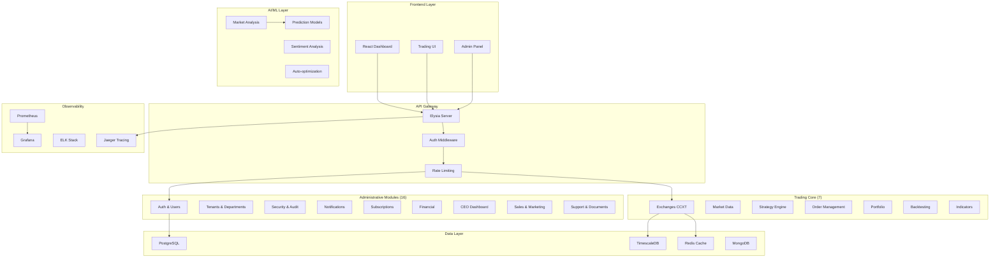

# 🚀 Roadmap: Sistema Completo BotCriptoFy2

**Decisão**: Implementar sistema **COMPLETO** (não MVP)
**Objetivo**: Plataforma SaaS enterprise-grade de trading automatizado
**Duração Estimada**: 12-16 semanas (3-4 meses)
**Início**: 2025-10-16

---

## 📋 Visão Geral

### Sistema Completo vs MVP

| Aspecto | MVP | Sistema Completo |
|---------|-----|------------------|
| **Módulos Admin** | Apenas críticos (3) | Todos os 16 módulos |
| **Trading Core** | Básico (5 módulos) | Completo (7 módulos) |
| **Testing** | Básico (~50%) | Completo (≥80%) |
| **Documentação** | Essencial | Completa + tutoriais |
| **DevOps** | Básico | Full CI/CD + K8s |
| **AI/ML** | Não | Sim (análise preditiva) |
| **Frontend** | Não | Dashboard completo |
| **Tempo** | 6 semanas | 12-16 semanas |

---

## 🎯 Arquitetura do Sistema Completo

---

## 📅 Cronograma: 16 Semanas

### FASE 1: Finalizar Módulos Administrativos (4 semanas)

#### Semana 1-2: Subscriptions & Financial ✅ CRÍTICO
**Objetivo**: Sistema de monetização completo

**Subscriptions Module (Semana 1)**:
- [ ] Schema completo (plans, subscriptions, features, limits)
- [ ] Service layer (CRUD, upgrade, downgrade, cancel)
- [ ] Stripe integration (webhooks, payment intents)
- [ ] Plans pré-configurados:
  - Free: 1 bot, 10 strategies, 100 API calls/day
  - Pro: 5 bots, 50 strategies, 10k API calls/day, $29/mês
  - Enterprise: Unlimited, custom, $299/mês
- [ ] Usage tracking (API calls, strategies, bots)
- [ ] Feature flags por plan
- [ ] Billing cycles (monthly, yearly)
- [ ] Promos e cupons
- [ ] Trial period (14 dias)
- [ ] Admin dashboard (ver todas subscriptions)

**Financial Module (Semana 2)**:
- [ ] Payment processing (Stripe, PayPal)
- [ ] Invoice generation (PDF)
- [ ] Payment history
- [ ] Refund management
- [ ] Balance tracking
- [ ] Transaction logs
- [ ] Revenue analytics
- [ ] Tax calculation (VAT, sales tax)
- [ ] Multi-currency support
- [ ] Automated reminders (payment due, failed)

**Entregáveis**:
- ✅ Subscriptions 100% funcional
- ✅ Stripe webhooks working
- ✅ Automated billing
- ✅ Invoice generation
- ✅ Admin panel para financeiro

---

#### Semana 3: CEO Dashboard & Analytics
**Objetivo**: Dashboard executivo com KPIs

**CEO Module**:
- [ ] Executive dashboard layout
- [ ] KPIs principais:
  - MRR (Monthly Recurring Revenue)
  - Churn rate
  - Active users
  - Total trades
  - P&L geral
  - System health
- [ ] Charts e gráficos (ECharts)
- [ ] Real-time updates (WebSocket)
- [ ] Data export (CSV, PDF)
- [ ] Filtros (date range, tenant, plan)
- [ ] Alertas configuráveis
- [ ] Comparison periods (MoM, YoY)

**Analytics Integration**:
- [ ] Google Analytics
- [ ] Mixpanel events
- [ ] Custom metrics
- [ ] User behavior tracking
- [ ] Funnel analysis

**Entregáveis**:
- ✅ Dashboard executivo funcional
- ✅ Real-time KPIs
- ✅ Exportação de relatórios

---

#### Semana 4: Sales, Marketing & Support
**Objetivo**: Completar módulos operacionais

**Sales Module**:
- [ ] Leads management (import, export)
- [ ] Prospects pipeline (stages)
- [ ] Deals tracking (won, lost, pending)
- [ ] CRM integration (Salesforce, HubSpot)
- [ ] Email sequences
- [ ] Task management
- [ ] Sales reports
- [ ] Conversion funnel

**Marketing Module**:
- [ ] Campaigns management
- [ ] Email marketing (SendGrid, Mailchimp)
- [ ] Landing pages builder
- [ ] A/B testing
- [ ] Analytics tracking
- [ ] Social media integration
- [ ] Referral program
- [ ] Affiliate system

**Support Module**:
- [ ] Ticket system (open, in progress, closed)
- [ ] Live chat integration (Intercom, Zendesk)
- [ ] Knowledge base
- [ ] FAQ management
- [ ] Chatbot AI (OpenAI)
- [ ] SLA tracking
- [ ] Customer satisfaction (CSAT, NPS)
- [ ] Multi-channel support (email, chat, phone)

**Documents Module**:
- [ ] File upload/download
- [ ] Document categories
- [ ] Versioning
- [ ] Permissions
- [ ] Search and filters
- [ ] Preview (PDF, images)
- [ ] S3 storage integration

**Entregáveis**:
- ✅ 4 módulos admin completos
- ✅ CRM funcional
- ✅ Support ticketing system
- ✅ Document management

---

### FASE 2: Core de Trading (5 semanas)

#### Semana 5-6: Exchanges & Market Data
**Objetivo**: Conectar com exchanges e coletar dados

**Exchanges Module (Semana 5)**:
- [ ] CCXT wrapper service
- [ ] Exchange factory pattern
- [ ] Supported exchanges:
  - Binance (Spot + Futures)
  - Coinbase Pro
  - Kraken
  - FTX (se disponível)
  - Bitfinex
  - KuCoin
  - Bybit
  - OKX
- [ ] Connection management (pool)
- [ ] API key encryption
- [ ] Rate limiting per exchange
- [ ] Error handling e retry logic
- [ ] Health check per exchange
- [ ] Exchange-specific quirks handling
- [ ] Testnet support
- [ ] WebSocket connections
- [ ] Order book streaming
- [ ] Trade streaming

**Market Data Module (Semana 6)**:
- [ ] OHLCV collection (1m, 5m, 15m, 1h, 4h, 1d)
- [ ] Ticker updates (real-time)
- [ ] Order book management (L2, L3)
- [ ] Trade history
- [ ] Funding rates (futures)
- [ ] Open interest
- [ ] Data normalization across exchanges
- [ ] TimescaleDB storage
- [ ] Data compression (older data)
- [ ] Backfill historical data
- [ ] Data validation
- [ ] Caching strategy (Redis)
- [ ] WebSocket reconnection logic
- [ ] Rate limit awareness

**Entregáveis**:
- ✅ 8+ exchanges conectadas
- ✅ Market data streaming
- ✅ TimescaleDB com dados históricos
- ✅ WebSocket estável

---

#### Semana 7-8: Strategy Engine & Indicators
**Objetivo**: Motor de estratégias de trading

**Indicators Library (Semana 7)**:
- [ ] Technical Analysis library (TA-Lib wrapper)
- [ ] Trend indicators:
  - SMA, EMA, WMA
  - MACD
  - ADX
  - Parabolic SAR
  - Ichimoku Cloud
- [ ] Momentum indicators:
  - RSI
  - Stochastic
  - CCI
  - MFI
  - Williams %R
- [ ] Volatility indicators:
  - Bollinger Bands
  - ATR
  - Keltner Channels
  - Standard Deviation
- [ ] Volume indicators:
  - OBV
  - Volume Profile
  - VWAP
  - Accumulation/Distribution
- [ ] Custom indicators support
- [ ] Indicator combinations
- [ ] Indicator caching
- [ ] Real-time calculation

**Strategy Engine (Semana 8)**:
- [ ] Strategy base class
- [ ] Strategy lifecycle (init, run, stop)
- [ ] Signal generation
- [ ] Entry conditions
- [ ] Exit conditions
- [ ] Position sizing algorithms:
  - Fixed amount
  - Fixed percentage
  - Kelly Criterion
  - Risk-based sizing
- [ ] Risk management:
  - Stop-loss (fixed, trailing, ATR-based)
  - Take-profit (fixed, multiple targets)
  - Max drawdown protection
  - Max daily loss limit
- [ ] Multi-timeframe support
- [ ] Strategy parameters (tunable)
- [ ] Strategy validation
- [ ] Paper trading mode
- [ ] Strategy templates:
  - MA Crossover
  - RSI Oversold/Overbought
  - Bollinger Bands Bounce
  - MACD Divergence
  - Breakout
  - Mean Reversion
  - Trend Following
  - Grid Trading
  - DCA (Dollar Cost Averaging)

**Entregáveis**:
- ✅ 20+ indicators implementados
- ✅ Strategy engine funcional
- ✅ 10+ strategy templates
- ✅ Risk management completo

---

#### Semana 9: Order Management & Execution
**Objetivo**: Sistema de execução de ordens

**Orders Module**:
- [ ] Order types:
  - Market
  - Limit
  - Stop-loss
  - Stop-limit
  - Take-profit
  - Trailing stop
  - Iceberg
  - Post-only
  - Fill-or-kill (FOK)
  - Immediate-or-cancel (IOC)
- [ ] Order routing (smart order router)
- [ ] Slippage management
- [ ] Partial fill handling
- [ ] Order book analysis (depth)
- [ ] Best execution algorithm
- [ ] Order lifecycle tracking
- [ ] Order status updates (WebSocket)
- [ ] Order history
- [ ] Failed order retry logic
- [ ] Order cancellation
- [ ] Batch orders
- [ ] OCO (One-Cancels-Other)
- [ ] Bracket orders
- [ ] Conditional orders
- [ ] Order templates
- [ ] Commission calculation
- [ ] Fee optimization

**Execution Engine**:
- [ ] TWAP (Time-Weighted Average Price)
- [ ] VWAP (Volume-Weighted Average Price)
- [ ] Iceberg execution
- [ ] Smart routing (multiple exchanges)
- [ ] Latency optimization
- [ ] Execution reports
- [ ] Fill tracking
- [ ] Trade reconciliation

**Entregáveis**:
- ✅ 15+ order types
- ✅ Smart order routing
- ✅ Execution engine robusto
- ✅ Ordem lifecycle completo

---

#### Semana 10: Portfolio Management
**Objetivo**: Gestão de portfolio e P&L

**Portfolio Module**:
- [ ] Position tracking (long, short)
- [ ] Real-time P&L calculation
- [ ] Unrealized P&L
- [ ] Realized P&L
- [ ] Position sizing
- [ ] Asset allocation
- [ ] Rebalancing logic
- [ ] Risk metrics:
  - Sharpe Ratio
  - Sortino Ratio
  - Max Drawdown
  - Calmar Ratio
  - Win Rate
  - Profit Factor
  - Average Win/Loss
  - Risk/Reward Ratio
- [ ] Performance attribution
- [ ] Benchmark comparison
- [ ] Portfolio optimization (Markowitz)
- [ ] Correlation analysis
- [ ] Diversification metrics
- [ ] Portfolio history
- [ ] Portfolio snapshots
- [ ] Multi-portfolio support
- [ ] Paper trading portfolio
- [ ] Live trading portfolio

**Balance Management**:
- [ ] Balance sync (per exchange)
- [ ] Multi-currency support
- [ ] Cross-collateral
- [ ] Margin tracking
- [ ] Funding costs
- [ ] Total equity calculation
- [ ] Available balance
- [ ] Locked balance
- [ ] Balance alerts

**Entregáveis**:
- ✅ Portfolio tracking completo
- ✅ 10+ risk metrics
- ✅ Real-time P&L
- ✅ Multi-portfolio

---

### FASE 3: Backtesting & AI (3 semanas)

#### Semana 11: Backtesting Engine
**Objetivo**: Sistema de backtesting robusto

**Backtesting Module**:
- [ ] Historical data replay
- [ ] Event-driven backtesting
- [ ] Strategy testing framework
- [ ] Performance reports:
  - Equity curve
  - Drawdown chart
  - Monthly returns
  - Trade analysis
  - Win/loss distribution
- [ ] Slippage simulation
- [ ] Commission simulation
- [ ] Market impact simulation
- [ ] Walk-forward testing
- [ ] Monte Carlo simulation
- [ ] Parameter optimization:
  - Grid search
  - Random search
  - Genetic algorithms
  - Bayesian optimization
- [ ] Overfitting detection
- [ ] Strategy comparison
- [ ] Export results (CSV, PDF)
- [ ] Backtest reports dashboard

**Entregáveis**:
- ✅ Backtesting engine funcional
- ✅ Parameter optimization
- ✅ Performance reports
- ✅ Walk-forward testing

---

#### Semana 12-13: AI & Machine Learning
**Objetivo**: Análise preditiva e otimização

**Market Analysis Agent**:
- [ ] Price prediction models:
  - LSTM (Long Short-Term Memory)
  - GRU (Gated Recurrent Unit)
  - Transformer models
  - Prophet (Facebook)
- [ ] Sentiment analysis:
  - Twitter sentiment
  - Reddit sentiment
  - News sentiment
  - Fear & Greed Index
- [ ] Pattern recognition:
  - Chart patterns (head & shoulders, triangles)
  - Candlestick patterns
  - Support/resistance detection
- [ ] Anomaly detection
- [ ] Regime detection (bull, bear, sideways)
- [ ] Correlation analysis
- [ ] Cluster analysis (similar assets)

**Strategy Optimization**:
- [ ] Genetic algorithms
- [ ] Neural network optimization
- [ ] Reinforcement learning (Q-learning, DQN)
- [ ] Auto-ML (AutoGluon)
- [ ] Feature engineering
- [ ] Feature selection
- [ ] Ensemble methods
- [ ] Online learning (continuous adaptation)

**ML Infrastructure**:
- [ ] Model training pipeline
- [ ] Model versioning (MLflow)
- [ ] Model deployment
- [ ] Model monitoring
- [ ] A/B testing for models
- [ ] GPU support (CUDA)
- [ ] Distributed training

**Entregáveis**:
- ✅ 5+ ML models
- ✅ Sentiment analysis working
- ✅ Auto-optimization
- ✅ Model deployment pipeline

---

### FASE 4: Frontend & UX (3 semanas)

#### Semana 14: Dashboard Principal
**Objetivo**: Interface web completa

**Frontend Architecture**:
- [ ] Next.js 14 (App Router)
- [ ] TypeScript strict mode
- [ ] Tailwind CSS + shadcn/ui
- [ ] React Query (server state)
- [ ] Zustand (client state)
- [ ] WebSocket integration
- [ ] PWA support

**Dashboard Principal**:
- [ ] Overview page:
  - Portfolio value
  - Today's P&L
  - Active strategies
  - Recent trades
  - Market overview
- [ ] Real-time updates
- [ ] Charts (TradingView Lightweight Charts)
- [ ] Notifications center
- [ ] Quick actions
- [ ] Responsive design
- [ ] Dark/light mode

**Entregáveis**:
- ✅ Dashboard funcional
- ✅ Real-time updates
- ✅ Responsive UI

---

#### Semana 15: Trading Interface
**Objetivo**: Interface de trading profissional

**Trading UI**:
- [ ] TradingView integration (charts)
- [ ] Order placement interface
- [ ] Position management
- [ ] Open orders table
- [ ] Trade history
- [ ] Portfolio view
- [ ] Watchlist
- [ ] Market depth chart
- [ ] Recent trades stream
- [ ] Quick order buttons
- [ ] Keyboard shortcuts
- [ ] Mobile-friendly

**Strategy Management**:
- [ ] Strategy builder (visual)
- [ ] Strategy editor (code)
- [ ] Strategy backtest UI
- [ ] Strategy optimization UI
- [ ] Strategy comparison
- [ ] Deploy to live/paper
- [ ] Strategy marketplace

**Entregáveis**:
- ✅ Trading interface completa
- ✅ TradingView integration
- ✅ Strategy builder visual

---

#### Semana 16: Admin & Polish
**Objetivo**: Admin panel e polimento final

**Admin Panel**:
- [ ] User management
- [ ] Tenant management
- [ ] Subscription management
- [ ] Financial overview
- [ ] System monitoring
- [ ] Logs viewer
- [ ] Settings configuráveis
- [ ] Support tickets
- [ ] Analytics dashboard

**Polish & UX**:
- [ ] Onboarding flow
- [ ] Tooltips e help
- [ ] Loading states
- [ ] Error states
- [ ] Empty states
- [ ] Animations (Framer Motion)
- [ ] Accessibility (WCAG AA)
- [ ] SEO optimization
- [ ] Performance optimization

**Entregáveis**:
- ✅ Admin panel completo
- ✅ UX polido
- ✅ Acessibilidade

---

### FASE 5: DevOps, Testing & Deploy (2 semanas)

#### Semana 17: Testing Completo
**Objetivo**: Coverage ≥80%

**Unit Tests**:
- [ ] All services (cache, rate-limit, auth, etc.)
- [ ] All collectors (metrics)
- [ ] Strategy engine
- [ ] Indicators
- [ ] Order management
- [ ] Portfolio calculations

**Integration Tests**:
- [ ] Database operations
- [ ] Redis operations
- [ ] Exchange connections
- [ ] WebSocket connections
- [ ] Auth flow
- [ ] Multi-tenancy

**E2E Tests**:
- [ ] User registration → trading flow
- [ ] Strategy creation → backtest → deploy
- [ ] Order placement → fill → P&L
- [ ] Subscription flow
- [ ] Payment flow

**Load Tests**:
- [ ] 10k req/s HTTP
- [ ] 1k concurrent WebSockets
- [ ] 100k market data updates/s
- [ ] Database query performance

**Entregáveis**:
- ✅ 80%+ coverage
- ✅ All tests passing
- ✅ Load test reports

---

#### Semana 18: DevOps & Deploy
**Objetivo**: Deploy em produção

**Infrastructure as Code**:
- [ ] Terraform configs
- [ ] Kubernetes manifests
- [ ] Helm charts
- [ ] ArgoCD setup

**CI/CD**:
- [ ] GitHub Actions pipelines
- [ ] Automated tests
- [ ] Docker builds
- [ ] Security scanning
- [ ] Deployment automation

**Monitoring Stack**:
- [ ] Prometheus + Grafana (já temos)
- [ ] ELK Stack (Elasticsearch, Logstash, Kibana)
- [ ] Jaeger tracing
- [ ] Sentry error tracking
- [ ] Uptime monitoring (UptimeRobot)

**Production Environment**:
- [ ] AWS/GCP/Azure setup
- [ ] Load balancer (NGINX/Traefik)
- [ ] Auto-scaling
- [ ] CDN (CloudFlare)
- [ ] Backup strategy
- [ ] Disaster recovery
- [ ] SSL/TLS
- [ ] WAF (Web Application Firewall)

**Entregáveis**:
- ✅ Full CI/CD pipeline
- ✅ Production deployment
- ✅ Monitoring completo
- ✅ Auto-scaling working

---

## 📊 Resumo de Entregas

### Módulos (23 total)

**Administrativos (16)**:
- ✅ auth, users, tenants, departments
- ✅ security, audit, notifications, configurations
- ✅ rate-limiting
- ✅ subscriptions, financial
- ✅ ceo, sales, marketing, support, documents

**Trading Core (7)**:
- ✅ exchanges, market-data
- ✅ strategies, indicators
- ✅ orders, portfolio
- ✅ backtesting

### Features

**Backend**:
- 23 módulos funcionais
- 80%+ test coverage
- Monitoring completo
- AI/ML integrado

**Frontend**:
- Dashboard completo
- Trading interface
- Strategy builder
- Admin panel
- Mobile responsive

**DevOps**:
- CI/CD automático
- Kubernetes deployment
- Auto-scaling
- Monitoring stack completo

---

## 🎯 Métricas de Sucesso

| Métrica | Target | Como Medir |
|---------|--------|------------|
| Test Coverage | ≥80% | Vitest coverage report |
| API Response Time | <100ms p95 | Prometheus metrics |
| Uptime | 99.9% | UptimeRobot |
| Error Rate | <0.1% | Sentry |
| WebSocket Latency | <50ms | Custom metrics |
| Order Execution | <1s | Execution logs |
| Backtest Speed | >10k candles/s | Benchmark tests |
| User Satisfaction | >4.5/5 | CSAT surveys |

---

## 💰 Estimativa de Custos

### Desenvolvimento (16 semanas)

**Time Necessário**:
- 1 Full-stack Senior: $8k-12k/mês x 4 meses = $32k-48k
- 1 Frontend: $6k-10k/mês x 2 meses = $12k-20k
- 1 ML Engineer: $8k-12k/mês x 2 meses = $16k-24k
- 1 DevOps: $7k-10k/mês x 1 mês = $7k-10k

**Total Desenvolvimento**: $67k-102k

### Infraestrutura (Mensal)

- AWS/GCP: $500-1k/mês
- Exchanges API (data): $200-500/mês
- Monitoring (DataDog/NewRelic): $100-300/mês
- CDN (CloudFlare): $20-100/mês
- Database (managed): $200-500/mês
- ML compute (GPU): $300-1k/mês

**Total Infra**: $1.3k-3.4k/mês

### Serviços de Terceiros

- Stripe (2.9% + $0.30): Variable
- SendGrid: $15-100/mês
- OpenAI API: $50-500/mês
- TradingView: $100-300/mês

---

## 🚀 Como Iniciar

**Próximos Passos Imediatos**:

1. **Commit da análise** (este documento)
2. **Iniciar Semana 1**: Subscriptions Module
3. **Setup project tracking** (GitHub Projects)
4. **Daily standups** (async via README)
5. **Weekly demos** (sprint review)

**Pronto para começar?** 🚀

Vamos iniciar com o **Subscriptions Module** agora mesmo!
