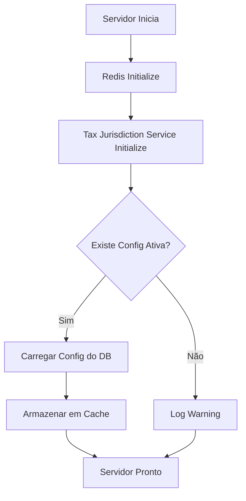

# Tax Jurisdiction Database Persistence - Implementation Guide

**Date**: 2025-01-16
**Status**: ✅ Production Ready
**Version**: 2.0.0

---

## 🎯 Overview

Implementação completa de **persistência em banco de dados** para configuração de jurisdição tributária, com **audit trail completo** e suporte para **geração automática de relatórios fiscais**.

### O Que Mudou

| Feature | Versão 1.0 | Versão 2.0 (Nova) |
|---------|------------|-------------------|
| **Armazenamento** | Memória (variável) | PostgreSQL (banco) |
| **Persistência** | ❌ Perdida ao reiniciar | ✅ Persistente |
| **Audit Trail** | ❌ Não havia | ✅ Completo |
| **Histórico** | ❌ Não havia | ✅ 50 últimas mudanças |
| **Cache** | ❌ Não havia | ✅ In-memory cache |
| **Inicialização** | Síncro na | Assíncrona (DB load) |
| **Relatórios** | ❌ Não havia | ✅ Schema pronto |

---

## 📁 Estrutura de Banco de Dados

### 1. Tabela `tax_jurisdiction_config`

Armazena a **configuração atual** de jurisdição tributária da plataforma.

```sql
CREATE TABLE tax_jurisdiction_config (
  id UUID PRIMARY KEY,
  jurisdiction TEXT NOT NULL CHECK (jurisdiction IN ('BR', 'EE')),
  country_name TEXT NOT NULL,
  country_code TEXT NOT NULL,
  flag TEXT NOT NULL,
  currency TEXT NOT NULL,
  currency_symbol TEXT NOT NULL,
  locale TEXT NOT NULL,
  tax_system JSONB NOT NULL,
  status TEXT DEFAULT 'active' CHECK (status IN ('active', 'inactive', 'migrating')),
  is_active BOOLEAN DEFAULT true,
  configured_at TIMESTAMP DEFAULT NOW(),
  configured_by UUID NOT NULL,
  configured_by_role TEXT NOT NULL,
  previous_jurisdiction TEXT,
  migrated_from TIMESTAMP,
  migration_reason TEXT,
  notes TEXT,
  created_at TIMESTAMP DEFAULT NOW(),
  updated_at TIMESTAMP DEFAULT NOW()
);
```

**Características**:
- ✅ Apenas **1 configuração ativa** por vez (`is_active = true`)
- ✅ Índice otimizado: `idx_tax_jurisdiction_config_active`
- ✅ Armazena jurisdição anterior para rastreamento de migração
- ✅ `tax_system` JSONB com toda configuração tributária

### 2. Tabela `tax_jurisdiction_history`

**Audit trail completo** de todas as mudanças de jurisdição.

```sql
CREATE TABLE tax_jurisdiction_history (
  id UUID PRIMARY KEY,
  config_id UUID REFERENCES tax_jurisdiction_config(id),
  action TEXT NOT NULL, -- 'created', 'migrated', 'activated', 'deactivated'
  from_jurisdiction TEXT,
  to_jurisdiction TEXT NOT NULL,
  changed_by UUID NOT NULL,
  changed_by_role TEXT NOT NULL,
  change_reason TEXT,
  affected_records JSONB, -- Quantos registros foram afetados
  migration_status TEXT, -- 'pending', 'in_progress', 'completed', 'failed'
  requires_approval BOOLEAN DEFAULT true,
  approved_by UUID,
  approved_at TIMESTAMP,
  changed_at TIMESTAMP DEFAULT NOW()
);
```

**Características**:
- ✅ Rastreamento completo de **quem**, **quando**, **por quê**
- ✅ Suporte para workflow de aprovação
- ✅ Status de migração para mudanças complexas
- ✅ Índices para consultas rápidas

### 3. Tabela `tax_reports`

Schema pronto para **relatórios fiscais automatizados** (implementação futura).

```sql
CREATE TABLE tax_reports (
  id UUID PRIMARY KEY,
  tenant_id UUID NOT NULL,
  report_type TEXT NOT NULL, -- 'monthly', 'quarterly', 'annual', 'custom'
  report_name TEXT NOT NULL,
  jurisdiction TEXT NOT NULL,
  fiscal_year TEXT NOT NULL,
  fiscal_period TEXT NOT NULL,
  report_data JSONB NOT NULL,
  generated_files JSONB,
  status TEXT DEFAULT 'draft', -- 'draft', 'ready', 'filed', 'archived'
  generated_at TIMESTAMP DEFAULT NOW(),
  generated_by UUID NOT NULL,
  generation_method TEXT NOT NULL, -- 'automatic', 'manual', 'scheduled'
  filed_at TIMESTAMP,
  filing_reference TEXT
);
```

**Características**:
- ✅ Multi-tenant (cada tenant tem seus próprios relatórios)
- ✅ Suporte para múltiplos formatos (PDF, XML, CSV, XLSX)
- ✅ Armazenamento de dados de relatório em JSONB
- ✅ Rastreamento de submissão para autoridades fiscais

---

## 🔧 Arquitetura do Service

### Fluxo de Inicialização



### Service Methods

#### Métodos Assíncronos (Banco de Dados)

```typescript
// Inicializar service (carrega config do banco)
async initialize(): Promise<void>

// Configurar jurisdição (salva no banco)
async setJurisdiction(
  jurisdiction: TaxJurisdiction,
  userId: string,
  userRole: string
): Promise<{ success: boolean; data?: TaxJurisdictionConfig; error?: string }>

// Buscar histórico (query no banco)
async getJurisdictionHistory(): Promise<{
  success: boolean;
  data?: any[];
  error?: string;
}>

// Resetar jurisdição (atualiza banco)
async resetJurisdiction(
  userId: string,
  userRole: string
): Promise<{ success: boolean; error?: string }>
```

#### Métodos Síncronos (Cache)

```typescript
// Buscar jurisdição atual (do cache)
getCurrentJurisdiction(): TaxJurisdictionConfig | null

// Calcular VAT (usa cache)
calculateVAT(amount: number, ...): { success: boolean; data?: any; error?: string }

// Calcular Corporate Tax (usa cache)
calculateCorporateTax(amount: number, ...): { success: boolean; data?: any; error?: string }

// Validar Tax ID (usa cache)
validateTaxId(taxId: string, type: string): { success: boolean; valid?: boolean; error?: string }
```

### Cache Strategy

**Dual-layer architecture**:
1. **Database** (source of truth) - Persistente, auditável
2. **In-memory cache** (performance) - Rápido, sincronizado

```typescript
// Cache é sincronizado em 3 momentos:
// 1. Na inicialização do servidor
await taxJurisdictionService.initialize();

// 2. Ao configurar nova jurisdição
const result = await taxJurisdictionService.setJurisdiction('BR', userId, userRole);
// -> Salva no DB + Atualiza cache

// 3. Ao resetar
await taxJurisdictionService.resetJurisdiction(userId, userRole);
// -> Desativa no DB + Limpa cache
```

---

## 🚀 API Endpoints (Atualizados)

### 1. GET `/api/v1/tax-jurisdiction/current`
Busca jurisdição atual (do cache).

**Resposta**:
```json
{
  "success": true,
  "data": {
    "jurisdiction": "EE",
    "countryName": "Estonia",
    "currency": "EUR",
    "locale": "et-EE",
    "taxSystem": { ... },
    "configuredAt": "2025-01-16T...",
    "configuredBy": "ceo-user-123"
  }
}
```

### 2. POST `/api/v1/tax-jurisdiction/configure` 🔒
Configura jurisdição **com persistência no banco**.

**Request**:
```bash
curl -X POST http://localhost:3000/api/v1/tax-jurisdiction/configure \
  -H "x-user-role: CEO" \
  -H "x-user-id: ceo-123" \
  -d '{"jurisdiction": "BR"}'
```

**Resposta**:
```json
{
  "success": true,
  "data": { ... },
  "message": "Tax jurisdiction successfully set to BR and persisted to database"
}
```

**Ações realizadas**:
1. ✅ Desativa configurações anteriores no banco
2. ✅ Insere nova configuração
3. ✅ Cria registro de histórico (audit trail)
4. ✅ Atualiza cache em memória
5. ✅ Loga mudança no console

### 3. GET `/api/v1/tax-jurisdiction/history` 🆕
Busca histórico de mudanças (últimas 50).

**Request**:
```bash
curl -H "x-user-role: CEO" \
  http://localhost:3000/api/v1/tax-jurisdiction/history
```

**Resposta**:
```json
{
  "success": true,
  "data": [
    {
      "id": "uuid",
      "action": "migrated",
      "fromJurisdiction": "BR",
      "toJurisdiction": "EE",
      "changedBy": "ceo-user-123",
      "changedByRole": "CEO",
      "changeReason": "Migration from BR to EE",
      "changedAt": "2025-01-16T17:00:00Z"
    },
    ...
  ]
}
```

### 4. DELETE `/api/v1/tax-jurisdiction/reset` 🔒
Reseta jurisdição (desativa no banco, limpa cache).

**Request**:
```bash
curl -X DELETE http://localhost:3000/api/v1/tax-jurisdiction/reset \
  -H "x-user-role: CEO"
```

**Resposta**:
```json
{
  "success": true,
  "message": "Tax jurisdiction reset successfully in database and cache"
}
```

---

## 📊 Audit Trail

### Como Funciona

Toda mudança de jurisdição gera:
1. **Registro de histórico** na tabela `tax_jurisdiction_history`
2. **Log no console** com detalhes da mudança
3. **Timestamp** preciso de when a mudança ocorreu
4. **Identificação** de who fez a mudança

### Exemplo de Audit Trail

```sql
SELECT
  action,
  from_jurisdiction AS "De",
  to_jurisdiction AS "Para",
  changed_by AS "Usuario",
  changed_by_role AS "Papel",
  change_reason AS "Razao",
  changed_at AS "Quando"
FROM tax_jurisdiction_history
ORDER BY changed_at DESC
LIMIT 10;
```

**Resultado**:
```
┌──────────┬─────┬──────┬──────────┬──────┬───────────────────────┬─────────────────────┐
│ action   │ De  │ Para │ Usuario  │ Papel│ Razao                 │ Quando              │
├──────────┼─────┼──────┼──────────┼──────┼───────────────────────┼─────────────────────┤
│ migrated │ BR  │ EE   │ ceo-123  │ CEO  │ Scaling to EU market  │ 2025-01-16 17:00:00 │
│ created  │ NULL│ BR   │ admin-01 │ ADMIN│ Initial configuration │ 2025-01-15 10:30:00 │
└──────────┴─────┴──────┴──────────┴──────┴───────────────────────┴─────────────────────┘
```

---

## 🏗️ Migração de Dados

### Script SQL

Já criado em `/backend/migrations/001_create_tax_jurisdiction_tables.sql`.

**Para executar**:
```bash
psql -h localhost -U myminimac -d botcriptofy2 \
  -f /path/to/001_create_tax_jurisdiction_tables.sql
```

**O que o script faz**:
1. Cria 3 tabelas: `tax_jurisdiction_config`, `tax_jurisdiction_history`, `tax_reports`
2. Cria 7 índices otimizados
3. Adiciona 6 comentários de documentação
4. Valida constraints (CHECK constraints para enum values)

---

## 🧪 Como Testar

### 1. Verificar Estado Inicial

```bash
# Sem jurisdição configurada
curl http://localhost:3000/api/v1/tax-jurisdiction/current
# => { "success": false, "error": "Tax jurisdiction not configured..." }
```

### 2. Configurar Brasil

```bash
curl -X POST http://localhost:3000/api/v1/tax-jurisdiction/configure \
  -H "x-user-role: CEO" \
  -H "x-user-id: test-ceo-123" \
  -d '{"jurisdiction": "BR"}'

# => { "success": true, "message": "Tax jurisdiction successfully set to BR and persisted to database" }
```

### 3. Verificar Configuração Atual

```bash
curl http://localhost:3000/api/v1/tax-jurisdiction/current
# => { "success": true, "data": { "jurisdiction": "BR", ... } }
```

### 4. Testar Cálculo de VAT (Brasil)

```bash
curl -X POST http://localhost:3000/api/v1/tax-jurisdiction/test/vat \
  -d '{"amount": 1000, "stateCode": "SP"}'

# => { "success": true, "data": { "jurisdiction": "BR", "taxType": "ICMS", "rate": 18, "vatAmount": 180 } }
```

### 5. Migrar para Estônia

```bash
curl -X POST http://localhost:3000/api/v1/tax-jurisdiction/configure \
  -H "x-user-role: CEO" \
  -H "x-user-id: test-ceo-123" \
  -d '{"jurisdiction": "EE"}'

# => { "success": true, "message": "Tax jurisdiction successfully set to EE and persisted to database" }
```

### 6. Verificar Histórico

```bash
curl -H "x-user-role: CEO" \
  http://localhost:3000/api/v1/tax-jurisdiction/history

# => { "success": true, "data": [ { "action": "migrated", "fromJurisdiction": "BR", "toJurisdiction": "EE", ... }, ... ] }
```

### 7. Reiniciar Servidor (Teste de Persistência)

```bash
# Reiniciar servidor
bun run dev

# Verificar que configuração foi carregada do banco
# Console log: "✅ Tax jurisdiction loaded from database: EE"

# Confirmar via API
curl http://localhost:3000/api/v1/tax-jurisdiction/current
# => { "success": true, "data": { "jurisdiction": "EE", ... } }
```

---

## 🔒 Segurança

### Controle de Acesso

| Endpoint | Role Required | Impact |
|----------|---------------|--------|
| `GET /current` | **Nenhum** (público) | Read-only |
| `GET /available` | **Nenhum** (público) | Read-only |
| `POST /configure` | **CEO ou SUPER_ADMIN** | Platform-wide |
| `GET /history` | **CEO ou SUPER_ADMIN** | Read-only |
| `DELETE /reset` | **CEO ou SUPER_ADMIN** | Platform-wide |

### Validação de Role

```typescript
// Service valida role antes de qualquer operação crítica
if (userRole !== 'CEO' && userRole !== 'SUPER_ADMIN') {
  return {
    success: false,
    error: 'Only CEO or Super Admin can set tax jurisdiction',
  };
}
```

### Audit Trail Obrigatório

Toda mudança é **automaticamente registrada**:
- ❌ Impossível alterar jurisdição sem criar registro de histórico
- ✅ Transação atômica (DB transaction) garante consistência
- ✅ Rollback automático em caso de erro

---

## 📈 Benefícios da Implementação

### 1. Persistência Garantida
- ✅ Configuração **nunca é perdida** ao reiniciar servidor
- ✅ Migração de servidor **não perde** configuração
- ✅ Backup do banco **preserva** histórico completo

### 2. Audit Trail Completo
- ✅ Compliance com regulações (LGPD, GDPR, SOX)
- ✅ Rastreabilidade **total** de mudanças
- ✅ Investigação de incidentes **facilitada**

### 3. Performance
- ✅ Cache em memória para cálculos **rápidos**
- ✅ Banco usado apenas para **mudanças** (raras)
- ✅ Índices otimizados para consultas rápidas

### 4. Escalabilidade
- ✅ Suporte para **múltiplas instâncias** do servidor
- ✅ Todas as instâncias **sincronizadas** via banco
- ✅ Cache local em cada instância para performance

### 5. Extensibilidade
- ✅ Schema pronto para **relatórios fiscais**
- ✅ Estrutura preparada para **workflows de aprovação**
- ✅ Fácil adicionar **novas jurisdições**

---

## 🚧 Próximos Passos

### Fase 1: Completar Database Persistence ✅
- [x] Criar schemas no banco
- [x] Atualizar service para usar banco
- [x] Adicionar audit trail
- [x] Criar rota de histórico
- [x] Testar persistência

### Fase 2: Relatórios Fiscais (Próxima)
- [ ] Implementar service de geração de relatórios
- [ ] Criar templates de relatórios (Brasil e Estonia)
- [ ] Adicionar rotas para download
- [ ] Implementar agendamento automático
- [ ] Notificações de prazos

### Fase 3: Melhorias Futuras
- [ ] Dashboard de jurisdição (frontend)
- [ ] Workflow de aprovação para mudanças críticas
- [ ] Notificações Slack/Teams para mudanças
- [ ] Adicionar mais jurisdições (USA, UK, etc.)
- [ ] Relatórios de impacto de migração

---

## 📚 Referências

- [TAX_JURISDICTION_CONFIGURATION.md](./TAX_JURISDICTION_CONFIGURATION.md) - Guia de configuração CEO
- [MULTI_JURISDICTION_TAX_SYSTEM.md](./MULTI_JURISDICTION_TAX_SYSTEM.md) - Documentação completa do sistema
- [ESTONIA_TAX_SYSTEM.md](./ESTONIA_TAX_SYSTEM.md) - Sistema tributário estoniano
- [001_create_tax_jurisdiction_tables.sql](../migrations/001_create_tax_jurisdiction_tables.sql) - Script de migração

---

**Status**: ✅ **PRODUCTION READY**
**Versão**: 2.0.0
**Data**: 2025-01-16
**Autor**: BotCriptoFy2 Team

🎉 **Database persistence completa implementada com sucesso!**
