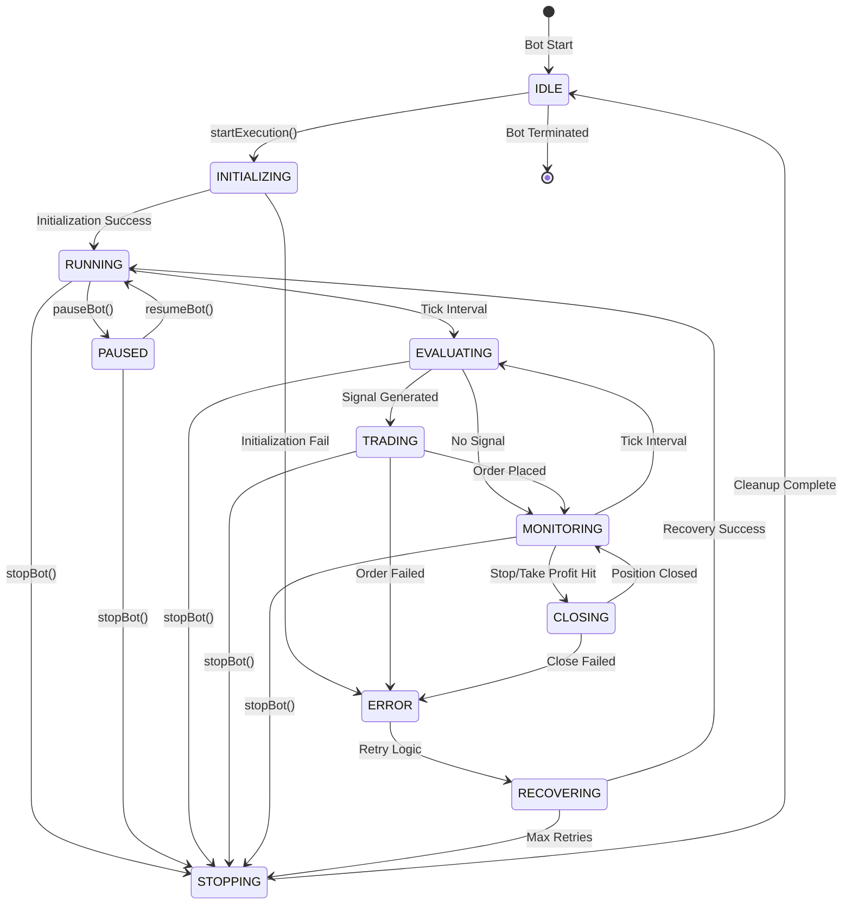
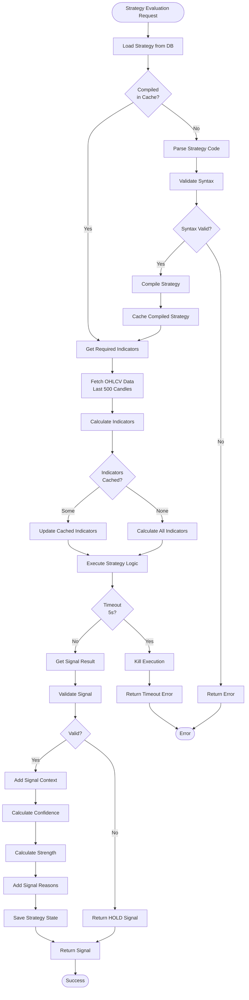
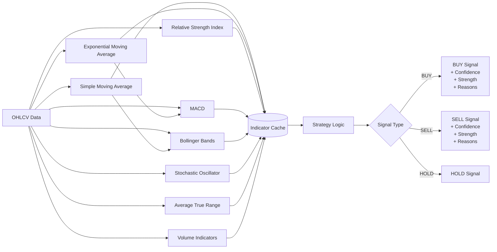
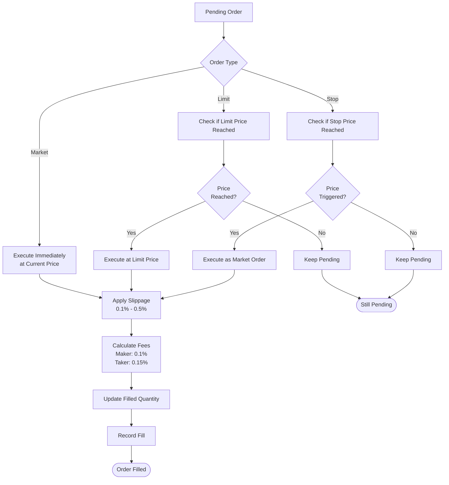
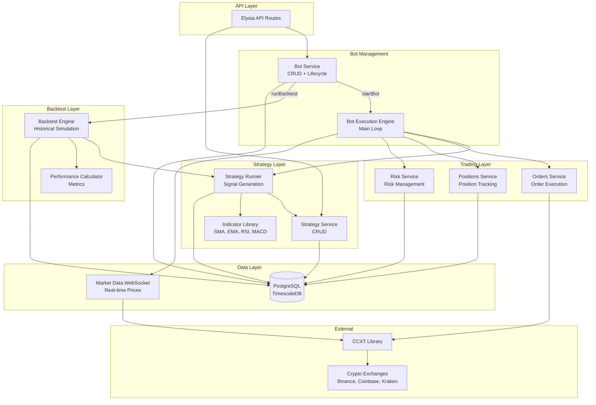
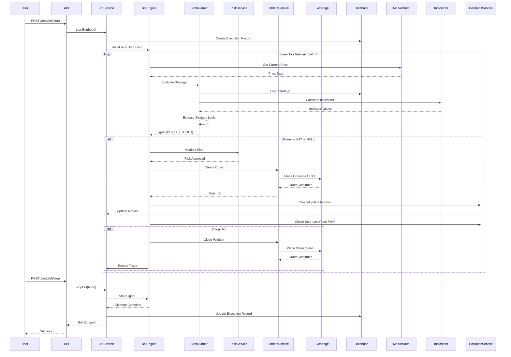
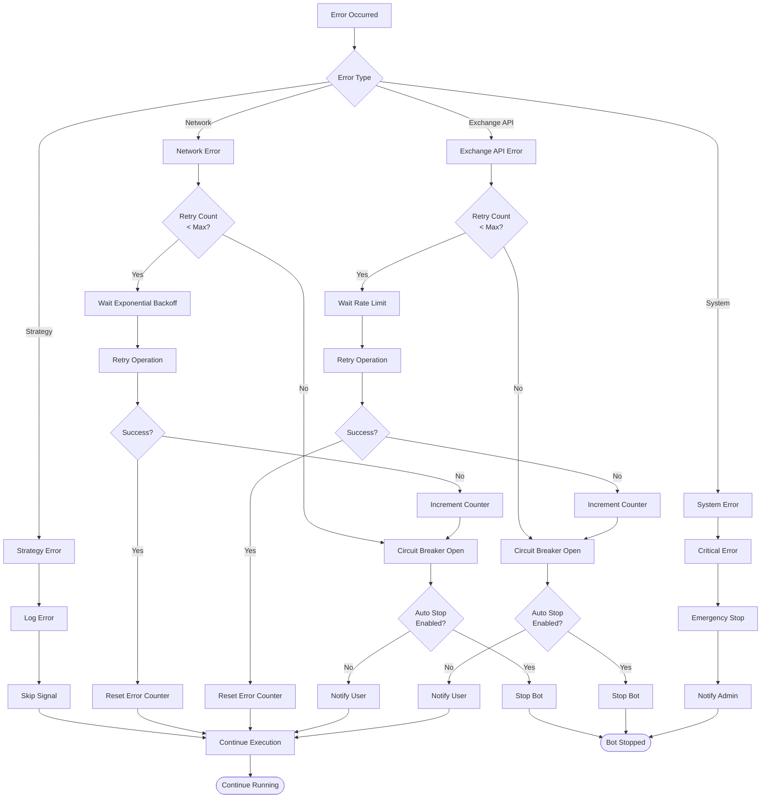
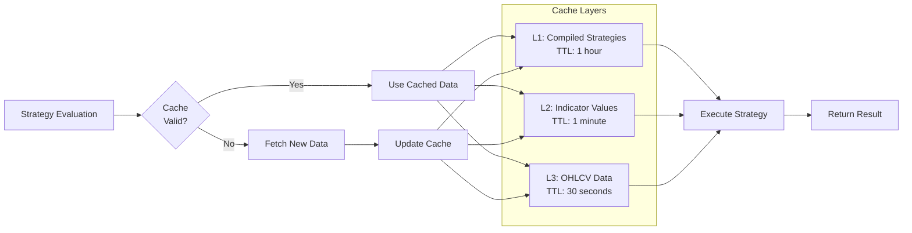

# Trading Core - Implementation Workflow
**FASE 1B - Bot Execution + Strategy Runner + Backtest Engine**

Data: 2025-10-17
Autor: Claude Code (Agente-CTO)
Task: 1B.2 - Mermaid Workflow para Trading Core

---

## 🎯 Visão Geral

Este documento detalha os workflows completos dos 3 engines que compõem o Trading Core:
1. **Bot Execution Engine** - Execução em tempo real
2. **Strategy Runner** - Avaliação de sinais
3. **Backtest Engine** - Simulação histórica

---

## 1. Bot Execution Engine - Main Loop

### 1.1 State Machine

---

### 1.2 Execution Loop Flow

```mermaid
graph TB
    Start([Bot Started]) --> Init[Initialize Bot]
    Init --> LoadConfig[Load Bot Configuration]
    LoadConfig --> LoadStrategy[Load Strategy]
    LoadStrategy --> ConnectWS[Connect WebSocket Market Data]
    ConnectWS --> ValidateRisk[Validate Risk Limits]

    ValidateRisk --> LoopStart{Bot Running?}

    LoopStart -->|Yes| CheckSchedule[Check Schedule<br/>Weekends/Holidays/Time]
    CheckSchedule -->|Allowed| GetMarketData[Get Current Market Data]
    CheckSchedule -->|Not Allowed| Wait1[Wait Tick Interval]

    GetMarketData --> EvalStrategy[Evaluate Strategy]
    EvalStrategy --> Signal{Signal?}

    Signal -->|BUY| CheckRisk1[Check Risk Limits]
    Signal -->|SELL| CheckRisk1
    Signal -->|HOLD| MonitorPositions[Monitor Open Positions]

    CheckRisk1 -->|Approved| CalcSize[Calculate Position Size]
    CheckRisk1 -->|Denied| LogDenied[Log Risk Denial]
    LogDenied --> MonitorPositions

    CalcSize --> CreateOrder[Create Order via Orders Service]
    CreateOrder --> TrackOrder[Track Order Execution]
    TrackOrder --> OrderFilled{Order Filled?}

    OrderFilled -->|Yes| CreatePosition[Create/Update Position]
    OrderFilled -->|Partial| CreatePosition
    OrderFilled -->|Failed| LogError1[Log Error]

    CreatePosition --> UpdateMetrics1[Update Bot Metrics]
    LogError1 --> UpdateMetrics1
    UpdateMetrics1 --> MonitorPositions

    MonitorPositions --> CheckPositions{Open Positions?}
    CheckPositions -->|Yes| CheckSL[Check Stop-Loss]
    CheckPositions -->|No| Wait1

    CheckSL --> SLHit{SL Hit?}
    SLHit -->|Yes| ClosePosition[Close Position]
    SLHit -->|No| CheckTP[Check Take-Profit]

    CheckTP --> TPHit{TP Hit?}
    TPHit -->|Yes| ClosePosition
    TPHit -->|No| CheckTrailing[Check Trailing Stop]

    CheckTrailing --> TrailHit{Trail Hit?}
    TrailHit -->|Yes| ClosePosition
    TrailHit -->|No| UpdatePnL[Update Position PnL]

    ClosePosition --> UpdateMetrics2[Update Bot Metrics]
    UpdatePnL --> UpdateMetrics2
    UpdateMetrics2 --> Wait1

    Wait1 --> CheckHealth[Health Check]
    CheckHealth --> HealthOK{Healthy?}

    HealthOK -->|Yes| LoopStart
    HealthOK -->|No| HandleError[Handle Error]

    HandleError --> Retryable{Retryable?}
    Retryable -->|Yes| Retry[Retry Operation]
    Retryable -->|No| AutoStop{Auto Stop?}

    Retry --> LoopStart
    AutoStop -->|Yes| StopBot[Stop Bot]
    AutoStop -->|No| LogCritical[Log Critical Error]
    LogCritical --> LoopStart

    LoopStart -->|No| Cleanup[Cleanup Resources]
    StopBot --> Cleanup
    Cleanup --> End([Bot Stopped])
```

---

## 2. Strategy Runner - Signal Evaluation

### 2.1 Strategy Execution Flow

---

### 2.2 Indicator Calculation Flow

---

## 3. Backtest Engine - Historical Simulation

### 3.1 Backtest Execution Flow

```mermaid
graph TB
    Start([Start Backtest]) --> LoadBot[Load Bot Configuration]
    LoadBot --> LoadStrategy[Load Strategy]
    LoadStrategy --> SetPeriod[Set Backtest Period<br/>Start Date - End Date]

    SetPeriod --> LoadHistorical[Load Historical OHLCV Data]
    LoadHistorical --> ValidateData{Data Valid?}

    ValidateData -->|No| ErrorData[Return Data Error]
    ValidateData -->|Yes| InitBacktest[Initialize Backtest State]

    InitBacktest --> SetCapital[Set Starting Capital]
    SetCapital --> CreateSimPortfolio[Create Simulated Portfolio]
    CreateSimPortfolio --> LoopStart{More Candles?}

    LoopStart -->|Yes| NextCandle[Get Next Candle]
    NextCandle --> UpdateTime[Update Simulated Time]
    UpdateTime --> UpdatePrices[Update Asset Prices]

    UpdatePrices --> ProcessPending[Process Pending Orders]
    ProcessPending --> CheckFills{Orders to Fill?}

    CheckFills -->|Yes| SimFill[Simulate Order Fill<br/>+ Slippage<br/>+ Fees]
    CheckFills -->|No| CheckPositions1

    SimFill --> UpdatePosition[Update Position]
    UpdatePosition --> UpdatePortfolio1[Update Portfolio Value]
    UpdatePortfolio1 --> CheckPositions1[Check Open Positions]

    CheckPositions1 --> CheckStops{Stop Hit?}
    CheckStops -->|Yes| SimClose[Simulate Position Close]
    CheckStops -->|No| EvalStrategy[Evaluate Strategy]

    SimClose --> RecordTrade1[Record Trade]
    RecordTrade1 --> UpdatePortfolio2[Update Portfolio Value]
    UpdatePortfolio2 --> EvalStrategy

    EvalStrategy --> GetSignal{Signal?}
    GetSignal -->|BUY/SELL| ValidateRisk[Validate Risk]
    GetSignal -->|HOLD| UpdateMetrics1[Update Metrics]

    ValidateRisk --> RiskOK{Risk OK?}
    RiskOK -->|Yes| CalcSize[Calculate Position Size]
    RiskOK -->|No| UpdateMetrics1

    CalcSize --> CreateSimOrder[Create Simulated Order]
    CreateSimOrder --> AddToPending[Add to Pending Orders]
    AddToPending --> UpdateMetrics1

    UpdateMetrics1 --> RecordEquity[Record Equity Point]
    RecordEquity --> CalcDrawdown[Calculate Drawdown]
    CalcDrawdown --> LoopStart

    LoopStart -->|No| CloseAll[Close All Open Positions]
    CloseAll --> FinalMetrics[Calculate Final Metrics]

    FinalMetrics --> CalcReturns[Calculate Returns]
    CalcReturns --> CalcSharpe[Calculate Sharpe Ratio]
    CalcSharpe --> CalcSortino[Calculate Sortino Ratio]
    CalcSortino --> CalcMaxDD[Calculate Max Drawdown]
    CalcMaxDD --> CalcWinRate[Calculate Win Rate]
    CalcWinRate --> CalcProfitFactor[Calculate Profit Factor]

    CalcProfitFactor --> GenerateReport[Generate Report]
    GenerateReport --> SaveResults[Save Results to DB]
    SaveResults --> ReturnResults[Return Backtest Results]

    ErrorData --> End1([Error])
    ReturnResults --> End2([Success])
```

---

### 3.2 Order Simulation Logic

---

## 4. Integration Flow - All Components

### 4.1 Complete System Architecture

---

### 4.2 Real-Time Trading Sequence

---

## 5. Error Handling & Recovery

### 5.1 Error Handling Flow

---

## 6. Performance Optimization

### 6.1 Caching Strategy

---

## 📊 Performance Targets

| Metric | Target | Critical |
|--------|--------|----------|
| **Tick Interval** | 5s - 1m | Configurable |
| **Strategy Evaluation** | <1s | <5s |
| **Order Placement** | <2s | <10s |
| **Memory per Bot** | <50MB | <200MB |
| **CPU per Bot** | <5% | <20% |
| **Concurrent Bots** | 50+ | 20+ |
| **Backtest Speed** | 1000 candles/s | 100 candles/s |

---

## ✅ Implementation Checklist

### Bot Execution Engine
- [ ] State machine implementation
- [ ] Main execution loop with configurable interval
- [ ] Strategy evaluation integration
- [ ] Order execution logic
- [ ] Position monitoring (SL/TP/Trailing)
- [ ] Error handling & retry logic
- [ ] Circuit breaker pattern
- [ ] Health check & auto-stop
- [ ] Performance metrics tracking
- [ ] Tests (≥80% coverage)

### Strategy Runner
- [ ] Strategy parser & compiler
- [ ] Indicator library (SMA, EMA, RSI, MACD, BB, Stoch, ATR)
- [ ] Signal generation logic
- [ ] Context & state management
- [ ] Caching strategy
- [ ] Timeout handling
- [ ] Sandbox execution
- [ ] Tests (≥80% coverage)

### Backtest Engine
- [ ] Historical data loader
- [ ] Replay engine
- [ ] Simulated order execution (market, limit, stop)
- [ ] Slippage simulation
- [ ] Fee calculation
- [ ] Performance calculator (Sharpe, Sortino, drawdown, win rate)
- [ ] Results reporting
- [ ] Tests (≥80% coverage)

---

**Document Version**: 1.0
**Last Updated**: 2025-10-17
**Maintained By**: Claude Code (Agente-CTO)
