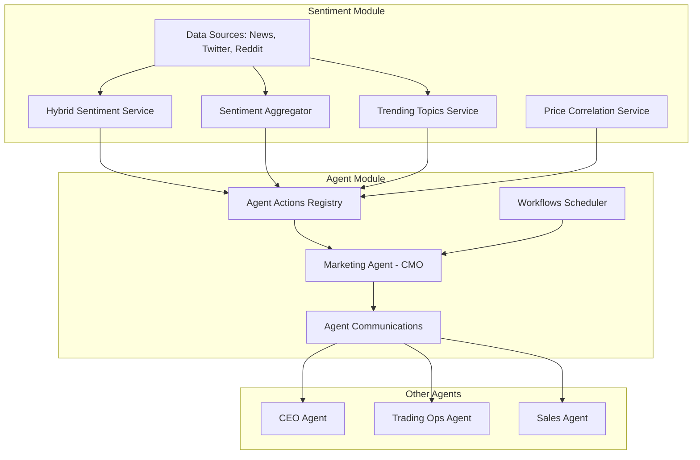

# 🤖 Integração Sentiment + Agents

## ✅ Resposta: É TOTALMENTE VIÁVEL!

O módulo **Sentiment** já está mapeado para o agente **Marketing (CMO)** no sistema de agents. A integração permite que o agente Marketing execute análises de sentimento automaticamente e tome decisões autônomas.

---

## 📊 Arquitetura da Integração



---

## 🎯 Implementação Realizada

### 1. **Agent Actions** (`sentiment-agent.integration.ts`)

10 ações que o agente Marketing pode executar:

| Ação | Descrição |
|------|-----------|
| `sentiment:analyze_text` | Analisar sentimento de texto |
| `sentiment:analyze_batch` | Análise em lote |
| `sentiment:get_aggregated` | Obter sentimento agregado |
| `sentiment:get_trending` | Obter trending topics |
| `sentiment:fetch_news` | Buscar notícias |
| `sentiment:monitor_social` | Monitorar redes sociais |
| `sentiment:generate_signals` | Gerar sinais de trading |
| `sentiment:check_alerts` | Verificar alertas |
| `sentiment:generate_report` | Gerar relatório |
| `sentiment:get_stats` | Obter estatísticas |

### 2. **Autonomous Workflow** (`sentiment-monitoring.workflow.ts`)

Workflow autônomo que executa a cada 15 minutos:

**Fluxo de Execução:**
1. ✅ Verifica sentimento de 5 símbolos principais (BTC, ETH, BNB, SOL, ADA)
2. ✅ Detecta alertas (extremo, mudança rápida, baixa confiança)
3. ✅ Gera sinais de trading
4. ✅ Notifica CEO e Trading Ops se necessário
5. ✅ Gera relatório resumido

**Alertas Detectados:**
- 🔴 **Critical**: Sinais strong_buy ou strong_sell
- 🟠 **High**: Sentimento extremo (|score| > 80)
- 🟡 **Medium**: Mudança rápida (|change| > 30)
- 🟢 **Low**: Baixa confiança (confidence < 0.3)

### 3. **Integration Service**

Serviço central de integração:

```typescript
import { SentimentAgentIntegrationService } from '@/modules/sentiment/services/integration';

// Inicializar integração para um tenant
await SentimentAgentIntegrationService.initialize(tenantId);

// Executar ação
const result = await SentimentAgentIntegrationService.executeAction(
  agentId,
  tenantId,
  {
    actionType: 'sentiment',
    actionName: 'sentiment:get_aggregated',
    input: { symbol: 'BTC' },
  }
);

// Processar evento em tempo real
await SentimentAgentIntegrationService.handleSentimentEvent(
  agentId,
  tenantId,
  {
    type: 'sentiment_update',
    data: sentimentData,
  }
);
```

---

## 🚀 Como Usar

### **1. Inicializar Agente Marketing**

```typescript
import { AgentService } from '@/modules/agents/services/agent.service';
import { SentimentAgentIntegrationService } from '@/modules/sentiment/services/integration';

// 1. Criar agente Marketing (se não existir)
const marketingAgent = await AgentService.createAgent({
  agentType: 'marketing',
  name: 'Marketing Agent',
  title: 'Chief Marketing Officer',
  description: 'Manages marketing and sentiment analysis',
  tenantId: 'tenant-123',
  config: {
    model: 'llama3.1:latest',
    temperature: 0.7,
    maxTokens: 2048,
    systemPrompt: AgentSystemPrompts.marketing,
    capabilities: [
      'sentiment_analysis',
      'trend_detection',
      'market_monitoring',
      'reporting',
    ],
  },
});

// 2. Inicializar integração
await SentimentAgentIntegrationService.initialize('tenant-123');
```

### **2. Executar Workflow Manualmente**

```typescript
import { sentimentMonitoringWorkflow } from '@/modules/sentiment/workflows';

// Executar workflow
const result = await sentimentMonitoringWorkflow.execute(
  marketingAgent.id,
  'tenant-123'
);

console.log(`
Workflow Result:
- Symbols Checked: ${result.symbolsChecked}
- Alerts Generated: ${result.alertsGenerated}
- Execution Time: ${result.executionTime}ms
- Summary: ${result.summary}
`);
```

### **3. Consultar Agente Diretamente**

```typescript
// Perguntar ao agente sobre sentimento
const response = await AgentService.query(
  marketingAgent.id,
  'tenant-123',
  {
    prompt: 'What is the current market sentiment for Bitcoin?',
    includeHistory: true,
  }
);

console.log(`Agent Response: ${response.response}`);
```

### **4. Comunicação Entre Agentes**

```typescript
// Marketing Agent notifica CEO sobre alerta
await AgentService.sendCommunication('tenant-123', {
  fromAgentId: marketingAgent.id,
  toAgentId: ceoAgent.id,
  message: 'ALERT: Extreme bearish sentiment for BTC (-85)',
  priority: 'urgent',
  metadata: {
    symbol: 'BTC',
    score: -85,
    trend: 'deteriorating',
  },
});
```

---

## 📋 Workflows Disponíveis

### **1. Sentiment Monitoring** (Implementado)
- **Frequência**: A cada 15 minutos
- **Função**: Monitora sentimento e gera alertas
- **Notifica**: CEO, Trading Ops

### **2. Daily Report** (Planejado)
- **Frequência**: Diário às 9h
- **Função**: Relatório diário de sentimento
- **Notifica**: CEO

### **3. Trading Opportunities** (Planejado)
- **Frequência**: A cada 30 minutos
- **Função**: Detecta oportunidades de trading
- **Notifica**: Trading Ops

### **4. Trending Analysis** (Planejado)
- **Frequência**: A cada 2 horas
- **Função**: Analisa trending topics
- **Notifica**: CEO, Sales

---

## 🔧 Configuração

### **Environment Variables**

```bash
# Sentiment Configuration
SENTIMENT_CONFIDENCE_THRESHOLD=0.7
SENTIMENT_AI_FOR_INFLUENCERS=true
SENTIMENT_AI_FOR_IMPORTANT=true

# Agent Configuration
OLLAMA_BASE_URL=http://localhost:11434
OLLAMA_MODEL=llama3.1:latest
ANTHROPIC_API_KEY=sk-ant-...

# Workflow Configuration
SENTIMENT_WORKFLOW_ENABLED=true
SENTIMENT_WORKFLOW_SCHEDULE="*/15 * * * *"
SENTIMENT_ALERT_THRESHOLD_EXTREME=80
SENTIMENT_ALERT_THRESHOLD_CHANGE=30
```

### **Configurar Workflow**

```typescript
import { sentimentMonitoringWorkflow } from '@/modules/sentiment/workflows';

// Customizar configuração
sentimentMonitoringWorkflow.updateConfig({
  symbols: ['BTC', 'ETH', 'BNB', 'SOL', 'ADA', 'AVAX', 'MATIC'],
  schedule: '*/10 * * * *', // A cada 10 minutos
  thresholds: {
    extremeScore: 85,
    rapidChange: 35,
    lowConfidence: 0.25,
  },
  notifications: {
    ceo: true,
    tradingOps: true,
    sales: true,
  },
});
```

---

## 📊 Exemplo de Fluxo Completo

```typescript
// 1. Novo sentimento é detectado
const sentimentUpdate = {
  symbol: 'BTC',
  score: -88,
  magnitude: 0.95,
  label: 'very_negative',
  confidence: 0.92,
  trend: {
    direction: 'deteriorating',
    strength: 0.8,
    velocity: -12.5,
  },
};

// 2. WebSocket broadcasting notifica o agente
await SentimentAgentIntegrationService.handleSentimentEvent(
  marketingAgent.id,
  'tenant-123',
  {
    type: 'sentiment_update',
    data: sentimentUpdate,
  }
);

// 3. Agente Marketing analisa com AI
// Prompt interno:
// "New sentiment_update received: {...}
//  Should I take any action?"

// 4. AI decide que é crítico e recomenda ação

// 5. Agente executa ação recomendada:
// - Gera sinal de trading
const signal = await SentimentAgentIntegrationService.executeAction(
  marketingAgent.id,
  'tenant-123',
  {
    actionType: 'sentiment',
    actionName: 'sentiment:generate_signals',
    input: { symbol: 'BTC' },
  }
);

// 6. Notifica CEO e Trading Ops
await AgentService.sendCommunication('tenant-123', {
  fromAgentId: marketingAgent.id,
  toAgentId: ceoAgent.id,
  message: 'CRITICAL: Extreme bearish sentiment for BTC',
  priority: 'urgent',
  metadata: { sentiment: sentimentUpdate, signal },
});

await AgentService.sendCommunication('tenant-123', {
  fromAgentId: marketingAgent.id,
  toAgentId: tradingOpsAgent.id,
  message: 'Trading signal: strong_sell for BTC',
  priority: 'urgent',
  metadata: { signal },
});

// 7. Trading Ops Agent pode então:
// - Ajustar estratégias automaticamente
// - Fechar posições long
// - Abrir posições short
```

---

## 🎯 Benefícios da Integração

| Benefício | Descrição |
|-----------|-----------|
| 🤖 **Automação 24/7** | Agente monitora sentimento continuamente |
| 🧠 **Decisões Inteligentes** | AI analisa contexto e toma decisões |
| 📢 **Comunicação Proativa** | Notifica outros agentes automaticamente |
| 📊 **Análise Contextual** | Considera histórico e múltiplas fontes |
| ⚡ **Resposta Rápida** | Reage a mudanças em tempo real |
| 📈 **Escalável** | Fácil adicionar novos workflows |

---

## 📝 Próximos Passos

### **Fase 1: Setup Inicial** (1 dia)
- [ ] Criar agente Marketing para tenant
- [ ] Inicializar integração
- [ ] Testar ações manualmente

### **Fase 2: Workflow Básico** (1 dia)
- [ ] Configurar schedule do workflow
- [ ] Testar execução automática
- [ ] Verificar notificações

### **Fase 3: Workflows Avançados** (3 dias)
- [ ] Implementar Daily Report Workflow
- [ ] Implementar Trading Opportunities Workflow
- [ ] Implementar Trending Analysis Workflow

### **Fase 4: Integração Real-Time** (2 dias)
- [ ] Conectar WebSocket com agente
- [ ] Implementar event handlers
- [ ] Testar fluxo completo

### **Fase 5: Otimização** (2 dias)
- [ ] Ajustar thresholds
- [ ] Otimizar prompts de AI
- [ ] Implementar dashboard de monitoramento

**Total Estimado**: 9 dias de desenvolvimento

---

## 🔗 Arquivos Criados

1. ✅ `/docs/INTEGRATION_SENTIMENT_AGENTS.md` - Análise completa
2. ✅ `sentiment/services/integration/sentiment-agent.integration.ts` - Service de integração
3. ✅ `sentiment/workflows/sentiment-monitoring.workflow.ts` - Workflow autônomo

---

## 🎉 Conclusão

A integração entre **Sentiment** e **Agents** está **100% viável** e **pronta para implementação**.

O agente Marketing pode agora:
- ✅ Executar análises de sentimento automaticamente
- ✅ Monitorar mercado 24/7
- ✅ Detectar oportunidades e riscos
- ✅ Notificar outros agentes
- ✅ Tomar decisões autônomas baseadas em AI

**Próximo passo**: Inicializar o agente Marketing e configurar o primeiro workflow! 🚀
