# BotCriptoFy2 - Visual Audit Dashboard

> **Quick visual reference for stakeholders and decision makers**
> **Generated:** 2025-10-17

---

## 🎯 Overall Health Score

```mermaid
%%{init: {'theme':'base', 'themeVariables': { 'primaryColor':'#ff4444'}}}%%
pie title Platform Health Score: 42/100 🔴
    "Implemented" : 42
    "Missing/Broken" : 58
```



**Status:** 🔴 **NOT PRODUCTION READY**

---

## 📊 Module Completeness Distribution

```mermaid
%%{init: {'theme':'base'}}%%
pie title 28 Modules by Status
    "Production Ready (≥90%)" : 3
    "Needs Work (70-89%)" : 12
    "Critical Gaps (<70%)" : 13
```



- ✅ **Production Ready:** 3 modules (11%)
- ⚠️ **Needs Work:** 12 modules (43%)
- 🔴 **Critical Gaps:** 13 modules (46%)

---

## 🔐 Security Risk Distribution


**Overall Security Score:** 62/100 🔴 **HIGH RISK**

---

## 📈 Implementation Progress by Domain


---

## 🏗️ Module Dependency Hierarchy


**Legend:**
- 🔴 **Red (Criticality 10):** Critical foundation - any issue blocks many modules
- ⚠️ **Orange (Criticality 7-9):** High impact - important for core functionality
- ✅ **Green (Criticality 5-6):** Independent features - lower risk

---

## 🎯 Critical Path to Production


---

## 💰 Investment Breakdown


| Phase | Duration | Investment | Key Deliverables |
|-------|----------|------------|------------------|
| **Phase 1** | 8 weeks | $96K-192K | Security fixes, 2FA, DB optimization |
| **Phase 2** | 16 weeks | $192K-384K | WebSocket, Bot engine, Payments |
| **Phase 3** | 8 weeks | $96K-192K | TradingView, AI signals, Tax reports |
| **Phase 4** | 8 weeks | $96K-192K | Performance, Monitoring, Load testing |
| **TOTAL** | **40 weeks** | **$480K-960K** | **Production-ready platform** |

---

## 📊 Gap Analysis by Priority


**Top 10 P0 Blockers:**
1. WebSocket market data commented out
2. No bot execution engine
3. No backtest engine
4. No copy trading execution
5. No payment gateways integrated
6. No P2P escrow automation
7. No MMN spillover execution
8. No 2FA implementation
9. No Redis rate limiting
10. Test coverage 15% (23 modules have ZERO tests)

---

## 🔍 Test Coverage Heatmap


**Target:** Move all modules to Quadrant 1 (Excellent)

**Priority:** Quadrant 2 modules (High criticality + Low coverage)
- orders (55% coverage, criticality 9)
- market-data (70% coverage, criticality 9)
- strategies (65% coverage, criticality 7)
- p2p (60% coverage, criticality 7)

---

## 🌐 API Endpoint Quality


| Metric | Value | Target | Status |
|--------|-------|--------|--------|
| **Total Endpoints** | 515 | - | ✅ |
| **Validation Coverage** | 68.93% | 100% | ⚠️ |
| **Documentation Coverage** | 61.94% | 100% | ⚠️ |
| **Authentication** | 90.49% | 95% | ✅ |
| **Grade** | B+ | A | ⚠️ |

---

## 🔐 Security Score by Module


**Immediate Action Required:**
- Fix orders module (2 critical vulnerabilities)
- Fix banco module (withdrawal approval bypass)
- Fix p2p module (dispute resolution exploit)

---

## ⚡ Database Performance Scores


**Performance Improvement Potential:**
- market-data: **1000%** faster (enable hypertables)
- orders: **500%** faster (add composite indexes)
- positions: **300%** faster (add partial indexes)
- subscriptions: **1000%** faster (continuous aggregates)

---

## 💡 Feature Opportunities ROI


**Recommended Order:**
1. **Quadrant 2 (Quick Wins):** Tax Reporting, Educational Content
2. **Quadrant 4 (Plan Carefully):** TradingView, AI Signals, Mobile App, White-label
3. **Quadrant 1 (Do Last):** NFT Integration, Multi-Asset Staking

---

## 📈 Revenue Projections


**Top Revenue Drivers:**
1. TradingView Integration: $150k-300k ARR
2. AI Trading Signals: $100k-250k ARR
3. Tax Reporting: $80k-150k ARR
4. Advanced Analytics: $60k-120k ARR
5. Social Trading Marketplace: $50k-100k ARR

**Break-even:** Month 15-18
**ROI:** 88-309% Year 1, 400-800% by Year 3

---

## 🎯 Decision Framework Scorecard


**Score Interpretation:**
- **80-100:** Strong GO - All conditions met
- **60-79:** Conditional GO - Address gaps first
- **40-59:** YELLOW - Significant risks, mitigation required
- **0-39:** NO-GO - Too risky, pivot recommended

**Current Score: 65/100** → ⚠️ **CONDITIONAL GO**

**Conditions to improve score:**
1. Secure 12+ months funding (currently 6-9 months)
2. Hire 2 senior engineers (currently understaffed)
3. Extend timeline to 12 months (currently expecting 6-8)

---

## 🚦 Production Readiness Status


**Current Stage:** Planning → Phase 1 (Critical Blockers)
**Production Ready:** Week 40 (10 months from now)

---

## 📋 Priority Matrix (Impact vs Effort)

```mermaid
%%{init: {'theme':'base'}}%%
quadrantChart
    title Issue Priority (Impact vs Effort)
    x-axis Low Effort --> High Effort
    y-axis Low Impact --> High Impact
    quadrant-1 Plan
    quadrant-2 Do First
    quadrant-3 Skip
    quadrant-4 Do Later

    Fix 8 P0 Security: [0.1, 0.95]
    Enable TimescaleDB: [0.3, 0.90]
    Add 2FA: [0.4, 0.85]
    WebSocket Market Data: [0.6, 0.95]
    Bot Execution Engine: [0.8, 0.90]
    Payment Gateway: [0.5, 0.80]
    Add Tests (23 modules): [0.7, 0.75]
    API Documentation: [0.3, 0.60]
    Complete CRUD: [0.5, 0.50]
    Advanced Analytics: [0.7, 0.55]
```

**Do This Week (Quadrant 2 - High Impact, Low Effort):**
1. Fix 8 P0 security vulnerabilities (5 hours)
2. Enable TimescaleDB hypertables (3 days)
3. Add API documentation to 194 endpoints (1 week)

---

## 🏁 Next Steps Flowchart


---

## 📊 Module Health Dashboard

| Module | Completeness | Security | Performance | Endpoints | Grade | Status |
|--------|--------------|----------|-------------|-----------|-------|--------|
| **auth** | 85% | 85 | 85 | 14 | A- | ✅ |
| **exchanges** | 95% | 72 | 80 | 6 | A- | ✅ |
| **market-data** | 70% | 85 | 30 🔴 | 14 | B | ⚠️ |
| **orders** | 55% 🔴 | 55 🔴 | 40 🔴 | 14 | D+ | 🔴 |
| **positions** | 90% | 75 | 50 | 19 | A | ✅ |
| **strategies** | 65% | 75 | 55 | 14 | B- | ⚠️ |
| **risk** | 85% | 80 | 70 | 12 | A- | ✅ |
| **bots** | 75% | 60 | 55 | 24 | B | ⚠️ |
| **banco** | 80% | 50 🔴 | 75 | 22 | B- | ⚠️ |
| **financial** | 85% | 75 | 75 | 81 | A- | ✅ |
| **p2p** | 60% | 52 🔴 | 70 | 16 | D+ | 🔴 |
| **affiliate** | 70% | 68 | 65 | 13 | B- | ⚠️ |
| **mmn** | 65% | 65 | 65 | 11 | C+ | ⚠️ |
| **social-trading** | 65% | 75 | 60 | 43 | B- | ⚠️ |
| **subscriptions** | 85% | 75 | 60 | 24 | A- | ✅ |
| **users** | 75% | 78 | 80 | 8 | B+ | ⚠️ |
| **tenants** | 80% | 85 | 80 | 9 | A- | ✅ |
| **security** | 80% | 80 | 75 | 15 | A- | ✅ |
| **audit** | 75% | 82 | 50 | 7 | B+ | ⚠️ |
| **marketing** | 55% | 70 | 65 | 8 | C+ | ⚠️ |
| **sales** | 60% | 72 | 70 | 39 | B- | ⚠️ |
| **support** | 65% | 75 | 65 | 49 | B- | ⚠️ |
| **documents** | 70% | 78 | 70 | 15 | B | ⚠️ |
| **ceo** | 80% | 88 | 85 | 5 | A | ✅ |
| **departments** | 75% | 88 | 80 | 15 | A- | ✅ |
| **configurations** | 75% | 80 | 75 | 8 | B+ | ⚠️ |
| **notifications** | 70% | 82 | 70 | 12 | B | ⚠️ |
| **rate-limiting** | 75% | 70 | 65 | 5 | B | ⚠️ |

**Legend:**
- ✅ **Production Ready:** A or A- grade
- ⚠️ **Needs Work:** B or C grade
- 🔴 **Critical Issues:** D grade or red scores

---

## 📞 Contact & Support

**For questions about this audit:**
- Technical Lead: Review MASTER_AUDIT_REPORT.md
- Product Manager: Review FEATURE_OPPORTUNITIES_REPORT.md
- Security Team: Review SECURITY_AUDIT_REPORT.md
- Database Team: Review DATABASE_OPTIMIZATION_REPORT.md

**Next Meeting:** Go/No-Go Decision (Schedule within 1 week)

---

*Visual dashboard generated from comprehensive multi-agent audit on 2025-10-17*
