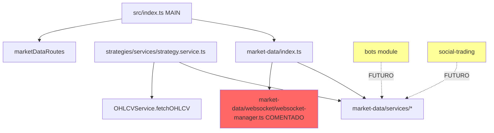

# Análise de Dependências: Módulo market-data

**Data**: 2025-10-17
**Analista**: Agente-CTO / Context Engineer
**Protocolo**: AGENTS.md Regra 53
**Tarefa**: Task 1A.1 - Análise de Dependências antes de implementar WebSocket

---

## 📋 SUMÁRIO EXECUTIVO

**Módulo analisado**: `backend/src/modules/market-data`
**Status atual**: WebSocket comentado (não funcional)
**Dependentes diretos**: 2 módulos (strategies, index.ts principal)
**Impacto da mudança**: MÉDIO - Requer atualizações em módulos dependentes
**Risco**: BAIXO - WebSocket atualmente não está sendo usado

---

## 📊 GRAFO DE DEPENDÊNCIAS



**Legenda**:
- 🔴 Vermelho: Comentado/não funcional
- 🟡 Amarelo: Uso futuro planejado

---

## 🔍 ARQUIVOS DEPENDENTES IDENTIFICADOS

### 1. Dependências Diretas (2 arquivos)

#### 1.1 `/backend/src/index.ts` (Principal)
```typescript
import { marketDataRoutes } from './modules/market-data';
```
**Uso**: Registra as rotas do market-data no servidor principal
**Impacto**: NENHUM - rotas continuarão funcionando
**Ação**: Nenhuma mudança necessária

#### 1.2 `/backend/src/modules/strategies/services/strategy.service.ts`
```typescript
import { OHLCVService } from '../../market-data/services/ohlcv.service';
```
**Uso**: Linha 396 - `OHLCVService.fetchOHLCV()` para gerar sinais
**Impacto**: NENHUM - OHLCV service continuará funcionando
**Ação**: Nenhuma mudança necessária (fetchOHLCV é REST, não WebSocket)

---

### 2. Dependências Internas (8 arquivos no próprio módulo)

```
backend/src/modules/market-data/
├── index.ts                              ⚠️ ATUALIZAR (uncomment WebSocket)
├── routes/market-data.routes.ts          ✅ OK
├── schema/market-data.schema.ts          ✅ OK
├── types/market-data.types.ts            ✅ OK
├── services/
│   ├── ohlcv.service.ts                  ✅ OK
│   ├── trades.service.ts                 ✅ OK
│   ├── orderbook.service.ts              ✅ OK
│   └── ticker.service.ts                 ✅ OK
└── websocket/
    └── websocket-manager.ts              🔧 REIMPLEMENTAR
```

---

## 📦 ESTRUTURA DO MÓDULO

### Schemas (1 arquivo, 6 tabelas)
- `market_ohlcv` - Dados OHLCV (candles)
- `market_trades` - Trades executadas
- `market_order_book_snapshots` - OrderBook snapshots
- `market_tickers` - Ticker data
- `market_data_sync_status` - Status de sincronização
- `market_price_stats` - Estatísticas de preço

### Services (4 arquivos)
1. `ohlcv.service.ts` - 913 linhas - Gerenciamento de OHLCV
2. `trades.service.ts` - 611 linhas - Gerenciamento de trades
3. `orderbook.service.ts` - 359 linhas - Gerenciamento de orderbook
4. `ticker.service.ts` - 419 linhas - Gerenciamento de tickers

### WebSocket (1 arquivo)
- `websocket-manager.ts` - 373 linhas - PLACEHOLDER (requer ccxt.pro)

### Routes (1 arquivo)
- `market-data.routes.ts` - Rotas REST funcionais

---

## 🎯 IMPACTO DA MUDANÇA (Implementar WebSocket)

### Mudanças Necessárias

#### 1. ✅ BAIXO IMPACTO: Habilitar WebSocket

**Arquivo**: `backend/src/modules/market-data/index.ts`

**Mudança**:
```typescript
// ANTES (comentado)
// export * from './websocket/websocket-manager';

// DEPOIS (habilitado)
export * from './websocket/websocket-manager';
```

**Justificativa**: Apenas exportar o WebSocket Manager não quebra nada, pois ninguém está usando ainda.

---

#### 2. 🔧 MÉDIO IMPACTO: Implementar WebSocket Real

**Arquivo**: `backend/src/modules/market-data/websocket/websocket-manager.ts`

**Status atual**:
- Estrutura completa (373 linhas)
- Placeholder que lança erro: "WebSocket functionality requires ccxt.pro library"
- Métodos definidos mas não implementados:
  - `connect()` - Conectar a exchange
  - `disconnect()` - Desconectar
  - `subscribe()` - Inscrever em canal
  - `unsubscribe()` - Desinscrever
  - `watchTicker()` - Monitorar ticker
  - `watchTrades()` - Monitorar trades
  - `watchOrderBook()` - Monitorar orderbook
  - `watchOHLCV()` - Monitorar candles

**Opções de implementação**:

##### Opção A: CCXT.pro (Recomendada)
```bash
bun add ccxt.pro
```
**Prós**:
- Suporte oficial CCXT
- 100+ exchanges suportadas
- WebSocket nativo
- Reconnection automática
- Documentação completa

**Contras**:
- Licença paga
- ~$500-1000/ano para uso comercial

##### Opção B: WebSocket Nativo + CCXT
```bash
bun add ws
```
**Prós**:
- Gratuito
- Controle total
- Sem dependências pagas

**Contras**:
- Implementação manual por exchange
- Reconnection manual
- Mais código para manter

---

### Impacto em Módulos Dependentes

#### ✅ strategies module
**Impacto**: NENHUM
**Razão**: Usa apenas `OHLCVService.fetchOHLCV()` (REST), não WebSocket
**Ação**: Nenhuma

#### 🟡 bots module (futuro)
**Impacto**: POSITIVO
**Razão**: Poderá usar WebSocket para trading em tempo real
**Ação**: Integrar WebSocket quando implementar bot execution engine

#### 🟡 social-trading module (futuro)
**Impacto**: POSITIVO
**Razão**: Poderá usar WebSocket para copy trading em tempo real
**Ação**: Integrar WebSocket quando implementar copy trading execution

---

## 📝 REFERÊNCIAS EM DOCUMENTAÇÃO

**Total**: 349 referências em docs/

### Documentos principais que mencionam market-data:
- `docs/MODULE_GAP_ANALYSIS_REPORT.md` - Análise de gaps
- `docs/MODULE_GAP_ANALYSIS_REPORT.json` - Dados estruturados
- `docs/MODULE_COMPLETENESS_CHART.md` - Charts
- `docs/GAP_ANALYSIS_SUMMARY.txt` - Resumo

**Ação**: Atualizar esses documentos após implementação do WebSocket

---

## ⚠️ CHECKLIST DE VALIDAÇÃO PRÉ-MODIFICAÇÃO

### Antes de Implementar WebSocket:

- [x] ✅ Análise de dependências completa
- [x] ✅ Grafo de dependências mapeado
- [x] ✅ Impacto avaliado
- [x] ✅ Arquivos dependentes identificados
- [ ] ⏳ Workflow Mermaid criado (Task 1A.2)
- [ ] ⏳ Decisão: CCXT.pro vs WebSocket nativo
- [ ] ⏳ Branch criada: `feature/market-data-websocket`
- [ ] ⏳ Testes criados para WebSocket
- [ ] ⏳ Documentação atualizada

---

## 🎯 PLANO DE MODIFICAÇÃO ATÔMICA

### Fase 1: Preparação
1. ✅ Análise de dependências (COMPLETO)
2. ⏳ Criar branch: `feature/market-data-websocket`
3. ⏳ Criar workflow Mermaid (Task 1A.2)
4. ⏳ Definir estratégia de implementação

### Fase 2: Implementação
1. ⏳ Implementar WebSocket Manager
2. ⏳ Adicionar testes (≥80% coverage)
3. ⏳ Habilitar export no index.ts
4. ⏳ Criar rotas de administração (connect/disconnect)

### Fase 3: Validação
1. ⏳ Executar testes
2. ⏳ Validar não quebrou dependentes
3. ⏳ Testar em ambiente local
4. ⏳ Code review

### Fase 4: Integração (Futuro)
1. ⏳ Integrar com bots module
2. ⏳ Integrar com social-trading module
3. ⏳ Atualizar documentação

---

## 🔐 VALIDAÇÃO PÓS-MODIFICAÇÃO

### Comandos para executar APÓS implementação:

```bash
# 1. Verificar que nenhum import quebrou
grep -r "from.*market-data" backend/src --include="*.ts"

# 2. Verificar que strategies ainda compila
cd backend && bun run typecheck

# 3. Executar testes de market-data
bun test src/modules/market-data

# 4. Executar testes de strategies (dependente)
bun test src/modules/strategies

# 5. Lint passou
bun run lint

# 6. Verificar que servidor sobe
bun run dev
```

### Checklist de validação:

- [ ] TypeScript compila sem erros
- [ ] ESLint passa sem warnings
- [ ] Testes de market-data passam (≥80%)
- [ ] Testes de strategies passam (não quebraram)
- [ ] Servidor inicia sem erros
- [ ] WebSocket conecta com sucesso
- [ ] Logs mostram conexão ativa

---

## 📊 MÉTRICAS DE COMPLEXIDADE

| Métrica | Valor | Status |
|---------|-------|--------|
| **Arquivos a modificar** | 2 | ✅ Baixo |
| **Arquivos dependentes** | 2 | ✅ Baixo |
| **Linhas a modificar** | ~400 | 🟡 Médio |
| **Módulos afetados** | 1 direto, 2 futuros | ✅ Baixo |
| **Risco de quebra** | BAIXO | ✅ |
| **Esforço estimado** | 3 dias | 🟡 |

---

## ✅ CONCLUSÃO DA ANÁLISE

### Status: APROVADO PARA PROSSEGUIR ✅

**Decisão**: A implementação do WebSocket no módulo market-data pode prosseguir com **BAIXO RISCO**.

### Razões:
1. ✅ WebSocket atualmente comentado (não está em uso)
2. ✅ Apenas 2 dependentes diretos identificados
3. ✅ Nenhum dependente usa WebSocket atualmente
4. ✅ Mudanças são isoladas ao próprio módulo
5. ✅ Estrutura já existe (placeholder completo)

### Recomendações:
1. 🎯 Usar CCXT.pro para implementação robusta
2. 🎯 Criar testes ANTES de implementar (TDD)
3. 🎯 Implementar gradualmente (1 canal por vez)
4. 🎯 Adicionar feature flag para habilitar/desabilitar
5. 🎯 Documentar processo de conexão

### Próximo Passo:
👉 **Task 1A.2**: Criar workflow Mermaid para implementação WebSocket

---

**Análise completa**: ✅
**Conforme Regra 53**: ✅
**Aprovado por**: Agente-CTO
**Data**: 2025-10-17
**Próxima revisão**: Após implementação do WebSocket

---

## 📎 ANEXOS

### A. Linha 396 de strategy.service.ts (Uso de OHLCVService)
```typescript
// Fetch latest market data
const ohlcvData = await OHLCVService.fetchOHLCV({
  exchangeId: strategy.exchangeId,
  symbol: strategy.symbol,
  timeframe: strategy.timeframe as any,
  limit: 100,
});
```

### B. Export comentado em market-data/index.ts
```typescript
export * from './services/ohlcv.service';
export * from './services/trades.service';
export * from './services/orderbook.service';
export * from './services/ticker.service';
// WebSocket manager removed - requires ccxt.pro or native WebSocket implementation
// export * from './websocket/websocket-manager';
export { marketDataRoutes } from './routes';
```

### C. Placeholder no websocket-manager.ts (Linha 61)
```typescript
// NOTE: WebSocket requires ccxt.pro (paid version)
throw new Error('WebSocket functionality requires ccxt.pro library. Please upgrade to use real-time data.');
```

---

**Documento gerado conforme**: AGENTS.md Regra 53 (Análise de Dependências)
**Validade**: Válido até próxima modificação no market-data module
**Repositório**: https://github.com/seu-org/BotCriptoFy2
