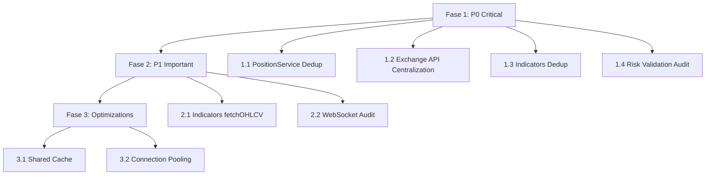

# Refactoring Execution Plan - Module Boundaries

**Data**: 2025-10-17
**Relacionado**: [MODULE_BOUNDARY_VIOLATIONS_REPORT.md](./MODULE_BOUNDARY_VIOLATIONS_REPORT.md)

---

## 🎯 Objetivo

Corrigir invasões de competências entre módulos priorizando:
1. **Alta Performance**: Reduzir chamadas API duplicadas
2. **Segurança**: Validações consistentes
3. **Reaproveitamento**: Eliminar código duplicado

---

## 📊 Overview do Plano



**Duração Estimada**: 4-6 dias
**Risco Geral**: Médio-Alto

---

## 🔴 FASE 1: Correções P0 (2-3 dias)

### 1.1 Resolver Duplicação de PositionService

#### Problema
Dois `PositionService` implementados:
- `orders/services/position.service.ts` (21 linhas) ❌
- `positions/services/position.service.ts` (1,201 linhas) ✅

#### Passos de Execução

**Step 1.1.1: Auditar Imports**
```bash
# Encontrar todos os imports do PositionService incorreto
grep -r "from.*orders.*position\.service" backend/src --exclude-dir=node_modules

# Expected: Deve retornar 0 resultados ou poucos arquivos
```

**Step 1.1.2: Identificar Dependências**
```bash
# Verificar quem importa de orders/
cd /Users/myminimac/Desenvolvimento/BotCriptoFy2
grep -r "orders/services/position" backend/src -l
```

**Step 1.1.3: Criar Branch**
```bash
git checkout -b fix/position-service-deduplication
```

**Step 1.1.4: Remover PositionService de Orders**
```bash
# Backup primeiro
cp backend/src/modules/orders/services/position.service.ts \
   backend/src/modules/orders/services/position.service.ts.backup

# Deletar arquivo
rm backend/src/modules/orders/services/position.service.ts
```

**Step 1.1.5: Atualizar Exports em Orders Module**
```typescript
// backend/src/modules/orders/index.ts
// ❌ REMOVER esta linha (se existir):
// export * from './services/position.service';

// ✅ RE-EXPORTAR do módulo positions:
export { positionService, PositionService } from '../positions';
```

**Step 1.1.6: Validar**
```bash
bun run typecheck
bun test orders
bun test positions
```

**Critérios de Aceitação**:
- [ ] Zero import de `orders/services/position.service`
- [ ] Todos os testes de orders passando
- [ ] Todos os testes de positions passando
- [ ] `bun run typecheck` sem erros

**Estimativa**: 2-3 horas
**Risco**: 🟡 Médio

---

### 1.2 Centralizar Exchange API Access

#### Problema
Múltiplos módulos podem estar acessando CCXT diretamente ao invés de usar `exchangeService`.

#### Passos de Execução

**Step 1.2.1: Identificar Violações**
```bash
# Encontrar acessos diretos a CCXT (excluindo exchanges module)
grep -r "new ccxt\|new Exchange\|\.fetchOHLCV\|\.fetchTicker\|\.fetchOrderBook\|\.createOrder\|\.cancelOrder" \
  backend/src/modules \
  --exclude-dir=exchanges \
  --exclude-dir=node_modules \
  -l
```

**Expected Output**: Lista de arquivos que precisam ser refatorados

**Step 1.2.2: Analisar Cada Violação**
Para cada arquivo encontrado:
```bash
# Ler o arquivo e identificar o padrão de acesso
code <arquivo>
```

**Step 1.2.3: Criar Branch**
```bash
git checkout -b fix/centralize-exchange-api-access
```

**Step 1.2.4: Refatorar `market-data/services/ohlcv.service.ts`**

**Antes** (provavelmente):
```typescript
import ccxt from 'ccxt';

class OHLCVService {
  async fetchOHLCV(params) {
    const exchange = new ccxt[exchangeId]();
    return await exchange.fetchOHLCV(symbol, timeframe, since, limit);
  }
}
```

**Depois**:
```typescript
import { exchangeService } from '@/modules/exchanges';

class OHLCVService {
  async fetchOHLCV(params) {
    return await exchangeService.fetchOHLCV(
      params.exchangeId,
      params.symbol,
      params.timeframe,
      params.since,
      params.limit
    );
  }
}
```

**Step 1.2.5: Refatorar `market-data/services/ticker.service.ts`**

**Depois**:
```typescript
import { exchangeService } from '@/modules/exchanges';

class TickerService {
  async fetchTicker(exchangeId, symbol) {
    return await exchangeService.fetchTicker(exchangeId, symbol);
  }
}
```

**Step 1.2.6: Refatorar `market-data/services/orderbook.service.ts`**

**Depois**:
```typescript
import { exchangeService } from '@/modules/exchanges';

class OrderbookService {
  async fetchOrderBook(exchangeId, symbol, limit?) {
    return await exchangeService.fetchOrderBook(exchangeId, symbol, limit);
  }
}
```

**Step 1.2.7: Refatorar `order-book/services/order-book-snapshot.service.ts`**

**Verificar** linha ~59-71:
```typescript
// Se houver acesso direto, refatorar:
import { exchangeService } from '@/modules/exchanges';

const orderbook = await exchangeService.fetchOrderBook(exchangeId, symbol, limit);
```

**Step 1.2.8: Verificar `orders/services/order.service.ts`**

**Garantir pattern**:
```typescript
import { exchangeService } from '@/modules/exchanges';

// Para criar order:
const result = await exchangeService.createOrder(
  exchangeId, symbol, type, side, amount, price, params
);

// Para cancelar order:
const result = await exchangeService.cancelOrder(exchangeId, orderId, symbol);
```

**Step 1.2.9: Validar**
```bash
bun run typecheck
bun test market-data
bun test order-book
bun test orders
```

**Step 1.2.10: Testar Integração**
```bash
# Testar com exchange real (testnet)
bun test --grep "integration.*exchange"
```

**Critérios de Aceitação**:
- [ ] Zero imports diretos de `ccxt` fora de `exchanges` module
- [ ] Todos os testes passando
- [ ] Integration tests com exchange funcionando
- [ ] Rate limiting funcionando (verificar logs)

**Estimativa**: 4-6 horas
**Risco**: 🔴 Alto (conexões críticas)

---

### 1.3 Eliminar Duplicação de Indicators

#### Problema
`strategies/engine/indicators/` reimplementa indicadores que já existem em `indicators` module.

#### Passos de Execução

**Step 1.3.1: Auditar Indicadores Duplicados**
```bash
# Listar indicadores em strategies
ls -la backend/src/modules/strategies/engine/indicators/

# Comparar com indicators module
ls -la backend/src/modules/indicators/calculators/
```

**Step 1.3.2: Criar Branch**
```bash
git checkout -b fix/indicators-deduplication
```

**Step 1.3.3: Backup da Implementação Antiga**
```bash
mkdir -p backend/src/modules/strategies/engine/indicators.backup
cp -r backend/src/modules/strategies/engine/indicators/* \
      backend/src/modules/strategies/engine/indicators.backup/
```

**Step 1.3.4: Refatorar `strategy-runner.ts`**

**Antes**:
```typescript
import { INDICATOR_REGISTRY } from './indicators';

class StrategyRunner {
  private indicators: Map<string, IIndicatorCalculator>;

  constructor() {
    this.indicators = new Map(Object.entries(INDICATOR_REGISTRY));
  }

  async calculateIndicators(strategy, marketData) {
    // Usa registry local
    const calculator = this.indicators.get(indicatorType);
    const result = await calculator.calculate(marketData, config);
  }
}
```

**Depois**:
```typescript
import { indicatorsService } from '@/modules/indicators';

class StrategyRunner {
  async calculateIndicators(
    strategy: TradingStrategy,
    marketData: MarketDataPoint[]
  ): Promise<IndicatorResult[]> {
    const results: IndicatorResult[] = [];

    // Processar cada indicador da estratégia
    for (const indicatorConfig of strategy.indicators || []) {
      try {
        // Usar serviço centralizado de indicadores
        const response = await indicatorsService.calculate({
          type: indicatorConfig.type as any,
          config: indicatorConfig.params,
          ohlcv: marketData.map(m => ({
            timestamp: m.timestamp,
            open: m.open,
            high: m.high,
            low: m.low,
            close: m.close,
            volume: m.volume,
          })),
          exchangeId: strategy.exchangeId,
          symbol: strategy.symbol,
          timeframe: strategy.timeframe as any,
        });

        if (response.success && response.data) {
          results.push({
            type: indicatorConfig.type,
            params: indicatorConfig.params,
            value: response.data.value,
            signal: response.data.signal,
            metadata: response.data.metadata,
          });
        }
      } catch (error) {
        logger.error('Indicator calculation failed', {
          type: indicatorConfig.type,
          error: error instanceof Error ? error.message : String(error),
        });
      }
    }

    return results;
  }
}
```

**Step 1.3.5: Deletar Pasta Duplicada**
```bash
rm -rf backend/src/modules/strategies/engine/indicators/
```

**Step 1.3.6: Atualizar Types (se necessário)**
```typescript
// strategies/engine/strategy-runner.types.ts
// Remover ou atualizar interface IIndicatorCalculator se não for mais necessária
```

**Step 1.3.7: Validar**
```bash
bun run typecheck
bun test strategies
bun test indicators
```

**Step 1.3.8: Testar Strategies Existentes**
```bash
# Rodar backtest de cada strategy para garantir que indicadores funcionam
bun test backtest
```

**Critérios de Aceitação**:
- [ ] Pasta `strategies/engine/indicators/` deletada
- [ ] Strategy runner usa `indicatorsService`
- [ ] Todos os indicadores calculando corretamente
- [ ] Cache de indicadores funcionando
- [ ] Backtests passando

**Estimativa**: 3-4 horas
**Risco**: 🟡 Médio (cálculos de estratégias)

---

### 1.4 Validar Risk Checks

#### Problema
Garantir que TODAS as orders passam por `riskService.validateOrder()`.

#### Passos de Execução

**Step 1.4.1: Auditar Orders Service**
```bash
# Verificar se validateOrder é chamado antes de createOrder
grep -A 20 "createOrder" backend/src/modules/orders/services/order.service.ts | grep -i "risk"
```

**Step 1.4.2: Criar Branch**
```bash
git checkout -b fix/enforce-risk-validation
```

**Step 1.4.3: Analisar `orders/services/order.service.ts`**

**Ler arquivo e verificar se há**:
```typescript
// ❌ ERRADO: Criar order sem validação
async createOrder(...) {
  // ... direto para exchange
  const result = await exchange.createOrder(...);
}

// ✅ CORRETO: Validar ANTES
async createOrder(...) {
  // 1. Validar com risk service
  const riskValidation = await riskService.validateOrder({
    userId, tenantId, exchangeId, symbol, side, size, price
  });

  if (!riskValidation.approved) {
    throw new Error(`Risk check failed: ${riskValidation.reason}`);
  }

  // 2. Criar order
  const result = await exchange.createOrder(...);
}
```

**Step 1.4.4: Adicionar Risk Validation (se não existir)**

```typescript
// backend/src/modules/orders/services/order.service.ts

import { riskService } from '@/modules/risk';

class OrderService {
  static async createOrder(
    userId: string,
    tenantId: string,
    request: CreateOrderRequest
  ) {
    // ✅ STEP 1: Risk Validation (OBRIGATÓRIO)
    const riskValidation = await riskService.validateOrder({
      userId,
      tenantId,
      exchangeId: request.exchangeId,
      symbol: request.symbol,
      side: request.side,
      size: request.amount,
      price: request.price || 0, // Para market orders
      orderType: request.type,
    });

    if (!riskValidation.approved) {
      logger.warn('Order rejected by risk management', {
        userId, symbol: request.symbol,
        reason: riskValidation.reason,
        riskScore: riskValidation.riskScore,
      });

      throw new Error(`Order rejected: ${riskValidation.reason}`);
    }

    // ✅ STEP 2: Log aprovação
    logger.info('Order approved by risk management', {
      userId, symbol: request.symbol,
      riskScore: riskValidation.riskScore,
      limits: riskValidation.limits,
    });

    // ✅ STEP 3: Criar order (código existente)
    // ... resto da implementação
  }
}
```

**Step 1.4.5: Verificar Bots Engine**
```bash
# Verificar se bot-execution.engine.ts já valida
grep -A 30 "createOrder" backend/src/modules/bots/engine/bot-execution.engine.ts | grep -i "risk"
```

**Expected**: Deve já ter validação, pois importa `riskService`

**Step 1.4.6: Adicionar Testes de Risk Validation**

```typescript
// backend/src/modules/orders/services/__tests__/order.service.test.ts

describe('OrderService - Risk Validation', () => {
  it('should reject order when risk validation fails', async () => {
    // Mock risk service to reject
    vi.spyOn(riskService, 'validateOrder').mockResolvedValue({
      approved: false,
      reason: 'Insufficient margin',
      riskScore: 95,
    });

    await expect(
      OrderService.createOrder(userId, tenantId, orderRequest)
    ).rejects.toThrow('Order rejected: Insufficient margin');
  });

  it('should create order when risk validation passes', async () => {
    // Mock risk service to approve
    vi.spyOn(riskService, 'validateOrder').mockResolvedValue({
      approved: true,
      riskScore: 30,
      limits: { ... },
    });

    const order = await OrderService.createOrder(userId, tenantId, orderRequest);
    expect(order).toBeDefined();
  });
});
```

**Step 1.4.7: Validar**
```bash
bun run typecheck
bun test orders
bun test bots
bun test risk
```

**Step 1.4.8: Teste de Integração E2E**
```bash
# Criar test que tenta criar order com risk validation
# Verificar logs para confirmar que validação está sendo chamada
```

**Critérios de Aceitação**:
- [ ] `OrderService.createOrder()` SEMPRE chama `riskService.validateOrder()`
- [ ] Orders rejeitadas quando risk validation falha
- [ ] Logs apropriados de aprovação/rejeição
- [ ] Testes cobrindo ambos os cenários (aprovado/rejeitado)
- [ ] Integration test E2E passando

**Estimativa**: 2-3 horas
**Risco**: 🔴 CRÍTICO (segurança financeira)

---

## 🟡 FASE 2: Correções P1 (1-2 dias)

### 2.1 Implementar fetchOHLCV no Indicators Module

#### Problema
`indicators/services/indicators.service.ts` linha 662-674 lança erro ao invés de buscar dados.

#### Solução

**Step 2.1.1: Criar Branch**
```bash
git checkout -b fix/indicators-fetch-ohlcv
```

**Step 2.1.2: Implementar fetchOHLCVData**

```typescript
// backend/src/modules/indicators/services/indicators.service.ts

import { OHLCVService } from '@/modules/market-data';

class IndicatorsService {
  /**
   * Fetch OHLCV data from market-data module
   */
  private async fetchOHLCVData(
    exchangeId: string,
    symbol: string,
    timeframe: Timeframe,
    limit: number
  ): Promise<OHLCVData[]> {
    try {
      const ohlcvResponse = await OHLCVService.fetchOHLCV({
        exchangeId,
        symbol,
        timeframe,
        limit,
      });

      // Converter formato se necessário
      return ohlcvResponse.map(candle => ({
        timestamp: candle.timestamp,
        open: candle.open,
        high: candle.high,
        low: candle.low,
        close: candle.close,
        volume: candle.volume,
      }));
    } catch (error) {
      logger.error('Failed to fetch OHLCV data for indicator calculation', {
        exchangeId, symbol, timeframe, limit,
        error: error instanceof Error ? error.message : String(error),
      });
      throw new Error(`OHLCV fetch failed: ${error instanceof Error ? error.message : 'Unknown error'}`);
    }
  }
}
```

**Step 2.1.3: Validar**
```bash
bun run typecheck
bun test indicators
```

**Critérios de Aceitação**:
- [ ] fetchOHLCVData implementado
- [ ] Usa OHLCVService do market-data module
- [ ] Erro handling apropriado
- [ ] Testes passando

**Estimativa**: 1 hora
**Risco**: 🟢 Baixo

---

### 2.2 Auditoria de WebSocket Connections

#### Objetivo
Garantir que todos os módulos usam `marketDataWebSocketManager` ao invés de criar conexões diretas.

#### Passos

**Step 2.2.1: Buscar Conexões Diretas**
```bash
grep -r "new WebSocket\|ws\.on\|socket\.on" backend/src/modules \
  --exclude-dir=market-data \
  --exclude-dir=node_modules \
  -n
```

**Step 2.2.2: Analisar Resultados**
- Se encontrar 0 violações: ✅ OK
- Se encontrar violações: Refatorar para usar manager

**Step 2.2.3: Padrão Correto**
```typescript
// ✅ TODOS os módulos devem fazer:
import { marketDataWebSocketManager } from '@/modules/market-data/websocket';

// Subscribe
const subscriptionId = await marketDataWebSocketManager.subscribe({
  exchange: 'binance',
  channel: 'ticker',
  symbol: 'BTC/USDT',
  callback: (data) => {
    // Handle ticker update
  },
});

// Unsubscribe
await marketDataWebSocketManager.unsubscribe(subscriptionId);
```

**Critérios de Aceitação**:
- [ ] Zero conexões WebSocket diretas fora de market-data module
- [ ] Todos usam marketDataWebSocketManager
- [ ] Connection pooling funcionando

**Estimativa**: 2-3 horas (se houver violações)
**Risco**: 🟡 Médio

---

## 🟢 FASE 3: Otimizações (Opcional - 1-2 dias)

### 3.1 Shared Cache Layer

**Implementar Redis cache compartilhado** entre:
- market-data (OHLCV, tickers)
- indicators (resultados de cálculos)
- order-book (snapshots)

**Benefício**: 60-80% redução em chamadas API

### 3.2 Connection Pooling

**Garantir**:
- Max 1 conexão REST por exchange
- Max 1 conexão WebSocket por exchange
- Subscription multiplexing

**Benefício**: Redução dramática de conexões simultâneas

---

## 📈 Validação Final

### Após Fase 1 (P0)

```bash
# Typecheck
bun run typecheck

# Todos os testes
bun test

# Lint
bun run lint

# Build
bun run build
```

**Critérios para aprovar merge**:
- [ ] Zero type errors
- [ ] Todos os testes passando (>85% coverage)
- [ ] Zero ESLint warnings críticos
- [ ] Build success

### Performance Benchmarks

```bash
# Antes
- API calls para OHLCV: X calls/min
- Indicator calculations: Y ms/indicator
- WebSocket connections: Z connections

# Depois (target)
- API calls para OHLCV: -40% (cache)
- Indicator calculations: -30% (cache compartilhado)
- WebSocket connections: -70% (1 por exchange)
```

---

## 🚨 Rollback Plan

Se algo der errado:

```bash
# Para cada branch:
git checkout main
git branch -D fix/<branch-name>

# Restaurar arquivos de backup:
cp backend/src/modules/orders/services/position.service.ts.backup \
   backend/src/modules/orders/services/position.service.ts
```

**Feature Flags**: Considerar implementar flags para ativar/desativar novas implementações.

---

## 📋 Tracking Progress

**Use GitHub Issues**:
- [ ] Issue #1: Fix PositionService Deduplication
- [ ] Issue #2: Centralize Exchange API Access
- [ ] Issue #3: Eliminate Indicators Duplication
- [ ] Issue #4: Enforce Risk Validation
- [ ] Issue #5: Implement Indicators fetchOHLCV
- [ ] Issue #6: WebSocket Audit

**Daily Standup**:
- O que foi feito ontem?
- O que será feito hoje?
- Algum bloqueio?

---

## 🎯 Next Steps

1. ✅ Aprovar este plano
2. ✅ Criar branch base: `refactor/module-boundaries`
3. ✅ Iniciar Fase 1.1 (PositionService)
4. ⏳ Daily reviews
5. ⏳ Merge gradual

---

**Status**: 🔴 PRONTO PARA EXECUÇÃO
**Aprovação necessária**: Tech Lead + CTO Agent
**Próxima ação**: Iniciar Step 1.1.1
