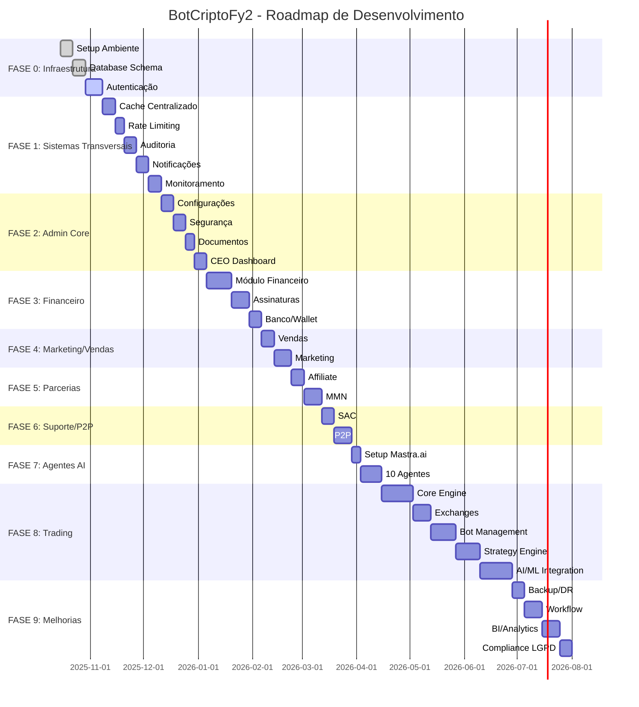
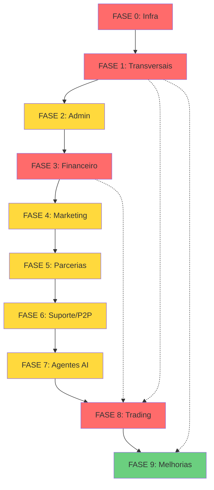
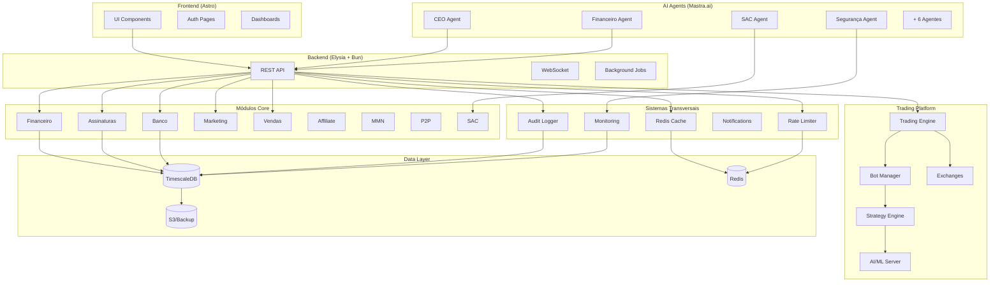
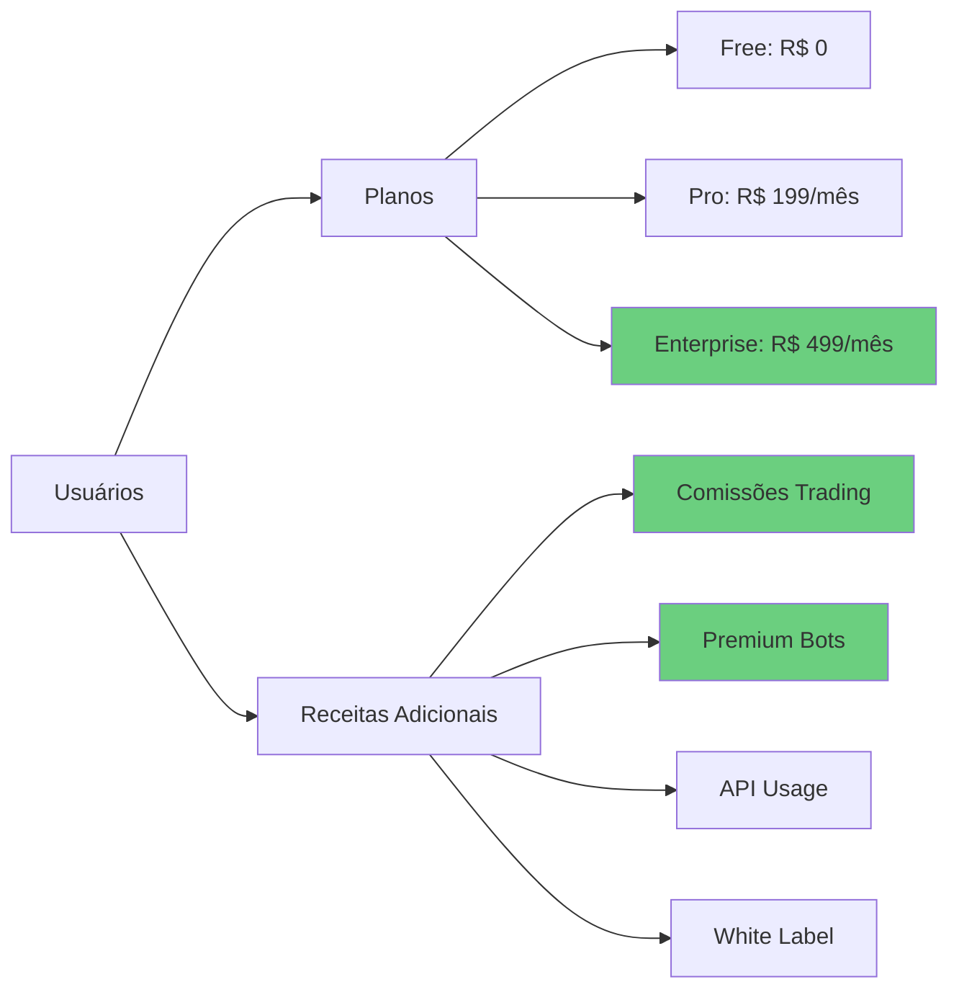

# Roadmap Visual - BotCriptoFy2

## 🎯 Visão Executiva

**Timeline Total**: 28-32 semanas (~7 meses)
**Equipe Estimada**: 4-6 desenvolvedores
**MVP**: Semana 16 (FASE 6 completa)
**Lançamento**: Semana 32 (FASE 9 completa)

---

## 📅 TIMELINE MACRO



---

## 🗓️ CRONOGRAMA DETALHADO

### Q4 2025 (Outubro - Dezembro)

#### 🏗️ **Semanas 1-3**: FASE 0 - Infraestrutura
```
┌─────────────────────────────────────────────────┐
│ ✅ Setup Ambiente (S1)                          │
│ ✅ Database Schema (S2)                         │
│ 🔄 Autenticação Multi-tenancy (S3)             │
└─────────────────────────────────────────────────┘
```
**Entregável**: Ambiente completo + Auth funcional

---

#### 🚀 **Semanas 4-7**: FASE 1 - Sistemas Transversais
```
┌─────────────────────────────────────────────────┐
│ S4: Cache Centralizado                          │
│ S5: Rate Limiting Global                        │
│ S6: Auditoria Universal                         │
│ S7: Notificações + Monitoramento                │
└─────────────────────────────────────────────────┘
```
**Entregável**: Fundação técnica sólida

---

#### 🏢 **Semanas 8-11**: FASE 2 - Admin Core
```
┌─────────────────────────────────────────────────┐
│ S8:  Configurações Dinâmicas                    │
│ S9:  Segurança + Detecção Anomalias            │
│ S10: Documentos + Versionamento                 │
│ S11: CEO Dashboard                              │
└─────────────────────────────────────────────────┘
```
**Entregável**: Módulos administrativos completos

---

### Q1 2026 (Janeiro - Março)

#### 💰 **Semanas 12-15**: FASE 3 - Financeiro
```
┌─────────────────────────────────────────────────┐
│ S12-13: Financeiro + Stripe                     │
│ S14:    Assinaturas + Planos                    │
│ S15:    Banco + Wallet                          │
└─────────────────────────────────────────────────┘
```
**Entregável**: Sistema financeiro completo

---

#### 📈 **Semanas 16-17**: FASE 4 - Marketing/Vendas
```
┌─────────────────────────────────────────────────┐
│ S16: Vendas + Visitor Tracking                  │
│ S17: Marketing + Gamification                   │
└─────────────────────────────────────────────────┘
```
**Entregável**: Aquisição e conversão prontos

**🎉 MVP MILESTONE**: Sistema administrativo completo

---

#### 🤝 **Semanas 18-20**: FASE 5 - Parcerias
```
┌─────────────────────────────────────────────────┐
│ S18: Affiliate + Convites                       │
│ S19-20: MMN + Árvore Binária                    │
└─────────────────────────────────────────────────┘
```
**Entregável**: Sistema de parcerias funcionando

---

#### 🔄 **Semanas 21-22**: FASE 6 - Suporte/P2P
```
┌─────────────────────────────────────────────────┐
│ S21: SAC + Tickets                              │
│ S22: P2P Marketplace                            │
└─────────────────────────────────────────────────┘
```
**Entregável**: Suporte e P2P ativos

---

### Q2 2026 (Abril - Junho)

#### 🤖 **Semanas 23-24**: FASE 7 - Agentes AI
```
┌─────────────────────────────────────────────────┐
│ S23: Setup Mastra.ai + Ollama                   │
│ S24: 10 Agentes Departamentais                  │
└─────────────────────────────────────────────────┘
```
**Entregável**: 10 agentes autônomos operando

**🎉 PLATFORM MILESTONE**: Plataforma administrativa + AI completa

---

#### 📊 **Semanas 25-32**: FASE 8 - Trading Modules
```
┌─────────────────────────────────────────────────┐
│ S25-26-27: Core Trading Engine                  │
│ S28:       Exchanges Integration                │
│ S29-30:    Bot Management                       │
│ S31-32:    Strategy Engine                      │
│ S33-34-35: AI/ML Integration                    │
└─────────────────────────────────────────────────┘
```
**Entregável**: Plataforma de trading completa

**🎉 TRADING MILESTONE**: Trading bots ativos

---

### Q3 2026 (Julho)

#### 🔧 **Semanas 33-36**: FASE 9 - Melhorias
```
┌─────────────────────────────────────────────────┐
│ S33:    Backup/DR                               │
│ S34-35: Workflow + Orquestração                 │
│ S36:    BI/Analytics                            │
│ S37:    Compliance LGPD                         │
└─────────────────────────────────────────────────┘
```
**Entregável**: Sistema enterprise-grade

**🎉 LAUNCH MILESTONE**: Lançamento oficial

---

## 🎯 MILESTONES PRINCIPAIS

### 🏁 M1: Fundação (Semana 7)
- ✅ Infraestrutura completa
- ✅ Sistemas transversais ativos
- ✅ Auth multi-tenancy
- **Critério de Sucesso**: Ambiente pronto para desenvolvimento de features

### 🏁 M2: Admin MVP (Semana 15)
- ✅ Módulos administrativos completos
- ✅ Sistema financeiro + billing
- ✅ Banco e carteiras
- **Critério de Sucesso**: Plataforma administrável funcionando

### 🏁 M3: Platform Complete (Semana 24)
- ✅ Marketing, Vendas, Parcerias
- ✅ Suporte e P2P
- ✅ 10 Agentes AI ativos
- **Critério de Sucesso**: Plataforma completa (sem trading)

### 🏁 M4: Trading Live (Semana 35)
- ✅ Trading engine completo
- ✅ Bots e estratégias funcionando
- ✅ AI/ML integrado
- **Critério de Sucesso**: Traders operando bots reais

### 🏁 M5: Production Ready (Semana 37)
- ✅ Backup/DR implementado
- ✅ BI e analytics ativos
- ✅ 100% compliance LGPD
- **Critério de Sucesso**: Sistema enterprise-grade pronto

---

## 📊 MATRIZ DE DEPENDÊNCIAS



**Legenda**:
- 🔴 Vermelho: Crítico (bloqueante)
- 🟡 Amarelo: Importante
- 🟢 Verde: Melhorias

---

## 🎨 ARQUITETURA VISUAL



---

## 📈 EVOLUÇÃO DE FUNCIONALIDADES

### Semana 7: Fundação Técnica
```
[████████░░░░░░░░░░░░░░░░░░░░] 20%
✅ Infraestrutura
✅ Autenticação
✅ Cache + Rate Limiting
✅ Auditoria + Notificações
```

### Semana 15: Admin MVP
```
[████████████████░░░░░░░░░░░░] 50%
✅ Todos os módulos administrativos
✅ Sistema financeiro completo
✅ Billing + Stripe
✅ Banco e carteiras
```

### Semana 24: Platform Complete
```
[████████████████████████░░░░] 75%
✅ Marketing + Vendas
✅ Affiliate + MMN
✅ P2P + SAC
✅ 10 Agentes AI autônomos
```

### Semana 35: Trading Live
```
[████████████████████████████] 95%
✅ Trading engine completo
✅ Bots funcionando
✅ Estratégias + AI/ML
✅ Multi-exchanges
```

### Semana 37: Production Ready
```
[████████████████████████████] 100%
✅ Backup/DR
✅ BI/Analytics
✅ Compliance LGPD
✅ Launch! 🚀
```

---

## 💰 RECEITA PROJETADA

### Modelo de Monetização



### Projeção de Usuários

| Mês | Free | Pro | Enterprise | MRR |
|-----|------|-----|------------|-----|
| M1  | 100  | 10  | 1          | R$ 2.490 |
| M3  | 500  | 50  | 5          | R$ 12.450 |
| M6  | 2000 | 200 | 20         | R$ 49.800 |
| M12 | 10000| 1000| 100        | R$ 249.000 |

**ARR (Ano 1)**: ~R$ 3M
**ARR (Ano 3)**: ~R$ 15M (projetado)

---

## 🎯 KPIs POR FASE

### FASE 1-2: Fundação + Admin
- **Performance**: Response time < 100ms
- **Uptime**: > 99%
- **Coverage**: > 80%

### FASE 3-4: Financeiro + Marketing
- **Conversão**: > 5% (visitante → lead)
- **Churn**: < 10%
- **LTV/CAC**: > 3

### FASE 5-6: Parcerias + Suporte
- **Afiliados ativos**: > 100
- **Tickets resolvidos**: > 90% (24h)
- **CSAT**: > 4.5/5

### FASE 7-8: AI + Trading
- **Bots ativos**: > 500
- **Volume trading**: > R$ 1M/dia
- **Win rate médio**: > 55%

### FASE 9: Production
- **Backup success**: 100%
- **Compliance**: 100%
- **RTO**: < 1h

---

## 🚀 ESTRATÉGIA DE LANÇAMENTO

### Soft Launch (Semana 24)
```
Plataforma administrativa completa
↓
Alpha testing com 50 usuários internos
↓
Feedback e ajustes
```

### Beta Launch (Semana 32)
```
Trading platform completa
↓
Beta testing com 200 traders selecionados
↓
Ajustes e otimizações
```

### Public Launch (Semana 37)
```
Sistema production-ready
↓
Marketing campaign
↓
Onboarding em massa
```

---

## 📊 RECURSOS NECESSÁRIOS

### Equipe Core
- **2 Backend Devs** (Elysia, TypeScript, TimescaleDB)
- **1 Frontend Dev** (Astro, React, Tailwind)
- **1 DevOps** (Docker, K8s, CI/CD)
- **1 QA Engineer** (Testes, automação)
- **1 Product Owner** (Roadmap, priorização)

### Equipe Opcional
- **1 ML Engineer** (para FASE 8 - AI/ML)
- **1 Security Specialist** (auditoria contínua)
- **1 UX Designer** (interfaces)

### Infraestrutura
- **Development**: Docker local
- **Staging**: Cloud (AWS/GCP)
- **Production**: Multi-region cloud
- **Backup**: S3 + backup offsite

**Custo Estimado**:
- Desenvolvimento: R$ 50-70k/mês
- Infraestrutura: R$ 5-10k/mês
- **Total Ano 1**: ~R$ 500-700k

**ROI Esperado**: 300-500% (3 anos)

---

## ✅ PRÓXIMOS PASSOS IMEDIATOS

### Semana Atual
- [ ] Aprovar roadmap com stakeholders
- [ ] Formar equipe core
- [ ] Setup de ferramentas (Jira, GitHub, CI/CD)
- [ ] Kickoff meeting

### Próxima Semana
- [ ] Iniciar FASE 0.1 (Setup Ambiente)
- [ ] Configurar repositórios
- [ ] Setup Docker compose
- [ ] Primeira daily standup

### Próximo Mês
- [ ] Completar FASE 0 (Infraestrutura)
- [ ] Iniciar FASE 1 (Sistemas Transversais)
- [ ] Primeira sprint review
- [ ] Ajustar velocidade da equipe

---

**Data de Criação**: 2025-10-15
**Versão**: 1.0.0
**Responsável**: Agente-CTO
**Status**: 📋 Planejamento Completo

**Última Atualização**: 2025-10-15

