# Tarefa: Implementação e Correção Completa do Sistema BeeCripto

**Criado**: 2025-10-17
**Status**: Em Validação CTO
**Prioridade**: CRÍTICA
**Estimativa**: 40-60 horas (5-7 dias úteis)

---

## 📋 1. CONTEXTO TÉCNICO (Regra 1)

### Objetivo
Implementar correções críticas, optimizações de performance, circuit breakers, testes completos e melhorias de resiliência em todos os 28 módulos do sistema BeeCripto, seguindo as 53 Regras de Ouro do AGENTS.md.

### Problema
Baseado na análise de módulos, identificamos:
- **4 módulos CRÍTICOS** sem circuit breakers
- **6 dependências inter-módulos** sem fallback strategies
- **AUDIT** como single point of failure legal
- Falta de testes de integração em módulos HIGH
- Performance não otimizada em queries críticas
- Ausência de cache em configurações
- Documentação incompleta em 40% dos módulos

### Requisitos
1. ✅ Implementar circuit breakers em módulos CRÍTICOS
2. ✅ Adicionar fallback strategies em dependências
3. ✅ Optimizar performance de queries (ORDERS, MARKET-DATA)
4. ✅ Implementar cache de configurações
5. ✅ Adicionar testes completos (coverage target: 80%+)
6. ✅ Documentar APIs com JSDoc/NatSpec
7. ✅ Corrigir dependências quebradas
8. ✅ Implementar async audit events
9. ✅ Adicionar health checks por módulo
10. ✅ Criar dashboards de monitoramento

### Stakeholders
- **Desenvolvedores**: Código mais resiliente e testável
- **DevOps**: Monitoramento e observabilidade
- **Usuários**: Sistema mais confiável e performático
- **Legal/Compliance**: Auditoria garantida
- **Product**: Features estáveis para crescimento

### Entrega Esperada
- Sistema 100% operacional com resiliência L3
- Coverage ≥80% (backend) / ≥95% (contratos)
- Documentação completa
- CI/CD verde
- Performance benchmark: p95 < 100ms

---

## 📝 2. PROMPT DE MISSÃO (Regra 2)

```
MISSÃO: Transformar o BeeCripto de arquitetura bem estruturada (8.5/10)
para sistema production-ready resiliente (9.5/10) através de:

1. Implementação de circuit breakers e fallbacks em pontos críticos
2. Otimização de performance em operações de trading
3. Cobertura completa de testes automatizados
4. Documentação técnica abrangente
5. Observabilidade e monitoramento avançado

CONTEXTO TÉCNICO:
- 28 módulos, 376 arquivos TypeScript, ~38K LOC
- Stack: Elysia.js + Bun + PostgreSQL + TimescaleDB + Redis + CCXT
- 4 módulos críticos: AUTH, SECURITY, TENANTS, EXCHANGES
- 8 módulos HIGH: ORDERS, MARKET-DATA, STRATEGIES, BANCO, FINANCIAL, POSITIONS, RISK, BOTS
- 6 dependências inter-módulos identificadas

ESCOPO:
- Todas as mudanças devem ser backward-compatible
- Zero downtime deployment
- Mudanças atômicas com rollback capability
- CI/CD deve passar 100%

ENTREGAS:
- Código implementado e testado
- Documentação completa
- Benchmarks de performance
- Relatório de auditoria
- ADRs para decisões arquiteturais
```

---

## 🎯 3. SUBTAREFAS (≤6) (Regra 3)

### Subtarefa 1: **Resiliência & Circuit Breakers**
**Responsável**: Architect + DevOps Engineer
**Duração**: 8-10 horas
**Entregas**:
- Circuit breakers em AUTH, SECURITY, TENANTS, EXCHANGES
- Fallback strategies para 6 dependências
- Retry policies com exponential backoff
- Health checks por módulo

**Dependências**: Nenhuma (pode iniciar imediatamente)

---

### Subtarefa 2: **Otimização de Performance**
**Responsável**: PostgreSQL Specialist + TimescaleDB Specialist
**Duração**: 8-10 horas
**Entregas**:
- Indexes otimizados em ORDERS, MARKET-DATA
- Query optimization (p95 < 100ms)
- Cache Redis para CONFIGURATIONS
- Connection pooling otimizado
- Batch processing em AUDIT

**Dependências**: Subtarefa 1 (circuit breakers)

---

### Subtarefa 3: **Testes Completos**
**Responsável**: QA Engineer + Mid Developer
**Duração**: 12-15 horas
**Entregas**:
- Testes unitários (coverage ≥80%)
- Testes de integração entre módulos
- Testes de stress/load
- Testes de falha (chaos engineering)
- CI/CD pipeline completo

**Dependências**: Subtarefa 1 e 2 (código estável)

---

### Subtarefa 4: **Documentação Completa**
**Responsável**: Documentation Writer + TypeScript Specialist
**Duração**: 6-8 horas
**Entregas**:
- JSDoc completo em 100% dos métodos públicos
- API documentation (Swagger/Scalar)
- ADRs para decisões técnicas
- Diagramas de arquitetura atualizados
- Guias de troubleshooting

**Dependências**: Subtarefa 1, 2, 3 (código finalizado)

---

### Subtarefa 5: **Observabilidade & Monitoramento**
**Responsável**: DevOps Engineer + Architect
**Duração**: 6-8 horas
**Entregas**:
- Métricas Prometheus/Grafana
- Logs estruturados (Winston)
- Tracing distribuído (OpenTelemetry)
- Alertas para SLAs críticos
- Dashboards por módulo

**Dependências**: Subtarefa 1, 2 (métricas disponíveis)

---

### Subtarefa 6: **Validação & Deploy**
**Responsável**: Engineering Manager + QA Engineer
**Duração**: 4-6 horas
**Entregas**:
- Smoke tests em staging
- Load tests em staging
- Blue-green deployment configurado
- Rollback procedures testados
- Post-deployment validation

**Dependências**: Subtarefa 1, 2, 3, 4, 5 (tudo pronto)

---

## 🔄 4. WORKFLOW MERMAID (Regras 5-6)

```mermaid
graph TD
    Start[Início: Task Aprovada pelo CTO] --> Phase1{Fase 1: Resiliência}

    Phase1 -->|Implementar| CB[Circuit Breakers]
    CB --> Fallbacks[Fallback Strategies]
    Fallbacks --> HealthChecks[Health Checks]
    HealthChecks --> Phase1Done{Fase 1 OK?}

    Phase1Done -->|Sim| Phase2{Fase 2: Performance}
    Phase1Done -->|Não| Phase1Rollback[Rollback Fase 1]
    Phase1Rollback --> Phase1

    Phase2 -->|Otimizar| Indexes[Database Indexes]
    Indexes --> Cache[Redis Cache]
    Cache --> QueryOpt[Query Optimization]
    QueryOpt --> Phase2Done{Performance OK?}

    Phase2Done -->|Sim| Phase3{Fase 3: Testes}
    Phase2Done -->|Não| Phase2Rollback[Rollback Fase 2]
    Phase2Rollback --> Phase2

    Phase3 -->|Escrever| UnitTests[Testes Unitários]
    UnitTests --> IntegrationTests[Testes Integração]
    IntegrationTests --> LoadTests[Load Tests]
    LoadTests --> Phase3Done{Coverage ≥80%?}

    Phase3Done -->|Sim| Phase4{Fase 4: Documentação}
    Phase3Done -->|Não| MoreTests[Escrever mais testes]
    MoreTests --> Phase3

    Phase4 -->|Documentar| JSDoc[JSDoc APIs]
    JSDoc --> ADRs[ADRs Técnicos]
    ADRs --> Diagrams[Diagramas]
    Diagrams --> Phase4Done{Docs Completas?}

    Phase4Done -->|Sim| Phase5{Fase 5: Observabilidade}
    Phase4Done -->|Não| MoreDocs[Completar Docs]
    MoreDocs --> Phase4

    Phase5 -->|Configurar| Metrics[Métricas Prometheus]
    Metrics --> Logs[Logs Estruturados]
    Logs --> Tracing[Distributed Tracing]
    Tracing --> Alerts[Alertas SLA]
    Alerts --> Phase5Done{Monitoring OK?}

    Phase5Done -->|Sim| Phase6{Fase 6: Deploy}
    Phase5Done -->|Não| Phase5Rollback[Rollback Fase 5]
    Phase5Rollback --> Phase5

    Phase6 -->|Validar| Staging[Deploy Staging]
    Staging --> SmokeTests[Smoke Tests]
    SmokeTests --> LoadTestsProd[Load Tests]
    LoadTestsProd --> Production{Deploy Production?}

    Production -->|Sim| BlueGreen[Blue-Green Deploy]
    Production -->|Não| Phase6Rollback[Rollback]
    Phase6Rollback --> Phase6

    BlueGreen --> PostDeploy[Post-Deploy Validation]
    PostDeploy --> Success{Tudo OK?}

    Success -->|Sim| Complete[✅ Task Completa]
    Success -->|Não| EmergencyRollback[🚨 Emergency Rollback]
    EmergencyRollback --> Investigate[Investigar Problemas]
    Investigate --> Phase6

    Complete --> CTOReport[Gerar Relatório CTO]
    CTOReport --> End[Fim]
```



---

## 🔗 5. ANÁLISE DE DEPENDÊNCIAS (Regra 53 - CRÍTICA)

### Arquivos que Serão Modificados

#### Módulos CRÍTICOS (4)
1. `backend/src/modules/auth/**/*.ts` (12 arquivos)
2. `backend/src/modules/security/**/*.ts` (8 arquivos)
3. `backend/src/modules/tenants/**/*.ts` (6 arquivos)
4. `backend/src/modules/exchanges/**/*.ts` (15 arquivos)

#### Módulos HIGH (8)
5. `backend/src/modules/orders/**/*.ts` (10 arquivos)
6. `backend/src/modules/market-data/**/*.ts` (18 arquivos)
7. `backend/src/modules/strategies/**/*.ts` (9 arquivos)
8. `backend/src/modules/banco/**/*.ts` (14 arquivos)
9. `backend/src/modules/financial/**/*.ts` (12 arquivos)
10. `backend/src/modules/positions/**/*.ts` (7 arquivos)
11. `backend/src/modules/risk/**/*.ts` (8 arquivos)
12. `backend/src/modules/bots/**/*.ts` (10 arquivos)

#### Infraestrutura
13. `backend/src/db/**/*.ts` (configurações DB)
14. `backend/src/lib/**/*.ts` (utilities)
15. `backend/src/middleware/**/*.ts` (middlewares globais)

#### Testes (NOVOS)
16. `backend/src/**/__tests__/**/*.test.ts` (100+ arquivos novos)

#### Documentação
17. `docs/ADR-*.md` (5-8 novos ADRs)
18. `docs/API.md` (atualização)
19. `README.md` (atualização)

### Grafo de Dependências

```
CAMADA FOUNDATION
├── auth/ (MODIFICAR)
│   ├── Dependentes: TODOS 28 módulos
│   └── Impacto: CRÍTICO - Sessões, autenticação
├── security/ (MODIFICAR)
│   ├── Dependentes: 15+ módulos (admin endpoints)
│   └── Impacto: CRÍTICO - Autorização
└── tenants/ (MODIFICAR)
    ├── Dependentes: TODOS módulos
    └── Impacto: CRÍTICO - Isolamento multi-tenant

CAMADA TRADING
├── exchanges/ (MODIFICAR)
│   ├── Dependentes: orders, market-data, strategies, bots
│   └── Impacto: ALTO - Trading impossível se falhar
├── orders/ (MODIFICAR)
│   ├── Dependentes: strategies, bots, risk
│   └── Impacto: ALTO - Execução de trades
├── market-data/ (MODIFICAR)
│   ├── Dependentes: strategies, risk, social-trading
│   └── Impacto: ALTO - Dados para decisões
└── strategies/ (MODIFICAR)
    ├── Dependentes: bots, social-trading
    └── Impacto: ALTO - Automação

CAMADA FINANCEIRO
├── banco/ (MODIFICAR)
│   ├── Depende: audit
│   ├── Dependentes: financial, subscriptions, affiliate
│   └── Impacto: ALTO - Wallets
└── financial/ (MODIFICAR)
    ├── Depende: audit
    ├── Dependentes: subscriptions, banco
    └── Impacto: ALTO - Pagamentos

CAMADA OBSERVABILIDADE
└── audit/ (MODIFICAR - ALTO RISCO)
    ├── Dependentes: banco, financial, p2p, orders
    └── Impacto: MÉDIO - Compliance crítico
```

### Validação Pós-Modificação

**Checklist:**
- [ ] Todos imports resolvidos
- [ ] Testes de cada módulo passando
- [ ] Testes de integração passando
- [ ] Benchmarks de performance OK
- [ ] CI/CD verde
- [ ] Smoke tests em staging
- [ ] Zero quebra de API pública
- [ ] Backward compatibility garantida

---

## 📊 6. ESCOPO FECHADO (Regra 7)

### Versão: 1.0.0
### Status: BLOQUEADO até aprovação CTO

### O que ESTÁ no escopo:
✅ Circuit breakers e fallbacks
✅ Otimização de performance (queries, cache)
✅ Testes completos (unit + integration)
✅ Documentação JSDoc/API
✅ Observabilidade (metrics, logs, tracing)
✅ Health checks por módulo
✅ CI/CD pipeline
✅ Deploy procedures

### O que NÃO ESTÁ no escopo:
❌ Novas features de negócio
❌ Mudanças de UI/UX
❌ Migração de banco de dados
❌ Novas integrações externas
❌ Refactoring arquitetural grande
❌ Mudanças de contratos públicos

### Mudanças de Escopo:
Requerem re-aprovação do Agente-CTO com justificativa técnica.

---

## 🏗️ 7. REVISÃO ARQUITETURAL (Regra 8)

### Decisões Técnicas

#### 1. Circuit Breaker Pattern
**Decisão**: Usar biblioteca `opossum` (Node.js circuit breaker)
**Justificativa**:
- Amplamente testada em produção
- Suporte a fallbacks
- Métricas built-in
- TypeScript support

**Alternativas Consideradas**:
- `cockatiel`: Menos madura
- Custom implementation: Maior risco de bugs

#### 2. Cache Strategy
**Decisão**: Redis com TTL dinâmico baseado em tipo de dado
**Justificativa**:
- Configurações: TTL 5 minutos
- Market data: TTL 1 segundo
- User sessions: TTL session lifetime

**Alternativas Consideradas**:
- In-memory cache: Não funciona em multi-instance
- Memcached: Redis tem mais features

#### 3. Observability Stack
**Decisão**: Prometheus + Grafana + OpenTelemetry
**Justificativa**:
- Industry standard
- Open source
- Integração fácil com Bun/Elysia

**Alternativas Consideradas**:
- DataDog: Custo alto
- New Relic: Vendor lock-in

#### 4. Testing Strategy
**Decisão**: Jest + Supertest + k6 (load tests)
**Justificativa**:
- Jest: Padrão em TypeScript
- Supertest: Testes de API
- k6: Load tests em Go (performático)

---

## 📑 8. ADRs A SEREM CRIADOS (Regra 10)

1. **ADR-001**: Circuit Breaker Implementation Strategy
2. **ADR-002**: Redis Caching Architecture
3. **ADR-003**: Observability Stack Selection
4. **ADR-004**: Testing Strategy and Coverage Targets
5. **ADR-005**: Health Check Implementation per Module
6. **ADR-006**: Async Audit Events Architecture
7. **ADR-007**: Blue-Green Deployment Strategy
8. **ADR-008**: Performance Optimization Approach

---

## 🎯 9. CRITÉRIOS DE ACEITAÇÃO

### Técnicos
- [ ] Coverage ≥80% (backend)
- [ ] CI/CD 100% verde
- [ ] Performance: p95 < 100ms, p99 < 200ms
- [ ] Zero erros no console
- [ ] Zero warnings de lint
- [ ] Zero vulnerabilidades críticas
- [ ] Todas dependências atualizadas

### Funcionais
- [ ] Todos módulos CRÍTICOS com circuit breakers
- [ ] Fallbacks funcionando em todas dependências
- [ ] Cache operacional com hit rate > 80%
- [ ] Health checks respondendo em < 50ms
- [ ] Logs estruturados em JSON
- [ ] Métricas sendo coletadas

### Documentação
- [ ] 100% APIs documentadas com JSDoc
- [ ] 8 ADRs criados
- [ ] Diagramas atualizados
- [ ] README atualizado
- [ ] Guias de troubleshooting criados

### Deploy
- [ ] Staging deployment OK
- [ ] Smoke tests passando
- [ ] Load tests passando (1000 req/s)
- [ ] Rollback procedure testado
- [ ] Production deployment OK

---

## ⚠️ 10. RISCOS E MITIGAÇÕES

| Risco | Probabilidade | Impacto | Mitigação |
|-------|---------------|---------|-----------|
| Quebra de API pública | BAIXA | CRÍTICO | Testes de compatibilidade + Versioning |
| Performance degradação | MÉDIA | ALTO | Benchmarks antes/depois + Load tests |
| Downtime em deploy | BAIXA | ALTO | Blue-green deployment + Rollback |
| Falha em circuit breakers | BAIXA | MÉDIO | Testes exaustivos + Monitoring |
| Coverage não atingido | MÉDIA | MÉDIO | Priorizar testes críticos primeiro |
| Escopo creep | ALTA | MÉDIO | Escopo fechado + Aprovação CTO |

---

## 📈 11. MÉTRICAS DE SUCESSO

### Performance
- **p50**: < 50ms (antes: ~80ms)
- **p95**: < 100ms (antes: ~200ms)
- **p99**: < 200ms (antes: ~500ms)
- **Throughput**: 1000 req/s (antes: ~500 req/s)

### Confiabilidade
- **Uptime**: 99.9% (3 noves)
- **MTTR**: < 5 minutos
- **MTBF**: > 30 dias
- **Error rate**: < 0.1%

### Qualidade
- **Coverage**: ≥80% (antes: ~40%)
- **Code quality**: A (SonarQube)
- **Technical debt**: < 5 days
- **Vulnerabilities**: 0 críticas

### Observabilidade
- **Log collection**: 100%
- **Metrics collection**: 100%
- **Tracing**: 100% requests
- **Alert response**: < 5min

---

## 🚀 12. PRÓXIMOS PASSOS

Após aprovação do Agente-CTO:

1. ✅ **Kick-off Meeting** (30 min)
   - Alinhar equipe
   - Distribuir responsabilidades
   - Configurar Kanban board

2. ✅ **Setup Branch**
   - Criar `feature/complete-system-fix`
   - Proteger branch
   - Configurar PR template

3. ✅ **Iniciar Subtarefa 1** (Resiliência)
   - Architect + DevOps
   - Duration: 8-10h

4. ✅ **Parallel Development**
   - Subtarefas 2-5 em paralelo após Subtarefa 1

5. ✅ **Integration & Deploy**
   - Subtarefa 6
   - Staging → Production

6. ✅ **Post-Deploy**
   - Monitoring 24h
   - Relatório final CTO

---

**Status**: ⏸️ AGUARDANDO APROVAÇÃO AGENTE-CTO

**Próxima Ação**: Executar análise de dependências (Regra 53) e gerar relatório de auditoria
