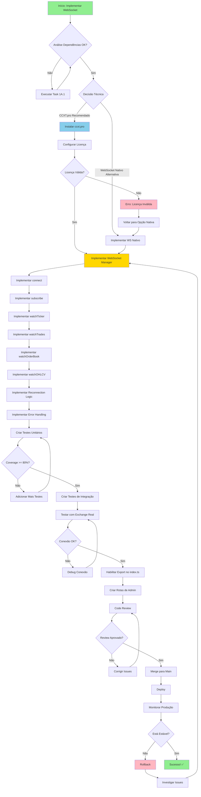
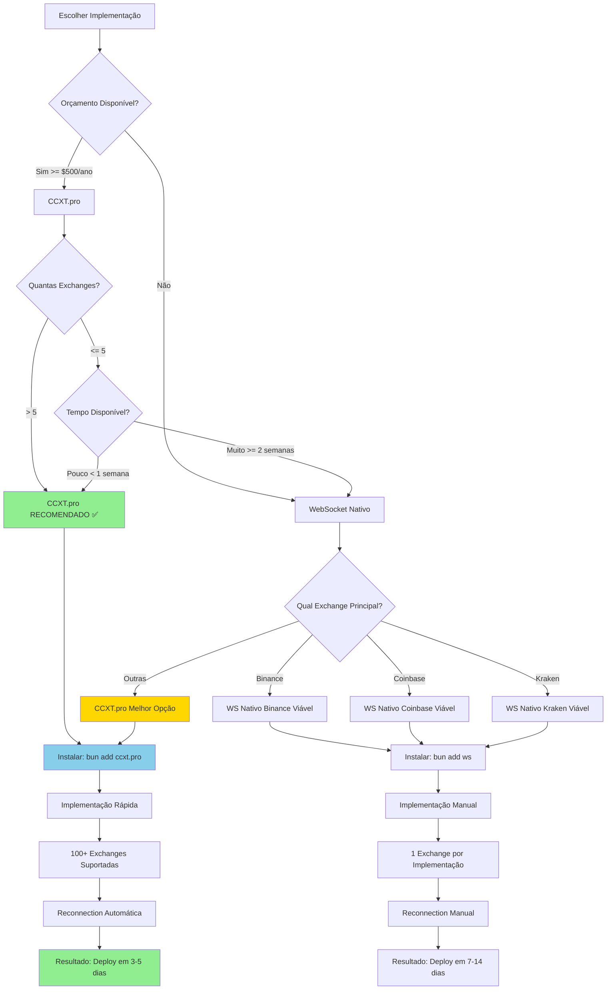
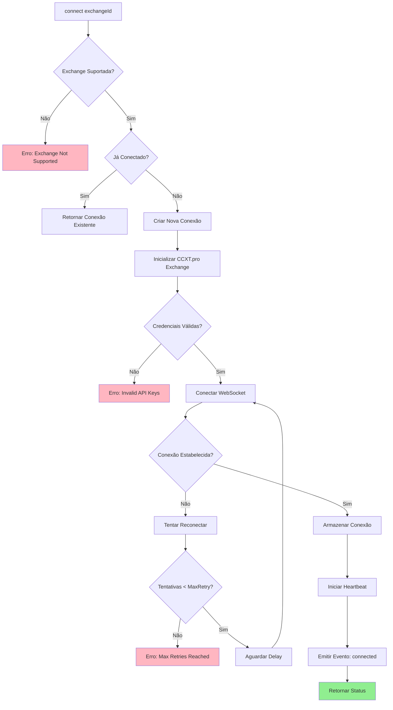
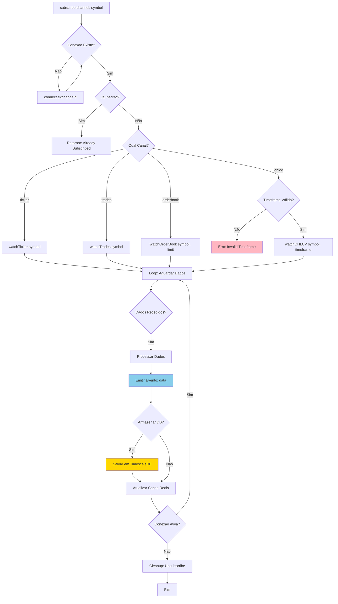
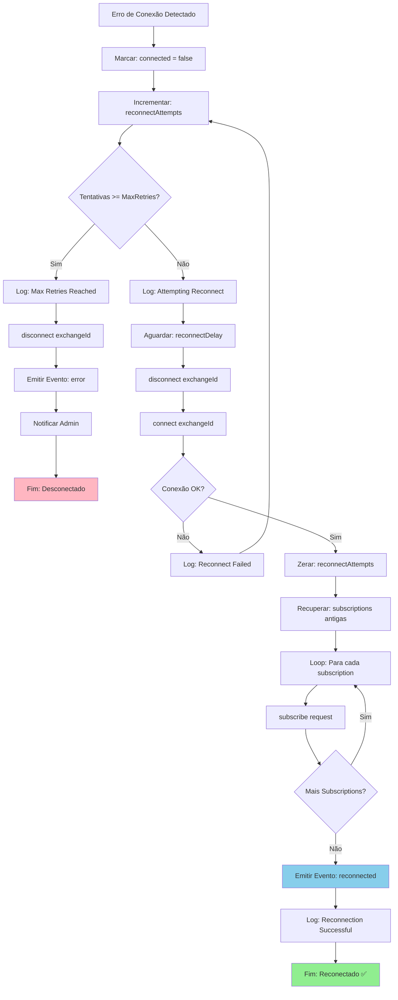
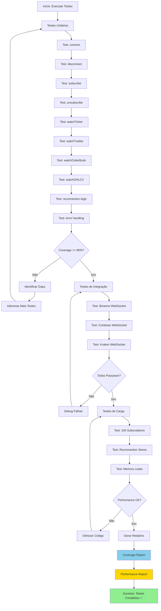
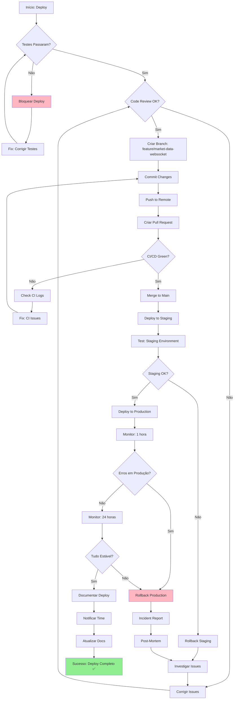
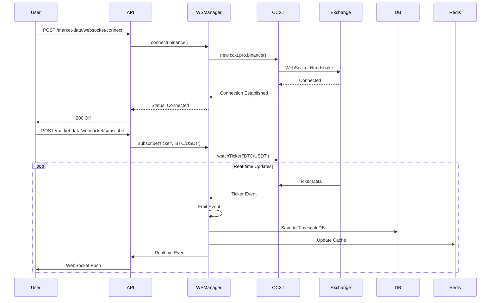
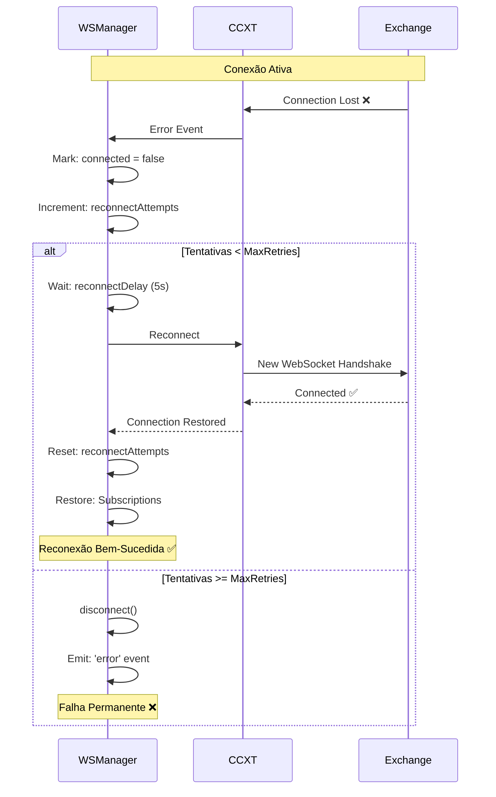

# Workflow de Implementação: WebSocket Manager

**Task**: 1A.3 - Implementar WebSocket Manager com ccxt.pro
**Módulo**: market-data
**Protocolo**: AGENTS.md Regras 5-6 (Workflow Mermaid)
**Data**: 2025-10-17

---

## 🎯 OBJETIVO

Implementar WebSocket real-time para market-data usando ccxt.pro, permitindo streaming de:
- Tickers (preço atual)
- Trades (negociações)
- OrderBook (livro de ofertas)
- OHLCV (candles em tempo real)

---

## 📋 WORKFLOW PRINCIPAL



---

## 🔀 WORKFLOW DE DECISÃO TÉCNICA



---

## 🔌 WORKFLOW DE CONEXÃO



---

## 📡 WORKFLOW DE SUBSCRIPTION



---

## 🔄 WORKFLOW DE RECONNECTION



---

## 🧪 WORKFLOW DE TESTES



---

## 🚀 WORKFLOW DE DEPLOY



---

## 🎯 CASOS DE USO DETALHADOS

### Caso 1: Conectar e Subscrever ao Ticker



### Caso 2: Reconexão Automática



---

## 📝 CHECKLIST DE IMPLEMENTAÇÃO

### Fase 1: Preparação
- [x] ✅ Análise de dependências (Task 1A.1)
- [ ] ⏳ Workflow Mermaid criado (Task 1A.2 - este doc)
- [ ] ⏳ Decisão: CCXT.pro vs Nativo
- [ ] ⏳ Branch criada: `feature/market-data-websocket`
- [ ] ⏳ Install ccxt.pro: `bun add ccxt.pro`

### Fase 2: Implementação Core
- [ ] ⏳ Implementar `connect(exchangeId)`
- [ ] ⏳ Implementar `disconnect(exchangeId)`
- [ ] ⏳ Implementar `subscribe(request)`
- [ ] ⏳ Implementar `unsubscribe(request)`
- [ ] ⏳ Implementar `getStatus(exchangeId)`

### Fase 3: Implementação de Canais
- [ ] ⏳ Implementar `watchTicker(connection, symbol)`
- [ ] ⏳ Implementar `watchTrades(connection, symbol)`
- [ ] ⏳ Implementar `watchOrderBook(connection, symbol, limit)`
- [ ] ⏳ Implementar `watchOHLCV(connection, symbol, timeframe)`

### Fase 4: Resilience
- [ ] ⏳ Implementar reconnection logic
- [ ] ⏳ Implementar error handling
- [ ] ⏳ Implementar heartbeat/ping-pong
- [ ] ⏳ Implementar cleanup/graceful shutdown

### Fase 5: Integração
- [ ] ⏳ Integrar com TimescaleDB (storage)
- [ ] ⏳ Integrar com Redis (cache)
- [ ] ⏳ Criar eventos para pub/sub
- [ ] ⏳ Habilitar export no index.ts

### Fase 6: Testes
- [ ] ⏳ Testes unitários (≥80% coverage)
- [ ] ⏳ Testes de integração
- [ ] ⏳ Testes de carga
- [ ] ⏳ Testes de reconnection

### Fase 7: Validação
- [ ] ⏳ TypeScript compila
- [ ] ⏳ ESLint passa
- [ ] ⏳ Testes passam
- [ ] ⏳ Code review aprovado

### Fase 8: Deploy
- [ ] ⏳ Merge para main
- [ ] ⏳ Deploy para staging
- [ ] ⏳ Deploy para produção
- [ ] ⏳ Monitorar 24h

---

## ⚡ COMANDOS ÚTEIS

```bash
# Instalar ccxt.pro
bun add ccxt.pro

# Testar conexão
bun run src/modules/market-data/websocket/test-connection.ts

# Executar testes
bun test src/modules/market-data

# Coverage report
bun test --coverage src/modules/market-data

# Lint
bun run lint

# Type check
bun run typecheck

# Dev server
bun run dev

# Monitorar logs em produção
tail -f logs/websocket.log | grep "market-data"
```

---

## 📚 REFERÊNCIAS

### CCXT.pro Documentation
- https://docs.ccxt.com/en/latest/manual.html#ccxt-pro
- https://github.com/ccxt/ccxt/tree/master/examples/js

### Exchange WebSocket APIs
- Binance: https://binance-docs.github.io/apidocs/spot/en/#websocket-market-streams
- Coinbase: https://docs.cloud.coinbase.com/exchange/docs/websocket-overview
- Kraken: https://docs.kraken.com/websockets/

---

**Workflow criado conforme**: AGENTS.md Regras 5-6
**Validade**: Válido até implementação completa
**Próxima Task**: 1A.3 - Implementar WebSocket Manager
**Data**: 2025-10-17
