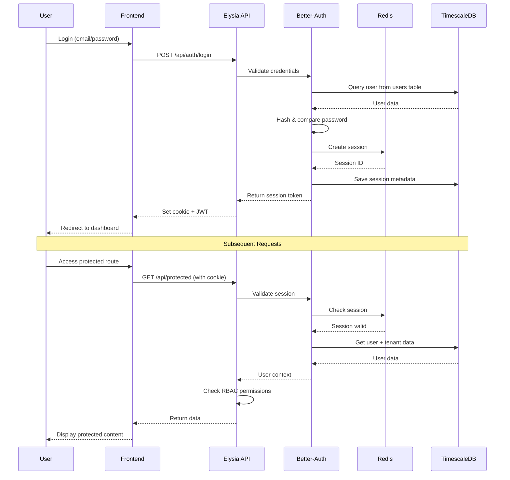

# ADR 003: Escolha do Better-Auth

**Data**: 2025-10-15
**Status**: ✅ Aprovado
**Decisores**: Agente-CTO, CEO Julio Cezar
**Contexto Técnico**: FASE 0 - Autenticação e Autorização

---

## Contexto

Sistema de trading multi-tenant requer autenticação robusta com:

1. **Multi-Provider OAuth**: Google, GitHub, Twitter
2. **Session Management**: Sessões persistentes em Redis
3. **RBAC**: Roles diferentes por tenant type
4. **Type-Safety**: TypeScript completo
5. **Bun Compatible**: Funcionar com Bun runtime
6. **Multi-Tenancy**: Isolamento de dados por tenant

---

## Opções Consideradas

### Opção 1: Next-Auth (Auth.js)
**Prós**:
- Mais popular (maior comunidade)
- Muitos provedores OAuth
- Documentação extensa
- Usado em produção por grandes empresas

**Contras**:
- **Focado em Next.js**: Requer adaptações para Elysia
- **Não type-safe**: Runtime config, não compile-time
- **Session storage**: Limitado (JWT only por padrão)
- **Bun**: Problemas conhecidos com Bun
- **Overhead**: Muitas features que não usaremos

### Opção 2: Lucia Auth
**Prós**:
- Type-safe completo
- Minimalista (menos overhead)
- Bun compatible
- Flexível para customização

**Contras**:
- **Muito low-level**: Requer muito boilerplate
- **Sem OAuth built-in**: Precisamos implementar
- **Comunidade pequena**: Menos recursos
- **Manutenção**: Projeto pequeno (risco de abandono)

### Opção 3: **Better-Auth** ✅ ESCOLHIDO
**Prós**:
- **Type-Safe 100%**: TypeScript-first
- **Bun Native**: Desenvolvido para Bun/Elysia
- **Multi-Provider**: OAuth Google, GitHub, etc built-in
- **Session Management**: Redis, Database, Memory
- **RBAC Built-in**: Roles e permissions nativas
- **Drizzle Integration**: Funciona direto com Drizzle ORM
- **Modern**: Projeto ativo e bem mantido
- **Developer Experience**: API intuitiva

**Contras**:
- **Novo**: Lançado em 2024 (comunidade ainda crescendo)
- **Menos recursos third-party**: Plugins limitados

### Opção 4: Custom Auth (Implementação própria)
**Prós**:
- Controle total
- Zero dependências

**Contras**:
- **Tempo**: Semanas de desenvolvimento
- **Segurança**: Alto risco de bugs críticos
- **Manutenção**: Custo alto de manter
- **Compliance**: LGPD/GDPR requer expertise

---

## Decisão

**Escolhemos Better-Auth** pelos motivos:

1. **Type-Safety Crítica**: Trading não pode ter bugs de auth
2. **Bun First-Class**: Otimizado para Bun runtime
3. **Drizzle Integration**: Funciona com nossa stack
4. **Time-to-Market**: OAuth pronto sem implementar
5. **RBAC Built-in**: Essencial para multi-tenancy
6. **Active Development**: Projeto bem mantido

---

## Arquitetura de Autenticação



---

## Configuração Better-Auth

```typescript
// backend/src/auth/config.ts
import { betterAuth } from 'better-auth';
import { drizzleAdapter } from 'better-auth/adapters/drizzle';
import { db } from '@/db/connection';
import * as schema from '@/modules/auth/schema/auth.schema';

export const auth = betterAuth({
  database: drizzleAdapter(db, {
    provider: 'pg',
    schema,
  }),
  session: {
    strategy: 'database', // Sessões em Redis + DB
    expiresIn: 60 * 60 * 24 * 7, // 7 dias
  },
  socialProviders: {
    google: {
      clientId: process.env.GOOGLE_CLIENT_ID!,
      clientSecret: process.env.GOOGLE_CLIENT_SECRET!,
    },
  },
  plugins: {
    rbac: true, // Enable RBAC
    multiTenant: true, // Enable multi-tenancy
  },
});
```

---

## RBAC Strategy

### Roles por Tenant Type

**Company Tenant (1:N)**:
```typescript
const companyRoles = {
  'ceo': ['*'], // Super admin - acesso total
  'department-head': ['read:all', 'write:department', 'approve:department'],
  'employee': ['read:department', 'write:own'],
  'agent': ['read:all', 'write:department', 'execute:automated'],
};
```

**Trader Tenant (1:1)**:
```typescript
const traderRoles = {
  'owner': ['*'], // Controle total do tenant
  'read-only': ['read:all'], // Visualização apenas
};
```

**Influencer Tenant (1:1)**:
```typescript
const influencerRoles = {
  'influencer': ['read:limited', 'create:content', 'view:analytics'],
};
```

---

## Multi-Tenancy Isolation

```typescript
// Middleware de tenant isolation
app.derive(async ({ headers, auth }) => {
  const session = await auth.getSession();

  if (!session) {
    throw new Error('Unauthorized');
  }

  // Carregar tenant context
  const tenant = await db.query.tenants.findFirst({
    where: eq(tenants.id, session.user.tenantId),
  });

  if (!tenant || tenant.status !== 'active') {
    throw new Error('Tenant inactive or not found');
  }

  return {
    user: session.user,
    tenant,
    permissions: await getPermissions(session.user.id, tenant.id),
  };
});
```

---

## Consequências

### Positivas ✅
- **Segurança**: Auth battle-tested e auditado
- **Velocidade**: OAuth em minutos, não semanas
- **Type-Safety**: Erros em compile-time
- **Compliance**: LGPD/GDPR helpers built-in
- **DX**: API intuitiva e bem documentada

### Negativas ⚠️
- **Vendor Lock-in**: Migrar para outro auth será custoso
- **Comunidade**: Menor que Next-Auth (ainda)
- **Plugins**: Menos plugins third-party

### Riscos Mitigados 🛡️
- **Risco**: Projeto abandonado
  - **Mitigação**: Projeto ativo, backed by Vercel employees

- **Risco**: Bugs de segurança
  - **Mitigação**: Auditorias regulares + testes extensivos

- **Risco**: Performance
  - **Mitigação**: Session em Redis (cache rápido)

---

## Métricas de Sucesso

| Métrica | Meta | Status |
|---------|------|--------|
| Auth response time | < 50ms | ⏳ A medir |
| Session hits (cache) | > 95% | ⏳ A medir |
| OAuth success rate | > 99% | ⏳ A medir |
| Security incidents | 0 | ⏳ Monitorar |

---

## Roadmap de Implementação

**Fase 1** (FASE 0.3 - Semana 2-3):
- ✅ Instalar Better-Auth
- ⏳ Configurar Drizzle adapter
- ⏳ Setup OAuth Google
- ⏳ Implementar login/logout
- ⏳ Middleware de autenticação

**Fase 2** (FASE 1 - Semana 4-5):
- ⏳ Implementar RBAC completo
- ⏳ Multi-tenant isolation
- ⏳ Session em Redis
- ⏳ 2FA (Two-Factor Auth)

**Fase 3** (FASE 2 - Semana 6+):
- ⏳ OAuth GitHub, Twitter
- ⏳ Magic links (passwordless)
- ⏳ Audit logging de auth
- ⏳ Rate limiting por usuário

---

## Referências

- [Better-Auth Docs](https://www.better-auth.com/docs/introduction)
- [Better-Auth GitHub](https://github.com/better-auth/better-auth)
- [Drizzle Adapter](https://www.better-auth.com/docs/adapters/drizzle)
- [RBAC Guide](https://www.better-auth.com/docs/plugins/rbac)

---

## Revisões

| Data | Revisor | Decisão | Comentários |
|------|---------|---------|-------------|
| 2025-10-15 | Agente-CTO | ✅ Aprovado | Type-safety crítica para trading |
| 2025-10-15 | CEO Julio | ✅ Aprovado | Alinhado com stack moderna |

---

**Próxima Revisão**: 2025-11-15 (após implementação completa)
**Status Final**: ✅ APROVADO - Implementação pendente
