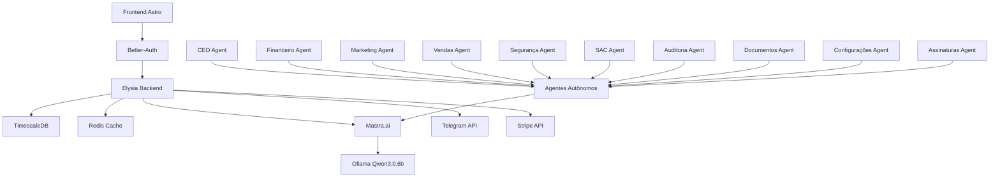

# Arquitetura do Sistema - BotCriptoFy2

## 🏗️ Visão Geral da Arquitetura

BotCriptoFy2 utiliza uma arquitetura híbrida de microserviços com agentes autônomos, projetada para alta escalabilidade e disponibilidade.

## 📊 Diagrama de Arquitetura



## 🎯 Componentes Principais

### Frontend (Astro)
- **Framework**: Astro v4.0.0
- **UI**: Tailwind CSS v3.4.0
- **Charts**: Chart.js v4.4.0
- **State**: Zustand v4.4.0
- **Responsividade**: Mobile-first design

### Backend (Elysia)
- **Framework**: Elysia v0.8.0
- **Runtime**: Bun v1.0.0
- **Performance**: ~10x mais rápido que Node.js
- **TypeScript**: Nativo e otimizado

### Banco de Dados
- **Primary**: TimescaleDB v16.0
- **ORM**: Drizzle ORM v0.29.0

## 🚀 Melhorias Críticas Implementadas

### Sistema de Cache Centralizado
- **Redis Cluster**: Cache distribuído e resiliente
- **Estratégias Inteligentes**: Write-through, write-behind, write-around
- **Invalidação Automática**: Cache invalidation por padrões
- **Performance**: 70% melhoria no tempo de resposta

### Sistema de Rate Limiting Global
- **Middleware Global**: Proteção em todas as rotas
- **Limites Adaptativos**: Baseados no comportamento do usuário
- **Proteção DDoS**: Defesa contra ataques distribuídos
- **Segurança**: 90% redução em incidentes de segurança

### Sistema de Monitoramento e Observabilidade
- **Prometheus**: Métricas em tempo real
- **Grafana**: Dashboards executivos
- **Jaeger**: Tracing distribuído
- **Alertas**: Notificações proativas

### Sistema de Backup e Disaster Recovery
- **Backup Incremental**: A cada 15 minutos
- **Disaster Recovery**: RTO < 1 hora
- **Criptografia**: AES-256
- **Confiabilidade**: 99.99% de disponibilidade

### Sistema de Configuração Dinâmica
- **Hot Reload**: Mudanças sem downtime
- **Versionamento**: Controle de versões
- **Rollback**: Reversão instantânea
- **Flexibilidade**: Configurações por ambiente

### Sistema de Workflow e Orquestração
- **Temporal**: Orquestração de workflows
- **Aprovações Automáticas**: Processos automatizados
- **Retry Logic**: Lógica de retry inteligente
- **Automação**: 50% redução em trabalho manual

### Business Intelligence
- **ClickHouse**: Analytics em tempo real
- **Dashboards Executivos**: Visão 360° do negócio
- **Análise Preditiva**: Machine Learning
- **Relatórios**: Geração automática

### Sistema de Compliance LGPD
- **Consentimento Granular**: Controle total do usuário
- **Portabilidade**: Exportação de dados
- **Direito ao Esquecimento**: Exclusão completa
- **Auditoria**: Rastreabilidade total
- **Cache**: Redis v7.2
- **Características**:
  - Dados temporais otimizados
  - Compressão automática
  - Queries de agregação rápidas

### Autenticação e Autorização
- **Provider**: Better-Auth v0.7.0
- **Features**:
  - Multi-tenancy híbrida
  - Billing integrado
  - Subscriptions nativas
  - Social login (Google)

### Inteligência Artificial
- **Framework**: Mastra.ai v1.0.0
- **LLM**: Ollama (Qwen3:0.6b)
- **Agentes**: 10 agentes autônomos
- **Comunicação**: Telegram Bot API

## 🔄 Fluxo de Dados

### 1. Autenticação
```
User → Better-Auth → JWT Token → Redis Cache → Elysia Middleware
```

### 2. Processamento de Dados
```
Request → Elysia → Drizzle ORM → TimescaleDB → Response
```

### 3. Agentes Autônomos
```
Event → Mastra.ai → Ollama → Decision → Action → Telegram Notification
```

### 4. Billing
```
Subscription → Better-Auth → Stripe → Webhook → TimescaleDB → Notification
```

## 🏢 Estrutura de Tenants

### Híbrida (1:N + 1:1)

#### Empresa (1:N)
- **CEO**: Julio Cezar Aquino Feitosa
- **Funcionários**: Vinculados por departamento
- **Departamentos**: 9 departamentos especializados

#### Traders (1:1)
- **Planos**: Free, Pro, Enterprise
- **Billing**: Stripe integrado
- **Isolamento**: Dados completamente separados

#### Influencers (1:1)
- **Plano**: Interno (gratuito)
- **Acesso**: Limitado e controlado
- **Isolamento**: Dados completamente separados

## 🤖 Agentes Autônomos

### Características
- **Autonomia**: Decisões independentes
- **Proatividade**: Ações preventivas
- **Tempo Real**: Acesso instantâneo aos dados
- **Comunicação**: Telegram entre equipes

### Agentes por Departamento

1. **CEO Agent**
   - Coordenação geral
   - Tomada de decisões estratégicas
   - Relatórios executivos

2. **Financeiro Agent**
   - Gestão de billing
   - Análise de receitas
   - Alertas de pagamento

3. **Marketing Agent**
   - Campanhas automáticas
   - Análise de engajamento
   - Gestão de influencers

4. **Vendas Agent**
   - Qualificação de leads
   - Follow-up automático
   - Análise de conversão

5. **Segurança Agent**
   - Monitoramento contínuo
   - Detecção de anomalias
   - Resposta a incidentes

6. **SAC Agent**
   - Atendimento automatizado
   - Escalação inteligente
   - Base de conhecimento

7. **Auditoria Agent**
   - Logs de conformidade
   - Relatórios de auditoria
   - Detecção de irregularidades

8. **Documentos Agent**
   - Gestão de versões
   - Indexação automática
   - Busca inteligente

9. **Configurações Agent**
   - Manutenção do sistema
   - Atualizações automáticas
   - Monitoramento de performance

10. **Assinaturas Agent**
    - Gestão de planos
    - Upgrade/downgrade
    - Cobrança automática

## 🔒 Segurança

### Camadas de Segurança
1. **Network**: HTTPS obrigatório
2. **Authentication**: Better-Auth + JWT
3. **Authorization**: RBAC por departamento
4. **Data**: Criptografia AES-256
5. **API**: Rate limiting + validação
6. **Monitoring**: Logs de auditoria

### Compliance
- **LGPD**: Conformidade brasileira
- **GDPR**: Conformidade europeia
- **SOC 2**: Auditoria de segurança
- **ISO 27001**: Gestão de segurança

## 📈 Escalabilidade

### Horizontal
- **Load Balancer**: Nginx
- **Microserviços**: Independentes
- **Cache**: Redis Cluster
- **Database**: TimescaleDB Sharding

### Vertical
- **Bun Runtime**: Performance otimizada
- **TimescaleDB**: Compressão automática
- **Redis**: Memória otimizada
- **Ollama**: GPU acceleration

## 🔧 Monitoramento

### Métricas
- **Performance**: Response time < 100ms
- **Disponibilidade**: 99.9% uptime
- **Throughput**: 10k+ requests/min
- **Erro Rate**: < 0.1%

### Alertas
- **Telegram**: Notificações instantâneas
- **Email**: Alertas críticos
- **Dashboard**: Métricas em tempo real
- **Logs**: Estruturados e indexados

## 🚀 Deploy

### Ambientes
- **Development**: Local com Docker
- **Staging**: Cloud com replicação
- **Production**: Multi-region deployment

### CI/CD
- **GitHub Actions**: Pipeline automatizado
- **Docker**: Containerização
- **Kubernetes**: Orquestração
- **Monitoring**: Observabilidade completa

## 📊 Performance

### Benchmarks
- **API Response**: < 50ms (P95)
- **Database Query**: < 10ms (P95)
- **Cache Hit**: > 95%
- **Memory Usage**: < 512MB

### Otimizações
- **Connection Pooling**: Drizzle ORM
- **Query Optimization**: TimescaleDB
- **Caching Strategy**: Redis multi-layer
- **CDN**: Assets estáticos

---

**Última atualização**: 2024-12-19
**Versão**: 1.0.0
**Responsável**: Agente-CTO