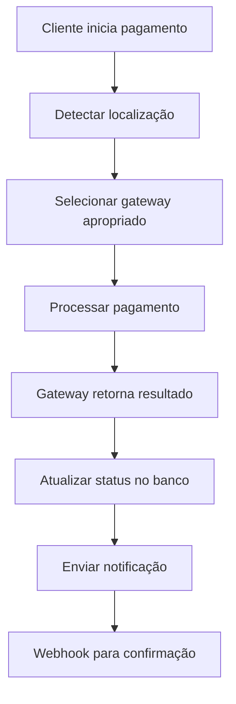

# Sistema de Pagamentos Multi-Gateway - BotCriptoFy2

## 💳 Visão Geral

Sistema de pagamentos robusto e flexível que suporta múltiplos gateways de pagamento com seleção automática baseada na localização do cliente e preferências de pagamento.

## 🌍 Estratégia de Gateways por Região

### **Brasil (Clientes Brasileiros)**
- **InfinityPay**: Gateway principal para PIX, cartões e boleto
- **Banco**: PIX direto e transferência bancária
- **Stripe**: Fallback para cartões internacionais

### **Internacional (Clientes Globais)**
- **Stripe**: Gateway principal para cartões e métodos internacionais
- **InfinityPay**: Fallback para clientes brasileiros no exterior

## 🏗️ Arquitetura do Sistema

### Componentes Principais
- **PaymentGatewayManager**: Gerenciador central de gateways
- **GatewaySelector**: Seleção automática de gateway
- **PaymentProcessor**: Processamento de pagamentos
- **WebhookHandler**: Processamento de webhooks
- **RefundManager**: Gerenciamento de reembolsos

### Fluxo de Pagamento


## 🗄️ Schema do Banco de Dados

### Tabelas de Pagamento

#### payment_gateways
```sql
CREATE TABLE payment_gateways (
  id UUID PRIMARY KEY DEFAULT gen_random_uuid(),
  name VARCHAR(100) NOT NULL,
  slug VARCHAR(50) UNIQUE NOT NULL,
  provider VARCHAR(50) NOT NULL, -- infinitypay, stripe, banco
  is_active BOOLEAN DEFAULT true,
  is_primary BOOLEAN DEFAULT false,
  supported_countries TEXT[] NOT NULL,
  supported_currencies TEXT[] NOT NULL,
  supported_methods JSONB NOT NULL,
  configuration JSONB NOT NULL,
  fees JSONB NOT NULL,
  webhook_url VARCHAR(500),
  created_at TIMESTAMP DEFAULT NOW(),
  updated_at TIMESTAMP DEFAULT NOW()
);
```

#### payment_transactions
```sql
CREATE TABLE payment_transactions (
  id UUID PRIMARY KEY DEFAULT gen_random_uuid(),
  tenant_id UUID NOT NULL REFERENCES tenants(id),
  user_id UUID NOT NULL REFERENCES users(id),
  gateway_id UUID NOT NULL REFERENCES payment_gateways(id),
  external_id VARCHAR(255) NOT NULL,
  amount DECIMAL(15,2) NOT NULL,
  currency VARCHAR(3) NOT NULL,
  payment_method VARCHAR(50) NOT NULL,
  status VARCHAR(20) NOT NULL, -- pending, processing, completed, failed, cancelled, refunded
  gateway_status VARCHAR(50),
  gateway_response JSONB,
  metadata JSONB DEFAULT '{}',
  processed_at TIMESTAMP,
  created_at TIMESTAMP DEFAULT NOW(),
  updated_at TIMESTAMP DEFAULT NOW(),
  UNIQUE(gateway_id, external_id)
);
```

#### payment_methods
```sql
CREATE TABLE payment_methods (
  id UUID PRIMARY KEY DEFAULT gen_random_uuid(),
  user_id UUID NOT NULL REFERENCES users(id),
  gateway_id UUID NOT NULL REFERENCES payment_gateways(id),
  external_id VARCHAR(255) NOT NULL,
  type VARCHAR(50) NOT NULL, -- card, pix, bank_transfer, boleto
  last_four VARCHAR(4),
  brand VARCHAR(50),
  expiry_month INTEGER,
  expiry_year INTEGER,
  is_default BOOLEAN DEFAULT false,
  is_active BOOLEAN DEFAULT true,
  metadata JSONB DEFAULT '{}',
  created_at TIMESTAMP DEFAULT NOW(),
  updated_at TIMESTAMP DEFAULT NOW()
);
```

#### payment_webhooks
```sql
CREATE TABLE payment_webhooks (
  id UUID PRIMARY KEY DEFAULT gen_random_uuid(),
  gateway_id UUID NOT NULL REFERENCES payment_gateways(id),
  external_id VARCHAR(255) NOT NULL,
  event_type VARCHAR(100) NOT NULL,
  payload JSONB NOT NULL,
  signature VARCHAR(500),
  processed BOOLEAN DEFAULT false,
  processed_at TIMESTAMP,
  error_message TEXT,
  created_at TIMESTAMP DEFAULT NOW()
);
```

#### payment_refunds
```sql
CREATE TABLE payment_refunds (
  id UUID PRIMARY KEY DEFAULT gen_random_uuid(),
  transaction_id UUID NOT NULL REFERENCES payment_transactions(id),
  external_id VARCHAR(255) NOT NULL,
  amount DECIMAL(15,2) NOT NULL,
  reason VARCHAR(100),
  status VARCHAR(20) NOT NULL, -- pending, completed, failed
  gateway_response JSONB,
  processed_at TIMESTAMP,
  created_at TIMESTAMP DEFAULT NOW()
);
```

## 🔧 Configuração dos Gateways

### 1. InfinityPay (Brasil)

```typescript
// backend/src/payments/gateways/infinitypay.config.ts
export const infinityPayConfig = {
  name: 'InfinityPay',
  slug: 'infinitypay',
  provider: 'infinitypay',
  isActive: true,
  isPrimary: true,
  supportedCountries: ['BR'],
  supportedCurrencies: ['BRL'],
  supportedMethods: {
    pix: {
      enabled: true,
      instant: true,
      fees: {
        fixed: 0.00,
        percentage: 0.99
      }
    },
    credit_card: {
      enabled: true,
      brands: ['visa', 'mastercard', 'elo', 'amex'],
      installments: {
        enabled: true,
        max: 12,
        fees: {
          1: 0.00,
          2: 2.99,
          3: 4.99,
          6: 7.99,
          12: 12.99
        }
      }
    },
    debit_card: {
      enabled: true,
      brands: ['visa', 'mastercard', 'elo'],
      fees: {
        fixed: 0.00,
        percentage: 1.99
      }
    },
    boleto: {
      enabled: true,
      due_days: 3,
      fees: {
        fixed: 2.90,
        percentage: 0.00
      }
    }
  },
  configuration: {
    apiKey: process.env.INFINITYPAY_API_KEY,
    secretKey: process.env.INFINITYPAY_SECRET_KEY,
    environment: process.env.INFINITYPAY_ENVIRONMENT, // sandbox, production
    webhookSecret: process.env.INFINITYPAY_WEBHOOK_SECRET,
    baseUrl: process.env.INFINITYPAY_BASE_URL
  }
};
```

### 2. Banco (PIX/Transferência)

```typescript
// backend/src/payments/gateways/banco.config.ts
export const bancoConfig = {
  name: 'Banco PIX',
  slug: 'banco',
  provider: 'banco',
  isActive: true,
  isPrimary: false,
  supportedCountries: ['BR'],
  supportedCurrencies: ['BRL'],
  supportedMethods: {
    pix: {
      enabled: true,
      instant: true,
      fees: {
        fixed: 0.00,
        percentage: 0.00
      }
    },
    bank_transfer: {
      enabled: true,
      banks: ['001', '033', '104', '237', '341', '356', '422', '756'],
      fees: {
        fixed: 0.00,
        percentage: 0.00
      }
    }
  },
  configuration: {
    clientId: process.env.BANCO_CLIENT_ID,
    clientSecret: process.env.BANCO_CLIENT_SECRET,
    environment: process.env.BANCO_ENVIRONMENT,
    webhookSecret: process.env.BANCO_WEBHOOK_SECRET,
    baseUrl: process.env.BANCO_BASE_URL,
    pixKey: process.env.BANCO_PIX_KEY,
    bankAccount: {
      bank: process.env.BANCO_BANK_CODE,
      agency: process.env.BANCO_AGENCY,
      account: process.env.BANCO_ACCOUNT,
      digit: process.env.BANCO_ACCOUNT_DIGIT
    }
  }
};
```

### 3. Stripe (Global)

```typescript
// backend/src/payments/gateways/stripe.config.ts
export const stripeConfig = {
  name: 'Stripe',
  slug: 'stripe',
  provider: 'stripe',
  isActive: true,
  isPrimary: false,
  supportedCountries: ['US', 'CA', 'GB', 'DE', 'FR', 'ES', 'IT', 'AU', 'JP', 'SG'],
  supportedCurrencies: ['USD', 'EUR', 'GBP', 'CAD', 'AUD', 'JPY', 'SGD'],
  supportedMethods: {
    credit_card: {
      enabled: true,
      brands: ['visa', 'mastercard', 'amex', 'discover', 'diners', 'jcb'],
      installments: {
        enabled: false
      }
    },
    debit_card: {
      enabled: true,
      brands: ['visa', 'mastercard'],
      fees: {
        fixed: 0.30,
        percentage: 1.4
      }
    },
    bank_transfer: {
      enabled: true,
      countries: ['US', 'CA', 'GB', 'DE', 'FR', 'ES', 'IT'],
      fees: {
        fixed: 0.80,
        percentage: 0.8
      }
    },
    digital_wallet: {
      enabled: true,
      providers: ['apple_pay', 'google_pay', 'paypal'],
      fees: {
        fixed: 0.00,
        percentage: 2.9
      }
    }
  },
  configuration: {
    secretKey: process.env.STRIPE_SECRET_KEY,
    publishableKey: process.env.STRIPE_PUBLISHABLE_KEY,
    webhookSecret: process.env.STRIPE_WEBHOOK_SECRET,
    environment: process.env.STRIPE_ENVIRONMENT, // test, live
    baseUrl: 'https://api.stripe.com/v1'
  }
};
```

## 🔄 Lógica de Seleção de Gateway

### Gateway Selector

```typescript
// backend/src/payments/gateway-selector.ts
import { PaymentGatewayManager } from './gateway-manager';
import { infinityPayConfig, bancoConfig, stripeConfig } from './gateways';

export class GatewaySelector {
  private gateways: PaymentGatewayManager[];

  constructor() {
    this.gateways = [
      new PaymentGatewayManager(infinityPayConfig),
      new PaymentGatewayManager(bancoConfig),
      new PaymentGatewayManager(stripeConfig)
    ];
  }

  async selectGateway(
    country: string,
    currency: string,
    paymentMethod: string,
    amount: number,
    userPreferences?: string[]
  ): Promise<PaymentGatewayManager> {
    // Filtrar gateways ativos
    const activeGateways = this.gateways.filter(g => g.isActive);

    // Filtrar por país
    const countryGateways = activeGateways.filter(g => 
      g.supportedCountries.includes(country)
    );

    // Filtrar por moeda
    const currencyGateways = countryGateways.filter(g => 
      g.supportedCurrencies.includes(currency)
    );

    // Filtrar por método de pagamento
    const methodGateways = currencyGateways.filter(g => 
      g.supportedMethods[paymentMethod]?.enabled
    );

    if (methodGateways.length === 0) {
      throw new Error(`No gateway available for ${paymentMethod} in ${country}`);
    }

    // Aplicar preferências do usuário
    if (userPreferences && userPreferences.length > 0) {
      const preferredGateways = methodGateways.filter(g => 
        userPreferences.includes(g.slug)
      );
      
      if (preferredGateways.length > 0) {
        return this.selectBestGateway(preferredGateways, amount);
      }
    }

    // Selecionar melhor gateway baseado em taxas e disponibilidade
    return this.selectBestGateway(methodGateways, amount);
  }

  private selectBestGateway(
    gateways: PaymentGatewayManager[],
    amount: number
  ): PaymentGatewayManager {
    // Priorizar gateway primário
    const primaryGateway = gateways.find(g => g.isPrimary);
    if (primaryGateway) {
      return primaryGateway;
    }

    // Calcular custo total para cada gateway
    const gatewayCosts = gateways.map(gateway => {
      const cost = this.calculateTotalCost(gateway, amount);
      return { gateway, cost };
    });

    // Ordenar por custo (menor primeiro)
    gatewayCosts.sort((a, b) => a.cost - b.cost);

    return gatewayCosts[0].gateway;
  }

  private calculateTotalCost(
    gateway: PaymentGatewayManager,
    amount: number
  ): number {
    // Implementar cálculo de custo baseado nas taxas do gateway
    const fees = gateway.fees;
    const fixedFee = fees.fixed || 0;
    const percentageFee = (fees.percentage || 0) / 100;
    
    return fixedFee + (amount * percentageFee);
  }
}
```

## 💰 Processamento de Pagamentos

### Payment Processor

```typescript
// backend/src/payments/payment-processor.ts
import { GatewaySelector } from './gateway-selector';
import { prisma } from '../db';

export class PaymentProcessor {
  private gatewaySelector: GatewaySelector;

  constructor() {
    this.gatewaySelector = new GatewaySelector();
  }

  async processPayment(paymentData: {
    tenantId: string;
    userId: string;
    amount: number;
    currency: string;
    paymentMethod: string;
    country: string;
    userPreferences?: string[];
    metadata?: Record<string, any>;
  }) {
    // Selecionar gateway apropriado
    const gateway = await this.gatewaySelector.selectGateway(
      paymentData.country,
      paymentData.currency,
      paymentData.paymentMethod,
      paymentData.amount,
      paymentData.userPreferences
    );

    // Criar transação no banco
    const transaction = await prisma.paymentTransaction.create({
      data: {
        tenantId: paymentData.tenantId,
        userId: paymentData.userId,
        gatewayId: gateway.id,
        externalId: '', // Será preenchido após processamento
        amount: paymentData.amount,
        currency: paymentData.currency,
        paymentMethod: paymentData.paymentMethod,
        status: 'pending',
        metadata: paymentData.metadata || {}
      }
    });

    try {
      // Processar pagamento no gateway
      const result = await gateway.processPayment({
        amount: paymentData.amount,
        currency: paymentData.currency,
        paymentMethod: paymentData.paymentMethod,
        metadata: {
          ...paymentData.metadata,
          transactionId: transaction.id
        }
      });

      // Atualizar transação com resultado
      await prisma.paymentTransaction.update({
        where: { id: transaction.id },
        data: {
          externalId: result.externalId,
          status: result.status,
          gatewayStatus: result.gatewayStatus,
          gatewayResponse: result.response,
          processedAt: new Date()
        }
      });

      return {
        success: true,
        transactionId: transaction.id,
        externalId: result.externalId,
        status: result.status,
        gateway: gateway.slug,
        paymentUrl: result.paymentUrl,
        qrCode: result.qrCode
      };

    } catch (error) {
      // Atualizar transação com erro
      await prisma.paymentTransaction.update({
        where: { id: transaction.id },
        data: {
          status: 'failed',
          gatewayResponse: { error: error.message }
        }
      });

      throw error;
    }
  }

  async processRefund(transactionId: string, amount?: number, reason?: string) {
    const transaction = await prisma.paymentTransaction.findUnique({
      where: { id: transactionId },
      include: { gateway: true }
    });

    if (!transaction) {
      throw new Error('Transaction not found');
    }

    if (transaction.status !== 'completed') {
      throw new Error('Only completed transactions can be refunded');
    }

    const refundAmount = amount || transaction.amount;

    // Processar reembolso no gateway
    const gateway = new PaymentGatewayManager(transaction.gateway);
    const result = await gateway.processRefund({
      externalId: transaction.externalId,
      amount: refundAmount,
      reason
    });

    // Criar registro de reembolso
    const refund = await prisma.paymentRefund.create({
      data: {
        transactionId: transaction.id,
        externalId: result.externalId,
        amount: refundAmount,
        reason,
        status: result.status,
        gatewayResponse: result.response,
        processedAt: result.processedAt
      }
    });

    return refund;
  }
}
```

## 🔗 Integração com Better-Auth

### Payment Routes

```typescript
// backend/src/routes/payments.ts
import { Elysia } from 'elysia';
import { PaymentProcessor } from '../payments/payment-processor';
import { authMiddleware } from '../middleware/auth';

export const paymentRoutes = new Elysia()
  .use(authMiddleware)
  .post('/payments/process', async ({ body, user }) => {
    const processor = new PaymentProcessor();
    
    const result = await processor.processPayment({
      tenantId: user.tenantId,
      userId: user.id,
      ...body
    });

    return result;
  })
  .post('/payments/refund', async ({ body, user }) => {
    const processor = new PaymentProcessor();
    
    const result = await processor.processRefund(
      body.transactionId,
      body.amount,
      body.reason
    );

    return result;
  })
  .get('/payments/methods', async ({ user }) => {
    const methods = await prisma.paymentMethod.findMany({
      where: { userId: user.id, isActive: true },
      include: { gateway: true }
    });

    return methods;
  })
  .post('/payments/methods', async ({ body, user }) => {
    // Adicionar novo método de pagamento
    const method = await prisma.paymentMethod.create({
      data: {
        userId: user.id,
        gatewayId: body.gatewayId,
        externalId: body.externalId,
        type: body.type,
        lastFour: body.lastFour,
        brand: body.brand,
        expiryMonth: body.expiryMonth,
        expiryYear: body.expiryYear,
        metadata: body.metadata
      }
    });

    return method;
  });
```

## 📊 Dashboard de Pagamentos

### Métricas Principais
- **Volume de Transações**: Por gateway, método, período
- **Taxa de Sucesso**: Por gateway e método de pagamento
- **Receita Líquida**: Após descontar taxas dos gateways
- **Análise de Custos**: Comparação de taxas entre gateways
- **Geolocalização**: Distribuição de pagamentos por país

### Gráficos e Relatórios
- **Faturamento por Gateway**: Comparação mensal
- **Métodos de Pagamento**: Distribuição de uso
- **Taxa de Conversão**: Por gateway e método
- **Análise de Reembolsos**: Motivos e frequência
- **Performance por Região**: Brasil vs Internacional

## 🔔 Notificações de Pagamento

### Eventos de Notificação
- **Pagamento Aprovado**: Confirmação de pagamento
- **Pagamento Pendente**: Aguardando confirmação
- **Pagamento Falhado**: Falha no processamento
- **Reembolso Processado**: Confirmação de reembolso
- **Webhook Recebido**: Confirmação de webhook

### Canais de Notificação
- **Email**: Notificação por email
- **SMS**: Notificação por SMS
- **Push**: Notificação push no app
- **In-App**: Notificação dentro da plataforma
- **Telegram**: Notificação via bot do Telegram

## 🧪 Testes dos Gateways

### Testes Unitários
```typescript
// tests/unit/payments/gateway-selector.test.ts
import { describe, it, expect } from 'bun:test';
import { GatewaySelector } from '../../src/payments/gateway-selector';

describe('GatewaySelector', () => {
  it('should select InfinityPay for Brazilian PIX', async () => {
    const selector = new GatewaySelector();
    const gateway = await selector.selectGateway('BR', 'BRL', 'pix', 100);
    
    expect(gateway.slug).toBe('infinitypay');
  });

  it('should select Stripe for US credit card', async () => {
    const selector = new GatewaySelector();
    const gateway = await selector.selectGateway('US', 'USD', 'credit_card', 100);
    
    expect(gateway.slug).toBe('stripe');
  });

  it('should respect user preferences', async () => {
    const selector = new GatewaySelector();
    const gateway = await selector.selectGateway(
      'BR', 
      'BRL', 
      'pix', 
      100, 
      ['banco']
    );
    
    expect(gateway.slug).toBe('banco');
  });
});
```

### Testes de Integração
```typescript
// tests/integration/payments/payment-processor.test.ts
import { describe, it, expect } from 'bun:test';
import { PaymentProcessor } from '../../src/payments/payment-processor';

describe('PaymentProcessor', () => {
  it('should process PIX payment successfully', async () => {
    const processor = new PaymentProcessor();
    
    const result = await processor.processPayment({
      tenantId: 'tenant-1',
      userId: 'user-1',
      amount: 100.00,
      currency: 'BRL',
      paymentMethod: 'pix',
      country: 'BR'
    });

    expect(result.success).toBe(true);
    expect(result.gateway).toBe('infinitypay');
    expect(result.status).toBe('pending');
  });
});
```

## 🔒 Segurança e Compliance

### Medidas de Segurança
- **Criptografia**: Dados sensíveis criptografados
- **PCI DSS**: Compliance com padrões de segurança
- **Tokenização**: Cartões tokenizados
- **Auditoria**: Log completo de transações
- **Rate Limiting**: Limitação de tentativas

### Compliance
- **LGPD**: Conformidade com lei brasileira
- **GDPR**: Conformidade com regulamentação europeia
- **PCI DSS**: Padrões de segurança de cartões
- **SOX**: Controles financeiros

## 📋 Checklist de Implementação

### ✅ Configuração Inicial
- [ ] Configurar variáveis de ambiente
- [ ] Configurar webhooks dos gateways
- [ ] Configurar certificados SSL
- [ ] Configurar logs de auditoria

### ✅ Integração dos Gateways
- [ ] Integrar InfinityPay
- [ ] Integrar Banco (PIX)
- [ ] Integrar Stripe
- [ ] Implementar seleção automática

### ✅ Funcionalidades
- [ ] Processamento de pagamentos
- [ ] Gerenciamento de reembolsos
- [ ] Webhooks de confirmação
- [ ] Métodos de pagamento salvos

### ✅ Testes e QA
- [ ] Testes unitários
- [ ] Testes de integração
- [ ] Testes de segurança
- [ ] Testes de performance

---

**Última atualização**: 2024-12-19
**Versão**: 1.0.0
**Responsável**: Agente-CTO