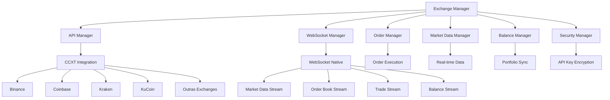
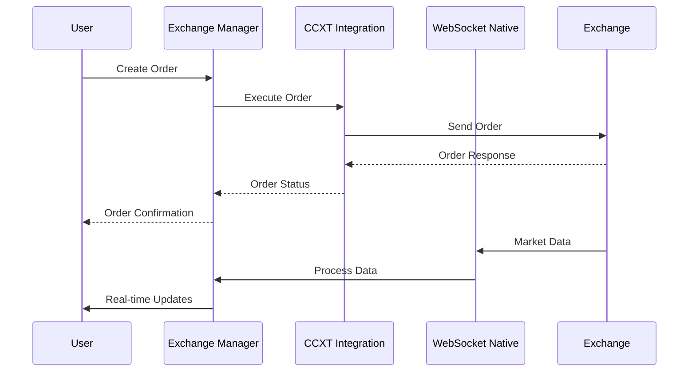

# Módulo de Exchanges - BotCriptoFy2

## 🏦 Visão Geral

O **Módulo de Exchanges** é responsável por gerenciar todas as integrações com exchanges de criptomoedas, fornecendo uma interface unificada para operações de trading, dados de mercado e gestão de carteiras através do **CCXT** e **WebSocket nativo**.

## 🎯 Objetivos

- **Integração Unificada**: Interface única para múltiplas exchanges
- **Gestão de APIs**: Gerenciamento seguro de chaves de API
- **Dados em Tempo Real**: WebSocket nativo para dados de mercado
- **Operações de Trading**: Execução de ordens e gestão de posições
- **Monitoramento**: Status e performance das exchanges
- **Fallback**: Sistema de fallback entre exchanges

## 🏗️ Arquitetura do Módulo

### **Componentes Principais**



### **Fluxo de Dados**



## 📊 Estrutura de Dados

### **1. Tabela de Exchanges**

```sql
CREATE TABLE exchanges (
    id UUID PRIMARY KEY DEFAULT gen_random_uuid(),
    name VARCHAR(100) NOT NULL UNIQUE,
    display_name VARCHAR(100) NOT NULL,
    country VARCHAR(100),
    website VARCHAR(255),
    api_docs_url VARCHAR(255),
    logo_url VARCHAR(255),
    status VARCHAR(20) DEFAULT 'active', -- active, inactive, maintenance, error
    supported_features JSONB NOT NULL DEFAULT '{}',
    trading_fees JSONB NOT NULL DEFAULT '{}',
    withdrawal_fees JSONB NOT NULL DEFAULT '{}',
    deposit_methods JSONB NOT NULL DEFAULT '[]',
    withdrawal_methods JSONB NOT NULL DEFAULT '[]',
    supported_currencies JSONB NOT NULL DEFAULT '[]',
    supported_pairs JSONB NOT NULL DEFAULT '[]',
    rate_limits JSONB NOT NULL DEFAULT '{}',
    api_requirements JSONB NOT NULL DEFAULT '{}',
    created_at TIMESTAMP DEFAULT NOW(),
    updated_at TIMESTAMP DEFAULT NOW()
);

-- Índices
CREATE INDEX idx_exchanges_status ON exchanges(status);
CREATE INDEX idx_exchanges_name ON exchanges(name);
CREATE INDEX idx_exchanges_country ON exchanges(country);
```

### **2. Tabela de Configurações de Exchange**

```sql
CREATE TABLE exchange_configurations (
    id UUID PRIMARY KEY DEFAULT gen_random_uuid(),
    user_id UUID NOT NULL REFERENCES users(id),
    exchange_id UUID NOT NULL REFERENCES exchanges(id),
    api_key_encrypted TEXT NOT NULL,
    api_secret_encrypted TEXT NOT NULL,
    passphrase_encrypted TEXT,
    sandbox BOOLEAN DEFAULT false,
    permissions JSONB NOT NULL DEFAULT '{}',
    status VARCHAR(20) DEFAULT 'active', -- active, inactive, error, revoked
    last_sync_at TIMESTAMP,
    last_error_at TIMESTAMP,
    last_error_message TEXT,
    created_at TIMESTAMP DEFAULT NOW(),
    updated_at TIMESTAMP DEFAULT NOW(),
    UNIQUE(user_id, exchange_id)
);

-- Índices
CREATE INDEX idx_exchange_configs_user ON exchange_configurations(user_id);
CREATE INDEX idx_exchange_configs_exchange ON exchange_configurations(exchange_id);
CREATE INDEX idx_exchange_configs_status ON exchange_configurations(status);
```

### **3. Tabela de Ordens de Exchange**

```sql
CREATE TABLE exchange_orders (
    id UUID PRIMARY KEY DEFAULT gen_random_uuid(),
    user_id UUID NOT NULL REFERENCES users(id),
    exchange_id UUID NOT NULL REFERENCES exchanges(id),
    exchange_order_id VARCHAR(255) NOT NULL,
    symbol VARCHAR(50) NOT NULL,
    side VARCHAR(10) NOT NULL, -- buy, sell
    type VARCHAR(20) NOT NULL, -- market, limit, stop, stop_limit
    amount DECIMAL(20,8) NOT NULL,
    price DECIMAL(20,8),
    stop_price DECIMAL(20,8),
    filled_amount DECIMAL(20,8) DEFAULT 0,
    remaining_amount DECIMAL(20,8) DEFAULT 0,
    average_price DECIMAL(20,8),
    status VARCHAR(20) NOT NULL, -- pending, filled, cancelled, rejected, expired
    time_in_force VARCHAR(10) DEFAULT 'GTC', -- GTC, IOC, FOK
    created_at TIMESTAMP DEFAULT NOW(),
    updated_at TIMESTAMP DEFAULT NOW(),
    filled_at TIMESTAMP,
    cancelled_at TIMESTAMP,
    UNIQUE(exchange_id, exchange_order_id)
);

-- Índices
CREATE INDEX idx_exchange_orders_user ON exchange_orders(user_id);
CREATE INDEX idx_exchange_orders_exchange ON exchange_orders(exchange_id);
CREATE INDEX idx_exchange_orders_symbol ON exchange_orders(symbol);
CREATE INDEX idx_exchange_orders_status ON exchange_orders(status);
CREATE INDEX idx_exchange_orders_created ON exchange_orders(created_at);
```

### **4. Tabela de Balances de Exchange**

```sql
CREATE TABLE exchange_balances (
    id UUID PRIMARY KEY DEFAULT gen_random_uuid(),
    user_id UUID NOT NULL REFERENCES users(id),
    exchange_id UUID NOT NULL REFERENCES exchanges(id),
    currency VARCHAR(10) NOT NULL,
    free_balance DECIMAL(20,8) DEFAULT 0,
    used_balance DECIMAL(20,8) DEFAULT 0,
    total_balance DECIMAL(20,8) DEFAULT 0,
    last_updated TIMESTAMP DEFAULT NOW(),
    created_at TIMESTAMP DEFAULT NOW(),
    UNIQUE(user_id, exchange_id, currency)
);

-- Índices
CREATE INDEX idx_exchange_balances_user ON exchange_balances(user_id);
CREATE INDEX idx_exchange_balances_exchange ON exchange_balances(exchange_id);
CREATE INDEX idx_exchange_balances_currency ON exchange_balances(currency);
CREATE INDEX idx_exchange_balances_updated ON exchange_balances(last_updated);
```

### **5. Tabela de Dados de Mercado**

```sql
CREATE TABLE market_data (
    id UUID PRIMARY KEY DEFAULT gen_random_uuid(),
    exchange_id UUID NOT NULL REFERENCES exchanges(id),
    symbol VARCHAR(50) NOT NULL,
    timeframe VARCHAR(10) NOT NULL, -- 1m, 5m, 15m, 1h, 4h, 1d
    open_price DECIMAL(20,8) NOT NULL,
    high_price DECIMAL(20,8) NOT NULL,
    low_price DECIMAL(20,8) NOT NULL,
    close_price DECIMAL(20,8) NOT NULL,
    volume DECIMAL(20,8) NOT NULL,
    timestamp TIMESTAMP NOT NULL,
    created_at TIMESTAMP DEFAULT NOW()
);

-- Índices
CREATE INDEX idx_market_data_exchange ON market_data(exchange_id);
CREATE INDEX idx_market_data_symbol ON market_data(symbol);
CREATE INDEX idx_market_data_timeframe ON market_data(timeframe);
CREATE INDEX idx_market_data_timestamp ON market_data(timestamp);
CREATE INDEX idx_market_data_symbol_timeframe ON market_data(symbol, timeframe);
```

### **6. Tabela de Logs de Exchange**

```sql
CREATE TABLE exchange_logs (
    id UUID PRIMARY KEY DEFAULT gen_random_uuid(),
    user_id UUID REFERENCES users(id),
    exchange_id UUID NOT NULL REFERENCES exchanges(id),
    action VARCHAR(100) NOT NULL,
    request_data JSONB,
    response_data JSONB,
    status_code INTEGER,
    error_message TEXT,
    execution_time INTEGER, -- milliseconds
    ip_address INET,
    user_agent TEXT,
    created_at TIMESTAMP DEFAULT NOW()
);

-- Índices
CREATE INDEX idx_exchange_logs_user ON exchange_logs(user_id);
CREATE INDEX idx_exchange_logs_exchange ON exchange_logs(exchange_id);
CREATE INDEX idx_exchange_logs_action ON exchange_logs(action);
CREATE INDEX idx_exchange_logs_created ON exchange_logs(created_at);
```

## 🔧 Implementação dos Serviços

### **1. Exchange Manager Service**

```typescript
// backend/src/trading/exchanges/exchange-manager.service.ts
import { Database } from 'drizzle-orm';
import { Redis } from 'ioredis';
import { ExchangeConfiguration, Exchange, ExchangeOrder, ExchangeBalance, MarketData } from './types';
import { CCXTIntegration } from './integrations/ccxt.integration';
import { WebSocketIntegration } from './integrations/websocket.integration';
import { SecurityService } from '../security/security.service';
import { AuditService } from '../audit/audit.service';

export class ExchangeManagerService {
  constructor(
    private db: Database,
    private redis: Redis,
    private ccxtIntegration: CCXTIntegration,
    private websocketIntegration: WebSocketIntegration,
    private securityService: SecurityService,
    private auditService: AuditService
  ) {}

  // Gerenciar configurações de exchange
  async createExchangeConfiguration(
    userId: string,
    exchangeId: string,
    apiKey: string,
    apiSecret: string,
    passphrase?: string,
    sandbox: boolean = false
  ): Promise<ExchangeConfiguration> {
    try {
      // Validar exchange
      const exchange = await this.getExchange(exchangeId);
      if (!exchange) {
        throw new Error('Exchange não encontrada');
      }

      // Criptografar credenciais
      const encryptedApiKey = await this.securityService.encrypt(apiKey);
      const encryptedApiSecret = await this.securityService.encrypt(apiSecret);
      const encryptedPassphrase = passphrase ? await this.securityService.encrypt(passphrase) : null;

      // Criar configuração
      const config = await this.db.insert(exchangeConfigurations).values({
        userId,
        exchangeId,
        apiKeyEncrypted: encryptedApiKey,
        apiSecretEncrypted: encryptedApiSecret,
        passphraseEncrypted: encryptedPassphrase,
        sandbox,
        status: 'active'
      }).returning();

      // Testar conexão
      await this.testExchangeConnection(userId, exchangeId);

      // Log de auditoria
      await this.auditService.logAction(userId, 'exchange_config_created', {
        exchangeId,
        sandbox
      });

      return config[0];
    } catch (error) {
      await this.auditService.logAction(userId, 'exchange_config_error', {
        exchangeId,
        error: error.message
      });
      throw error;
    }
  }

  async updateExchangeConfiguration(
    userId: string,
    configId: string,
    updates: Partial<ExchangeConfiguration>
  ): Promise<ExchangeConfiguration> {
    try {
      // Atualizar configuração
      const config = await this.db.update(exchangeConfigurations)
        .set({ ...updates, updatedAt: new Date() })
        .where(eq(exchangeConfigurations.id, configId))
        .returning();

      // Testar conexão se credenciais foram atualizadas
      if (updates.apiKeyEncrypted || updates.apiSecretEncrypted) {
        await this.testExchangeConnection(userId, config[0].exchangeId);
      }

      // Log de auditoria
      await this.auditService.logAction(userId, 'exchange_config_updated', {
        configId,
        updates: Object.keys(updates)
      });

      return config[0];
    } catch (error) {
      await this.auditService.logAction(userId, 'exchange_config_update_error', {
        configId,
        error: error.message
      });
      throw error;
    }
  }

  async deleteExchangeConfiguration(
    userId: string,
    configId: string
  ): Promise<void> {
    try {
      // Deletar configuração
      await this.db.delete(exchangeConfigurations)
        .where(eq(exchangeConfigurations.id, configId));

      // Log de auditoria
      await this.auditService.logAction(userId, 'exchange_config_deleted', {
        configId
      });
    } catch (error) {
      await this.auditService.logAction(userId, 'exchange_config_delete_error', {
        configId,
        error: error.message
      });
      throw error;
    }
  }

  // Gerenciar ordens
  async createOrder(
    userId: string,
    exchangeId: string,
    orderData: CreateOrderRequest
  ): Promise<ExchangeOrder> {
    try {
      // Obter configuração da exchange
      const config = await this.getExchangeConfiguration(userId, exchangeId);
      if (!config) {
        throw new Error('Configuração de exchange não encontrada');
      }

      // Criar ordem via CCXT
      const ccxtOrder = await this.ccxtIntegration.createOrder(
        exchangeId,
        config,
        orderData
      );

      // Salvar ordem no banco
      const order = await this.db.insert(exchangeOrders).values({
        userId,
        exchangeId,
        exchangeOrderId: ccxtOrder.id,
        symbol: orderData.symbol,
        side: orderData.side,
        type: orderData.type,
        amount: orderData.amount,
        price: orderData.price,
        stopPrice: orderData.stopPrice,
        status: ccxtOrder.status,
        timeInForce: orderData.timeInForce || 'GTC'
      }).returning();

      // Log de auditoria
      await this.auditService.logAction(userId, 'exchange_order_created', {
        exchangeId,
        orderId: order[0].id,
        symbol: orderData.symbol,
        side: orderData.side,
        amount: orderData.amount
      });

      return order[0];
    } catch (error) {
      await this.auditService.logAction(userId, 'exchange_order_error', {
        exchangeId,
        error: error.message
      });
      throw error;
    }
  }

  async cancelOrder(
    userId: string,
    exchangeId: string,
    orderId: string
  ): Promise<ExchangeOrder> {
    try {
      // Obter ordem
      const order = await this.getExchangeOrder(userId, exchangeId, orderId);
      if (!order) {
        throw new Error('Ordem não encontrada');
      }

      // Cancelar ordem via CCXT
      await this.ccxtIntegration.cancelOrder(exchangeId, order.exchangeOrderId);

      // Atualizar status da ordem
      const updatedOrder = await this.db.update(exchangeOrders)
        .set({ 
          status: 'cancelled',
          cancelledAt: new Date(),
          updatedAt: new Date()
        })
        .where(eq(exchangeOrders.id, orderId))
        .returning();

      // Log de auditoria
      await this.auditService.logAction(userId, 'exchange_order_cancelled', {
        exchangeId,
        orderId,
        symbol: order.symbol
      });

      return updatedOrder[0];
    } catch (error) {
      await this.auditService.logAction(userId, 'exchange_order_cancel_error', {
        exchangeId,
        orderId,
        error: error.message
      });
      throw error;
    }
  }

  // Gerenciar balances
  async syncExchangeBalances(
    userId: string,
    exchangeId: string
  ): Promise<ExchangeBalance[]> {
    try {
      // Obter configuração da exchange
      const config = await this.getExchangeConfiguration(userId, exchangeId);
      if (!config) {
        throw new Error('Configuração de exchange não encontrada');
      }

      // Obter balances via CCXT
      const ccxtBalances = await this.ccxtIntegration.fetchBalances(
        exchangeId,
        config
      );

      // Atualizar balances no banco
      const balances: ExchangeBalance[] = [];
      for (const [currency, balance] of Object.entries(ccxtBalances)) {
        if (balance.total > 0) {
          const updatedBalance = await this.db.insert(exchangeBalances)
            .values({
              userId,
              exchangeId,
              currency,
              freeBalance: balance.free,
              usedBalance: balance.used,
              totalBalance: balance.total,
              lastUpdated: new Date()
            })
            .onConflictDoUpdate({
              target: [exchangeBalances.userId, exchangeBalances.exchangeId, exchangeBalances.currency],
              set: {
                freeBalance: balance.free,
                usedBalance: balance.used,
                totalBalance: balance.total,
                lastUpdated: new Date()
              }
            })
            .returning();

          balances.push(updatedBalance[0]);
        }
      }

      // Log de auditoria
      await this.auditService.logAction(userId, 'exchange_balances_synced', {
        exchangeId,
        balancesCount: balances.length
      });

      return balances;
    } catch (error) {
      await this.auditService.logAction(userId, 'exchange_balances_sync_error', {
        exchangeId,
        error: error.message
      });
      throw error;
    }
  }

  // Gerenciar dados de mercado
  async getMarketData(
    exchangeId: string,
    symbol: string,
    timeframe: string,
    limit: number = 100
  ): Promise<MarketData[]> {
    try {
      // Obter dados do banco
      const data = await this.db.select()
        .from(marketData)
        .where(
          and(
            eq(marketData.exchangeId, exchangeId),
            eq(marketData.symbol, symbol),
            eq(marketData.timeframe, timeframe)
          )
        )
        .orderBy(desc(marketData.timestamp))
        .limit(limit);

      return data;
    } catch (error) {
      throw new Error(`Erro ao obter dados de mercado: ${error.message}`);
    }
  }

  async startMarketDataStream(
    exchangeId: string,
    symbols: string[]
  ): Promise<void> {
    try {
      // Iniciar stream via WebSocket nativo
      await this.websocketIntegration.startMarketDataStream(exchangeId, symbols);
    } catch (error) {
      throw new Error(`Erro ao iniciar stream de dados: ${error.message}`);
    }
  }

  // Utilitários
  async getExchange(exchangeId: string): Promise<Exchange | null> {
    const exchange = await this.db.select()
      .from(exchanges)
      .where(eq(exchanges.id, exchangeId))
      .limit(1);

    return exchange[0] || null;
  }

  async getExchangeConfiguration(
    userId: string,
    exchangeId: string
  ): Promise<ExchangeConfiguration | null> {
    const config = await this.db.select()
      .from(exchangeConfigurations)
      .where(
        and(
          eq(exchangeConfigurations.userId, userId),
          eq(exchangeConfigurations.exchangeId, exchangeId)
        )
      )
      .limit(1);

    return config[0] || null;
  }

  async getExchangeOrder(
    userId: string,
    exchangeId: string,
    orderId: string
  ): Promise<ExchangeOrder | null> {
    const order = await this.db.select()
      .from(exchangeOrders)
      .where(
        and(
          eq(exchangeOrders.userId, userId),
          eq(exchangeOrders.exchangeId, exchangeId),
          eq(exchangeOrders.id, orderId)
        )
      )
      .limit(1);

    return order[0] || null;
  }

  async testExchangeConnection(
    userId: string,
    exchangeId: string
  ): Promise<boolean> {
    try {
      const config = await this.getExchangeConfiguration(userId, exchangeId);
      if (!config) {
        throw new Error('Configuração não encontrada');
      }

      // Testar conexão via CCXT
      const result = await this.ccxtIntegration.testConnection(exchangeId, config);
      
      // Atualizar status da configuração
      await this.db.update(exchangeConfigurations)
        .set({ 
          status: result ? 'active' : 'error',
          lastSyncAt: new Date()
        })
        .where(eq(exchangeConfigurations.id, config.id));

      return result;
    } catch (error) {
      // Atualizar status de erro
      await this.db.update(exchangeConfigurations)
        .set({ 
          status: 'error',
          lastErrorAt: new Date(),
          lastErrorMessage: error.message
        })
        .where(
          and(
            eq(exchangeConfigurations.userId, userId),
            eq(exchangeConfigurations.exchangeId, exchangeId)
          )
        );

      throw error;
    }
  }

  // Obter exchanges disponíveis
  async getAvailableExchanges(): Promise<Exchange[]> {
    const exchanges = await this.db.select()
      .from(exchanges)
      .where(eq(exchanges.status, 'active'))
      .orderBy(asc(exchanges.displayName));

    return exchanges;
  }

  // Obter configurações do usuário
  async getUserExchangeConfigurations(userId: string): Promise<ExchangeConfiguration[]> {
    const configs = await this.db.select()
      .from(exchangeConfigurations)
      .where(eq(exchangeConfigurations.userId, userId))
      .orderBy(desc(exchangeConfigurations.createdAt));

    return configs;
  }
}
```

### **2. CCXT Integration Service**

```typescript
// backend/src/trading/exchanges/integrations/ccxt.integration.ts
import ccxt from 'ccxt';
import { ExchangeConfiguration } from '../types';

export class CCXTIntegration {
  private exchanges: Map<string, ccxt.Exchange> = new Map();

  async initializeExchange(
    exchangeId: string,
    config: ExchangeConfiguration
  ): Promise<ccxt.Exchange> {
    try {
      // Obter classe da exchange
      const ExchangeClass = ccxt[exchangeId];
      if (!ExchangeClass) {
        throw new Error(`Exchange ${exchangeId} não suportada`);
      }

      // Criar instância da exchange
      const exchange = new ExchangeClass({
        apiKey: config.apiKeyEncrypted,
        secret: config.apiSecretEncrypted,
        passphrase: config.passphraseEncrypted,
        sandbox: config.sandbox,
        enableRateLimit: true,
        timeout: 30000
      });

      // Armazenar instância
      this.exchanges.set(exchangeId, exchange);

      return exchange;
    } catch (error) {
      throw new Error(`Erro ao inicializar exchange ${exchangeId}: ${error.message}`);
    }
  }

  async createOrder(
    exchangeId: string,
    config: ExchangeConfiguration,
    orderData: CreateOrderRequest
  ): Promise<ccxt.Order> {
    try {
      const exchange = await this.getExchange(exchangeId, config);
      
      const order = await exchange.createOrder(
        orderData.symbol,
        orderData.type,
        orderData.side,
        orderData.amount,
        orderData.price,
        {
          stopPrice: orderData.stopPrice,
          timeInForce: orderData.timeInForce
        }
      );

      return order;
    } catch (error) {
      throw new Error(`Erro ao criar ordem: ${error.message}`);
    }
  }

  async cancelOrder(
    exchangeId: string,
    orderId: string
  ): Promise<ccxt.Order> {
    try {
      const exchange = this.exchanges.get(exchangeId);
      if (!exchange) {
        throw new Error(`Exchange ${exchangeId} não inicializada`);
      }

      const order = await exchange.cancelOrder(orderId);
      return order;
    } catch (error) {
      throw new Error(`Erro ao cancelar ordem: ${error.message}`);
    }
  }

  async fetchBalances(
    exchangeId: string,
    config: ExchangeConfiguration
  ): Promise<ccxt.Balances> {
    try {
      const exchange = await this.getExchange(exchangeId, config);
      const balances = await exchange.fetchBalance();
      return balances;
    } catch (error) {
      throw new Error(`Erro ao obter balances: ${error.message}`);
    }
  }

  async fetchTicker(
    exchangeId: string,
    symbol: string
  ): Promise<ccxt.Ticker> {
    try {
      const exchange = this.exchanges.get(exchangeId);
      if (!exchange) {
        throw new Error(`Exchange ${exchangeId} não inicializada`);
      }

      const ticker = await exchange.fetchTicker(symbol);
      return ticker;
    } catch (error) {
      throw new Error(`Erro ao obter ticker: ${error.message}`);
    }
  }

  async fetchOHLCV(
    exchangeId: string,
    symbol: string,
    timeframe: string,
    since?: number,
    limit?: number
  ): Promise<ccxt.OHLCV[]> {
    try {
      const exchange = this.exchanges.get(exchangeId);
      if (!exchange) {
        throw new Error(`Exchange ${exchangeId} não inicializada`);
      }

      const ohlcv = await exchange.fetchOHLCV(symbol, timeframe, since, limit);
      return ohlcv;
    } catch (error) {
      throw new Error(`Erro ao obter dados OHLCV: ${error.message}`);
    }
  }

  async testConnection(
    exchangeId: string,
    config: ExchangeConfiguration
  ): Promise<boolean> {
    try {
      const exchange = await this.getExchange(exchangeId, config);
      await exchange.fetchBalance();
      return true;
    } catch (error) {
      return false;
    }
  }

  private async getExchange(
    exchangeId: string,
    config: ExchangeConfiguration
  ): Promise<ccxt.Exchange> {
    let exchange = this.exchanges.get(exchangeId);
    
    if (!exchange) {
      exchange = await this.initializeExchange(exchangeId, config);
    }

    return exchange;
  }
}
```

### **3. WebSocket Integration Service**

```typescript
// backend/src/trading/exchanges/integrations/websocket.integration.ts
import WebSocket from 'ws';
import { EventEmitter } from 'events';
import { ExchangeConfiguration } from '../types';

export class WebSocketIntegration extends EventEmitter {
  private connections: Map<string, WebSocket> = new Map();
  private reconnectIntervals: Map<string, NodeJS.Timeout> = new Map();
  private exchangeConfigs: Map<string, any> = new Map();

  // URLs WebSocket por exchange
  private wsUrls: Record<string, string> = {
    'binance': 'wss://stream.binance.com:9443/ws/',
    'coinbase': 'wss://ws-feed.exchange.coinbase.com',
    'kraken': 'wss://ws.kraken.com/',
    'kucoin': 'wss://ws-api.kucoin.com/endpoint',
    'okx': 'wss://ws.okx.com:8443/ws/v5/public'
  };

  async startMarketDataStream(
    exchangeId: string,
    symbols: string[]
  ): Promise<void> {
    try {
      const wsUrl = this.getWebSocketUrl(exchangeId, symbols);
      if (!wsUrl) {
        throw new Error(`WebSocket não suportado para exchange ${exchangeId}`);
      }

      // Criar conexão WebSocket
      const ws = new WebSocket(wsUrl);
      
      // Configurar handlers
      ws.on('open', () => {
        console.log(`WebSocket conectado para ${exchangeId}`);
        this.emit('connected', exchangeId);
        this.subscribeToSymbols(exchangeId, symbols);
      });

      ws.on('message', (data) => {
        this.handleMessage(exchangeId, data);
      });

      ws.on('close', (code, reason) => {
        console.log(`WebSocket fechado para ${exchangeId}: ${code} - ${reason}`);
        this.emit('disconnected', exchangeId);
        this.scheduleReconnect(exchangeId, symbols);
      });

      ws.on('error', (error) => {
        console.error(`Erro no WebSocket ${exchangeId}:`, error);
        this.emit('error', exchangeId, error);
      });

      // Armazenar conexão
      this.connections.set(exchangeId, ws);
    } catch (error) {
      throw new Error(`Erro ao iniciar WebSocket: ${error.message}`);
    }
  }

  async stopMarketDataStream(exchangeId: string): Promise<void> {
    try {
      const ws = this.connections.get(exchangeId);
      if (ws) {
        ws.close();
        this.connections.delete(exchangeId);
      }

      // Limpar intervalo de reconexão
      const interval = this.reconnectIntervals.get(exchangeId);
      if (interval) {
        clearInterval(interval);
        this.reconnectIntervals.delete(exchangeId);
      }
    } catch (error) {
      throw new Error(`Erro ao parar WebSocket: ${error.message}`);
    }
  }

  private getWebSocketUrl(exchangeId: string, symbols: string[]): string | null {
    const baseUrl = this.wsUrls[exchangeId];
    if (!baseUrl) return null;

    // Construir URL específica por exchange
    switch (exchangeId) {
      case 'binance':
        const streams = symbols.map(symbol => 
          `${symbol.toLowerCase()}@ticker`
        ).join('/');
        return `${baseUrl}${streams}`;
      
      case 'coinbase':
        return baseUrl;
      
      case 'kraken':
        return baseUrl;
      
      case 'kucoin':
        return baseUrl;
      
      case 'okx':
        return baseUrl;
      
      default:
        return null;
    }
  }

  private subscribeToSymbols(exchangeId: string, symbols: string[]): void {
    const ws = this.connections.get(exchangeId);
    if (!ws) return;

    const subscription = this.buildSubscription(exchangeId, symbols);
    if (subscription) {
      ws.send(JSON.stringify(subscription));
    }
  }

  private buildSubscription(exchangeId: string, symbols: string[]): any {
    switch (exchangeId) {
      case 'coinbase':
        return {
          type: 'subscribe',
          product_ids: symbols,
          channels: ['ticker', 'level2', 'matches']
        };
      
      case 'kraken':
        return {
          event: 'subscribe',
          pair: symbols,
          subscription: { name: 'ticker' }
        };
      
      case 'kucoin':
        return {
          id: Date.now(),
          type: 'subscribe',
          topic: `/market/ticker:${symbols.join(',')}`,
          response: true
        };
      
      case 'okx':
        return {
          op: 'subscribe',
          args: symbols.map(symbol => ({
            channel: 'tickers',
            instId: symbol
          }))
        };
      
      default:
        return null;
    }
  }

  private handleMessage(exchangeId: string, data: Buffer): void {
    try {
      const message = JSON.parse(data.toString());
      
      // Processar mensagem baseada no tipo de exchange
      switch (exchangeId) {
        case 'binance':
          this.handleBinanceMessage(message);
          break;
        case 'coinbase':
          this.handleCoinbaseMessage(message);
          break;
        case 'kraken':
          this.handleKrakenMessage(message);
          break;
        case 'kucoin':
          this.handleKucoinMessage(message);
          break;
        case 'okx':
          this.handleOkxMessage(message);
          break;
        default:
          console.log(`Mensagem não processada de ${exchangeId}:`, message);
      }
    } catch (error) {
      console.error(`Erro ao processar mensagem de ${exchangeId}:`, error);
    }
  }

  private handleBinanceMessage(message: any): void {
    if (message.e === '24hrTicker') {
      this.emit('ticker', {
        exchange: 'binance',
        symbol: message.s,
        price: parseFloat(message.c),
        volume: parseFloat(message.v),
        timestamp: message.E
      });
    }
  }

  private handleCoinbaseMessage(message: any): void {
    if (message.type === 'ticker') {
      this.emit('ticker', {
        exchange: 'coinbase',
        symbol: message.product_id,
        price: parseFloat(message.price),
        volume: parseFloat(message.volume_24h),
        timestamp: new Date(message.time).getTime()
      });
    }
  }

  private handleKrakenMessage(message: any): void {
    if (Array.isArray(message) && message[1] && message[1].a) {
      this.emit('ticker', {
        exchange: 'kraken',
        symbol: message[3],
        price: parseFloat(message[1].a[0]),
        volume: parseFloat(message[1].v[1]),
        timestamp: Date.now()
      });
    }
  }

  private handleKucoinMessage(message: any): void {
    if (message.type === 'message' && message.topic.includes('ticker')) {
      const data = message.data;
      this.emit('ticker', {
        exchange: 'kucoin',
        symbol: data.symbol,
        price: parseFloat(data.price),
        volume: parseFloat(data.vol),
        timestamp: data.time
      });
    }
  }

  private handleOkxMessage(message: any): void {
    if (message.arg && message.arg.channel === 'tickers' && message.data) {
      const data = message.data[0];
      this.emit('ticker', {
        exchange: 'okx',
        symbol: data.instId,
        price: parseFloat(data.last),
        volume: parseFloat(data.vol24h),
        timestamp: parseInt(data.ts)
      });
    }
  }

  private scheduleReconnect(exchangeId: string, symbols: string[]): void {
    const interval = setInterval(() => {
      console.log(`Tentando reconectar WebSocket para ${exchangeId}...`);
      this.startMarketDataStream(exchangeId, symbols);
    }, 5000);

    this.reconnectIntervals.set(exchangeId, interval);
  }

  // Métodos públicos para gerenciar streams
  async getConnectionStatus(exchangeId: string): Promise<'connected' | 'disconnected' | 'error'> {
    const ws = this.connections.get(exchangeId);
    if (!ws) return 'disconnected';
    
    switch (ws.readyState) {
      case WebSocket.OPEN:
        return 'connected';
      case WebSocket.CONNECTING:
        return 'disconnected';
      case WebSocket.CLOSING:
      case WebSocket.CLOSED:
        return 'disconnected';
      default:
        return 'error';
    }
  }

  async getAllConnections(): Promise<Record<string, string>> {
    const statuses: Record<string, string> = {};
    
    for (const [exchangeId] of this.connections) {
      statuses[exchangeId] = await this.getConnectionStatus(exchangeId);
    }
    
    return statuses;
  }
}
```

## 🔌 API Endpoints

### **1. Configurações de Exchange**

```typescript
// POST /api/exchanges/configurations
app.post('/api/exchanges/configurations', async (c) => {
  const { exchangeId, apiKey, apiSecret, passphrase, sandbox } = await c.req.json();
  const userId = c.get('userId');
  
  const config = await exchangeManagerService.createExchangeConfiguration(
    userId,
    exchangeId,
    apiKey,
    apiSecret,
    passphrase,
    sandbox
  );
  
  return c.json({ success: true, data: config });
});

// GET /api/exchanges/configurations
app.get('/api/exchanges/configurations', async (c) => {
  const userId = c.get('userId');
  
  const configs = await exchangeManagerService.getUserExchangeConfigurations(userId);
  
  return c.json({ success: true, data: configs });
});

// PUT /api/exchanges/configurations/:id
app.put('/api/exchanges/configurations/:id', async (c) => {
  const { id } = c.req.param();
  const updates = await c.req.json();
  const userId = c.get('userId');
  
  const config = await exchangeManagerService.updateExchangeConfiguration(
    userId,
    id,
    updates
  );
  
  return c.json({ success: true, data: config });
});

// DELETE /api/exchanges/configurations/:id
app.delete('/api/exchanges/configurations/:id', async (c) => {
  const { id } = c.req.param();
  const userId = c.get('userId');
  
  await exchangeManagerService.deleteExchangeConfiguration(userId, id);
  
  return c.json({ success: true, message: 'Configuração removida com sucesso' });
});
```

### **2. Ordens de Exchange**

```typescript
// POST /api/exchanges/orders
app.post('/api/exchanges/orders', async (c) => {
  const orderData = await c.req.json();
  const userId = c.get('userId');
  
  const order = await exchangeManagerService.createOrder(
    userId,
    orderData.exchangeId,
    orderData
  );
  
  return c.json({ success: true, data: order });
});

// GET /api/exchanges/orders
app.get('/api/exchanges/orders', async (c) => {
  const { exchangeId, symbol, status } = c.req.query();
  const userId = c.get('userId');
  
  const orders = await exchangeManagerService.getUserOrders(
    userId,
    exchangeId,
    symbol,
    status
  );
  
  return c.json({ success: true, data: orders });
});

// DELETE /api/exchanges/orders/:id
app.delete('/api/exchanges/orders/:id', async (c) => {
  const { id } = c.req.param();
  const userId = c.get('userId');
  
  const order = await exchangeManagerService.cancelOrder(userId, id);
  
  return c.json({ success: true, data: order });
});
```

### **3. Balances de Exchange**

```typescript
// GET /api/exchanges/balances
app.get('/api/exchanges/balances', async (c) => {
  const { exchangeId } = c.req.query();
  const userId = c.get('userId');
  
  const balances = await exchangeManagerService.getUserBalances(
    userId,
    exchangeId
  );
  
  return c.json({ success: true, data: balances });
});

// POST /api/exchanges/balances/sync
app.post('/api/exchanges/balances/sync', async (c) => {
  const { exchangeId } = await c.req.json();
  const userId = c.get('userId');
  
  const balances = await exchangeManagerService.syncExchangeBalances(
    userId,
    exchangeId
  );
  
  return c.json({ success: true, data: balances });
});
```

### **4. Dados de Mercado**

```typescript
// GET /api/exchanges/market-data
app.get('/api/exchanges/market-data', async (c) => {
  const { exchangeId, symbol, timeframe, limit } = c.req.query();
  
  const data = await exchangeManagerService.getMarketData(
    exchangeId,
    symbol,
    timeframe,
    parseInt(limit) || 100
  );
  
  return c.json({ success: true, data });
});

// POST /api/exchanges/market-data/stream
app.post('/api/exchanges/market-data/stream', async (c) => {
  const { exchangeId, symbols } = await c.req.json();
  
  await exchangeManagerService.startMarketDataStream(exchangeId, symbols);
  
  return c.json({ success: true, message: 'Stream iniciado com sucesso' });
});
```

## 🔒 Segurança e Validação

### **1. Validação de Dados**

```typescript
// backend/src/trading/exchanges/validators/exchange.validators.ts
import { z } from 'zod';

export const CreateExchangeConfigurationSchema = z.object({
  exchangeId: z.string().uuid(),
  apiKey: z.string().min(1),
  apiSecret: z.string().min(1),
  passphrase: z.string().optional(),
  sandbox: z.boolean().default(false)
});

export const CreateOrderSchema = z.object({
  exchangeId: z.string().uuid(),
  symbol: z.string().min(1),
  side: z.enum(['buy', 'sell']),
  type: z.enum(['market', 'limit', 'stop', 'stop_limit']),
  amount: z.number().positive(),
  price: z.number().positive().optional(),
  stopPrice: z.number().positive().optional(),
  timeInForce: z.enum(['GTC', 'IOC', 'FOK']).default('GTC')
});

export const MarketDataQuerySchema = z.object({
  exchangeId: z.string().uuid(),
  symbol: z.string().min(1),
  timeframe: z.enum(['1m', '5m', '15m', '1h', '4h', '1d']),
  limit: z.number().int().min(1).max(1000).default(100)
});
```

### **2. Middleware de Segurança**

```typescript
// backend/src/trading/exchanges/middleware/security.middleware.ts
export const exchangeSecurityMiddleware = async (c: Context, next: NextFunction) => {
  const userId = c.get('userId');
  const exchangeId = c.req.param('exchangeId') || c.req.query('exchangeId');
  
  if (exchangeId) {
    // Verificar se o usuário tem acesso à exchange
    const hasAccess = await exchangeManagerService.hasExchangeAccess(userId, exchangeId);
    if (!hasAccess) {
      return c.json({ error: 'Acesso negado à exchange' }, 403);
    }
  }
  
  await next();
};
```

## 📊 Monitoramento e Logs

### **1. Métricas de Performance**

```typescript
// backend/src/trading/exchanges/monitoring/exchange.metrics.ts
export class ExchangeMetrics {
  private static instance: ExchangeMetrics;
  private prometheus: PrometheusClient;

  constructor() {
    this.prometheus = new PrometheusClient();
  }

  static getInstance(): ExchangeMetrics {
    if (!ExchangeMetrics.instance) {
      ExchangeMetrics.instance = new ExchangeMetrics();
    }
    return ExchangeMetrics.instance;
  }

  // Métricas de ordens
  recordOrderCreated(exchangeId: string, symbol: string): void {
    this.prometheus.incrementCounter('exchange_orders_created_total', {
      exchange: exchangeId,
      symbol: symbol
    });
  }

  recordOrderFilled(exchangeId: string, symbol: string, executionTime: number): void {
    this.prometheus.incrementCounter('exchange_orders_filled_total', {
      exchange: exchangeId,
      symbol: symbol
    });
    this.prometheus.observeHistogram('exchange_order_execution_time', executionTime, {
      exchange: exchangeId,
      symbol: symbol
    });
  }

  // Métricas de API
  recordApiCall(exchangeId: string, endpoint: string, statusCode: number, duration: number): void {
    this.prometheus.incrementCounter('exchange_api_calls_total', {
      exchange: exchangeId,
      endpoint: endpoint,
      status: statusCode.toString()
    });
    this.prometheus.observeHistogram('exchange_api_duration', duration, {
      exchange: exchangeId,
      endpoint: endpoint
    });
  }

  // Métricas de conexão
  recordConnectionStatus(exchangeId: string, status: 'connected' | 'disconnected' | 'error'): void {
    this.prometheus.setGauge('exchange_connection_status', status === 'connected' ? 1 : 0, {
      exchange: exchangeId,
      status: status
    });
  }
}
```

## 🎯 Integração com Outros Módulos

### **1. Integração com Banco**
- **Sincronização de Balances**: Sincronizar balances das exchanges com carteiras internas
- **Transferências**: Transferir fundos entre exchanges e carteiras internas
- **Reconciliação**: Reconciliação automática de saldos

### **2. Integração com Auditoria**
- **Log de Operações**: Registrar todas as operações de exchange
- **Rastreamento de Ordens**: Rastrear histórico completo de ordens
- **Alertas de Segurança**: Alertas para operações suspeitas

### **3. Integração com Notificações**
- **Status de Ordens**: Notificar mudanças de status de ordens
- **Alertas de Mercado**: Alertas baseados em dados de mercado
- **Erros de API**: Notificar erros de integração

### **4. Integração com Segurança**
- **Validação de APIs**: Validar chaves de API antes de usar
- **Rate Limiting**: Implementar rate limiting por exchange
- **Monitoramento**: Monitorar uso de APIs e detectar anomalias

---

**Conclusão**: O Módulo de Exchanges fornece uma interface unificada e segura para integração com múltiplas exchanges, permitindo operações de trading, gestão de carteiras e dados de mercado em tempo real.

**Última atualização**: 2024-12-19
**Versão**: 1.0.0
**Responsável**: Agente-CTO